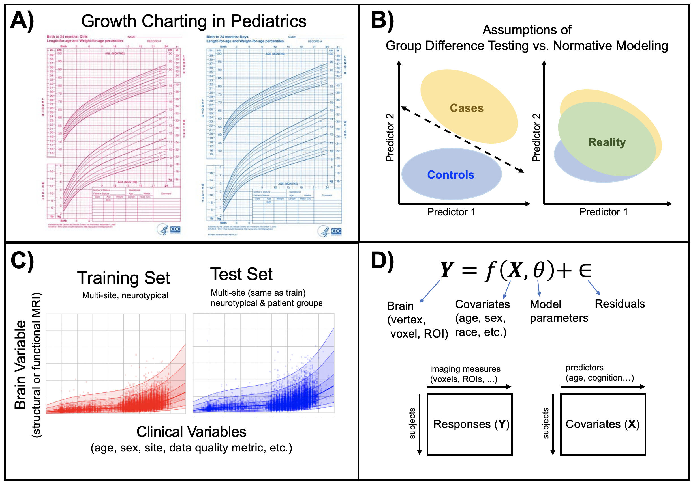
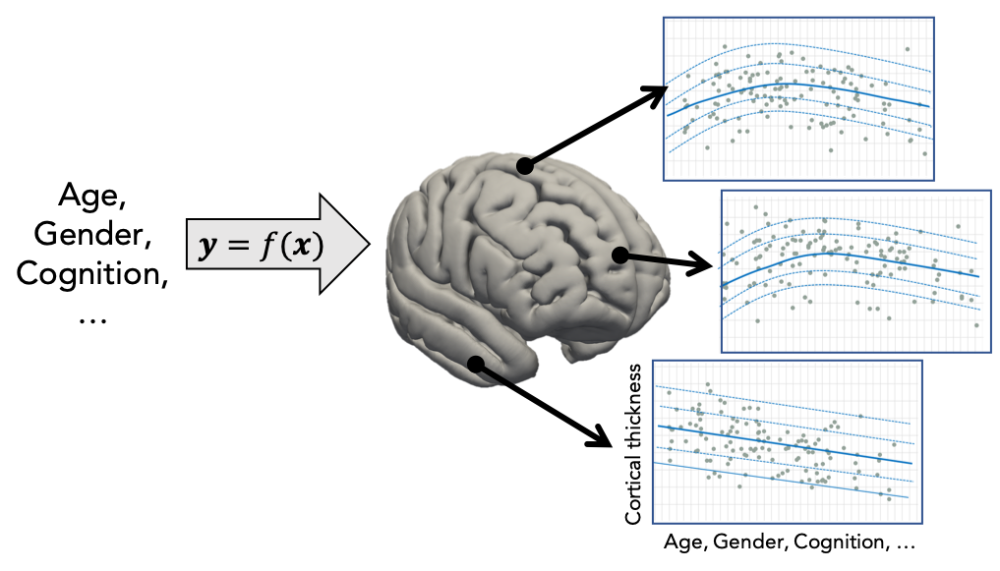
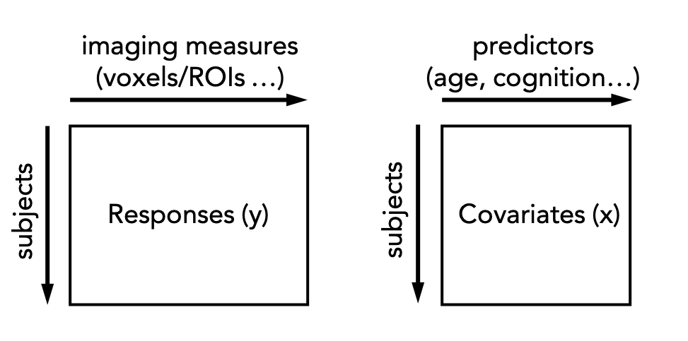
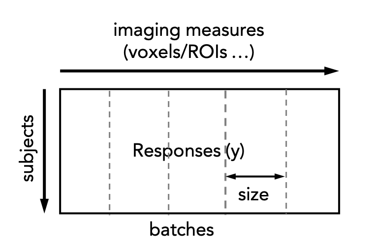

.. title:: Background

PCNtoolkit Background
====================================

What is the PCNtoolkit?
****************************

Predictive Clinical Neuroscience (PCN) toolkit (formerly nispat) is a python package designed for multi-purpose tasks in clinical neuroimaging, including normative modelling, trend surface modelling in addition to providing implementations of a number of fundamental machine learning algorithms.

Intro to normative modelling
-----------------------------------------------------

Normative modelling essentially aims to predict centiles of variance in a response variable (e.g. a region of interest or other neuroimaging-derived measure) on the basis of a set of covariates (e.g. age, clinical scores, diagnosis) A conceptual overview of the approach can be found in this `publication <https://www.nature.com/articles/s41380-019-0441-1>`_. For example, the image below shows an example of a normative model that aims to predict vertex-wise cortical thickness data, essentially fitting a separate model for each vertex.

In practice, this is done by regressing the biological response variables against a set of clinical or demographic covariates. In the instructions that follow, it is helpful to think of these as being stored in matrices as shown below: 

There are many options for this, but techniques that provide a distributional form for the centiles are appealing, since they help to estimate extreme centiles more efficiently. Bayesian methods are also beneficial in this regard because they also allow separation of modelling uncertainty from variation in the data. Many applications of normative modelling use Gaussian Process Regression, which is the default method in this toolkit. Typically (but not `always <https://link.springer.com/chapter/10.1007/978-3-030-00931-1_15>`_), each response variable is estimated independently.

Data formats
-----------------------------------------------------

Generally the covariates are specified in text format, roughly following the FSL convention in that the text file should contain one entry 
(i.e. subject) per line, with columns space or tab separated and no headers. For example: 

.. code-block:: bash

    head cov.txt
    52 55 94 4.6
    49 43 59 4.6
    56 80 63 5.6
    39 48 42 4.3

For the response variables, the following data formats are supported:

* NIfTI (e.g. .nii.gz or .img/.hdr)
* CIFTI (e.g. .dtseries.nii)
* Pickle/pandas (e.g. .pkl)
* ASCII text (e.g. .txt, .csv, .tsv)

For nifti/cifti formats, data should be in timeseries format with subjects along the time dimension and these images will be masked and reshaped into vectors. If no mask is specified, one will be created automatically from the image data.

Basic usage (command line)
-----------------------------------------------------

The simplest method to estimate a normative model is using the ``normative.py`` script which can be run from the command line or imported as a python module. For example, the following command will estimate a normative model on the basis of the matrix of covariates and responses specified in cov.txt and resp.txt respectively. These are simply tab or space separated ASCII text files that contain the variables of interest, with one subject per row.

.. code-block:: bash

    python normative.py -c cov.txt -k 5 -a blr -r resp.txt

The argument ``-a blr`` tells the script to use Bayesian Linear regression rather than the default Gaussian process regression model and ``-k 5`` tells the script to run internal 5-fold cross-validation across all subjects in the covariates and responses files. Alternatively, the model can be evaluated on a separate dataset by specifying test covariates (and optionally also test responses).
The following estimation algorithms are supported

**Table 1: Estimation algorithms**

=================  =================================  =============================================================================================  
**key value**      **Description**                    **Reference**
-----------------  ---------------------------------  ---------------------------------------------------------------------------------------------
hbr                 Hierarchical Bayesian Regression  `Kia et al 2020 <https://arxiv.org/abs/2005.12055>`_
blr                 Bayesian Linear Regression        `Huertas et al 2017 <https://www.sciencedirect.com/science/article/pii/S1053811917306560>`_
np                  Neural Processes                  `Kia et al 2018 <https://arxiv.org/abs/1812.04998>`_
rfa                 Random Feature Approximation      `Rahimi and Recht 2007 <https://people.eecs.berkeley.edu/~brecht/papers/07.rah.rec.nips.pdf>`_
=================  =================================  =============================================================================================  
   

Note that keyword arguments can also be specified from the command line to offer additional flexibility. For example, the following command will fit a normative model to the same data, but without standardizing the data first and additionally writing out model coefficients (this is not done by default because they can use a lot of disk space). 

.. code-block:: bash

    python normative.py -c cov.txt -k 5 -a blr resp.txt standardize=False savemodel=True

A full set of keyword arguments is provided in the table below. At a minimum, a set of responses and covariates must be provided and either the corresponding number of cross-validation folds or a set of test covariates.

**Table 2: Keywords and command line arguments**

============  =========================  ==========================================================================================
**Keyword**   **Command line shortcut**  **Description**
------------  -------------------------  ------------------------------------------------------------------------------------------
covfunc       -c filename                 Covariate file
cvfolds       -k num_folds                Number of cross-validation folds
testcov       -t filename                 Test covariates
testresp      -r filename                 Test responses
maskfile      -m filename                 mask to apply to the response variables (nifti/cifti only)
alg           -a algorithm                Estimation algorithm: 'gpr' (default), 'blr', 'np', 'hbr' or 'rfa'. See table above.
function      -f function                 function to call (estimate, predict, transfer, extend). See below
standardize   -s (skip)                   Standardize the covariates and response variables using the training data
configparam   -x config                   Pass the value of config to the estimation algorithm (deprecated)
outputsuffix                              Suffix to apply to the output variables 
saveoutput                                Write output (default = True)
savemodel                                 Save the model coefficients and meta-data (default = False)
warp                                      Warping function to apply to the responses (blr only)
============  =========================  ==========================================================================================

Basic usage (scripted)
-----------------------------------------------------

The same can be done using a python script. For example, the following code snippet will: 
1. Load the training and test data
2. Fit a normative model
3. Apply the model to the test data
4. Save the model, results, and plots

.. code-block:: python

    from pcntoolkit import NormData, NormativeModel, BLR

    train = NormData.from_paths("train", "cov_train.txt", "resp_train.nii.gz", maskfile="mask.nii.gz")
    test = NormData.from_paths("test", "cov_test.txt", "resp_test.nii.gz", maskfile="mask.nii.gz")
    model = NormativeModel(BLR, cv_folds=5)
    model.fit_predict(train, test)

The fit_predict function does all these operations in a single step. In some cases it may be desirable to separate these steps. For example, if a normative model has been estimated on a large dataset, it may be desirable to save the model before applying it to a new dataset (e.g. from a a different site). For example, the following code snippet will first fit a model, then apply it to a set of dummy covariates so that the normative model can be plotted 

.. code-block:: python

    from pcntoolkit import NormData, NormativeModel, BLR

    train = NormData.from_paths("train", "cov_train.txt", "resp_train.nii.gz", maskfile="mask.nii.gz")
    test = NormData.from_paths("test", "dummy_cov.txt", "dummy_resp.nii.gz", maskfile="mask.nii.gz")
    model = NormativeModel(BLR, cv_folds=5)
    model.fit(train)
    model.predict(test)

For further information, see the `developer documentation <https://amarquand.github.io/PCNtoolkit/doc/build/html/modindex.html#module-normative>`_. The same can be achieved from the command line, using te ``-f`` argument, for example, by specifying ``-f predict``.

Paralellising estimation to speed things up
-----------------------------------------------------

Normative model estimation is typically quite computationally expensive, especially for large datasets. This is exacerbated by high-resolution data (e.g. voxelwise data). For such cases normative model estimation can be paralellised across multiple compute nodes which can be achieved using the ``Runner`` class. The Runner will split the response matrix into a set of batches, each of a specified size, and submit these to a cluster. The following code snippet illustrates this procedure: 

Each of these are then submitted to a cluster and reassembled once the cluster jobs have been completed. The following code snippet illustrates this procedure: 

.. code-block:: python

    from pcntoolkit import NormData, NormativeModel, BLR, Runner

    train = NormData.from_paths("train", "cov_train.txt", "resp_train.nii.gz", maskfile="mask.nii.gz")
    test = NormData.from_paths("test", "cov_test.txt", "resp_test.nii.gz", maskfile="mask.nii.gz")
    model = NormativeModel(BLR, cv_folds=5)
    runner = Runner(
        job_type="slurm",  # or "torque" if you are on a torque cluster
        n_batches=2,
        time_limit="00:10:00",
    )
    runner.fit_predict(model, train, test)

