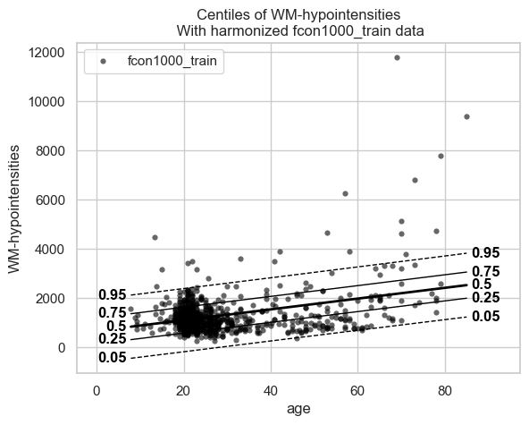
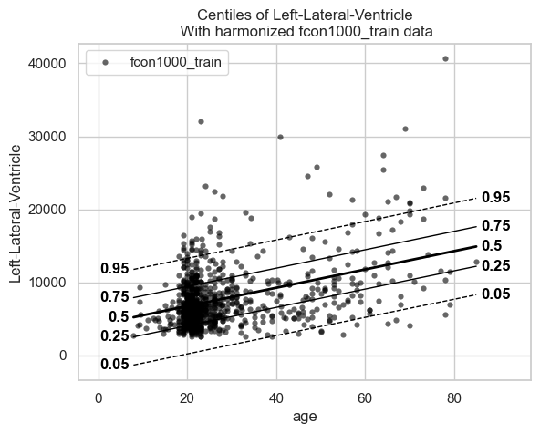

Getting started with normative modelling
========================================

Welcome to this tutorial notebook that will show you the very basics of
normative modeling. It’s like the “Hello World” of normative modeling.

Let’s jump right in.

Imports
~~~~~~~

.. code:: ipython3

    import warnings
    import pandas as pd
    import matplotlib.pyplot as plt
    from pcntoolkit import (
        BLR,
        NormativeModel,
        NormData,
        load_fcon1000,
        plot_centiles,
        plot_qq,
    )
    import pcntoolkit.util.output
    import seaborn as sns
    
    sns.set_style("darkgrid")
    warnings.simplefilter(action="ignore", category=FutureWarning)
    pd.options.mode.chained_assignment = None  # default='warn'
    pcntoolkit.util.output.Output.set_show_messages(False)

Load data
---------

First we download a small example dataset from github.

.. code:: ipython3

    # Download an example dataset
    norm_data: NormData = load_fcon1000()
    # Select only these three features to model for this example
    norm_data = norm_data.sel({"response_vars": ["WM-hypointensities", "Left-Lateral-Ventricle", "Brain-Stem"]})
    # Train-test split
    train, test = norm_data.train_test_split()

.. code:: ipython3

    # Inspect the data
    df = train.to_dataframe()
    fig, ax = plt.subplots(1, 2, figsize=(15, 5))
    
    sns.countplot(data=df, y=("batch_effects", "site"), hue=("batch_effects", "sex"), ax=ax[0], orient="h")
    ax[0].legend(title="Sex")
    ax[0].set_title("Count of sites")
    ax[0].set_xlabel("Site")
    ax[0].set_ylabel("Count")
    
    scatter_feature = "Left-Lateral-Ventricle"
    
    sns.scatterplot(
        data=df,
        x=("X", "age"),
        y=("Y", scatter_feature),
        hue=("batch_effects", "site"),
        style=("batch_effects", "sex"),
        ax=ax[1],
    )
    ax[1].legend([], [])
    ax[1].set_title(f"Scatter plot of age vs {scatter_feature}")
    ax[1].set_xlabel("Age")
    ax[1].set_ylabel(scatter_feature)
    
    plt.show()

.. image:: 00_getting_started_files/00_getting_started_6_0.png

Creating a Normative model
--------------------------

.. code:: ipython3

    save_dir = "/Users/stijndeboer/Projects/PCN/PCNtoolkit/examples/saves"
    model = NormativeModel(BLR(), inscaler="standardize", outscaler="standardize")

.. code:: ipython3

    model.has_batch_effect

.. parsed-literal::

    False

Fit the model
-------------

With all that configured, we can fit the model.

The ``fit_predict`` function will fit the model, evaluate it, save the
results and plots, and return the test data with all the predictions
added.

After that, it will compute Z-scores and centiles for the test set.

All results can be found in the save directory.

.. code:: ipython3

    model.fit_predict(train, test)

.. raw:: html

    
<svg style="position: absolute; width: 0; height: 0; overflow: hidden">
    <defs>
    <symbol id="icon-database" viewBox="0 0 32 32">
    <path d="M16 0c-8.837 0-16 2.239-16 5v4c0 2.761 7.163 5 16 5s16-2.239 16-5v-4c0-2.761-7.163-5-16-5z"></path>
    <path d="M16 17c-8.837 0-16-2.239-16-5v6c0 2.761 7.163 5 16 5s16-2.239 16-5v-6c0 2.761-7.163 5-16 5z"></path>
    <path d="M16 26c-8.837 0-16-2.239-16-5v6c0 2.761 7.163 5 16 5s16-2.239 16-5v-6c0 2.761-7.163 5-16 5z"></path>
    </symbol>
    <symbol id="icon-file-text2" viewBox="0 0 32 32">
    <path d="M28.681 7.159c-0.694-0.947-1.662-2.053-2.724-3.116s-2.169-2.030-3.116-2.724c-1.612-1.182-2.393-1.319-2.841-1.319h-15.5c-1.378 0-2.5 1.121-2.5 2.5v27c0 1.378 1.122 2.5 2.5 2.5h23c1.378 0 2.5-1.122 2.5-2.5v-19.5c0-0.448-0.137-1.23-1.319-2.841zM24.543 5.457c0.959 0.959 1.712 1.825 2.268 2.543h-4.811v-4.811c0.718 0.556 1.584 1.309 2.543 2.268zM28 29.5c0 0.271-0.229 0.5-0.5 0.5h-23c-0.271 0-0.5-0.229-0.5-0.5v-27c0-0.271 0.229-0.5 0.5-0.5 0 0 15.499-0 15.5 0v7c0 0.552 0.448 1 1 1h7v19.5z"></path>
    <path d="M23 26h-14c-0.552 0-1-0.448-1-1s0.448-1 1-1h14c0.552 0 1 0.448 1 1s-0.448 1-1 1z"></path>
    <path d="M23 22h-14c-0.552 0-1-0.448-1-1s0.448-1 1-1h14c0.552 0 1 0.448 1 1s-0.448 1-1 1z"></path>
    <path d="M23 18h-14c-0.552 0-1-0.448-1-1s0.448-1 1-1h14c0.552 0 1 0.448 1 1s-0.448 1-1 1z"></path>
    </symbol>
    </defs>
    </svg>
    <pre class='xr-text-repr-fallback'>&lt;xarray.NormData&gt; Size: 87kB
    Dimensions:            (observations: 216, response_vars: 3, covariates: 1,
                            batch_effect_dims: 2, centile: 5, statistic: 11)
    Coordinates:
      * observations       (observations) int64 2kB 756 769 692 616 ... 751 470 1043
      * response_vars      (response_vars) &lt;U22 264B &#x27;WM-hypointensities&#x27; ... &#x27;Br...
      * covariates         (covariates) &lt;U3 12B &#x27;age&#x27;
      * batch_effect_dims  (batch_effect_dims) &lt;U4 32B &#x27;sex&#x27; &#x27;site&#x27;
      * centile            (centile) float64 40B 0.05 0.25 0.5 0.75 0.95
      * statistic          (statistic) &lt;U8 352B &#x27;EXPV&#x27; &#x27;MACE&#x27; ... &#x27;SMSE&#x27; &#x27;ShapiroW&#x27;
    Data variables:
        subject_ids        (observations) object 2kB &#x27;Munchen_sub96752&#x27; ... &#x27;Quee...
        Y                  (observations, response_vars) float64 5kB 2.721e+03 .....
        X                  (observations, covariates) float64 2kB 63.0 ... 23.0
        batch_effects      (observations, batch_effect_dims) &lt;U17 29kB &#x27;F&#x27; ... &#x27;Q...
        Z                  (observations, response_vars) float64 5kB 0.8681 ... -...
        centiles           (centile, observations, response_vars) float64 26kB 75...
        logp               (observations, response_vars) float64 5kB -1.254 ... -...
        Yhat               (observations, response_vars) float64 5kB 2.041e+03 .....
        statistics         (response_vars, statistic) float64 264B 0.1501 ... 0.9891
        Y_harmonized       (observations, response_vars) float64 5kB 2.721e+03 .....
    Attributes:
        real_ids:                       True
        is_scaled:                      False
        name:                           fcon1000_test
        unique_batch_effects:           {np.str_(&#x27;sex&#x27;): [np.str_(&#x27;F&#x27;), np.str_(&#x27;...
        batch_effect_counts:            defaultdict(&lt;function NormData.register_b...
        covariate_ranges:               {np.str_(&#x27;age&#x27;): {&#x27;mean&#x27;: np.float64(28.2...
        batch_effect_covariate_ranges:  {np.str_(&#x27;sex&#x27;): {np.str_(&#x27;F&#x27;): {np.str_(...</pre>

xarray.NormData

<ul class='xr-sections'><li class='xr-section-item'><input id='section-f9f0bc2f-2908-424e-9640-2513de2ea2dc' class='xr-section-summary-in' type='checkbox' disabled ><label for='section-f9f0bc2f-2908-424e-9640-2513de2ea2dc' class='xr-section-summary'  title='Expand/collapse section'>Dimensions:</label>
<ul class='xr-dim-list'><li>observations: 216</li><li>response_vars: 3</li><li>covariates: 1</li><li>batch_effect_dims: 2</li><li>centile: 5</li><li>statistic: 11</li></ul>

</li><li class='xr-section-item'><input id='section-728f21ec-89f0-4abd-9dc5-52bcab103dd9' class='xr-section-summary-in' type='checkbox'  checked><label for='section-728f21ec-89f0-4abd-9dc5-52bcab103dd9' class='xr-section-summary' >Coordinates: (6)</label>

<ul class='xr-var-list'><li class='xr-var-item'>
observations

(observations)

int64

756 769 692 616 ... 751 470 1043
<input id='attrs-759c05e2-2775-48e3-9ccd-baf2707ff3ea' class='xr-var-attrs-in' type='checkbox' disabled><label for='attrs-759c05e2-2775-48e3-9ccd-baf2707ff3ea' title='Show/Hide attributes'><svg class='icon xr-icon-file-text2'><use xlink:href='#icon-file-text2'></use></svg></label><input id='data-764e4ac7-7ac8-4692-917f-d174aaf2fd71' class='xr-var-data-in' type='checkbox'><label for='data-764e4ac7-7ac8-4692-917f-d174aaf2fd71' title='Show/Hide data repr'><svg class='icon xr-icon-database'><use xlink:href='#icon-database'></use></svg></label>
<dl class='xr-attrs'></dl>

<pre>array([ 756,  769,  692, ...,  751,  470, 1043], shape=(216,))</pre>
</li><li class='xr-var-item'>
response_vars

(response_vars)

&lt;U22

&#x27;WM-hypointensities&#x27; ... &#x27;Brain-...
<input id='attrs-b01a3cff-800a-4b0a-9087-8c22d743e6ce' class='xr-var-attrs-in' type='checkbox' disabled><label for='attrs-b01a3cff-800a-4b0a-9087-8c22d743e6ce' title='Show/Hide attributes'><svg class='icon xr-icon-file-text2'><use xlink:href='#icon-file-text2'></use></svg></label><input id='data-41fa4c69-b061-45a2-9c33-1e278beb9fc7' class='xr-var-data-in' type='checkbox'><label for='data-41fa4c69-b061-45a2-9c33-1e278beb9fc7' title='Show/Hide data repr'><svg class='icon xr-icon-database'><use xlink:href='#icon-database'></use></svg></label>
<dl class='xr-attrs'></dl>

<pre>array([&#x27;WM-hypointensities&#x27;, &#x27;Left-Lateral-Ventricle&#x27;, &#x27;Brain-Stem&#x27;],
          dtype=&#x27;&lt;U22&#x27;)</pre>
</li><li class='xr-var-item'>
covariates

(covariates)

&lt;U3

&#x27;age&#x27;
<input id='attrs-6fb6c269-5d81-4d9f-8503-9d0e0ba21306' class='xr-var-attrs-in' type='checkbox' disabled><label for='attrs-6fb6c269-5d81-4d9f-8503-9d0e0ba21306' title='Show/Hide attributes'><svg class='icon xr-icon-file-text2'><use xlink:href='#icon-file-text2'></use></svg></label><input id='data-39456c37-a822-4227-9c9a-c0e227878647' class='xr-var-data-in' type='checkbox'><label for='data-39456c37-a822-4227-9c9a-c0e227878647' title='Show/Hide data repr'><svg class='icon xr-icon-database'><use xlink:href='#icon-database'></use></svg></label>
<dl class='xr-attrs'></dl>

<pre>array([&#x27;age&#x27;], dtype=&#x27;&lt;U3&#x27;)</pre>
</li><li class='xr-var-item'>
batch_effect_dims

(batch_effect_dims)

&lt;U4

&#x27;sex&#x27; &#x27;site&#x27;
<input id='attrs-285a2442-00cb-4ab3-ac96-25e501925869' class='xr-var-attrs-in' type='checkbox' disabled><label for='attrs-285a2442-00cb-4ab3-ac96-25e501925869' title='Show/Hide attributes'><svg class='icon xr-icon-file-text2'><use xlink:href='#icon-file-text2'></use></svg></label><input id='data-e9261fb2-96a8-4dc1-8a9b-08f70d84c1c2' class='xr-var-data-in' type='checkbox'><label for='data-e9261fb2-96a8-4dc1-8a9b-08f70d84c1c2' title='Show/Hide data repr'><svg class='icon xr-icon-database'><use xlink:href='#icon-database'></use></svg></label>
<dl class='xr-attrs'></dl>

<pre>array([&#x27;sex&#x27;, &#x27;site&#x27;], dtype=&#x27;&lt;U4&#x27;)</pre>
</li><li class='xr-var-item'>
centile

(centile)

float64

0.05 0.25 0.5 0.75 0.95
<input id='attrs-82f29597-053d-438c-9d3d-aac9b41130db' class='xr-var-attrs-in' type='checkbox' disabled><label for='attrs-82f29597-053d-438c-9d3d-aac9b41130db' title='Show/Hide attributes'><svg class='icon xr-icon-file-text2'><use xlink:href='#icon-file-text2'></use></svg></label><input id='data-85a610a0-14e5-4091-ab2c-29628744644c' class='xr-var-data-in' type='checkbox'><label for='data-85a610a0-14e5-4091-ab2c-29628744644c' title='Show/Hide data repr'><svg class='icon xr-icon-database'><use xlink:href='#icon-database'></use></svg></label>
<dl class='xr-attrs'></dl>

<pre>array([0.05, 0.25, 0.5 , 0.75, 0.95])</pre>
</li><li class='xr-var-item'>
statistic

(statistic)

&lt;U8

&#x27;EXPV&#x27; &#x27;MACE&#x27; ... &#x27;SMSE&#x27; &#x27;ShapiroW&#x27;
<input id='attrs-b2c98a30-595a-4ecc-bd20-9ccc35375272' class='xr-var-attrs-in' type='checkbox' disabled><label for='attrs-b2c98a30-595a-4ecc-bd20-9ccc35375272' title='Show/Hide attributes'><svg class='icon xr-icon-file-text2'><use xlink:href='#icon-file-text2'></use></svg></label><input id='data-042bc2ca-3a03-40c4-b531-412f0bf9b1f0' class='xr-var-data-in' type='checkbox'><label for='data-042bc2ca-3a03-40c4-b531-412f0bf9b1f0' title='Show/Hide data repr'><svg class='icon xr-icon-database'><use xlink:href='#icon-database'></use></svg></label>
<dl class='xr-attrs'></dl>

<pre>array([&#x27;EXPV&#x27;, &#x27;MACE&#x27;, &#x27;MAPE&#x27;, &#x27;MSLL&#x27;, &#x27;NLL&#x27;, &#x27;R2&#x27;, &#x27;RMSE&#x27;, &#x27;Rho&#x27;, &#x27;Rho_p&#x27;,
           &#x27;SMSE&#x27;, &#x27;ShapiroW&#x27;], dtype=&#x27;&lt;U8&#x27;)</pre>
</li></ul>
</li><li class='xr-section-item'><input id='section-3a70fe52-7d38-4b06-9a51-63641b805a53' class='xr-section-summary-in' type='checkbox'  checked><label for='section-3a70fe52-7d38-4b06-9a51-63641b805a53' class='xr-section-summary' >Data variables: (10)</label>

<ul class='xr-var-list'><li class='xr-var-item'>
subject_ids

(observations)

object

&#x27;Munchen_sub96752&#x27; ... &#x27;Queensla...
<input id='attrs-71de45a6-ac9f-4329-8f32-2cb0e6c5f713' class='xr-var-attrs-in' type='checkbox' disabled><label for='attrs-71de45a6-ac9f-4329-8f32-2cb0e6c5f713' title='Show/Hide attributes'><svg class='icon xr-icon-file-text2'><use xlink:href='#icon-file-text2'></use></svg></label><input id='data-76362aeb-6ae5-40dd-8e5d-0381c14acbcd' class='xr-var-data-in' type='checkbox'><label for='data-76362aeb-6ae5-40dd-8e5d-0381c14acbcd' title='Show/Hide data repr'><svg class='icon xr-icon-database'><use xlink:href='#icon-database'></use></svg></label>
<dl class='xr-attrs'></dl>

<pre>array([&#x27;Munchen_sub96752&#x27;, &#x27;NewYork_a_sub18638&#x27;, &#x27;Leiden_2200_sub87320&#x27;,
           &#x27;ICBM_sub47658&#x27;, &#x27;AnnArbor_b_sub45569&#x27;, &#x27;Beijing_Zang_sub18960&#x27;,
           &#x27;Leiden_2200_sub18456&#x27;, &#x27;Berlin_Margulies_sub27711&#x27;,
           &#x27;Beijing_Zang_sub87776&#x27;, &#x27;Milwaukee_b_sub63196&#x27;,
           &#x27;Beijing_Zang_sub07144&#x27;, &#x27;Atlanta_sub76280&#x27;,
           &#x27;Beijing_Zang_sub40037&#x27;, &#x27;Cambridge_Buckner_sub17737&#x27;,
           &#x27;ICBM_sub89049&#x27;, &#x27;ICBM_sub55656&#x27;, &#x27;Oulu_sub45566&#x27;,
           &#x27;Beijing_Zang_sub89088&#x27;, &#x27;Atlanta_sub16563&#x27;,
           &#x27;Cambridge_Buckner_sub51172&#x27;, &#x27;Oulu_sub98739&#x27;,
           &#x27;Queensland_sub49845&#x27;, &#x27;Cambridge_Buckner_sub84256&#x27;,
           &#x27;Cleveland_sub80263&#x27;, &#x27;ICBM_sub16607&#x27;, &#x27;Newark_sub46570&#x27;,
           &#x27;NewYork_a_sub88286&#x27;, &#x27;Cambridge_Buckner_sub02591&#x27;,
           &#x27;Oulu_sub66467&#x27;, &#x27;Beijing_Zang_sub74386&#x27;, &#x27;Newark_sub55760&#x27;,
           &#x27;ICBM_sub30623&#x27;, &#x27;Oulu_sub68752&#x27;, &#x27;Leiden_2180_sub19281&#x27;,
           &#x27;Beijing_Zang_sub50972&#x27;, &#x27;Beijing_Zang_sub85030&#x27;,
           &#x27;Milwaukee_b_sub36386&#x27;, &#x27;Baltimore_sub31837&#x27;, &#x27;PaloAlto_sub84978&#x27;,
           &#x27;Oulu_sub01077&#x27;, &#x27;NewYork_a_ADHD_sub54828&#x27;, &#x27;PaloAlto_sub96705&#x27;,
           &#x27;Cambridge_Buckner_sub40635&#x27;, &#x27;ICBM_sub66794&#x27;,
           &#x27;Beijing_Zang_sub46541&#x27;, &#x27;Beijing_Zang_sub87089&#x27;,
           &#x27;Pittsburgh_sub97823&#x27;, &#x27;Beijing_Zang_sub98617&#x27;, &#x27;ICBM_sub92028&#x27;,
    ...
           &#x27;Leiden_2200_sub04484&#x27;, &#x27;Beijing_Zang_sub80163&#x27;, &#x27;ICBM_sub02382&#x27;,
           &#x27;Cambridge_Buckner_sub77435&#x27;, &#x27;NewYork_a_sub54887&#x27;,
           &#x27;Oulu_sub85532&#x27;, &#x27;Baltimore_sub73823&#x27;, &#x27;Beijing_Zang_sub29590&#x27;,
           &#x27;Oulu_sub99718&#x27;, &#x27;Beijing_Zang_sub08455&#x27;, &#x27;Beijing_Zang_sub85543&#x27;,
           &#x27;Cambridge_Buckner_sub45354&#x27;, &#x27;Beijing_Zang_sub07717&#x27;,
           &#x27;Baltimore_sub76160&#x27;, &#x27;Beijing_Zang_sub17093&#x27;,
           &#x27;AnnArbor_b_sub90127&#x27;, &#x27;SaintLouis_sub73002&#x27;,
           &#x27;Queensland_sub93238&#x27;, &#x27;Cleveland_sub34189&#x27;,
           &#x27;Cambridge_Buckner_sub89107&#x27;, &#x27;Atlanta_sub75153&#x27;,
           &#x27;NewYork_a_ADHD_sub73035&#x27;, &#x27;Cambridge_Buckner_sub59434&#x27;,
           &#x27;Milwaukee_b_sub44912&#x27;, &#x27;Cleveland_sub46739&#x27;, &#x27;Oulu_sub20495&#x27;,
           &#x27;SaintLouis_sub28304&#x27;, &#x27;Cambridge_Buckner_sub35430&#x27;,
           &#x27;Oulu_sub86362&#x27;, &#x27;Newark_sub58526&#x27;, &#x27;Leiden_2180_sub12255&#x27;,
           &#x27;ICBM_sub48210&#x27;, &#x27;Cambridge_Buckner_sub77989&#x27;,
           &#x27;Berlin_Margulies_sub75506&#x27;, &#x27;NewYork_a_sub29216&#x27;,
           &#x27;Beijing_Zang_sub05267&#x27;, &#x27;AnnArbor_b_sub18546&#x27;, &#x27;Oulu_sub75620&#x27;,
           &#x27;AnnArbor_b_sub30250&#x27;, &#x27;Berlin_Margulies_sub86111&#x27;,
           &#x27;Beijing_Zang_sub89592&#x27;, &#x27;Beijing_Zang_sub68012&#x27;,
           &#x27;NewYork_a_sub50559&#x27;, &#x27;Munchen_sub66933&#x27;,
           &#x27;Cambridge_Buckner_sub59729&#x27;, &#x27;Queensland_sub86245&#x27;], dtype=object)</pre>
</li><li class='xr-var-item'>
Y

(observations, response_vars)

float64

2.721e+03 1.362e+04 ... 1.681e+04
<input id='attrs-b16d59c7-4e04-49f8-ad42-126ee7278e6f' class='xr-var-attrs-in' type='checkbox' disabled><label for='attrs-b16d59c7-4e04-49f8-ad42-126ee7278e6f' title='Show/Hide attributes'><svg class='icon xr-icon-file-text2'><use xlink:href='#icon-file-text2'></use></svg></label><input id='data-537dc998-5377-4d3a-892f-8ba0b3fcbc35' class='xr-var-data-in' type='checkbox'><label for='data-537dc998-5377-4d3a-892f-8ba0b3fcbc35' title='Show/Hide data repr'><svg class='icon xr-icon-database'><use xlink:href='#icon-database'></use></svg></label>
<dl class='xr-attrs'></dl>

<pre>array([[ 2721.4, 13617.8, 22653.2],
           [ 1143.1, 10922.3, 20821.3],
           [  955.8,  8374.3, 19278.9],
           [ 1473.9, 16068.7, 25724. ],
           [  757.8,  4107.1, 16570.4],
           [  871.1,  5962.5, 23831.3],
           [ 1207.3, 19877.6, 23995.9],
           [  595. ,  5568.6, 21180.8],
           [  682.4,  6953.8, 15396.4],
           [  445.1,  6771.1, 20429.1],
           [ 1620. ,  3980.3, 21843.1],
           [  602.8,  6051.4, 19098.4],
           [ 1432.5,  5916.8, 22060.2],
           [ 1908.2,  4656.4, 22974.4],
           [ 1834. ,  3691.9, 26658.4],
           [  459.6,  5823.6, 21087. ],
           [ 1210. ,  6667.1, 23873.9],
           [  845.9,  7648.6, 20948.3],
           [  995.2,  6850.1, 20345.2],
           [ 1734.7,  4457. , 18642.8],
    ...
           [  785.8,  6197.9, 20216. ],
           [ 2240.1,  4806.6, 27596.4],
           [  758.1,  5615.1, 24054.6],
           [ 1440.5,  7500.1, 13773.6],
           [  818.6,  9928.8, 21445.7],
           [ 3769.9, 19406.4, 23748.4],
           [  880.2,  7366.4, 21144.5],
           [  823.9, 11342.3, 25405.8],
           [ 2113.9,  8920.5, 22618.7],
           [  741.9, 11228.2, 20471.4],
           [ 1333.9,  9730.4, 22427.1],
           [  707.3,  6458.2, 21449.5],
           [ 1134.1,  6038.2, 15343. ],
           [  438.6,  7505.7, 15679.7],
           [  966.3, 10570. , 19890.2],
           [  424.3,  4887. , 21624.5],
           [  604.7,  8933.9, 18852.1],
           [ 2343.2, 19039.7, 18791.2],
           [ 2721.7,  4899.1, 23784.8],
           [  703.5, 10060.7, 16805.6]])</pre>
</li><li class='xr-var-item'>
X

(observations, covariates)

float64

63.0 23.27 22.0 ... 72.0 23.0 23.0
<input id='attrs-3aaf724c-87a3-4ac3-bec8-90f1518e20a6' class='xr-var-attrs-in' type='checkbox' disabled><label for='attrs-3aaf724c-87a3-4ac3-bec8-90f1518e20a6' title='Show/Hide attributes'><svg class='icon xr-icon-file-text2'><use xlink:href='#icon-file-text2'></use></svg></label><input id='data-1fa463b5-b773-4f65-a6af-bbf38f676a9b' class='xr-var-data-in' type='checkbox'><label for='data-1fa463b5-b773-4f65-a6af-bbf38f676a9b' title='Show/Hide data repr'><svg class='icon xr-icon-database'><use xlink:href='#icon-database'></use></svg></label>
<dl class='xr-attrs'></dl>

<pre>array([[63.  ],
           [23.27],
           [22.  ],
           [42.  ],
           [63.  ],
           [23.  ],
           [21.  ],
           [26.  ],
           [21.  ],
           [49.  ],
           [20.  ],
           [23.  ],
           [20.  ],
           [26.  ],
           [35.  ],
           [21.  ],
           [22.  ],
           [19.  ],
           [34.  ],
           [18.  ],
    ...
           [21.  ],
           [20.  ],
           [22.  ],
           [25.  ],
           [25.  ],
           [73.  ],
           [22.  ],
           [28.  ],
           [29.06],
           [19.  ],
           [20.  ],
           [22.  ],
           [19.  ],
           [24.  ],
           [21.  ],
           [24.  ],
           [22.79],
           [72.  ],
           [23.  ],
           [23.  ]])</pre>
</li><li class='xr-var-item'>
batch_effects

(observations, batch_effect_dims)

&lt;U17

&#x27;F&#x27; &#x27;Munchen&#x27; ... &#x27;M&#x27; &#x27;Queensland&#x27;
<input id='attrs-0c2b6aff-1900-433c-9625-a84b314edcd6' class='xr-var-attrs-in' type='checkbox' disabled><label for='attrs-0c2b6aff-1900-433c-9625-a84b314edcd6' title='Show/Hide attributes'><svg class='icon xr-icon-file-text2'><use xlink:href='#icon-file-text2'></use></svg></label><input id='data-92db8ab9-502f-45eb-9d3a-09e1a8aa52f5' class='xr-var-data-in' type='checkbox'><label for='data-92db8ab9-502f-45eb-9d3a-09e1a8aa52f5' title='Show/Hide data repr'><svg class='icon xr-icon-database'><use xlink:href='#icon-database'></use></svg></label>
<dl class='xr-attrs'></dl>

<pre>array([[&#x27;F&#x27;, &#x27;Munchen&#x27;],
           [&#x27;M&#x27;, &#x27;NewYork_a&#x27;],
           [&#x27;F&#x27;, &#x27;Leiden_2200&#x27;],
           [&#x27;M&#x27;, &#x27;ICBM&#x27;],
           [&#x27;F&#x27;, &#x27;AnnArbor_b&#x27;],
           [&#x27;M&#x27;, &#x27;Beijing_Zang&#x27;],
           [&#x27;M&#x27;, &#x27;Leiden_2200&#x27;],
           [&#x27;F&#x27;, &#x27;Berlin_Margulies&#x27;],
           [&#x27;F&#x27;, &#x27;Beijing_Zang&#x27;],
           [&#x27;F&#x27;, &#x27;Milwaukee_b&#x27;],
           [&#x27;M&#x27;, &#x27;Beijing_Zang&#x27;],
           [&#x27;F&#x27;, &#x27;Atlanta&#x27;],
           [&#x27;F&#x27;, &#x27;Beijing_Zang&#x27;],
           [&#x27;F&#x27;, &#x27;Cambridge_Buckner&#x27;],
           [&#x27;M&#x27;, &#x27;ICBM&#x27;],
           [&#x27;F&#x27;, &#x27;ICBM&#x27;],
           [&#x27;M&#x27;, &#x27;Oulu&#x27;],
           [&#x27;F&#x27;, &#x27;Beijing_Zang&#x27;],
           [&#x27;M&#x27;, &#x27;Atlanta&#x27;],
           [&#x27;F&#x27;, &#x27;Cambridge_Buckner&#x27;],
    ...
           [&#x27;F&#x27;, &#x27;SaintLouis&#x27;],
           [&#x27;M&#x27;, &#x27;Cambridge_Buckner&#x27;],
           [&#x27;F&#x27;, &#x27;Oulu&#x27;],
           [&#x27;F&#x27;, &#x27;Newark&#x27;],
           [&#x27;M&#x27;, &#x27;Leiden_2180&#x27;],
           [&#x27;M&#x27;, &#x27;ICBM&#x27;],
           [&#x27;F&#x27;, &#x27;Cambridge_Buckner&#x27;],
           [&#x27;M&#x27;, &#x27;Berlin_Margulies&#x27;],
           [&#x27;M&#x27;, &#x27;NewYork_a&#x27;],
           [&#x27;F&#x27;, &#x27;Beijing_Zang&#x27;],
           [&#x27;M&#x27;, &#x27;AnnArbor_b&#x27;],
           [&#x27;F&#x27;, &#x27;Oulu&#x27;],
           [&#x27;F&#x27;, &#x27;AnnArbor_b&#x27;],
           [&#x27;F&#x27;, &#x27;Berlin_Margulies&#x27;],
           [&#x27;M&#x27;, &#x27;Beijing_Zang&#x27;],
           [&#x27;F&#x27;, &#x27;Beijing_Zang&#x27;],
           [&#x27;M&#x27;, &#x27;NewYork_a&#x27;],
           [&#x27;M&#x27;, &#x27;Munchen&#x27;],
           [&#x27;M&#x27;, &#x27;Cambridge_Buckner&#x27;],
           [&#x27;M&#x27;, &#x27;Queensland&#x27;]], dtype=&#x27;&lt;U17&#x27;)</pre>
</li><li class='xr-var-item'>
Z

(observations, response_vars)

float64

0.8681 0.3703 ... 0.7406 -1.556
<input id='attrs-af74ddaa-8077-4e2f-a8a8-483367a26239' class='xr-var-attrs-in' type='checkbox' disabled><label for='attrs-af74ddaa-8077-4e2f-a8a8-483367a26239' title='Show/Hide attributes'><svg class='icon xr-icon-file-text2'><use xlink:href='#icon-file-text2'></use></svg></label><input id='data-c22d7d82-003c-4c47-bded-e39178d905d2' class='xr-var-data-in' type='checkbox'><label for='data-c22d7d82-003c-4c47-bded-e39178d905d2' title='Show/Hide data repr'><svg class='icon xr-icon-database'><use xlink:href='#icon-database'></use></svg></label>
<dl class='xr-attrs'></dl>

<pre>array([[ 8.68050427e-01,  3.70323407e-01,  8.36221702e-01],
           [-3.51254255e-02,  9.48730585e-01,  8.49790658e-02],
           [-2.39376648e-01,  3.48187823e-01, -5.45562934e-01],
           [-1.37096721e-01,  1.65029723e+00,  2.09032291e+00],
           [-1.63782699e+00, -2.01209266e+00, -1.64067079e+00],
           [-3.75946561e-01, -2.89767858e-01,  1.31513122e+00],
           [ 1.10818471e-01,  3.27173916e+00,  1.38201038e+00],
           [-8.13867842e-01, -4.83584174e-01,  2.32310274e-01],
           [-5.61464250e-01,  2.26314627e-02, -2.13233893e+00],
           [-1.64935106e+00, -9.06449218e-01, -7.15750526e-02],
           [ 6.67432756e-01, -6.93307940e-01,  5.02061271e-01],
           [-7.19607720e-01, -2.67416184e-01, -6.19211599e-01],
           [ 4.27297820e-01, -2.06486071e-01,  5.90778967e-01],
           [ 8.68309390e-01, -7.12950392e-01,  9.65409569e-01],
           [ 5.20544881e-01, -1.23956846e+00,  2.47214033e+00],
           [-8.46822585e-01, -2.61506448e-01,  1.93233044e-01],
           [ 8.62121759e-02, -8.10291138e-02,  1.33235151e+00],
           [-2.95889244e-01,  2.60439063e-01,  1.36252812e-01],
           [-5.25754725e-01, -4.13996977e-01, -1.08081102e-01],
           [ 8.70362937e-01, -5.10253867e-01, -8.05927475e-01],
    ...
           [-4.29031342e-01, -1.67405563e-01, -1.62717680e-01],
           [ 1.46160702e+00, -4.85582192e-01,  2.85314152e+00],
           [-4.92598169e-01, -3.45518463e-01,  1.40620116e+00],
           [ 2.97264178e-01,  3.36612747e-02, -2.79533212e+00],
           [-4.99360583e-01,  6.44329927e-01,  3.40435211e-01],
           [ 1.92167686e+00,  1.50198108e+00,  1.28042289e+00],
           [-3.36207943e-01,  9.47859070e-02,  2.16882593e-01],
           [-5.76806544e-01,  9.05018310e-01,  1.95951278e+00],
           [ 1.04592009e+00,  2.62583905e-01,  8.20470104e-01],
           [-4.29076719e-01,  1.16027440e+00, -5.86211131e-02],
           [ 3.01018861e-01,  7.52224942e-01,  7.40712283e-01],
           [-5.57664700e-01, -1.33549860e-01,  3.41531974e-01],
           [ 7.31937396e-02, -1.44381259e-01, -2.15422068e+00],
           [-9.58028076e-01,  6.66512514e-02, -2.01635803e+00],
           [-1.97850105e-01,  9.31762157e-01, -2.95862050e-01],
           [-9.76345269e-01, -5.91774995e-01,  4.13363274e-01],
           [-7.11274199e-01,  4.63944956e-01, -7.19899399e-01],
           [ 1.33408839e-01,  1.44213468e+00, -7.33482498e-01],
           [ 1.99445724e+00, -5.57133095e-01,  1.29612660e+00],
           [-5.90622708e-01,  7.40621663e-01, -1.55628215e+00]])</pre>
</li><li class='xr-var-item'>
centiles

(centile, observations, response_vars)

float64

752.3 5.573e+03 ... 2.464e+04
<input id='attrs-990be3d5-7c24-4a6a-9731-b98debef04c9' class='xr-var-attrs-in' type='checkbox' disabled><label for='attrs-990be3d5-7c24-4a6a-9731-b98debef04c9' title='Show/Hide attributes'><svg class='icon xr-icon-file-text2'><use xlink:href='#icon-file-text2'></use></svg></label><input id='data-25cfad0b-402e-474b-b1f7-f2cc17c60e0d' class='xr-var-data-in' type='checkbox'><label for='data-25cfad0b-402e-474b-b1f7-f2cc17c60e0d' title='Show/Hide data repr'><svg class='icon xr-icon-database'><use xlink:href='#icon-database'></use></svg></label>
<dl class='xr-attrs'></dl>

<pre>array([[[  752.29394222,  5573.13286211, 16560.12771737],
            [ -113.62127992,   606.84799863, 16588.82717329],
            [ -141.51115319,   447.02576072, 16589.08591226],
            ...,
            [  946.6875119 ,  6689.16629877, 16548.1078189 ],
            [ -119.54953172,   572.87560298, 16588.88560005],
            [ -119.54953172,   572.87560298, 16588.88560005]],
    
           [[ 1512.66892952,  9446.86418123, 18943.16589981],
            [  643.94570069,  4466.2723232 , 18963.06761723],
            [  616.09008872,  4306.62464909, 18963.43369989],
            ...,
            [ 1708.73771431, 10571.43295571, 18936.39460621],
            [  638.02408897,  4432.33375922, 18963.14684793],
            [  638.02408897,  4432.33375922, 18963.14684793]],
    
           [[ 2041.19760574, 12139.45418004, 20599.59073887],
            [ 1170.52256093,  7148.9176802 , 20613.37724056],
            [ 1142.69076363,  6989.39134356, 20613.81793668],
            ...,
            [ 2238.43081498, 13269.9557783 , 20596.46769545],
            [ 1164.60556465,  7115.00263226, 20613.47093186],
            [ 1164.60556465,  7115.00263226, 20613.47093186]],
    
           [[ 2569.72628196, 14832.04417885, 22256.01557793],
            [ 1697.09942117,  9831.5630372 , 22263.68686388],
            [ 1669.29143854,  9672.15803803, 22264.20217348],
            ...,
            [ 2768.12391565, 15968.47860088, 22256.54078469],
            [ 1691.18704034,  9797.67150529, 22263.79501579],
            [ 1691.18704034,  9797.67150529, 22263.79501579]],
    
           [[ 3330.10126925, 18705.77549797, 24639.05376037],
            [ 2454.66640178, 13690.98736177, 24637.92730782],
            [ 2426.89268045, 13531.7569264 , 24638.54996111],
            ...,
            [ 3530.17411806, 19850.74525782, 24644.827572  ],
            [ 2448.76066103, 13657.12966153, 24638.05626368],
            [ 2448.76066103, 13657.12966153, 24638.05626368]]],
          shape=(5, 216, 3))</pre>
</li><li class='xr-var-item'>
logp

(observations, response_vars)

float64

-1.254 -0.9282 ... -1.13 -2.132
<input id='attrs-58ce19ef-5821-4fc8-b710-8fa326fee55c' class='xr-var-attrs-in' type='checkbox' disabled><label for='attrs-58ce19ef-5821-4fc8-b710-8fa326fee55c' title='Show/Hide attributes'><svg class='icon xr-icon-file-text2'><use xlink:href='#icon-file-text2'></use></svg></label><input id='data-4cf0c7a4-f8da-42fa-b953-848bd529b96e' class='xr-var-data-in' type='checkbox'><label for='data-4cf0c7a4-f8da-42fa-b953-848bd529b96e' title='Show/Hide data repr'><svg class='icon xr-icon-database'><use xlink:href='#icon-database'></use></svg></label>
<dl class='xr-attrs'></dl>

<pre>array([[ -1.25430906,  -0.92819793,  -1.27414414],
           [ -0.87447043,  -1.30597291,  -0.92442284],
           [ -0.90254934,  -0.91659065,  -1.06967679],
           [ -0.88376337,  -2.21818065,  -3.10604898],
           [ -2.21879191,  -2.88388665,  -2.27041109],
           [ -0.9445302 ,  -0.89791952,  -1.78560594],
           [ -0.88008187,  -6.20815461,  -1.87587642],
           [ -1.20498112,  -0.97279202,  -0.94773333],
           [ -1.03156256,  -0.85627212,  -3.19433473],
           [ -2.23530223,  -1.26802253,  -0.92464248],
           [ -1.09672379,  -1.09640303,  -1.04698186],
           [ -1.13277993,  -0.89169252,  -1.11253238],
           [ -0.96528226,  -0.87738333,  -1.09545899],
           [ -1.25077128,  -1.11001433,  -1.38675711],
           [ -1.00939937,  -1.62425539,  -3.97661337],
           [ -1.23249575,  -0.89020884,  -0.93956958],
           [ -0.87761502,  -0.85925613,  -1.80843761],
           [ -0.9178211 ,  -0.89003467,  -0.93028683],
           [ -1.01208581,  -0.94164806,  -0.92667614],
           [ -1.25287332,  -0.98636155,  -1.24582556],
    ...
           [ -0.96597545,  -0.87002834,  -0.93413859],
           [ -1.94213809,  -0.97396011,  -4.99115737],
           [ -0.99522523,  -0.91566478,  -1.90955819],
           [ -0.91799126,  -0.85644931,  -4.82770771],
           [ -0.99848876,  -1.0634633 ,  -0.97871493],
           [ -2.72645001,  -1.99007782,  -1.74672717],
           [ -0.93041664,  -0.86046546,  -0.94437636],
           [ -1.04012732,  -1.26537801,  -2.84057821],
           [ -1.42075045,  -0.89032569,  -1.25732024],
           [ -0.9660993 ,  -1.52923876,  -0.92272263],
           [ -0.91929673,  -1.13898626,  -1.19527644],
           [ -1.02939371,  -0.86489106,  -0.97917938],
           [ -0.87672454,  -0.86654339,  -3.2413378 ],
           [ -1.33274103,  -0.85812784,  -2.95364058],
           [ -0.89351384,  -1.29010639,  -0.96466725],
           [ -1.35045717,  -1.03100546,  -1.00622532],
           [ -1.12682492,  -0.96356641,  -1.17995559],
           [ -0.88865297,  -1.9017054 ,  -1.19570912],
           [ -2.86279214,  -1.01113545,  -1.76079297],
           [ -1.04827989,  -1.13019704,  -2.13182795]])</pre>
</li><li class='xr-var-item'>
Yhat

(observations, response_vars)

float64

2.041e+03 1.214e+04 ... 2.061e+04
<input id='attrs-aeffa776-7cfa-4ccd-a23e-85c649b6437e' class='xr-var-attrs-in' type='checkbox' disabled><label for='attrs-aeffa776-7cfa-4ccd-a23e-85c649b6437e' title='Show/Hide attributes'><svg class='icon xr-icon-file-text2'><use xlink:href='#icon-file-text2'></use></svg></label><input id='data-83940313-c173-4b15-9e05-5a4668c7f4b6' class='xr-var-data-in' type='checkbox'><label for='data-83940313-c173-4b15-9e05-5a4668c7f4b6' title='Show/Hide data repr'><svg class='icon xr-icon-database'><use xlink:href='#icon-database'></use></svg></label>
<dl class='xr-attrs'></dl>

<pre>array([[ 2041.19760574, 12139.45418004, 20599.59073887],
           [ 1170.52256093,  7148.9176802 , 20613.37724056],
           [ 1142.69076363,  6989.39134356, 20613.81793668],
           [ 1580.98678417,  9501.61711746, 20606.87784019],
           [ 2041.19760574, 12139.45418004, 20599.59073887],
           [ 1164.60556465,  7115.00263226, 20613.47093186],
           [ 1120.7759626 ,  6863.78005487, 20614.16494151],
           [ 1230.34996774,  7491.83649834, 20612.42991739],
           [ 1120.7759626 ,  6863.78005487, 20614.16494151],
           [ 1734.39039136, 10380.89613832, 20604.44880642],
           [ 1098.86116157,  6738.16876617, 20614.51194633],
           [ 1164.60556465,  7115.00263226, 20613.47093186],
           [ 1098.86116157,  6738.16876617, 20614.51194633],
           [ 1230.34996774,  7491.83649834, 20612.42991739],
           [ 1427.58317698,  8622.33809659, 20609.30687396],
           [ 1120.7759626 ,  6863.78005487, 20614.16494151],
           [ 1142.69076363,  6989.39134356, 20613.81793668],
           [ 1076.94636055,  6612.55747748, 20614.85895116],
           [ 1405.66837595,  8496.7268079 , 20609.65387879],
           [ 1055.03155952,  6486.94618878, 20615.20595598],
    ...
           [ 1120.7759626 ,  6863.78005487, 20614.16494151],
           [ 1098.86116157,  6738.16876617, 20614.51194633],
           [ 1142.69076363,  6989.39134356, 20613.81793668],
           [ 1208.43516671,  7366.22520965, 20612.77692221],
           [ 1208.43516671,  7366.22520965, 20612.77692221],
           [ 2260.34561601, 13395.56706699, 20596.12069063],
           [ 1142.69076363,  6989.39134356, 20613.81793668],
           [ 1274.17956979,  7743.05907573, 20611.73590774],
           [ 1297.40925888,  7876.20704175, 20611.36808262],
           [ 1076.94636055,  6612.55747748, 20614.85895116],
           [ 1098.86116157,  6738.16876617, 20614.51194633],
           [ 1142.69076363,  6989.39134356, 20613.81793668],
           [ 1076.94636055,  6612.55747748, 20614.85895116],
           [ 1186.52036568,  7240.61392095, 20613.12392704],
           [ 1120.7759626 ,  6863.78005487, 20614.16494151],
           [ 1186.52036568,  7240.61392095, 20613.12392704],
           [ 1160.00345644,  7088.62426163, 20613.54380287],
           [ 2238.43081498, 13269.9557783 , 20596.46769545],
           [ 1164.60556465,  7115.00263226, 20613.47093186],
           [ 1164.60556465,  7115.00263226, 20613.47093186]])</pre>
</li><li class='xr-var-item'>
statistics

(response_vars, statistic)

float64

0.1501 0.06074 ... 1.0 0.9891
<input id='attrs-4a2ef94b-0fb3-4872-9daa-0e02da566ad0' class='xr-var-attrs-in' type='checkbox' disabled><label for='attrs-4a2ef94b-0fb3-4872-9daa-0e02da566ad0' title='Show/Hide attributes'><svg class='icon xr-icon-file-text2'><use xlink:href='#icon-file-text2'></use></svg></label><input id='data-b97879ad-c6eb-44e5-ba92-da27aa55f3eb' class='xr-var-data-in' type='checkbox'><label for='data-b97879ad-c6eb-44e5-ba92-da27aa55f3eb' title='Show/Hide data repr'><svg class='icon xr-icon-database'><use xlink:href='#icon-database'></use></svg></label>
<dl class='xr-attrs'></dl>

<pre>array([[ 1.50136454e-01,  6.07407407e-02,  4.44148246e-01,
            -6.69376284e+00,  1.13078731e+00,  1.43993846e-01,
             5.59964146e+02, -2.74954850e-02,  6.87808664e-01,
             8.56006154e-01,  9.72405147e-01],
           [ 1.75440320e-01,  4.62962963e-02,  4.30686233e-01,
            -8.44377743e+00,  1.40451237e+00,  1.71541732e-01,
             4.16827208e+03,  2.20610013e-01,  1.09934943e-03,
             8.28458268e-01,  8.98343682e-01],
           [-2.74133014e-04,  1.42592593e-02,  1.03239535e-01,
            -7.79089461e+00,  1.52597383e+00, -3.08769888e-04,
             2.69212000e+03, -1.05739320e-01,  1.21291931e-01,
             1.00030877e+00,  9.89058401e-01]])</pre>
</li><li class='xr-var-item'>
Y_harmonized

(observations, response_vars)

float64

2.721e+03 1.362e+04 ... 1.681e+04
<input id='attrs-e6a5c7e8-c3f0-45a8-b2e6-ab9290ef6c9c' class='xr-var-attrs-in' type='checkbox' disabled><label for='attrs-e6a5c7e8-c3f0-45a8-b2e6-ab9290ef6c9c' title='Show/Hide attributes'><svg class='icon xr-icon-file-text2'><use xlink:href='#icon-file-text2'></use></svg></label><input id='data-0b48397e-bcba-4d9f-8bba-8f15dba57089' class='xr-var-data-in' type='checkbox'><label for='data-0b48397e-bcba-4d9f-8bba-8f15dba57089' title='Show/Hide data repr'><svg class='icon xr-icon-database'><use xlink:href='#icon-database'></use></svg></label>
<dl class='xr-attrs'></dl>

<pre>array([[ 2721.4, 13617.8, 22653.2],
           [ 1143.1, 10922.3, 20821.3],
           [  955.8,  8374.3, 19278.9],
           [ 1473.9, 16068.7, 25724. ],
           [  757.8,  4107.1, 16570.4],
           [  871.1,  5962.5, 23831.3],
           [ 1207.3, 19877.6, 23995.9],
           [  595. ,  5568.6, 21180.8],
           [  682.4,  6953.8, 15396.4],
           [  445.1,  6771.1, 20429.1],
           [ 1620. ,  3980.3, 21843.1],
           [  602.8,  6051.4, 19098.4],
           [ 1432.5,  5916.8, 22060.2],
           [ 1908.2,  4656.4, 22974.4],
           [ 1834. ,  3691.9, 26658.4],
           [  459.6,  5823.6, 21087. ],
           [ 1210. ,  6667.1, 23873.9],
           [  845.9,  7648.6, 20948.3],
           [  995.2,  6850.1, 20345.2],
           [ 1734.7,  4457. , 18642.8],
    ...
           [  785.8,  6197.9, 20216. ],
           [ 2240.1,  4806.6, 27596.4],
           [  758.1,  5615.1, 24054.6],
           [ 1440.5,  7500.1, 13773.6],
           [  818.6,  9928.8, 21445.7],
           [ 3769.9, 19406.4, 23748.4],
           [  880.2,  7366.4, 21144.5],
           [  823.9, 11342.3, 25405.8],
           [ 2113.9,  8920.5, 22618.7],
           [  741.9, 11228.2, 20471.4],
           [ 1333.9,  9730.4, 22427.1],
           [  707.3,  6458.2, 21449.5],
           [ 1134.1,  6038.2, 15343. ],
           [  438.6,  7505.7, 15679.7],
           [  966.3, 10570. , 19890.2],
           [  424.3,  4887. , 21624.5],
           [  604.7,  8933.9, 18852.1],
           [ 2343.2, 19039.7, 18791.2],
           [ 2721.7,  4899.1, 23784.8],
           [  703.5, 10060.7, 16805.6]])</pre>
</li></ul>
</li><li class='xr-section-item'><input id='section-a1c59deb-624e-45ce-baa6-bb6c72b0e417' class='xr-section-summary-in' type='checkbox'  ><label for='section-a1c59deb-624e-45ce-baa6-bb6c72b0e417' class='xr-section-summary' >Indexes: (6)</label>

<ul class='xr-var-list'><li class='xr-var-item'>

observations

PandasIndex
<input type='checkbox' disabled/><label></label><input id='index-ddd517ea-ad9e-4221-a831-5c8f3259d4d2' class='xr-index-data-in' type='checkbox'/><label for='index-ddd517ea-ad9e-4221-a831-5c8f3259d4d2' title='Show/Hide index repr'><svg class='icon xr-icon-database'><use xlink:href='#icon-database'></use></svg></label>
<pre>PandasIndex(Index([ 756,  769,  692,  616,   35,  164,  680,  331,  299,  727,
           ...
             27,  959,   29,  346,  304,  264,  798,  751,  470, 1043],
          dtype=&#x27;int64&#x27;, name=&#x27;observations&#x27;, length=216))</pre>
</li><li class='xr-var-item'>

response_vars

PandasIndex
<input type='checkbox' disabled/><label></label><input id='index-f0294961-34bf-4280-89e8-796984d105c6' class='xr-index-data-in' type='checkbox'/><label for='index-f0294961-34bf-4280-89e8-796984d105c6' title='Show/Hide index repr'><svg class='icon xr-icon-database'><use xlink:href='#icon-database'></use></svg></label>
<pre>PandasIndex(Index([&#x27;WM-hypointensities&#x27;, &#x27;Left-Lateral-Ventricle&#x27;, &#x27;Brain-Stem&#x27;], dtype=&#x27;object&#x27;, name=&#x27;response_vars&#x27;))</pre>
</li><li class='xr-var-item'>

covariates

PandasIndex
<input type='checkbox' disabled/><label></label><input id='index-ab1f8e7c-d886-4c60-9773-2a85af555dff' class='xr-index-data-in' type='checkbox'/><label for='index-ab1f8e7c-d886-4c60-9773-2a85af555dff' title='Show/Hide index repr'><svg class='icon xr-icon-database'><use xlink:href='#icon-database'></use></svg></label>
<pre>PandasIndex(Index([&#x27;age&#x27;], dtype=&#x27;object&#x27;, name=&#x27;covariates&#x27;))</pre>
</li><li class='xr-var-item'>

batch_effect_dims

PandasIndex
<input type='checkbox' disabled/><label></label><input id='index-c84cbb58-9d0f-45cd-8597-e36f43488cc9' class='xr-index-data-in' type='checkbox'/><label for='index-c84cbb58-9d0f-45cd-8597-e36f43488cc9' title='Show/Hide index repr'><svg class='icon xr-icon-database'><use xlink:href='#icon-database'></use></svg></label>
<pre>PandasIndex(Index([&#x27;sex&#x27;, &#x27;site&#x27;], dtype=&#x27;object&#x27;, name=&#x27;batch_effect_dims&#x27;))</pre>
</li><li class='xr-var-item'>

centile

PandasIndex
<input type='checkbox' disabled/><label></label><input id='index-2b9c8079-4d8a-4f29-bec7-fe86a86429b4' class='xr-index-data-in' type='checkbox'/><label for='index-2b9c8079-4d8a-4f29-bec7-fe86a86429b4' title='Show/Hide index repr'><svg class='icon xr-icon-database'><use xlink:href='#icon-database'></use></svg></label>
<pre>PandasIndex(Index([0.05, 0.25, 0.5, 0.75, 0.95], dtype=&#x27;float64&#x27;, name=&#x27;centile&#x27;))</pre>
</li><li class='xr-var-item'>

statistic

PandasIndex
<input type='checkbox' disabled/><label></label><input id='index-4e165c06-d521-4436-851c-b6e64255ea37' class='xr-index-data-in' type='checkbox'/><label for='index-4e165c06-d521-4436-851c-b6e64255ea37' title='Show/Hide index repr'><svg class='icon xr-icon-database'><use xlink:href='#icon-database'></use></svg></label>
<pre>PandasIndex(Index([&#x27;EXPV&#x27;, &#x27;MACE&#x27;, &#x27;MAPE&#x27;, &#x27;MSLL&#x27;, &#x27;NLL&#x27;, &#x27;R2&#x27;, &#x27;RMSE&#x27;, &#x27;Rho&#x27;, &#x27;Rho_p&#x27;,
           &#x27;SMSE&#x27;, &#x27;ShapiroW&#x27;],
          dtype=&#x27;object&#x27;, name=&#x27;statistic&#x27;))</pre>
</li></ul>
</li><li class='xr-section-item'><input id='section-6dd6e686-9d98-4077-8f92-d4f32bc60cdf' class='xr-section-summary-in' type='checkbox'  checked><label for='section-6dd6e686-9d98-4077-8f92-d4f32bc60cdf' class='xr-section-summary' >Attributes: (7)</label>

<dl class='xr-attrs'><dt>real_ids :</dt><dd>True</dd><dt>is_scaled :</dt><dd>False</dd><dt>name :</dt><dd>fcon1000_test</dd><dt>unique_batch_effects :</dt><dd>{np.str_(&#x27;sex&#x27;): [np.str_(&#x27;F&#x27;), np.str_(&#x27;M&#x27;)], np.str_(&#x27;site&#x27;): [np.str_(&#x27;AnnArbor_a&#x27;), np.str_(&#x27;AnnArbor_b&#x27;), np.str_(&#x27;Atlanta&#x27;), np.str_(&#x27;Baltimore&#x27;), np.str_(&#x27;Bangor&#x27;), np.str_(&#x27;Beijing_Zang&#x27;), np.str_(&#x27;Berlin_Margulies&#x27;), np.str_(&#x27;Cambridge_Buckner&#x27;), np.str_(&#x27;Cleveland&#x27;), np.str_(&#x27;ICBM&#x27;), np.str_(&#x27;Leiden_2180&#x27;), np.str_(&#x27;Leiden_2200&#x27;), np.str_(&#x27;Milwaukee_b&#x27;), np.str_(&#x27;Munchen&#x27;), np.str_(&#x27;NewYork_a&#x27;), np.str_(&#x27;NewYork_a_ADHD&#x27;), np.str_(&#x27;Newark&#x27;), np.str_(&#x27;Oulu&#x27;), np.str_(&#x27;Oxford&#x27;), np.str_(&#x27;PaloAlto&#x27;), np.str_(&#x27;Pittsburgh&#x27;), np.str_(&#x27;Queensland&#x27;), np.str_(&#x27;SaintLouis&#x27;)]}</dd><dt>batch_effect_counts :</dt><dd>defaultdict(&lt;function NormData.register_batch_effects.&lt;locals&gt;.&lt;lambda&gt; at 0x13b5a9f80&gt;, {np.str_(&#x27;sex&#x27;): {np.str_(&#x27;F&#x27;): 589, np.str_(&#x27;M&#x27;): 489}, np.str_(&#x27;site&#x27;): {np.str_(&#x27;AnnArbor_a&#x27;): 24, np.str_(&#x27;AnnArbor_b&#x27;): 32, np.str_(&#x27;Atlanta&#x27;): 28, np.str_(&#x27;Baltimore&#x27;): 23, np.str_(&#x27;Bangor&#x27;): 20, np.str_(&#x27;Beijing_Zang&#x27;): 198, np.str_(&#x27;Berlin_Margulies&#x27;): 26, np.str_(&#x27;Cambridge_Buckner&#x27;): 198, np.str_(&#x27;Cleveland&#x27;): 31, np.str_(&#x27;ICBM&#x27;): 85, np.str_(&#x27;Leiden_2180&#x27;): 12, np.str_(&#x27;Leiden_2200&#x27;): 19, np.str_(&#x27;Milwaukee_b&#x27;): 46, np.str_(&#x27;Munchen&#x27;): 15, np.str_(&#x27;NewYork_a&#x27;): 83, np.str_(&#x27;NewYork_a_ADHD&#x27;): 25, np.str_(&#x27;Newark&#x27;): 19, np.str_(&#x27;Oulu&#x27;): 102, np.str_(&#x27;Oxford&#x27;): 22, np.str_(&#x27;PaloAlto&#x27;): 17, np.str_(&#x27;Pittsburgh&#x27;): 3, np.str_(&#x27;Queensland&#x27;): 19, np.str_(&#x27;SaintLouis&#x27;): 31}})</dd><dt>covariate_ranges :</dt><dd>{np.str_(&#x27;age&#x27;): {&#x27;mean&#x27;: np.float64(28.251224489795916), &#x27;min&#x27;: np.float64(7.88), &#x27;max&#x27;: np.float64(85.0)}}</dd><dt>batch_effect_covariate_ranges :</dt><dd>{np.str_(&#x27;sex&#x27;): {np.str_(&#x27;F&#x27;): {np.str_(&#x27;age&#x27;): {&#x27;mean&#x27;: np.float64(28.05332767402377), &#x27;min&#x27;: np.float64(7.88), &#x27;max&#x27;: np.float64(85.0)}}, np.str_(&#x27;M&#x27;): {np.str_(&#x27;age&#x27;): {&#x27;mean&#x27;: np.float64(28.48959100204499), &#x27;min&#x27;: np.float64(9.21), &#x27;max&#x27;: np.float64(78.0)}}}, np.str_(&#x27;site&#x27;): {np.str_(&#x27;AnnArbor_a&#x27;): {np.str_(&#x27;age&#x27;): {&#x27;mean&#x27;: np.float64(21.28333333333333), &#x27;min&#x27;: np.float64(13.41), &#x27;max&#x27;: np.float64(40.98)}}, np.str_(&#x27;AnnArbor_b&#x27;): {np.str_(&#x27;age&#x27;): {&#x27;mean&#x27;: np.float64(44.40625), &#x27;min&#x27;: np.float64(19.0), &#x27;max&#x27;: np.float64(79.0)}}, np.str_(&#x27;Atlanta&#x27;): {np.str_(&#x27;age&#x27;): {&#x27;mean&#x27;: np.float64(30.892857142857142), &#x27;min&#x27;: np.float64(22.0), &#x27;max&#x27;: np.float64(57.0)}}, np.str_(&#x27;Baltimore&#x27;): {np.str_(&#x27;age&#x27;): {&#x27;mean&#x27;: np.float64(29.26086956521739), &#x27;min&#x27;: np.float64(20.0), &#x27;max&#x27;: np.float64(40.0)}}, np.str_(&#x27;Bangor&#x27;): {np.str_(&#x27;age&#x27;): {&#x27;mean&#x27;: np.float64(23.4), &#x27;min&#x27;: np.float64(19.0), &#x27;max&#x27;: np.float64(38.0)}}, np.str_(&#x27;Beijing_Zang&#x27;): {np.str_(&#x27;age&#x27;): {&#x27;mean&#x27;: np.float64(21.161616161616163), &#x27;min&#x27;: np.float64(18.0), &#x27;max&#x27;: np.float64(26.0)}}, np.str_(&#x27;Berlin_Margulies&#x27;): {np.str_(&#x27;age&#x27;): {&#x27;mean&#x27;: np.float64(29.76923076923077), &#x27;min&#x27;: np.float64(23.0), &#x27;max&#x27;: np.float64(44.0)}}, np.str_(&#x27;Cambridge_Buckner&#x27;): {np.str_(&#x27;age&#x27;): {&#x27;mean&#x27;: np.float64(21.03030303030303), &#x27;min&#x27;: np.float64(18.0), &#x27;max&#x27;: np.float64(30.0)}}, np.str_(&#x27;Cleveland&#x27;): {np.str_(&#x27;age&#x27;): {&#x27;mean&#x27;: np.float64(43.54838709677419), &#x27;min&#x27;: np.float64(24.0), &#x27;max&#x27;: np.float64(60.0)}}, np.str_(&#x27;ICBM&#x27;): {np.str_(&#x27;age&#x27;): {&#x27;mean&#x27;: np.float64(44.04705882352941), &#x27;min&#x27;: np.float64(19.0), &#x27;max&#x27;: np.float64(85.0)}}, np.str_(&#x27;Leiden_2180&#x27;): {np.str_(&#x27;age&#x27;): {&#x27;mean&#x27;: np.float64(23.0), &#x27;min&#x27;: np.float64(20.0), &#x27;max&#x27;: np.float64(27.0)}}, np.str_(&#x27;Leiden_2200&#x27;): {np.str_(&#x27;age&#x27;): {&#x27;mean&#x27;: np.float64(21.68421052631579), &#x27;min&#x27;: np.float64(18.0), &#x27;max&#x27;: np.float64(28.0)}}, np.str_(&#x27;Milwaukee_b&#x27;): {np.str_(&#x27;age&#x27;): {&#x27;mean&#x27;: np.float64(53.58695652173913), &#x27;min&#x27;: np.float64(44.0), &#x27;max&#x27;: np.float64(65.0)}}, np.str_(&#x27;Munchen&#x27;): {np.str_(&#x27;age&#x27;): {&#x27;mean&#x27;: np.float64(68.13333333333334), &#x27;min&#x27;: np.float64(63.0), &#x27;max&#x27;: np.float64(74.0)}}, np.str_(&#x27;NewYork_a&#x27;): {np.str_(&#x27;age&#x27;): {&#x27;mean&#x27;: np.float64(24.507710843373495), &#x27;min&#x27;: np.float64(7.88), &#x27;max&#x27;: np.float64(49.16)}}, np.str_(&#x27;NewYork_a_ADHD&#x27;): {np.str_(&#x27;age&#x27;): {&#x27;mean&#x27;: np.float64(34.9952), &#x27;min&#x27;: np.float64(20.69), &#x27;max&#x27;: np.float64(50.9)}}, np.str_(&#x27;Newark&#x27;): {np.str_(&#x27;age&#x27;): {&#x27;mean&#x27;: np.float64(24.105263157894736), &#x27;min&#x27;: np.float64(21.0), &#x27;max&#x27;: np.float64(39.0)}}, np.str_(&#x27;Oulu&#x27;): {np.str_(&#x27;age&#x27;): {&#x27;mean&#x27;: np.float64(21.519607843137255), &#x27;min&#x27;: np.float64(20.0), &#x27;max&#x27;: np.float64(23.0)}}, np.str_(&#x27;Oxford&#x27;): {np.str_(&#x27;age&#x27;): {&#x27;mean&#x27;: np.float64(29.0), &#x27;min&#x27;: np.float64(20.0), &#x27;max&#x27;: np.float64(35.0)}}, np.str_(&#x27;PaloAlto&#x27;): {np.str_(&#x27;age&#x27;): {&#x27;mean&#x27;: np.float64(32.470588235294116), &#x27;min&#x27;: np.float64(22.0), &#x27;max&#x27;: np.float64(46.0)}}, np.str_(&#x27;Pittsburgh&#x27;): {np.str_(&#x27;age&#x27;): {&#x27;mean&#x27;: np.float64(32.333333333333336), &#x27;min&#x27;: np.float64(25.0), &#x27;max&#x27;: np.float64(47.0)}}, np.str_(&#x27;Queensland&#x27;): {np.str_(&#x27;age&#x27;): {&#x27;mean&#x27;: np.float64(25.94736842105263), &#x27;min&#x27;: np.float64(20.0), &#x27;max&#x27;: np.float64(34.0)}}, np.str_(&#x27;SaintLouis&#x27;): {np.str_(&#x27;age&#x27;): {&#x27;mean&#x27;: np.float64(25.096774193548388), &#x27;min&#x27;: np.float64(21.0), &#x27;max&#x27;: np.float64(29.0)}}}}</dd></dl>
</li></ul>

Plotting the centiles
---------------------

With the fitted model, and some data, we can plot some centiles. There
are a lot of different configurations possible, but here is a simple
example.

.. code:: ipython3

    plot_centiles(model, scatter_data=train)

.. image:: 00_getting_started_files/00_getting_started_13_0.png

We see that the model fits the data reasonably well. We can do better,
but that is a topic for another tutorial.

Showing the evaluation metrics
~~~~~~~~~~~~~~~~~~~~~~~~~~~~~~

We also computed evaluation metrics for the model. Those are saved in
the ``save_dir/results/statistics.csv`` file, but are also added to the
NormData object as a new data variable.

.. code:: ipython3

    # We can use the `get_statistics_df` method to get a nicely formatted dataframe with the evaluation metrics.
    display(train.get_statistics_df())
    display(test.get_statistics_df())

.. raw:: html

    

    
    <table border="1" class="dataframe">
      <thead>
        <tr style="text-align: right;">
          <th>statistic</th>
          <th>EXPV</th>
          <th>MACE</th>
          <th>MAPE</th>
          <th>MSLL</th>
          <th>NLL</th>
          <th>R2</th>
          <th>RMSE</th>
          <th>Rho</th>
          <th>Rho_p</th>
          <th>SMSE</th>
          <th>ShapiroW</th>
        </tr>
        <tr>
          <th>response_vars</th>
          <th></th>
          <th></th>
          <th></th>
          <th></th>
          <th></th>
          <th></th>
          <th></th>
          <th></th>
          <th></th>
          <th></th>
          <th></th>
        </tr>
      </thead>
      <tbody>
        <tr>
          <th>Brain-Stem</th>
          <td>0.000004</td>
          <td>0.006311</td>
          <td>0.096330</td>
          <td>-7.800671</td>
          <td>1.418910</td>
          <td>0.000004</td>
          <td>2442.168242</td>
          <td>-0.050426</td>
          <td>1.390658e-01</td>
          <td>0.999996</td>
          <td>0.996466</td>
        </tr>
        <tr>
          <th>Left-Lateral-Ventricle</th>
          <td>0.162276</td>
          <td>0.053828</td>
          <td>0.401734</td>
          <td>-8.440148</td>
          <td>1.330158</td>
          <td>0.162276</td>
          <td>3877.069187</td>
          <td>0.269669</td>
          <td>7.905570e-16</td>
          <td>0.837724</td>
          <td>0.877568</td>
        </tr>
        <tr>
          <th>WM-hypointensities</th>
          <td>0.132905</td>
          <td>0.068724</td>
          <td>0.410158</td>
          <td>-6.778665</td>
          <td>1.345555</td>
          <td>0.132905</td>
          <td>760.501165</td>
          <td>0.019769</td>
          <td>5.621687e-01</td>
          <td>0.867095</td>
          <td>0.722254</td>
        </tr>
      </tbody>
    </table>
    

.. raw:: html

    

    
    <table border="1" class="dataframe">
      <thead>
        <tr style="text-align: right;">
          <th>statistic</th>
          <th>EXPV</th>
          <th>MACE</th>
          <th>MAPE</th>
          <th>MSLL</th>
          <th>NLL</th>
          <th>R2</th>
          <th>RMSE</th>
          <th>Rho</th>
          <th>Rho_p</th>
          <th>SMSE</th>
          <th>ShapiroW</th>
        </tr>
        <tr>
          <th>response_vars</th>
          <th></th>
          <th></th>
          <th></th>
          <th></th>
          <th></th>
          <th></th>
          <th></th>
          <th></th>
          <th></th>
          <th></th>
          <th></th>
        </tr>
      </thead>
      <tbody>
        <tr>
          <th>Brain-Stem</th>
          <td>-0.000274</td>
          <td>0.014259</td>
          <td>0.103240</td>
          <td>-7.790895</td>
          <td>1.525974</td>
          <td>-0.000309</td>
          <td>2692.120004</td>
          <td>-0.105739</td>
          <td>0.121292</td>
          <td>1.000309</td>
          <td>0.989058</td>
        </tr>
        <tr>
          <th>Left-Lateral-Ventricle</th>
          <td>0.175440</td>
          <td>0.046296</td>
          <td>0.430686</td>
          <td>-8.443777</td>
          <td>1.404512</td>
          <td>0.171542</td>
          <td>4168.272079</td>
          <td>0.220610</td>
          <td>0.001099</td>
          <td>0.828458</td>
          <td>0.898344</td>
        </tr>
        <tr>
          <th>WM-hypointensities</th>
          <td>0.150136</td>
          <td>0.060741</td>
          <td>0.444148</td>
          <td>-6.693763</td>
          <td>1.130787</td>
          <td>0.143994</td>
          <td>559.964146</td>
          <td>-0.027495</td>
          <td>0.687809</td>
          <td>0.856006</td>
          <td>0.972405</td>
        </tr>
      </tbody>
    </table>
    

QQ plots
~~~~~~~~

We also have a nice function to make QQ plots.

.. code:: ipython3

    plot_qq(test, plot_id_line=True)

.. image:: 00_getting_started_files/00_getting_started_17_0.png

.. image:: 00_getting_started_files/00_getting_started_17_1.png

And those are the basics of Normative Modelling with the PCNtoolkit. We
will go over some more advanced models in the next tutorials, but this
should give you a good first impression.
