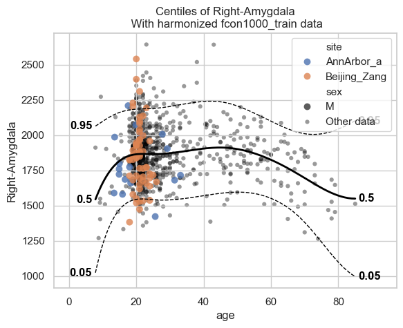
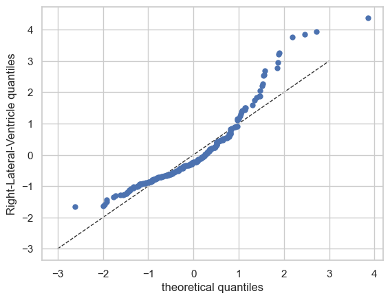
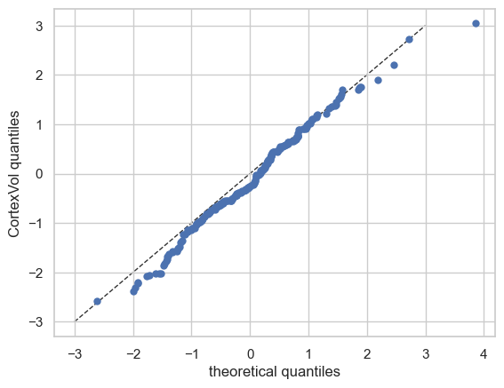
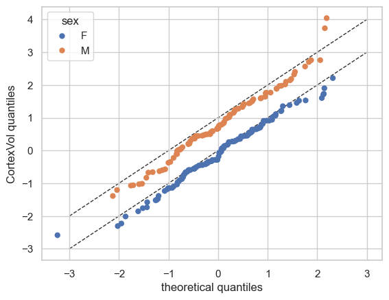
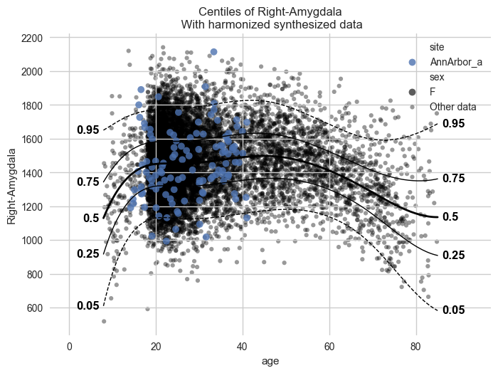
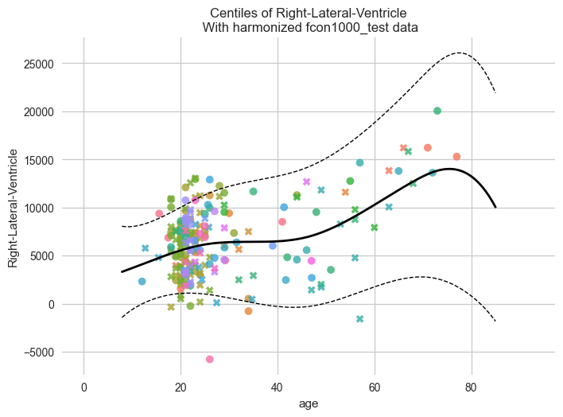
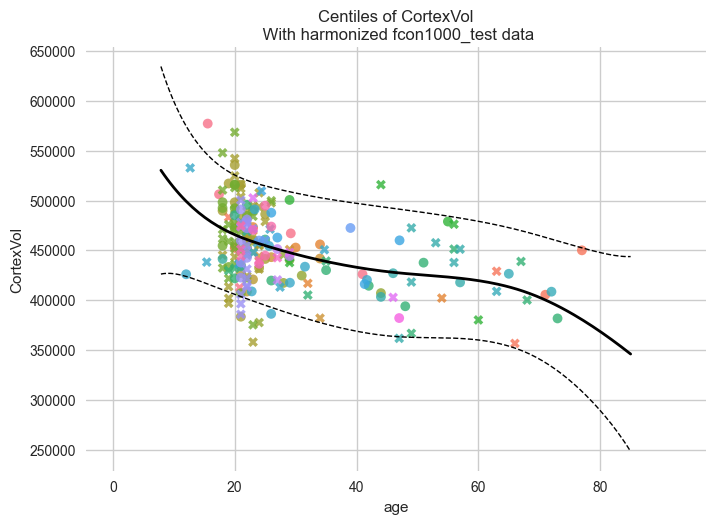

Normative Modelling: Hierarchical Bayesian Regression with Normal likelihood
============================================================================

Welcome to this tutorial notebook that will go through the fitting and
evaluation of Normative models with a Hierarchical Bayesian Regression
model using a Normal likelihood.

Let’s jump right in.

Imports
~~~~~~~

.. code:: ipython3

    import warnings
    import logging
    
    
    import pandas as pd
    import matplotlib.pyplot as plt
    from pcntoolkit import (
        HBR,
        BsplineBasisFunction,
        NormativeModel,
        NormData,
        load_fcon1000,
        NormalLikelihood,
        make_prior,
        plot_centiles_advanced,
        plot_qq,
        plot_ridge,
    )
    
    import numpy as np
    import pcntoolkit.util.output
    import seaborn as sns
    
    sns.set_style("darkgrid")
    
    # Suppress some annoying warnings and logs
    pymc_logger = logging.getLogger("pymc")
    
    pymc_logger.setLevel(logging.WARNING)
    pymc_logger.propagate = False
    
    warnings.simplefilter(action="ignore", category=FutureWarning)
    pd.options.mode.chained_assignment = None  # default='warn'
    pcntoolkit.util.output.Output.set_show_messages(False)

Load data
---------

First we download a small example dataset from github.

.. code:: ipython3

    # Download an example dataset
    norm_data: NormData = load_fcon1000()
    
    # Select only a few features
    features_to_model = [
        "WM-hypointensities",
        "Right-Lateral-Ventricle",
        "Right-Amygdala",
        "CortexVol",
    ]
    norm_data = norm_data.sel({"response_vars": features_to_model})
    
    # Split into train and test sets
    train, test = norm_data.train_test_split()

.. code:: ipython3

    # Visualize the data
    feature_to_plot = features_to_model[0]
    df = train.to_dataframe()
    fig, ax = plt.subplots(1, 2, figsize=(15, 5))
    
    sns.countplot(data=df, y=("batch_effects", "site"), hue=("batch_effects", "sex"), ax=ax[0], orient="h")
    ax[0].legend(title="Sex")
    ax[0].set_title("Count of sites")
    ax[0].set_xlabel("Site")
    ax[0].set_ylabel("Count")
    
    
    sns.scatterplot(
        data=df,
        x=("X", "age"),
        y=("Y", feature_to_plot),
        hue=("batch_effects", "site"),
        style=("batch_effects", "sex"),
        ax=ax[1],
    )
    ax[1].legend([], [])
    ax[1].set_title(f"Scatter plot of age vs {feature_to_plot}")
    ax[1].set_xlabel("Age")
    ax[1].set_ylabel(feature_to_plot)
    
    plt.show()

.. image:: 03_HBR_Normal_files/03_HBR_Normal_6_0.png

Creating a Normative model
--------------------------

A normative model has a regression model for each response variable. We
provide a template regression model which is copied for each response
variable.

A template regression model can be anything that extends the
``RegressionModel``. We provide a number of built-in regression models,
but you can also create your own.

Here we use the ``HBR`` class, which implements a Hierarchical Bayesian
Regression model.

Likelihoods
~~~~~~~~~~~

``HBR`` models are composed of a likelihood and a number of priors on
the parameters of the likelihood. The PCNtoolkit offers a number of
likelihood functions: 1. NormallLikelihood: Good for modeling data that
is (approximately) normally distributed. 2. SHASHbLikelihood: Good for
modeling data that is heavily skewed, or tailed. 3. BetaLikelihood: Good
for modeling data that is bounded, e.g. between 0 and 1.

Likelihood parameters
~~~~~~~~~~~~~~~~~~~~~

Each of these likelihoods takes their own set of parameters, and for
each, we have to set a prior: 1. NormalLikelihood: - ``mu``: The mean of
the normal distribution. - ``sigma``: The standard deviation of the
normal distribution. 2. SHASHbLikelihood: - ``mu``: The mean of the
SHASH distribution. - ``sigma``: The standard deviation of the SHASH
distribution. - ``epsilon``: The skewness parameter of the SHASH
distribution. - ``delta``: The tail thickness (or kurtosis) of the SHASH
distribution. 3. BetaLikelihood: - ``alpha``: The shape parameter of the
beta distribution. - ``beta``: The scale parameter of the beta
distribution.

Configuring likelihood parameters
~~~~~~~~~~~~~~~~~~~~~~~~~~~~~~~~~

Each likelihood parameter needs to be configured. The defaults should
work reasonably well for most cases, at least where the data is
standardized. Here’s a quick guide to configuring the likelihood
parameters yourself, using the ``make_prior`` function.

1. Is your parameter a function of the covariates? If so, you set the
   ``linear`` parameter to ``True``.

   1. If so, you can choose the basis expansion to use for the
      parameter: BSplineBasisFunction, LinearBasisFunction, or
      PolynomialBasisFunction.
   2. Also, determine whether the slope and intercept of the prior have
      a random effect or not. Here’s an example of a linear prior with a
      bspline basis expansion and a random effect in the intercept.

.. code:: python

   mu = make_prior('mu', linear=True, basis_function=BSplineBasisFunction(degree=3, nknots=5), intercept = make_prior('intercept_mu', random=True))

2. If your parameter is not a function of the covariates, you have to
   decide whether the parameter itself has a random effect or not.
   Here’s an example of a prior with a random effect.

.. code:: python

   epsilon = make_prior('epsilon', random=True)

3. Some parameters (such as sigma) need to be strictly positive, which
   we can enforce with a mapping. Here’s an example of a prior with a
   mapping to the positive real line.

.. code:: python

   # The mapping_params are (horizontal shift, scaling, vertical shift)
   sigma = make_prior('sigma', mapping='softplus', mapping_params=(0, 5, 0))

.. code:: ipython3

    # Mini demo of the mapping params
    xsp = np.linspace(-7, 7, 100)
    softplus = lambda x: np.log(1 + np.exp(x))
    paramaterized_softplus = lambda x, a, b, c: softplus((x - a) / b) * b + c
    plt.plot(xsp, paramaterized_softplus(xsp, 0, 1, 0), label="no mapping")
    plt.plot(xsp, paramaterized_softplus(xsp, 1.5, 1, 0), label="horizontal shift of 1.5")
    plt.plot(xsp, paramaterized_softplus(xsp, 0, 1, 1), label="vertical shift of 1")
    plt.plot(xsp, paramaterized_softplus(xsp, 0, 2, 0), label="scale with a factor of 2")
    plt.legend()
    plt.show()

.. image:: 03_HBR_Normal_files/03_HBR_Normal_8_0.png

4. Any non-linear parameters can be further configured with
   ``dist_name`` and ``dist_params``. Here’s an example of a prior with
   a gamma distribution.

.. code:: python

   alpha = make_prior('alpha', dist_name='gamma', dist_params=(1, 1))

We currently support the following distributions: - Normal - HalfNormal
- LogNormal - Uniform - Gamma

The order of the parameters is important, and follows the order of the
parameters in the corresponding distributions in PyMC.

Creating a HBR model
~~~~~~~~~~~~~~~~~~~~

Here’s a thoroughly commented example of a HBR model with a
NormalLikelihood, which we will use to model our response variable.

.. code:: ipython3

    mu = make_prior(
        # Mu is linear because we want to allow the mean to vary as a function of the covariates.
        linear=True,
        # The slope coefficients are assumed to be normally distributed, with a mean of 0 and a standard deviation of 10.
        slope=make_prior(dist_name="Normal", dist_params=(0.0, 3.0)),
        # The intercept is random, because we expect the intercept to vary between sites and sexes.
        intercept=make_prior(
            random=True,
            # Mu is the mean of the intercept, which is normally distributed with a mean of 0 and a standard deviation of 1.
            mu=make_prior(dist_name="Normal", dist_params=(0.0, 1.0)),
            # Sigma is the scale at which the intercepts vary. It is a positive parameter, so we have to map it to the positive domain.
            sigma=make_prior(dist_name="Normal", dist_params=(1.0, 1.0), mapping="softplus", mapping_params=(0.0, 2.0)),
        ),
        # We use a B-spline basis function to allow for non-linearity in the mean.
        basis_function=BsplineBasisFunction(basis_column=0, nknots=5, degree=3),
    )
    sigma = make_prior(
        # Sigma is also linear, because we want to allow the standard deviation to vary as a function of the covariates: heteroskedasticity.
        linear=True,
        # The slope coefficients are assumed to be normally distributed, with a mean of 0 and a standard deviation of 2.
        slope=make_prior(dist_name="Normal", dist_params=(0.0, 2.0)),
        # The intercept is not random, because we assume the intercept of the variance to be the same for all sites and sexes.
        intercept=make_prior(dist_name="Normal", dist_params=(1.0, 1.0)),
        # We use a B-spline basis function to allow for non-linearity in the standard deviation.
        basis_function=BsplineBasisFunction(basis_column=0, nknots=5, degree=3),
        # We use a softplus mapping to ensure that sigma is strictly positive.
        mapping="softplus",
        # We scale the softplus mapping by a factor of 3, to avoid spikes in the resulting density.
        # The parameters (a, b, c) provided to a mapping f are used as: f_abc(x) = f((x - a) / b) * b + c
        # This basically provides an affine transformation of the softplus function.
        # a -> horizontal shift
        # b -> scaling
        # c -> vertical shift
        # You can leave c out, and it will default to 0.
        mapping_params=(0.0, 3.0),
    )
    
    # Set the likelihood with the priors we just created.
    likelihood = NormalLikelihood(mu, sigma)
    
    template_hbr = HBR(
        name="template",
        # The number of cores to use for sampling.
        cores=16,
        # Whether to show a progress bar during the model fitting.
        progressbar=True,
        # The number of draws to sample from the posterior per chain.
        draws=1500,
        # The number of tuning steps to run.
        tune=500,
        # The number of MCMC chains to run.
        chains=4,
        # The sampler to use for the model.
        nuts_sampler="nutpie",
        # The likelihood function to use for the model.
        likelihood=likelihood,
    )

After specifying the regression model, we can configure a normative
model.

A normative model has a number of configuration options: -
``savemodel``: Whether to save the model after fitting. -
``evaluate_model``: Whether to evaluate the model after fitting. -
``saveresults``: Whether to save the results after evaluation. -
``saveplots``: Whether to save the plots after fitting. - ``save_dir``:
The directory to save the model, results, and plots. - ``inscaler``: The
scaler to use for the input data. - ``outscaler``: The scaler to use for
the output data.

.. code:: ipython3

    model = NormativeModel(
        # The regression model to use for the normative model.
        template_regression_model=template_hbr,
        # Whether to save the model after fitting.
        savemodel=True,
        # Whether to evaluate the model after fitting.
        evaluate_model=True,
        # Whether to save the results after evaluation.
        saveresults=True,
        # Whether to save the plots after fitting.
        saveplots=False,
        # The directory to save the model, results, and plots.
        save_dir="resources/hbr_normal/save_dir",
        # The scaler to use for the input data. Can be either one of "standardize", "minmax", "robminmax", "none"
        inscaler="standardize",
        # The scaler to use for the output data. Can be either one of "standardize", "minmax", "robminmax", "none"
        outscaler="standardize",
    )

Fit the model
-------------

With all that configured, we can fit the model.

The ``fit_predict`` function will fit the model, evaluate it, and save
the results and plots (if so configured).

After that, it will compute Z-scores and centiles for the test set.

All results can be found in the save directory.

.. code:: ipython3

    model.fit_predict(train, test)

.. raw:: html

    
    

.. raw:: html

    
    

        
<strong>Sampler Progress</strong>

        
Total Chains: 4

        
Active Chains: 0

        

            Finished Chains:
            4
        

        
Sampling for now

        

            Estimated Time to Completion:
            now
        

    
        <progress
            id="total-progress-bar"
            max="8000"
            value="8000">
        </progress>
        <table>
            <thead>
                <tr>
                    <th>Progress</th>
                    <th>Draws</th>
                    <th>Divergences</th>
                    <th>Step Size</th>
                    <th>Gradients/Draw</th>
                </tr>
            </thead>
            <tbody id="chain-details">
    
                    <tr>
                        <td class="progress-cell">
                            <progress
                                max="2000"
                                value="2000">
                            </progress>
                        </td>
                        <td>2000</td>
                        <td>0</td>
                        <td>0.15</td>
                        <td>63</td>
                    </tr>
    
                    <tr>
                        <td class="progress-cell">
                            <progress
                                max="2000"
                                value="2000">
                            </progress>
                        </td>
                        <td>2000</td>
                        <td>0</td>
                        <td>0.13</td>
                        <td>31</td>
                    </tr>
    
                    <tr>
                        <td class="progress-cell">
                            <progress
                                max="2000"
                                value="2000">
                            </progress>
                        </td>
                        <td>2000</td>
                        <td>0</td>
                        <td>0.14</td>
                        <td>63</td>
                    </tr>
    
                    <tr>
                        <td class="progress-cell">
                            <progress
                                max="2000"
                                value="2000">
                            </progress>
                        </td>
                        <td>2000</td>
                        <td>0</td>
                        <td>0.14</td>
                        <td>127</td>
                    </tr>
    
                </tr>
            </tbody>
        </table>
    

.. raw:: html

    
    

.. raw:: html

    
    

        
<strong>Sampler Progress</strong>

        
Total Chains: 4

        
Active Chains: 0

        

            Finished Chains:
            4
        

        
Sampling for now

        

            Estimated Time to Completion:
            now
        

    
        <progress
            id="total-progress-bar"
            max="8000"
            value="8000">
        </progress>
        <table>
            <thead>
                <tr>
                    <th>Progress</th>
                    <th>Draws</th>
                    <th>Divergences</th>
                    <th>Step Size</th>
                    <th>Gradients/Draw</th>
                </tr>
            </thead>
            <tbody id="chain-details">
    
                    <tr>
                        <td class="progress-cell">
                            <progress
                                max="2000"
                                value="2000">
                            </progress>
                        </td>
                        <td>2000</td>
                        <td>0</td>
                        <td>0.19</td>
                        <td>159</td>
                    </tr>
    
                    <tr>
                        <td class="progress-cell">
                            <progress
                                max="2000"
                                value="2000">
                            </progress>
                        </td>
                        <td>2000</td>
                        <td>0</td>
                        <td>0.18</td>
                        <td>31</td>
                    </tr>
    
                    <tr>
                        <td class="progress-cell">
                            <progress
                                max="2000"
                                value="2000">
                            </progress>
                        </td>
                        <td>2000</td>
                        <td>0</td>
                        <td>0.17</td>
                        <td>31</td>
                    </tr>
    
                    <tr>
                        <td class="progress-cell">
                            <progress
                                max="2000"
                                value="2000">
                            </progress>
                        </td>
                        <td>2000</td>
                        <td>0</td>
                        <td>0.18</td>
                        <td>31</td>
                    </tr>
    
                </tr>
            </tbody>
        </table>
    

.. raw:: html

    
    

.. raw:: html

    
    

        
<strong>Sampler Progress</strong>

        
Total Chains: 4

        
Active Chains: 0

        

            Finished Chains:
            4
        

        
Sampling for now

        

            Estimated Time to Completion:
            now
        

    
        <progress
            id="total-progress-bar"
            max="8000"
            value="8000">
        </progress>
        <table>
            <thead>
                <tr>
                    <th>Progress</th>
                    <th>Draws</th>
                    <th>Divergences</th>
                    <th>Step Size</th>
                    <th>Gradients/Draw</th>
                </tr>
            </thead>
            <tbody id="chain-details">
    
                    <tr>
                        <td class="progress-cell">
                            <progress
                                max="2000"
                                value="2000">
                            </progress>
                        </td>
                        <td>2000</td>
                        <td>0</td>
                        <td>0.19</td>
                        <td>127</td>
                    </tr>
    
                    <tr>
                        <td class="progress-cell">
                            <progress
                                max="2000"
                                value="2000">
                            </progress>
                        </td>
                        <td>2000</td>
                        <td>0</td>
                        <td>0.18</td>
                        <td>15</td>
                    </tr>
    
                    <tr>
                        <td class="progress-cell">
                            <progress
                                max="2000"
                                value="2000">
                            </progress>
                        </td>
                        <td>2000</td>
                        <td>0</td>
                        <td>0.18</td>
                        <td>159</td>
                    </tr>
    
                    <tr>
                        <td class="progress-cell">
                            <progress
                                max="2000"
                                value="2000">
                            </progress>
                        </td>
                        <td>2000</td>
                        <td>0</td>
                        <td>0.17</td>
                        <td>63</td>
                    </tr>
    
                </tr>
            </tbody>
        </table>
    

.. raw:: html

    
    

.. raw:: html

    
    

        
<strong>Sampler Progress</strong>

        
Total Chains: 4

        
Active Chains: 0

        

            Finished Chains:
            4
        

        
Sampling for now

        

            Estimated Time to Completion:
            now
        

    
        <progress
            id="total-progress-bar"
            max="8000"
            value="8000">
        </progress>
        <table>
            <thead>
                <tr>
                    <th>Progress</th>
                    <th>Draws</th>
                    <th>Divergences</th>
                    <th>Step Size</th>
                    <th>Gradients/Draw</th>
                </tr>
            </thead>
            <tbody id="chain-details">
    
                    <tr>
                        <td class="progress-cell">
                            <progress
                                max="2000"
                                value="2000">
                            </progress>
                        </td>
                        <td>2000</td>
                        <td>0</td>
                        <td>0.17</td>
                        <td>127</td>
                    </tr>
    
                    <tr>
                        <td class="progress-cell">
                            <progress
                                max="2000"
                                value="2000">
                            </progress>
                        </td>
                        <td>2000</td>
                        <td>0</td>
                        <td>0.17</td>
                        <td>63</td>
                    </tr>
    
                    <tr>
                        <td class="progress-cell">
                            <progress
                                max="2000"
                                value="2000">
                            </progress>
                        </td>
                        <td>2000</td>
                        <td>0</td>
                        <td>0.16</td>
                        <td>63</td>
                    </tr>
    
                    <tr>
                        <td class="progress-cell">
                            <progress
                                max="2000"
                                value="2000">
                            </progress>
                        </td>
                        <td>2000</td>
                        <td>0</td>
                        <td>0.17</td>
                        <td>63</td>
                    </tr>
    
                </tr>
            </tbody>
        </table>
    

.. raw:: html

    
<svg style="position: absolute; width: 0; height: 0; overflow: hidden">
    <defs>
    <symbol id="icon-database" viewBox="0 0 32 32">
    <path d="M16 0c-8.837 0-16 2.239-16 5v4c0 2.761 7.163 5 16 5s16-2.239 16-5v-4c0-2.761-7.163-5-16-5z"></path>
    <path d="M16 17c-8.837 0-16-2.239-16-5v6c0 2.761 7.163 5 16 5s16-2.239 16-5v-6c0 2.761-7.163 5-16 5z"></path>
    <path d="M16 26c-8.837 0-16-2.239-16-5v6c0 2.761 7.163 5 16 5s16-2.239 16-5v-6c0 2.761-7.163 5-16 5z"></path>
    </symbol>
    <symbol id="icon-file-text2" viewBox="0 0 32 32">
    <path d="M28.681 7.159c-0.694-0.947-1.662-2.053-2.724-3.116s-2.169-2.030-3.116-2.724c-1.612-1.182-2.393-1.319-2.841-1.319h-15.5c-1.378 0-2.5 1.121-2.5 2.5v27c0 1.378 1.122 2.5 2.5 2.5h23c1.378 0 2.5-1.122 2.5-2.5v-19.5c0-0.448-0.137-1.23-1.319-2.841zM24.543 5.457c0.959 0.959 1.712 1.825 2.268 2.543h-4.811v-4.811c0.718 0.556 1.584 1.309 2.543 2.268zM28 29.5c0 0.271-0.229 0.5-0.5 0.5h-23c-0.271 0-0.5-0.229-0.5-0.5v-27c0-0.271 0.229-0.5 0.5-0.5 0 0 15.499-0 15.5 0v7c0 0.552 0.448 1 1 1h7v19.5z"></path>
    <path d="M23 26h-14c-0.552 0-1-0.448-1-1s0.448-1 1-1h14c0.552 0 1 0.448 1 1s-0.448 1-1 1z"></path>
    <path d="M23 22h-14c-0.552 0-1-0.448-1-1s0.448-1 1-1h14c0.552 0 1 0.448 1 1s-0.448 1-1 1z"></path>
    <path d="M23 18h-14c-0.552 0-1-0.448-1-1s0.448-1 1-1h14c0.552 0 1 0.448 1 1s-0.448 1-1 1z"></path>
    </symbol>
    </defs>
    </svg>
    <pre class='xr-text-repr-fallback'>&lt;xarray.NormData&gt; Size: 98kB
    Dimensions:            (observations: 216, response_vars: 4, covariates: 1,
                            batch_effect_dims: 2, centile: 5, statistic: 11)
    Coordinates:
      * observations       (observations) int64 2kB 756 769 692 616 ... 751 470 1043
      * response_vars      (response_vars) &lt;U23 368B &#x27;WM-hypointensities&#x27; ... &#x27;Co...
      * covariates         (covariates) &lt;U3 12B &#x27;age&#x27;
      * batch_effect_dims  (batch_effect_dims) &lt;U4 32B &#x27;sex&#x27; &#x27;site&#x27;
      * centile            (centile) float64 40B 0.05 0.25 0.5 0.75 0.95
      * statistic          (statistic) &lt;U8 352B &#x27;EXPV&#x27; &#x27;MACE&#x27; ... &#x27;SMSE&#x27; &#x27;ShapiroW&#x27;
    Data variables:
        subject_ids        (observations) object 2kB &#x27;Munchen_sub96752&#x27; ... &#x27;Quee...
        Y                  (observations, response_vars) float64 7kB 2.721e+03 .....
        X                  (observations, covariates) float64 2kB 63.0 ... 23.0
        batch_effects      (observations, batch_effect_dims) &lt;U17 29kB &#x27;F&#x27; ... &#x27;Q...
        Z                  (observations, response_vars) float64 7kB 0.5687 ... -...
        centiles           (centile, observations, response_vars) float64 35kB -5...
        logp               (observations, response_vars) float64 7kB -1.703 ... -...
        Yhat               (observations, response_vars) float64 7kB 1.886e+03 .....
        statistics         (response_vars, statistic) float64 352B 0.3726 ... 0.9947
    Attributes:
        real_ids:                       True
        is_scaled:                      False
        name:                           fcon1000_test
        unique_batch_effects:           {np.str_(&#x27;sex&#x27;): [np.str_(&#x27;F&#x27;), np.str_(&#x27;...
        batch_effect_counts:            defaultdict(&lt;function NormData.register_b...
        covariate_ranges:               {np.str_(&#x27;age&#x27;): {&#x27;mean&#x27;: np.float64(28.2...
        batch_effect_covariate_ranges:  {np.str_(&#x27;sex&#x27;): {np.str_(&#x27;F&#x27;): {np.str_(...</pre>

xarray.NormData

<ul class='xr-sections'><li class='xr-section-item'><input id='section-bae72ee3-78e0-42d7-9f3b-cde56872a155' class='xr-section-summary-in' type='checkbox' disabled ><label for='section-bae72ee3-78e0-42d7-9f3b-cde56872a155' class='xr-section-summary'  title='Expand/collapse section'>Dimensions:</label>
<ul class='xr-dim-list'><li>observations: 216</li><li>response_vars: 4</li><li>covariates: 1</li><li>batch_effect_dims: 2</li><li>centile: 5</li><li>statistic: 11</li></ul>

</li><li class='xr-section-item'><input id='section-15488a28-0f1d-4889-b4a0-85da0cfb5137' class='xr-section-summary-in' type='checkbox'  checked><label for='section-15488a28-0f1d-4889-b4a0-85da0cfb5137' class='xr-section-summary' >Coordinates: (6)</label>

<ul class='xr-var-list'><li class='xr-var-item'>
observations

(observations)

int64

756 769 692 616 ... 751 470 1043
<input id='attrs-ccc7b472-f2a6-4582-86ed-d88fd01242cf' class='xr-var-attrs-in' type='checkbox' disabled><label for='attrs-ccc7b472-f2a6-4582-86ed-d88fd01242cf' title='Show/Hide attributes'><svg class='icon xr-icon-file-text2'><use xlink:href='#icon-file-text2'></use></svg></label><input id='data-ba7e128a-02b4-454f-90d0-bc7b1997037f' class='xr-var-data-in' type='checkbox'><label for='data-ba7e128a-02b4-454f-90d0-bc7b1997037f' title='Show/Hide data repr'><svg class='icon xr-icon-database'><use xlink:href='#icon-database'></use></svg></label>
<dl class='xr-attrs'></dl>

<pre>array([ 756,  769,  692, ...,  751,  470, 1043], shape=(216,))</pre>
</li><li class='xr-var-item'>
response_vars

(response_vars)

&lt;U23

&#x27;WM-hypointensities&#x27; ... &#x27;Cortex...
<input id='attrs-7a1e1ea7-f78a-4420-853c-bc0d3bd01138' class='xr-var-attrs-in' type='checkbox' disabled><label for='attrs-7a1e1ea7-f78a-4420-853c-bc0d3bd01138' title='Show/Hide attributes'><svg class='icon xr-icon-file-text2'><use xlink:href='#icon-file-text2'></use></svg></label><input id='data-cdaf7b3b-4cf5-4059-980b-5351e858378a' class='xr-var-data-in' type='checkbox'><label for='data-cdaf7b3b-4cf5-4059-980b-5351e858378a' title='Show/Hide data repr'><svg class='icon xr-icon-database'><use xlink:href='#icon-database'></use></svg></label>
<dl class='xr-attrs'></dl>

<pre>array([&#x27;WM-hypointensities&#x27;, &#x27;Right-Lateral-Ventricle&#x27;, &#x27;Right-Amygdala&#x27;,
           &#x27;CortexVol&#x27;], dtype=&#x27;&lt;U23&#x27;)</pre>
</li><li class='xr-var-item'>
covariates

(covariates)

&lt;U3

&#x27;age&#x27;
<input id='attrs-b8bf358a-a700-44a3-b972-c0c1018db49d' class='xr-var-attrs-in' type='checkbox' disabled><label for='attrs-b8bf358a-a700-44a3-b972-c0c1018db49d' title='Show/Hide attributes'><svg class='icon xr-icon-file-text2'><use xlink:href='#icon-file-text2'></use></svg></label><input id='data-4cd5e0cc-032e-445b-accb-f87a16ac0e98' class='xr-var-data-in' type='checkbox'><label for='data-4cd5e0cc-032e-445b-accb-f87a16ac0e98' title='Show/Hide data repr'><svg class='icon xr-icon-database'><use xlink:href='#icon-database'></use></svg></label>
<dl class='xr-attrs'></dl>

<pre>array([&#x27;age&#x27;], dtype=&#x27;&lt;U3&#x27;)</pre>
</li><li class='xr-var-item'>
batch_effect_dims

(batch_effect_dims)

&lt;U4

&#x27;sex&#x27; &#x27;site&#x27;
<input id='attrs-5ef76e4d-5623-4a68-9bfd-c43d275a7e82' class='xr-var-attrs-in' type='checkbox' disabled><label for='attrs-5ef76e4d-5623-4a68-9bfd-c43d275a7e82' title='Show/Hide attributes'><svg class='icon xr-icon-file-text2'><use xlink:href='#icon-file-text2'></use></svg></label><input id='data-0e04acc1-5a4f-47cd-a565-00da588b9222' class='xr-var-data-in' type='checkbox'><label for='data-0e04acc1-5a4f-47cd-a565-00da588b9222' title='Show/Hide data repr'><svg class='icon xr-icon-database'><use xlink:href='#icon-database'></use></svg></label>
<dl class='xr-attrs'></dl>

<pre>array([&#x27;sex&#x27;, &#x27;site&#x27;], dtype=&#x27;&lt;U4&#x27;)</pre>
</li><li class='xr-var-item'>
centile

(centile)

float64

0.05 0.25 0.5 0.75 0.95
<input id='attrs-96d37f6d-b2d5-4bda-ad28-d4d90102c41d' class='xr-var-attrs-in' type='checkbox' disabled><label for='attrs-96d37f6d-b2d5-4bda-ad28-d4d90102c41d' title='Show/Hide attributes'><svg class='icon xr-icon-file-text2'><use xlink:href='#icon-file-text2'></use></svg></label><input id='data-0bca07a2-baf7-40ed-a884-b5bf80cf599c' class='xr-var-data-in' type='checkbox'><label for='data-0bca07a2-baf7-40ed-a884-b5bf80cf599c' title='Show/Hide data repr'><svg class='icon xr-icon-database'><use xlink:href='#icon-database'></use></svg></label>
<dl class='xr-attrs'></dl>

<pre>array([0.05, 0.25, 0.5 , 0.75, 0.95])</pre>
</li><li class='xr-var-item'>
statistic

(statistic)

&lt;U8

&#x27;EXPV&#x27; &#x27;MACE&#x27; ... &#x27;SMSE&#x27; &#x27;ShapiroW&#x27;
<input id='attrs-2cfe0a81-422e-4d5d-a0e0-059a7bb018aa' class='xr-var-attrs-in' type='checkbox' disabled><label for='attrs-2cfe0a81-422e-4d5d-a0e0-059a7bb018aa' title='Show/Hide attributes'><svg class='icon xr-icon-file-text2'><use xlink:href='#icon-file-text2'></use></svg></label><input id='data-6e231c92-c697-45da-896b-95e36c389217' class='xr-var-data-in' type='checkbox'><label for='data-6e231c92-c697-45da-896b-95e36c389217' title='Show/Hide data repr'><svg class='icon xr-icon-database'><use xlink:href='#icon-database'></use></svg></label>
<dl class='xr-attrs'></dl>

<pre>array([&#x27;EXPV&#x27;, &#x27;MACE&#x27;, &#x27;MAPE&#x27;, &#x27;MSLL&#x27;, &#x27;NLL&#x27;, &#x27;R2&#x27;, &#x27;RMSE&#x27;, &#x27;Rho&#x27;, &#x27;Rho_p&#x27;,
           &#x27;SMSE&#x27;, &#x27;ShapiroW&#x27;], dtype=&#x27;&lt;U8&#x27;)</pre>
</li></ul>
</li><li class='xr-section-item'><input id='section-5e83eb52-78b0-46c0-bd7d-80b7cc16b402' class='xr-section-summary-in' type='checkbox'  checked><label for='section-5e83eb52-78b0-46c0-bd7d-80b7cc16b402' class='xr-section-summary' >Data variables: (9)</label>

<ul class='xr-var-list'><li class='xr-var-item'>
subject_ids

(observations)

object

&#x27;Munchen_sub96752&#x27; ... &#x27;Queensla...
<input id='attrs-ee446a41-af26-441a-9f2e-c969080c3038' class='xr-var-attrs-in' type='checkbox' disabled><label for='attrs-ee446a41-af26-441a-9f2e-c969080c3038' title='Show/Hide attributes'><svg class='icon xr-icon-file-text2'><use xlink:href='#icon-file-text2'></use></svg></label><input id='data-66342d13-2dd6-4c13-8b86-99d02e328504' class='xr-var-data-in' type='checkbox'><label for='data-66342d13-2dd6-4c13-8b86-99d02e328504' title='Show/Hide data repr'><svg class='icon xr-icon-database'><use xlink:href='#icon-database'></use></svg></label>
<dl class='xr-attrs'></dl>

<pre>array([&#x27;Munchen_sub96752&#x27;, &#x27;NewYork_a_sub18638&#x27;, &#x27;Leiden_2200_sub87320&#x27;,
           &#x27;ICBM_sub47658&#x27;, &#x27;AnnArbor_b_sub45569&#x27;, &#x27;Beijing_Zang_sub18960&#x27;,
           &#x27;Leiden_2200_sub18456&#x27;, &#x27;Berlin_Margulies_sub27711&#x27;,
           &#x27;Beijing_Zang_sub87776&#x27;, &#x27;Milwaukee_b_sub63196&#x27;,
           &#x27;Beijing_Zang_sub07144&#x27;, &#x27;Atlanta_sub76280&#x27;,
           &#x27;Beijing_Zang_sub40037&#x27;, &#x27;Cambridge_Buckner_sub17737&#x27;,
           &#x27;ICBM_sub89049&#x27;, &#x27;ICBM_sub55656&#x27;, &#x27;Oulu_sub45566&#x27;,
           &#x27;Beijing_Zang_sub89088&#x27;, &#x27;Atlanta_sub16563&#x27;,
           &#x27;Cambridge_Buckner_sub51172&#x27;, &#x27;Oulu_sub98739&#x27;,
           &#x27;Queensland_sub49845&#x27;, &#x27;Cambridge_Buckner_sub84256&#x27;,
           &#x27;Cleveland_sub80263&#x27;, &#x27;ICBM_sub16607&#x27;, &#x27;Newark_sub46570&#x27;,
           &#x27;NewYork_a_sub88286&#x27;, &#x27;Cambridge_Buckner_sub02591&#x27;,
           &#x27;Oulu_sub66467&#x27;, &#x27;Beijing_Zang_sub74386&#x27;, &#x27;Newark_sub55760&#x27;,
           &#x27;ICBM_sub30623&#x27;, &#x27;Oulu_sub68752&#x27;, &#x27;Leiden_2180_sub19281&#x27;,
           &#x27;Beijing_Zang_sub50972&#x27;, &#x27;Beijing_Zang_sub85030&#x27;,
           &#x27;Milwaukee_b_sub36386&#x27;, &#x27;Baltimore_sub31837&#x27;, &#x27;PaloAlto_sub84978&#x27;,
           &#x27;Oulu_sub01077&#x27;, &#x27;NewYork_a_ADHD_sub54828&#x27;, &#x27;PaloAlto_sub96705&#x27;,
           &#x27;Cambridge_Buckner_sub40635&#x27;, &#x27;ICBM_sub66794&#x27;,
           &#x27;Beijing_Zang_sub46541&#x27;, &#x27;Beijing_Zang_sub87089&#x27;,
           &#x27;Pittsburgh_sub97823&#x27;, &#x27;Beijing_Zang_sub98617&#x27;, &#x27;ICBM_sub92028&#x27;,
    ...
           &#x27;Leiden_2200_sub04484&#x27;, &#x27;Beijing_Zang_sub80163&#x27;, &#x27;ICBM_sub02382&#x27;,
           &#x27;Cambridge_Buckner_sub77435&#x27;, &#x27;NewYork_a_sub54887&#x27;,
           &#x27;Oulu_sub85532&#x27;, &#x27;Baltimore_sub73823&#x27;, &#x27;Beijing_Zang_sub29590&#x27;,
           &#x27;Oulu_sub99718&#x27;, &#x27;Beijing_Zang_sub08455&#x27;, &#x27;Beijing_Zang_sub85543&#x27;,
           &#x27;Cambridge_Buckner_sub45354&#x27;, &#x27;Beijing_Zang_sub07717&#x27;,
           &#x27;Baltimore_sub76160&#x27;, &#x27;Beijing_Zang_sub17093&#x27;,
           &#x27;AnnArbor_b_sub90127&#x27;, &#x27;SaintLouis_sub73002&#x27;,
           &#x27;Queensland_sub93238&#x27;, &#x27;Cleveland_sub34189&#x27;,
           &#x27;Cambridge_Buckner_sub89107&#x27;, &#x27;Atlanta_sub75153&#x27;,
           &#x27;NewYork_a_ADHD_sub73035&#x27;, &#x27;Cambridge_Buckner_sub59434&#x27;,
           &#x27;Milwaukee_b_sub44912&#x27;, &#x27;Cleveland_sub46739&#x27;, &#x27;Oulu_sub20495&#x27;,
           &#x27;SaintLouis_sub28304&#x27;, &#x27;Cambridge_Buckner_sub35430&#x27;,
           &#x27;Oulu_sub86362&#x27;, &#x27;Newark_sub58526&#x27;, &#x27;Leiden_2180_sub12255&#x27;,
           &#x27;ICBM_sub48210&#x27;, &#x27;Cambridge_Buckner_sub77989&#x27;,
           &#x27;Berlin_Margulies_sub75506&#x27;, &#x27;NewYork_a_sub29216&#x27;,
           &#x27;Beijing_Zang_sub05267&#x27;, &#x27;AnnArbor_b_sub18546&#x27;, &#x27;Oulu_sub75620&#x27;,
           &#x27;AnnArbor_b_sub30250&#x27;, &#x27;Berlin_Margulies_sub86111&#x27;,
           &#x27;Beijing_Zang_sub89592&#x27;, &#x27;Beijing_Zang_sub68012&#x27;,
           &#x27;NewYork_a_sub50559&#x27;, &#x27;Munchen_sub66933&#x27;,
           &#x27;Cambridge_Buckner_sub59729&#x27;, &#x27;Queensland_sub86245&#x27;], dtype=object)</pre>
</li><li class='xr-var-item'>
Y

(observations, response_vars)

float64

2.721e+03 1.289e+04 ... 5.035e+05
<input id='attrs-18868c39-7369-4c73-8944-68b3638b8bf3' class='xr-var-attrs-in' type='checkbox' disabled><label for='attrs-18868c39-7369-4c73-8944-68b3638b8bf3' title='Show/Hide attributes'><svg class='icon xr-icon-file-text2'><use xlink:href='#icon-file-text2'></use></svg></label><input id='data-e2c6c126-31f8-49a0-be98-84c07d455740' class='xr-var-data-in' type='checkbox'><label for='data-e2c6c126-31f8-49a0-be98-84c07d455740' title='Show/Hide data repr'><svg class='icon xr-icon-database'><use xlink:href='#icon-database'></use></svg></label>
<dl class='xr-attrs'></dl>

<pre>array([[2.72140000e+03, 1.28916000e+04, 1.43940000e+03, 4.57858328e+05],
           [1.14310000e+03, 9.91910000e+03, 1.64970000e+03, 5.26780362e+05],
           [9.55800000e+02, 7.47730000e+03, 1.83850000e+03, 4.95744471e+05],
           [1.47390000e+03, 1.43021000e+04, 1.86770000e+03, 5.85303839e+05],
           [7.57800000e+02, 4.11930000e+03, 1.32500000e+03, 3.33111552e+05],
           [8.71100000e+02, 5.03090000e+03, 1.90730000e+03, 5.10794940e+05],
           [1.20730000e+03, 1.78664000e+04, 2.02220000e+03, 5.50533325e+05],
           [5.95000000e+02, 5.00790000e+03, 2.01070000e+03, 4.67673977e+05],
           [6.82400000e+02, 7.28660000e+03, 1.45630000e+03, 4.60129533e+05],
           [4.45100000e+02, 5.74290000e+03, 1.47450000e+03, 4.44494817e+05],
           [1.62000000e+03, 3.71370000e+03, 2.00110000e+03, 5.59424624e+05],
           [6.02800000e+02, 5.30120000e+03, 1.36100000e+03, 4.21551234e+05],
           [1.43250000e+03, 4.42970000e+03, 1.65080000e+03, 5.19842763e+05],
           [1.90820000e+03, 3.57810000e+03, 1.88370000e+03, 5.06679262e+05],
           [1.83400000e+03, 3.27190000e+03, 2.05120000e+03, 5.35569987e+05],
           [4.59600000e+02, 3.98580000e+03, 1.45470000e+03, 4.67607555e+05],
           [1.21000000e+03, 8.72130000e+03, 1.71430000e+03, 5.30904612e+05],
           [8.45900000e+02, 6.59310000e+03, 1.61900000e+03, 5.09371867e+05],
           [9.95200000e+02, 7.04020000e+03, 1.99490000e+03, 4.60068379e+05],
           [1.73470000e+03, 4.01480000e+03, 1.51620000e+03, 4.87269373e+05],
    ...
           [7.85800000e+02, 5.70900000e+03, 1.47480000e+03, 4.53982166e+05],
           [2.24010000e+03, 4.36660000e+03, 2.04210000e+03, 5.58453123e+05],
           [7.58100000e+02, 6.52980000e+03, 1.56730000e+03, 4.73575183e+05],
           [1.44050000e+03, 6.70530000e+03, 1.20540000e+03, 3.82788491e+05],
           [8.18600000e+02, 9.38330000e+03, 1.96740000e+03, 5.02713911e+05],
           [3.76990000e+03, 1.58644000e+04, 1.79170000e+03, 5.12490348e+05],
           [8.80200000e+02, 4.37020000e+03, 1.75520000e+03, 4.37300069e+05],
           [8.23900000e+02, 6.37900000e+03, 1.57650000e+03, 5.67331908e+05],
           [2.11390000e+03, 1.07225000e+04, 1.84380000e+03, 5.12273764e+05],
           [7.41900000e+02, 8.80170000e+03, 1.60640000e+03, 4.91973562e+05],
           [1.33390000e+03, 6.98000000e+03, 1.74850000e+03, 4.78907154e+05],
           [7.07300000e+02, 5.68070000e+03, 1.53450000e+03, 4.74077083e+05],
           [1.13410000e+03, 5.59220000e+03, 1.62620000e+03, 4.54163909e+05],
           [4.38600000e+02, 6.33000000e+03, 1.59670000e+03, 4.68067037e+05],
           [9.66300000e+02, 9.21550000e+03, 1.78250000e+03, 5.09199708e+05],
           [4.24300000e+02, 4.51110000e+03, 1.70200000e+03, 5.26635258e+05],
           [6.04700000e+02, 7.59080000e+03, 1.69930000e+03, 5.20499663e+05],
           [2.34320000e+03, 1.71923000e+04, 1.79380000e+03, 4.86680791e+05],
           [2.72170000e+03, 6.08600000e+03, 2.32470000e+03, 6.10402006e+05],
           [7.03500000e+02, 1.07003000e+04, 1.67620000e+03, 5.03535771e+05]])</pre>
</li><li class='xr-var-item'>
X

(observations, covariates)

float64

63.0 23.27 22.0 ... 72.0 23.0 23.0
<input id='attrs-9d8e9d65-a673-4291-a4bf-397389a9a934' class='xr-var-attrs-in' type='checkbox' disabled><label for='attrs-9d8e9d65-a673-4291-a4bf-397389a9a934' title='Show/Hide attributes'><svg class='icon xr-icon-file-text2'><use xlink:href='#icon-file-text2'></use></svg></label><input id='data-edbfb991-d300-4f2b-a3fd-9fd278e621e6' class='xr-var-data-in' type='checkbox'><label for='data-edbfb991-d300-4f2b-a3fd-9fd278e621e6' title='Show/Hide data repr'><svg class='icon xr-icon-database'><use xlink:href='#icon-database'></use></svg></label>
<dl class='xr-attrs'></dl>

<pre>array([[63.  ],
           [23.27],
           [22.  ],
           [42.  ],
           [63.  ],
           [23.  ],
           [21.  ],
           [26.  ],
           [21.  ],
           [49.  ],
           [20.  ],
           [23.  ],
           [20.  ],
           [26.  ],
           [35.  ],
           [21.  ],
           [22.  ],
           [19.  ],
           [34.  ],
           [18.  ],
    ...
           [21.  ],
           [20.  ],
           [22.  ],
           [25.  ],
           [25.  ],
           [73.  ],
           [22.  ],
           [28.  ],
           [29.06],
           [19.  ],
           [20.  ],
           [22.  ],
           [19.  ],
           [24.  ],
           [21.  ],
           [24.  ],
           [22.79],
           [72.  ],
           [23.  ],
           [23.  ]])</pre>
</li><li class='xr-var-item'>
batch_effects

(observations, batch_effect_dims)

&lt;U17

&#x27;F&#x27; &#x27;Munchen&#x27; ... &#x27;M&#x27; &#x27;Queensland&#x27;
<input id='attrs-078c6cc0-8ea2-4058-838c-00d533dd4dcf' class='xr-var-attrs-in' type='checkbox' disabled><label for='attrs-078c6cc0-8ea2-4058-838c-00d533dd4dcf' title='Show/Hide attributes'><svg class='icon xr-icon-file-text2'><use xlink:href='#icon-file-text2'></use></svg></label><input id='data-54a52937-28c4-4899-9ed0-6c19379d22b1' class='xr-var-data-in' type='checkbox'><label for='data-54a52937-28c4-4899-9ed0-6c19379d22b1' title='Show/Hide data repr'><svg class='icon xr-icon-database'><use xlink:href='#icon-database'></use></svg></label>
<dl class='xr-attrs'></dl>

<pre>array([[&#x27;F&#x27;, &#x27;Munchen&#x27;],
           [&#x27;M&#x27;, &#x27;NewYork_a&#x27;],
           [&#x27;F&#x27;, &#x27;Leiden_2200&#x27;],
           [&#x27;M&#x27;, &#x27;ICBM&#x27;],
           [&#x27;F&#x27;, &#x27;AnnArbor_b&#x27;],
           [&#x27;M&#x27;, &#x27;Beijing_Zang&#x27;],
           [&#x27;M&#x27;, &#x27;Leiden_2200&#x27;],
           [&#x27;F&#x27;, &#x27;Berlin_Margulies&#x27;],
           [&#x27;F&#x27;, &#x27;Beijing_Zang&#x27;],
           [&#x27;F&#x27;, &#x27;Milwaukee_b&#x27;],
           [&#x27;M&#x27;, &#x27;Beijing_Zang&#x27;],
           [&#x27;F&#x27;, &#x27;Atlanta&#x27;],
           [&#x27;F&#x27;, &#x27;Beijing_Zang&#x27;],
           [&#x27;F&#x27;, &#x27;Cambridge_Buckner&#x27;],
           [&#x27;M&#x27;, &#x27;ICBM&#x27;],
           [&#x27;F&#x27;, &#x27;ICBM&#x27;],
           [&#x27;M&#x27;, &#x27;Oulu&#x27;],
           [&#x27;F&#x27;, &#x27;Beijing_Zang&#x27;],
           [&#x27;M&#x27;, &#x27;Atlanta&#x27;],
           [&#x27;F&#x27;, &#x27;Cambridge_Buckner&#x27;],
    ...
           [&#x27;F&#x27;, &#x27;SaintLouis&#x27;],
           [&#x27;M&#x27;, &#x27;Cambridge_Buckner&#x27;],
           [&#x27;F&#x27;, &#x27;Oulu&#x27;],
           [&#x27;F&#x27;, &#x27;Newark&#x27;],
           [&#x27;M&#x27;, &#x27;Leiden_2180&#x27;],
           [&#x27;M&#x27;, &#x27;ICBM&#x27;],
           [&#x27;F&#x27;, &#x27;Cambridge_Buckner&#x27;],
           [&#x27;M&#x27;, &#x27;Berlin_Margulies&#x27;],
           [&#x27;M&#x27;, &#x27;NewYork_a&#x27;],
           [&#x27;F&#x27;, &#x27;Beijing_Zang&#x27;],
           [&#x27;M&#x27;, &#x27;AnnArbor_b&#x27;],
           [&#x27;F&#x27;, &#x27;Oulu&#x27;],
           [&#x27;F&#x27;, &#x27;AnnArbor_b&#x27;],
           [&#x27;F&#x27;, &#x27;Berlin_Margulies&#x27;],
           [&#x27;M&#x27;, &#x27;Beijing_Zang&#x27;],
           [&#x27;F&#x27;, &#x27;Beijing_Zang&#x27;],
           [&#x27;M&#x27;, &#x27;NewYork_a&#x27;],
           [&#x27;M&#x27;, &#x27;Munchen&#x27;],
           [&#x27;M&#x27;, &#x27;Cambridge_Buckner&#x27;],
           [&#x27;M&#x27;, &#x27;Queensland&#x27;]], dtype=&#x27;&lt;U17&#x27;)</pre>
</li><li class='xr-var-item'>
Z

(observations, response_vars)

float64

0.5687 0.2601 ... -1.217 -1.151
<input id='attrs-d563387c-ba2e-451c-a1b3-6a0c45b55372' class='xr-var-attrs-in' type='checkbox' disabled><label for='attrs-d563387c-ba2e-451c-a1b3-6a0c45b55372' title='Show/Hide attributes'><svg class='icon xr-icon-file-text2'><use xlink:href='#icon-file-text2'></use></svg></label><input id='data-2e1a3f42-446a-437d-8126-0fe6c6431e91' class='xr-var-data-in' type='checkbox'><label for='data-2e1a3f42-446a-437d-8126-0fe6c6431e91' title='Show/Hide data repr'><svg class='icon xr-icon-database'><use xlink:href='#icon-database'></use></svg></label>
<dl class='xr-attrs'></dl>

<pre>array([[ 5.68675548e-01,  2.60062021e-01, -5.81676886e-01,
             4.37409785e-01],
           [ 1.67286655e-02,  9.52588938e-01, -1.32069241e+00,
            -3.57466458e-01],
           [ 2.59639649e-01,  3.35688219e-01,  5.71696291e-01,
             3.30456936e-01],
           [ 5.60135313e-02,  1.50384841e+00, -2.70278086e-01,
             1.55918007e+00],
           [-8.67927534e-01, -1.18443750e+00, -3.48431850e-01,
            -1.83312887e+00],
           [-8.05724846e-01, -6.66496986e-01,  2.05454871e-01,
            -5.59188058e-01],
           [ 4.76121640e-01,  3.65570909e+00,  3.27338337e-01,
             3.57454013e-01],
           [ 6.24854772e-03, -5.30174318e-01,  1.92564817e+00,
            -6.84842198e-01],
           [-8.54040274e-01,  6.29972347e-01, -9.13362093e-01,
            -6.64497916e-01],
           [-9.59632465e-01, -4.26165027e-01, -7.00514211e-01,
             1.90811571e-01],
    ...
           [-2.87910338e-01,  1.85994998e-01,  3.21541372e-01,
            -5.76406514e-01],
           [-1.51903976e+00, -1.90020126e-01, -3.85844582e-01,
            -6.04765977e-01],
           [-3.79335813e-01,  1.92789052e-01,  9.04510353e-01,
             7.97608531e-02],
           [-3.81790631e-01, -8.04765333e-02, -1.63477087e-01,
            -7.85535896e-01],
           [-5.46240682e-01,  8.69768224e-01, -4.29290545e-01,
            -7.29501230e-01],
           [-1.56020089e+00, -4.32620389e-01,  3.42618968e-01,
             1.35986877e+00],
           [-1.40213605e+00,  1.86975982e-01, -1.06820457e+00,
            -5.60265098e-01],
           [-3.85262410e-01,  3.10819570e-01,  7.52993401e-01,
             2.95607121e-01],
           [ 3.60057123e+00, -2.66759635e-01,  2.14602444e+00,
             3.05622528e+00],
           [-1.09601642e+00,  1.15373706e+00, -1.21683219e+00,
            -1.15141966e+00]])</pre>
</li><li class='xr-var-item'>
centiles

(centile, observations, response_vars)

float64

-552.9 2.382e+03 ... 6.044e+05
<input id='attrs-f9974d35-d1d6-4d0b-a0a5-02ef774c1edf' class='xr-var-attrs-in' type='checkbox' disabled><label for='attrs-f9974d35-d1d6-4d0b-a0a5-02ef774c1edf' title='Show/Hide attributes'><svg class='icon xr-icon-file-text2'><use xlink:href='#icon-file-text2'></use></svg></label><input id='data-b20b6ed6-11ff-4b67-bbf2-84566ca3021e' class='xr-var-data-in' type='checkbox'><label for='data-b20b6ed6-11ff-4b67-bbf2-84566ca3021e' title='Show/Hide data repr'><svg class='icon xr-icon-database'><use xlink:href='#icon-database'></use></svg></label>
<dl class='xr-attrs'></dl>

<pre>array([[[-5.52858059e+02,  2.38219970e+03,  1.26162268e+03,
              3.83280085e+05],
            [ 5.14163861e+02,  2.19103819e+03,  1.58610572e+03,
              4.80288706e+05],
            [ 2.28372990e+02,  1.78927062e+03,  1.40801047e+03,
              4.24564437e+05],
            ...,
            [-5.06542485e+02,  3.59081390e+03,  1.32454825e+03,
              4.14747620e+05],
            [ 7.35142512e+02,  2.01477725e+03,  1.58595881e+03,
              4.40911336e+05],
            [ 4.95112206e+02,  2.43658374e+03,  1.59247879e+03,
              4.85689151e+05]],
    
           [[ 8.86023338e+02,  7.74330111e+03,  1.42275137e+03,
              4.18085885e+05],
            [ 8.81434512e+02,  5.07914266e+03,  1.77554999e+03,
              5.15317748e+05],
            [ 5.99079556e+02,  4.57635725e+03,  1.59649821e+03,
              4.59534531e+05],
    ...
            [ 4.71750659e+03,  1.97554567e+04,  1.78071893e+03,
              5.00903100e+05],
            [ 1.61409265e+03,  8.86586318e+03,  2.03817383e+03,
              5.24580535e+05],
            [ 1.37406234e+03,  9.28766967e+03,  2.04469382e+03,
              5.69358350e+05]],
    
           [[ 4.32520746e+03,  2.05572932e+04,  1.80787778e+03,
              5.01277977e+05],
            [ 1.75927712e+03,  1.19822294e+04,  2.22835572e+03,
              5.99043428e+05],
            [ 1.48513461e+03,  1.12379932e+04,  2.04701763e+03,
              5.43119316e+05],
            ...,
            [ 6.90313748e+03,  2.65183990e+04,  1.97157103e+03,
              5.36948718e+05],
            [ 1.98182667e+03,  1.17322116e+04,  2.22737097e+03,
              5.59585946e+05],
            [ 1.74179636e+03,  1.21540181e+04,  2.23389096e+03,
              6.04363761e+05]]], shape=(5, 216, 4))</pre>
</li><li class='xr-var-item'>
logp

(observations, response_vars)

float64

-1.703 -1.332 ... -1.464 -1.246
<input id='attrs-9c9fc792-c1b1-49c4-93bd-3e7417d86fe7' class='xr-var-attrs-in' type='checkbox' disabled><label for='attrs-9c9fc792-c1b1-49c4-93bd-3e7417d86fe7' title='Show/Hide attributes'><svg class='icon xr-icon-file-text2'><use xlink:href='#icon-file-text2'></use></svg></label><input id='data-1ad18f12-9034-44cd-8f74-23cb7478857d' class='xr-var-data-in' type='checkbox'><label for='data-1ad18f12-9034-44cd-8f74-23cb7478857d' title='Show/Hide data repr'><svg class='icon xr-icon-database'><use xlink:href='#icon-database'></use></svg></label>
<dl class='xr-attrs'></dl>

<pre>array([[ -1.70309774,  -1.33233096,  -0.75146477,  -0.68316013],
           [ -0.16303736,  -1.12587178,  -1.57622211,  -0.62645138],
           [ -0.22626739,  -0.70641624,  -0.8818465 ,  -0.63500209],
           [ -0.70201199,  -2.15597021,  -0.76373338,  -1.86040576],
           [ -1.90303096,  -2.00016085,  -0.62980088,  -2.27139679],
           [ -0.48081652,  -0.88023608,  -0.71584059,  -0.71150093],
           [ -0.3185584 ,  -7.31114932,  -0.77026726,  -0.6458412 ],
           [ -0.18683517,  -0.89522936,  -2.5887031 ,  -0.82185803],
           [ -0.54088867,  -0.79986946,  -1.10604456,  -0.77577542],
           [ -1.46301233,  -1.18844783,  -0.90871844,  -0.64817106],
           [ -0.81704357,  -1.16624165,  -0.94305904,  -0.73405487],
           [ -0.53418198,  -0.72536782,  -1.44097489,  -1.26508593],
           [ -0.75353062,  -0.63934836,  -0.69542878,  -0.97850001],
           [ -1.86894815,  -0.98694907,  -1.26928759,  -2.09835188],
           [ -0.98083751,  -1.63616372,  -1.01006367,  -0.62244299],
           [ -1.24692247,  -0.88140941,  -1.18308161,  -1.11626186],
           [ -0.36719864,  -0.7247286 ,  -0.90974166,  -0.65974945],
           [ -0.31394362,  -0.67443342,  -0.69695364,  -0.71796597],
           [ -0.47445086,  -0.93523007,  -1.0123121 ,  -1.09307894],
           [ -1.04847173,  -0.60044409,  -0.974752  ,  -0.81951871],
    ...
           [ -0.20915866,  -0.62434824,  -1.2018796 ,  -1.58854934],
           [ -2.67277828,  -0.89597844,  -0.94945164,  -1.55277393],
           [ -1.12653812,  -0.63682934,  -0.716442  ,  -0.74712412],
           [ -0.34246023,  -0.7379325 ,  -2.09425685,  -1.1631974 ],
           [ -0.62340467,  -0.85011645,  -0.84760095,  -0.82012386],
           [ -2.01792362,  -1.56322929,  -0.9479656 ,  -0.83762543],
           [ -0.49989964,  -0.70863799,  -0.77797087,  -0.62554793],
           [ -0.22047589,  -0.92339819,  -1.784431  ,  -0.86161643],
           [ -2.96328411,  -1.29001707,  -0.79231163,  -0.69237305],
           [ -0.45867838,  -1.4399859 ,  -0.70169929,  -0.5733581 ],
           [ -0.26572751,  -0.61193264,  -0.76334432,  -0.74890325],
           [ -1.32002398,  -0.64930997,  -0.76740721,  -0.73859035],
           [ -0.32039656,  -0.58893315,  -1.12663398,  -0.59566197],
           [ -0.25189305,  -0.70717387,  -0.73476495,  -0.88810387],
           [ -0.32593554,  -0.98065161,  -0.78131505,  -0.82164598],
           [ -1.37164518,  -0.77906335,  -0.75883402,  -1.4840617 ],
           [ -1.14955724,  -0.67601693,  -1.27214512,  -0.71868843],
           [ -2.02419491,  -1.5761859 ,  -1.02104449,  -0.65907633],
           [ -6.64423055,  -0.69353969,  -2.99963602,  -5.22938321],
           [ -0.78709896,  -1.3455713 ,  -1.46372206,  -1.24587784]])</pre>
</li><li class='xr-var-item'>
Yhat

(observations, response_vars)

float64

1.886e+03 1.147e+04 ... 5.45e+05
<input id='attrs-73fcdbc5-fa72-4012-b563-f3da494b7f6a' class='xr-var-attrs-in' type='checkbox' disabled><label for='attrs-73fcdbc5-fa72-4012-b563-f3da494b7f6a' title='Show/Hide attributes'><svg class='icon xr-icon-file-text2'><use xlink:href='#icon-file-text2'></use></svg></label><input id='data-5e5d4cf1-36fe-4214-98c6-59a747e20e6f' class='xr-var-data-in' type='checkbox'><label for='data-5e5d4cf1-36fe-4214-98c6-59a747e20e6f' title='Show/Hide data repr'><svg class='icon xr-icon-database'><use xlink:href='#icon-database'></use></svg></label>
<dl class='xr-attrs'></dl>

<pre>array([[  1886.17470129,  11469.74644919,   1534.75022814,
            442279.03130193],
           [  1136.7204886 ,   7086.63377315,   1907.2307195 ,
            539666.06688373],
           [   856.75380083,   6513.6319294 ,   1727.51405283,
            483841.8767941 ],
           [  1437.01371894,   7977.92304546,   1921.3884444 ,
            524754.54854511],
           [  2034.0566898 ,  10603.03468284,   1381.8676714 ,
            398274.05515456],
           [  1176.17626625,   6997.86888239,   1867.29457249,
            530949.58250736],
           [  1023.24488917,   7662.42843105,   1958.73248138,
            537633.98851345],
           [   592.7236807 ,   6702.2971933 ,   1629.51098204,
            492645.81984959],
           [  1012.79836061,   5528.06792836,   1633.28209249,
            484099.9788566 ],
           [  1278.4391322 ,   7672.64441026,   1604.95180409,
            437215.510956  ],
    ...
           [  1447.35436524,   6475.49902508,   1686.13650814,
            499832.07132809],
           [  1287.09602658,   6225.83452243,   1609.39036209,
            495853.23485932],
           [  1287.20919609,   5082.08941207,   1449.75130941,
            451248.93328102],
           [   582.80539579,   6573.23253763,   1628.69477818,
            496461.15436848],
           [  1177.67433501,   6787.98122261,   1865.68586419,
            535518.56560156],
           [  1013.26570517,   5823.60975501,   1634.97623054,
            477478.34115906],
           [  1136.20281818,   7042.50270169,   1907.14535282,
            540680.90660995],
           [  3198.29749554,  15054.60647524,   1648.05964258,
            475848.16894997],
           [  1358.48458888,   6873.49443833,   1906.6648887 ,
            500248.64125453],
           [  1118.45428249,   7295.30092986,   1913.1848754 ,
            545026.45568506]])</pre>
</li><li class='xr-var-item'>
statistics

(response_vars, statistic)

float64

0.3726 0.03704 ... 0.5905 0.9947
<input id='attrs-c2dc45be-12e5-41f8-b48e-99cfc89bcd5b' class='xr-var-attrs-in' type='checkbox' disabled><label for='attrs-c2dc45be-12e5-41f8-b48e-99cfc89bcd5b' title='Show/Hide attributes'><svg class='icon xr-icon-file-text2'><use xlink:href='#icon-file-text2'></use></svg></label><input id='data-ec891bff-a253-4488-bfcd-3b20d2770a2d' class='xr-var-data-in' type='checkbox'><label for='data-ec891bff-a253-4488-bfcd-3b20d2770a2d' title='Show/Hide data repr'><svg class='icon xr-icon-database'><use xlink:href='#icon-database'></use></svg></label>
<dl class='xr-attrs'></dl>

<pre>array([[ 3.72597910e-01,  3.70370370e-02,  3.41551198e-01,
            -7.02876526e+00,  7.95784890e-01,  3.69535926e-01,
             4.80564792e+02,  4.94326882e-01,  1.03742371e-14,
             6.30464074e-01,  9.65866967e-01],
           [ 2.14719028e-01,  5.09259259e-02,  4.18715732e-01,
            -8.34975676e+00,  1.34074897e+00,  2.13839037e-01,
             3.46778152e+03,  2.67209517e-01,  6.98108685e-05,
             7.86160963e-01,  8.86324810e-01],
           [ 2.90768949e-01,  1.29629630e-02,  9.47946059e-02,
            -5.65607888e+00,  1.22644715e+00,  2.89839532e-01,
             1.98831024e+02,  5.03814433e-01,  2.64203054e-15,
             7.10160468e-01,  9.91605686e-01],
           [ 4.17704580e-01,  2.50000000e-02,  6.36765551e-02,
            -1.11125478e+01,  1.10501235e+00,  4.09499020e-01,
             3.76176864e+04,  6.41133733e-01,  2.11173504e-26,
             5.90500980e-01,  9.94676095e-01]])</pre>
</li></ul>
</li><li class='xr-section-item'><input id='section-e6ab5c3b-e4b0-4546-849e-87bb87c00159' class='xr-section-summary-in' type='checkbox'  ><label for='section-e6ab5c3b-e4b0-4546-849e-87bb87c00159' class='xr-section-summary' >Indexes: (6)</label>

<ul class='xr-var-list'><li class='xr-var-item'>

observations

PandasIndex
<input type='checkbox' disabled/><label></label><input id='index-88d93008-8b79-46e0-aebf-913bde8ff306' class='xr-index-data-in' type='checkbox'/><label for='index-88d93008-8b79-46e0-aebf-913bde8ff306' title='Show/Hide index repr'><svg class='icon xr-icon-database'><use xlink:href='#icon-database'></use></svg></label>
<pre>PandasIndex(Index([ 756,  769,  692,  616,   35,  164,  680,  331,  299,  727,
           ...
             27,  959,   29,  346,  304,  264,  798,  751,  470, 1043],
          dtype=&#x27;int64&#x27;, name=&#x27;observations&#x27;, length=216))</pre>
</li><li class='xr-var-item'>

response_vars

PandasIndex
<input type='checkbox' disabled/><label></label><input id='index-1a821738-fef5-4fc1-98d4-616b55bd5db4' class='xr-index-data-in' type='checkbox'/><label for='index-1a821738-fef5-4fc1-98d4-616b55bd5db4' title='Show/Hide index repr'><svg class='icon xr-icon-database'><use xlink:href='#icon-database'></use></svg></label>
<pre>PandasIndex(Index([&#x27;WM-hypointensities&#x27;, &#x27;Right-Lateral-Ventricle&#x27;, &#x27;Right-Amygdala&#x27;,
           &#x27;CortexVol&#x27;],
          dtype=&#x27;object&#x27;, name=&#x27;response_vars&#x27;))</pre>
</li><li class='xr-var-item'>

covariates

PandasIndex
<input type='checkbox' disabled/><label></label><input id='index-02dedf96-c217-429f-b0ff-6f275189b974' class='xr-index-data-in' type='checkbox'/><label for='index-02dedf96-c217-429f-b0ff-6f275189b974' title='Show/Hide index repr'><svg class='icon xr-icon-database'><use xlink:href='#icon-database'></use></svg></label>
<pre>PandasIndex(Index([&#x27;age&#x27;], dtype=&#x27;object&#x27;, name=&#x27;covariates&#x27;))</pre>
</li><li class='xr-var-item'>

batch_effect_dims

PandasIndex
<input type='checkbox' disabled/><label></label><input id='index-f844710b-8b44-43c5-a403-5633cae6de1a' class='xr-index-data-in' type='checkbox'/><label for='index-f844710b-8b44-43c5-a403-5633cae6de1a' title='Show/Hide index repr'><svg class='icon xr-icon-database'><use xlink:href='#icon-database'></use></svg></label>
<pre>PandasIndex(Index([&#x27;sex&#x27;, &#x27;site&#x27;], dtype=&#x27;object&#x27;, name=&#x27;batch_effect_dims&#x27;))</pre>
</li><li class='xr-var-item'>

centile

PandasIndex
<input type='checkbox' disabled/><label></label><input id='index-6dd9696b-f9f5-4620-88d8-d981921e015a' class='xr-index-data-in' type='checkbox'/><label for='index-6dd9696b-f9f5-4620-88d8-d981921e015a' title='Show/Hide index repr'><svg class='icon xr-icon-database'><use xlink:href='#icon-database'></use></svg></label>
<pre>PandasIndex(Index([0.05, 0.25, 0.5, 0.75, 0.95], dtype=&#x27;float64&#x27;, name=&#x27;centile&#x27;))</pre>
</li><li class='xr-var-item'>

statistic

PandasIndex
<input type='checkbox' disabled/><label></label><input id='index-56446c28-7a5c-414e-9544-a7bfcde8742a' class='xr-index-data-in' type='checkbox'/><label for='index-56446c28-7a5c-414e-9544-a7bfcde8742a' title='Show/Hide index repr'><svg class='icon xr-icon-database'><use xlink:href='#icon-database'></use></svg></label>
<pre>PandasIndex(Index([&#x27;EXPV&#x27;, &#x27;MACE&#x27;, &#x27;MAPE&#x27;, &#x27;MSLL&#x27;, &#x27;NLL&#x27;, &#x27;R2&#x27;, &#x27;RMSE&#x27;, &#x27;Rho&#x27;, &#x27;Rho_p&#x27;,
           &#x27;SMSE&#x27;, &#x27;ShapiroW&#x27;],
          dtype=&#x27;object&#x27;, name=&#x27;statistic&#x27;))</pre>
</li></ul>
</li><li class='xr-section-item'><input id='section-dc6f8b50-33ba-4a91-8f62-13bc95723b8e' class='xr-section-summary-in' type='checkbox'  checked><label for='section-dc6f8b50-33ba-4a91-8f62-13bc95723b8e' class='xr-section-summary' >Attributes: (7)</label>

<dl class='xr-attrs'><dt>real_ids :</dt><dd>True</dd><dt>is_scaled :</dt><dd>False</dd><dt>name :</dt><dd>fcon1000_test</dd><dt>unique_batch_effects :</dt><dd>{np.str_(&#x27;sex&#x27;): [np.str_(&#x27;F&#x27;), np.str_(&#x27;M&#x27;)], np.str_(&#x27;site&#x27;): [np.str_(&#x27;AnnArbor_a&#x27;), np.str_(&#x27;AnnArbor_b&#x27;), np.str_(&#x27;Atlanta&#x27;), np.str_(&#x27;Baltimore&#x27;), np.str_(&#x27;Bangor&#x27;), np.str_(&#x27;Beijing_Zang&#x27;), np.str_(&#x27;Berlin_Margulies&#x27;), np.str_(&#x27;Cambridge_Buckner&#x27;), np.str_(&#x27;Cleveland&#x27;), np.str_(&#x27;ICBM&#x27;), np.str_(&#x27;Leiden_2180&#x27;), np.str_(&#x27;Leiden_2200&#x27;), np.str_(&#x27;Milwaukee_b&#x27;), np.str_(&#x27;Munchen&#x27;), np.str_(&#x27;NewYork_a&#x27;), np.str_(&#x27;NewYork_a_ADHD&#x27;), np.str_(&#x27;Newark&#x27;), np.str_(&#x27;Oulu&#x27;), np.str_(&#x27;Oxford&#x27;), np.str_(&#x27;PaloAlto&#x27;), np.str_(&#x27;Pittsburgh&#x27;), np.str_(&#x27;Queensland&#x27;), np.str_(&#x27;SaintLouis&#x27;)]}</dd><dt>batch_effect_counts :</dt><dd>defaultdict(&lt;function NormData.register_batch_effects.&lt;locals&gt;.&lt;lambda&gt; at 0x12cd79f80&gt;, {np.str_(&#x27;sex&#x27;): {np.str_(&#x27;F&#x27;): 589, np.str_(&#x27;M&#x27;): 489}, np.str_(&#x27;site&#x27;): {np.str_(&#x27;AnnArbor_a&#x27;): 24, np.str_(&#x27;AnnArbor_b&#x27;): 32, np.str_(&#x27;Atlanta&#x27;): 28, np.str_(&#x27;Baltimore&#x27;): 23, np.str_(&#x27;Bangor&#x27;): 20, np.str_(&#x27;Beijing_Zang&#x27;): 198, np.str_(&#x27;Berlin_Margulies&#x27;): 26, np.str_(&#x27;Cambridge_Buckner&#x27;): 198, np.str_(&#x27;Cleveland&#x27;): 31, np.str_(&#x27;ICBM&#x27;): 85, np.str_(&#x27;Leiden_2180&#x27;): 12, np.str_(&#x27;Leiden_2200&#x27;): 19, np.str_(&#x27;Milwaukee_b&#x27;): 46, np.str_(&#x27;Munchen&#x27;): 15, np.str_(&#x27;NewYork_a&#x27;): 83, np.str_(&#x27;NewYork_a_ADHD&#x27;): 25, np.str_(&#x27;Newark&#x27;): 19, np.str_(&#x27;Oulu&#x27;): 102, np.str_(&#x27;Oxford&#x27;): 22, np.str_(&#x27;PaloAlto&#x27;): 17, np.str_(&#x27;Pittsburgh&#x27;): 3, np.str_(&#x27;Queensland&#x27;): 19, np.str_(&#x27;SaintLouis&#x27;): 31}})</dd><dt>covariate_ranges :</dt><dd>{np.str_(&#x27;age&#x27;): {&#x27;mean&#x27;: np.float64(28.251224489795916), &#x27;min&#x27;: np.float64(7.88), &#x27;max&#x27;: np.float64(85.0)}}</dd><dt>batch_effect_covariate_ranges :</dt><dd>{np.str_(&#x27;sex&#x27;): {np.str_(&#x27;F&#x27;): {np.str_(&#x27;age&#x27;): {&#x27;mean&#x27;: np.float64(28.05332767402377), &#x27;min&#x27;: np.float64(7.88), &#x27;max&#x27;: np.float64(85.0)}}, np.str_(&#x27;M&#x27;): {np.str_(&#x27;age&#x27;): {&#x27;mean&#x27;: np.float64(28.48959100204499), &#x27;min&#x27;: np.float64(9.21), &#x27;max&#x27;: np.float64(78.0)}}}, np.str_(&#x27;site&#x27;): {np.str_(&#x27;AnnArbor_a&#x27;): {np.str_(&#x27;age&#x27;): {&#x27;mean&#x27;: np.float64(21.28333333333333), &#x27;min&#x27;: np.float64(13.41), &#x27;max&#x27;: np.float64(40.98)}}, np.str_(&#x27;AnnArbor_b&#x27;): {np.str_(&#x27;age&#x27;): {&#x27;mean&#x27;: np.float64(44.40625), &#x27;min&#x27;: np.float64(19.0), &#x27;max&#x27;: np.float64(79.0)}}, np.str_(&#x27;Atlanta&#x27;): {np.str_(&#x27;age&#x27;): {&#x27;mean&#x27;: np.float64(30.892857142857142), &#x27;min&#x27;: np.float64(22.0), &#x27;max&#x27;: np.float64(57.0)}}, np.str_(&#x27;Baltimore&#x27;): {np.str_(&#x27;age&#x27;): {&#x27;mean&#x27;: np.float64(29.26086956521739), &#x27;min&#x27;: np.float64(20.0), &#x27;max&#x27;: np.float64(40.0)}}, np.str_(&#x27;Bangor&#x27;): {np.str_(&#x27;age&#x27;): {&#x27;mean&#x27;: np.float64(23.4), &#x27;min&#x27;: np.float64(19.0), &#x27;max&#x27;: np.float64(38.0)}}, np.str_(&#x27;Beijing_Zang&#x27;): {np.str_(&#x27;age&#x27;): {&#x27;mean&#x27;: np.float64(21.161616161616163), &#x27;min&#x27;: np.float64(18.0), &#x27;max&#x27;: np.float64(26.0)}}, np.str_(&#x27;Berlin_Margulies&#x27;): {np.str_(&#x27;age&#x27;): {&#x27;mean&#x27;: np.float64(29.76923076923077), &#x27;min&#x27;: np.float64(23.0), &#x27;max&#x27;: np.float64(44.0)}}, np.str_(&#x27;Cambridge_Buckner&#x27;): {np.str_(&#x27;age&#x27;): {&#x27;mean&#x27;: np.float64(21.03030303030303), &#x27;min&#x27;: np.float64(18.0), &#x27;max&#x27;: np.float64(30.0)}}, np.str_(&#x27;Cleveland&#x27;): {np.str_(&#x27;age&#x27;): {&#x27;mean&#x27;: np.float64(43.54838709677419), &#x27;min&#x27;: np.float64(24.0), &#x27;max&#x27;: np.float64(60.0)}}, np.str_(&#x27;ICBM&#x27;): {np.str_(&#x27;age&#x27;): {&#x27;mean&#x27;: np.float64(44.04705882352941), &#x27;min&#x27;: np.float64(19.0), &#x27;max&#x27;: np.float64(85.0)}}, np.str_(&#x27;Leiden_2180&#x27;): {np.str_(&#x27;age&#x27;): {&#x27;mean&#x27;: np.float64(23.0), &#x27;min&#x27;: np.float64(20.0), &#x27;max&#x27;: np.float64(27.0)}}, np.str_(&#x27;Leiden_2200&#x27;): {np.str_(&#x27;age&#x27;): {&#x27;mean&#x27;: np.float64(21.68421052631579), &#x27;min&#x27;: np.float64(18.0), &#x27;max&#x27;: np.float64(28.0)}}, np.str_(&#x27;Milwaukee_b&#x27;): {np.str_(&#x27;age&#x27;): {&#x27;mean&#x27;: np.float64(53.58695652173913), &#x27;min&#x27;: np.float64(44.0), &#x27;max&#x27;: np.float64(65.0)}}, np.str_(&#x27;Munchen&#x27;): {np.str_(&#x27;age&#x27;): {&#x27;mean&#x27;: np.float64(68.13333333333334), &#x27;min&#x27;: np.float64(63.0), &#x27;max&#x27;: np.float64(74.0)}}, np.str_(&#x27;NewYork_a&#x27;): {np.str_(&#x27;age&#x27;): {&#x27;mean&#x27;: np.float64(24.507710843373495), &#x27;min&#x27;: np.float64(7.88), &#x27;max&#x27;: np.float64(49.16)}}, np.str_(&#x27;NewYork_a_ADHD&#x27;): {np.str_(&#x27;age&#x27;): {&#x27;mean&#x27;: np.float64(34.9952), &#x27;min&#x27;: np.float64(20.69), &#x27;max&#x27;: np.float64(50.9)}}, np.str_(&#x27;Newark&#x27;): {np.str_(&#x27;age&#x27;): {&#x27;mean&#x27;: np.float64(24.105263157894736), &#x27;min&#x27;: np.float64(21.0), &#x27;max&#x27;: np.float64(39.0)}}, np.str_(&#x27;Oulu&#x27;): {np.str_(&#x27;age&#x27;): {&#x27;mean&#x27;: np.float64(21.519607843137255), &#x27;min&#x27;: np.float64(20.0), &#x27;max&#x27;: np.float64(23.0)}}, np.str_(&#x27;Oxford&#x27;): {np.str_(&#x27;age&#x27;): {&#x27;mean&#x27;: np.float64(29.0), &#x27;min&#x27;: np.float64(20.0), &#x27;max&#x27;: np.float64(35.0)}}, np.str_(&#x27;PaloAlto&#x27;): {np.str_(&#x27;age&#x27;): {&#x27;mean&#x27;: np.float64(32.470588235294116), &#x27;min&#x27;: np.float64(22.0), &#x27;max&#x27;: np.float64(46.0)}}, np.str_(&#x27;Pittsburgh&#x27;): {np.str_(&#x27;age&#x27;): {&#x27;mean&#x27;: np.float64(32.333333333333336), &#x27;min&#x27;: np.float64(25.0), &#x27;max&#x27;: np.float64(47.0)}}, np.str_(&#x27;Queensland&#x27;): {np.str_(&#x27;age&#x27;): {&#x27;mean&#x27;: np.float64(25.94736842105263), &#x27;min&#x27;: np.float64(20.0), &#x27;max&#x27;: np.float64(34.0)}}, np.str_(&#x27;SaintLouis&#x27;): {np.str_(&#x27;age&#x27;): {&#x27;mean&#x27;: np.float64(25.096774193548388), &#x27;min&#x27;: np.float64(21.0), &#x27;max&#x27;: np.float64(29.0)}}}}</dd></dl>
</li></ul>

Plot the results
----------------

The PCNtoolkit offers are a number of different plotting functions: 1.
plot_centiles: Plot the predicted centiles for a model 2. plot_qq: Plot
the QQ-plot of the predicted Z-scores 3. plot_ridge: Plot density plots
of the predicted Z-scores

Let’s start with the centiles.

.. code:: ipython3

    plot_centiles_advanced(
        model,
        centiles=[0.05, 0.5, 0.95],  # Plot these centiles, the default is [0.05, 0.25, 0.5, 0.75, 0.95]
        scatter_data=train,  # Scatter this data along with the centiles
        batch_effects={"site": ["Beijing_Zang", "AnnArbor_a"], "sex": ["M"]},  # Highlight these groups
        show_other_data=True,  # scatter data not in those groups as smaller black circles
        harmonize=True,  # harmonize the scatterdata, this means that we 'remove' the batch effects from the data, by simulating what the data would have looked like if all data was from the same batch.
    )

.. image:: 03_HBR_Normal_files/03_HBR_Normal_16_0.png

.. image:: 03_HBR_Normal_files/03_HBR_Normal_16_1.png

.. image:: 03_HBR_Normal_files/03_HBR_Normal_16_2.png

Now let’s see the qq plots

.. code:: ipython3

    plot_qq(test, plot_id_line=True)

.. image:: 03_HBR_Normal_files/03_HBR_Normal_18_0.png

We can also split the QQ plots by batch effects:

.. code:: ipython3

    plot_qq(test, plot_id_line=True, hue_data="sex", split_data="sex")
    sns.set_theme(style="darkgrid", rc={"axes.facecolor": (0, 0, 0, 0)})

.. image:: 03_HBR_Normal_files/03_HBR_Normal_20_0.png

.. image:: 03_HBR_Normal_files/03_HBR_Normal_20_1.png

.. image:: 03_HBR_Normal_files/03_HBR_Normal_20_2.png

And finally the ridge plot:

Evaluation statistcs are stored in the NormData object:

.. code:: ipython3

    display(train.get_statistics_df())
    display(test.get_statistics_df())

.. raw:: html

    

    
    <table border="1" class="dataframe">
      <thead>
        <tr style="text-align: right;">
          <th>statistic</th>
          <th>EXPV</th>
          <th>MACE</th>
          <th>MAPE</th>
          <th>MSLL</th>
          <th>NLL</th>
          <th>R2</th>
          <th>RMSE</th>
          <th>Rho</th>
          <th>Rho_p</th>
          <th>SMSE</th>
          <th>ShapiroW</th>
        </tr>
        <tr>
          <th>response_vars</th>
          <th></th>
          <th></th>
          <th></th>
          <th></th>
          <th></th>
          <th></th>
          <th></th>
          <th></th>
          <th></th>
          <th></th>
          <th></th>
        </tr>
      </thead>
      <tbody>
        <tr>
          <th>CortexVol</th>
          <td>0.518953</td>
          <td>0.011415</td>
          <td>0.057320</td>
          <td>-11.211373</td>
          <td>1.069199</td>
          <td>0.518953</td>
          <td>36161.094963</td>
          <td>0.710221</td>
          <td>3.049091e-133</td>
          <td>0.481047</td>
          <td>0.995973</td>
        </tr>
        <tr>
          <th>Right-Amygdala</th>
          <td>0.386850</td>
          <td>0.016009</td>
          <td>0.087626</td>
          <td>-5.732359</td>
          <td>1.187836</td>
          <td>0.386850</td>
          <td>191.844341</td>
          <td>0.602672</td>
          <td>2.349061e-86</td>
          <td>0.613150</td>
          <td>0.990714</td>
        </tr>
        <tr>
          <th>Right-Lateral-Ventricle</th>
          <td>0.238512</td>
          <td>0.048724</td>
          <td>0.380355</td>
          <td>-8.442381</td>
          <td>1.232443</td>
          <td>0.238512</td>
          <td>3359.826695</td>
          <td>0.389606</td>
          <td>1.250382e-32</td>
          <td>0.761488</td>
          <td>0.866983</td>
        </tr>
        <tr>
          <th>WM-hypointensities</th>
          <td>0.347507</td>
          <td>0.049188</td>
          <td>0.307408</td>
          <td>-7.254777</td>
          <td>0.869443</td>
          <td>0.347496</td>
          <td>659.717715</td>
          <td>0.504434</td>
          <td>7.840500e-57</td>
          <td>0.652504</td>
          <td>0.881504</td>
        </tr>
      </tbody>
    </table>
    

.. raw:: html

    

    
    <table border="1" class="dataframe">
      <thead>
        <tr style="text-align: right;">
          <th>statistic</th>
          <th>EXPV</th>
          <th>MACE</th>
          <th>MAPE</th>
          <th>MSLL</th>
          <th>NLL</th>
          <th>R2</th>
          <th>RMSE</th>
          <th>Rho</th>
          <th>Rho_p</th>
          <th>SMSE</th>
          <th>ShapiroW</th>
        </tr>
        <tr>
          <th>response_vars</th>
          <th></th>
          <th></th>
          <th></th>
          <th></th>
          <th></th>
          <th></th>
          <th></th>
          <th></th>
          <th></th>
          <th></th>
          <th></th>
        </tr>
      </thead>
      <tbody>
        <tr>
          <th>CortexVol</th>
          <td>0.417705</td>
          <td>0.025000</td>
          <td>0.063677</td>
          <td>-11.112548</td>
          <td>1.105012</td>
          <td>0.409499</td>
          <td>37617.686412</td>
          <td>0.641134</td>
          <td>2.111735e-26</td>
          <td>0.590501</td>
          <td>0.994676</td>
        </tr>
        <tr>
          <th>Right-Amygdala</th>
          <td>0.290769</td>
          <td>0.012963</td>
          <td>0.094795</td>
          <td>-5.656079</td>
          <td>1.226447</td>
          <td>0.289840</td>
          <td>198.831024</td>
          <td>0.503814</td>
          <td>2.642031e-15</td>
          <td>0.710160</td>
          <td>0.991606</td>
        </tr>
        <tr>
          <th>Right-Lateral-Ventricle</th>
          <td>0.214719</td>
          <td>0.050926</td>
          <td>0.418716</td>
          <td>-8.349757</td>
          <td>1.340749</td>
          <td>0.213839</td>
          <td>3467.781524</td>
          <td>0.267210</td>
          <td>6.981087e-05</td>
          <td>0.786161</td>
          <td>0.886325</td>
        </tr>
        <tr>
          <th>WM-hypointensities</th>
          <td>0.372598</td>
          <td>0.037037</td>
          <td>0.341551</td>
          <td>-7.028765</td>
          <td>0.795785</td>
          <td>0.369536</td>
          <td>480.564792</td>
          <td>0.494327</td>
          <td>1.037424e-14</td>
          <td>0.630464</td>
          <td>0.965867</td>
        </tr>
      </tbody>
    </table>
    

What’s next?
------------

Now we have a normative hierarchical Bayesian regression model, we can
use it to:

- Make predictions on new data
- Harmonize data, this means that we ‘remove’ the batch effects from the
  data, by simulating what the data would have looked like if all data
  was from the same batch.
- Synthesize new data
- Extend the model using data from new batches

Predicting
~~~~~~~~~~

.. code:: ipython3

    model.predict(test)

.. raw:: html

    
<svg style="position: absolute; width: 0; height: 0; overflow: hidden">
    <defs>
    <symbol id="icon-database" viewBox="0 0 32 32">
    <path d="M16 0c-8.837 0-16 2.239-16 5v4c0 2.761 7.163 5 16 5s16-2.239 16-5v-4c0-2.761-7.163-5-16-5z"></path>
    <path d="M16 17c-8.837 0-16-2.239-16-5v6c0 2.761 7.163 5 16 5s16-2.239 16-5v-6c0 2.761-7.163 5-16 5z"></path>
    <path d="M16 26c-8.837 0-16-2.239-16-5v6c0 2.761 7.163 5 16 5s16-2.239 16-5v-6c0 2.761-7.163 5-16 5z"></path>
    </symbol>
    <symbol id="icon-file-text2" viewBox="0 0 32 32">
    <path d="M28.681 7.159c-0.694-0.947-1.662-2.053-2.724-3.116s-2.169-2.030-3.116-2.724c-1.612-1.182-2.393-1.319-2.841-1.319h-15.5c-1.378 0-2.5 1.121-2.5 2.5v27c0 1.378 1.122 2.5 2.5 2.5h23c1.378 0 2.5-1.122 2.5-2.5v-19.5c0-0.448-0.137-1.23-1.319-2.841zM24.543 5.457c0.959 0.959 1.712 1.825 2.268 2.543h-4.811v-4.811c0.718 0.556 1.584 1.309 2.543 2.268zM28 29.5c0 0.271-0.229 0.5-0.5 0.5h-23c-0.271 0-0.5-0.229-0.5-0.5v-27c0-0.271 0.229-0.5 0.5-0.5 0 0 15.499-0 15.5 0v7c0 0.552 0.448 1 1 1h7v19.5z"></path>
    <path d="M23 26h-14c-0.552 0-1-0.448-1-1s0.448-1 1-1h14c0.552 0 1 0.448 1 1s-0.448 1-1 1z"></path>
    <path d="M23 22h-14c-0.552 0-1-0.448-1-1s0.448-1 1-1h14c0.552 0 1 0.448 1 1s-0.448 1-1 1z"></path>
    <path d="M23 18h-14c-0.552 0-1-0.448-1-1s0.448-1 1-1h14c0.552 0 1 0.448 1 1s-0.448 1-1 1z"></path>
    </symbol>
    </defs>
    </svg>
    <pre class='xr-text-repr-fallback'>&lt;xarray.NormData&gt; Size: 98kB
    Dimensions:            (observations: 216, response_vars: 4, covariates: 1,
                            batch_effect_dims: 2, statistic: 11, centile: 5)
    Coordinates:
      * observations       (observations) int64 2kB 756 769 692 616 ... 751 470 1043
      * response_vars      (response_vars) &lt;U23 368B &#x27;WM-hypointensities&#x27; ... &#x27;Co...
      * covariates         (covariates) &lt;U3 12B &#x27;age&#x27;
      * batch_effect_dims  (batch_effect_dims) &lt;U4 32B &#x27;sex&#x27; &#x27;site&#x27;
      * statistic          (statistic) &lt;U8 352B &#x27;EXPV&#x27; &#x27;MACE&#x27; ... &#x27;SMSE&#x27; &#x27;ShapiroW&#x27;
      * centile            (centile) float64 40B 0.05 0.25 0.5 0.75 0.95
    Data variables:
        subject_ids        (observations) object 2kB &#x27;Munchen_sub96752&#x27; ... &#x27;Quee...
        Y                  (observations, response_vars) float64 7kB 2.721e+03 .....
        X                  (observations, covariates) float64 2kB 63.0 ... 23.0
        batch_effects      (observations, batch_effect_dims) &lt;U17 29kB &#x27;F&#x27; ... &#x27;Q...
        Z                  (observations, response_vars) float64 7kB 0.5687 ... -...
        logp               (observations, response_vars) float64 7kB -1.703 ... -...
        Yhat               (observations, response_vars) float64 7kB 1.886e+03 .....
        statistics         (response_vars, statistic) float64 352B 0.3726 ... 0.9947
        centiles           (centile, observations, response_vars) float64 35kB -5...
    Attributes:
        real_ids:                       True
        is_scaled:                      False
        name:                           fcon1000_test
        unique_batch_effects:           {np.str_(&#x27;sex&#x27;): [np.str_(&#x27;F&#x27;), np.str_(&#x27;...
        batch_effect_counts:            defaultdict(&lt;function NormData.register_b...
        covariate_ranges:               {np.str_(&#x27;age&#x27;): {&#x27;mean&#x27;: np.float64(28.2...
        batch_effect_covariate_ranges:  {np.str_(&#x27;sex&#x27;): {np.str_(&#x27;F&#x27;): {np.str_(...</pre>

xarray.NormData

<ul class='xr-sections'><li class='xr-section-item'><input id='section-f2179c51-d8ad-42de-8b11-eefbe954e303' class='xr-section-summary-in' type='checkbox' disabled ><label for='section-f2179c51-d8ad-42de-8b11-eefbe954e303' class='xr-section-summary'  title='Expand/collapse section'>Dimensions:</label>
<ul class='xr-dim-list'><li>observations: 216</li><li>response_vars: 4</li><li>covariates: 1</li><li>batch_effect_dims: 2</li><li>statistic: 11</li><li>centile: 5</li></ul>

</li><li class='xr-section-item'><input id='section-0ed5e6c3-0780-480e-9e3a-44014aeb0356' class='xr-section-summary-in' type='checkbox'  checked><label for='section-0ed5e6c3-0780-480e-9e3a-44014aeb0356' class='xr-section-summary' >Coordinates: (6)</label>

<ul class='xr-var-list'><li class='xr-var-item'>
observations

(observations)

int64

756 769 692 616 ... 751 470 1043
<input id='attrs-321e8ca2-9768-4b56-bf73-e322d4e6d0fd' class='xr-var-attrs-in' type='checkbox' disabled><label for='attrs-321e8ca2-9768-4b56-bf73-e322d4e6d0fd' title='Show/Hide attributes'><svg class='icon xr-icon-file-text2'><use xlink:href='#icon-file-text2'></use></svg></label><input id='data-ea279a6d-0324-4e3f-ace7-beec58c031c9' class='xr-var-data-in' type='checkbox'><label for='data-ea279a6d-0324-4e3f-ace7-beec58c031c9' title='Show/Hide data repr'><svg class='icon xr-icon-database'><use xlink:href='#icon-database'></use></svg></label>
<dl class='xr-attrs'></dl>

<pre>array([ 756,  769,  692, ...,  751,  470, 1043], shape=(216,))</pre>
</li><li class='xr-var-item'>
response_vars

(response_vars)

&lt;U23

&#x27;WM-hypointensities&#x27; ... &#x27;Cortex...
<input id='attrs-0092cd32-2030-493a-8024-932b949f19a9' class='xr-var-attrs-in' type='checkbox' disabled><label for='attrs-0092cd32-2030-493a-8024-932b949f19a9' title='Show/Hide attributes'><svg class='icon xr-icon-file-text2'><use xlink:href='#icon-file-text2'></use></svg></label><input id='data-eec5a606-20e4-4d1f-abe7-6ae9df897981' class='xr-var-data-in' type='checkbox'><label for='data-eec5a606-20e4-4d1f-abe7-6ae9df897981' title='Show/Hide data repr'><svg class='icon xr-icon-database'><use xlink:href='#icon-database'></use></svg></label>
<dl class='xr-attrs'></dl>

<pre>array([&#x27;WM-hypointensities&#x27;, &#x27;Right-Lateral-Ventricle&#x27;, &#x27;Right-Amygdala&#x27;,
           &#x27;CortexVol&#x27;], dtype=&#x27;&lt;U23&#x27;)</pre>
</li><li class='xr-var-item'>
covariates

(covariates)

&lt;U3

&#x27;age&#x27;
<input id='attrs-6989c1db-34ef-47b8-a984-2d1201ffa973' class='xr-var-attrs-in' type='checkbox' disabled><label for='attrs-6989c1db-34ef-47b8-a984-2d1201ffa973' title='Show/Hide attributes'><svg class='icon xr-icon-file-text2'><use xlink:href='#icon-file-text2'></use></svg></label><input id='data-3eab831c-2c64-4072-a1e0-8cae341296ea' class='xr-var-data-in' type='checkbox'><label for='data-3eab831c-2c64-4072-a1e0-8cae341296ea' title='Show/Hide data repr'><svg class='icon xr-icon-database'><use xlink:href='#icon-database'></use></svg></label>
<dl class='xr-attrs'></dl>

<pre>array([&#x27;age&#x27;], dtype=&#x27;&lt;U3&#x27;)</pre>
</li><li class='xr-var-item'>
batch_effect_dims

(batch_effect_dims)

&lt;U4

&#x27;sex&#x27; &#x27;site&#x27;
<input id='attrs-13c9c1c4-d815-4a5b-b97b-f09faf034f86' class='xr-var-attrs-in' type='checkbox' disabled><label for='attrs-13c9c1c4-d815-4a5b-b97b-f09faf034f86' title='Show/Hide attributes'><svg class='icon xr-icon-file-text2'><use xlink:href='#icon-file-text2'></use></svg></label><input id='data-638a8713-c089-4eac-81ba-b83c199e8e8f' class='xr-var-data-in' type='checkbox'><label for='data-638a8713-c089-4eac-81ba-b83c199e8e8f' title='Show/Hide data repr'><svg class='icon xr-icon-database'><use xlink:href='#icon-database'></use></svg></label>
<dl class='xr-attrs'></dl>

<pre>array([&#x27;sex&#x27;, &#x27;site&#x27;], dtype=&#x27;&lt;U4&#x27;)</pre>
</li><li class='xr-var-item'>
statistic

(statistic)

&lt;U8

&#x27;EXPV&#x27; &#x27;MACE&#x27; ... &#x27;SMSE&#x27; &#x27;ShapiroW&#x27;
<input id='attrs-b4dd059d-bef5-4f1b-b82b-178ea42ecf91' class='xr-var-attrs-in' type='checkbox' disabled><label for='attrs-b4dd059d-bef5-4f1b-b82b-178ea42ecf91' title='Show/Hide attributes'><svg class='icon xr-icon-file-text2'><use xlink:href='#icon-file-text2'></use></svg></label><input id='data-37070bb3-0a3f-40c5-bfce-9a9c40506459' class='xr-var-data-in' type='checkbox'><label for='data-37070bb3-0a3f-40c5-bfce-9a9c40506459' title='Show/Hide data repr'><svg class='icon xr-icon-database'><use xlink:href='#icon-database'></use></svg></label>
<dl class='xr-attrs'></dl>

<pre>array([&#x27;EXPV&#x27;, &#x27;MACE&#x27;, &#x27;MAPE&#x27;, &#x27;MSLL&#x27;, &#x27;NLL&#x27;, &#x27;R2&#x27;, &#x27;RMSE&#x27;, &#x27;Rho&#x27;, &#x27;Rho_p&#x27;,
           &#x27;SMSE&#x27;, &#x27;ShapiroW&#x27;], dtype=&#x27;&lt;U8&#x27;)</pre>
</li><li class='xr-var-item'>
centile

(centile)

float64

0.05 0.25 0.5 0.75 0.95
<input id='attrs-1458286e-6d63-4a91-b57a-9e2b985376fe' class='xr-var-attrs-in' type='checkbox' disabled><label for='attrs-1458286e-6d63-4a91-b57a-9e2b985376fe' title='Show/Hide attributes'><svg class='icon xr-icon-file-text2'><use xlink:href='#icon-file-text2'></use></svg></label><input id='data-3698507d-07f8-441e-90ef-0c525cca91be' class='xr-var-data-in' type='checkbox'><label for='data-3698507d-07f8-441e-90ef-0c525cca91be' title='Show/Hide data repr'><svg class='icon xr-icon-database'><use xlink:href='#icon-database'></use></svg></label>
<dl class='xr-attrs'></dl>

<pre>array([0.05, 0.25, 0.5 , 0.75, 0.95])</pre>
</li></ul>
</li><li class='xr-section-item'><input id='section-1234d521-ad89-40d1-81fa-7cb386826920' class='xr-section-summary-in' type='checkbox'  checked><label for='section-1234d521-ad89-40d1-81fa-7cb386826920' class='xr-section-summary' >Data variables: (9)</label>

<ul class='xr-var-list'><li class='xr-var-item'>
subject_ids

(observations)

object

&#x27;Munchen_sub96752&#x27; ... &#x27;Queensla...
<input id='attrs-b58454aa-067d-4735-be86-170cc7b5236c' class='xr-var-attrs-in' type='checkbox' disabled><label for='attrs-b58454aa-067d-4735-be86-170cc7b5236c' title='Show/Hide attributes'><svg class='icon xr-icon-file-text2'><use xlink:href='#icon-file-text2'></use></svg></label><input id='data-488487da-a5e8-4c08-a2aa-7117723305de' class='xr-var-data-in' type='checkbox'><label for='data-488487da-a5e8-4c08-a2aa-7117723305de' title='Show/Hide data repr'><svg class='icon xr-icon-database'><use xlink:href='#icon-database'></use></svg></label>
<dl class='xr-attrs'></dl>

<pre>array([&#x27;Munchen_sub96752&#x27;, &#x27;NewYork_a_sub18638&#x27;, &#x27;Leiden_2200_sub87320&#x27;,
           &#x27;ICBM_sub47658&#x27;, &#x27;AnnArbor_b_sub45569&#x27;, &#x27;Beijing_Zang_sub18960&#x27;,
           &#x27;Leiden_2200_sub18456&#x27;, &#x27;Berlin_Margulies_sub27711&#x27;,
           &#x27;Beijing_Zang_sub87776&#x27;, &#x27;Milwaukee_b_sub63196&#x27;,
           &#x27;Beijing_Zang_sub07144&#x27;, &#x27;Atlanta_sub76280&#x27;,
           &#x27;Beijing_Zang_sub40037&#x27;, &#x27;Cambridge_Buckner_sub17737&#x27;,
           &#x27;ICBM_sub89049&#x27;, &#x27;ICBM_sub55656&#x27;, &#x27;Oulu_sub45566&#x27;,
           &#x27;Beijing_Zang_sub89088&#x27;, &#x27;Atlanta_sub16563&#x27;,
           &#x27;Cambridge_Buckner_sub51172&#x27;, &#x27;Oulu_sub98739&#x27;,
           &#x27;Queensland_sub49845&#x27;, &#x27;Cambridge_Buckner_sub84256&#x27;,
           &#x27;Cleveland_sub80263&#x27;, &#x27;ICBM_sub16607&#x27;, &#x27;Newark_sub46570&#x27;,
           &#x27;NewYork_a_sub88286&#x27;, &#x27;Cambridge_Buckner_sub02591&#x27;,
           &#x27;Oulu_sub66467&#x27;, &#x27;Beijing_Zang_sub74386&#x27;, &#x27;Newark_sub55760&#x27;,
           &#x27;ICBM_sub30623&#x27;, &#x27;Oulu_sub68752&#x27;, &#x27;Leiden_2180_sub19281&#x27;,
           &#x27;Beijing_Zang_sub50972&#x27;, &#x27;Beijing_Zang_sub85030&#x27;,
           &#x27;Milwaukee_b_sub36386&#x27;, &#x27;Baltimore_sub31837&#x27;, &#x27;PaloAlto_sub84978&#x27;,
           &#x27;Oulu_sub01077&#x27;, &#x27;NewYork_a_ADHD_sub54828&#x27;, &#x27;PaloAlto_sub96705&#x27;,
           &#x27;Cambridge_Buckner_sub40635&#x27;, &#x27;ICBM_sub66794&#x27;,
           &#x27;Beijing_Zang_sub46541&#x27;, &#x27;Beijing_Zang_sub87089&#x27;,
           &#x27;Pittsburgh_sub97823&#x27;, &#x27;Beijing_Zang_sub98617&#x27;, &#x27;ICBM_sub92028&#x27;,
    ...
           &#x27;Leiden_2200_sub04484&#x27;, &#x27;Beijing_Zang_sub80163&#x27;, &#x27;ICBM_sub02382&#x27;,
           &#x27;Cambridge_Buckner_sub77435&#x27;, &#x27;NewYork_a_sub54887&#x27;,
           &#x27;Oulu_sub85532&#x27;, &#x27;Baltimore_sub73823&#x27;, &#x27;Beijing_Zang_sub29590&#x27;,
           &#x27;Oulu_sub99718&#x27;, &#x27;Beijing_Zang_sub08455&#x27;, &#x27;Beijing_Zang_sub85543&#x27;,
           &#x27;Cambridge_Buckner_sub45354&#x27;, &#x27;Beijing_Zang_sub07717&#x27;,
           &#x27;Baltimore_sub76160&#x27;, &#x27;Beijing_Zang_sub17093&#x27;,
           &#x27;AnnArbor_b_sub90127&#x27;, &#x27;SaintLouis_sub73002&#x27;,
           &#x27;Queensland_sub93238&#x27;, &#x27;Cleveland_sub34189&#x27;,
           &#x27;Cambridge_Buckner_sub89107&#x27;, &#x27;Atlanta_sub75153&#x27;,
           &#x27;NewYork_a_ADHD_sub73035&#x27;, &#x27;Cambridge_Buckner_sub59434&#x27;,
           &#x27;Milwaukee_b_sub44912&#x27;, &#x27;Cleveland_sub46739&#x27;, &#x27;Oulu_sub20495&#x27;,
           &#x27;SaintLouis_sub28304&#x27;, &#x27;Cambridge_Buckner_sub35430&#x27;,
           &#x27;Oulu_sub86362&#x27;, &#x27;Newark_sub58526&#x27;, &#x27;Leiden_2180_sub12255&#x27;,
           &#x27;ICBM_sub48210&#x27;, &#x27;Cambridge_Buckner_sub77989&#x27;,
           &#x27;Berlin_Margulies_sub75506&#x27;, &#x27;NewYork_a_sub29216&#x27;,
           &#x27;Beijing_Zang_sub05267&#x27;, &#x27;AnnArbor_b_sub18546&#x27;, &#x27;Oulu_sub75620&#x27;,
           &#x27;AnnArbor_b_sub30250&#x27;, &#x27;Berlin_Margulies_sub86111&#x27;,
           &#x27;Beijing_Zang_sub89592&#x27;, &#x27;Beijing_Zang_sub68012&#x27;,
           &#x27;NewYork_a_sub50559&#x27;, &#x27;Munchen_sub66933&#x27;,
           &#x27;Cambridge_Buckner_sub59729&#x27;, &#x27;Queensland_sub86245&#x27;], dtype=object)</pre>
</li><li class='xr-var-item'>
Y

(observations, response_vars)

float64

2.721e+03 1.289e+04 ... 5.035e+05
<input id='attrs-ebdd1750-fa9d-41e8-a6a7-4bd3c575aa5a' class='xr-var-attrs-in' type='checkbox' disabled><label for='attrs-ebdd1750-fa9d-41e8-a6a7-4bd3c575aa5a' title='Show/Hide attributes'><svg class='icon xr-icon-file-text2'><use xlink:href='#icon-file-text2'></use></svg></label><input id='data-414a6a51-6cd6-4b70-95e1-ca9b040833eb' class='xr-var-data-in' type='checkbox'><label for='data-414a6a51-6cd6-4b70-95e1-ca9b040833eb' title='Show/Hide data repr'><svg class='icon xr-icon-database'><use xlink:href='#icon-database'></use></svg></label>
<dl class='xr-attrs'></dl>

<pre>array([[2.72140000e+03, 1.28916000e+04, 1.43940000e+03, 4.57858328e+05],
           [1.14310000e+03, 9.91910000e+03, 1.64970000e+03, 5.26780362e+05],
           [9.55800000e+02, 7.47730000e+03, 1.83850000e+03, 4.95744471e+05],
           [1.47390000e+03, 1.43021000e+04, 1.86770000e+03, 5.85303839e+05],
           [7.57800000e+02, 4.11930000e+03, 1.32500000e+03, 3.33111552e+05],
           [8.71100000e+02, 5.03090000e+03, 1.90730000e+03, 5.10794940e+05],
           [1.20730000e+03, 1.78664000e+04, 2.02220000e+03, 5.50533325e+05],
           [5.95000000e+02, 5.00790000e+03, 2.01070000e+03, 4.67673977e+05],
           [6.82400000e+02, 7.28660000e+03, 1.45630000e+03, 4.60129533e+05],
           [4.45100000e+02, 5.74290000e+03, 1.47450000e+03, 4.44494817e+05],
           [1.62000000e+03, 3.71370000e+03, 2.00110000e+03, 5.59424624e+05],
           [6.02800000e+02, 5.30120000e+03, 1.36100000e+03, 4.21551234e+05],
           [1.43250000e+03, 4.42970000e+03, 1.65080000e+03, 5.19842763e+05],
           [1.90820000e+03, 3.57810000e+03, 1.88370000e+03, 5.06679262e+05],
           [1.83400000e+03, 3.27190000e+03, 2.05120000e+03, 5.35569987e+05],
           [4.59600000e+02, 3.98580000e+03, 1.45470000e+03, 4.67607555e+05],
           [1.21000000e+03, 8.72130000e+03, 1.71430000e+03, 5.30904612e+05],
           [8.45900000e+02, 6.59310000e+03, 1.61900000e+03, 5.09371867e+05],
           [9.95200000e+02, 7.04020000e+03, 1.99490000e+03, 4.60068379e+05],
           [1.73470000e+03, 4.01480000e+03, 1.51620000e+03, 4.87269373e+05],
    ...
           [7.85800000e+02, 5.70900000e+03, 1.47480000e+03, 4.53982166e+05],
           [2.24010000e+03, 4.36660000e+03, 2.04210000e+03, 5.58453123e+05],
           [7.58100000e+02, 6.52980000e+03, 1.56730000e+03, 4.73575183e+05],
           [1.44050000e+03, 6.70530000e+03, 1.20540000e+03, 3.82788491e+05],
           [8.18600000e+02, 9.38330000e+03, 1.96740000e+03, 5.02713911e+05],
           [3.76990000e+03, 1.58644000e+04, 1.79170000e+03, 5.12490348e+05],
           [8.80200000e+02, 4.37020000e+03, 1.75520000e+03, 4.37300069e+05],
           [8.23900000e+02, 6.37900000e+03, 1.57650000e+03, 5.67331908e+05],
           [2.11390000e+03, 1.07225000e+04, 1.84380000e+03, 5.12273764e+05],
           [7.41900000e+02, 8.80170000e+03, 1.60640000e+03, 4.91973562e+05],
           [1.33390000e+03, 6.98000000e+03, 1.74850000e+03, 4.78907154e+05],
           [7.07300000e+02, 5.68070000e+03, 1.53450000e+03, 4.74077083e+05],
           [1.13410000e+03, 5.59220000e+03, 1.62620000e+03, 4.54163909e+05],
           [4.38600000e+02, 6.33000000e+03, 1.59670000e+03, 4.68067037e+05],
           [9.66300000e+02, 9.21550000e+03, 1.78250000e+03, 5.09199708e+05],
           [4.24300000e+02, 4.51110000e+03, 1.70200000e+03, 5.26635258e+05],
           [6.04700000e+02, 7.59080000e+03, 1.69930000e+03, 5.20499663e+05],
           [2.34320000e+03, 1.71923000e+04, 1.79380000e+03, 4.86680791e+05],
           [2.72170000e+03, 6.08600000e+03, 2.32470000e+03, 6.10402006e+05],
           [7.03500000e+02, 1.07003000e+04, 1.67620000e+03, 5.03535771e+05]])</pre>
</li><li class='xr-var-item'>
X

(observations, covariates)

float64

63.0 23.27 22.0 ... 72.0 23.0 23.0
<input id='attrs-9333829b-9b98-423b-9fd9-93679cd8edd2' class='xr-var-attrs-in' type='checkbox' disabled><label for='attrs-9333829b-9b98-423b-9fd9-93679cd8edd2' title='Show/Hide attributes'><svg class='icon xr-icon-file-text2'><use xlink:href='#icon-file-text2'></use></svg></label><input id='data-ebbd1564-d52c-408d-9a6a-d4a1dac9c618' class='xr-var-data-in' type='checkbox'><label for='data-ebbd1564-d52c-408d-9a6a-d4a1dac9c618' title='Show/Hide data repr'><svg class='icon xr-icon-database'><use xlink:href='#icon-database'></use></svg></label>
<dl class='xr-attrs'></dl>

<pre>array([[63.  ],
           [23.27],
           [22.  ],
           [42.  ],
           [63.  ],
           [23.  ],
           [21.  ],
           [26.  ],
           [21.  ],
           [49.  ],
           [20.  ],
           [23.  ],
           [20.  ],
           [26.  ],
           [35.  ],
           [21.  ],
           [22.  ],
           [19.  ],
           [34.  ],
           [18.  ],
    ...
           [21.  ],
           [20.  ],
           [22.  ],
           [25.  ],
           [25.  ],
           [73.  ],
           [22.  ],
           [28.  ],
           [29.06],
           [19.  ],
           [20.  ],
           [22.  ],
           [19.  ],
           [24.  ],
           [21.  ],
           [24.  ],
           [22.79],
           [72.  ],
           [23.  ],
           [23.  ]])</pre>
</li><li class='xr-var-item'>
batch_effects

(observations, batch_effect_dims)

&lt;U17

&#x27;F&#x27; &#x27;Munchen&#x27; ... &#x27;M&#x27; &#x27;Queensland&#x27;
<input id='attrs-0ac79a60-b9e4-4412-9024-0ccfa6af13b4' class='xr-var-attrs-in' type='checkbox' disabled><label for='attrs-0ac79a60-b9e4-4412-9024-0ccfa6af13b4' title='Show/Hide attributes'><svg class='icon xr-icon-file-text2'><use xlink:href='#icon-file-text2'></use></svg></label><input id='data-2e43d58e-0685-4c3d-b221-186cd2625df9' class='xr-var-data-in' type='checkbox'><label for='data-2e43d58e-0685-4c3d-b221-186cd2625df9' title='Show/Hide data repr'><svg class='icon xr-icon-database'><use xlink:href='#icon-database'></use></svg></label>
<dl class='xr-attrs'></dl>

<pre>array([[&#x27;F&#x27;, &#x27;Munchen&#x27;],
           [&#x27;M&#x27;, &#x27;NewYork_a&#x27;],
           [&#x27;F&#x27;, &#x27;Leiden_2200&#x27;],
           [&#x27;M&#x27;, &#x27;ICBM&#x27;],
           [&#x27;F&#x27;, &#x27;AnnArbor_b&#x27;],
           [&#x27;M&#x27;, &#x27;Beijing_Zang&#x27;],
           [&#x27;M&#x27;, &#x27;Leiden_2200&#x27;],
           [&#x27;F&#x27;, &#x27;Berlin_Margulies&#x27;],
           [&#x27;F&#x27;, &#x27;Beijing_Zang&#x27;],
           [&#x27;F&#x27;, &#x27;Milwaukee_b&#x27;],
           [&#x27;M&#x27;, &#x27;Beijing_Zang&#x27;],
           [&#x27;F&#x27;, &#x27;Atlanta&#x27;],
           [&#x27;F&#x27;, &#x27;Beijing_Zang&#x27;],
           [&#x27;F&#x27;, &#x27;Cambridge_Buckner&#x27;],
           [&#x27;M&#x27;, &#x27;ICBM&#x27;],
           [&#x27;F&#x27;, &#x27;ICBM&#x27;],
           [&#x27;M&#x27;, &#x27;Oulu&#x27;],
           [&#x27;F&#x27;, &#x27;Beijing_Zang&#x27;],
           [&#x27;M&#x27;, &#x27;Atlanta&#x27;],
           [&#x27;F&#x27;, &#x27;Cambridge_Buckner&#x27;],
    ...
           [&#x27;F&#x27;, &#x27;SaintLouis&#x27;],
           [&#x27;M&#x27;, &#x27;Cambridge_Buckner&#x27;],
           [&#x27;F&#x27;, &#x27;Oulu&#x27;],
           [&#x27;F&#x27;, &#x27;Newark&#x27;],
           [&#x27;M&#x27;, &#x27;Leiden_2180&#x27;],
           [&#x27;M&#x27;, &#x27;ICBM&#x27;],
           [&#x27;F&#x27;, &#x27;Cambridge_Buckner&#x27;],
           [&#x27;M&#x27;, &#x27;Berlin_Margulies&#x27;],
           [&#x27;M&#x27;, &#x27;NewYork_a&#x27;],
           [&#x27;F&#x27;, &#x27;Beijing_Zang&#x27;],
           [&#x27;M&#x27;, &#x27;AnnArbor_b&#x27;],
           [&#x27;F&#x27;, &#x27;Oulu&#x27;],
           [&#x27;F&#x27;, &#x27;AnnArbor_b&#x27;],
           [&#x27;F&#x27;, &#x27;Berlin_Margulies&#x27;],
           [&#x27;M&#x27;, &#x27;Beijing_Zang&#x27;],
           [&#x27;F&#x27;, &#x27;Beijing_Zang&#x27;],
           [&#x27;M&#x27;, &#x27;NewYork_a&#x27;],
           [&#x27;M&#x27;, &#x27;Munchen&#x27;],
           [&#x27;M&#x27;, &#x27;Cambridge_Buckner&#x27;],
           [&#x27;M&#x27;, &#x27;Queensland&#x27;]], dtype=&#x27;&lt;U17&#x27;)</pre>
</li><li class='xr-var-item'>
Z

(observations, response_vars)

float64

0.5687 0.2601 ... -1.217 -1.151
<input id='attrs-38ac39c2-df90-47c5-a3a5-a4a84de6b345' class='xr-var-attrs-in' type='checkbox' disabled><label for='attrs-38ac39c2-df90-47c5-a3a5-a4a84de6b345' title='Show/Hide attributes'><svg class='icon xr-icon-file-text2'><use xlink:href='#icon-file-text2'></use></svg></label><input id='data-d3e4d31b-ebf1-433e-88fc-c24d261372bf' class='xr-var-data-in' type='checkbox'><label for='data-d3e4d31b-ebf1-433e-88fc-c24d261372bf' title='Show/Hide data repr'><svg class='icon xr-icon-database'><use xlink:href='#icon-database'></use></svg></label>
<dl class='xr-attrs'></dl>

<pre>array([[ 5.68675548e-01,  2.60062021e-01, -5.81676886e-01,
             4.37409785e-01],
           [ 1.67286655e-02,  9.52588938e-01, -1.32069241e+00,
            -3.57466458e-01],
           [ 2.59639649e-01,  3.35688219e-01,  5.71696291e-01,
             3.30456936e-01],
           [ 5.60135313e-02,  1.50384841e+00, -2.70278086e-01,
             1.55918007e+00],
           [-8.67927534e-01, -1.18443750e+00, -3.48431850e-01,
            -1.83312887e+00],
           [-8.05724846e-01, -6.66496986e-01,  2.05454871e-01,
            -5.59188058e-01],
           [ 4.76121640e-01,  3.65570909e+00,  3.27338337e-01,
             3.57454013e-01],
           [ 6.24854772e-03, -5.30174318e-01,  1.92564817e+00,
            -6.84842198e-01],
           [-8.54040274e-01,  6.29972347e-01, -9.13362093e-01,
            -6.64497916e-01],
           [-9.59632465e-01, -4.26165027e-01, -7.00514211e-01,
             1.90811571e-01],
    ...
           [-2.87910338e-01,  1.85994998e-01,  3.21541372e-01,
            -5.76406514e-01],
           [-1.51903976e+00, -1.90020126e-01, -3.85844582e-01,
            -6.04765977e-01],
           [-3.79335813e-01,  1.92789052e-01,  9.04510353e-01,
             7.97608531e-02],
           [-3.81790631e-01, -8.04765333e-02, -1.63477087e-01,
            -7.85535896e-01],
           [-5.46240682e-01,  8.69768224e-01, -4.29290545e-01,
            -7.29501230e-01],
           [-1.56020089e+00, -4.32620389e-01,  3.42618968e-01,
             1.35986877e+00],
           [-1.40213605e+00,  1.86975982e-01, -1.06820457e+00,
            -5.60265098e-01],
           [-3.85262410e-01,  3.10819570e-01,  7.52993401e-01,
             2.95607121e-01],
           [ 3.60057123e+00, -2.66759635e-01,  2.14602444e+00,
             3.05622528e+00],
           [-1.09601642e+00,  1.15373706e+00, -1.21683219e+00,
            -1.15141966e+00]])</pre>
</li><li class='xr-var-item'>
logp

(observations, response_vars)

float64

-1.703 -1.332 ... -1.464 -1.246
<input id='attrs-8ccd778d-5f19-436b-a8af-7ebb0b147602' class='xr-var-attrs-in' type='checkbox' disabled><label for='attrs-8ccd778d-5f19-436b-a8af-7ebb0b147602' title='Show/Hide attributes'><svg class='icon xr-icon-file-text2'><use xlink:href='#icon-file-text2'></use></svg></label><input id='data-ab0f1637-d7d9-48ed-a288-36bd46295749' class='xr-var-data-in' type='checkbox'><label for='data-ab0f1637-d7d9-48ed-a288-36bd46295749' title='Show/Hide data repr'><svg class='icon xr-icon-database'><use xlink:href='#icon-database'></use></svg></label>
<dl class='xr-attrs'></dl>

<pre>array([[ -1.70309774,  -1.33233096,  -0.75146477,  -0.68316013],
           [ -0.16303736,  -1.12587178,  -1.57622211,  -0.62645138],
           [ -0.22626739,  -0.70641624,  -0.8818465 ,  -0.63500209],
           [ -0.70201199,  -2.15597021,  -0.76373338,  -1.86040576],
           [ -1.90303096,  -2.00016085,  -0.62980088,  -2.27139679],
           [ -0.48081652,  -0.88023608,  -0.71584059,  -0.71150093],
           [ -0.3185584 ,  -7.31114932,  -0.77026726,  -0.6458412 ],
           [ -0.18683517,  -0.89522936,  -2.5887031 ,  -0.82185803],
           [ -0.54088867,  -0.79986946,  -1.10604456,  -0.77577542],
           [ -1.46301233,  -1.18844783,  -0.90871844,  -0.64817106],
           [ -0.81704357,  -1.16624165,  -0.94305904,  -0.73405487],
           [ -0.53418198,  -0.72536782,  -1.44097489,  -1.26508593],
           [ -0.75353062,  -0.63934836,  -0.69542878,  -0.97850001],
           [ -1.86894815,  -0.98694907,  -1.26928759,  -2.09835188],
           [ -0.98083751,  -1.63616372,  -1.01006367,  -0.62244299],
           [ -1.24692247,  -0.88140941,  -1.18308161,  -1.11626186],
           [ -0.36719864,  -0.7247286 ,  -0.90974166,  -0.65974945],
           [ -0.31394362,  -0.67443342,  -0.69695364,  -0.71796597],
           [ -0.47445086,  -0.93523007,  -1.0123121 ,  -1.09307894],
           [ -1.04847173,  -0.60044409,  -0.974752  ,  -0.81951871],
    ...
           [ -0.20915866,  -0.62434824,  -1.2018796 ,  -1.58854934],
           [ -2.67277828,  -0.89597844,  -0.94945164,  -1.55277393],
           [ -1.12653812,  -0.63682934,  -0.716442  ,  -0.74712412],
           [ -0.34246023,  -0.7379325 ,  -2.09425685,  -1.1631974 ],
           [ -0.62340467,  -0.85011645,  -0.84760095,  -0.82012386],
           [ -2.01792362,  -1.56322929,  -0.9479656 ,  -0.83762543],
           [ -0.49989964,  -0.70863799,  -0.77797087,  -0.62554793],
           [ -0.22047589,  -0.92339819,  -1.784431  ,  -0.86161643],
           [ -2.96328411,  -1.29001707,  -0.79231163,  -0.69237305],
           [ -0.45867838,  -1.4399859 ,  -0.70169929,  -0.5733581 ],
           [ -0.26572751,  -0.61193264,  -0.76334432,  -0.74890325],
           [ -1.32002398,  -0.64930997,  -0.76740721,  -0.73859035],
           [ -0.32039656,  -0.58893315,  -1.12663398,  -0.59566197],
           [ -0.25189305,  -0.70717387,  -0.73476495,  -0.88810387],
           [ -0.32593554,  -0.98065161,  -0.78131505,  -0.82164598],
           [ -1.37164518,  -0.77906335,  -0.75883402,  -1.4840617 ],
           [ -1.14955724,  -0.67601693,  -1.27214512,  -0.71868843],
           [ -2.02419491,  -1.5761859 ,  -1.02104449,  -0.65907633],
           [ -6.64423055,  -0.69353969,  -2.99963602,  -5.22938321],
           [ -0.78709896,  -1.3455713 ,  -1.46372206,  -1.24587784]])</pre>
</li><li class='xr-var-item'>
Yhat

(observations, response_vars)

float64

1.886e+03 1.147e+04 ... 5.45e+05
<input id='attrs-58234dc0-2d76-4a70-838a-8275228c14d0' class='xr-var-attrs-in' type='checkbox' disabled><label for='attrs-58234dc0-2d76-4a70-838a-8275228c14d0' title='Show/Hide attributes'><svg class='icon xr-icon-file-text2'><use xlink:href='#icon-file-text2'></use></svg></label><input id='data-df65a2a4-885d-476f-af35-907c2322d2c9' class='xr-var-data-in' type='checkbox'><label for='data-df65a2a4-885d-476f-af35-907c2322d2c9' title='Show/Hide data repr'><svg class='icon xr-icon-database'><use xlink:href='#icon-database'></use></svg></label>
<dl class='xr-attrs'></dl>

<pre>array([[  1886.17470129,  11469.74644919,   1534.75022814,
            442279.03130193],
           [  1136.7204886 ,   7086.63377315,   1907.2307195 ,
            539666.06688373],
           [   856.75380083,   6513.6319294 ,   1727.51405283,
            483841.8767941 ],
           [  1437.01371894,   7977.92304546,   1921.3884444 ,
            524754.54854511],
           [  2034.0566898 ,  10603.03468284,   1381.8676714 ,
            398274.05515456],
           [  1176.17626625,   6997.86888239,   1867.29457249,
            530949.58250736],
           [  1023.24488917,   7662.42843105,   1958.73248138,
            537633.98851345],
           [   592.7236807 ,   6702.2971933 ,   1629.51098204,
            492645.81984959],
           [  1012.79836061,   5528.06792836,   1633.28209249,
            484099.9788566 ],
           [  1278.4391322 ,   7672.64441026,   1604.95180409,
            437215.510956  ],
    ...
           [  1447.35436524,   6475.49902508,   1686.13650814,
            499832.07132809],
           [  1287.09602658,   6225.83452243,   1609.39036209,
            495853.23485932],
           [  1287.20919609,   5082.08941207,   1449.75130941,
            451248.93328102],
           [   582.80539579,   6573.23253763,   1628.69477818,
            496461.15436848],
           [  1177.67433501,   6787.98122261,   1865.68586419,
            535518.56560156],
           [  1013.26570517,   5823.60975501,   1634.97623054,
            477478.34115906],
           [  1136.20281818,   7042.50270169,   1907.14535282,
            540680.90660995],
           [  3198.29749554,  15054.60647524,   1648.05964258,
            475848.16894997],
           [  1358.48458888,   6873.49443833,   1906.6648887 ,
            500248.64125453],
           [  1118.45428249,   7295.30092986,   1913.1848754 ,
            545026.45568506]])</pre>
</li><li class='xr-var-item'>
statistics

(response_vars, statistic)

float64

0.3726 0.03704 ... 0.5905 0.9947
<input id='attrs-cd75deca-93f1-4cee-b6f0-a68861dc40e2' class='xr-var-attrs-in' type='checkbox' disabled><label for='attrs-cd75deca-93f1-4cee-b6f0-a68861dc40e2' title='Show/Hide attributes'><svg class='icon xr-icon-file-text2'><use xlink:href='#icon-file-text2'></use></svg></label><input id='data-9ad3a0e0-c90f-4c29-b919-854fadfe5052' class='xr-var-data-in' type='checkbox'><label for='data-9ad3a0e0-c90f-4c29-b919-854fadfe5052' title='Show/Hide data repr'><svg class='icon xr-icon-database'><use xlink:href='#icon-database'></use></svg></label>
<dl class='xr-attrs'></dl>

<pre>array([[ 3.72597910e-01,  3.70370370e-02,  3.41551198e-01,
            -7.02876526e+00,  7.95784890e-01,  3.69535926e-01,
             4.80564792e+02,  4.94326882e-01,  1.03742371e-14,
             6.30464074e-01,  9.65866967e-01],
           [ 2.14719028e-01,  5.09259259e-02,  4.18715732e-01,
            -8.34975676e+00,  1.34074897e+00,  2.13839037e-01,
             3.46778152e+03,  2.67209517e-01,  6.98108685e-05,
             7.86160963e-01,  8.86324810e-01],
           [ 2.90768949e-01,  1.29629630e-02,  9.47946059e-02,
            -5.65607888e+00,  1.22644715e+00,  2.89839532e-01,
             1.98831024e+02,  5.03814433e-01,  2.64203054e-15,
             7.10160468e-01,  9.91605686e-01],
           [ 4.17704580e-01,  2.50000000e-02,  6.36765551e-02,
            -1.11125478e+01,  1.10501235e+00,  4.09499020e-01,
             3.76176864e+04,  6.41133733e-01,  2.11173504e-26,
             5.90500980e-01,  9.94676095e-01]])</pre>
</li><li class='xr-var-item'>
centiles

(centile, observations, response_vars)

float64

-552.9 2.382e+03 ... 6.044e+05
<input id='attrs-6d71b510-d27f-4ca0-8cdd-a8fd95f2b2e5' class='xr-var-attrs-in' type='checkbox' disabled><label for='attrs-6d71b510-d27f-4ca0-8cdd-a8fd95f2b2e5' title='Show/Hide attributes'><svg class='icon xr-icon-file-text2'><use xlink:href='#icon-file-text2'></use></svg></label><input id='data-1be8ae77-1330-4297-9868-160f15255c63' class='xr-var-data-in' type='checkbox'><label for='data-1be8ae77-1330-4297-9868-160f15255c63' title='Show/Hide data repr'><svg class='icon xr-icon-database'><use xlink:href='#icon-database'></use></svg></label>
<dl class='xr-attrs'></dl>

<pre>array([[[-5.52858059e+02,  2.38219970e+03,  1.26162268e+03,
              3.83280085e+05],
            [ 5.14163861e+02,  2.19103819e+03,  1.58610572e+03,
              4.80288706e+05],
            [ 2.28372990e+02,  1.78927062e+03,  1.40801047e+03,
              4.24564437e+05],
            ...,
            [-5.06542485e+02,  3.59081390e+03,  1.32454825e+03,
              4.14747620e+05],
            [ 7.35142512e+02,  2.01477725e+03,  1.58595881e+03,
              4.40911336e+05],
            [ 4.95112206e+02,  2.43658374e+03,  1.59247879e+03,
              4.85689151e+05]],
    
           [[ 8.86023338e+02,  7.74330111e+03,  1.42275137e+03,
              4.18085885e+05],
            [ 8.81434512e+02,  5.07914266e+03,  1.77554999e+03,
              5.15317748e+05],
            [ 5.99079556e+02,  4.57635725e+03,  1.59649821e+03,
              4.59534531e+05],
    ...
            [ 4.71750659e+03,  1.97554567e+04,  1.78071893e+03,
              5.00903100e+05],
            [ 1.61409265e+03,  8.86586318e+03,  2.03817383e+03,
              5.24580535e+05],
            [ 1.37406234e+03,  9.28766967e+03,  2.04469382e+03,
              5.69358350e+05]],
    
           [[ 4.32520746e+03,  2.05572932e+04,  1.80787778e+03,
              5.01277977e+05],
            [ 1.75927712e+03,  1.19822294e+04,  2.22835572e+03,
              5.99043428e+05],
            [ 1.48513461e+03,  1.12379932e+04,  2.04701763e+03,
              5.43119316e+05],
            ...,
            [ 6.90313748e+03,  2.65183990e+04,  1.97157103e+03,
              5.36948718e+05],
            [ 1.98182667e+03,  1.17322116e+04,  2.22737097e+03,
              5.59585946e+05],
            [ 1.74179636e+03,  1.21540181e+04,  2.23389096e+03,
              6.04363761e+05]]], shape=(5, 216, 4))</pre>
</li></ul>
</li><li class='xr-section-item'><input id='section-3f3abb9f-7ed9-4a03-b126-b7c0ece2eba8' class='xr-section-summary-in' type='checkbox'  ><label for='section-3f3abb9f-7ed9-4a03-b126-b7c0ece2eba8' class='xr-section-summary' >Indexes: (6)</label>

<ul class='xr-var-list'><li class='xr-var-item'>

observations

PandasIndex
<input type='checkbox' disabled/><label></label><input id='index-e4dfde7b-f536-44ad-9aec-3a1672c1d59e' class='xr-index-data-in' type='checkbox'/><label for='index-e4dfde7b-f536-44ad-9aec-3a1672c1d59e' title='Show/Hide index repr'><svg class='icon xr-icon-database'><use xlink:href='#icon-database'></use></svg></label>
<pre>PandasIndex(Index([ 756,  769,  692,  616,   35,  164,  680,  331,  299,  727,
           ...
             27,  959,   29,  346,  304,  264,  798,  751,  470, 1043],
          dtype=&#x27;int64&#x27;, name=&#x27;observations&#x27;, length=216))</pre>
</li><li class='xr-var-item'>

response_vars

PandasIndex
<input type='checkbox' disabled/><label></label><input id='index-577a641b-1549-482f-b0fe-bdcf8b75b602' class='xr-index-data-in' type='checkbox'/><label for='index-577a641b-1549-482f-b0fe-bdcf8b75b602' title='Show/Hide index repr'><svg class='icon xr-icon-database'><use xlink:href='#icon-database'></use></svg></label>
<pre>PandasIndex(Index([&#x27;WM-hypointensities&#x27;, &#x27;Right-Lateral-Ventricle&#x27;, &#x27;Right-Amygdala&#x27;,
           &#x27;CortexVol&#x27;],
          dtype=&#x27;object&#x27;, name=&#x27;response_vars&#x27;))</pre>
</li><li class='xr-var-item'>

covariates

PandasIndex
<input type='checkbox' disabled/><label></label><input id='index-2bf88bb3-80a2-475d-b0f0-596f90a0e3f0' class='xr-index-data-in' type='checkbox'/><label for='index-2bf88bb3-80a2-475d-b0f0-596f90a0e3f0' title='Show/Hide index repr'><svg class='icon xr-icon-database'><use xlink:href='#icon-database'></use></svg></label>
<pre>PandasIndex(Index([&#x27;age&#x27;], dtype=&#x27;object&#x27;, name=&#x27;covariates&#x27;))</pre>
</li><li class='xr-var-item'>

batch_effect_dims

PandasIndex
<input type='checkbox' disabled/><label></label><input id='index-44449b3a-e346-42b3-8214-70a95d3d6395' class='xr-index-data-in' type='checkbox'/><label for='index-44449b3a-e346-42b3-8214-70a95d3d6395' title='Show/Hide index repr'><svg class='icon xr-icon-database'><use xlink:href='#icon-database'></use></svg></label>
<pre>PandasIndex(Index([&#x27;sex&#x27;, &#x27;site&#x27;], dtype=&#x27;object&#x27;, name=&#x27;batch_effect_dims&#x27;))</pre>
</li><li class='xr-var-item'>

statistic

PandasIndex
<input type='checkbox' disabled/><label></label><input id='index-0f8d8168-6f9e-4f0b-873e-4b2048a6d2fa' class='xr-index-data-in' type='checkbox'/><label for='index-0f8d8168-6f9e-4f0b-873e-4b2048a6d2fa' title='Show/Hide index repr'><svg class='icon xr-icon-database'><use xlink:href='#icon-database'></use></svg></label>
<pre>PandasIndex(Index([&#x27;EXPV&#x27;, &#x27;MACE&#x27;, &#x27;MAPE&#x27;, &#x27;MSLL&#x27;, &#x27;NLL&#x27;, &#x27;R2&#x27;, &#x27;RMSE&#x27;, &#x27;Rho&#x27;, &#x27;Rho_p&#x27;,
           &#x27;SMSE&#x27;, &#x27;ShapiroW&#x27;],
          dtype=&#x27;object&#x27;, name=&#x27;statistic&#x27;))</pre>
</li><li class='xr-var-item'>

centile

PandasIndex
<input type='checkbox' disabled/><label></label><input id='index-9fa48ad5-d104-4406-859e-e68cfe58457e' class='xr-index-data-in' type='checkbox'/><label for='index-9fa48ad5-d104-4406-859e-e68cfe58457e' title='Show/Hide index repr'><svg class='icon xr-icon-database'><use xlink:href='#icon-database'></use></svg></label>
<pre>PandasIndex(Index([0.05, 0.25, 0.5, 0.75, 0.95], dtype=&#x27;float64&#x27;, name=&#x27;centile&#x27;))</pre>
</li></ul>
</li><li class='xr-section-item'><input id='section-5503b12d-81c5-4c95-9005-a2053f069187' class='xr-section-summary-in' type='checkbox'  checked><label for='section-5503b12d-81c5-4c95-9005-a2053f069187' class='xr-section-summary' >Attributes: (7)</label>

<dl class='xr-attrs'><dt>real_ids :</dt><dd>True</dd><dt>is_scaled :</dt><dd>False</dd><dt>name :</dt><dd>fcon1000_test</dd><dt>unique_batch_effects :</dt><dd>{np.str_(&#x27;sex&#x27;): [np.str_(&#x27;F&#x27;), np.str_(&#x27;M&#x27;)], np.str_(&#x27;site&#x27;): [np.str_(&#x27;AnnArbor_a&#x27;), np.str_(&#x27;AnnArbor_b&#x27;), np.str_(&#x27;Atlanta&#x27;), np.str_(&#x27;Baltimore&#x27;), np.str_(&#x27;Bangor&#x27;), np.str_(&#x27;Beijing_Zang&#x27;), np.str_(&#x27;Berlin_Margulies&#x27;), np.str_(&#x27;Cambridge_Buckner&#x27;), np.str_(&#x27;Cleveland&#x27;), np.str_(&#x27;ICBM&#x27;), np.str_(&#x27;Leiden_2180&#x27;), np.str_(&#x27;Leiden_2200&#x27;), np.str_(&#x27;Milwaukee_b&#x27;), np.str_(&#x27;Munchen&#x27;), np.str_(&#x27;NewYork_a&#x27;), np.str_(&#x27;NewYork_a_ADHD&#x27;), np.str_(&#x27;Newark&#x27;), np.str_(&#x27;Oulu&#x27;), np.str_(&#x27;Oxford&#x27;), np.str_(&#x27;PaloAlto&#x27;), np.str_(&#x27;Pittsburgh&#x27;), np.str_(&#x27;Queensland&#x27;), np.str_(&#x27;SaintLouis&#x27;)]}</dd><dt>batch_effect_counts :</dt><dd>defaultdict(&lt;function NormData.register_batch_effects.&lt;locals&gt;.&lt;lambda&gt; at 0x12cd79f80&gt;, {np.str_(&#x27;sex&#x27;): {np.str_(&#x27;F&#x27;): 589, np.str_(&#x27;M&#x27;): 489}, np.str_(&#x27;site&#x27;): {np.str_(&#x27;AnnArbor_a&#x27;): 24, np.str_(&#x27;AnnArbor_b&#x27;): 32, np.str_(&#x27;Atlanta&#x27;): 28, np.str_(&#x27;Baltimore&#x27;): 23, np.str_(&#x27;Bangor&#x27;): 20, np.str_(&#x27;Beijing_Zang&#x27;): 198, np.str_(&#x27;Berlin_Margulies&#x27;): 26, np.str_(&#x27;Cambridge_Buckner&#x27;): 198, np.str_(&#x27;Cleveland&#x27;): 31, np.str_(&#x27;ICBM&#x27;): 85, np.str_(&#x27;Leiden_2180&#x27;): 12, np.str_(&#x27;Leiden_2200&#x27;): 19, np.str_(&#x27;Milwaukee_b&#x27;): 46, np.str_(&#x27;Munchen&#x27;): 15, np.str_(&#x27;NewYork_a&#x27;): 83, np.str_(&#x27;NewYork_a_ADHD&#x27;): 25, np.str_(&#x27;Newark&#x27;): 19, np.str_(&#x27;Oulu&#x27;): 102, np.str_(&#x27;Oxford&#x27;): 22, np.str_(&#x27;PaloAlto&#x27;): 17, np.str_(&#x27;Pittsburgh&#x27;): 3, np.str_(&#x27;Queensland&#x27;): 19, np.str_(&#x27;SaintLouis&#x27;): 31}})</dd><dt>covariate_ranges :</dt><dd>{np.str_(&#x27;age&#x27;): {&#x27;mean&#x27;: np.float64(28.251224489795916), &#x27;min&#x27;: np.float64(7.88), &#x27;max&#x27;: np.float64(85.0)}}</dd><dt>batch_effect_covariate_ranges :</dt><dd>{np.str_(&#x27;sex&#x27;): {np.str_(&#x27;F&#x27;): {np.str_(&#x27;age&#x27;): {&#x27;mean&#x27;: np.float64(28.05332767402377), &#x27;min&#x27;: np.float64(7.88), &#x27;max&#x27;: np.float64(85.0)}}, np.str_(&#x27;M&#x27;): {np.str_(&#x27;age&#x27;): {&#x27;mean&#x27;: np.float64(28.48959100204499), &#x27;min&#x27;: np.float64(9.21), &#x27;max&#x27;: np.float64(78.0)}}}, np.str_(&#x27;site&#x27;): {np.str_(&#x27;AnnArbor_a&#x27;): {np.str_(&#x27;age&#x27;): {&#x27;mean&#x27;: np.float64(21.28333333333333), &#x27;min&#x27;: np.float64(13.41), &#x27;max&#x27;: np.float64(40.98)}}, np.str_(&#x27;AnnArbor_b&#x27;): {np.str_(&#x27;age&#x27;): {&#x27;mean&#x27;: np.float64(44.40625), &#x27;min&#x27;: np.float64(19.0), &#x27;max&#x27;: np.float64(79.0)}}, np.str_(&#x27;Atlanta&#x27;): {np.str_(&#x27;age&#x27;): {&#x27;mean&#x27;: np.float64(30.892857142857142), &#x27;min&#x27;: np.float64(22.0), &#x27;max&#x27;: np.float64(57.0)}}, np.str_(&#x27;Baltimore&#x27;): {np.str_(&#x27;age&#x27;): {&#x27;mean&#x27;: np.float64(29.26086956521739), &#x27;min&#x27;: np.float64(20.0), &#x27;max&#x27;: np.float64(40.0)}}, np.str_(&#x27;Bangor&#x27;): {np.str_(&#x27;age&#x27;): {&#x27;mean&#x27;: np.float64(23.4), &#x27;min&#x27;: np.float64(19.0), &#x27;max&#x27;: np.float64(38.0)}}, np.str_(&#x27;Beijing_Zang&#x27;): {np.str_(&#x27;age&#x27;): {&#x27;mean&#x27;: np.float64(21.161616161616163), &#x27;min&#x27;: np.float64(18.0), &#x27;max&#x27;: np.float64(26.0)}}, np.str_(&#x27;Berlin_Margulies&#x27;): {np.str_(&#x27;age&#x27;): {&#x27;mean&#x27;: np.float64(29.76923076923077), &#x27;min&#x27;: np.float64(23.0), &#x27;max&#x27;: np.float64(44.0)}}, np.str_(&#x27;Cambridge_Buckner&#x27;): {np.str_(&#x27;age&#x27;): {&#x27;mean&#x27;: np.float64(21.03030303030303), &#x27;min&#x27;: np.float64(18.0), &#x27;max&#x27;: np.float64(30.0)}}, np.str_(&#x27;Cleveland&#x27;): {np.str_(&#x27;age&#x27;): {&#x27;mean&#x27;: np.float64(43.54838709677419), &#x27;min&#x27;: np.float64(24.0), &#x27;max&#x27;: np.float64(60.0)}}, np.str_(&#x27;ICBM&#x27;): {np.str_(&#x27;age&#x27;): {&#x27;mean&#x27;: np.float64(44.04705882352941), &#x27;min&#x27;: np.float64(19.0), &#x27;max&#x27;: np.float64(85.0)}}, np.str_(&#x27;Leiden_2180&#x27;): {np.str_(&#x27;age&#x27;): {&#x27;mean&#x27;: np.float64(23.0), &#x27;min&#x27;: np.float64(20.0), &#x27;max&#x27;: np.float64(27.0)}}, np.str_(&#x27;Leiden_2200&#x27;): {np.str_(&#x27;age&#x27;): {&#x27;mean&#x27;: np.float64(21.68421052631579), &#x27;min&#x27;: np.float64(18.0), &#x27;max&#x27;: np.float64(28.0)}}, np.str_(&#x27;Milwaukee_b&#x27;): {np.str_(&#x27;age&#x27;): {&#x27;mean&#x27;: np.float64(53.58695652173913), &#x27;min&#x27;: np.float64(44.0), &#x27;max&#x27;: np.float64(65.0)}}, np.str_(&#x27;Munchen&#x27;): {np.str_(&#x27;age&#x27;): {&#x27;mean&#x27;: np.float64(68.13333333333334), &#x27;min&#x27;: np.float64(63.0), &#x27;max&#x27;: np.float64(74.0)}}, np.str_(&#x27;NewYork_a&#x27;): {np.str_(&#x27;age&#x27;): {&#x27;mean&#x27;: np.float64(24.507710843373495), &#x27;min&#x27;: np.float64(7.88), &#x27;max&#x27;: np.float64(49.16)}}, np.str_(&#x27;NewYork_a_ADHD&#x27;): {np.str_(&#x27;age&#x27;): {&#x27;mean&#x27;: np.float64(34.9952), &#x27;min&#x27;: np.float64(20.69), &#x27;max&#x27;: np.float64(50.9)}}, np.str_(&#x27;Newark&#x27;): {np.str_(&#x27;age&#x27;): {&#x27;mean&#x27;: np.float64(24.105263157894736), &#x27;min&#x27;: np.float64(21.0), &#x27;max&#x27;: np.float64(39.0)}}, np.str_(&#x27;Oulu&#x27;): {np.str_(&#x27;age&#x27;): {&#x27;mean&#x27;: np.float64(21.519607843137255), &#x27;min&#x27;: np.float64(20.0), &#x27;max&#x27;: np.float64(23.0)}}, np.str_(&#x27;Oxford&#x27;): {np.str_(&#x27;age&#x27;): {&#x27;mean&#x27;: np.float64(29.0), &#x27;min&#x27;: np.float64(20.0), &#x27;max&#x27;: np.float64(35.0)}}, np.str_(&#x27;PaloAlto&#x27;): {np.str_(&#x27;age&#x27;): {&#x27;mean&#x27;: np.float64(32.470588235294116), &#x27;min&#x27;: np.float64(22.0), &#x27;max&#x27;: np.float64(46.0)}}, np.str_(&#x27;Pittsburgh&#x27;): {np.str_(&#x27;age&#x27;): {&#x27;mean&#x27;: np.float64(32.333333333333336), &#x27;min&#x27;: np.float64(25.0), &#x27;max&#x27;: np.float64(47.0)}}, np.str_(&#x27;Queensland&#x27;): {np.str_(&#x27;age&#x27;): {&#x27;mean&#x27;: np.float64(25.94736842105263), &#x27;min&#x27;: np.float64(20.0), &#x27;max&#x27;: np.float64(34.0)}}, np.str_(&#x27;SaintLouis&#x27;): {np.str_(&#x27;age&#x27;): {&#x27;mean&#x27;: np.float64(25.096774193548388), &#x27;min&#x27;: np.float64(21.0), &#x27;max&#x27;: np.float64(29.0)}}}}</dd></dl>
</li></ul>

Harmonize
~~~~~~~~~

.. code:: ipython3

    # Harmonizing is also easy:
    reference_batch_effect = {
        "site": "Beijing_Zang",
        "sex": "M",
    }  # Set a pseudo-batch effect. I.e., this means 'pretend that all data was from this site and sex'
    
    model.harmonize(test, reference_batch_effect=reference_batch_effect)  # <- easy
    
    plt.style.use("seaborn-v0_8")
    df = test.to_dataframe()
    fig, ax = plt.subplots(1, 2, figsize=(13, 5), sharey=True)
    sns.scatterplot(data=df, x=("X", "age"), y=("Y", feature_to_plot), hue=("batch_effects", "site"), ax=ax[0])
    sns.scatterplot(data=df, x=("X", "age"), y=("Y_harmonized", feature_to_plot), hue=("batch_effects", "site"), ax=ax[1])
    ax[0].title.set_text("Unharmonized")
    ax[1].title.set_text("Harmonized")
    ax[0].legend([], [])
    ax[1].legend([], [])
    ax[0].set_xlabel("Age")
    ax[0].set_ylabel(feature_to_plot)
    ax[1].set_xlabel("Age")
    ax[1].set_ylabel(feature_to_plot)
    plt.tight_layout()
    plt.show()

Synthesize
~~~~~~~~~~

Our models can synthesize new data that follows the learned
distribution.

Not only the distribution of the response variables given a covariate is
learned, but also the ranges of the covariates *within* each batch
effect. So if we have fitted a model on a number of sites, and subjects
from A have an age between 10 and 20, then the synthesized
pseudo-subjects from site A will also have an age between 10 and 20.

Not only that, but we also sample the batch effects in the frequency of
the batch effects in the original data. So if the train data contained
twice as many subjects from site A as site B, then the synthesized
pseudo-subjects will also have twice as many subjects from site A as
site B.

.. code:: ipython3

    # Generate 10000 synthetic datapoints from scratch
    synthetic_data = model.synthesize(covariate_range_per_batch_effect=True, n_samples=10000)  # <- also easy
    # Show the synthetic data along with the centiles
    plot_centiles_advanced(
        model,
        covariate="age",  # Which covariate to plot on the x-axis
        scatter_data=synthetic_data,
        show_other_data=True,
        harmonize_data=True,
        show_legend=True,
    )

.. image:: 03_HBR_Normal_files/03_HBR_Normal_30_0.png

.. image:: 03_HBR_Normal_files/03_HBR_Normal_30_1.png

.. image:: 03_HBR_Normal_files/03_HBR_Normal_30_2.png

.. code:: ipython3

    # Synthesize new Y data for existing X data
    new_test_data = test.copy()
    
    # Remove the Y data, this way we will synthesize new Y data for the existing X data
    if hasattr(new_test_data, "Y"):
        del new_test_data["Y"]
    
    synthetic = model.synthesize(new_test_data)  # <- will fill in the missing Y data
    plot_centiles_advanced(
        model,
        centiles=[0.05, 0.5, 0.95],  # Plot arbitrary centiles
        covariate="age",  # Which covariate to plot on the x-axis
        scatter_data=synthetic,  # Scatter the train data points
        batch_effects="all",  # You can set this to "all" to show all batch effects
        show_other_data=True,  # Show data points that do not match any batch effects
        show_centile_labels=True,
        harmonize_data=True,  # Set this to False to see the difference
        show_legend=False,  # Don't show the legend because it crowds the plot
    )

.. image:: 03_HBR_Normal_files/03_HBR_Normal_31_0.png

.. image:: 03_HBR_Normal_files/03_HBR_Normal_31_2.png

Next steps
----------

Please see the other tutorials for more examples, and we also recommend
you to read the documentation! As this toolkit is still in development,
the documentation may not be up to date. If you find any issues, please
let us know!

Also, feel free to contact us on Github if you have any questions or
suggestions.

Have fun modeling!
