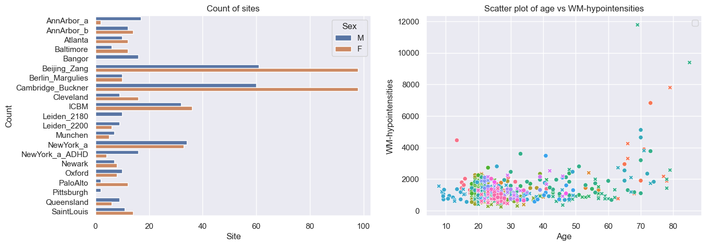
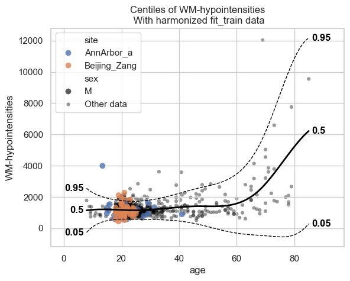
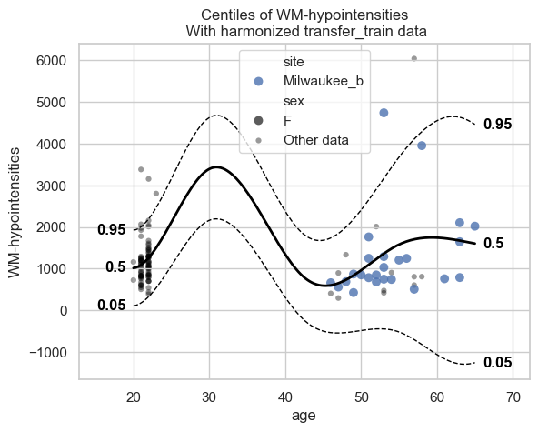
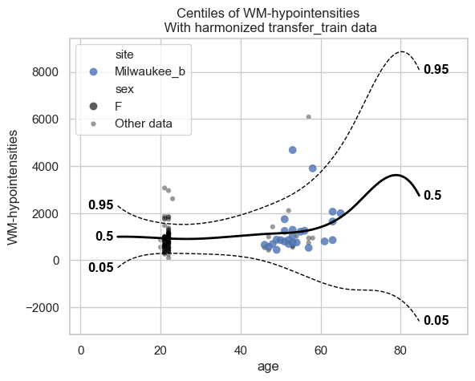
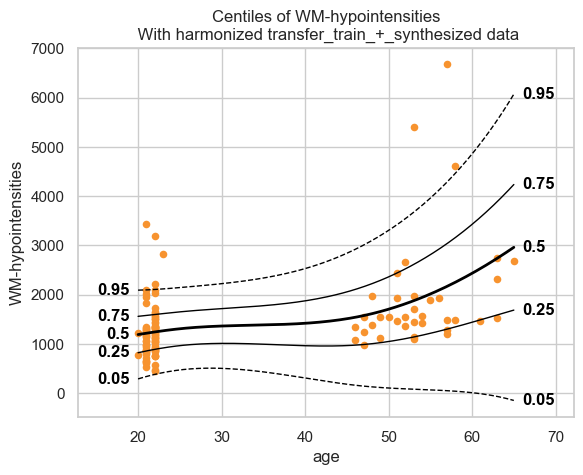

Transfering and extending normative models
==========================================

Welcome to this tutorial notebook that will go through the transfering
and extending of existing models on new data.

Transfer and Extend are both useful for when you have only a small
dataset to your disposal, but you still want to derive a well-calibrated
model from that. In both cases, a reference model is used in tandem with
the small dataset to derive a new model that is better than a model that
would be trained solely on the small dataset.

For transfer, the new model will only be able to handle data from the
batches in the small dataset; a small model is derived from a large
reference model.

For extend, the new model will be able to handle data from batches in
the reference training set, as well as the batches in the new small
dataset; a larger reference model is derived from a large reference
model.

Imports
~~~~~~~

.. code:: ipython3

    import warnings
    import logging
    
    
    import pandas as pd
    import matplotlib.pyplot as plt
    from pcntoolkit import (
        HBR,
        BsplineBasisFunction,
        NormativeModel,
        NormData,
        load_fcon1000,
        NormalLikelihood,
        make_prior,
        plot_centiles,
        plot_centiles_advanced,
        plot_ridge,
    )
    
    import numpy as np
    import pcntoolkit.util.output
    import seaborn as sns
    import os
    
    sns.set_style("darkgrid")
    
    # Suppress some annoying warnings and logs
    pymc_logger = logging.getLogger("pymc")
    
    pymc_logger.setLevel(logging.WARNING)
    pymc_logger.propagate = False
    
    warnings.simplefilter(action="ignore", category=FutureWarning)
    pd.options.mode.chained_assignment = None  # default='warn'
    pcntoolkit.util.output.Output.set_show_messages(False)

Load data
---------

First we download a small example dataset from github.

.. code:: ipython3

    # Download the dataset
    norm_data: NormData = load_fcon1000()
    features_to_model = [
        "WM-hypointensities",
        # "Right-Lateral-Ventricle",
        # "Right-Amygdala",
        # "CortexVol",
    ]
    # Select only a few features
    norm_data = norm_data.sel({"response_vars": features_to_model})
    
    # Leave two sites out for doing transfer and extend later
    transfer_sites = ["Milwaukee_b", "Oulu"]
    transfer_data, fit_data = norm_data.batch_effects_split({"site": transfer_sites}, names=("transfer", "fit"))
    
    # Split into train and test sets
    train, test = fit_data.train_test_split()
    transfer_train, transfer_test = transfer_data.train_test_split()

.. code:: ipython3

    # Visualize the data
    feature_to_plot = features_to_model[0]
    df = train.to_dataframe()
    fig, ax = plt.subplots(1, 2, figsize=(15, 5))
    
    sns.countplot(data=df, y=("batch_effects", "site"), hue=("batch_effects", "sex"), ax=ax[0], orient="h")
    ax[0].legend(title="Sex")
    ax[0].set_title("Count of sites")
    ax[0].set_xlabel("Site")
    ax[0].set_ylabel("Count")
    sns.scatterplot(
        data=df,
        x=("X", "age"),
        y=("Y", feature_to_plot),
        hue=("batch_effects", "site"),
        style=("batch_effects", "sex"),
        ax=ax[1],
    )
    ax[1].legend([], [])
    ax[1].set_title(f"Scatter plot of age vs {feature_to_plot}")
    ax[1].set_xlabel("Age")
    ax[1].set_ylabel(feature_to_plot)
    
    plt.show()

Creating a Normative model
--------------------------

We will use the same HBR model that we used in the tutorial “Normative
Modelling: Hierarchical Bayesian Regression with Normal likelihood”.
Please read that tutorial for an extensive coverage of the
configuration.

.. code:: ipython3

    mu = make_prior(
        linear=True,
        slope=make_prior(dist_name="Normal", dist_params=(0.0, 10.0)),
        intercept=make_prior(
            random=True,
            mu=make_prior(dist_name="Normal", dist_params=(0.0, 1.0)),
            sigma=make_prior(dist_name="Normal", dist_params=(0.0, 1.0), mapping="softplus", mapping_params=(0.0, 3.0)),
        ),
        basis_function=BsplineBasisFunction(basis_column=0, nknots=5, degree=3),
    )
    sigma = make_prior(
        linear=True,
        slope=make_prior(dist_name="Normal", dist_params=(0.0, 2.0)),
        intercept=make_prior(dist_name="Normal", dist_params=(1.0, 1.0)),
        basis_function=BsplineBasisFunction(basis_column=0, nknots=5, degree=3),
        mapping="softplus",
        mapping_params=(0.0, 3.0),
    )
    
    likelihood = NormalLikelihood(mu, sigma)
    
    template_hbr = HBR(
        name="template",
        cores=16,
        progressbar=True,
        draws=1500,
        tune=500,
        chains=4,
        nuts_sampler="nutpie",
        likelihood=likelihood,
    )
    model = NormativeModel(
        template_regression_model=template_hbr,
        savemodel=True,
        evaluate_model=True,
        saveresults=True,
        saveplots=False,
        save_dir="resources/hbr/save_dir",
        inscaler="standardize",
        outscaler="standardize",
    )

.. code:: ipython3

    test = model.fit_predict(train, test)

.. raw:: html

    
    

.. raw:: html

    
    

        
<strong>Sampler Progress</strong>

        
Total Chains: 4

        
Active Chains: 0

        

            Finished Chains:
            4
        

        
Sampling for now

        

            Estimated Time to Completion:
            now
        

    
        <progress
            id="total-progress-bar"
            max="8000"
            value="8000">
        </progress>
        <table>
            <thead>
                <tr>
                    <th>Progress</th>
                    <th>Draws</th>
                    <th>Divergences</th>
                    <th>Step Size</th>
                    <th>Gradients/Draw</th>
                </tr>
            </thead>
            <tbody id="chain-details">
    
                    <tr>
                        <td class="progress-cell">
                            <progress
                                max="2000"
                                value="2000">
                            </progress>
                        </td>
                        <td>2000</td>
                        <td>0</td>
                        <td>0.10</td>
                        <td>63</td>
                    </tr>
    
                    <tr>
                        <td class="progress-cell">
                            <progress
                                max="2000"
                                value="2000">
                            </progress>
                        </td>
                        <td>2000</td>
                        <td>0</td>
                        <td>0.11</td>
                        <td>63</td>
                    </tr>
    
                    <tr>
                        <td class="progress-cell">
                            <progress
                                max="2000"
                                value="2000">
                            </progress>
                        </td>
                        <td>2000</td>
                        <td>0</td>
                        <td>0.13</td>
                        <td>31</td>
                    </tr>
    
                    <tr>
                        <td class="progress-cell">
                            <progress
                                max="2000"
                                value="2000">
                            </progress>
                        </td>
                        <td>2000</td>
                        <td>0</td>
                        <td>0.11</td>
                        <td>511</td>
                    </tr>
    
                </tr>
            </tbody>
        </table>
    

.. code:: ipython3

    plot_centiles_advanced(
        model,
        scatter_data=train,  # Scatter this data along with the centiles
    )

Extending
---------

Now that we have a fitted model, we can extend it using the data that we
held out of the train set. This is from previously unseen sites. Trying
to run predict on it now, with the current model, will result in an
error:

.. code:: ipython3

    try:
        model.predict(transfer_train)
    except Exception as e:
        print(e)

.. parsed-literal::

    Data is not compatible with the model!

.. parsed-literal::

    /opt/anaconda3/envs/ptk/lib/python3.12/site-packages/pcntoolkit/util/output.py:239: UserWarning: Process: 76944 - 2025-11-20 13:16:29 - The dataset transfer_train has unknown batch effects: {np.str_('sex'): [], np.str_('site'): [np.str_('Milwaukee_b'), np.str_('Oulu')]}
      warnings.warn(message)

And just to show why we prefer extend over just fitting a new model on
the held-out dataset, we can show how bad such a model would be:

.. code:: ipython3

    small_model = NormativeModel(
        template_regression_model=template_hbr,
        savemodel=True,
        evaluate_model=True,
        saveresults=True,
        saveplots=False,
        save_dir="resources/hbr/save_dir",
        inscaler="standardize",
        outscaler="standardize",
    )
    small_model.fit_predict(transfer_train, transfer_test)
    plot_centiles(
        small_model,
        scatter_data=transfer_train,
    )

.. raw:: html

    
    

.. raw:: html

    
    

        
<strong>Sampler Progress</strong>

        
Total Chains: 4

        
Active Chains: 0

        

            Finished Chains:
            4
        

        
Sampling for now

        

            Estimated Time to Completion:
            now
        

    
        <progress
            id="total-progress-bar"
            max="8000"
            value="8000">
        </progress>
        <table>
            <thead>
                <tr>
                    <th>Progress</th>
                    <th>Draws</th>
                    <th>Divergences</th>
                    <th>Step Size</th>
                    <th>Gradients/Draw</th>
                </tr>
            </thead>
            <tbody id="chain-details">
    
                    <tr>
                        <td class="progress-cell">
                            <progress
                                max="2000"
                                value="2000">
                            </progress>
                        </td>
                        <td>2000</td>
                        <td>0</td>
                        <td>0.12</td>
                        <td>127</td>
                    </tr>
    
                    <tr>
                        <td class="progress-cell">
                            <progress
                                max="2000"
                                value="2000">
                            </progress>
                        </td>
                        <td>2000</td>
                        <td>0</td>
                        <td>0.13</td>
                        <td>127</td>
                    </tr>
    
                    <tr>
                        <td class="progress-cell">
                            <progress
                                max="2000"
                                value="2000">
                            </progress>
                        </td>
                        <td>2000</td>
                        <td>0</td>
                        <td>0.12</td>
                        <td>191</td>
                    </tr>
    
                    <tr>
                        <td class="progress-cell">
                            <progress
                                max="2000"
                                value="2000">
                            </progress>
                        </td>
                        <td>2000</td>
                        <td>1</td>
                        <td>0.13</td>
                        <td>63</td>
                    </tr>
    
                </tr>
            </tbody>
        </table>
    

The interpolation between ages 22 and 45 is very bad, and that’s because
there was no train data there. This model will not perform well on new
data. Now instead, let’s transfer the model we fitted before to our
smaller dataset, and see how those centiles look:

.. code:: ipython3

    extended_model = model.extend_predict(transfer_train, transfer_test)
    plot_centiles_advanced(
        extended_model,
        scatter_data=transfer_train,
    )

.. raw:: html

    
    

.. raw:: html

    
    

        
<strong>Sampler Progress</strong>

        
Total Chains: 4

        
Active Chains: 0

        

            Finished Chains:
            4
        

        
Sampling for 15 seconds

        

            Estimated Time to Completion:
            now
        

    
        <progress
            id="total-progress-bar"
            max="8000"
            value="8000">
        </progress>
        <table>
            <thead>
                <tr>
                    <th>Progress</th>
                    <th>Draws</th>
                    <th>Divergences</th>
                    <th>Step Size</th>
                    <th>Gradients/Draw</th>
                </tr>
            </thead>
            <tbody id="chain-details">
    
                    <tr>
                        <td class="progress-cell">
                            <progress
                                max="2000"
                                value="2000">
                            </progress>
                        </td>
                        <td>2000</td>
                        <td>0</td>
                        <td>0.11</td>
                        <td>31</td>
                    </tr>
    
                    <tr>
                        <td class="progress-cell">
                            <progress
                                max="2000"
                                value="2000">
                            </progress>
                        </td>
                        <td>2000</td>
                        <td>0</td>
                        <td>0.10</td>
                        <td>63</td>
                    </tr>
    
                    <tr>
                        <td class="progress-cell">
                            <progress
                                max="2000"
                                value="2000">
                            </progress>
                        </td>
                        <td>2000</td>
                        <td>0</td>
                        <td>0.12</td>
                        <td>95</td>
                    </tr>
    
                    <tr>
                        <td class="progress-cell">
                            <progress
                                max="2000"
                                value="2000">
                            </progress>
                        </td>
                        <td>2000</td>
                        <td>0</td>
                        <td>0.11</td>
                        <td>319</td>
                    </tr>
    
                </tr>
            </tbody>
        </table>
    

These centiles look much better. The extended model is a larger model
than the original one, it can be used on the original train data as well
as the extended data:

.. code:: ipython3

    extended_model.predict(train)

.. raw:: html

    
<svg style="position: absolute; width: 0; height: 0; overflow: hidden">
    <defs>
    <symbol id="icon-database" viewBox="0 0 32 32">
    <path d="M16 0c-8.837 0-16 2.239-16 5v4c0 2.761 7.163 5 16 5s16-2.239 16-5v-4c0-2.761-7.163-5-16-5z"></path>
    <path d="M16 17c-8.837 0-16-2.239-16-5v6c0 2.761 7.163 5 16 5s16-2.239 16-5v-6c0 2.761-7.163 5-16 5z"></path>
    <path d="M16 26c-8.837 0-16-2.239-16-5v6c0 2.761 7.163 5 16 5s16-2.239 16-5v-6c0 2.761-7.163 5-16 5z"></path>
    </symbol>
    <symbol id="icon-file-text2" viewBox="0 0 32 32">
    <path d="M28.681 7.159c-0.694-0.947-1.662-2.053-2.724-3.116s-2.169-2.030-3.116-2.724c-1.612-1.182-2.393-1.319-2.841-1.319h-15.5c-1.378 0-2.5 1.121-2.5 2.5v27c0 1.378 1.122 2.5 2.5 2.5h23c1.378 0 2.5-1.122 2.5-2.5v-19.5c0-0.448-0.137-1.23-1.319-2.841zM24.543 5.457c0.959 0.959 1.712 1.825 2.268 2.543h-4.811v-4.811c0.718 0.556 1.584 1.309 2.543 2.268zM28 29.5c0 0.271-0.229 0.5-0.5 0.5h-23c-0.271 0-0.5-0.229-0.5-0.5v-27c0-0.271 0.229-0.5 0.5-0.5 0 0 15.499-0 15.5 0v7c0 0.552 0.448 1 1 1h7v19.5z"></path>
    <path d="M23 26h-14c-0.552 0-1-0.448-1-1s0.448-1 1-1h14c0.552 0 1 0.448 1 1s-0.448 1-1 1z"></path>
    <path d="M23 22h-14c-0.552 0-1-0.448-1-1s0.448-1 1-1h14c0.552 0 1 0.448 1 1s-0.448 1-1 1z"></path>
    <path d="M23 18h-14c-0.552 0-1-0.448-1-1s0.448-1 1-1h14c0.552 0 1 0.448 1 1s-0.448 1-1 1z"></path>
    </symbol>
    </defs>
    </svg>
    <pre class='xr-text-repr-fallback'>&lt;xarray.NormData&gt; Size: 179kB
    Dimensions:            (observations: 744, response_vars: 1, covariates: 1,
                            batch_effect_dims: 2, statistic: 11, centile: 5)
    Coordinates:
      * observations       (observations) int64 6kB 459 995 432 ... 1023 1062 372
      * response_vars      (response_vars) &lt;U18 72B &#x27;WM-hypointensities&#x27;
      * covariates         (covariates) &lt;U3 12B &#x27;age&#x27;
      * batch_effect_dims  (batch_effect_dims) &lt;U4 32B &#x27;sex&#x27; &#x27;site&#x27;
      * statistic          (statistic) &lt;U8 352B &#x27;EXPV&#x27; &#x27;MACE&#x27; ... &#x27;SMSE&#x27; &#x27;ShapiroW&#x27;
      * centile            (centile) float64 40B 0.05 0.25 0.5 0.75 0.95
    Data variables:
        subject_ids        (observations) object 6kB &#x27;Cambridge_Buckner_sub53615&#x27;...
        Y                  (observations, response_vars) float64 6kB 974.0 ... 1....
        X                  (observations, covariates) float64 6kB 19.0 29.0 ... 25.0
        batch_effects      (observations, batch_effect_dims) &lt;U17 101kB &#x27;M&#x27; ... &#x27;...
        Z                  (observations, response_vars) float64 6kB -1.035 ... 1...
        logp               (observations, response_vars) float64 6kB -0.7314 ... ...
        Yhat               (observations, response_vars) float64 6kB 1.402e+03 .....
        statistics         (response_vars, statistic) float64 88B 0.3637 ... 0.9033
        Y_harmonized       (observations, response_vars) float64 6kB 802.4 ... 1....
        centiles           (centile, observations, response_vars) float64 30kB 72...
    Attributes:
        real_ids:                       True
        is_scaled:                      False
        name:                           fit_train
        unique_batch_effects:           {np.str_(&#x27;sex&#x27;): [np.str_(&#x27;F&#x27;), np.str_(&#x27;...
        batch_effect_counts:            defaultdict(&lt;function NormData.register_b...
        covariate_ranges:               {np.str_(&#x27;age&#x27;): {&#x27;mean&#x27;: np.float64(27.7...
        batch_effect_covariate_ranges:  {np.str_(&#x27;sex&#x27;): {np.str_(&#x27;F&#x27;): {np.str_(...</pre>

xarray.NormData

<ul class='xr-sections'><li class='xr-section-item'><input id='section-aadf494f-2f23-4ef9-a0ee-72b23382f233' class='xr-section-summary-in' type='checkbox' disabled ><label for='section-aadf494f-2f23-4ef9-a0ee-72b23382f233' class='xr-section-summary'  title='Expand/collapse section'>Dimensions:</label>
<ul class='xr-dim-list'><li>observations: 744</li><li>response_vars: 1</li><li>covariates: 1</li><li>batch_effect_dims: 2</li><li>statistic: 11</li><li>centile: 5</li></ul>

</li><li class='xr-section-item'><input id='section-8b56e069-6e01-49e1-80f5-34de2673a9d0' class='xr-section-summary-in' type='checkbox'  checked><label for='section-8b56e069-6e01-49e1-80f5-34de2673a9d0' class='xr-section-summary' >Coordinates: (6)</label>

<ul class='xr-var-list'><li class='xr-var-item'>
observations

(observations)

int64

459 995 432 288 ... 1023 1062 372
<input id='attrs-d5ebb667-4d64-462c-977d-8bcc98274537' class='xr-var-attrs-in' type='checkbox' disabled><label for='attrs-d5ebb667-4d64-462c-977d-8bcc98274537' title='Show/Hide attributes'><svg class='icon xr-icon-file-text2'><use xlink:href='#icon-file-text2'></use></svg></label><input id='data-1816f60b-c258-418c-b7cd-e4b38150045a' class='xr-var-data-in' type='checkbox'><label for='data-1816f60b-c258-418c-b7cd-e4b38150045a' title='Show/Hide data repr'><svg class='icon xr-icon-database'><use xlink:href='#icon-database'></use></svg></label>
<dl class='xr-attrs'></dl>

<pre>array([ 459,  995,  432, ..., 1023, 1062,  372], shape=(744,))</pre>
</li><li class='xr-var-item'>
response_vars

(response_vars)

&lt;U18

&#x27;WM-hypointensities&#x27;
<input id='attrs-c879e5c2-fa3d-45b7-ae82-a616da2bf090' class='xr-var-attrs-in' type='checkbox' disabled><label for='attrs-c879e5c2-fa3d-45b7-ae82-a616da2bf090' title='Show/Hide attributes'><svg class='icon xr-icon-file-text2'><use xlink:href='#icon-file-text2'></use></svg></label><input id='data-ae9c0e96-73ff-4065-9681-928990973332' class='xr-var-data-in' type='checkbox'><label for='data-ae9c0e96-73ff-4065-9681-928990973332' title='Show/Hide data repr'><svg class='icon xr-icon-database'><use xlink:href='#icon-database'></use></svg></label>
<dl class='xr-attrs'></dl>

<pre>array([&#x27;WM-hypointensities&#x27;], dtype=&#x27;&lt;U18&#x27;)</pre>
</li><li class='xr-var-item'>
covariates

(covariates)

&lt;U3

&#x27;age&#x27;
<input id='attrs-8d86b522-c78c-4c5d-817c-0433ebc55447' class='xr-var-attrs-in' type='checkbox' disabled><label for='attrs-8d86b522-c78c-4c5d-817c-0433ebc55447' title='Show/Hide attributes'><svg class='icon xr-icon-file-text2'><use xlink:href='#icon-file-text2'></use></svg></label><input id='data-908a4a67-7559-478f-b739-825dbe2a7069' class='xr-var-data-in' type='checkbox'><label for='data-908a4a67-7559-478f-b739-825dbe2a7069' title='Show/Hide data repr'><svg class='icon xr-icon-database'><use xlink:href='#icon-database'></use></svg></label>
<dl class='xr-attrs'></dl>

<pre>array([&#x27;age&#x27;], dtype=&#x27;&lt;U3&#x27;)</pre>
</li><li class='xr-var-item'>
batch_effect_dims

(batch_effect_dims)

&lt;U4

&#x27;sex&#x27; &#x27;site&#x27;
<input id='attrs-5712d0eb-cdf9-44bf-ac7a-4745a699c9f6' class='xr-var-attrs-in' type='checkbox' disabled><label for='attrs-5712d0eb-cdf9-44bf-ac7a-4745a699c9f6' title='Show/Hide attributes'><svg class='icon xr-icon-file-text2'><use xlink:href='#icon-file-text2'></use></svg></label><input id='data-16da2bc8-57a9-4496-8c45-8d9160532b7e' class='xr-var-data-in' type='checkbox'><label for='data-16da2bc8-57a9-4496-8c45-8d9160532b7e' title='Show/Hide data repr'><svg class='icon xr-icon-database'><use xlink:href='#icon-database'></use></svg></label>
<dl class='xr-attrs'></dl>

<pre>array([&#x27;sex&#x27;, &#x27;site&#x27;], dtype=&#x27;&lt;U4&#x27;)</pre>
</li><li class='xr-var-item'>
statistic

(statistic)

&lt;U8

&#x27;EXPV&#x27; &#x27;MACE&#x27; ... &#x27;SMSE&#x27; &#x27;ShapiroW&#x27;
<input id='attrs-a344936a-d476-457d-a5fa-0be83eeecf5c' class='xr-var-attrs-in' type='checkbox' disabled><label for='attrs-a344936a-d476-457d-a5fa-0be83eeecf5c' title='Show/Hide attributes'><svg class='icon xr-icon-file-text2'><use xlink:href='#icon-file-text2'></use></svg></label><input id='data-7ebf782e-c65f-4c5e-a1d6-e0483c8d4c4b' class='xr-var-data-in' type='checkbox'><label for='data-7ebf782e-c65f-4c5e-a1d6-e0483c8d4c4b' title='Show/Hide data repr'><svg class='icon xr-icon-database'><use xlink:href='#icon-database'></use></svg></label>
<dl class='xr-attrs'></dl>

<pre>array([&#x27;EXPV&#x27;, &#x27;MACE&#x27;, &#x27;MAPE&#x27;, &#x27;MSLL&#x27;, &#x27;NLL&#x27;, &#x27;R2&#x27;, &#x27;RMSE&#x27;, &#x27;Rho&#x27;, &#x27;Rho_p&#x27;,
           &#x27;SMSE&#x27;, &#x27;ShapiroW&#x27;], dtype=&#x27;&lt;U8&#x27;)</pre>
</li><li class='xr-var-item'>
centile

(centile)

float64

0.05 0.25 0.5 0.75 0.95
<input id='attrs-a0174cd3-59e7-4b08-a694-3c7cbde16dd1' class='xr-var-attrs-in' type='checkbox' disabled><label for='attrs-a0174cd3-59e7-4b08-a694-3c7cbde16dd1' title='Show/Hide attributes'><svg class='icon xr-icon-file-text2'><use xlink:href='#icon-file-text2'></use></svg></label><input id='data-6fc0a28a-d421-4a1e-a49e-1a79b841b218' class='xr-var-data-in' type='checkbox'><label for='data-6fc0a28a-d421-4a1e-a49e-1a79b841b218' title='Show/Hide data repr'><svg class='icon xr-icon-database'><use xlink:href='#icon-database'></use></svg></label>
<dl class='xr-attrs'></dl>

<pre>array([0.05, 0.25, 0.5 , 0.75, 0.95])</pre>
</li></ul>
</li><li class='xr-section-item'><input id='section-792b08b5-bbc1-4bb8-9ef7-e9b01ac108b5' class='xr-section-summary-in' type='checkbox'  checked><label for='section-792b08b5-bbc1-4bb8-9ef7-e9b01ac108b5' class='xr-section-summary' >Data variables: (10)</label>

<ul class='xr-var-list'><li class='xr-var-item'>
subject_ids

(observations)

object

&#x27;Cambridge_Buckner_sub53615&#x27; ......
<input id='attrs-17920fec-1899-459a-b38c-60330339f883' class='xr-var-attrs-in' type='checkbox' disabled><label for='attrs-17920fec-1899-459a-b38c-60330339f883' title='Show/Hide attributes'><svg class='icon xr-icon-file-text2'><use xlink:href='#icon-file-text2'></use></svg></label><input id='data-254d187c-2c0a-45b0-a596-47cffabf4c9f' class='xr-var-data-in' type='checkbox'><label for='data-254d187c-2c0a-45b0-a596-47cffabf4c9f' title='Show/Hide data repr'><svg class='icon xr-icon-database'><use xlink:href='#icon-database'></use></svg></label>
<dl class='xr-attrs'></dl>

<pre>array([&#x27;Cambridge_Buckner_sub53615&#x27;, &#x27;Oxford_sub47141&#x27;,
           &#x27;Cambridge_Buckner_sub42146&#x27;, &#x27;Beijing_Zang_sub82714&#x27;,
           &#x27;AnnArbor_a_sub96621&#x27;, &#x27;SaintLouis_sub95721&#x27;, &#x27;Cleveland_sub99664&#x27;,
           &#x27;Cambridge_Buckner_sub83683&#x27;, &#x27;Beijing_Zang_sub59347&#x27;,
           &#x27;Munchen_sub70942&#x27;, &#x27;Cambridge_Buckner_sub13187&#x27;,
           &#x27;Cambridge_Buckner_sub13902&#x27;, &#x27;Queensland_sub39524&#x27;,
           &#x27;Atlanta_sub52783&#x27;, &#x27;Cleveland_sub18011&#x27;, &#x27;Beijing_Zang_sub61961&#x27;,
           &#x27;Baltimore_sub52358&#x27;, &#x27;Beijing_Zang_sub54890&#x27;,
           &#x27;Beijing_Zang_sub55736&#x27;, &#x27;Munchen_sub31272&#x27;,
           &#x27;Beijing_Zang_sub55856&#x27;, &#x27;Beijing_Zang_sub55541&#x27;,
           &#x27;Atlanta_sub91049&#x27;, &#x27;NewYork_a_ADHD_sub15758&#x27;,
           &#x27;Baltimore_sub19738&#x27;, &#x27;Cleveland_sub26557&#x27;,
           &#x27;Cambridge_Buckner_sub57221&#x27;, &#x27;Beijing_Zang_sub40427&#x27;,
           &#x27;ICBM_sub53801&#x27;, &#x27;Oxford_sub66945&#x27;, &#x27;Beijing_Zang_sub38602&#x27;,
           &#x27;ICBM_sub54887&#x27;, &#x27;AnnArbor_b_sub43409&#x27;,
           &#x27;Cambridge_Buckner_sub51050&#x27;, &#x27;ICBM_sub29353&#x27;, &#x27;ICBM_sub76678&#x27;,
           &#x27;Munchen_sub28902&#x27;, &#x27;ICBM_sub47753&#x27;, &#x27;SaintLouis_sub74078&#x27;,
           &#x27;Cambridge_Buckner_sub78547&#x27;, &#x27;Leiden_2180_sub56299&#x27;,
           &#x27;Beijing_Zang_sub89592&#x27;, &#x27;ICBM_sub30623&#x27;, &#x27;Atlanta_sub86323&#x27;,
           &#x27;SaintLouis_sub99965&#x27;, &#x27;Baltimore_sub86414&#x27;,
    ...
           &#x27;PaloAlto_sub58313&#x27;, &#x27;SaintLouis_sub88823&#x27;, &#x27;Baltimore_sub54329&#x27;,
           &#x27;Beijing_Zang_sub42512&#x27;, &#x27;Newark_sub13411&#x27;,
           &#x27;Cambridge_Buckner_sub99085&#x27;, &#x27;Beijing_Zang_sub51015&#x27;,
           &#x27;Berlin_Margulies_sub85681&#x27;, &#x27;Beijing_Zang_sub00440&#x27;,
           &#x27;Cambridge_Buckner_sub13093&#x27;, &#x27;Beijing_Zang_sub80927&#x27;,
           &#x27;SaintLouis_sub46405&#x27;, &#x27;Cambridge_Buckner_sub34586&#x27;,
           &#x27;Atlanta_sub58250&#x27;, &#x27;Cambridge_Buckner_sub50953&#x27;,
           &#x27;Berlin_Margulies_sub12855&#x27;, &#x27;Berlin_Margulies_sub06716&#x27;,
           &#x27;Cambridge_Buckner_sub07413&#x27;, &#x27;Beijing_Zang_sub95575&#x27;,
           &#x27;Beijing_Zang_sub92430&#x27;, &#x27;Beijing_Zang_sub30272&#x27;,
           &#x27;Cambridge_Buckner_sub45604&#x27;, &#x27;ICBM_sub98317&#x27;,
           &#x27;Baltimore_sub54257&#x27;, &#x27;Oxford_sub40451&#x27;, &#x27;Atlanta_sub00354&#x27;,
           &#x27;Beijing_Zang_sub04191&#x27;, &#x27;Leiden_2180_sub08518&#x27;,
           &#x27;Cambridge_Buckner_sub16390&#x27;, &#x27;AnnArbor_b_sub57196&#x27;,
           &#x27;Beijing_Zang_sub75878&#x27;, &#x27;ICBM_sub76325&#x27;, &#x27;Beijing_Zang_sub35776&#x27;,
           &#x27;PaloAlto_sub46856&#x27;, &#x27;ICBM_sub48210&#x27;, &#x27;AnnArbor_b_sub00306&#x27;,
           &#x27;AnnArbor_b_sub98007&#x27;, &#x27;NewYork_a_sub53710&#x27;,
           &#x27;NewYork_a_ADHD_sub20676&#x27;, &#x27;Berlin_Margulies_sub54976&#x27;,
           &#x27;NewYork_a_sub20732&#x27;, &#x27;PaloAlto_sub96705&#x27;, &#x27;SaintLouis_sub58674&#x27;,
           &#x27;Cambridge_Buckner_sub09015&#x27;], dtype=object)</pre>
</li><li class='xr-var-item'>
Y

(observations, response_vars)

float64

974.0 1.114e+03 ... 485.4 1.934e+03
<input id='attrs-4eab8b85-abc9-4e72-9be6-e8cb73479682' class='xr-var-attrs-in' type='checkbox' disabled><label for='attrs-4eab8b85-abc9-4e72-9be6-e8cb73479682' title='Show/Hide attributes'><svg class='icon xr-icon-file-text2'><use xlink:href='#icon-file-text2'></use></svg></label><input id='data-02462b63-4460-4c3e-a2c5-1f56df47636b' class='xr-var-data-in' type='checkbox'><label for='data-02462b63-4460-4c3e-a2c5-1f56df47636b' title='Show/Hide data repr'><svg class='icon xr-icon-database'><use xlink:href='#icon-database'></use></svg></label>
<dl class='xr-attrs'></dl>

<pre>array([[  974. ],
           [ 1113.8],
           [  916. ],
           [  612.6],
           [ 1622.6],
           [ 1028.1],
           [  845. ],
           [  987.5],
           [ 1390.5],
           [ 4640.5],
           [  946. ],
           [  934. ],
           [ 1003.4],
           [  626.5],
           [ 1378.7],
           [ 1108.7],
           [  865.6],
           [ 1456.4],
           [ 1041.4],
           [ 1829.5],
    ...
           [  710.6],
           [  855.6],
           [  927.2],
           [ 1136.1],
           [ 1422.8],
           [ 2170.7],
           [ 1034.2],
           [  765.3],
           [  697.5],
           [  760.9],
           [ 3769.9],
           [ 1080. ],
           [ 4248.1],
           [ 1178. ],
           [ 1295.7],
           [  664.4],
           [  937.1],
           [ 2242.1],
           [  485.4],
           [ 1934.5]])</pre>
</li><li class='xr-var-item'>
X

(observations, covariates)

float64

19.0 29.0 24.0 ... 29.0 28.0 25.0
<input id='attrs-0f4e2f94-fff8-4140-bd0a-b060ae39b98e' class='xr-var-attrs-in' type='checkbox' disabled><label for='attrs-0f4e2f94-fff8-4140-bd0a-b060ae39b98e' title='Show/Hide attributes'><svg class='icon xr-icon-file-text2'><use xlink:href='#icon-file-text2'></use></svg></label><input id='data-76b48d5a-04e5-4b2e-be69-973e8a45ebbe' class='xr-var-data-in' type='checkbox'><label for='data-76b48d5a-04e5-4b2e-be69-973e8a45ebbe' title='Show/Hide data repr'><svg class='icon xr-icon-database'><use xlink:href='#icon-database'></use></svg></label>
<dl class='xr-attrs'></dl>

<pre>array([[19.  ],
           [29.  ],
           [24.  ],
           [20.  ],
           [15.56],
           [21.  ],
           [57.  ],
           [22.  ],
           [21.  ],
           [70.  ],
           [23.  ],
           [19.  ],
           [27.  ],
           [22.  ],
           [55.  ],
           [21.  ],
           [40.  ],
           [21.  ],
           [19.  ],
           [74.  ],
    ...
           [34.  ],
           [28.  ],
           [24.  ],
           [21.  ],
           [23.  ],
           [77.  ],
           [24.  ],
           [57.  ],
           [24.  ],
           [22.  ],
           [73.  ],
           [68.  ],
           [66.  ],
           [34.72],
           [49.19],
           [37.  ],
           [11.07],
           [29.  ],
           [28.  ],
           [25.  ]])</pre>
</li><li class='xr-var-item'>
batch_effects

(observations, batch_effect_dims)

&lt;U17

&#x27;M&#x27; ... &#x27;Cambridge_Buckner&#x27;
<input id='attrs-c85abdae-0618-4c19-8b8a-7756f9955349' class='xr-var-attrs-in' type='checkbox' disabled><label for='attrs-c85abdae-0618-4c19-8b8a-7756f9955349' title='Show/Hide attributes'><svg class='icon xr-icon-file-text2'><use xlink:href='#icon-file-text2'></use></svg></label><input id='data-ebc1a341-dae0-49b7-808d-85cc3185c756' class='xr-var-data-in' type='checkbox'><label for='data-ebc1a341-dae0-49b7-808d-85cc3185c756' title='Show/Hide data repr'><svg class='icon xr-icon-database'><use xlink:href='#icon-database'></use></svg></label>
<dl class='xr-attrs'></dl>

<pre>array([[&#x27;M&#x27;, &#x27;Cambridge_Buckner&#x27;],
           [&#x27;F&#x27;, &#x27;Oxford&#x27;],
           [&#x27;F&#x27;, &#x27;Cambridge_Buckner&#x27;],
           ...,
           [&#x27;F&#x27;, &#x27;PaloAlto&#x27;],
           [&#x27;F&#x27;, &#x27;SaintLouis&#x27;],
           [&#x27;F&#x27;, &#x27;Cambridge_Buckner&#x27;]], shape=(744, 2), dtype=&#x27;&lt;U17&#x27;)</pre>
</li><li class='xr-var-item'>
Z

(observations, response_vars)

float64

-1.035 0.4821 ... -0.6326 1.832
<input id='attrs-9763bf7a-7964-4289-b9a0-9b2ee6b66775' class='xr-var-attrs-in' type='checkbox' disabled><label for='attrs-9763bf7a-7964-4289-b9a0-9b2ee6b66775' title='Show/Hide attributes'><svg class='icon xr-icon-file-text2'><use xlink:href='#icon-file-text2'></use></svg></label><input id='data-37e6403b-a718-4462-926c-86ce35324709' class='xr-var-data-in' type='checkbox'><label for='data-37e6403b-a718-4462-926c-86ce35324709' title='Show/Hide data repr'><svg class='icon xr-icon-database'><use xlink:href='#icon-database'></use></svg></label>
<dl class='xr-attrs'></dl>

<pre>array([[-1.03495918e+00],
           [ 4.82110777e-01],
           [-7.69863863e-01],
           [-9.27981878e-01],
           [ 3.42622725e-02],
           [ 7.82889130e-01],
           [-4.34574636e-01],
           [-5.79797501e-01],
           [ 5.85706463e-01],
           [ 7.10086226e-01],
           [-1.12207192e+00],
           [-1.13165633e+00],
           [ 5.70933849e-02],
           [-5.83955759e-01],
           [-7.17013846e-02],
           [ 3.08503886e-01],
           [ 3.95607190e-02],
           [ 1.17627159e+00],
           [-3.03557801e-01],
           [-8.15575507e-01],
    ...
           [-1.02206216e+00],
           [-6.78884255e-02],
           [-5.76642331e-01],
           [ 2.86759670e-01],
           [ 5.26522909e-01],
           [-8.64959390e-01],
           [-3.02820512e-01],
           [-5.73067479e-01],
           [-1.16446356e+00],
           [-1.28084318e+00],
           [ 9.70738275e-04],
           [-9.00302758e-01],
           [ 9.69113961e-01],
           [ 2.74186553e-01],
           [-1.73629588e-01],
           [-4.12645320e-01],
           [-5.35226503e-01],
           [ 2.33939900e+00],
           [-6.32568255e-01],
           [ 1.83214840e+00]])</pre>
</li><li class='xr-var-item'>
logp

(observations, response_vars)

float64

-0.7314 -0.3002 ... -0.3636 -1.814
<input id='attrs-7f9add43-3f51-448f-abd5-0ced5c6d4d55' class='xr-var-attrs-in' type='checkbox' disabled><label for='attrs-7f9add43-3f51-448f-abd5-0ced5c6d4d55' title='Show/Hide attributes'><svg class='icon xr-icon-file-text2'><use xlink:href='#icon-file-text2'></use></svg></label><input id='data-bc8602f3-4e11-4591-bde1-7e9ac5a50456' class='xr-var-data-in' type='checkbox'><label for='data-bc8602f3-4e11-4591-bde1-7e9ac5a50456' title='Show/Hide data repr'><svg class='icon xr-icon-database'><use xlink:href='#icon-database'></use></svg></label>
<dl class='xr-attrs'></dl>

<pre>array([[ -0.73138379],
           [ -0.30024691],
           [ -0.43181896],
           [ -0.60655884],
           [ -0.30583961],
           [ -0.48240038],
           [ -1.32005173],
           [ -0.31730421],
           [ -0.33238232],
           [ -2.1275148 ],
           [ -0.77066067],
           [ -0.83634424],
           [ -0.16455033],
           [ -0.34515329],
           [ -1.13236594],
           [ -0.2080825 ],
           [ -0.47953191],
           [ -0.85298468],
           [ -0.23973887],
           [ -2.39426028],
    ...
           [ -0.80722004],
           [ -0.1749193 ],
           [ -0.30235333],
           [ -0.23371562],
           [ -0.27910268],
           [ -2.55236665],
           [ -0.18185332],
           [ -1.38820827],
           [ -0.8144811 ],
           [ -1.00260213],
           [ -2.01231996],
           [ -2.17551341],
           [ -2.13975271],
           [ -0.3273611 ],
           [ -0.8747072 ],
           [ -0.45365434],
           [ -0.59026043],
           [ -2.93067286],
           [ -0.3636228 ],
           [ -1.81389268]])</pre>
</li><li class='xr-var-item'>
Yhat

(observations, response_vars)

float64

1.402e+03 920.5 ... 736.1 1.22e+03
<input id='attrs-0b9b9695-bd8d-49a4-986a-77dce53bcf3c' class='xr-var-attrs-in' type='checkbox' disabled><label for='attrs-0b9b9695-bd8d-49a4-986a-77dce53bcf3c' title='Show/Hide attributes'><svg class='icon xr-icon-file-text2'><use xlink:href='#icon-file-text2'></use></svg></label><input id='data-9d9d531e-635d-4270-8341-e50e38a16ea9' class='xr-var-data-in' type='checkbox'><label for='data-9d9d531e-635d-4270-8341-e50e38a16ea9' title='Show/Hide data repr'><svg class='icon xr-icon-database'><use xlink:href='#icon-database'></use></svg></label>
<dl class='xr-attrs'></dl>

<pre>array([[1402.06998747],
           [ 920.51118672],
           [1216.8566214 ],
           [ 989.87323755],
           [1608.11256484],
           [ 714.42398407],
           [1344.20120166],
           [1217.12363649],
           [1155.82336889],
           [3095.05373634],
           [1386.71691142],
           [1402.06998747],
           [ 980.90877114],
           [ 857.83050716],
           [1453.31564012],
           [ 985.0933737 ],
           [ 844.15163377],
           [ 985.0933737 ],
           [1167.01981476],
           [3941.33618648],
    ...
           [1164.85263514],
           [ 882.50284491],
           [1152.53644387],
           [1021.29809113],
           [1215.98691623],
           [4655.94609758],
           [1152.53644387],
           [1423.45426397],
           [1152.53644387],
           [1268.22065709],
           [3761.37124602],
           [2857.18722483],
           [2519.56977097],
           [1053.73794232],
           [1434.61453292],
           [ 865.50782817],
           [1211.60805424],
           [1303.93758042],
           [ 736.07641189],
           [1219.85598775]])</pre>
</li><li class='xr-var-item'>
statistics

(response_vars, statistic)

float64

0.3637 0.04785 ... 0.6363 0.9033
<input id='attrs-51b79186-89a3-4ad4-bcbe-b7d2b9ea84fc' class='xr-var-attrs-in' type='checkbox' disabled><label for='attrs-51b79186-89a3-4ad4-bcbe-b7d2b9ea84fc' title='Show/Hide attributes'><svg class='icon xr-icon-file-text2'><use xlink:href='#icon-file-text2'></use></svg></label><input id='data-25eb442a-b41c-4a86-bc63-eeee552a761c' class='xr-var-data-in' type='checkbox'><label for='data-25eb442a-b41c-4a86-bc63-eeee552a761c' title='Show/Hide data repr'><svg class='icon xr-icon-database'><use xlink:href='#icon-database'></use></svg></label>
<dl class='xr-attrs'></dl>

<pre>array([[ 3.63677114e-01,  4.78494624e-02,  3.00775040e-01,
            -7.37374807e+00,  7.40199825e-01,  3.63651373e-01,
             6.44841797e+02,  5.31703862e-01,  1.59382528e-55,
             6.36348627e-01,  9.03311639e-01]])</pre>
</li><li class='xr-var-item'>
Y_harmonized

(observations, response_vars)

float64

802.4 1.446e+03 ... 990.8 1.935e+03
<input id='attrs-fd662d4d-d614-43c7-838a-24fbb4bc5442' class='xr-var-attrs-in' type='checkbox' disabled><label for='attrs-fd662d4d-d614-43c7-838a-24fbb4bc5442' title='Show/Hide attributes'><svg class='icon xr-icon-file-text2'><use xlink:href='#icon-file-text2'></use></svg></label><input id='data-dec5e668-278f-451e-b5b9-3a64a3feb8fa' class='xr-var-data-in' type='checkbox'><label for='data-dec5e668-278f-451e-b5b9-3a64a3feb8fa' title='Show/Hide data repr'><svg class='icon xr-icon-database'><use xlink:href='#icon-database'></use></svg></label>
<dl class='xr-attrs'></dl>

<pre>array([[  802.41738175],
           [ 1446.44663155],
           [  915.78209136],
           [  847.13863978],
           [ 1279.62446896],
           [ 1534.16076801],
           [ 1136.05546655],
           [  987.27846038],
           [ 1455.07070178],
           [ 4726.03942736],
           [  774.92613626],
           [  762.3427603 ],
           [ 1254.9313028 ],
           [  985.63003049],
           [ 1501.27271146],
           [ 1343.88460957],
           [ 1448.56252233],
           [ 1691.94666906],
           [ 1105.53521916],
           [ 1867.54364099],
    ...
           [  871.47933012],
           [ 1214.85825556],
           [  991.34620677],
           [ 1335.16299372],
           [ 1422.95101661],
           [ 2025.6680209 ],
           [ 1098.43108176],
           [  976.03845843],
           [  761.46400317],
           [  709.36769646],
           [ 3807.80578229],
           [  980.5051181 ],
           [ 4177.54539281],
           [ 1463.12216399],
           [ 1372.50675296],
           [ 1176.45931177],
           [ 1045.33415117],
           [ 2192.29653561],
           [  990.79669741],
           [ 1935.19659273]])</pre>
</li><li class='xr-var-item'>
centiles

(centile, observations, response_vars)

float64

720.4 260.0 ... 1.389e+03 1.862e+03
<input id='attrs-4c36dfc4-de38-4171-bc24-48411d4a0d6f' class='xr-var-attrs-in' type='checkbox' disabled><label for='attrs-4c36dfc4-de38-4171-bc24-48411d4a0d6f' title='Show/Hide attributes'><svg class='icon xr-icon-file-text2'><use xlink:href='#icon-file-text2'></use></svg></label><input id='data-30030f88-cd06-49ec-99fd-bc35bc6b56ad' class='xr-var-data-in' type='checkbox'><label for='data-30030f88-cd06-49ec-99fd-bc35bc6b56ad' title='Show/Hide data repr'><svg class='icon xr-icon-database'><use xlink:href='#icon-database'></use></svg></label>
<dl class='xr-attrs'></dl>

<pre>array([[[ 720.38618029],
            [ 259.97077819],
            [ 573.5954466 ],
            ...,
            [ 643.3971719 ],
            [  83.40839161],
            [ 577.64240634]],
    
           [[1122.53828126],
            [ 649.64955633],
            [ 953.08052486],
            ...,
            [1033.07595004],
            [ 468.44293816],
            [ 956.50946803]],
    
           [[1402.06998747],
            [ 920.51118672],
            [1216.8566214 ],
            ...,
            [1303.93758042],
            [ 736.07641189],
            [1219.85598775]],
    
           [[1681.60169369],
            [1191.3728171 ],
            [1480.63271794],
            ...,
            [1574.79921081],
            [1003.70988562],
            [1483.20250746]],
    
           [[2083.75379466],
            [1581.05159524],
            [1860.11779619],
            ...,
            [1964.47798895],
            [1388.74443217],
            [1862.06956915]]], shape=(5, 744, 1))</pre>
</li></ul>
</li><li class='xr-section-item'><input id='section-d72880cf-1e53-4dae-bc27-7f97e185a2fb' class='xr-section-summary-in' type='checkbox'  ><label for='section-d72880cf-1e53-4dae-bc27-7f97e185a2fb' class='xr-section-summary' >Indexes: (6)</label>

<ul class='xr-var-list'><li class='xr-var-item'>

observations

PandasIndex
<input type='checkbox' disabled/><label></label><input id='index-6eac684f-3e09-47b6-a17a-3e764ba9aa92' class='xr-index-data-in' type='checkbox'/><label for='index-6eac684f-3e09-47b6-a17a-3e764ba9aa92' title='Show/Hide index repr'><svg class='icon xr-icon-database'><use xlink:href='#icon-database'></use></svg></label>
<pre>PandasIndex(Index([ 459,  995,  432,  288,   23, 1073,  579,  516,  248,  752,
           ...
            618,   24,   54,  801,  847,  340,  771, 1023, 1062,  372],
          dtype=&#x27;int64&#x27;, name=&#x27;observations&#x27;, length=744))</pre>
</li><li class='xr-var-item'>

response_vars

PandasIndex
<input type='checkbox' disabled/><label></label><input id='index-37829f96-738d-4cf0-8880-7ec4a591a7cc' class='xr-index-data-in' type='checkbox'/><label for='index-37829f96-738d-4cf0-8880-7ec4a591a7cc' title='Show/Hide index repr'><svg class='icon xr-icon-database'><use xlink:href='#icon-database'></use></svg></label>
<pre>PandasIndex(Index([&#x27;WM-hypointensities&#x27;], dtype=&#x27;object&#x27;, name=&#x27;response_vars&#x27;))</pre>
</li><li class='xr-var-item'>

covariates

PandasIndex
<input type='checkbox' disabled/><label></label><input id='index-7d0e6d26-8035-4e82-a236-11a4d129b605' class='xr-index-data-in' type='checkbox'/><label for='index-7d0e6d26-8035-4e82-a236-11a4d129b605' title='Show/Hide index repr'><svg class='icon xr-icon-database'><use xlink:href='#icon-database'></use></svg></label>
<pre>PandasIndex(Index([&#x27;age&#x27;], dtype=&#x27;object&#x27;, name=&#x27;covariates&#x27;))</pre>
</li><li class='xr-var-item'>

batch_effect_dims

PandasIndex
<input type='checkbox' disabled/><label></label><input id='index-9f4b1b65-12f7-4980-a4be-67d5e3d9a2e0' class='xr-index-data-in' type='checkbox'/><label for='index-9f4b1b65-12f7-4980-a4be-67d5e3d9a2e0' title='Show/Hide index repr'><svg class='icon xr-icon-database'><use xlink:href='#icon-database'></use></svg></label>
<pre>PandasIndex(Index([&#x27;sex&#x27;, &#x27;site&#x27;], dtype=&#x27;object&#x27;, name=&#x27;batch_effect_dims&#x27;))</pre>
</li><li class='xr-var-item'>

statistic

PandasIndex
<input type='checkbox' disabled/><label></label><input id='index-bf7259dc-4ded-48a9-aadc-11835641153c' class='xr-index-data-in' type='checkbox'/><label for='index-bf7259dc-4ded-48a9-aadc-11835641153c' title='Show/Hide index repr'><svg class='icon xr-icon-database'><use xlink:href='#icon-database'></use></svg></label>
<pre>PandasIndex(Index([&#x27;EXPV&#x27;, &#x27;MACE&#x27;, &#x27;MAPE&#x27;, &#x27;MSLL&#x27;, &#x27;NLL&#x27;, &#x27;R2&#x27;, &#x27;RMSE&#x27;, &#x27;Rho&#x27;, &#x27;Rho_p&#x27;,
           &#x27;SMSE&#x27;, &#x27;ShapiroW&#x27;],
          dtype=&#x27;object&#x27;, name=&#x27;statistic&#x27;))</pre>
</li><li class='xr-var-item'>

centile

PandasIndex
<input type='checkbox' disabled/><label></label><input id='index-1bd09d0e-f640-41fd-9ead-54c54a7f1cb9' class='xr-index-data-in' type='checkbox'/><label for='index-1bd09d0e-f640-41fd-9ead-54c54a7f1cb9' title='Show/Hide index repr'><svg class='icon xr-icon-database'><use xlink:href='#icon-database'></use></svg></label>
<pre>PandasIndex(Index([0.05, 0.25, 0.5, 0.75, 0.95], dtype=&#x27;float64&#x27;, name=&#x27;centile&#x27;))</pre>
</li></ul>
</li><li class='xr-section-item'><input id='section-8af46a1d-df1f-42ef-9723-ccb0058cea1e' class='xr-section-summary-in' type='checkbox'  checked><label for='section-8af46a1d-df1f-42ef-9723-ccb0058cea1e' class='xr-section-summary' >Attributes: (7)</label>

<dl class='xr-attrs'><dt>real_ids :</dt><dd>True</dd><dt>is_scaled :</dt><dd>False</dd><dt>name :</dt><dd>fit_train</dd><dt>unique_batch_effects :</dt><dd>{np.str_(&#x27;sex&#x27;): [np.str_(&#x27;F&#x27;), np.str_(&#x27;M&#x27;)], np.str_(&#x27;site&#x27;): [np.str_(&#x27;AnnArbor_a&#x27;), np.str_(&#x27;AnnArbor_b&#x27;), np.str_(&#x27;Atlanta&#x27;), np.str_(&#x27;Baltimore&#x27;), np.str_(&#x27;Bangor&#x27;), np.str_(&#x27;Beijing_Zang&#x27;), np.str_(&#x27;Berlin_Margulies&#x27;), np.str_(&#x27;Cambridge_Buckner&#x27;), np.str_(&#x27;Cleveland&#x27;), np.str_(&#x27;ICBM&#x27;), np.str_(&#x27;Leiden_2180&#x27;), np.str_(&#x27;Leiden_2200&#x27;), np.str_(&#x27;Munchen&#x27;), np.str_(&#x27;NewYork_a&#x27;), np.str_(&#x27;NewYork_a_ADHD&#x27;), np.str_(&#x27;Newark&#x27;), np.str_(&#x27;Oxford&#x27;), np.str_(&#x27;PaloAlto&#x27;), np.str_(&#x27;Pittsburgh&#x27;), np.str_(&#x27;Queensland&#x27;), np.str_(&#x27;SaintLouis&#x27;)]}</dd><dt>batch_effect_counts :</dt><dd>defaultdict(&lt;function NormData.register_batch_effects.&lt;locals&gt;.&lt;lambda&gt; at 0x15e38ea20&gt;, {np.str_(&#x27;sex&#x27;): {np.str_(&#x27;F&#x27;): 493, np.str_(&#x27;M&#x27;): 437}, np.str_(&#x27;site&#x27;): {np.str_(&#x27;AnnArbor_a&#x27;): 24, np.str_(&#x27;AnnArbor_b&#x27;): 32, np.str_(&#x27;Atlanta&#x27;): 28, np.str_(&#x27;Baltimore&#x27;): 23, np.str_(&#x27;Bangor&#x27;): 20, np.str_(&#x27;Beijing_Zang&#x27;): 198, np.str_(&#x27;Berlin_Margulies&#x27;): 26, np.str_(&#x27;Cambridge_Buckner&#x27;): 198, np.str_(&#x27;Cleveland&#x27;): 31, np.str_(&#x27;ICBM&#x27;): 85, np.str_(&#x27;Leiden_2180&#x27;): 12, np.str_(&#x27;Leiden_2200&#x27;): 19, np.str_(&#x27;Munchen&#x27;): 15, np.str_(&#x27;NewYork_a&#x27;): 83, np.str_(&#x27;NewYork_a_ADHD&#x27;): 25, np.str_(&#x27;Newark&#x27;): 19, np.str_(&#x27;Oxford&#x27;): 22, np.str_(&#x27;PaloAlto&#x27;): 17, np.str_(&#x27;Pittsburgh&#x27;): 3, np.str_(&#x27;Queensland&#x27;): 19, np.str_(&#x27;SaintLouis&#x27;): 31}})</dd><dt>covariate_ranges :</dt><dd>{np.str_(&#x27;age&#x27;): {&#x27;mean&#x27;: np.float64(27.73636559139785), &#x27;min&#x27;: np.float64(7.88), &#x27;max&#x27;: np.float64(85.0)}}</dd><dt>batch_effect_covariate_ranges :</dt><dd>{np.str_(&#x27;sex&#x27;): {np.str_(&#x27;F&#x27;): {np.str_(&#x27;age&#x27;): {&#x27;mean&#x27;: np.float64(27.250324543610546), &#x27;min&#x27;: np.float64(7.88), &#x27;max&#x27;: np.float64(85.0)}}, np.str_(&#x27;M&#x27;): {np.str_(&#x27;age&#x27;): {&#x27;mean&#x27;: np.float64(28.284691075514875), &#x27;min&#x27;: np.float64(9.21), &#x27;max&#x27;: np.float64(78.0)}}}, np.str_(&#x27;site&#x27;): {np.str_(&#x27;AnnArbor_a&#x27;): {np.str_(&#x27;age&#x27;): {&#x27;mean&#x27;: np.float64(21.28333333333333), &#x27;min&#x27;: np.float64(13.41), &#x27;max&#x27;: np.float64(40.98)}}, np.str_(&#x27;AnnArbor_b&#x27;): {np.str_(&#x27;age&#x27;): {&#x27;mean&#x27;: np.float64(44.40625), &#x27;min&#x27;: np.float64(19.0), &#x27;max&#x27;: np.float64(79.0)}}, np.str_(&#x27;Atlanta&#x27;): {np.str_(&#x27;age&#x27;): {&#x27;mean&#x27;: np.float64(30.892857142857142), &#x27;min&#x27;: np.float64(22.0), &#x27;max&#x27;: np.float64(57.0)}}, np.str_(&#x27;Baltimore&#x27;): {np.str_(&#x27;age&#x27;): {&#x27;mean&#x27;: np.float64(29.26086956521739), &#x27;min&#x27;: np.float64(20.0), &#x27;max&#x27;: np.float64(40.0)}}, np.str_(&#x27;Bangor&#x27;): {np.str_(&#x27;age&#x27;): {&#x27;mean&#x27;: np.float64(23.4), &#x27;min&#x27;: np.float64(19.0), &#x27;max&#x27;: np.float64(38.0)}}, np.str_(&#x27;Beijing_Zang&#x27;): {np.str_(&#x27;age&#x27;): {&#x27;mean&#x27;: np.float64(21.161616161616163), &#x27;min&#x27;: np.float64(18.0), &#x27;max&#x27;: np.float64(26.0)}}, np.str_(&#x27;Berlin_Margulies&#x27;): {np.str_(&#x27;age&#x27;): {&#x27;mean&#x27;: np.float64(29.76923076923077), &#x27;min&#x27;: np.float64(23.0), &#x27;max&#x27;: np.float64(44.0)}}, np.str_(&#x27;Cambridge_Buckner&#x27;): {np.str_(&#x27;age&#x27;): {&#x27;mean&#x27;: np.float64(21.03030303030303), &#x27;min&#x27;: np.float64(18.0), &#x27;max&#x27;: np.float64(30.0)}}, np.str_(&#x27;Cleveland&#x27;): {np.str_(&#x27;age&#x27;): {&#x27;mean&#x27;: np.float64(43.54838709677419), &#x27;min&#x27;: np.float64(24.0), &#x27;max&#x27;: np.float64(60.0)}}, np.str_(&#x27;ICBM&#x27;): {np.str_(&#x27;age&#x27;): {&#x27;mean&#x27;: np.float64(44.04705882352941), &#x27;min&#x27;: np.float64(19.0), &#x27;max&#x27;: np.float64(85.0)}}, np.str_(&#x27;Leiden_2180&#x27;): {np.str_(&#x27;age&#x27;): {&#x27;mean&#x27;: np.float64(23.0), &#x27;min&#x27;: np.float64(20.0), &#x27;max&#x27;: np.float64(27.0)}}, np.str_(&#x27;Leiden_2200&#x27;): {np.str_(&#x27;age&#x27;): {&#x27;mean&#x27;: np.float64(21.68421052631579), &#x27;min&#x27;: np.float64(18.0), &#x27;max&#x27;: np.float64(28.0)}}, np.str_(&#x27;Munchen&#x27;): {np.str_(&#x27;age&#x27;): {&#x27;mean&#x27;: np.float64(68.13333333333334), &#x27;min&#x27;: np.float64(63.0), &#x27;max&#x27;: np.float64(74.0)}}, np.str_(&#x27;NewYork_a&#x27;): {np.str_(&#x27;age&#x27;): {&#x27;mean&#x27;: np.float64(24.507710843373495), &#x27;min&#x27;: np.float64(7.88), &#x27;max&#x27;: np.float64(49.16)}}, np.str_(&#x27;NewYork_a_ADHD&#x27;): {np.str_(&#x27;age&#x27;): {&#x27;mean&#x27;: np.float64(34.9952), &#x27;min&#x27;: np.float64(20.69), &#x27;max&#x27;: np.float64(50.9)}}, np.str_(&#x27;Newark&#x27;): {np.str_(&#x27;age&#x27;): {&#x27;mean&#x27;: np.float64(24.105263157894736), &#x27;min&#x27;: np.float64(21.0), &#x27;max&#x27;: np.float64(39.0)}}, np.str_(&#x27;Oxford&#x27;): {np.str_(&#x27;age&#x27;): {&#x27;mean&#x27;: np.float64(29.0), &#x27;min&#x27;: np.float64(20.0), &#x27;max&#x27;: np.float64(35.0)}}, np.str_(&#x27;PaloAlto&#x27;): {np.str_(&#x27;age&#x27;): {&#x27;mean&#x27;: np.float64(32.470588235294116), &#x27;min&#x27;: np.float64(22.0), &#x27;max&#x27;: np.float64(46.0)}}, np.str_(&#x27;Pittsburgh&#x27;): {np.str_(&#x27;age&#x27;): {&#x27;mean&#x27;: np.float64(32.333333333333336), &#x27;min&#x27;: np.float64(25.0), &#x27;max&#x27;: np.float64(47.0)}}, np.str_(&#x27;Queensland&#x27;): {np.str_(&#x27;age&#x27;): {&#x27;mean&#x27;: np.float64(25.94736842105263), &#x27;min&#x27;: np.float64(20.0), &#x27;max&#x27;: np.float64(34.0)}}, np.str_(&#x27;SaintLouis&#x27;): {np.str_(&#x27;age&#x27;): {&#x27;mean&#x27;: np.float64(25.096774193548388), &#x27;min&#x27;: np.float64(21.0), &#x27;max&#x27;: np.float64(29.0)}}}}</dd></dl>
</li></ul>

Transfering
-----------

Transfering looks very similar to extending, but the underlying
mathematics is very different. Besides that, it leads to a smaller model
instead of a bigger one; we can *not* use a transfered model on the
original train data.

.. code:: ipython3

    from pcntoolkit.util.plotter import plot_centiles
    
    
    transfered_model = model.transfer_predict(transfer_train, transfer_test)
    plot_centiles(
        transfered_model,
        scatter_data=transfer_train,
    )

.. raw:: html

    
    

.. raw:: html

    
    

        
<strong>Sampler Progress</strong>

        
Total Chains: 4

        
Active Chains: 0

        

            Finished Chains:
            4
        

        
Sampling for now

        

            Estimated Time to Completion:
            now
        

    
        <progress
            id="total-progress-bar"
            max="8000"
            value="8000">
        </progress>
        <table>
            <thead>
                <tr>
                    <th>Progress</th>
                    <th>Draws</th>
                    <th>Divergences</th>
                    <th>Step Size</th>
                    <th>Gradients/Draw</th>
                </tr>
            </thead>
            <tbody id="chain-details">
    
                    <tr>
                        <td class="progress-cell">
                            <progress
                                max="2000"
                                value="2000">
                            </progress>
                        </td>
                        <td>2000</td>
                        <td>1</td>
                        <td>0.22</td>
                        <td>63</td>
                    </tr>
    
                    <tr>
                        <td class="progress-cell">
                            <progress
                                max="2000"
                                value="2000">
                            </progress>
                        </td>
                        <td>2000</td>
                        <td>0</td>
                        <td>0.23</td>
                        <td>15</td>
                    </tr>
    
                    <tr>
                        <td class="progress-cell">
                            <progress
                                max="2000"
                                value="2000">
                            </progress>
                        </td>
                        <td>2000</td>
                        <td>0</td>
                        <td>0.25</td>
                        <td>31</td>
                    </tr>
    
                    <tr>
                        <td class="progress-cell">
                            <progress
                                max="2000"
                                value="2000">
                            </progress>
                        </td>
                        <td>2000</td>
                        <td>0</td>
                        <td>0.23</td>
                        <td>15</td>
                    </tr>
    
                </tr>
            </tbody>
        </table>
    

Here we see that the transfered model is also much better than the
‘small model’ that we trained directly on the small dataset.
