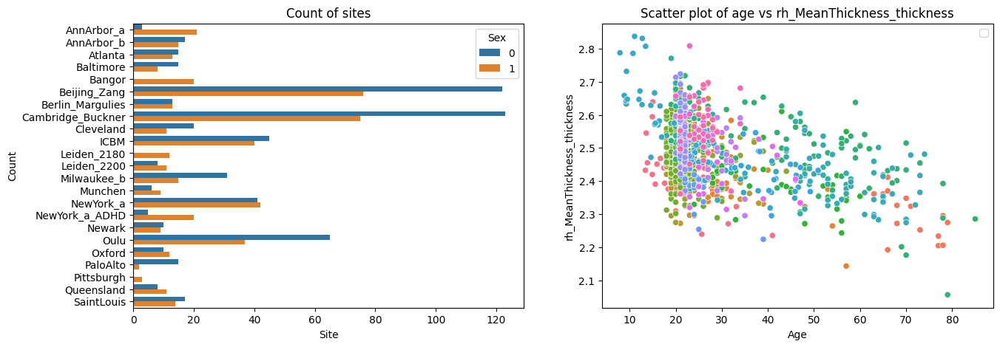

Command line interface
======================

The PCNtoolkit is a python package, but it can also be used from the
command line.

Here we show how to use the PCNtoolkit from the command line.

Furthermore, you can use this script to generate commands for the
command line interface. (Although if you are able to run this notebook,
why not just use it as a python package?)

.. code:: ipython3

    import pandas as pd
    import numpy as np
    from sklearn.model_selection import train_test_split
    import seaborn as sns
    import matplotlib.pyplot as plt
    import os
    import sys
    import pickle

BLR Example
-----------

Data preparation
~~~~~~~~~~~~~~~~

.. code:: ipython3

    # Download and split data first
    # If you are running this notebook for the first time, you need to download the dataset from github.
    # If you have already downloaded the dataset, you can comment out the following line
    pd.read_csv(
        "https://raw.githubusercontent.com/predictive-clinical-neuroscience/PCNtoolkit-demo/refs/heads/main/data/fcon1000.csv"
    ).to_csv("resources/data/fcon1000.csv", index=False)

.. code:: ipython3

    data = pd.read_csv("resources/data/fcon1000.csv")

.. code:: ipython3

    # Inspect the data
    fig, ax = plt.subplots(1, 2, figsize=(15, 5))
    sns.scatterplot(data=data, x=("age"), y=("rh_MeanThickness_thickness"), hue=("site"), ax=ax[1])
    ax[1].legend([], [])
    ax[1].set_title("Scatter plot of age vs rh_MeanThickness_thickness")
    ax[1].set_xlabel("Age")
    ax[1].set_ylabel("rh_MeanThickness_thickness")
    sns.countplot(data=data, y="site", hue="sex", ax=ax[0], orient="h")
    ax[0].legend(title="Sex")
    ax[0].set_title("Count of sites")
    ax[0].set_xlabel("Site")
    ax[0].set_ylabel("Count")
    plt.show()

.. code:: ipython3

    # Split into X, y, and batch effects
    covariate_columns = ["age"]
    batch_effect_columns = ["sex", "site"]
    response_columns = ["rh_MeanThickness_thickness", "WM-hypointensities"]
    
    X = data[covariate_columns]
    Y = data[response_columns]
    batch_effects = data[batch_effect_columns]
    
    batch_effects_strings = [str(b[0]) + " " + str(b[1]) for b in batch_effects.values]
    
    # Split into train and test set
    trainidx, testidx = train_test_split(data.index, test_size=0.2, random_state=42, stratify=batch_effects_strings)
    train_X = X.loc[trainidx]
    train_Y = Y.loc[trainidx]
    train_batch_effects = batch_effects.loc[trainidx]
    
    test_X = X.loc[testidx]
    test_Y = Y.loc[testidx]
    test_batch_effects = batch_effects.loc[testidx]

.. code:: ipython3

    # Save stuff
    root_dir = os.path.join("resources", "cli_example")
    data_dir = os.path.join(root_dir, "data")
    os.makedirs(data_dir, exist_ok=True)
    
    resp = os.path.abspath(os.path.join(data_dir, "responses.csv"))
    cov = os.path.abspath(os.path.join(data_dir, "covariates.csv"))
    be = os.path.abspath(os.path.join(data_dir, "batch_effects.csv"))
    
    t_resp = os.path.abspath(os.path.join(data_dir, "test_responses.csv"))
    t_cov = os.path.abspath(os.path.join(data_dir, "test_covariates.csv"))
    t_be = os.path.abspath(os.path.join(data_dir, "test_batch_effects.csv"))
    
    
    with open(cov, "wb") as f:
        pickle.dump(train_X, f)
    with open(resp, "wb") as f:
        pickle.dump(train_Y, f)
    with open(be, "wb") as f:
        pickle.dump(train_batch_effects, f)
    with open(t_cov, "wb") as f:
        pickle.dump(test_X, f)
    with open(t_resp, "wb") as f:
        pickle.dump(test_Y, f)
    with open(t_be, "wb") as f:
        pickle.dump(test_batch_effects, f)

BLR configuration
~~~~~~~~~~~~~~~~~

.. code:: ipython3

    alg = "blr"
    func = "fit_predict"
    
    # normative model configuration
    save_dir = os.path.join(root_dir, "blr_cli", "save_dir")
    savemodel = True
    saveresults = True
    basis_function = "linear"
    inscaler = "standardize"
    outscaler = "standardize"
    
    # Regression model configuration
    optimizer = "l-bfgs-b"
    n_iter = 200
    heteroskedastic = True
    fixed_effect = True
    warp = "WarpSinhArcsinh"
    warp_reparam = True
    
    # runner configuration
    cross_validate = True
    cv_folds = 5
    parallelize = False
    job_type = "local"
    n_jobs = 2
    temp_dir = os.path.join(root_dir, "temp")
    log_dir = os.path.join(root_dir, "log")
    python_env = os.path.join(os.path.dirname(os.path.dirname(sys.executable)))

Constructing command
~~~~~~~~~~~~~~~~~~~~

.. code:: ipython3

    command = "normative"
    args = f"-a {alg} -f {func} -c {cov} -r {resp} -t {t_resp} -e {t_cov} -k {cv_folds}"
    kwargs = f"be={be} t_be={t_be}"
    normative_model_kwargs = f"save_dir={save_dir} savemodel={savemodel} saveresults={saveresults} basis_function={basis_function} inscaler={inscaler} outscaler={outscaler}"
    runner_kwargs = f"cross_validate={cross_validate} parallelize={parallelize} job_type={job_type} n_jobs={n_jobs} temp_dir={temp_dir} log_dir={log_dir} environment={python_env}"
    blr_kwargs = f"optimizer={optimizer} n_iter={n_iter} heteroskedastic={heteroskedastic} fixed_effect={fixed_effect} warp={warp} warp_reparam={warp_reparam}"
    full_command = f"{command} {args} {kwargs} {runner_kwargs} {normative_model_kwargs} {blr_kwargs}"

.. code:: ipython3

    print(full_command)

.. parsed-literal::

    normative -a blr -f fit_predict -c /Users/stijndeboer/Projects/PCN/PCNtoolkit/examples/resources/cli_example/data/covariates.csv -r /Users/stijndeboer/Projects/PCN/PCNtoolkit/examples/resources/cli_example/data/responses.csv -t /Users/stijndeboer/Projects/PCN/PCNtoolkit/examples/resources/cli_example/data/test_responses.csv -e /Users/stijndeboer/Projects/PCN/PCNtoolkit/examples/resources/cli_example/data/test_covariates.csv -k 5 be=/Users/stijndeboer/Projects/PCN/PCNtoolkit/examples/resources/cli_example/data/batch_effects.csv t_be=/Users/stijndeboer/Projects/PCN/PCNtoolkit/examples/resources/cli_example/data/test_batch_effects.csv cross_validate=True parallelize=False job_type=local n_jobs=2 temp_dir=resources/cli_example/temp log_dir=resources/cli_example/log environment=/opt/anaconda3/envs/ptk save_dir=resources/cli_example/blr_cli/save_dir savemodel=True saveresults=True basis_function=linear inscaler=standardize outscaler=standardize optimizer=l-bfgs-b n_iter=200 heteroskedastic=True fixed_effect=True warp=WarpSinhArcsinh warp_reparam=True

Running command
~~~~~~~~~~~~~~~

.. code:: ipython3

    !{full_command}

.. parsed-literal::

    Process: 84141 - 2025-11-20 13:25:31 - Dataset "fit_data" created.
        - 862 observations
        - 862 unique subjects
        - 1 covariates
        - 2 response variables
        - 2 batch effects:
        	batch_effect_0 (2)
    	batch_effect_1 (23)
        
    Process: 84141 - 2025-11-20 13:25:31 - Dataset "predict_data" created.
        - 216 observations
        - 216 unique subjects
        - 1 covariates
        - 2 response variables
        - 2 batch effects:
        	batch_effect_0 (2)
    	batch_effect_1 (23)
        
    Process: 84141 - 2025-11-20 13:25:31 - Task ID created: fit_predict_fit_data__2025-11-20_13:25:31_161.049072
    Process: 84141 - 2025-11-20 13:25:31 - Temporary directory created:
    	/Users/stijndeboer/Projects/PCN/PCNtoolkit/examples/resources/cli_example/temp/fit_predict_fit_data__2025-11-20_13:25:31_161.049072
    Process: 84141 - 2025-11-20 13:25:31 - Log directory created:
    	/Users/stijndeboer/Projects/PCN/PCNtoolkit/examples/resources/cli_example/log/fit_predict_fit_data__2025-11-20_13:25:31_161.049072
    /opt/anaconda3/envs/ptk/lib/python3.12/site-packages/pcntoolkit/util/output.py:239: UserWarning: Process: 84141 - 2025-11-20 13:25:31 - Predict data not used in k-fold cross-validation
      warnings.warn(message)
    /opt/anaconda3/envs/ptk/lib/python3.12/site-packages/sklearn/model_selection/_split.py:811: UserWarning: The least populated class in y has only 2 members, which is less than n_splits=5.
      warnings.warn(
    Process: 84141 - 2025-11-20 13:25:31 - Fitting models on 2 response variables.
    Process: 84141 - 2025-11-20 13:25:31 - Fitting model for response_var_0.
    Process: 84141 - 2025-11-20 13:25:31 - Fitting model for response_var_1.
    /opt/anaconda3/envs/ptk/lib/python3.12/site-packages/scipy/_lib/_util.py:1226: LinAlgWarning: Ill-conditioned matrix (rcond=5.52372e-27): result may not be accurate.
      return f(*arrays, *other_args, **kwargs)
    /opt/anaconda3/envs/ptk/lib/python3.12/site-packages/pcntoolkit/util/output.py:239: UserWarning: Process: 84141 - 2025-11-20 13:25:31 - Estimation of posterior distribution failed due to: 
    Matrix is not positive definite
      warnings.warn(message)
    /opt/anaconda3/envs/ptk/lib/python3.12/site-packages/scipy/_lib/_util.py:1226: LinAlgWarning: Ill-conditioned matrix (rcond=6.3755e-27): result may not be accurate.
      return f(*arrays, *other_args, **kwargs)
    /opt/anaconda3/envs/ptk/lib/python3.12/site-packages/scipy/_lib/_util.py:1226: LinAlgWarning: Ill-conditioned matrix (rcond=4.99807e-27): result may not be accurate.
      return f(*arrays, *other_args, **kwargs)
    /opt/anaconda3/envs/ptk/lib/python3.12/site-packages/scipy/_lib/_util.py:1226: LinAlgWarning: Ill-conditioned matrix (rcond=6.74669e-27): result may not be accurate.
      return f(*arrays, *other_args, **kwargs)
    /opt/anaconda3/envs/ptk/lib/python3.12/site-packages/scipy/_lib/_util.py:1226: LinAlgWarning: Ill-conditioned matrix (rcond=6.10466e-27): result may not be accurate.
      return f(*arrays, *other_args, **kwargs)
    Process: 84141 - 2025-11-20 13:25:31 - Making predictions on 2 response variables.
    Process: 84141 - 2025-11-20 13:25:31 - Computing z-scores for 2 response variables.
    Process: 84141 - 2025-11-20 13:25:31 - Computing z-scores for response_var_0.
    Process: 84141 - 2025-11-20 13:25:31 - Computing z-scores for response_var_1.
    Process: 84141 - 2025-11-20 13:25:31 - Computing centiles for 2 response variables.
    Process: 84141 - 2025-11-20 13:25:31 - Computing centiles for response_var_0.
    Process: 84141 - 2025-11-20 13:25:31 - Computing centiles for response_var_1.
    Process: 84141 - 2025-11-20 13:25:31 - Computing log-probabilities for 2 response variables.
    Process: 84141 - 2025-11-20 13:25:31 - Computing log-probabilities for response_var_0.
    Process: 84141 - 2025-11-20 13:25:31 - Computing log-probabilities for response_var_1.
    Process: 84141 - 2025-11-20 13:25:31 - Computing yhat for 2 response variables.
    Process: 84141 - 2025-11-20 13:25:31 - Computing yhat for response_var_0.
    Process: 84141 - 2025-11-20 13:25:31 - Computing yhat for response_var_1.
    /opt/anaconda3/envs/ptk/lib/python3.12/site-packages/pcntoolkit/dataio/norm_data.py:1094: FutureWarning: The previous implementation of stack is deprecated and will be removed in a future version of pandas. See the What's New notes for pandas 2.1.0 for details. Specify future_stack=True to adopt the new implementation and silence this warning.
      subject_ids = subject_ids.stack(level="centile")
    Process: 84141 - 2025-11-20 13:25:31 - Dataset "centile" created.
        - 150 observations
        - 150 unique subjects
        - 1 covariates
        - 2 response variables
        - 2 batch effects:
        	batch_effect_0 (1)
    	batch_effect_1 (1)
        
    Process: 84141 - 2025-11-20 13:25:31 - Computing centiles for 2 response variables.
    Process: 84141 - 2025-11-20 13:25:31 - Computing centiles for response_var_0.
    Process: 84141 - 2025-11-20 13:25:31 - Computing centiles for response_var_1.
    Process: 84141 - 2025-11-20 13:25:31 - Harmonizing data on 2 response variables.
    Process: 84141 - 2025-11-20 13:25:31 - Harmonizing data for response_var_0.
    Process: 84141 - 2025-11-20 13:25:31 - Harmonizing data for response_var_1.
    Process: 84141 - 2025-11-20 13:25:31 - Saving model to:
    	resources/cli_example/blr_cli/save_dir/folds/fold_0.
    Process: 84141 - 2025-11-20 13:25:31 - Making predictions on 2 response variables.
    Process: 84141 - 2025-11-20 13:25:31 - Computing z-scores for 2 response variables.
    Process: 84141 - 2025-11-20 13:25:31 - Computing z-scores for response_var_0.
    Process: 84141 - 2025-11-20 13:25:31 - Computing z-scores for response_var_1.
    Process: 84141 - 2025-11-20 13:25:31 - Computing centiles for 2 response variables.
    Process: 84141 - 2025-11-20 13:25:31 - Computing centiles for response_var_0.
    Process: 84141 - 2025-11-20 13:25:31 - Computing centiles for response_var_1.
    Process: 84141 - 2025-11-20 13:25:31 - Computing log-probabilities for 2 response variables.
    Process: 84141 - 2025-11-20 13:25:31 - Computing log-probabilities for response_var_0.
    Process: 84141 - 2025-11-20 13:25:31 - Computing log-probabilities for response_var_1.
    Process: 84141 - 2025-11-20 13:25:31 - Computing yhat for 2 response variables.
    Process: 84141 - 2025-11-20 13:25:31 - Computing yhat for response_var_0.
    Process: 84141 - 2025-11-20 13:25:31 - Computing yhat for response_var_1.
    /opt/anaconda3/envs/ptk/lib/python3.12/site-packages/pcntoolkit/dataio/norm_data.py:1094: FutureWarning: The previous implementation of stack is deprecated and will be removed in a future version of pandas. See the What's New notes for pandas 2.1.0 for details. Specify future_stack=True to adopt the new implementation and silence this warning.
      subject_ids = subject_ids.stack(level="centile")
    Process: 84141 - 2025-11-20 13:25:32 - Dataset "centile" created.
        - 150 observations
        - 150 unique subjects
        - 1 covariates
        - 2 response variables
        - 2 batch effects:
        	batch_effect_0 (1)
    	batch_effect_1 (1)
        
    Process: 84141 - 2025-11-20 13:25:32 - Computing centiles for 2 response variables.
    Process: 84141 - 2025-11-20 13:25:32 - Computing centiles for response_var_0.
    Process: 84141 - 2025-11-20 13:25:32 - Computing centiles for response_var_1.
    Process: 84141 - 2025-11-20 13:25:32 - Harmonizing data on 2 response variables.
    Process: 84141 - 2025-11-20 13:25:32 - Harmonizing data for response_var_0.
    Process: 84141 - 2025-11-20 13:25:32 - Harmonizing data for response_var_1.
    Process: 84141 - 2025-11-20 13:25:32 - Saving model to:
    	resources/cli_example/blr_cli/save_dir/folds/fold_0.
    Process: 84141 - 2025-11-20 13:25:32 - Fitting models on 2 response variables.
    Process: 84141 - 2025-11-20 13:25:32 - Fitting model for response_var_0.
    Process: 84141 - 2025-11-20 13:25:32 - Fitting model for response_var_1.
    /opt/anaconda3/envs/ptk/lib/python3.12/site-packages/scipy/_lib/_util.py:1226: LinAlgWarning: Ill-conditioned matrix (rcond=4.24552e-20): result may not be accurate.
      return f(*arrays, *other_args, **kwargs)
    /opt/anaconda3/envs/ptk/lib/python3.12/site-packages/pcntoolkit/util/output.py:239: UserWarning: Process: 84141 - 2025-11-20 13:25:32 - Estimation of posterior distribution failed due to: 
    Matrix is not positive definite
      warnings.warn(message)
    /opt/anaconda3/envs/ptk/lib/python3.12/site-packages/scipy/_lib/_util.py:1226: LinAlgWarning: Ill-conditioned matrix (rcond=4.91007e-20): result may not be accurate.
      return f(*arrays, *other_args, **kwargs)
    /opt/anaconda3/envs/ptk/lib/python3.12/site-packages/scipy/_lib/_util.py:1226: LinAlgWarning: Ill-conditioned matrix (rcond=3.84158e-20): result may not be accurate.
      return f(*arrays, *other_args, **kwargs)
    /opt/anaconda3/envs/ptk/lib/python3.12/site-packages/scipy/_lib/_util.py:1226: LinAlgWarning: Ill-conditioned matrix (rcond=5.18529e-20): result may not be accurate.
      return f(*arrays, *other_args, **kwargs)
    /opt/anaconda3/envs/ptk/lib/python3.12/site-packages/scipy/_lib/_util.py:1226: LinAlgWarning: Ill-conditioned matrix (rcond=4.69193e-20): result may not be accurate.
      return f(*arrays, *other_args, **kwargs)
    /opt/anaconda3/envs/ptk/lib/python3.12/site-packages/scipy/optimize/_numdiff.py:687: RuntimeWarning: overflow encountered in divide
      df_dx = [delf / delx for delf, delx in zip(df, dx)]
    Process: 84141 - 2025-11-20 13:25:32 - Making predictions on 2 response variables.
    Process: 84141 - 2025-11-20 13:25:32 - Computing z-scores for 2 response variables.
    Process: 84141 - 2025-11-20 13:25:32 - Computing z-scores for response_var_0.
    Process: 84141 - 2025-11-20 13:25:32 - Computing z-scores for response_var_1.
    Process: 84141 - 2025-11-20 13:25:32 - Computing centiles for 2 response variables.
    Process: 84141 - 2025-11-20 13:25:32 - Computing centiles for response_var_0.
    Process: 84141 - 2025-11-20 13:25:32 - Computing centiles for response_var_1.
    Process: 84141 - 2025-11-20 13:25:32 - Computing log-probabilities for 2 response variables.
    Process: 84141 - 2025-11-20 13:25:32 - Computing log-probabilities for response_var_0.
    Process: 84141 - 2025-11-20 13:25:32 - Computing log-probabilities for response_var_1.
    Process: 84141 - 2025-11-20 13:25:32 - Computing yhat for 2 response variables.
    Process: 84141 - 2025-11-20 13:25:32 - Computing yhat for response_var_0.
    Process: 84141 - 2025-11-20 13:25:32 - Computing yhat for response_var_1.
    /opt/anaconda3/envs/ptk/lib/python3.12/site-packages/pcntoolkit/dataio/norm_data.py:1094: FutureWarning: The previous implementation of stack is deprecated and will be removed in a future version of pandas. See the What's New notes for pandas 2.1.0 for details. Specify future_stack=True to adopt the new implementation and silence this warning.
      subject_ids = subject_ids.stack(level="centile")
    Process: 84141 - 2025-11-20 13:25:32 - Dataset "centile" created.
        - 150 observations
        - 150 unique subjects
        - 1 covariates
        - 2 response variables
        - 2 batch effects:
        	batch_effect_0 (1)
    	batch_effect_1 (1)
        
    Process: 84141 - 2025-11-20 13:25:32 - Computing centiles for 2 response variables.
    Process: 84141 - 2025-11-20 13:25:32 - Computing centiles for response_var_0.
    Process: 84141 - 2025-11-20 13:25:32 - Computing centiles for response_var_1.
    Process: 84141 - 2025-11-20 13:25:32 - Harmonizing data on 2 response variables.
    Process: 84141 - 2025-11-20 13:25:32 - Harmonizing data for response_var_0.
    Process: 84141 - 2025-11-20 13:25:32 - Harmonizing data for response_var_1.
    Process: 84141 - 2025-11-20 13:25:33 - Saving model to:
    	resources/cli_example/blr_cli/save_dir/folds/fold_1.
    Process: 84141 - 2025-11-20 13:25:33 - Making predictions on 2 response variables.
    Process: 84141 - 2025-11-20 13:25:33 - Computing z-scores for 2 response variables.
    Process: 84141 - 2025-11-20 13:25:33 - Computing z-scores for response_var_0.
    Process: 84141 - 2025-11-20 13:25:33 - Computing z-scores for response_var_1.
    Process: 84141 - 2025-11-20 13:25:33 - Computing centiles for 2 response variables.
    Process: 84141 - 2025-11-20 13:25:33 - Computing centiles for response_var_0.
    Process: 84141 - 2025-11-20 13:25:33 - Computing centiles for response_var_1.
    Process: 84141 - 2025-11-20 13:25:33 - Computing log-probabilities for 2 response variables.
    Process: 84141 - 2025-11-20 13:25:33 - Computing log-probabilities for response_var_0.
    Process: 84141 - 2025-11-20 13:25:33 - Computing log-probabilities for response_var_1.
    Process: 84141 - 2025-11-20 13:25:33 - Computing yhat for 2 response variables.
    Process: 84141 - 2025-11-20 13:25:33 - Computing yhat for response_var_0.
    Process: 84141 - 2025-11-20 13:25:33 - Computing yhat for response_var_1.
    /opt/anaconda3/envs/ptk/lib/python3.12/site-packages/pcntoolkit/dataio/norm_data.py:1094: FutureWarning: The previous implementation of stack is deprecated and will be removed in a future version of pandas. See the What's New notes for pandas 2.1.0 for details. Specify future_stack=True to adopt the new implementation and silence this warning.
      subject_ids = subject_ids.stack(level="centile")
    Process: 84141 - 2025-11-20 13:25:33 - Dataset "centile" created.
        - 150 observations
        - 150 unique subjects
        - 1 covariates
        - 2 response variables
        - 2 batch effects:
        	batch_effect_0 (1)
    	batch_effect_1 (1)
        
    Process: 84141 - 2025-11-20 13:25:33 - Computing centiles for 2 response variables.
    Process: 84141 - 2025-11-20 13:25:33 - Computing centiles for response_var_0.
    Process: 84141 - 2025-11-20 13:25:33 - Computing centiles for response_var_1.
    Process: 84141 - 2025-11-20 13:25:33 - Harmonizing data on 2 response variables.
    Process: 84141 - 2025-11-20 13:25:33 - Harmonizing data for response_var_0.
    Process: 84141 - 2025-11-20 13:25:33 - Harmonizing data for response_var_1.
    Process: 84141 - 2025-11-20 13:25:33 - Saving model to:
    	resources/cli_example/blr_cli/save_dir/folds/fold_1.
    Process: 84141 - 2025-11-20 13:25:33 - Fitting models on 2 response variables.
    Process: 84141 - 2025-11-20 13:25:33 - Fitting model for response_var_0.
    Process: 84141 - 2025-11-20 13:25:33 - Fitting model for response_var_1.
    /opt/anaconda3/envs/ptk/lib/python3.12/site-packages/scipy/_lib/_util.py:1226: LinAlgWarning: Ill-conditioned matrix (rcond=1.59493e-18): result may not be accurate.
      return f(*arrays, *other_args, **kwargs)
    /opt/anaconda3/envs/ptk/lib/python3.12/site-packages/pcntoolkit/util/output.py:239: UserWarning: Process: 84141 - 2025-11-20 13:25:33 - Estimation of posterior distribution failed due to: 
    Matrix is not positive definite
      warnings.warn(message)
    /opt/anaconda3/envs/ptk/lib/python3.12/site-packages/scipy/_lib/_util.py:1226: LinAlgWarning: Ill-conditioned matrix (rcond=1.02392e-18): result may not be accurate.
      return f(*arrays, *other_args, **kwargs)
    /opt/anaconda3/envs/ptk/lib/python3.12/site-packages/scipy/_lib/_util.py:1226: LinAlgWarning: Ill-conditioned matrix (rcond=2.11442e-18): result may not be accurate.
      return f(*arrays, *other_args, **kwargs)
    /opt/anaconda3/envs/ptk/lib/python3.12/site-packages/scipy/_lib/_util.py:1226: LinAlgWarning: Ill-conditioned matrix (rcond=1.81723e-18): result may not be accurate.
      return f(*arrays, *other_args, **kwargs)
    Process: 84141 - 2025-11-20 13:25:33 - Making predictions on 2 response variables.
    Process: 84141 - 2025-11-20 13:25:33 - Computing z-scores for 2 response variables.
    Process: 84141 - 2025-11-20 13:25:33 - Computing z-scores for response_var_0.
    Process: 84141 - 2025-11-20 13:25:33 - Computing z-scores for response_var_1.
    Process: 84141 - 2025-11-20 13:25:33 - Computing centiles for 2 response variables.
    Process: 84141 - 2025-11-20 13:25:33 - Computing centiles for response_var_0.
    Process: 84141 - 2025-11-20 13:25:33 - Computing centiles for response_var_1.
    Process: 84141 - 2025-11-20 13:25:33 - Computing log-probabilities for 2 response variables.
    Process: 84141 - 2025-11-20 13:25:33 - Computing log-probabilities for response_var_0.
    Process: 84141 - 2025-11-20 13:25:33 - Computing log-probabilities for response_var_1.
    Process: 84141 - 2025-11-20 13:25:33 - Computing yhat for 2 response variables.
    Process: 84141 - 2025-11-20 13:25:33 - Computing yhat for response_var_0.
    Process: 84141 - 2025-11-20 13:25:33 - Computing yhat for response_var_1.
    /opt/anaconda3/envs/ptk/lib/python3.12/site-packages/pcntoolkit/dataio/norm_data.py:1094: FutureWarning: The previous implementation of stack is deprecated and will be removed in a future version of pandas. See the What's New notes for pandas 2.1.0 for details. Specify future_stack=True to adopt the new implementation and silence this warning.
      subject_ids = subject_ids.stack(level="centile")
    Process: 84141 - 2025-11-20 13:25:33 - Dataset "centile" created.
        - 150 observations
        - 150 unique subjects
        - 1 covariates
        - 2 response variables
        - 2 batch effects:
        	batch_effect_0 (1)
    	batch_effect_1 (1)
        
    Process: 84141 - 2025-11-20 13:25:33 - Computing centiles for 2 response variables.
    Process: 84141 - 2025-11-20 13:25:33 - Computing centiles for response_var_0.
    Process: 84141 - 2025-11-20 13:25:33 - Computing centiles for response_var_1.
    Process: 84141 - 2025-11-20 13:25:33 - Harmonizing data on 2 response variables.
    Process: 84141 - 2025-11-20 13:25:33 - Harmonizing data for response_var_0.
    Process: 84141 - 2025-11-20 13:25:33 - Harmonizing data for response_var_1.
    Process: 84141 - 2025-11-20 13:25:34 - Saving model to:
    	resources/cli_example/blr_cli/save_dir/folds/fold_2.
    Process: 84141 - 2025-11-20 13:25:34 - Making predictions on 2 response variables.
    Process: 84141 - 2025-11-20 13:25:34 - Computing z-scores for 2 response variables.
    Process: 84141 - 2025-11-20 13:25:34 - Computing z-scores for response_var_0.
    Process: 84141 - 2025-11-20 13:25:34 - Computing z-scores for response_var_1.
    Process: 84141 - 2025-11-20 13:25:34 - Computing centiles for 2 response variables.
    Process: 84141 - 2025-11-20 13:25:34 - Computing centiles for response_var_0.
    Process: 84141 - 2025-11-20 13:25:34 - Computing centiles for response_var_1.
    Process: 84141 - 2025-11-20 13:25:34 - Computing log-probabilities for 2 response variables.
    Process: 84141 - 2025-11-20 13:25:34 - Computing log-probabilities for response_var_0.
    Process: 84141 - 2025-11-20 13:25:34 - Computing log-probabilities for response_var_1.
    Process: 84141 - 2025-11-20 13:25:34 - Computing yhat for 2 response variables.
    Process: 84141 - 2025-11-20 13:25:34 - Computing yhat for response_var_0.
    Process: 84141 - 2025-11-20 13:25:34 - Computing yhat for response_var_1.
    /opt/anaconda3/envs/ptk/lib/python3.12/site-packages/pcntoolkit/dataio/norm_data.py:1094: FutureWarning: The previous implementation of stack is deprecated and will be removed in a future version of pandas. See the What's New notes for pandas 2.1.0 for details. Specify future_stack=True to adopt the new implementation and silence this warning.
      subject_ids = subject_ids.stack(level="centile")
    Process: 84141 - 2025-11-20 13:25:34 - Dataset "centile" created.
        - 150 observations
        - 150 unique subjects
        - 1 covariates
        - 2 response variables
        - 2 batch effects:
        	batch_effect_0 (1)
    	batch_effect_1 (1)
        
    Process: 84141 - 2025-11-20 13:25:34 - Computing centiles for 2 response variables.
    Process: 84141 - 2025-11-20 13:25:34 - Computing centiles for response_var_0.
    Process: 84141 - 2025-11-20 13:25:34 - Computing centiles for response_var_1.
    Process: 84141 - 2025-11-20 13:25:34 - Harmonizing data on 2 response variables.
    Process: 84141 - 2025-11-20 13:25:34 - Harmonizing data for response_var_0.
    Process: 84141 - 2025-11-20 13:25:34 - Harmonizing data for response_var_1.
    Process: 84141 - 2025-11-20 13:25:34 - Saving model to:
    	resources/cli_example/blr_cli/save_dir/folds/fold_2.
    Process: 84141 - 2025-11-20 13:25:34 - Fitting models on 2 response variables.
    Process: 84141 - 2025-11-20 13:25:34 - Fitting model for response_var_0.
    Process: 84141 - 2025-11-20 13:25:34 - Fitting model for response_var_1.
    /opt/anaconda3/envs/ptk/lib/python3.12/site-packages/scipy/_lib/_util.py:1226: LinAlgWarning: Ill-conditioned matrix (rcond=4.33597e-18): result may not be accurate.
      return f(*arrays, *other_args, **kwargs)
    /opt/anaconda3/envs/ptk/lib/python3.12/site-packages/pcntoolkit/util/output.py:239: UserWarning: Process: 84141 - 2025-11-20 13:25:34 - Estimation of posterior distribution failed due to: 
    Matrix is not positive definite
      warnings.warn(message)
    /opt/anaconda3/envs/ptk/lib/python3.12/site-packages/scipy/_lib/_util.py:1226: LinAlgWarning: Ill-conditioned matrix (rcond=2.84075e-18): result may not be accurate.
      return f(*arrays, *other_args, **kwargs)
    /opt/anaconda3/envs/ptk/lib/python3.12/site-packages/scipy/_lib/_util.py:1226: LinAlgWarning: Ill-conditioned matrix (rcond=9.98606e-18): result may not be accurate.
      return f(*arrays, *other_args, **kwargs)
    /opt/anaconda3/envs/ptk/lib/python3.12/site-packages/scipy/_lib/_util.py:1226: LinAlgWarning: Ill-conditioned matrix (rcond=4.32237e-18): result may not be accurate.
      return f(*arrays, *other_args, **kwargs)
    /opt/anaconda3/envs/ptk/lib/python3.12/site-packages/scipy/optimize/_numdiff.py:687: RuntimeWarning: overflow encountered in divide
      df_dx = [delf / delx for delf, delx in zip(df, dx)]
    Process: 84141 - 2025-11-20 13:25:34 - Making predictions on 2 response variables.
    Process: 84141 - 2025-11-20 13:25:34 - Computing z-scores for 2 response variables.
    Process: 84141 - 2025-11-20 13:25:34 - Computing z-scores for response_var_0.
    Process: 84141 - 2025-11-20 13:25:34 - Computing z-scores for response_var_1.
    Process: 84141 - 2025-11-20 13:25:34 - Computing centiles for 2 response variables.
    Process: 84141 - 2025-11-20 13:25:34 - Computing centiles for response_var_0.
    Process: 84141 - 2025-11-20 13:25:34 - Computing centiles for response_var_1.
    Process: 84141 - 2025-11-20 13:25:34 - Computing log-probabilities for 2 response variables.
    Process: 84141 - 2025-11-20 13:25:34 - Computing log-probabilities for response_var_0.
    Process: 84141 - 2025-11-20 13:25:34 - Computing log-probabilities for response_var_1.
    Process: 84141 - 2025-11-20 13:25:34 - Computing yhat for 2 response variables.
    Process: 84141 - 2025-11-20 13:25:34 - Computing yhat for response_var_0.
    Process: 84141 - 2025-11-20 13:25:34 - Computing yhat for response_var_1.
    /opt/anaconda3/envs/ptk/lib/python3.12/site-packages/pcntoolkit/dataio/norm_data.py:1094: FutureWarning: The previous implementation of stack is deprecated and will be removed in a future version of pandas. See the What's New notes for pandas 2.1.0 for details. Specify future_stack=True to adopt the new implementation and silence this warning.
      subject_ids = subject_ids.stack(level="centile")
    Process: 84141 - 2025-11-20 13:25:35 - Dataset "centile" created.
        - 150 observations
        - 150 unique subjects
        - 1 covariates
        - 2 response variables
        - 2 batch effects:
        	batch_effect_0 (1)
    	batch_effect_1 (1)
        
    Process: 84141 - 2025-11-20 13:25:35 - Computing centiles for 2 response variables.
    Process: 84141 - 2025-11-20 13:25:35 - Computing centiles for response_var_0.
    Process: 84141 - 2025-11-20 13:25:35 - Computing centiles for response_var_1.
    Process: 84141 - 2025-11-20 13:25:35 - Harmonizing data on 2 response variables.
    Process: 84141 - 2025-11-20 13:25:35 - Harmonizing data for response_var_0.
    Process: 84141 - 2025-11-20 13:25:35 - Harmonizing data for response_var_1.
    Process: 84141 - 2025-11-20 13:25:35 - Saving model to:
    	resources/cli_example/blr_cli/save_dir/folds/fold_3.
    Process: 84141 - 2025-11-20 13:25:35 - Making predictions on 2 response variables.
    Process: 84141 - 2025-11-20 13:25:35 - Computing z-scores for 2 response variables.
    Process: 84141 - 2025-11-20 13:25:35 - Computing z-scores for response_var_0.
    Process: 84141 - 2025-11-20 13:25:35 - Computing z-scores for response_var_1.
    Process: 84141 - 2025-11-20 13:25:35 - Computing centiles for 2 response variables.
    Process: 84141 - 2025-11-20 13:25:35 - Computing centiles for response_var_0.
    Process: 84141 - 2025-11-20 13:25:35 - Computing centiles for response_var_1.
    Process: 84141 - 2025-11-20 13:25:35 - Computing log-probabilities for 2 response variables.
    Process: 84141 - 2025-11-20 13:25:35 - Computing log-probabilities for response_var_0.
    Process: 84141 - 2025-11-20 13:25:35 - Computing log-probabilities for response_var_1.
    Process: 84141 - 2025-11-20 13:25:35 - Computing yhat for 2 response variables.
    Process: 84141 - 2025-11-20 13:25:35 - Computing yhat for response_var_0.
    Process: 84141 - 2025-11-20 13:25:35 - Computing yhat for response_var_1.
    /opt/anaconda3/envs/ptk/lib/python3.12/site-packages/pcntoolkit/dataio/norm_data.py:1094: FutureWarning: The previous implementation of stack is deprecated and will be removed in a future version of pandas. See the What's New notes for pandas 2.1.0 for details. Specify future_stack=True to adopt the new implementation and silence this warning.
      subject_ids = subject_ids.stack(level="centile")
    Process: 84141 - 2025-11-20 13:25:35 - Dataset "centile" created.
        - 150 observations
        - 150 unique subjects
        - 1 covariates
        - 2 response variables
        - 2 batch effects:
        	batch_effect_0 (1)
    	batch_effect_1 (1)
        
    Process: 84141 - 2025-11-20 13:25:35 - Computing centiles for 2 response variables.
    Process: 84141 - 2025-11-20 13:25:35 - Computing centiles for response_var_0.
    Process: 84141 - 2025-11-20 13:25:35 - Computing centiles for response_var_1.
    Process: 84141 - 2025-11-20 13:25:35 - Harmonizing data on 2 response variables.
    Process: 84141 - 2025-11-20 13:25:35 - Harmonizing data for response_var_0.
    Process: 84141 - 2025-11-20 13:25:35 - Harmonizing data for response_var_1.
    Process: 84141 - 2025-11-20 13:25:35 - Saving model to:
    	resources/cli_example/blr_cli/save_dir/folds/fold_3.
    Process: 84141 - 2025-11-20 13:25:35 - Fitting models on 2 response variables.
    Process: 84141 - 2025-11-20 13:25:35 - Fitting model for response_var_0.
    Process: 84141 - 2025-11-20 13:25:35 - Fitting model for response_var_1.
    /opt/anaconda3/envs/ptk/lib/python3.12/site-packages/scipy/_lib/_util.py:1226: LinAlgWarning: Ill-conditioned matrix (rcond=8.20486e-55): result may not be accurate.
      return f(*arrays, *other_args, **kwargs)
    /opt/anaconda3/envs/ptk/lib/python3.12/site-packages/pcntoolkit/util/output.py:239: UserWarning: Process: 84141 - 2025-11-20 13:25:36 - Estimation of posterior distribution failed due to: 
    Matrix is not positive definite
      warnings.warn(message)
    /opt/anaconda3/envs/ptk/lib/python3.12/site-packages/scipy/_lib/_util.py:1226: LinAlgWarning: Ill-conditioned matrix (rcond=5.16182e-55): result may not be accurate.
      return f(*arrays, *other_args, **kwargs)
    Process: 84141 - 2025-11-20 13:25:36 - Making predictions on 2 response variables.
    Process: 84141 - 2025-11-20 13:25:36 - Computing z-scores for 2 response variables.
    Process: 84141 - 2025-11-20 13:25:36 - Computing z-scores for response_var_0.
    Process: 84141 - 2025-11-20 13:25:36 - Computing z-scores for response_var_1.
    Process: 84141 - 2025-11-20 13:25:36 - Computing centiles for 2 response variables.
    Process: 84141 - 2025-11-20 13:25:36 - Computing centiles for response_var_0.
    Process: 84141 - 2025-11-20 13:25:36 - Computing centiles for response_var_1.
    Process: 84141 - 2025-11-20 13:25:36 - Computing log-probabilities for 2 response variables.
    Process: 84141 - 2025-11-20 13:25:36 - Computing log-probabilities for response_var_0.
    Process: 84141 - 2025-11-20 13:25:36 - Computing log-probabilities for response_var_1.
    Process: 84141 - 2025-11-20 13:25:36 - Computing yhat for 2 response variables.
    Process: 84141 - 2025-11-20 13:25:36 - Computing yhat for response_var_0.
    Process: 84141 - 2025-11-20 13:25:36 - Computing yhat for response_var_1.
    /opt/anaconda3/envs/ptk/lib/python3.12/site-packages/pcntoolkit/dataio/norm_data.py:1094: FutureWarning: The previous implementation of stack is deprecated and will be removed in a future version of pandas. See the What's New notes for pandas 2.1.0 for details. Specify future_stack=True to adopt the new implementation and silence this warning.
      subject_ids = subject_ids.stack(level="centile")
    Process: 84141 - 2025-11-20 13:25:36 - Dataset "centile" created.
        - 150 observations
        - 150 unique subjects
        - 1 covariates
        - 2 response variables
        - 2 batch effects:
        	batch_effect_0 (1)
    	batch_effect_1 (1)
        
    Process: 84141 - 2025-11-20 13:25:36 - Computing centiles for 2 response variables.
    Process: 84141 - 2025-11-20 13:25:36 - Computing centiles for response_var_0.
    Process: 84141 - 2025-11-20 13:25:36 - Computing centiles for response_var_1.
    Process: 84141 - 2025-11-20 13:25:36 - Harmonizing data on 2 response variables.
    Process: 84141 - 2025-11-20 13:25:36 - Harmonizing data for response_var_0.
    Process: 84141 - 2025-11-20 13:25:36 - Harmonizing data for response_var_1.
    Process: 84141 - 2025-11-20 13:25:36 - Saving model to:
    	resources/cli_example/blr_cli/save_dir/folds/fold_4.
    Process: 84141 - 2025-11-20 13:25:36 - Making predictions on 2 response variables.
    Process: 84141 - 2025-11-20 13:25:36 - Computing z-scores for 2 response variables.
    Process: 84141 - 2025-11-20 13:25:36 - Computing z-scores for response_var_0.
    Process: 84141 - 2025-11-20 13:25:36 - Computing z-scores for response_var_1.
    Process: 84141 - 2025-11-20 13:25:36 - Computing centiles for 2 response variables.
    Process: 84141 - 2025-11-20 13:25:36 - Computing centiles for response_var_0.
    Process: 84141 - 2025-11-20 13:25:36 - Computing centiles for response_var_1.
    Process: 84141 - 2025-11-20 13:25:36 - Computing log-probabilities for 2 response variables.
    Process: 84141 - 2025-11-20 13:25:36 - Computing log-probabilities for response_var_0.
    Process: 84141 - 2025-11-20 13:25:36 - Computing log-probabilities for response_var_1.
    Process: 84141 - 2025-11-20 13:25:36 - Computing yhat for 2 response variables.
    Process: 84141 - 2025-11-20 13:25:36 - Computing yhat for response_var_0.
    Process: 84141 - 2025-11-20 13:25:36 - Computing yhat for response_var_1.
    /opt/anaconda3/envs/ptk/lib/python3.12/site-packages/pcntoolkit/dataio/norm_data.py:1094: FutureWarning: The previous implementation of stack is deprecated and will be removed in a future version of pandas. See the What's New notes for pandas 2.1.0 for details. Specify future_stack=True to adopt the new implementation and silence this warning.
      subject_ids = subject_ids.stack(level="centile")
    Process: 84141 - 2025-11-20 13:25:36 - Dataset "centile" created.
        - 150 observations
        - 150 unique subjects
        - 1 covariates
        - 2 response variables
        - 2 batch effects:
        	batch_effect_0 (1)
    	batch_effect_1 (1)
        
    Process: 84141 - 2025-11-20 13:25:36 - Computing centiles for 2 response variables.
    Process: 84141 - 2025-11-20 13:25:36 - Computing centiles for response_var_0.
    Process: 84141 - 2025-11-20 13:25:36 - Computing centiles for response_var_1.
    Process: 84141 - 2025-11-20 13:25:36 - Harmonizing data on 2 response variables.
    Process: 84141 - 2025-11-20 13:25:36 - Harmonizing data for response_var_0.
    Process: 84141 - 2025-11-20 13:25:36 - Harmonizing data for response_var_1.
    Process: 84141 - 2025-11-20 13:25:37 - Saving model to:
    	resources/cli_example/blr_cli/save_dir/folds/fold_4.
    

You can find the results in the resources/cli_example/blr/save_dir
folder.

.. code:: ipython3

    import pandas as pd
    
    a = pd.read_csv(
        "/Users/stijndeboer/Projects/PCN/PCNtoolkit/examples/resources/cli_example/blr_cli/save_dir/folds/fold_1/results/statistics_fit_data_fold_1_predict.csv",
        index_col=0,
    )

HBR example
-----------

.. code:: ipython3

    alg = "hbr"
    func = "fit_predict"
    
    # normative model configuration
    save_dir = os.path.join(root_dir, "hbr", "save_dir")
    savemodel = True
    saveresults = True
    basis_function = "bspline"
    inscaler = "standardize"
    outscaler = "standardize"
    
    
    # Regression model configuration
    draws = 1000
    tune = 500
    chains = 4
    nuts_sampler = "nutpie"
    
    likelihood = "Normal"
    linear_mu = "True"
    random_intercept_mu = "True"
    random_slope_mu = "False"
    linear_sigma = "True"
    random_intercept_sigma = "False"
    random_slope_sigma = "False"

Constructing command
~~~~~~~~~~~~~~~~~~~~

.. code:: ipython3

    command = "normative"
    args = f"-a {alg} -f {func} -c {cov} -r {resp} -t {t_resp} -e {t_cov}"
    kwargs = f"be={be} t_be={t_be}"
    normative_model_kwargs = f"save_dir={save_dir} savemodel={savemodel} saveresults={saveresults} basis_function={basis_function} inscaler={inscaler} outscaler={outscaler}"
    hbr_kwargs = f"draws={draws} tune={tune} chains={chains} nuts_sampler={nuts_sampler} likelihood={likelihood} linear_mu={linear_mu} random_intercept_mu={random_intercept_mu} random_slope_mu={random_slope_mu} linear_sigma={linear_sigma} random_intercept_sigma={random_intercept_sigma} random_slope_sigma={random_slope_sigma}"
    full_command = f"{command} {args} {kwargs} {normative_model_kwargs} {hbr_kwargs}"
    print(full_command)

.. parsed-literal::

    normative -a hbr -f fit_predict -c /Users/stijndeboer/Projects/PCN/PCNtoolkit/examples/resources/cli_example/data/covariates.csv -r /Users/stijndeboer/Projects/PCN/PCNtoolkit/examples/resources/cli_example/data/responses.csv -t /Users/stijndeboer/Projects/PCN/PCNtoolkit/examples/resources/cli_example/data/test_responses.csv -e /Users/stijndeboer/Projects/PCN/PCNtoolkit/examples/resources/cli_example/data/test_covariates.csv be=/Users/stijndeboer/Projects/PCN/PCNtoolkit/examples/resources/cli_example/data/batch_effects.csv t_be=/Users/stijndeboer/Projects/PCN/PCNtoolkit/examples/resources/cli_example/data/test_batch_effects.csv save_dir=resources/cli_example/hbr/save_dir savemodel=True saveresults=True basis_function=bspline inscaler=standardize outscaler=standardize draws=1000 tune=500 chains=4 nuts_sampler=nutpie likelihood=Normal linear_mu=True random_intercept_mu=True random_slope_mu=False linear_sigma=True random_intercept_sigma=False random_slope_sigma=False

Running command
~~~~~~~~~~~~~~~

.. code:: ipython3

    !{full_command}

.. parsed-literal::

    Process: 84328 - 2025-11-20 13:25:45 - No log directory specified. Using default log directory: /Users/stijndeboer/.pcntoolkit/logs
    Process: 84328 - 2025-11-20 13:25:45 - No temporary directory specified. Using default temporary directory: /Users/stijndeboer/.pcntoolkit/temp
    Process: 84328 - 2025-11-20 13:25:45 - Dataset "fit_data" created.
        - 862 observations
        - 862 unique subjects
        - 1 covariates
        - 2 response variables
        - 2 batch effects:
        	batch_effect_0 (2)
    	batch_effect_1 (23)
        
    Process: 84328 - 2025-11-20 13:25:45 - Dataset "predict_data" created.
        - 216 observations
        - 216 unique subjects
        - 1 covariates
        - 2 response variables
        - 2 batch effects:
        	batch_effect_0 (2)
    	batch_effect_1 (23)
        
    Process: 84328 - 2025-11-20 13:25:45 - Task ID created: fit_predict_fit_data__2025-11-20_13:25:45_833.302002
    Process: 84328 - 2025-11-20 13:25:45 - Temporary directory created:
    	/Users/stijndeboer/.pcntoolkit/temp/fit_predict_fit_data__2025-11-20_13:25:45_833.302002
    Process: 84328 - 2025-11-20 13:25:45 - Log directory created:
    	/Users/stijndeboer/.pcntoolkit/logs/fit_predict_fit_data__2025-11-20_13:25:45_833.302002
    Process: 84328 - 2025-11-20 13:25:45 - Fitting models on 2 response variables.
    Process: 84328 - 2025-11-20 13:25:45 - Fitting model for response_var_0.
    ██████████████████████████████████████████████████████████████████████ 6000/6000Process: 84328 - 2025-11-20 13:25:55 - Fitting model for response_var_1.
    ██████████████████████████████████████████████████████████████████████ 6000/6000Process: 84328 - 2025-11-20 13:26:01 - Making predictions on 2 response variables.
    Process: 84328 - 2025-11-20 13:26:01 - Computing z-scores for 2 response variables.
    Process: 84328 - 2025-11-20 13:26:01 - Computing z-scores for response_var_0.
    Sampling: []
    Process: 84328 - 2025-11-20 13:26:01 - Computing z-scores for response_var_1.
    Sampling: []
    Process: 84328 - 2025-11-20 13:26:02 - Computing centiles for 2 response variables.
    Process: 84328 - 2025-11-20 13:26:02 - Computing centiles for response_var_0.
    Sampling: []
    Sampling: []
    Sampling: []
    Sampling: []
    Sampling: []
    Process: 84328 - 2025-11-20 13:26:03 - Computing centiles for response_var_1.
    Sampling: []
    Sampling: []
    Sampling: []
    Sampling: []
    Sampling: []
    Process: 84328 - 2025-11-20 13:26:04 - Computing log-probabilities for 2 response variables.
    Process: 84328 - 2025-11-20 13:26:04 - Computing log-probabilities for response_var_0.
    Process: 84328 - 2025-11-20 13:26:05 - Computing log-probabilities for response_var_1.
    Process: 84328 - 2025-11-20 13:26:05 - Computing yhat for 2 response variables.
    Sampling: []
    Sampling: []
    /opt/anaconda3/envs/ptk/lib/python3.12/site-packages/pcntoolkit/dataio/norm_data.py:1094: FutureWarning: The previous implementation of stack is deprecated and will be removed in a future version of pandas. See the What's New notes for pandas 2.1.0 for details. Specify future_stack=True to adopt the new implementation and silence this warning.
      subject_ids = subject_ids.stack(level="centile")
    Process: 84328 - 2025-11-20 13:26:06 - Dataset "centile" created.
        - 150 observations
        - 150 unique subjects
        - 1 covariates
        - 2 response variables
        - 2 batch effects:
        	batch_effect_0 (1)
    	batch_effect_1 (1)
        
    Process: 84328 - 2025-11-20 13:26:06 - Computing centiles for 2 response variables.
    Process: 84328 - 2025-11-20 13:26:06 - Computing centiles for response_var_0.
    Sampling: []
    Sampling: []
    Sampling: []
    Sampling: []
    Sampling: []
    Process: 84328 - 2025-11-20 13:26:06 - Computing centiles for response_var_1.
    Sampling: []
    Sampling: []
    Sampling: []
    Sampling: []
    Sampling: []
    Process: 84328 - 2025-11-20 13:26:07 - Harmonizing data on 2 response variables.
    Process: 84328 - 2025-11-20 13:26:07 - Harmonizing data for response_var_0.
    Sampling: []
    Sampling: []
    Process: 84328 - 2025-11-20 13:26:08 - Harmonizing data for response_var_1.
    Sampling: []
    Sampling: []
    Process: 84328 - 2025-11-20 13:26:08 - Saving model to:
    	resources/cli_example/hbr/save_dir.
    Process: 84328 - 2025-11-20 13:26:09 - Making predictions on 2 response variables.
    Process: 84328 - 2025-11-20 13:26:09 - Computing z-scores for 2 response variables.
    Process: 84328 - 2025-11-20 13:26:09 - Computing z-scores for response_var_0.
    Sampling: []
    Process: 84328 - 2025-11-20 13:26:09 - Computing z-scores for response_var_1.
    Sampling: []
    Process: 84328 - 2025-11-20 13:26:09 - Computing centiles for 2 response variables.
    Process: 84328 - 2025-11-20 13:26:09 - Computing centiles for response_var_0.
    Sampling: []
    Sampling: []
    Sampling: []
    Sampling: []
    Sampling: []
    Process: 84328 - 2025-11-20 13:26:10 - Computing centiles for response_var_1.
    Sampling: []
    Sampling: []
    Sampling: []
    Sampling: []
    Sampling: []
    Process: 84328 - 2025-11-20 13:26:11 - Computing log-probabilities for 2 response variables.
    Process: 84328 - 2025-11-20 13:26:11 - Computing log-probabilities for response_var_0.
    Process: 84328 - 2025-11-20 13:26:12 - Computing log-probabilities for response_var_1.
    Process: 84328 - 2025-11-20 13:26:12 - Computing yhat for 2 response variables.
    Sampling: []
    Sampling: []
    /opt/anaconda3/envs/ptk/lib/python3.12/site-packages/pcntoolkit/dataio/norm_data.py:1094: FutureWarning: The previous implementation of stack is deprecated and will be removed in a future version of pandas. See the What's New notes for pandas 2.1.0 for details. Specify future_stack=True to adopt the new implementation and silence this warning.
      subject_ids = subject_ids.stack(level="centile")
    Process: 84328 - 2025-11-20 13:26:12 - Dataset "centile" created.
        - 150 observations
        - 150 unique subjects
        - 1 covariates
        - 2 response variables
        - 2 batch effects:
        	batch_effect_0 (1)
    	batch_effect_1 (1)
        
    Process: 84328 - 2025-11-20 13:26:12 - Computing centiles for 2 response variables.
    Process: 84328 - 2025-11-20 13:26:12 - Computing centiles for response_var_0.
    Sampling: []
    Sampling: []
    Sampling: []
    Sampling: []
    Sampling: []
    Process: 84328 - 2025-11-20 13:26:13 - Computing centiles for response_var_1.
    Sampling: []
    Sampling: []
    Sampling: []
    Sampling: []
    Sampling: []
    Process: 84328 - 2025-11-20 13:26:14 - Harmonizing data on 2 response variables.
    Process: 84328 - 2025-11-20 13:26:14 - Harmonizing data for response_var_0.
    Sampling: []
    Sampling: []
    Process: 84328 - 2025-11-20 13:26:15 - Harmonizing data for response_var_1.
    Sampling: []
    Sampling: []
    Process: 84328 - 2025-11-20 13:26:16 - Saving model to:
    	resources/cli_example/hbr/save_dir.
    

