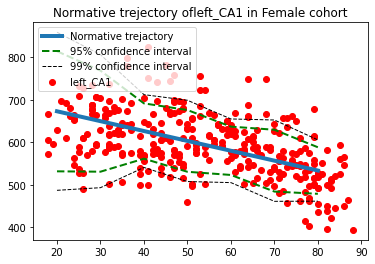
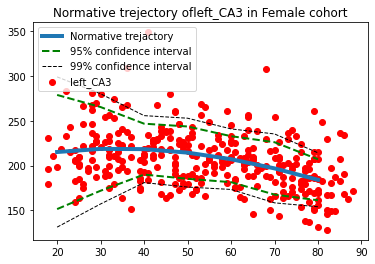
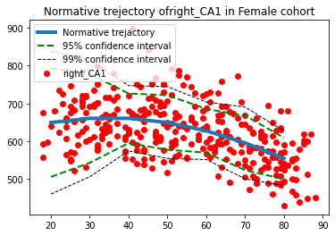
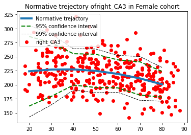
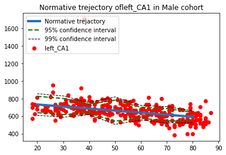
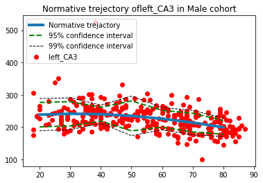
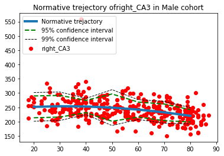
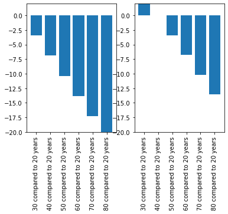

.. title:: GPR tutorial

Gaussian Process Regression 
==============================

Created by

Mariam Zabihi `@m_zabihi <https://twitter.com/m_zabihi>`__

Saige Rutherford `@being_saige <https://twitter.com/being_saige>`__

Thomas Wolfers `@ThomasWolfers <https://twitter.com/ThomasWolfers>`__
\______________________________________________________________________________\_

.. image:: https://colab.research.google.com/assets/colab-badge.svg 
    :target: https://colab.research.google.com/github/predictive-clinical-neuroscience/PCNtoolkit-demo/blob/main/tutorials/CPC_2020/normative_modelling_walkthrough.ipynb

Background Story
--------------------

Morten and Ingrid are concerned about the health of their father,
Nordan. He recently turned 65 years. A few months ago he could not find
his way home. Together, they visit a neurologist/psychiatrist to conduct
a number of cognitive tests. However, those tests were inconclusive.
While Nordan has a relatively low IQ it could not explain his trouble
returning home.

Recently, the family heard about a new screening technique called
normative modeling with which one can place individuals in reference to
a population norm on for instance measures such as brain volume. Nordan
would like to undertake this procedure to better know what is going on
and to potentially find targets for treatment. Therefore, the family
booked an appointment with you, the normative modeling specialist. To
find out what is going on you compare Nordan’s hyppocampus to the norm
and to a group of persons with Dementia disorders, who have a similar
IQ, age as well as the same sex as Nordan.

Do your best to get as far as you can. However, you do not need to feel
bad if you cannot complete everything during the tutorial.

**Task 0:** Load data and install the pcntoolkit
------------------------------------------------

.. code:: ipython3

    #install normative modeling
    ! pip uninstall -y Theano-PyMC  # conflicts with Theano on some environments
    ! pip install pcntoolkit==0.20

**Option 1:** Connect your Google Drive account, and load data from
Google Drive. Having Google Drive connected will allow you to save any
files created back to your Drive folder. This step will require you to
download the csv files from
`Github <https://github.com/predictive-clinical-neuroscience/PCNtoolkit-demo/tree/main/data>`__
to your computer, and then make a folder in your Google Drive account
and upload the csv files to this folder.

.. code:: ipython3

    from google.colab import drive
    drive.mount('/content/drive')
    
    #change dir to data on your google drive
    import os
    os.chdir('drive/My Drive/name-of-folder-where-you-uploaded-csv-files-from-Github/') #Change this path to match the path to your data in Google Drive
    
    # code by T. Wolfers

**Option 2:** Import the files directly from Github, and skip adding
them to Google Drive.

.. code:: ipython3

    !wget -nc https://raw.githubusercontent.com/predictive-clinical-neuroscience/PCNtoolkit-demo/master/tutorials/CPC_2020/data/camcan_demographics.csv
    !wget -nc https://raw.githubusercontent.com/predictive-clinical-neuroscience/PCNtoolkit-demo/master/tutorials/CPC_2020/data/camcan_demographics_nordan.csv
    !wget -nc https://raw.githubusercontent.com/predictive-clinical-neuroscience/PCNtoolkit-demo/master/tutorials/CPC_2020/data/camcan_features.csv
    !wget -nc https://raw.githubusercontent.com/predictive-clinical-neuroscience/PCNtoolkit-demo/master/tutorials/CPC_2020/data/camcan_features_nordan.csv
        
    # code by S. Rutherford

.. parsed-literal::

    --2022-02-17 15:03:58--  https://raw.githubusercontent.com/predictive-clinical-neuroscience/PCNtoolkit-demo/master/tutorials/CPC_2020/data/camcan_demographics.csv
    Resolving raw.githubusercontent.com (raw.githubusercontent.com)... 185.199.110.133, 185.199.108.133, 185.199.111.133, ...
    Connecting to raw.githubusercontent.com (raw.githubusercontent.com)|185.199.110.133|:443... connected.
    HTTP request sent, awaiting response... 200 OK
    Length: 17484 (17K) [text/plain]
    Saving to: ‘camcan_demographics.csv’
    
    camcan_demographics 100%[===================>]  17.07K  --.-KB/s    in 0.001s  
    
    2022-02-17 15:03:58 (12.9 MB/s) - ‘camcan_demographics.csv’ saved [17484/17484]
    
    --2022-02-17 15:03:58--  https://raw.githubusercontent.com/predictive-clinical-neuroscience/PCNtoolkit-demo/master/tutorials/CPC_2020/data/camcan_demographics_nordan.csv
    Resolving raw.githubusercontent.com (raw.githubusercontent.com)... 185.199.108.133, 185.199.109.133, 185.199.110.133, ...
    Connecting to raw.githubusercontent.com (raw.githubusercontent.com)|185.199.108.133|:443... connected.
    HTTP request sent, awaiting response... 200 OK
    Length: 332 [text/plain]
    Saving to: ‘camcan_demographics_nordan.csv’
    
    camcan_demographics 100%[===================>]     332  --.-KB/s    in 0s      
    
    2022-02-17 15:03:58 (15.5 MB/s) - ‘camcan_demographics_nordan.csv’ saved [332/332]
    
    --2022-02-17 15:03:58--  https://raw.githubusercontent.com/predictive-clinical-neuroscience/PCNtoolkit-demo/master/tutorials/CPC_2020/data/camcan_features.csv
    Resolving raw.githubusercontent.com (raw.githubusercontent.com)... 185.199.108.133, 185.199.109.133, 185.199.110.133, ...
    Connecting to raw.githubusercontent.com (raw.githubusercontent.com)|185.199.108.133|:443... connected.
    HTTP request sent, awaiting response... 200 OK
    Length: 188944 (185K) [text/plain]
    Saving to: ‘camcan_features.csv’
    
    camcan_features.csv 100%[===================>] 184.52K  --.-KB/s    in 0.05s   
    
    2022-02-17 15:03:58 (3.88 MB/s) - ‘camcan_features.csv’ saved [188944/188944]
    
    --2022-02-17 15:03:58--  https://raw.githubusercontent.com/predictive-clinical-neuroscience/PCNtoolkit-demo/master/tutorials/CPC_2020/data/camcan_features_nordan.csv
    Resolving raw.githubusercontent.com (raw.githubusercontent.com)... 185.199.108.133, 185.199.109.133, 185.199.110.133, ...
    Connecting to raw.githubusercontent.com (raw.githubusercontent.com)|185.199.108.133|:443... connected.
    HTTP request sent, awaiting response... 200 OK
    Length: 1695 (1.7K) [text/plain]
    Saving to: ‘camcan_features_nordan.csv’
    
    camcan_features_nor 100%[===================>]   1.66K  --.-KB/s    in 0s      
    
    2022-02-17 15:03:59 (25.3 MB/s) - ‘camcan_features_nordan.csv’ saved [1695/1695]
    

**TASK 1:** Format input data
-----------------------------

You have four files. The features and demographics file for the
normsample and two files of the same name for Nordan your test sample.
As one of your coworkers has done the preporcessing and quality control
there are more subjects in the demographics file than in the features
file of the norm sample. Please select the overlap of participants
between those two files.

*Question for your understanding:*

1) Why do we have to select the overlap between participants in terms of
   featrues and demographics?

.. code:: ipython3

    import pandas as pd
    
    # read in the files.
    norm_demographics = pd.read_csv('camcan_demographics.csv',
                                    sep= ",",
                                    index_col = 0)
    norm_features = pd.read_csv('camcan_features.csv',
                                sep=",",
                                index_col = 0)
    
    # check columns through print [there are other better options]
    print(norm_demographics)
    print(norm_features)
    
    # find overlap in terms of participants between norm_sample_features and 
    # norm_sample_demographics
    
    norm_demographics_features = pd.concat([norm_demographics, norm_features],
                                           axis = 1,
                                           join = 'inner') # inner checks overlap
                                                           # outer combines
    print(norm_demographics_features)
    
    # code by T. Wolfers

.. parsed-literal::

                 age sex_name  sex  IQ_random
    paricipants                              
    CC110033      24     MALE    1         73
    CC110037      18     MALE    1        103
    CC110045      24   FEMALE    0        124
    CC110056      22   FEMALE    0        124
    CC110062      20     MALE    1        126
    ...          ...      ...  ...        ...
    CC722542      79     MALE    1        116
    CC722651      79   FEMALE    0        128
    CC722891      84   FEMALE    0        129
    CC723197      80   FEMALE    0         96
    CC723395      86   FEMALE    0        145
    
    [707 rows x 4 columns]
                  left_Hippocampal_tail  ...  right_Whole_hippocampus
    participants                         ...                         
    CC110033                 482.768229  ...              3531.764896
    CC110037                 595.269259  ...              3835.426137
    CC110045                 655.847194  ...              3681.494304
    CC110056                 561.345626  ...              3461.373764
    CC110062                 756.521166  ...              4782.407821
    ...                             ...  ...                      ...
    CC722542                 467.896808  ...              3284.108783
    CC722651                 406.326167  ...              3210.272905
    CC722891                 393.430481  ...              2423.675065
    CC723197                 475.929914  ...              3043.146264
    CC723395                 444.301617  ...              2988.001288
    
    [651 rows x 26 columns]
              age sex_name  sex  ...  right_fimbria  right_HATA  right_Whole_hippocampus
    CC110033   24     MALE    1  ...      87.127463   73.589184              3531.764896
    CC110037   18     MALE    1  ...      99.657823   60.920924              3835.426137
    CC110045   24   FEMALE    0  ...      69.436808   59.323542              3681.494304
    CC110056   22   FEMALE    0  ...      60.505521   51.726283              3461.373764
    CC110062   20     MALE    1  ...      92.215816   85.484454              4782.407821
    ...       ...      ...  ...  ...            ...         ...                      ...
    CC722542   79     MALE    1  ...      46.144212   43.966509              3284.108783
    CC722651   79   FEMALE    0  ...      68.730322   59.699644              3210.272905
    CC722891   84   FEMALE    0  ...      27.913196   38.629828              2423.675065
    CC723197   80   FEMALE    0  ...      51.893458   65.474967              3043.146264
    CC723395   86   FEMALE    0  ...      68.335159   62.081225              2988.001288
    
    [650 rows x 30 columns]

**TASK 2:** Prepare the covariate_normsample and testresponse_normsample file.
------------------------------------------------------------------------------

As mentioned in the introductory presentation those files need a
specific format and the entries need to be seperated by spaces. Use
whatever method you know to prepare those files based on the data
provided in TASK 1. Save those files in .txt format in your drive. Also
get rid of the column names and participant IDs.

Given that we only have limited time in this practical we have to make a
selection for the features based on your prior knowledge. With the
information in mind that Nordan does not remember his way home, which
subfield of the hyppocampus is probably a good target for the
investigations? Select a maximum of four hyppocampal regions as
features.

NOTE: Normative modeling is a screening tool we just make this selection
due to time constraints, in reality we build these models on millions of
putative biomarkers that are not restricted to brain imaging.

*Qestions for your understanding:*

2) What is the requirement for the features in terms of variable
   properties (e.g. dicotomous or continous)? 3) What is the requirement
   for the covariates in terms of these properties? 4) What are the
   requirements for both together? 5) How does this depent on the
   algorithm used?

.. code:: ipython3

    # perpare covariate_normsample for sex and age
    covariate_normsample = norm_demographics_features[['sex',
                                                       'age']] 
    
    covariate_normsample.to_csv('covariate_normsample.txt',
                                sep = ' ',
                                header = False, 
                                index = False)
    
    # perpare features_normsample for relevant hyppocampal subfields
    features_normsample = norm_demographics_features[['left_CA1', 
                                                     'left_CA3',
                                                     'right_CA1',
                                                     'right_CA3']]
    
    features_normsample.to_csv('features_normsample.txt', 
                               sep = ' ', 
                               header = False, 
                               index = False)
    
    # code by T. Wolfers

**TASK 3:** Estimate normative model
------------------------------------

Once you have prepared and saved all the necessary files. Look at the
pcntoolkit for running normative modeling. Select an appropritate method
set up the toolkit and run your analyses using 2-fold cross validation
in the normsample. Change the output suffix from estimate to ’_2fold’.

HINT: You primarily need the estimate function.

SUGGESTION: While this process is running you can go to the next TASK 4,
you will have no doubt when it is correctly running.

*Question for your understaning:*

6) What does cvfolds mean and why do we use it? 7) What is the output of
   the estimate function and what does it mean?

.. code:: ipython3

    import pcntoolkit as pcn
    
    # run normative modeling using 2-fold cross-validation
    
    pcn.normative.estimate(covfile = 'covariate_normsample.txt', 
                           respfile = 'features_normsample.txt',
                           cvfolds = 2,
                           alg = 'gpr',
                           outputsuffix = '_2fold')
    
    # code by T. Wolfers

.. parsed-literal::

    Processing data in features_normsample.txt
    Estimating model  1 of 4
    Warning: Estimation of posterior distribution failed
    Warning: Estimation of posterior distribution failed
    Warning: Estimation of posterior distribution failed
    Warning: Estimation of posterior distribution failed
    Optimization terminated successfully.
             Current function value: 1856.502251
             Iterations: 40
             Function evaluations: 99
             Gradient evaluations: 99
    Estimating model  2 of 4
    Warning: Estimation of posterior distribution failed
    Warning: Estimation of posterior distribution failed
    Optimization terminated successfully.
             Current function value: 1596.239263
             Iterations: 42
             Function evaluations: 93
             Gradient evaluations: 93
    Estimating model  3 of 4
    Warning: Estimation of posterior distribution failed
    Warning: Estimation of posterior distribution failed
    Warning: Estimation of posterior distribution failed
    Warning: Estimation of posterior distribution failed
    Warning: Estimation of posterior distribution failed
    Warning: Estimation of posterior distribution failed
    Optimization terminated successfully.
             Current function value: 1862.316698
             Iterations: 47
             Function evaluations: 104
             Gradient evaluations: 104
    Estimating model  4 of 4
    Warning: Estimation of posterior distribution failed
    Warning: Estimation of posterior distribution failed
    Optimization terminated successfully.
             Current function value: 1587.950935
             Iterations: 30
             Function evaluations: 64
             Gradient evaluations: 64
    Estimating model  1 of 4
    Warning: Estimation of posterior distribution failed
    Warning: Estimation of posterior distribution failed
    Warning: Estimation of posterior distribution failed
    Optimization terminated successfully.
             Current function value: 1916.461484
             Iterations: 44
             Function evaluations: 94
             Gradient evaluations: 87
    Estimating model  2 of 4
    Warning: Estimation of posterior distribution failed
    Warning: Estimation of posterior distribution failed
    Warning: Estimation of posterior distribution failed
    Warning: Estimation of posterior distribution failed
    Warning: Estimation of posterior distribution failed
    Warning: Estimation of posterior distribution failed
    Warning: Estimation of posterior distribution failed
    Warning: Estimation of posterior distribution failed
    Optimization terminated successfully.
             Current function value: 1611.661888
             Iterations: 34
             Function evaluations: 85
             Gradient evaluations: 85
    Estimating model  3 of 4
    Warning: Estimation of posterior distribution failed
    Warning: Estimation of posterior distribution failed
    Warning: Estimation of posterior distribution failed
    Optimization terminated successfully.
             Current function value: 1912.665851
             Iterations: 61
             Function evaluations: 133
             Gradient evaluations: 126
    Estimating model  4 of 4
    Warning: Estimation of posterior distribution failed
    Warning: Estimation of posterior distribution failed
    Warning: Estimation of posterior distribution failed
    Warning: Estimation of posterior distribution failed
    Warning: Estimation of posterior distribution failed
    Warning: Estimation of posterior distribution failed
    Warning: Estimation of posterior distribution failed
    Warning: Estimation of posterior distribution failed
    Warning: Estimation of posterior distribution failed
    Warning: Estimation of posterior distribution failed
    Warning: Estimation of posterior distribution failed
    Optimization terminated successfully.
             Current function value: 1619.045647
             Iterations: 43
             Function evaluations: 110
             Gradient evaluations: 105
    Evaluating the model ...
    Writing outputs ...

**TASK 4:** Estimate the forward model of the normative model
-------------------------------------------------------------

In order to visulize the normative trajectories you first need to run
the forward model. To this end you need to set up an appropriate
covariate_forwardmodel file that covers the age range appropriately for
both sexes. Save this file as .txt . Then you can input the files you
made in TASK 1 as well as the file you made now and run the forward
model using the appropriate specifications.

*Question for your understaning:*

8) What is yhat and ys2? 9) Why does the output of the forward model
   does not inlcude the Z-scores?

.. code:: ipython3

    # create covariate_forwardmodel.txt file
    covariate_forwardmodel = {'sex': [0, 0, 0, 0, 0, 0, 0,
                                      1, 1, 1, 1, 1, 1, 1],
                              'age': [20, 30, 40, 50, 60, 70, 80,
                                      20, 30, 40, 50, 60, 70, 80]}
    covariate_forwardmodel = pd.DataFrame(data=covariate_forwardmodel)
    
    covariate_forwardmodel.to_csv('covariate_forwardmodel.txt', 
                               sep = ' ', 
                               header = False, 
                               index = False)
    
    # estimate forward model
    pcn.normative.estimate(covfile = 'covariate_normsample.txt', 
                           respfile = 'features_normsample.txt',
                           testcov = 'covariate_forwardmodel.txt',
                           cvfolds = None,
                           alg = 'gpr',
                           outputsuffix = '_forward')
    
    # code by T. Wolfers

.. parsed-literal::

    Processing data in features_normsample.txt
    Estimating model  1 of 4
    Warning: Estimation of posterior distribution failed
    Warning: Estimation of posterior distribution failed
    Warning: Estimation of posterior distribution failed
    Warning: Estimation of posterior distribution failed
    Warning: Estimation of posterior distribution failed
    Optimization terminated successfully.
             Current function value: 3781.497401
             Iterations: 20
             Function evaluations: 61
             Gradient evaluations: 54
    Estimating model  2 of 4
    Warning: Estimation of posterior distribution failed
    Warning: Estimation of posterior distribution failed
    Warning: Estimation of posterior distribution failed
    Warning: Estimation of posterior distribution failed
    Warning: Estimation of posterior distribution failed
    Warning: Estimation of posterior distribution failed
    Warning: Estimation of posterior distribution failed
    Warning: Estimation of posterior distribution failed
    Warning: Estimation of posterior distribution failed
    Warning: Estimation of posterior distribution failed
    Optimization terminated successfully.
             Current function value: 3201.761309
             Iterations: 39
             Function evaluations: 108
             Gradient evaluations: 108
    Estimating model  3 of 4
    Warning: Estimation of posterior distribution failed
    Warning: Estimation of posterior distribution failed
    Warning: Estimation of posterior distribution failed
    Warning: Estimation of posterior distribution failed
    Warning: Estimation of posterior distribution failed
    Warning: Estimation of posterior distribution failed
    Warning: Estimation of posterior distribution failed
    Warning: Estimation of posterior distribution failed
    Optimization terminated successfully.
             Current function value: 3771.310488
             Iterations: 47
             Function evaluations: 181
             Gradient evaluations: 167
    Estimating model  4 of 4
    Warning: Estimation of posterior distribution failed
    Warning: Estimation of posterior distribution failed
    Warning: Estimation of posterior distribution failed
    Warning: Estimation of posterior distribution failed
    Warning: Estimation of posterior distribution failed
    Warning: Estimation of posterior distribution failed
    Warning: Estimation of posterior distribution failed
    Warning: Estimation of posterior distribution failed
    Warning: Estimation of posterior distribution failed
    Warning: Estimation of posterior distribution failed
    Optimization terminated successfully.
             Current function value: 3200.837262
             Iterations: 40
             Function evaluations: 104
             Gradient evaluations: 104
    Writing outputs ...

**TASK 5:** Visualize forward model
-----------------------------------

Visualize the forward model of the normative model similar to the figure
below.

.. figure:: data:image/jpeg;base64,/9j/4AAQSkZJRgABAQAAcQBxAAD/4QDoRXhpZgAATU0AKgAAAAgABwESAAMAAAABAAEAAAEaAAUAAAABAAAAYgEbAAUAAAABAAAAagEoAAMAAAABAAIAAAExAAIAAAAcAAAAcgEyAAIAAAAUAAAAjodpAAQAAAABAAAAogAAAAAAAABxAAAAAQAAAHEAAAABQWRvYmUgUGhvdG9zaG9wIENTNSBXaW5kb3dzADIwMTk6MDE6MTAgMjE6MDA6MDYAAAOQBAACAAAAFAAAAMygAgAEAAAAAQAAAMmgAwAEAAAAAQAAAHIAAAAAMjAxODoxMjoxMSAxNDozNToxNwD/4RGtaHR0cDovL25zLmFkb2JlLmNvbS94YXAvMS4wLwA8P3hwYWNrZXQgYmVnaW49Iu+7vyIgaWQ9Ilc1TTBNcENlaGlIenJlU3pOVGN6a2M5ZCI/PiA8eDp4bXBtZXRhIHhtbG5zOng9ImFkb2JlOm5zOm1ldGEvIiB4OnhtcHRrPSJYTVAgQ29yZSA1LjQuMCI+IDxyZGY6UkRGIHhtbG5zOnJkZj0iaHR0cDovL3d3dy53My5vcmcvMTk5OS8wMi8yMi1yZGYtc3ludGF4LW5zIyI+IDxyZGY6RGVzY3JpcHRpb24gcmRmOmFib3V0PSIiIHhtbG5zOnhtcE1NPSJodHRwOi8vbnMuYWRvYmUuY29tL3hhcC8xLjAvbW0vIiB4bWxuczpzdFJlZj0iaHR0cDovL25zLmFkb2JlLmNvbS94YXAvMS4wL3NUeXBlL1Jlc291cmNlUmVmIyIgeG1sbnM6c3RFdnQ9Imh0dHA6Ly9ucy5hZG9iZS5jb20veGFwLzEuMC9zVHlwZS9SZXNvdXJjZUV2ZW50IyIgeG1sbnM6eG1wPSJodHRwOi8vbnMuYWRvYmUuY29tL3hhcC8xLjAvIiB4bWxuczpwaG90b3Nob3A9Imh0dHA6Ly9ucy5hZG9iZS5jb20vcGhvdG9zaG9wLzEuMC8iIHhtbG5zOmRjPSJodHRwOi8vcHVybC5vcmcvZGMvZWxlbWVudHMvMS4xLyIgeG1wTU06SW5zdGFuY2VJRD0ieG1wLmlpZDpFNTg4MUU5QkVDMTRFOTExOEI3RkU1RDU4RURGM0Q0RSIgeG1wTU06RG9jdW1lbnRJRD0ieG1wLmRpZDoyRUM1RUY5ODQ5RkRFODExQTNBM0EyODcyMEY2OTA2NCIgeG1wTU06T3JpZ2luYWxEb2N1bWVudElEPSJ4bXAuZGlkOjJFQzVFRjk4NDlGREU4MTFBM0EzQTI4NzIwRjY5MDY0IiB4bXA6TW9kaWZ5RGF0ZT0iMjAxOS0wMS0xMFQyMTowMDowNiswNTozMCIgeG1wOkNyZWF0b3JUb29sPSJBZG9iZSBQaG90b3Nob3AgQ1M1IFdpbmRvd3MiIHhtcDpNZXRhZGF0YURhdGU9IjIwMTktMDEtMTBUMjE6MDA6MDYrMDU6MzAiIHhtcDpDcmVhdGVEYXRlPSIyMDE4LTEyLTExVDE0OjM1OjE3KzAxOjAwIiBwaG90b3Nob3A6SUNDUHJvZmlsZT0iRUNJLVJHQi5pY2MiIHBob3Rvc2hvcDpDb2xvck1vZGU9IjMiIGRjOmZvcm1hdD0iaW1hZ2UvanBlZyI+IDx4bXBNTTpEZXJpdmVkRnJvbSBzdFJlZjpvcmlnaW5hbERvY3VtZW50SUQ9InhtcC5kaWQ6MkVDNUVGOTg0OUZERTgxMUEzQTNBMjg3MjBGNjkwNjQiIHN0UmVmOmluc3RhbmNlSUQ9InhtcC5paWQ6RTQ4ODFFOUJFQzE0RTkxMThCN0ZFNUQ1OEVERjNENEUiIHN0UmVmOmRvY3VtZW50SUQ9InhtcC5kaWQ6MkVDNUVGOTg0OUZERTgxMUEzQTNBMjg3MjBGNjkwNjQiLz4gPHhtcE1NOkhpc3Rvcnk+IDxyZGY6U2VxPiA8cmRmOmxpIHN0RXZ0OnNvZnR3YXJlQWdlbnQ9IkFkb2JlIFBob3Rvc2hvcCBDUzYgKFdpbmRvd3MpIiBzdEV2dDp3aGVuPSIyMDE4LTEyLTExVDE0OjM1OjE3KzAxOjAwIiBzdEV2dDppbnN0YW5jZUlEPSJ4bXAuaWlkOjJFQzVFRjk4NDlGREU4MTFBM0EzQTI4NzIwRjY5MDY0IiBzdEV2dDphY3Rpb249ImNyZWF0ZWQiLz4gPHJkZjpsaSBzdEV2dDpzb2Z0d2FyZUFnZW50PSJBZG9iZSBQaG90b3Nob3AgQ1M1IFdpbmRvd3MiIHN0RXZ0OmNoYW5nZWQ9Ii8iIHN0RXZ0OndoZW49IjIwMTktMDEtMTBUMjA6NTE6MDErMDU6MzAiIHN0RXZ0Omluc3RhbmNlSUQ9InhtcC5paWQ6N0QzQ0MyOERFQTE0RTkxMTlFRTJGRkMzQkZENTkzMUUiIHN0RXZ0OmFjdGlvbj0ic2F2ZWQiLz4gPHJkZjpsaSBzdEV2dDpzb2Z0d2FyZUFnZW50PSJBZG9iZSBQaG90b3Nob3AgQ1M1IFdpbmRvd3MiIHN0RXZ0OmNoYW5nZWQ9Ii8iIHN0RXZ0OndoZW49IjIwMTktMDEtMTBUMjA6NTE6MDErMDU6MzAiIHN0RXZ0Omluc3RhbmNlSUQ9InhtcC5paWQ6N0UzQ0MyOERFQTE0RTkxMTlFRTJGRkMzQkZENTkzMUUiIHN0RXZ0OmFjdGlvbj0ic2F2ZWQiLz4gPHJkZjpsaSBzdEV2dDpzb2Z0d2FyZUFnZW50PSJBZG9iZSBQaG90b3Nob3AgQ1M1IFdpbmRvd3MiIHN0RXZ0OmNoYW5nZWQ9Ii8iIHN0RXZ0OndoZW49IjIwMTktMDEtMTBUMjE6MDA6MDYrMDU6MzAiIHN0RXZ0Omluc3RhbmNlSUQ9InhtcC5paWQ6RTQ4ODFFOUJFQzE0RTkxMThCN0ZFNUQ1OEVERjNENEUiIHN0RXZ0OmFjdGlvbj0ic2F2ZWQiLz4gPHJkZjpsaSBzdEV2dDphY3Rpb249ImNvbnZlcnRlZCIgc3RFdnQ6cGFyYW1ldGVycz0iZnJvbSBpbWFnZS90aWZmIHRvIGltYWdlL2pwZWciLz4gPHJkZjpsaSBzdEV2dDphY3Rpb249ImRlcml2ZWQiIHN0RXZ0OnBhcmFtZXRlcnM9ImNvbnZlcnRlZCBmcm9tIGltYWdlL3RpZmYgdG8gaW1hZ2UvanBlZyIvPiA8cmRmOmxpIHN0RXZ0OnNvZnR3YXJlQWdlbnQ9IkFkb2JlIFBob3Rvc2hvcCBDUzUgV2luZG93cyIgc3RFdnQ6Y2hhbmdlZD0iLyIgc3RFdnQ6d2hlbj0iMjAxOS0wMS0xMFQyMTowMDowNiswNTozMCIgc3RFdnQ6aW5zdGFuY2VJRD0ieG1wLmlpZDpFNTg4MUU5QkVDMTRFOTExOEI3RkU1RDU4RURGM0Q0RSIgc3RFdnQ6YWN0aW9uPSJzYXZlZCIvPiA8L3JkZjpTZXE+IDwveG1wTU06SGlzdG9yeT4gPC9yZGY6RGVzY3JpcHRpb24+IDwvcmRmOlJERj4gPC94OnhtcG1ldGE+ICAgICAgICAgICAgICAgICAgICAgICAgICAgICAgICAgICAgICAgICAgICAgICAgICAgICAgICAgICAgICAgICAgICAgICAgICAgICAgICAgICAgICAgICAgICAgICAgICAgICAgICAgICAgICAgICAgICAgICAgICAgICAgICAgICAgICAgICAgICAgICAgICAgICAgICAgICAgICAgICAgICAgICAgICAgICAgICAgICAgICAgICAgICAgICAgICAgICAgICAgICAgICAgICAgICAgICAgICAgICAgICAgICAgICAgICAgICAgICAgICAgICAgICAgICAgICAgICAgICAgICAgICAgICAgICAgICAgICAgICAgICAgICAgICAgICAgICAgICAgICAgICAgICAgICAgICAgICAgICAgICAgICAgICAgICAgICAgICAgICAgICAgICAgICAgICAgICAgICAgICAgICAgICAgICAgICAgICAgICAgICAgICAgICAgICAgICAgICAgICAgICAgICAgICAgICAgICAgICAgICAgICAgICAgICAgICAgICAgICAgICAgICAgICAgICAgICAgICAgICAgICAgICAgICAgICAgICAgICAgICAgICAgICAgICAgICAgICAgICAgICAgICAgICAgICAgICAgICAgICAgICAgICAgICAgICAgICAgICAgICAgICAgICAgICAgICAgICAgICAgICAgICAgICAgICAgICAgICAgICAgICAgICAgICAgICAgICAgICAgICAgICAgICAgICAgICAgICAgICAgICAgICAgICAgICAgICAgICAgICAgICAgICAgICAgICAgICAgICAgICAgICAgICAgICAgICAgICAgICAgICAgICAgICAgICAgICAgICAgICAgICAgICAgICAgICAgICAgICAgICAgICAgICAgICAgICAgICAgICAgICAgICAgICAgICAgICAgICAgICAgICAgICAgICAgICAgICAgICAgICAgICAgICAgICAgICAgICAgICAgICAgICAgICAgICAgICAgICAgICAgICAgICAgICAgICAgICAgICAgICAgICAgICAgICAgICAgICAgICAgICAgICAgICAgICAgICAgICAgICAgICAgICAgICAgICAgICAgICAgICAgICAgICAgICAgICAgICAgICAgICAgICAgICAgICAgICAgICAgICAgICAgICAgICAgICAgICAgICAgICAgICAgICAgICAgICAgICAgICAgICAgICAgICAgICAgICAgICAgICAgICAgICAgICAgICAgICAgICAgICAgICAgICAgICAgICAgICAgICAgICAgICAgICAgICAgICAgICAgICAgICAgICAgICAgICAgICAgICAgICAgICAgICAgICAgICAgICAgICAgICAgICAgICAgICAgICAgICAgICAgICAgICAgICAgICAgICAgICAgICAgICAgICAgICAgICAgICAgICAgICAgICAgICAgICAgICAgICAgICAgICAgICAgICAgICAgICAgICAgICAgICAgICAgICAgICAgICAgICAgICAgICAgICAgICAgICAgICAgICAgICAgICAgICAgICAgICAgICAgICAgICAgICAgICAgICAgICAgICAgICAgICAgICAgICAgICAgICAgICAgICAgICAgICAgICAgICAgICAgICAgICAgICAgICAgICAgICAgICAgICAgICAgICAgICAgICAgICAgICAgICAgICAgICAgICAgICAgICAgICAgICAgICAgICAgICAgICAgICAgICAgICAgICAgICAgICAgICAgICAgICAgICAgICAgICAgICAgICAgICAgICAgICAgICAgICAgICAgICAgICAgICAgICAgICAgICAgICAgICAgICAgICAgICAgICAgICAgICAgICAgICAgICAgICAgICAgICAgICAgICAgICAgICAgICAgICAgICAgICAgICAgICAgICAgICAgICAgICAgICAgICAgICAgICAgICAgICAgICAgICAgICAgICAgICAgICAgICAgICAgICAgICAgICAgICAgICAgICAgICAgICAgICAgICAgICAgICAgICAgICAgICAgICAgICAgICAgICAgICAgICAgICAgICAgICAgICAgICAgICAgICAgICAgICAgICAgICAgICAgICAgICAgICAgICAgICAgICAgICAgICAgICAgICAgICAgICAgICAgICAgICAgICAgICAgICAgICAgICAgICAgICAgICAgICAgICAgICAgICAgICAgICAgICAgICAgICAgICAgICAgICAgICAgICAgICAgICAgICAgICAgICAgICAgICAgICAgICAgICAgICAgICAgICAgICAgICAgICAgICAgICAgICAgICAgICAgICAgICAgICAgICAgICAgICAgICAgICAgICAgICAgICAgICAgICAgICAgICAgICAgICAgICAgICAgICAgICAgICAgICAgICAgICAgICAgICAgICAgICAgICAgICAgICAgICAgICAgICAgICAgICAgICAgICAgICAgICAgICAgICAgICAgICAgICAgICAgICAgICAgICAgICAgICAgICAgICAgICAgICAgICAgICAgPD94cGFja2V0IGVuZD0idyI/PgD/7QBkUGhvdG9zaG9wIDMuMAA4QklNBAQAAAAAACwcAVoAAxslRxwCAAACAAIcAj4ACDIwMTgxMjExHAI/AAsxNDM1MTcrMDEwMDhCSU0EJQAAAAAAEG8VJXtBp2YwhKsNALMYCvf/4gIsSUNDX1BST0ZJTEUAAQEAAAIcQURCRQIQAABtbnRyUkdCIFhZWiAHzwACABYADAADAA9hY3NwQVBQTAAAAABub25lAAAAAAAAAAAAAAAAAAAAAAAA9tYAAQAAAADTLUFEQkUAAAAAAAAAAAAAAAAAAAAAAAAAAAAAAAAAAAAAAAAAAAAAAAAAAAAAAAAAAAAAAApjcHJ0AAAA/AAAACRkZXNjAAABIAAAAGd3dHB0AAABiAAAABRia3B0AAABnAAAABRyVFJDAAABsAAAAA5nVFJDAAABwAAAAA5iVFJDAAAB0AAAAA5yWFlaAAAB4AAAABRnWFlaAAAB9AAAABRiWFlaAAACCAAAABR0ZXh0AAAAAChjKSAxOTk5IEFkb2JlIFN5c3RlbXMgSW5jLgBkZXNjAAAAAAAAAAxFQ0ktUkdCLmljYwAAAAAAAAAAAAAAAAAAAAAAAAAAAAAAAAAAAAAAAAAAAAAAAAAAAAAAAAAAAAAAAAAAAAAAAAAAAAAAAAAAAAAAAAAAAAAAAAAAAAAAAAAAAFhZWiAAAAAAAAD23AABAAAAANM6WFlaIAAAAAAAAAAAAAAAAAAAAABjdXJ2AAAAAAAAAAEBzQAAY3VydgAAAAAAAAABAc0AAGN1cnYAAAAAAAAAAQHNAABYWVogAAAAAAAApngAAFH+AAAAAFhZWiAAAAAAAAAtlAAAmiAAABFdWFlaIAAAAAAAACLJAAAT4gAAwdD/wAARCAByAMkDAREAAhEBAxEB/8QAHwAAAQUBAQEBAQEAAAAAAAAAAAECAwQFBgcICQoL/8QAtRAAAgEDAwIEAwUFBAQAAAF9AQIDAAQRBRIhMUEGE1FhByJxFDKBkaEII0KxwRVS0fAkM2JyggkKFhcYGRolJicoKSo0NTY3ODk6Q0RFRkdISUpTVFVWV1hZWmNkZWZnaGlqc3R1dnd4eXqDhIWGh4iJipKTlJWWl5iZmqKjpKWmp6ipqrKztLW2t7i5usLDxMXGx8jJytLT1NXW19jZ2uHi4+Tl5ufo6erx8vP09fb3+Pn6/8QAHwEAAwEBAQEBAQEBAQAAAAAAAAECAwQFBgcICQoL/8QAtREAAgECBAQDBAcFBAQAAQJ3AAECAxEEBSExBhJBUQdhcRMiMoEIFEKRobHBCSMzUvAVYnLRChYkNOEl8RcYGRomJygpKjU2Nzg5OkNERUZHSElKU1RVVldYWVpjZGVmZ2hpanN0dXZ3eHl6goOEhYaHiImKkpOUlZaXmJmaoqOkpaanqKmqsrO0tba3uLm6wsPExcbHyMnK0tPU1dbX2Nna4uPk5ebn6Onq8vP09fb3+Pn6/9sAQwADAgICAgIDAgICAwMDAwQGBAQEBAQIBgYFBgkICgoJCAkJCgwPDAoLDgsJCQ0RDQ4PEBAREAoMEhMSEBMPEBAQ/9sAQwEDAwMEAwQIBAQIEAsJCxAQEBAQEBAQEBAQEBAQEBAQEBAQEBAQEBAQEBAQEBAQEBAQEBAQEBAQEBAQEBAQEBAQ/90ABAAa/9oADAMBAAIRAxEAPwD9KKACgAoAKACgAoAKACgAoAKACgAoAKACgAoAKACgAoAKACgAoAKACgAoAKACgD//0P0ooAKACgAoAOvSgA74/CgAoATI9aAI2ubdDhp4wfQsKAEN1bH/AJbKfpQAC7tu9wg+poAVbm3f7k8bfRwaAJeoyOlAB060AFABQAUAFABQAUAFABQAUAFABQAUAf/R/SigAoAKADvjHPpQBheNNFHinw7e+Hk1e4sJLxAont8tIuGDfdBGQcEEZHB6ik9iZarQs6Fp91pGjWWj/aJbn7HAlubm6O6SXaANxAP16mjoNKyL/kO/+tuHPsuEH6c/rTGRQpYXG4wtFP5b7GO4SFWHY5zg0CumWFVV4RAO2BxQMcBnj1oAzbLxFoWpand6NY6tbT3thj7TAkm54s/3h7dPai6Emm7GXceOtBi8c2/w/mgum1K5tjcq/k5iwBkjd1zheuMZIGeaTeocyvY6A2trnIgRT6qAp/Mc0xgLZBzHJKnuJCf50AL5U6/cuc/76A/yIoAN10vVY3+jFf8AGgBPPK/6y2lX3wGH6c0AKLq3Jx5qqTxtb5T+RoAl6jI70AJmgBaADmgDmvHsvjmPRUb4fQ2cuom4TeLkgAQ87sZ4z936DOMmkyZX6HRQed5KG4CibaDIE+7ux82PbNMrdD6ACgD/0v0ooABzxQBG06r8iZdv7q9PxNAFe7mS1tJr3UJ1htreNpZNucKijJJPXoD0x+NAm7K5R8JeKNA8X6QuteG7jz7RpGj3GMoQy9QQ3I6g/iKW4JqWxtUxh0PTn0oA5nwf4D0DwEupPpM1yV1K5+1Tm5m3heuAOOnJ5OW5GScUlZCUbECfFHwdJ4suPBg1Ei8toBM0hx5B6HYHBOW5HQY5PcUlLUSkr2NseI9GbBW73g9CIXZT+IWqHc8x8HSeC/AnxFvtH0jRNTxqsRuJdavHPlpn5/KBZRhcgck5LADoAahPUzi+WTZ6amteGpphKmraa0wHlhxPGXx6A5zV3RppuZPifTPGup61oN74V8R29lpltcF9ShZcm5jJXhTg54DDHy/ezkkYpMUtdjqc8c9fWmUNWRHd40dWaMgOoOSpPTPpQA6gAHPSgBCFPDDII/OgCP7Jb5ysYT/c+Q/oRmgBPJlX7ly3sHG4f0P60AGbpesccg9m2n8jmgA+0Kv+shkT/gOcfiKAHpNFLxHKrewPNAD6ACgAwfQ0Af/T/SV5FjALH73RR1NAEfzzErI/ljqUB+bB9T6f5zQBMiqgwi7evSgCO6ktobaaW8aNbeNGaYyY2hAPm3Z4xjOc0MH5nCaV8SfhzBa3WjeBPJvp7G2kuodO060ZRKRyQmFC5LYBOMjIJqbroRzx+yWvAfjDxd410qS+vPCn/CPyRzGIC9MjFhgHKoQhI98gfWhNsak2a+sj+ydHvNc1rVtRuILKBriSK1AiyFBJChMN0HdjVA9DA0Txd8NtS0nR9buYreyfWXaKzTUV3TPIrFSNzZ7/AMWccgUk11C8VqzV0Xxl4P1zTdT8S+FhHqH9nLJFMba32zPsUtsXIBIPYdDnr1waBeO6LXgXxb/wm/hy38Qrpd1p3ns6CG4HzfKcbgeMg+vH0prUcXc3x7cdse31oHYa8Uco2yRq+eMMuf50aBocr43k8P8AhLw7eeJD4TjvXtgp8q0gVZGy2MlgMgDue1JtImTsjEg1PxFe+ItBh0nwxq1vomq2Auri7e+l32rkE7CrsVXHyjBHORjoanUWrZcsfAdp4EvvEHjPS9cv5Jb5XurxLqJbhW25Y7UTY2euBn246U7W1FyqOpk2/jH4i+ONA0jxB8PbfThbyXpjvEvE8tzEp5ADFht9SrE8j0NF2F3LY1LT4h2XjQeI/DFhZ61p95pyvZTXSW3meVI25Q6bSWOCpI47Ci9xqV7oxvhZeeL/AA7qV34R8U6rb3ej2kZNjqN05iuLiQsDt2SMWwMtnIBG0DODSjfqKN07M9QhvbO4lkgt7uGWSLHmIkgZkyMjIHTIq7mhNQAUAHU0AMeGKT/WRhvTcOlADfs4H+qlkT2DZH5NkUAIBdKRkxyj3+U/4fyoArfb73/nwm/OgD//1P0ljhRCXGS54Lnkn+lAHN2HgLTtO8c6h48jv717vULdbeSB5MwooC9B1/hHBJHXFK1tSeVLUj8e+OJPB+m/aNN0K6127WaOKS1tclolbPzOQp2jOMA4ySKG7bDlLlWg3xLrOnaboP8Aa/jzVF0vTZwsTWse4kmQcxuwG9uM5ChRgHOaL9xN2Wpn+GfhJ4L0DxPb+NfC3nWyG18qG2hlzAysv3+cscqcgFiOhFJR1ugjBbo7ODU9NuL2bTbfULWS7tQDPAkwMkYYZBZRyAR3IqrjumYN54V1258eWfimPxVcxaVBbNBLpQX5JWIbk84zyCTjOVFKzE03K/Q43WPDeva58cdOfVNEkufDGl2fnWrtABbwy7Ccg9AxkC8Hngcbealp3Ia9/XY7qO78B+DFe1jv9D0RbiRpmjM8Vv5jnGWwSOTge4xVaI091GBqHx3+FlvBcHS/GGn6zdxI7Ja6Y5u3eQA4X9wr4yeOelF+wr9jh/CXxT8Wf8JDfeJ/HVn4os9LktwkWl2nhfUruOMjbiQSRwFccMc7j1wQMVMXrqQnJO7Op1b456eumi68M+CfGGqSuyYSbw7qFlCUJ+95s0IQ9eADkk57VTfYpy00NGD43eB/lXUl1/SpSuSmoeHdQgAP1aAKw9xRe473RzmoftCeHIPH+maJDr2iW2hTQM13d6jObSRJMHAUTbOny4ABzk9MUr6ibfMdWPjB4Fn8Tab4X03WoNTn1RN0c9hKlxbp1ADOrEAnaenpzT5lsNyWx2caRRr5cSKiDI2qAAPwHSnsUvI8w8Ya74j1H4paF4L8LXlzpQi/4mGoz/Z90N1GAPl3DqAoZecDLAZ4qXe+hm9ZaHY2XjXwzrfiXUvBdvcNNqWnRiS5heI7CMgEBjwcblz7mnctNN2KWk/DDwnouu6n4i06K8hu9WbdJ5V08aL3OzYVxk9ck+2BxRy2FypGjDte8n07S/FgluLTBmtZmjnMWem4DEgz7tSBGX4p8fL4Hn0228RLbTNqk5t7c2+9HZsgElCGUD5hnLj71O9tBOVnY3hrkMPF9Y39p6mSAuo9y8e5cfUjHegq5atNRsL8FrG9gnA4PlSBsexx0phdFigYUALtb+6fyoA//9X9Iby9trKMSXMgBc7UCgs7t6Ko5P4UBcqCLUtS5uHaxtu0KMPOYf7Tg/J/uqc/7XagWrLtta29lCtvaQrDGuQFUfn9T65/WiwWK2saHo/iGybTda0+G8tmYP5Uq7lBHQ/Uf1NFrjdnozg9U+K9t4N8cXPhzxi+jaJoMdojadNJdL59w2FwscP3m6t8qpxjnqKlPUhN3scbqFt4m1/xoPGXwV8K6vZPcsz6jqGtRtYWl4u5CEVJv3+0lfmYQ4PykdKVtbktNvQPiH4p+PFhrGm+GLPWNLttV1hS0Nto+meYEXkc3VyxViCMnEKgDBJINOTYSlJaGZqfw/j1f4teHfCWtavr2tGGzF5q66zezXNrK23cwjQFYgMZXIjUZ7k4ATvzBd8x6JqPwl+B+oeGJhp/h7w1pFgzAnUtMgtoGUhu8wX14O7PXFN2ZckmrnR634f1eLwQNA+H+qR6dd29vFBZ3Ep3AIuAckA8lRjODyc+9O1loHLp7pxVj8MfH2v+JdRn+Inidp9Mm0wWASxmMa3BKgFinRcMCxOBubHGMgyotkRhJ7s9J8MeHrDwnoNn4f01pmtrKMxo0z7nbJzyfxJ7D6dKvyNErIu/2hZfbjp326D7WF84wCUeaE7NtPOM9+lA7q5zlvofjJ/HOoahqWs2l14ZmtVjt9OaIFlkwuScjpkMc5OcgYGAalLUnladx+q/DD4b62HXVvAXh673kEtLpsRbPY525BHqD3qrD5UzzLV/AGn+Adf03TNE1Dx0sfiC82rJpWoGKKxThVDjDCXaG6v0VTz6xZJ6EWUWds3gr4maSfM8P/F2e828GDxDpFvdIQO2+3Fu47ckt+NWXY4zx/dfGrRLCTXIPDvhPSp45Ee/1fTdTQPdoAAkbrcxRkDOODI+eMGpehEubc66D42+HLeGObxXoniLw2kiiT7Tf6Y8lqQeQ32q3MsODkEEuOO9O5SlbcveDrb4X3uv6j418Fa3peoXurjbPNZaglwp5ydoViFOQMigEknc6y80vS9RaB9Q061uTbOJoPOhV/KccBl3AkHHTGPzFFirIs9ucc5z/WmBVu9L0y+IkvLCCZx913jBYfRuopWCxW/sTyebDVb+3x1Uy+cv0xIGIH0IpisLnxFb8EWN+OvG63b8vmUn3yv4UAZP/CXy/wDQla7/AN+j/hQM/9b9D9R03ULbSb+50N459be2f7PcXhyPMIOAccKucfKoxQxNaaGP4G8Wvc6VJpni7XNLfxFpKM+qpDIoWAbjgt/CMAgNg4BJ5qU+4ovuZr/F2LX5ZLH4WeG7vxg8bGJ7+GVbbSonHUNdvkSEdxCshHene4XvsVdX0HxzfaXda38SfiG+k6VaxNPPpnhWNoPkAyQ13IDO/AIzGITn86Qbak/whm+EV5Ddy/DXSbe3uk2G9eSFvtjs2SDLM5Lyng/MWP8ASmmmCkmaHh/xX4ok8S6/p3iWwtFsLacLpn2ItNNImTy6oSV42n5guCSKL6gpO50bXerXOGtdEWLHR7yZUPPcLGH/ACJU0DZyfxDuviFaWdnDoekwasmoT/Zb6O2hKNFAwwSWZjwem7GBjNJ36EzcrEU3wg8DaT4KvPDt9faiuiK7385kucbWVQS+QvZV6Ht70cugnCKVjlfD+gP4h8f+H/Efgq41CfwZaac1mZRqUqGJkV18oqzBx0Q4HGADmptd3QkryViXxhp3iv4dWGveIdI8V3GuStdRXL2NzfSKbG0JbJwJMuSSi54GB0PNN6bCd4rc6K/vPFviTwNp/iT4U6xN9rvGR9t84YCPlXA8wHBDD8lOM8U9Wrot3cbo0bX4bCDxWnj06sX11rRbeVpYg0X3QpwqFPTA7YA4zT5eoctnc6T/AIqOPqumXPuWkh/TD0ytSjrXiweGNLm1nxFpc9tZ2yhpZ4pY5ETJwBgkNySPur3FK9gvYpXvi7w/r/hG5vrLXbnTLW9tJDDqLW8sSxAqf3gcgDI9iOlK90Ju6F+GDWcfg+wtLPxePEflhx9tLYZxuY4IzuXHI5ORjmmmEdih8Y/BGu+PPCw0bQdRht5I5vPkimXAnCjhd2CVOce3rRNXWgpxclobXgCw1zS/Bul6b4khtIb61gEMkdsf3SKpIQDHH3MA44z0oW2o4rSzIdc+F/w38SzNceIPAXh/ULiTrNcadE0h99+NxPv1p2Ksjgdf0XwP4E1+08PaF4+8XeEru8ge5jW1v3vLKONQfvRXYljQfIfuqvA9MGk3YiVoml4au/idrGlpr3g/4meH/FFmztH5eraI9m7MvUGW3cBT7mE+uO9Fxp82xqjx18RdM/d+IPg5qNwy8GbQdVtbyI+4E7W8n4FPxNFx3AfG/wAC2/7vxB/bfh64GR5Gr6PdQHPoH2GNz6bXINFxOSRs+HviR4D8VOkGheLdLurp13m0FyguVH+1ETvX8RRdDUlLY6XB9DTGf//X+4pfFPxI8axm28GeEm8N2EwIOs+I0KyhD/FDYxsJSx9ZWix3DDilqJ6lPw7+zl8NtIKT65preIrtDu36p+8iLZBz5GRGcEA5ZSQehFCjYlQS1On8F+AtE+Hg1abT9QuWh1Cf7U4uZAEgHPCgAADBPJyeOTximlYajysg8afETSvDmhXmpvaG9toUXzdwGGV22AhScupJ6gbP9qpbsEpJEnhPwv4Zn02PXLCyjjh1iKK5eKC3FrG4K5UNGoycA9HLAHmmrdASW6OqgggtolhtoY4ol4VUTao+mOlMdh0kiRDMjqn+8cUDIzdIfuCST02ocfnQBzms3/jA+J7DTbPQLWfw/dQyC/mnPzg88HDbQOnBBzk8CkyWaui2On6dp0Vp4esdPtrEZMa2rjy+TyQVHPPU0LyGrLYx4fh7okXi3UPGhsxJf6nb/ZZ45Zt0DIQoI2Fe4UA549utK2txcqvc6K3iazgS3tbGCKGNQqRxHaqjjgKFAH/6/WqWg7EhmkA+a1k+oKn+ZoGH2qPo6yr2IMZH8qAIb2DStYtZdN1CK2u7e5XZJBIAyyDvkenSgN9xDo2kvpLaH9gg/s9oDbm3CYjMR4K4GABzS02DRqxnweC/DmnaKNE0rRrO2hhjZLcNCspic5O75s5IY56/jRZWJcVsjnfA/h3UfDNhDoPi3xybjW7iaWW3EV62WiGOFjk4bHJzs43Y6AUlpuJK27Ot+y65b82+rxTL6XVuCx/4FGVH/jpp6laiG91qAEXGipMD3s7lST9RJsx+Zphc5DxE+t33jnRb9WsbbQreKWO+XUbAiUl9wYLIUKgEbRhWA4Od3SpauS1eVzstCsdC0/TktPDlvZQWKklI7QJ5YJOSfl4zzyfami9FsaFMCO6t7e8t5bS7gSaCdCkkcgyrqeCCD2OcUMLLqYGo/Dj4f6tpkei6p4K0S8soRiOG4sInWP3UFSVPuKEkhJJbEH/Cqvh3/wBCfZfrQM//0P0oGc8sfXrnB/GgDkPGWp+KNS0eew+Gc9u+rRSokkz7TFCo5K5Py7/YA4yc4yDUu72Jk7rQ2tP0iZ4Le48Qype3qqrOAMQRy45MceMDkcMctz1FNaDXmZrfD3w7/wAJnP47m8+S9nthayRySgwFAAN23HXaMY6d8d6Vri5Ve5k6H4d17wJofiCfTdWvvE15dStd2sVyvyRnBwgyw3HnnGAcAADrRsKzjdnSeG7nW9W0Ozv/ABDZtp19NHuntlIyhycZOSRkAHAPGQO2aaKjtqZvhrwpr+j+Kdc1nU/E76hY6g4NnaMn/HsM9Mk+mBx1xk80JO4opp3bOrxj/CmUV9QsYNTsLnTbrd5N3C8Em1ip2spU4I5BwetAMyvBng/SvAugxeHtGluZLaJ2kDXD73ZmPJJAAH4DFJKwkrG7TGM82PzDD5i+YBuKZ5A9cUXAfnHPpQBy7w+Ph8QFlS5sP+ESFrtaIj9952OO2Qc477dvbNTrcnVyKWtfFnwLoXiK78L69qBtLi0gWaSWaA+ScgEKuASWwQcBcdcHijmXUTmk7MzT8W/Dt346sfBOg6Rd3/2oK015bHbFErIHVwB95cEEnIAHTPSi+ugufU6HXPB15q3iHR9cg8R3lomlMWa2UsRNnscOox67g2R0xTa1Kcbu4up+BtG1TxPp/i++s0n1LS0KW8gd0CjJPK5IbBJIPHP4UWG43dzoPPcf623kH+0MMP05pjAXMGeZdh9Gyp/I0Ac7B4906fx7P8P10+9W7t7Rbk3DR5hxgHAPXocZ6buKXNfQnmu7G1PomkXUhmm02ATf89VTbIPo4+b9aLDsZevadr9jo15P4Rvrh9SjiZrW3upRJFJIOgJky3I/2gPpQ9hO9tCLw1dePDoVnP4m0zTTqDJm4igmMZQ5IH95SSoGfmA5x0FJX6gnK2pqf25HCMX+n31pz/HCXX8WjLKB9SKY7jf+El8O/wDQbsv+/i/40xn/0f0G8QR67caFfXaWzSzxW8j22mwS7TK+07Q8nUknHyjA9d1J7CexyXwI8CX/AIV8Pz6zr63kWq6zIZZ4LjjylVm2/L2Yg5Pfn2pRT3IpppanpRmLkrbqJCOrZwoqjQQQbjvnbzD16YA/D/HP4UAS4GMDj6UAL+FAHK6dqHj1/GurWOo6JaJ4egt1awuUceZLJ8o2nnv8/UDGB1BpXZMea4/wBrvirxBpM954t8NHRLuO6eOODJO+MAYbnnqSPQ4yOKEEW3udPTKCgAoA5m38A6Rb+Orjx/HdXpvrm2Fs0Rl/dBQAMgf8BHHTqcUrWdyeVXudNTKOX8EeBU8GNqrLrl9qX9qXZuj9qOfKzngepOeT3wKSQkrDfFfwy8H+NdSstV8Q6cZ57NSo2OUEik52vj7wzyPqaTjcTimdDZaZpunbfsFhb25WNIQY4gpEa8KuQOgxgDOKpaDSSMCx8V6vc+O73wlJ4UvIdOtLZZotTb/VSMQpKj5QO5HBLZU5GDST1EndnUUyg/lQAm0HggE/SgDD8V6/4f8ABWjTeI9Y82C2hKIWgQ7yWbAXCnnnnmjRCbSL2l3kWq6Zaarpl2z215ClxD5kfVHGRwMEcHnmgFrqWd9wn3oFYeqv/Q4/nQMpa9JqUujXsOj3K2WoPA62s1xGSkcmDtJwCMA49aGJ6rQr+DbfxHZ+GrG38WajBf6rGjLPcQ42tySv1+XAPHXmktNwSsrM0/sOm/8APlD/AN8imPlR/9L9JXlEeF5Lnoq9TQAwxvL80547RqePxPWgCbgDGBhenoKADuR3HX2oAKAOX8eSeP4rOx/4V/BYy3DXSC7F0QFEOOSM9Rnr39KTZMr9DqPf26UygoAKACgAoAKACgAoAKACgBOep54AJxzQAtAHL+ONE8Z6ydL/AOEQ8Sx6T9muhLeb13edH6Dg5xzwcA55IwKTTJkm7WOoPXpjPUfn+FMohu7W1v7d7W9tYriCTho5UDqw91NANXJEjSNVijRURFCqqjAAHReOABxgCjYVhtwbgW8ptBGZ9jeUJM7d+OM47ZxSew/Q5X4ax/ERNLupPiNNbteyXLPbpDszHF6EoMHnOBycdTSV+pMOa2p1TW8LncEAY/xKdp/MVRRH9lh/uT/9/wA0Af/T/SaOJIx8o+bue5oAdQADrQBy/g7wHa+Dr/Wr+21a+vDrNz9pZLh8rEcn7vvyRn0CiklbUlRS1OoplBQAUAFABQAUAFABQAUAFABQBy/h7SfG1n4q1y+17xBb3mjXTA6baohDwj34GOODydx546UknclJp3Z1FMoKACgAoAKACgAoAKAOY1zx9p2geLNG8JXFhey3GtZ8qaKLMaYOPmOfUHOOg5NJslys7WOnx70yj//U/SigAoAKACgAoAKACgAoAKACgAoAKACgAoAKACgAoAKACgAoAKACgAoAKAEKhiGKgsDwTyR680BYXBoA/9X9KKACgAoAKACgAoAKACgAoAKACgAoAKACgAoAKACgAoAKACgAoAKACgAoABQA7A9BQB//2Q==
   :alt: 1-s2.0-S245190221830329X-gr2.jpg

   1-s2.0-S245190221830329X-gr2.jpg

HINT: First create a function that calculates the confidence intervals
and then plot yhat, y2 of the forward model. Finally, plot the data of
individual participants.

.. code:: ipython3

    import numpy as np
    import matplotlib.pyplot as plt
    
    # confidence interval calculation at x_forward
    def confidence_interval(s2,x,z):
      CI=np.zeros((len(x_forward),4))
      for i,xdot in enumerate(x_forward):
        ci_inx=np.isin(x,xdot)
        S2=s2[ci_inx]
        S_hat=np.mean(S2,axis=0)
        n=S2.shape[0]
        CI[i,:]=z*np.power(S_hat/n,.5)
      return CI 
    
    
    feature_names=['left_CA1','left_CA3','right_CA1','right_CA3']
    sex_covariates=[ 'Female','Male']
    # Creating plots for Female and male 
    for i,sex in enumerate(sex_covariates):
    #forward model data
        forward_yhat = pd.read_csv('yhat_forward.txt', sep = ' ', header=None)
        yhat_forward=forward_yhat.values
        yhat_forward=yhat_forward[7*i:7*(i+1)]
        x_forward=[20, 30, 40, 50, 60, 70, 80]
    
    # Find the index of the data exclusively for one sex. Female:0, Male: 1   
        inx=np.where(covariate_normsample.sex==i)[0]
        x=covariate_normsample.values[inx,1]
    # actual data
        y = pd.read_csv('features_normsample.txt', sep = ' ', header=None)
        y=y.values[inx]
    # confidence Interval yhat+ z *(std/n^.5)-->.95 % CI:z=1.96, 99% CI:z=2.58 
        s2= pd.read_csv('ys2_2fold.txt', sep = ' ', header=None)
        s2=s2.values[inx]
    
        CI_95=confidence_interval(s2,x,1.96)
        CI_99=confidence_interval(s2,x,2.58)
    
    # Creat a trejactroy for each point     
        for j,name in enumerate(feature_names):
             fig=plt.figure()
             ax=fig.add_subplot(111)
             ax.plot(x_forward,yhat_forward[:,j], linewidth=4, label='Normative trejactory')
    
    
             ax.plot(x_forward,CI_95[:,j]+yhat_forward[:,j], linewidth=2,linestyle='--',c='g', label='95% confidence interval')  
             ax.plot(x_forward,-CI_95[:,j]+yhat_forward[:,j], linewidth=2,linestyle='--',c='g') 
    
             ax.plot(x_forward,CI_99[:,j]+yhat_forward[:,j], linewidth=1,linestyle='--',c='k', label='99% confidence interval')  
             ax.plot(x_forward,-CI_99[:,j]+yhat_forward[:,j], linewidth=1,linestyle='--',c='k') 
    
             ax.scatter(x,y[:,j],c='r', label=name)
             plt.legend(loc='upper left')
             plt.title('Normative trejectory of' +name+' in '+sex+' cohort')
             plt.show()
             plt.close()
            
    # code by M. Zabihi

.. image:: normative_modelling_walkthrough_files/normative_modelling_walkthrough_22_6.png

**TASK 6:** Apply the normative model to Nordan’s data and the dementia patients.
---------------------------------------------------------------------------------

.. code:: ipython3

    # read in Nordan's as well as the patient's demographics and features
    demographics_nordan = pd.read_csv('camcan_demographics_nordan.csv',
                                           sep= ",",
                                           index_col = 0)
    features_nordan = pd.read_csv('camcan_features_nordan.csv',
                                sep=",",
                                index_col = 0)
    
    # create a covariate file for Nordan's as well as the patient's demograhpics
    covariate_nordan = demographics_nordan[['sex',
                                            'age']] 
    covariate_nordan.to_csv('covariate_nordan.txt',
                            sep = ' ',
                            header = False, 
                            index = False)
    
    # create the corresponding feature file
    features_nordan = features_nordan[['left_CA1', 
                                      'left_CA3',
                                      'right_CA1',
                                      'right_CA3']]
    
    features_nordan.to_csv('features_nordan.txt', 
                            sep = ' ', 
                            header = False, 
                            index = False)
    
    # apply normative modeling
    pcn.normative.estimate(covfile = 'covariate_normsample.txt', 
                           respfile = 'features_normsample.txt',
                           testcov = 'covariate_nordan.txt',
                           testresp = 'features_nordan.txt',
                           cvfolds = None,
                           alg = 'gpr',
                           outputsuffix = '_nordan')
    
    # code by T. Wolfers

.. parsed-literal::

    Processing data in features_normsample.txt
    Estimating model  1 of 4
    Warning: Estimation of posterior distribution failed
    Warning: Estimation of posterior distribution failed
    Warning: Estimation of posterior distribution failed
    Warning: Estimation of posterior distribution failed
    Warning: Estimation of posterior distribution failed
    Optimization terminated successfully.
             Current function value: 3781.497401
             Iterations: 20
             Function evaluations: 61
             Gradient evaluations: 54
    Estimating model  2 of 4
    Warning: Estimation of posterior distribution failed
    Warning: Estimation of posterior distribution failed
    Warning: Estimation of posterior distribution failed
    Warning: Estimation of posterior distribution failed
    Warning: Estimation of posterior distribution failed
    Warning: Estimation of posterior distribution failed
    Warning: Estimation of posterior distribution failed
    Warning: Estimation of posterior distribution failed
    Warning: Estimation of posterior distribution failed
    Warning: Estimation of posterior distribution failed
    Optimization terminated successfully.
             Current function value: 3201.761309
             Iterations: 39
             Function evaluations: 108
             Gradient evaluations: 108
    Estimating model  3 of 4
    Warning: Estimation of posterior distribution failed
    Warning: Estimation of posterior distribution failed
    Warning: Estimation of posterior distribution failed
    Warning: Estimation of posterior distribution failed
    Warning: Estimation of posterior distribution failed
    Warning: Estimation of posterior distribution failed
    Warning: Estimation of posterior distribution failed
    Warning: Estimation of posterior distribution failed
    Optimization terminated successfully.
             Current function value: 3771.310488
             Iterations: 47
             Function evaluations: 181
             Gradient evaluations: 167
    Estimating model  4 of 4
    Warning: Estimation of posterior distribution failed
    Warning: Estimation of posterior distribution failed
    Warning: Estimation of posterior distribution failed
    Warning: Estimation of posterior distribution failed
    Warning: Estimation of posterior distribution failed
    Warning: Estimation of posterior distribution failed
    Warning: Estimation of posterior distribution failed
    Warning: Estimation of posterior distribution failed
    Warning: Estimation of posterior distribution failed
    Warning: Estimation of posterior distribution failed
    Optimization terminated successfully.
             Current function value: 3200.837262
             Iterations: 40
             Function evaluations: 104
             Gradient evaluations: 104
    Evaluating the model ...
    Writing outputs ...

**TASK 7:** In which hyppocampal subfield(s) does Nordan deviate extremely?
---------------------------------------------------------------------------

No coding necessary just create a presentation which includes
recommendations to Nordan and his family. Use i) \|Z\| > 3.6 ii) \|Z\| >
1.96 as definitions for extreme normative deviations.

**TASK 8 (OPTIONAL):** Implement a function that calculates percentage change.
------------------------------------------------------------------------------

Percentage change = :math:`\frac{x1 - x2}{|x2|}*100`

.. code:: ipython3

    # function that calculates percentage change
    def calculate_percentage_change(x1, x2):
      percentage_change = ((x1 - x2) / abs(x2)) * 100
      return percentage_change
    
    # code by T. Wolfers

**TASK 9 (OPTIONAL):** Visualize percent change
-----------------------------------------------

Plot the prercentage change in Yhat of the forward model in reference to
age 20. Do that for both sexes seperately.

.. code:: ipython3

    import matplotlib.pyplot as plt
    
    forward_yhat = pd.read_csv('yhat_forward.txt', sep = ' ', header=None)
    
    # You can indicate here which hypocampal subfield you like to visualize
    hyppocampal_subfield = 0
    
    percentage_change_female = []
    percentage_change_male = []
    count = 0
    lengths = len(forward_yhat[hyppocampal_subfield])
    for entry in forward_yhat[hyppocampal_subfield]:
      if count > 0 and count < 7:
        loop_percentage_change_female = calculate_percentage_change(entry, 
                                                                    forward_yhat.iloc[0,
                                                                                      hyppocampal_subfield])
        percentage_change_female.append(loop_percentage_change_female)
      elif count > 7: 
        loop_percentage_change_male = calculate_percentage_change(entry,
                                                                  forward_yhat.iloc[9,
                                                                                    hyppocampal_subfield])
        percentage_change_male.append(loop_percentage_change_male)
      count = count + 1 
    
    names = ['30 compared to 20 years', 
             '40 compared to 20 years', 
             '50 compared to 20 years', 
             '60 compared to 20 years', 
             '70 compared to 20 years',
             '80 compared to 20 years']
    
    # females
    plt.subplot(121)
    plt.bar(names, percentage_change_female)
    plt.xticks(rotation=90)
    plt.ylim(-20, 2)
    
    # males
    plt.subplot(122)
    plt.bar(names, percentage_change_male)
    plt.xticks(rotation=90)
    plt.ylim(-20, 2)
    
    # code by T. Wolfers

.. parsed-literal::

    (-20.0, 2.0)

