Bayesian Linear Regression
==========================

.. container:: notebook-download

   :download:`Download Jupyter notebook <notebooks/02_BLR.ipynb>`

Welcome to this tutorial notebook that will go through the fitting and
evaluation of Normative models with Bayesian Linear Regression (BLR).

Let’s jump right in.

Imports
-------

.. code:: ipython3

    import warnings
    import logging
    
    
    import pandas as pd
    import matplotlib.pyplot as plt
    from pcntoolkit import (
        BLR,
        BsplineBasisFunction,
        NormativeModel,
        NormData,
        load_fcon1000,
        plot_centiles,
        plot_centiles_advanced,
        plot_qq,
        plot_ridge,
    )
    
    import pcntoolkit.util.output
    import seaborn as sns
    
    sns.set_style("darkgrid")
    
    # Suppress some annoying warnings and logs
    pymc_logger = logging.getLogger("pymc")
    
    pymc_logger.setLevel(logging.WARNING)
    pymc_logger.propagate = False
    
    warnings.simplefilter(action="ignore", category=FutureWarning)
    pd.options.mode.chained_assignment = None  # default='warn'
    pcntoolkit.util.output.Output.set_show_messages(True)

Load data
---------

First we download a small example dataset from GitHub. We use the
open-source
`fcon1000 <https://fcon_1000.projects.nitrc.org/fcpClassic/FcpTable.html>`__
dataset that is included in PCNtoolkit and can be loaded with one
command ``load_fcon1000()``.

This dataset contains derived structural MRI phenotypes from 1,078
subjects collected across 23 sites, including cortical thickness
measures, subcortical and ventricular volumes, and global brain-volume
estimates.

For this tutorial, we keep things simple and focus on one example
brain-related measure: the ``Right-Amygdala`` which is the volume of the
right amygdala, a deep brain structure.

.. code:: ipython3

    # Download an example dataset
    norm_data: NormData = load_fcon1000()
    
    # Select only a few features
    feature_to_model = [
        "Right-Amygdala",
    ]
    norm_data = norm_data.sel({"response_vars": feature_to_model})
    
    # Split into train and test sets
    train, test = norm_data.train_test_split()

.. code:: text

    Process: 2602 - 2026-07-22 18:46:13 - Removed 0 NANs
    Process: 2602 - 2026-07-22 18:46:13 - Dataset "fcon1000" created.
        - 1078 observations
        - 1078 unique subjects
        - 1 covariates
        - 217 response variables
        - 2 batch effects:
        	sex (2)
    	site (23)
        
    

.. code:: ipython3

    # Visualize the data
    feature_to_plot = feature_to_model[0]
    df = train.to_dataframe()
    fig, ax = plt.subplots(1, 2, figsize=(15, 5))
    
    sns.countplot(data=df, y=("batch_effects", "site"), hue=("batch_effects", "sex"), ax=ax[0], orient="h")
    ax[0].legend(title="Sex")
    ax[0].set_title("Count of sites")
    ax[0].set_xlabel("Site")
    ax[0].set_ylabel("Count")
    
    
    sns.scatterplot(
        data=df,
        x=("X", "age"),
        y=("Y", feature_to_plot),
        hue=("batch_effects", "site"),
        style=("batch_effects", "sex"),
        ax=ax[1],
    )
    # Show the site/sex legend outside the plot so it does not cover the points.
    ax[1].legend(bbox_to_anchor=(1.02, 1), loc="upper left", fontsize="small", ncol=2)
    ax[1].set_title(f"Scatter plot of age vs {feature_to_plot}")
    ax[1].set_xlabel("Age")
    ax[1].set_ylabel(feature_to_plot)
    
    plt.tight_layout()
    plt.show()

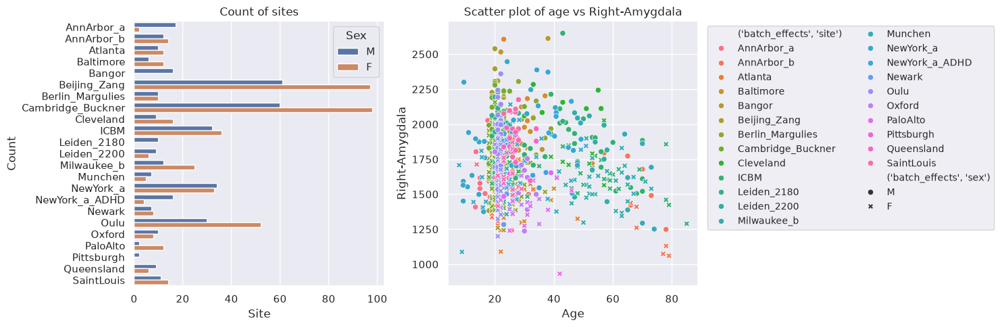

The left diagram shows some sites contain more subjects than others,
e.g., the biggest sites are in Beijing and Cambridge. The right diagram
shows that most of the subject are between 20 and 30 years old.

Normative model: BLR without batch effects
------------------------------------------

A normative model consists of a regression model for each response
variable. Two examples of regressions models you can use with PCNtoolkit
are the Bayesian Linear Regression (BLR) and Hierarchical Bayesian
Regression (HBR) models.

We start with a simple BLR model using a B-spline basis function. This
model assumes Gaussian response variables and ignores batch effects (be)
like site and sex.

.. code:: ipython3

    blr_no_be = BLR(
        name="template",
        # We use a B-spline basis expansion for the mean, so the predicted mean is a smooth function of the covariates
        basis_function_mean=BsplineBasisFunction(degree=3, nknots=5),
        # We want the variance to be a function of the covariates
        heteroskedastic=True
    )

After specifying the regression model, we can configure a normative
model.

A normative model has a number of configuration options:

- ``savemodel``: Whether to save the model after fitting. It creates a
  JSON file containing your trained model parameters. This is useful to:

  - *Avoid re-fitting*: Load the saved model later instead of training
    from scratch every time.
  - *Share with collaborators*: Send the file to colleagues, who can
    update it with their own data, producing a better model trained on
    more data combined. We will cover this in the federated learning
    tutorial.

- ``evaluate_model``: Whether to evaluate the model after fitting. It
  computes a set of metrics are computed that tell you how well your
  model fits the data. For more information, see our evaluation metrics
  tutorial.

- ``saveresults``: Whether to save the per-subject results after
  predicting. Results include:

  - how far the observed value for this subject is from the fitted
    model’s predicted typical value for someone with similar covariates
    and batch effects (``Z``)
  - how statistically surprising the observed value for this subject is
    under the fitted model’s predicted distribution (``logp``).
  - fitted model’s predicted distribution at selected centiles (such as
    the 5th, 50th, and 95th centiles) for this subject (``centiles``)
  - summary of evaluation metrics for each response variable, when
    ``evaluate_model`` is enabled.

- ``saveplots``: Whether to save the plots after fitting.

- ``save_dir``: The directory to save the model, results, and plots.

- ``inscaler``: The scaler to use for the input data. Can be either one
  of “standardize”, “minmax”, “robminmax”, “none”

- ``outscaler``: The scaler to use for the output data. Can be either
  one of “standardize”, “minmax”, “robminmax”, “none”

.. code:: ipython3

    model_blr_no_be = NormativeModel(
        template_regression_model=blr_no_be, # we select our BLR model
        savemodel=False, # we dont need to save the model for this tutorial
        evaluate_model=True, # we want to evaluate the model to see how well it fits the data
        saveresults=False, # we don't need to save the results for this tutorial
        saveplots=False,
        save_dir="resources/blr/save_dir",
        inscaler="standardize",
        outscaler="standardize",
    )

Fit the model
~~~~~~~~~~~~~

With all that configured, we can fit the model.

The ``fit_predict`` function will fit the model, evaluate it, and save
the results and plots (if so configured).

After that, it will compute Z-scores and centiles for the test set.

All results can be found in the save directory.

.. code:: ipython3

    model_blr_no_be.fit_predict(train, test);

.. code:: text

    Process: 2602 - 2026-07-22 18:46:14 - Fitting models on 1 response variables.
    Process: 2602 - 2026-07-22 18:46:14 - Fitting model for Right-Amygdala.
    Process: 2602 - 2026-07-22 18:46:14 - Making predictions on 1 response variables.
    Process: 2602 - 2026-07-22 18:46:14 - Computing z-scores for 1 response variables.
    Process: 2602 - 2026-07-22 18:46:14 - Computing z-scores for Right-Amygdala.
    Process: 2602 - 2026-07-22 18:46:14 - Computing centiles for 1 response variables.
    Process: 2602 - 2026-07-22 18:46:14 - Computing centiles for Right-Amygdala.
    Process: 2602 - 2026-07-22 18:46:14 - Computing log-probabilities for 1 response variables.
    Process: 2602 - 2026-07-22 18:46:14 - Computing log-probabilities for 1 response variables.
    Process: 2602 - 2026-07-22 18:46:14 - Computing log-probabilities for Right-Amygdala.
    Process: 2602 - 2026-07-22 18:46:14 - Computing yhat for 1 response variables.
    Process: 2602 - 2026-07-22 18:46:14 - Computing yhat for Right-Amygdala.
    Process: 2602 - 2026-07-22 18:46:14 - Making predictions on 1 response variables.
    Process: 2602 - 2026-07-22 18:46:14 - Computing z-scores for 1 response variables.
    Process: 2602 - 2026-07-22 18:46:14 - Computing z-scores for Right-Amygdala.
    Process: 2602 - 2026-07-22 18:46:14 - Computing centiles for 1 response variables.
    Process: 2602 - 2026-07-22 18:46:14 - Computing centiles for Right-Amygdala.
    Process: 2602 - 2026-07-22 18:46:14 - Computing log-probabilities for 1 response variables.
    Process: 2602 - 2026-07-22 18:46:14 - Computing log-probabilities for 1 response variables.
    Process: 2602 - 2026-07-22 18:46:14 - Computing log-probabilities for Right-Amygdala.
    Process: 2602 - 2026-07-22 18:46:14 - Computing yhat for 1 response variables.
    Process: 2602 - 2026-07-22 18:46:14 - Computing yhat for Right-Amygdala.
    

Looking at the printed messages, we can identify three main steps:

1. | *“Fitting models on 1 response variables.”*
   | The model is being fitted on the **training data**.

2. | *“Making predictions on 1 response variables.”*
   | First, PCNtoolkit computes predictions on the **training data**.

3. | *“Making predictions on 1 response variables.”*
   | Then, PCNtoolkit computes predictions on the **test data**

Plot the results
~~~~~~~~~~~~~~~~

The PCNtoolkit offers some basic plotting functions:

1. ``plot_centiles``: Plot the predicted centiles for a model
2. ``plot_qq``: Plot the QQ-plot of the predicted Z-scores

Let’s start with the centiles plot:

.. code:: ipython3

    plot_centiles(model_blr_no_be, scatter_data=train);

.. code:: text

    Process: 2602 - 2026-07-22 18:46:14 - Dataset "centile" created.
        - 150 observations
        - 150 unique subjects
        - 1 covariates
        - 1 response variables
        - 2 batch effects:
        	sex (1)
    	site (1)
        
    Process: 2602 - 2026-07-22 18:46:14 - Computing centiles for 1 response variables.
    Process: 2602 - 2026-07-22 18:46:14 - Computing centiles for Right-Amygdala.
    Process: 2602 - 2026-07-22 18:46:15 - Harmonizing data on 1 response variables.
    Process: 2602 - 2026-07-22 18:46:15 - Harmonizing data for Right-Amygdala.
    

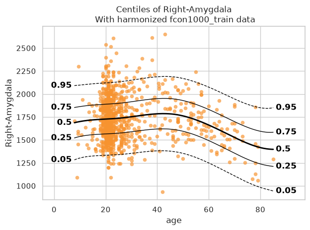

Now let’s see the qq plots

.. code:: ipython3

    plot_qq(test, plot_id_line=True);

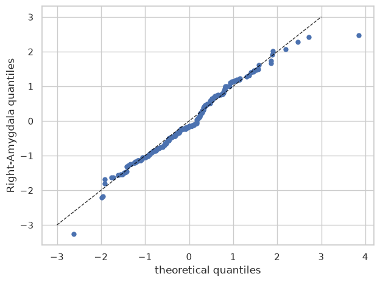

Evaluation statistics
~~~~~~~~~~~~~~~~~~~~~

Evaluation statistcs are stored in the ``NormData`` object. There is a
separate tutorial for detailed explanations of each metric.

.. code:: ipython3

    # Show the evaluation metrics from the train set
    display(train.get_statistics_df())
    # Show the evaluation metrics from the train set
    display(test.get_statistics_df())

.. raw:: html

    

    
    <table border="1" class="dataframe">
      <thead>
        <tr style="text-align: right;">
          <th>statistic</th>
          <th>EXPV</th>
          <th>Kurtosis</th>
          <th>MACE</th>
          <th>MAPE</th>
          <th>MLL</th>
          <th>MSLL</th>
          <th>R2</th>
          <th>RMSE</th>
          <th>Rho</th>
          <th>Rho_p</th>
          <th>SMSE</th>
          <th>ShapiroW</th>
          <th>Skewness</th>
        </tr>
        <tr>
          <th>response_vars</th>
          <th></th>
          <th></th>
          <th></th>
          <th></th>
          <th></th>
          <th></th>
          <th></th>
          <th></th>
          <th></th>
          <th></th>
          <th></th>
          <th></th>
          <th></th>
        </tr>
      </thead>
      <tbody>
        <tr>
          <th>Right-Amygdala</th>
          <td>0.050108</td>
          <td>0.362789</td>
          <td>0.166481</td>
          <td>0.112855</td>
          <td>1.393816</td>
          <td>-0.025123</td>
          <td>0.050108</td>
          <td>238.782623</td>
          <td>0.103329</td>
          <td>0.002386</td>
          <td>0.949892</td>
          <td>0.989231</td>
          <td>0.390056</td>
        </tr>
      </tbody>
    </table>
    

.. raw:: html

    

    
    <table border="1" class="dataframe">
      <thead>
        <tr style="text-align: right;">
          <th>statistic</th>
          <th>EXPV</th>
          <th>Kurtosis</th>
          <th>MACE</th>
          <th>MAPE</th>
          <th>MLL</th>
          <th>MSLL</th>
          <th>R2</th>
          <th>RMSE</th>
          <th>Rho</th>
          <th>Rho_p</th>
          <th>SMSE</th>
          <th>ShapiroW</th>
          <th>Skewness</th>
        </tr>
        <tr>
          <th>response_vars</th>
          <th></th>
          <th></th>
          <th></th>
          <th></th>
          <th></th>
          <th></th>
          <th></th>
          <th></th>
          <th></th>
          <th></th>
          <th></th>
          <th></th>
          <th></th>
        </tr>
      </thead>
      <tbody>
        <tr>
          <th>Right-Amygdala</th>
          <td>0.023886</td>
          <td>-0.119202</td>
          <td>0.191629</td>
          <td>0.115624</td>
          <td>1.371381</td>
          <td>-0.009888</td>
          <td>0.023159</td>
          <td>233.194296</td>
          <td>0.061853</td>
          <td>0.365652</td>
          <td>0.976841</td>
          <td>0.991958</td>
          <td>0.0534</td>
        </tr>
      </tbody>
    </table>
    

Normative model: warped-BLR without batch effects
-------------------------------------------------

Now we fit a more flexible warped-BLR model.The warp lets the model
handle response distributions that are non-Gaussian, for example when
the data are skewed or have heavier tails. We again ignore the batch
effects (be).

Find more information about the warped-BLR (w-BLR) on this paper: >
Fraza, C. J., Dinga, R., Beckmann, C. F., & Marquand, A. F. (2021).
Warped Bayesian linear regression for normative modelling of big data.
NeuroImage, 245, 118715.
https://doi.org/10.1016/j.neuroimage.2021.118715

.. code:: ipython3

    # To reduce tutorial clutter, we suppress the internal "Process: ..." messages. 
    # For your own analyses, we recommend keeping them enabled to better understand 
    # what is happening and to help us troubleshoot any issues you report.
    pcntoolkit.util.output.Output.set_show_messages(False)

.. code:: ipython3

    wblr_no_be = BLR(
        name="template",
        # We use a B-spline basis expansion for the mean, so the predicted mean is a smooth function of the covariates
        basis_function_mean=BsplineBasisFunction(degree=3, nknots=5),
        # We want the variance to be a function of the covariates
        heteroskedastic=True,
        
        # Allow warping
        warp_name="warpsinharcsinh",  # We configure a sinh-arcsinh warp
    )

.. code:: ipython3

    model_wblr_no_be = NormativeModel(
        template_regression_model=wblr_no_be, # we select our w-BLR model
        savemodel=False, # we dont need to save the model for this tutorial
        evaluate_model=True, # we want to evaluate the model to see how well it fits the data
        saveresults=False, # we don't need to save the results for this tutorial
        saveplots=False,
        save_dir="resources/blr/save_dir",
        inscaler="standardize",
        outscaler="standardize",
    )

Fit the model
~~~~~~~~~~~~~

.. code:: ipython3

    model_wblr_no_be.fit_predict(train, test);

Plot the results
~~~~~~~~~~~~~~~~

.. code:: ipython3

    # centile plots
    plot_centiles(model_wblr_no_be, scatter_data=train);
    
    # qq-plots
    plot_qq(test, plot_id_line=True);
    
    # Show the evaluation metrics from the train set
    display(train.get_statistics_df())
    # Show the evaluation metrics from the train set
    display(test.get_statistics_df())

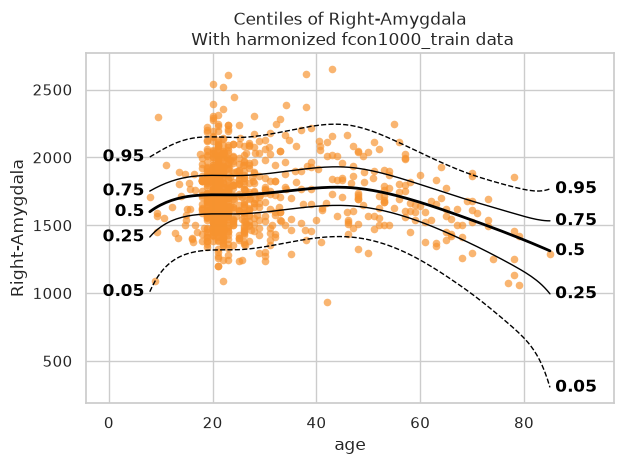

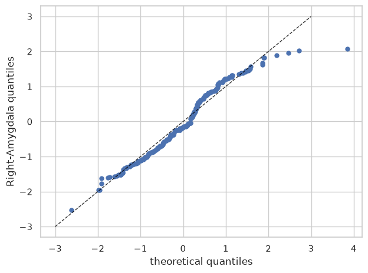

.. raw:: html

    

    
    <table border="1" class="dataframe">
      <thead>
        <tr style="text-align: right;">
          <th>statistic</th>
          <th>EXPV</th>
          <th>Kurtosis</th>
          <th>MACE</th>
          <th>MAPE</th>
          <th>MLL</th>
          <th>MSLL</th>
          <th>R2</th>
          <th>RMSE</th>
          <th>Rho</th>
          <th>Rho_p</th>
          <th>SMSE</th>
          <th>ShapiroW</th>
          <th>Skewness</th>
        </tr>
        <tr>
          <th>response_vars</th>
          <th></th>
          <th></th>
          <th></th>
          <th></th>
          <th></th>
          <th></th>
          <th></th>
          <th></th>
          <th></th>
          <th></th>
          <th></th>
          <th></th>
          <th></th>
        </tr>
      </thead>
      <tbody>
        <tr>
          <th>Right-Amygdala</th>
          <td>0.053624</td>
          <td>-0.706314</td>
          <td>0.164092</td>
          <td>0.112297</td>
          <td>1.413028</td>
          <td>-0.00591</td>
          <td>0.053418</td>
          <td>238.3662</td>
          <td>0.118071</td>
          <td>0.000513</td>
          <td>0.946582</td>
          <td>0.985093</td>
          <td>0.180186</td>
        </tr>
      </tbody>
    </table>
    

.. raw:: html

    

    
    <table border="1" class="dataframe">
      <thead>
        <tr style="text-align: right;">
          <th>statistic</th>
          <th>EXPV</th>
          <th>Kurtosis</th>
          <th>MACE</th>
          <th>MAPE</th>
          <th>MLL</th>
          <th>MSLL</th>
          <th>R2</th>
          <th>RMSE</th>
          <th>Rho</th>
          <th>Rho_p</th>
          <th>SMSE</th>
          <th>ShapiroW</th>
          <th>Skewness</th>
        </tr>
        <tr>
          <th>response_vars</th>
          <th></th>
          <th></th>
          <th></th>
          <th></th>
          <th></th>
          <th></th>
          <th></th>
          <th></th>
          <th></th>
          <th></th>
          <th></th>
          <th></th>
          <th></th>
        </tr>
      </thead>
      <tbody>
        <tr>
          <th>Right-Amygdala</th>
          <td>0.022577</td>
          <td>-0.88898</td>
          <td>0.196683</td>
          <td>0.115121</td>
          <td>1.411251</td>
          <td>0.029982</td>
          <td>0.022314</td>
          <td>233.295036</td>
          <td>0.045759</td>
          <td>0.503518</td>
          <td>0.977686</td>
          <td>0.978829</td>
          <td>0.043661</td>
        </tr>
      </tbody>
    </table>
    

Normative model: warped-BLR with batch effects
----------------------------------------------

Now we keep the same warped-BLR model but we also model the batch
effects (be). Here, the batches are variables such as site and sex.
Adding batch effects lets the model account for systematic differences
between groups, instead of forcing all groups to follow exactly the same
mean and variance patterns.

.. code:: ipython3

    wblr_with_be = BLR(
        name="template",
        # We use a B-spline basis expansion for the mean, so the predicted mean is a smooth function of the covariates
        basis_function_mean=BsplineBasisFunction(degree=3, nknots=5),
        # We want the variance to be a function of the covariates
        heteroskedastic=True,
        
        # Allow warping
        warp_name="warpsinharcsinh",  # We configure a sinh-arcsinh warp
    
        # Model the batch effects (sex and site)
        fixed_effect=True,  # We model offsets in the mean for each individual batch effect
        fixed_effect_slope=True,  # We model a fixed effect in the slope of the mean for each individual batch effect
        fixed_effect_var_slope=True, # We model a fixed effect in the slope of the variance for each individual batch effect
    )

.. code:: ipython3

    model_wblr_with_be = NormativeModel(
        template_regression_model=wblr_with_be, # we select our w-BLR model
        savemodel=False, # we dont need to save the model for this tutorial
        evaluate_model=True, # we want to evaluate the model to see how well it fits the data
        saveresults=False, # we don't need to save the results for this tutorial
        saveplots=False,
        save_dir="resources/blr/save_dir",
        inscaler="standardize",
        outscaler="standardize",
    )

Fit the model
~~~~~~~~~~~~~

.. code:: ipython3

    model_wblr_with_be.fit_predict(train, test);

.. code:: text

    /home/runner/work/PCNtoolkit/PCNtoolkit/pcntoolkit/regression_model/blr.py:630: LinAlgWarning: An ill-conditioned matrix detected: slice 0 has rcond = 1.7553100480988225e-41.
      invAXt: np.ndarray = linalg.solve(self.A, X.T, check_finite=False)
    /home/runner/work/PCNtoolkit/PCNtoolkit/pcntoolkit/util/output.py:295: UserWarning: Process: 2602 - 2026-07-22 18:46:31 - Posterior estimation failed: 
    Matrix is not positive definite. 
    The optimizer could not find a stable solution. Retrying optimization.
      warnings.warn(message, category)
    /home/runner/work/PCNtoolkit/PCNtoolkit/pcntoolkit/regression_model/blr.py:630: LinAlgWarning: An ill-conditioned matrix detected: slice 0 has rcond = 1.9899944098769437e-41.
      invAXt: np.ndarray = linalg.solve(self.A, X.T, check_finite=False)
    /home/runner/work/PCNtoolkit/PCNtoolkit/pcntoolkit/regression_model/blr.py:630: LinAlgWarning: An ill-conditioned matrix detected: slice 0 has rcond = 6.939893454445029e-41.
      invAXt: np.ndarray = linalg.solve(self.A, X.T, check_finite=False)
    /home/runner/work/PCNtoolkit/PCNtoolkit/pcntoolkit/regression_model/blr.py:630: LinAlgWarning: An ill-conditioned matrix detected: slice 0 has rcond = 1.0361998051206722e-44.
      invAXt: np.ndarray = linalg.solve(self.A, X.T, check_finite=False)
    /home/runner/work/PCNtoolkit/PCNtoolkit/pcntoolkit/regression_model/blr.py:630: LinAlgWarning: An ill-conditioned matrix detected: slice 0 has rcond = 3.36284632541132e-41.
      invAXt: np.ndarray = linalg.solve(self.A, X.T, check_finite=False)
    /home/runner/work/PCNtoolkit/PCNtoolkit/pcntoolkit/regression_model/blr.py:630: LinAlgWarning: An ill-conditioned matrix detected: slice 0 has rcond = 1.7553100480988572e-41.
      invAXt: np.ndarray = linalg.solve(self.A, X.T, check_finite=False)
    /home/runner/work/PCNtoolkit/PCNtoolkit/pcntoolkit/regression_model/blr.py:630: LinAlgWarning: An ill-conditioned matrix detected: slice 0 has rcond = 5.03773263174331e-42.
      invAXt: np.ndarray = linalg.solve(self.A, X.T, check_finite=False)
    /home/runner/work/PCNtoolkit/PCNtoolkit/pcntoolkit/regression_model/blr.py:630: LinAlgWarning: An ill-conditioned matrix detected: slice 0 has rcond = 1.260666069837561e-41.
      invAXt: np.ndarray = linalg.solve(self.A, X.T, check_finite=False)
    /home/runner/work/PCNtoolkit/PCNtoolkit/pcntoolkit/regression_model/blr.py:630: LinAlgWarning: An ill-conditioned matrix detected: slice 0 has rcond = 1.7553103346043406e-41.
      invAXt: np.ndarray = linalg.solve(self.A, X.T, check_finite=False)
    /home/runner/work/PCNtoolkit/PCNtoolkit/pcntoolkit/regression_model/blr.py:630: LinAlgWarning: An ill-conditioned matrix detected: slice 0 has rcond = 1.7553102034007003e-41.
      invAXt: np.ndarray = linalg.solve(self.A, X.T, check_finite=False)
    /home/runner/work/PCNtoolkit/PCNtoolkit/pcntoolkit/regression_model/blr.py:630: LinAlgWarning: An ill-conditioned matrix detected: slice 0 has rcond = 1.75531033373041e-41.
      invAXt: np.ndarray = linalg.solve(self.A, X.T, check_finite=False)
    /home/runner/work/PCNtoolkit/PCNtoolkit/pcntoolkit/regression_model/blr.py:630: LinAlgWarning: An ill-conditioned matrix detected: slice 0 has rcond = 1.755310261819347e-41.
      invAXt: np.ndarray = linalg.solve(self.A, X.T, check_finite=False)
    /home/runner/work/PCNtoolkit/PCNtoolkit/pcntoolkit/regression_model/blr.py:630: LinAlgWarning: An ill-conditioned matrix detected: slice 0 has rcond = 1.7553105033879259e-41.
      invAXt: np.ndarray = linalg.solve(self.A, X.T, check_finite=False)
    /home/runner/work/PCNtoolkit/PCNtoolkit/pcntoolkit/regression_model/blr.py:630: LinAlgWarning: An ill-conditioned matrix detected: slice 0 has rcond = 7.982765221415766e-42.
      invAXt: np.ndarray = linalg.solve(self.A, X.T, check_finite=False)
    /home/runner/work/PCNtoolkit/PCNtoolkit/pcntoolkit/regression_model/blr.py:630: LinAlgWarning: An ill-conditioned matrix detected: slice 0 has rcond = 1.7552936471355131e-41.
      invAXt: np.ndarray = linalg.solve(self.A, X.T, check_finite=False)
    /home/runner/work/PCNtoolkit/PCNtoolkit/pcntoolkit/regression_model/blr.py:630: LinAlgWarning: An ill-conditioned matrix detected: slice 0 has rcond = 1.7553100922350528e-41.
      invAXt: np.ndarray = linalg.solve(self.A, X.T, check_finite=False)
    /home/runner/work/PCNtoolkit/PCNtoolkit/pcntoolkit/regression_model/blr.py:630: LinAlgWarning: An ill-conditioned matrix detected: slice 0 has rcond = 1.944978346180824e-41.
      invAXt: np.ndarray = linalg.solve(self.A, X.T, check_finite=False)
    /home/runner/work/PCNtoolkit/PCNtoolkit/pcntoolkit/regression_model/blr.py:630: LinAlgWarning: An ill-conditioned matrix detected: slice 0 has rcond = 9.854050412855395e-43.
      invAXt: np.ndarray = linalg.solve(self.A, X.T, check_finite=False)
    /home/runner/work/PCNtoolkit/PCNtoolkit/pcntoolkit/regression_model/blr.py:630: LinAlgWarning: An ill-conditioned matrix detected: slice 0 has rcond = 1.7779270793950462e-41.
      invAXt: np.ndarray = linalg.solve(self.A, X.T, check_finite=False)
    /home/runner/work/PCNtoolkit/PCNtoolkit/pcntoolkit/regression_model/blr.py:630: LinAlgWarning: An ill-conditioned matrix detected: slice 0 has rcond = 1.754933988558462e-41.
      invAXt: np.ndarray = linalg.solve(self.A, X.T, check_finite=False)
    /home/runner/work/PCNtoolkit/PCNtoolkit/pcntoolkit/regression_model/blr.py:630: LinAlgWarning: An ill-conditioned matrix detected: slice 0 has rcond = 1.755310256099162e-41.
      invAXt: np.ndarray = linalg.solve(self.A, X.T, check_finite=False)
    /home/runner/work/PCNtoolkit/PCNtoolkit/pcntoolkit/regression_model/blr.py:630: LinAlgWarning: An ill-conditioned matrix detected: slice 0 has rcond = 1.7553104230476875e-41.
      invAXt: np.ndarray = linalg.solve(self.A, X.T, check_finite=False)
    /home/runner/work/PCNtoolkit/PCNtoolkit/pcntoolkit/regression_model/blr.py:630: LinAlgWarning: An ill-conditioned matrix detected: slice 0 has rcond = 1.7553101870027942e-41.
      invAXt: np.ndarray = linalg.solve(self.A, X.T, check_finite=False)
    /home/runner/work/PCNtoolkit/PCNtoolkit/pcntoolkit/regression_model/blr.py:630: LinAlgWarning: An ill-conditioned matrix detected: slice 0 has rcond = 1.7553103216402893e-41.
      invAXt: np.ndarray = linalg.solve(self.A, X.T, check_finite=False)
    /home/runner/work/PCNtoolkit/PCNtoolkit/pcntoolkit/regression_model/blr.py:630: LinAlgWarning: An ill-conditioned matrix detected: slice 0 has rcond = 1.7553102777732048e-41.
      invAXt: np.ndarray = linalg.solve(self.A, X.T, check_finite=False)
    /home/runner/work/PCNtoolkit/PCNtoolkit/pcntoolkit/regression_model/blr.py:630: LinAlgWarning: An ill-conditioned matrix detected: slice 0 has rcond = 1.588536185279474e-41.
      invAXt: np.ndarray = linalg.solve(self.A, X.T, check_finite=False)
    

Plot the results
~~~~~~~~~~~~~~~~

Because this model includes batch effects, we can now visualize results
not only over all data, but also separately for specific groups such as
sites or sexes.

Below we show a few useful options: ``plot_centiles_advanced`` to
highlight specific batch effects in the plot, ``plot_qq`` to inspect
model fit by batch effects, and ``plot_ridge`` to compare the
distribution of responses or Z-scores across batch effects.

.. code:: ipython3

    plot_centiles_advanced(
        model_wblr_with_be,
        scatter_data=train,
    
        # Plot these centiles, the default is [0.05, 0.25, 0.5, 0.75, 0.95]
        centiles=[0.05, 0.5, 0.95],  
        
        # Highlight a specific gender from specific sites
        batch_effects={"site": [ "Beijing_Zang", "AnnArbor_a",], "sex": ["M"]},
        # Show other data not belonging to the groups above
        show_other_data=True,
        
        # Harmonize the scatterdata, this means that we 'remove' the batch effects from the data, by simulating what the data would have looked like if all data was from the same batch.
        harmonize_data=True
    );

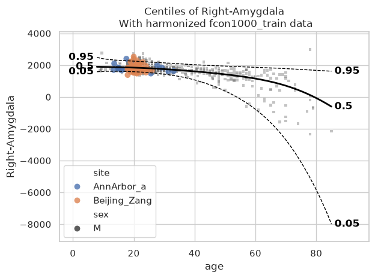

When we call ``plot_centiles_advanced``, the function prints messages
such as *Computing centiles* and *Harmonizing data for Right-Amygdala*.
These messages appear because the plot also computes centiles and
harmonize the data for *based on the batch effects* that you selected in
the function call (see ``batch_effects`` keyword argument).

   **Exercise** Set ``batch_effects='all'`` in
   ``plot_centiles_advanced``. How does that affect your plotted
   centiles and scatter data?

.. code:: ipython3

    # qq-plot
    plot_qq(test, plot_id_line=True);
    
    # Show the evaluation metrics from the train set
    display(train.get_statistics_df())
    # Show the evaluation metrics from the train set
    display(test.get_statistics_df())

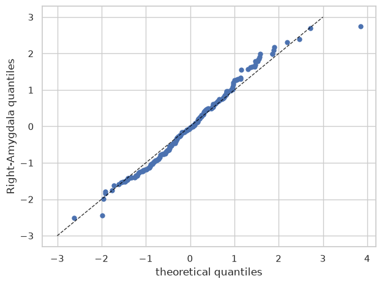

.. raw:: html

    

    
    <table border="1" class="dataframe">
      <thead>
        <tr style="text-align: right;">
          <th>statistic</th>
          <th>EXPV</th>
          <th>Kurtosis</th>
          <th>MACE</th>
          <th>MAPE</th>
          <th>MLL</th>
          <th>MSLL</th>
          <th>R2</th>
          <th>RMSE</th>
          <th>Rho</th>
          <th>Rho_p</th>
          <th>SMSE</th>
          <th>ShapiroW</th>
          <th>Skewness</th>
        </tr>
        <tr>
          <th>response_vars</th>
          <th></th>
          <th></th>
          <th></th>
          <th></th>
          <th></th>
          <th></th>
          <th></th>
          <th></th>
          <th></th>
          <th></th>
          <th></th>
          <th></th>
          <th></th>
        </tr>
      </thead>
      <tbody>
        <tr>
          <th>Right-Amygdala</th>
          <td>0.396912</td>
          <td>-0.234567</td>
          <td>0.093711</td>
          <td>0.08644</td>
          <td>1.173136</td>
          <td>-0.245803</td>
          <td>0.396909</td>
          <td>190.264094</td>
          <td>0.611857</td>
          <td>1.158651e-89</td>
          <td>0.603091</td>
          <td>0.997748</td>
          <td>0.115053</td>
        </tr>
      </tbody>
    </table>
    

.. raw:: html

    

    
    <table border="1" class="dataframe">
      <thead>
        <tr style="text-align: right;">
          <th>statistic</th>
          <th>EXPV</th>
          <th>Kurtosis</th>
          <th>MACE</th>
          <th>MAPE</th>
          <th>MLL</th>
          <th>MSLL</th>
          <th>R2</th>
          <th>RMSE</th>
          <th>Rho</th>
          <th>Rho_p</th>
          <th>SMSE</th>
          <th>ShapiroW</th>
          <th>Skewness</th>
        </tr>
        <tr>
          <th>response_vars</th>
          <th></th>
          <th></th>
          <th></th>
          <th></th>
          <th></th>
          <th></th>
          <th></th>
          <th></th>
          <th></th>
          <th></th>
          <th></th>
          <th></th>
          <th></th>
        </tr>
      </thead>
      <tbody>
        <tr>
          <th>Right-Amygdala</th>
          <td>0.285233</td>
          <td>-0.33767</td>
          <td>0.143504</td>
          <td>0.094162</td>
          <td>1.244753</td>
          <td>-0.136516</td>
          <td>0.284778</td>
          <td>199.53837</td>
          <td>0.512633</td>
          <td>7.129297e-16</td>
          <td>0.715222</td>
          <td>0.988757</td>
          <td>0.189223</td>
        </tr>
      </tbody>
    </table>
    

QQ-plot and ridge plot per batch effect
~~~~~~~~~~~~~~~~~~~~~~~~~~~~~~~~~~~~~~~

Finally, we show how we can use ``plot_qq`` and ``plot_ridge`` split
based on the batch effects (here we choose to split based on males and
females):

.. code:: ipython3

    # Show the qq-plot per sex
    plot_qq(test, plot_id_line=True, hue_data="sex", split_data="sex")
    sns.set_theme(style="darkgrid", rc={"axes.facecolor": (0, 0, 0, 0)})

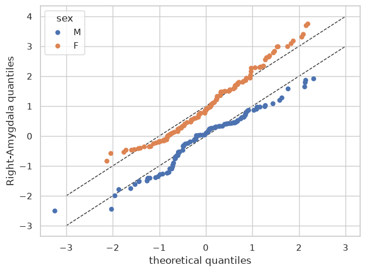

.. code:: ipython3

    # Show the ridge plot per sex
    plot_ridge(test, "Z", split_by="sex");
    
    # We can also show the 'Y' variable
    plot_ridge(test, "Y", split_by="sex");

.. code:: text

    /opt/hostedtoolcache/Python/3.13.14/x64/lib/python3.13/site-packages/seaborn/axisgrid.py:123: UserWarning: Tight layout not applied. tight_layout cannot make Axes height small enough to accommodate all Axes decorations.
      self._figure.tight_layout(*args, **kwargs)
    /opt/hostedtoolcache/Python/3.13.14/x64/lib/python3.13/site-packages/seaborn/axisgrid.py:123: UserWarning: Tight layout not applied. The bottom and top margins cannot be made large enough to accommodate all Axes decorations.
      self._figure.tight_layout(*args, **kwargs)
    /opt/hostedtoolcache/Python/3.13.14/x64/lib/python3.13/site-packages/seaborn/axisgrid.py:123: UserWarning: Tight layout not applied. The bottom and top margins cannot be made large enough to accommodate all Axes decorations.
      self._figure.tight_layout(*args, **kwargs)
    /opt/hostedtoolcache/Python/3.13.14/x64/lib/python3.13/site-packages/seaborn/axisgrid.py:123: UserWarning: Tight layout not applied. The bottom and top margins cannot be made large enough to accommodate all Axes decorations.
      self._figure.tight_layout(*args, **kwargs)
    /opt/hostedtoolcache/Python/3.13.14/x64/lib/python3.13/site-packages/seaborn/axisgrid.py:123: UserWarning: Tight layout not applied. The bottom and top margins cannot be made large enough to accommodate all Axes decorations.
      self._figure.tight_layout(*args, **kwargs)
    /home/runner/work/PCNtoolkit/PCNtoolkit/pcntoolkit/util/plotter.py:1051: UserWarning: Tight layout not applied. tight_layout cannot make Axes height small enough to accommodate all Axes decorations.
      g.figure.tight_layout()
    

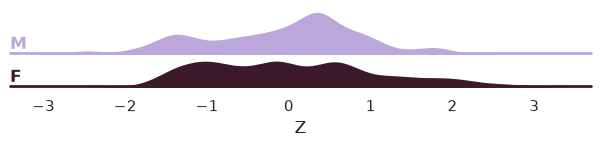

.. code:: text

    /opt/hostedtoolcache/Python/3.13.14/x64/lib/python3.13/site-packages/seaborn/axisgrid.py:123: UserWarning: Tight layout not applied. tight_layout cannot make Axes height small enough to accommodate all Axes decorations.
      self._figure.tight_layout(*args, **kwargs)
    /opt/hostedtoolcache/Python/3.13.14/x64/lib/python3.13/site-packages/seaborn/axisgrid.py:123: UserWarning: Tight layout not applied. The bottom and top margins cannot be made large enough to accommodate all Axes decorations.
      self._figure.tight_layout(*args, **kwargs)
    /opt/hostedtoolcache/Python/3.13.14/x64/lib/python3.13/site-packages/seaborn/axisgrid.py:123: UserWarning: Tight layout not applied. The bottom and top margins cannot be made large enough to accommodate all Axes decorations.
      self._figure.tight_layout(*args, **kwargs)
    /opt/hostedtoolcache/Python/3.13.14/x64/lib/python3.13/site-packages/seaborn/axisgrid.py:123: UserWarning: Tight layout not applied. The bottom and top margins cannot be made large enough to accommodate all Axes decorations.
      self._figure.tight_layout(*args, **kwargs)
    /opt/hostedtoolcache/Python/3.13.14/x64/lib/python3.13/site-packages/seaborn/axisgrid.py:123: UserWarning: Tight layout not applied. The bottom and top margins cannot be made large enough to accommodate all Axes decorations.
      self._figure.tight_layout(*args, **kwargs)
    /home/runner/work/PCNtoolkit/PCNtoolkit/pcntoolkit/util/plotter.py:1051: UserWarning: Tight layout not applied. tight_layout cannot make Axes height small enough to accommodate all Axes decorations.
      g.figure.tight_layout()
    

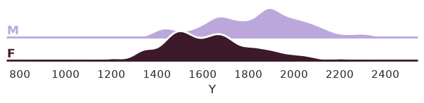

Compare the three models
------------------------

.. code:: ipython3

    models = {
        "BLR (no be)": model_blr_no_be,
        "w-BLR (no be)": model_wblr_no_be,
        "w-BLR (with be)": model_wblr_with_be,
    }
    
    # Plot the centiles of each model to compare
    for model_name, m in models.items():
        print(model_name)
        plot_centiles(m, scatter_data=train);
    

.. code:: text

    BLR (no be)
    

.. image:: 02_BLR_files/02_BLR_42_1.png

.. code:: text

    w-BLR (no be)
    

.. image:: 02_BLR_files/02_BLR_42_3.png

.. code:: text

    w-BLR (with be)
    

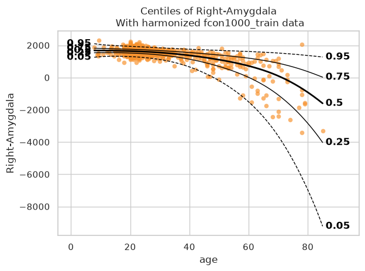

The 0.05 centile and even the 0.5 centile of the 3rd model (w-BLR with
batch effects) can become negative, even though the response variable
here, Right-Amygdala, is a volume and therefore should remain positive.
So, modelling each batch effect (site) seems to not improve the model. A
likely reason is that the dataset is very heterogeneous: uneven site
sizes, several small sites, and sites that cover different, sometimes
narrow age ranges (see the cell in the beginning of this notebook where
we visualise the data).

This is a useful reminder that a more flexible model is not always a
better model. To model the approximately Gaussian distributed Right
Amygdala volume, the simpler BLR without batch effects model (1st model)
seems to be the best choice. It is important to always *understand your
data* before you select a model.

What’s next?
------------

Now we have a normative BLR model, we can use it to:

- Harmonize data
- Synthesize new data

Harmonize
~~~~~~~~~

In PCNtoolkit, harmonization happens after we fit a model. For each
subject, it uses the fitted model to predict what their measured value
(Y) would be if they came from a single reference group (e.g., a
specific site and sex). A big advantage of this method is that its
transformation is invertible so you can always go back to your original
Y values.

Let’s first harmonize to the Beijing_Zang which has subjects ages 18-26:

.. code:: ipython3

    # Select the reference group: Beijing_Zang is one of the largest sites
    # (198 subjects) but they are all aged 18-26.
    reference_batch_effect = {
        "site": "Beijing_Zang",
        "sex": "M",
    }
    
    # Harmonize
    model_wblr_with_be.harmonize(test, reference_batch_effect=reference_batch_effect)
    
    plt.style.use("seaborn-v0_8")
    df = test.to_dataframe()
    fig, ax = plt.subplots(1, 2, figsize=(13, 5), sharey=True)
    sns.scatterplot(data=df, x=("X", "age"), y=("Y", feature_to_plot), hue=("batch_effects", "site"), ax=ax[0])
    sns.scatterplot(data=df, x=("X", "age"), y=("Y_harmonized", feature_to_plot), hue=("batch_effects", "site"), ax=ax[1])
    ax[0].title.set_text("Unharmonized")
    ax[1].title.set_text("Harmonized to Beijing_Zang (ages 18-26)")
    ax[0].legend([], [])
    ax[1].legend([], [])
    ax[0].set_xlabel("Age")
    ax[0].set_ylabel(feature_to_plot)
    ax[1].set_xlabel("Age")
    ax[1].set_ylabel(feature_to_plot)
    plt.tight_layout()
    plt.show()

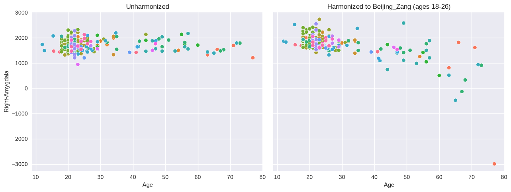

Notice that the oldest subjects get **negative** volumes after
harmonizing. The reference group is a *choice*, so let’s harmonize the
same data again, this time to ``ICBM``, which covers the full age range
(19-85):

.. code:: ipython3

    # Now harmonize the same data to ICBM instead: a smaller site (85
    # subjects) but it spans the full age range (19-85).
    reference_batch_effect = {
        "site": "ICBM",
        "sex": "M",
    }
    
    # Harmonize
    model_wblr_with_be.harmonize(test, reference_batch_effect=reference_batch_effect)
    
    plt.style.use("seaborn-v0_8")
    df = test.to_dataframe()
    fig, ax = plt.subplots(1, 2, figsize=(13, 5), sharey=True)
    sns.scatterplot(data=df, x=("X", "age"), y=("Y", feature_to_plot), hue=("batch_effects", "site"), ax=ax[0])
    sns.scatterplot(data=df, x=("X", "age"), y=("Y_harmonized", feature_to_plot), hue=("batch_effects", "site"), ax=ax[1])
    ax[0].title.set_text("Unharmonized")
    ax[1].title.set_text("Harmonized to ICBM (ages 19-85)")
    ax[0].legend([], [])
    ax[1].legend([], [])
    ax[0].set_xlabel("Age")
    ax[0].set_ylabel(feature_to_plot)
    ax[1].set_xlabel("Age")
    ax[1].set_ylabel(feature_to_plot)
    plt.tight_layout()
    plt.show()

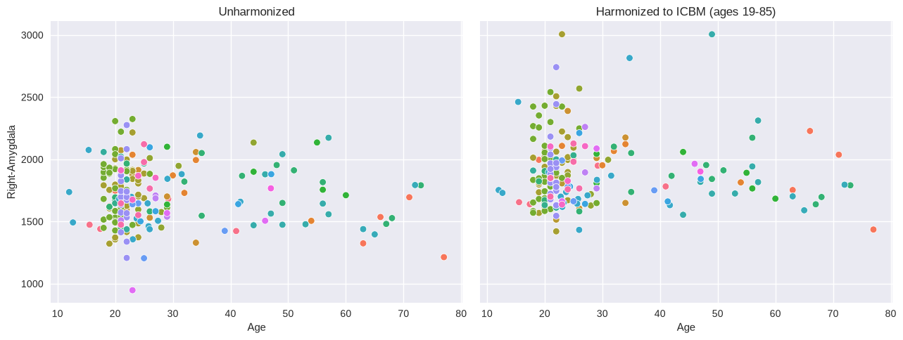

When harmonizing to ICBM no subjects get negative volumes.

*So why with the Beijing_Zang we got negative volumes while with the
ICBM not?*

Ans. To harmonize an old subject, the model has to guess what
Beijing_Zang looks like at age 70. But Beijing_Zang only has people up
to 26, so it has to extrapolate for older ages. In contrast, ICBM has
older people, so it does not extrapolate and its values can remain
within the accepted positive range.

   **Exercise**: We used the 3rd model - the one *with modeled batch
   effects* - for harmonization. Why do you think that is? And what
   would happen if you used a model *without batch effects* (the 1st or
   2nd)?

Synthesize
~~~~~~~~~~

Our models can synthesize new data that follows the learned
distribution.

Not only the distribution of the response variables given a covariate is
learned, but also the ranges of the covariates *within* each batch
effect. So if we have fitted a model on a number of sites, and subjects
from A have an age between 10 and 20, then the synthesized
pseudo-subjects from site A will also have an age between 10 and 20.

Not only that, but we also sample the batch effects in the frequency of
the batch effects in the original data. So if the train data contained
twice as many subjects from site A as site B, then the synthesized
pseudo-subjects will also have twice as many subjects from site A as
site B.

.. code:: ipython3

    # Generate 10000 synthetic datapoints from scratch
    synthetic_data = model_wblr_with_be.synthesize(covariate_range_per_batch_effect=True, n_samples=10000)  # <- also easy
    plot_centiles_advanced(
        model_wblr_with_be,
        covariate="age",  # Which covariate to plot on the x-axis
        scatter_data=synthetic_data,
        show_other_data=True,
        harmonize_data=True,
        show_legend=True,
    );

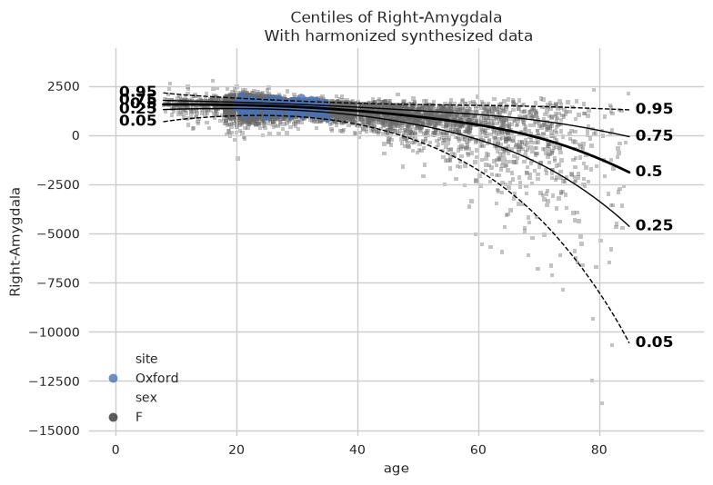

.. code:: ipython3

    # Synthesize new Y data for existing X data
    new_test_data = test.copy()
    
    # Remove the Y data, this way we will synthesize new Y data for the existing X data
    if hasattr(new_test_data, "Y"):
        del new_test_data["Y"]
    
    synthetic = model_wblr_with_be.synthesize(new_test_data)  # <- will fill in the missing Y data
    plot_centiles_advanced(
        model_wblr_with_be,
        centiles=[0.05, 0.5, 0.95],  # Plot arbitrary centiles
        covariate="age",  # Which covariate to plot on the x-axis
        scatter_data=train,  # Scatter the train data points
        batch_effects="all",  # You can set this to "all" to show all batch effects
        show_other_data=True,  # Show data points that do not match any batch effects
        harmonize_data=True,  # Set this to False to see the difference
        show_legend=False,  # Don't show the legend because it crowds the plot
    );

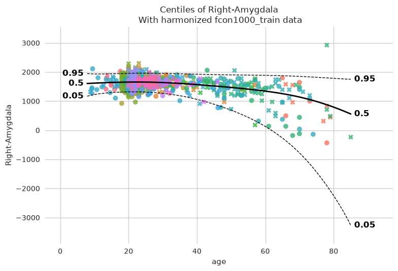

