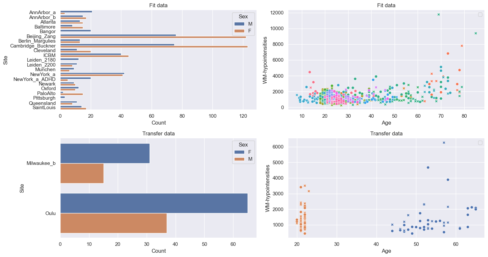
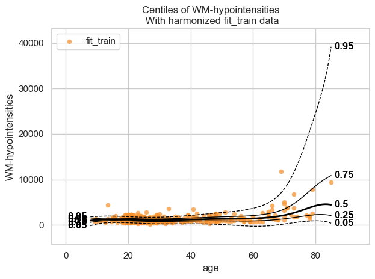
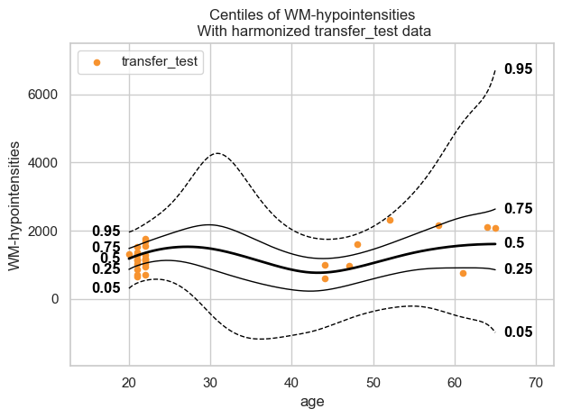
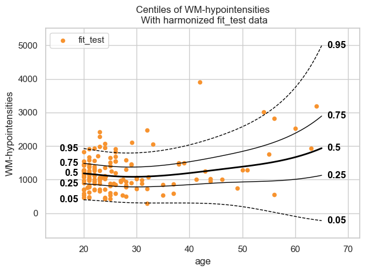
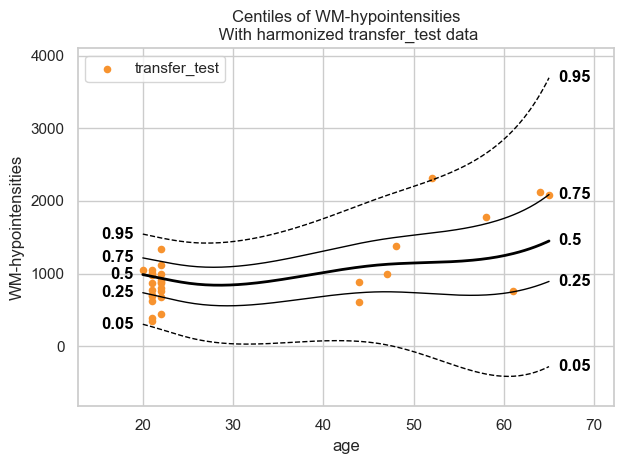
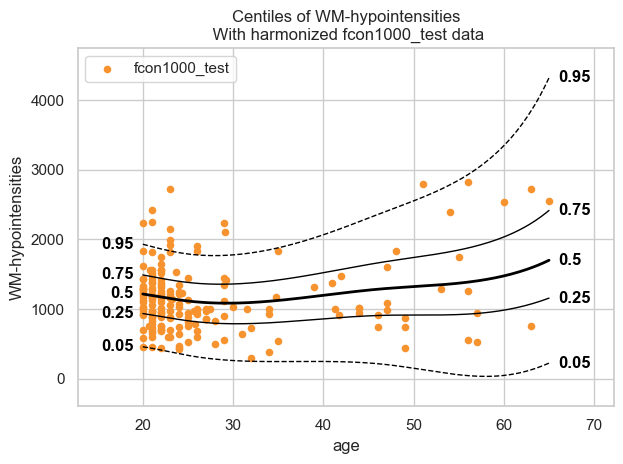

Transfer and extend
===================

.. container:: notebook-download

   :download:`Download Jupyter notebook <notebooks/06_transfer_extend.ipynb>`

Training a normative model on a large reference cohort takes a lot of
data and a lot of compute. Rather than training one from scratch,
PCNtoolkit lets you take a model that was already trained on tens of
thousands of subjects and adapt it to your own, much smaller, dataset.
There are two ways to do this: *transfer and extend*.

There is a second reason to work this way. Building a normative model
usually means many sites collaborating, but data often cannot leave the
hospital or institution where it was collected, because of privacy
regulations such as the GDPR. *Extend and transfer* are
privacy-preserving, since each site adapts the model locally and shares
only the model parameters, never the raw data. The two, however, play
different roles:

- Extend allows the model to be extended sequentially: the first site
  extends it and passes it to the second, which extends it again, and so
  on across the consortium.
- On the other hand, a model should not be transferred sequentially but
  only once.

Imports
-------

.. code:: ipython3

    import warnings
    import logging
    
    
    import pandas as pd
    import matplotlib.pyplot as plt
    from pcntoolkit import (
        BLR,
        BsplineBasisFunction,
        NormativeModel,
        NormData,
        load_fcon1000,
        plot_centiles_advanced,
    )
    
    import pcntoolkit.util.output
    import seaborn as sns
    
    sns.set_style("darkgrid")
    
    # Suppress some annoying warnings and logs
    warnings.simplefilter(action="ignore", category=FutureWarning)
    pd.options.mode.chained_assignment = None  # default='warn'
    pcntoolkit.util.output.Output.set_show_messages(False)

Load data
---------

We use the
`fcon1000 <https://fcon_1000.projects.nitrc.org/fcpClassic/FcpTable.html>`__.
This dataset contains derived structural MRI phenotypes from 1,078
subjects collected across 23 sites. To show how transfer and extend work
we will split it into two: - A reference dataset with 21 sites - a
smaller datasets with 2 sites

.. code:: ipython3

    # Download the dataset
    norm_data: NormData = load_fcon1000()
    
    # Select the white matter hypointensities feature
    features_to_model = [
        "WM-hypointensities"
    ]
    norm_data = norm_data.sel({"response_vars": features_to_model})
    
    # Leave two sites out for doing transfer and extend later
    transfer_sites = ["Milwaukee_b", "Oulu"]
    transfer_data, fit_data = norm_data.batch_effects_split({"site": transfer_sites}, names=("transfer", "fit"))
    
    # Split into train and test sets
    train, test = fit_data.train_test_split()
    transfer_train, transfer_test = transfer_data.train_test_split()

Visualize the data
------------------

.. code:: ipython3

    feature_to_plot = features_to_model[0]
    datasets = {
        "Fit data": train.merge(test, name="fit"),
        "Transfer data": transfer_train.merge(
            transfer_test, name="transfer"
        ),
    }
    
    fig, axes = plt.subplots(
        2, 2, figsize=(15, 8)
    )
    
    for i, (name, data) in enumerate(
        datasets.items()
    ):
        df = data.to_dataframe()
        # Count plot
        sns.countplot(
            data=df,
            y=("batch_effects", "site"),
            hue=("batch_effects", "sex"),
            ax=axes[i, 0],
            orient="h",
        )
        axes[i, 0].legend(title="Sex")
        axes[i, 0].set_title(f"{name}")
        axes[i, 0].set_xlabel("Count")
        axes[i, 0].set_ylabel("Site")
    
        # Scatter plot
        sns.scatterplot(
            data=df,
            x=("X", "age"),
            y=("Y", feature_to_plot),
            hue=("batch_effects", "site"),
            style=("batch_effects", "sex"),
            ax=axes[i, 1],
        )
        axes[i, 1].legend([], [])
        axes[i, 1].set_title(f"{name}")
        axes[i, 1].set_xlabel("Age")
        axes[i, 1].set_ylabel(feature_to_plot)
    
    plt.tight_layout()
    plt.show()

Normative model
---------------

Create BLR model
~~~~~~~~~~~~~~~~

.. code:: ipython3

    template_blr = BLR(
        name="template",
        heteroskedastic=True,
        warp_name="WarpSinhArcsinh",
        basis_function_mean=BsplineBasisFunction(basis_column=0, nknots=5, degree=3),
        basis_function_var=BsplineBasisFunction(basis_column=0, nknots=5, degree=3),
    )

Create normative model
~~~~~~~~~~~~~~~~~~~~~~

.. code:: ipython3

    model = NormativeModel(
        template_regression_model=template_blr,
        savemodel=False,
        evaluate_model=False,
        saveresults=False,
        saveplots=False,
        inscaler="standardize",
        outscaler="standardize",
    )

Fit normative model on the big reference dataset
------------------------------------------------

We first fit a BLR model on the dataset with 21 sites.

.. code:: ipython3

    test = model.fit_predict(train, test);
    
    plot_centiles_advanced(
        model,
        scatter_data=train,
        batch_effects = 'all',
        show_legend = False
    )

.. code:: text

    [<Figure size 640x480 with 1 Axes>]

Fit normative model on the small dataset
----------------------------------------

And just to show why we prefer extend over just fitting a new model on
the small dataset, we can show how bad such a model would be:

.. code:: ipython3

    small_model = NormativeModel(
        template_regression_model=template_blr,
        savemodel=True,
        evaluate_model=True,
        saveresults=True,
        saveplots=False,
        save_dir="resources/blr_transfer/save_dir_small",
        inscaler="standardize",
        outscaler="standardize",
    )
    
    small_model.fit_predict(transfer_train, transfer_test)
    
    plot_centiles_advanced(
        small_model,
        scatter_data=transfer_test,
        batch_effects='all'
    )

.. code:: text

    [<Figure size 640x480 with 1 Axes>]

The interpolation between ages 22 and 45 is very bad, and that’s because
there was no train data there.

Now instead, let’s extend and transfer to our smaller dataset the big
model we fitted earlier, and see how those centiles look.

Extend
------

Extend synthesizes data from the central model’s learned distribution,
merges it with the real local data, and refits a full model.

.. code:: ipython3

    extended_model = model.extend_predict(transfer_train, transfer_test);
    
    plot_centiles_advanced(
        extended_model,
        scatter_data=test,
        batch_effects='all',
        show_legend = False,
        covariate_ranges = {"age": (20, 65)} # for comparison reasons: force the x-axis to be the same as the transfer plot
    )

.. code:: text

    C:\Users\kontsi\Documents\GitHub\PCNtoolkit-local\pcntoolkit\regression_model\blr.py:632: LinAlgWarning: An ill-conditioned matrix detected: slice 0 has rcond = 4.4374536951328396e-32.
      invAXt: np.ndarray = linalg.solve(self.A, X.T, check_finite=False)
    C:\Users\kontsi\Documents\GitHub\PCNtoolkit-local\pcntoolkit\util\output.py:295: UserWarning: Process: 8024 - 2026-08-03 23:12:59 - Posterior estimation failed: 
    Matrix is not positive definite. 
    The optimizer could not find a stable solution. Retrying optimization.
      warnings.warn(message, category)
    C:\Users\kontsi\Documents\GitHub\PCNtoolkit-local\pcntoolkit\regression_model\blr.py:632: LinAlgWarning: An ill-conditioned matrix detected: slice 0 has rcond = 5.214057563446112e-32.
      invAXt: np.ndarray = linalg.solve(self.A, X.T, check_finite=False)
    C:\Users\kontsi\Documents\GitHub\PCNtoolkit-local\pcntoolkit\regression_model\blr.py:632: LinAlgWarning: An ill-conditioned matrix detected: slice 0 has rcond = 4.2079019777145647e-32.
      invAXt: np.ndarray = linalg.solve(self.A, X.T, check_finite=False)
    C:\Users\kontsi\Documents\GitHub\PCNtoolkit-local\pcntoolkit\regression_model\blr.py:632: LinAlgWarning: An ill-conditioned matrix detected: slice 0 has rcond = 4.2551514238264925e-32.
      invAXt: np.ndarray = linalg.solve(self.A, X.T, check_finite=False)
    C:\Users\kontsi\Documents\GitHub\PCNtoolkit-local\pcntoolkit\regression_model\blr.py:632: LinAlgWarning: An ill-conditioned matrix detected: slice 0 has rcond = 4.416109766795953e-32.
      invAXt: np.ndarray = linalg.solve(self.A, X.T, check_finite=False)
    C:\Users\kontsi\Documents\GitHub\PCNtoolkit-local\pcntoolkit\regression_model\blr.py:632: LinAlgWarning: An ill-conditioned matrix detected: slice 0 has rcond = 4.4369354212062313e-32.
      invAXt: np.ndarray = linalg.solve(self.A, X.T, check_finite=False)
    C:\Users\kontsi\Documents\GitHub\PCNtoolkit-local\pcntoolkit\regression_model\blr.py:632: LinAlgWarning: An ill-conditioned matrix detected: slice 0 has rcond = 4.015174144158092e-32.
      invAXt: np.ndarray = linalg.solve(self.A, X.T, check_finite=False)
    C:\Users\kontsi\Documents\GitHub\PCNtoolkit-local\pcntoolkit\regression_model\blr.py:632: LinAlgWarning: An ill-conditioned matrix detected: slice 0 has rcond = 4.904144774168133e-32.
      invAXt: np.ndarray = linalg.solve(self.A, X.T, check_finite=False)
    c:\Users\kontsi\AppData\Local\anaconda3\envs\.ptk-dev\Lib\site-packages\scipy\optimize\_numdiff.py:687: RuntimeWarning: overflow encountered in divide
      df_dx = [delf / delx for delf, delx in zip(df, dx)]
    

.. code:: text

    [<Figure size 640x480 with 1 Axes>]

These centiles look much better in comparison to the model we fit on the
small dataset (especially at the age range 22-45).

This extended model can be extended again to another dataset. Such an
example exists
`here <https://github.com/predictive-clinical-neuroscience/pu25_code/blob/main/notebooks/additional_worflows/federated_learning_extend.ipynb>`__.

Transfer
--------

Transfering looks very similar to extending.

But the underlying mathematics is very different. It adapts a
pre-trained reference model to new data by re-estimating parameters
*based on prior information derived from the reference model*.

For this reason, we can *not* use a transfered model to make predictions
on the original train data and a model is not meant to be transferred
more than once.

Another consequence is that a transferred model centiles cover the age
range present in the data you transferred to (see x-axis range in the
centiles plot below), not the age range of the reference model.

.. code:: ipython3

    transfered_model = model.transfer_predict(transfer_train, transfer_test);
    
    plot_centiles_advanced(
        transfered_model,
        scatter_data=transfer_test, # note you can not select scatter_data=test as with transfer we lose info about the reference model sites 
        batch_effects='all',
        show_legend = False
    )

.. code:: text

    [<Figure size 640x480 with 1 Axes>]

Similar to extend, we see that the transfered model is also much better
than the model we fit on the small dataset (especially at the age range
22-45).

Fit normative model on all data
-------------------------------

Transfer and extend exist because the data cannot be pooled. But what if
it could? Fitting a single model on all 23 sites at once gives us the
reference point that both methods are trying to approximate.

.. code:: ipython3

    # Split the full dataset (all 23 sites) into train and test
    all_train, all_test = norm_data.train_test_split()
    
    pooled_model = NormativeModel(
        template_regression_model=template_blr,
        savemodel=False,
        evaluate_model=False,
        saveresults=False,
        saveplots=False,
        inscaler="standardize",
        outscaler="standardize",
    )
    
    pooled_model.fit_predict(all_train, all_test);
    
    plot_centiles_advanced(
        pooled_model,
        scatter_data=all_test,
        batch_effects="all",
        show_legend=False,
        covariate_ranges = {"age": (20, 65)} # for comparison reasons: force the x-axis to be the same as the transfer plot
    );

.. code:: text

    C:\Users\kontsi\Documents\GitHub\PCNtoolkit-local\pcntoolkit\regression_model\blr.py:632: LinAlgWarning: An ill-conditioned matrix detected: slice 0 has rcond = 1.6928204946457924e-18.
      invAXt: np.ndarray = linalg.solve(self.A, X.T, check_finite=False)
    C:\Users\kontsi\Documents\GitHub\PCNtoolkit-local\pcntoolkit\util\output.py:295: UserWarning: Process: 8024 - 2026-08-03 23:14:49 - Posterior estimation failed: 
    Matrix is not positive definite. 
    The optimizer could not find a stable solution. Retrying optimization.
      warnings.warn(message, category)
    C:\Users\kontsi\Documents\GitHub\PCNtoolkit-local\pcntoolkit\regression_model\blr.py:632: LinAlgWarning: An ill-conditioned matrix detected: slice 0 has rcond = 1.9626010741685792e-18.
      invAXt: np.ndarray = linalg.solve(self.A, X.T, check_finite=False)
    C:\Users\kontsi\Documents\GitHub\PCNtoolkit-local\pcntoolkit\regression_model\blr.py:632: LinAlgWarning: An ill-conditioned matrix detected: slice 0 has rcond = 1.6079551777131047e-18.
      invAXt: np.ndarray = linalg.solve(self.A, X.T, check_finite=False)
    C:\Users\kontsi\Documents\GitHub\PCNtoolkit-local\pcntoolkit\regression_model\blr.py:632: LinAlgWarning: An ill-conditioned matrix detected: slice 0 has rcond = 1.621390513519887e-18.
      invAXt: np.ndarray = linalg.solve(self.A, X.T, check_finite=False)
    C:\Users\kontsi\Documents\GitHub\PCNtoolkit-local\pcntoolkit\regression_model\blr.py:632: LinAlgWarning: An ill-conditioned matrix detected: slice 0 has rcond = 1.6838127920727597e-18.
      invAXt: np.ndarray = linalg.solve(self.A, X.T, check_finite=False)
    C:\Users\kontsi\Documents\GitHub\PCNtoolkit-local\pcntoolkit\regression_model\blr.py:632: LinAlgWarning: An ill-conditioned matrix detected: slice 0 has rcond = 1.6925807577914705e-18.
      invAXt: np.ndarray = linalg.solve(self.A, X.T, check_finite=False)
    C:\Users\kontsi\Documents\GitHub\PCNtoolkit-local\pcntoolkit\regression_model\blr.py:632: LinAlgWarning: An ill-conditioned matrix detected: slice 0 has rcond = 1.5317273255736646e-18.
      invAXt: np.ndarray = linalg.solve(self.A, X.T, check_finite=False)
    C:\Users\kontsi\Documents\GitHub\PCNtoolkit-local\pcntoolkit\regression_model\blr.py:632: LinAlgWarning: An ill-conditioned matrix detected: slice 0 has rcond = 1.8708559802049616e-18.
      invAXt: np.ndarray = linalg.solve(self.A, X.T, check_finite=False)
    

