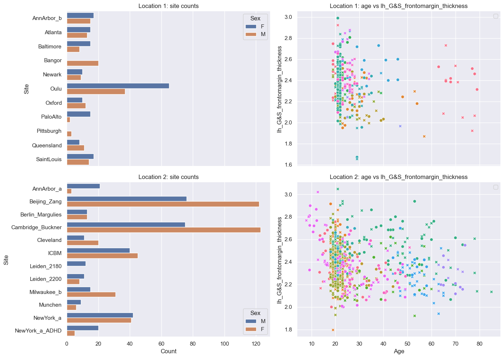
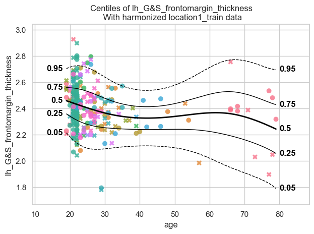
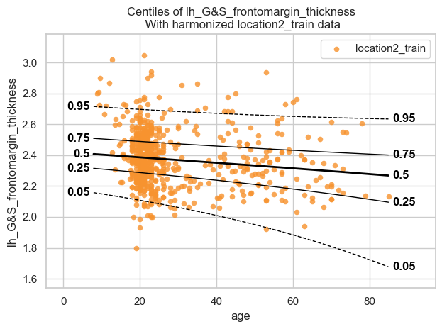
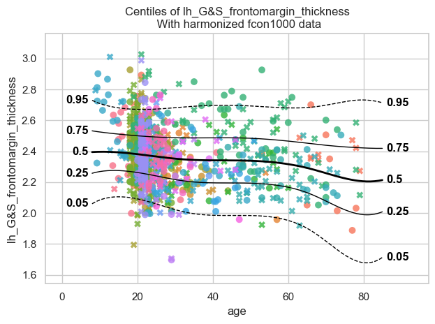

Merge normative model
=====================

.. container:: notebook-download

   :download:`Download Jupyter notebook <notebooks/10_merge.ipynb>`

Suppose two remote locations independently train a normative model on
their own patient population. These remote locations do not want to
share their data with you. They can however share their trained models
with you, and you can merge them into one bigger model that will have
indirectly learned from all datasets. This tutorial will demostrate how
to do this merge.

The models being merged do not even need to be of the same type. For
example, you can merge a Hierarchical Bayesian Regression (``HBR``)
model with a Bayesian Linear Regression (``BLR``) model. The resulting
model takes the type and configuration of the **first** model in the
list.

What we will do
---------------

1. *Load* the fcon1000 dataset and split it into two groups
2. *Train* a separate model on each subset (one HBR, one BLR)
3. *Visualize* the individually trained models
4. *Merge* the two models into one
5. *Visualize* the merged model predicting across the full dataset

Functions we will use
---------------------

+-----------------------------------+-----------------------------------+
| Function                          | Role                              |
+===================================+===================================+
| ``NormativeModel.fit_predict()``  | Fit a model on training data and  |
|                                   | predict on test data              |
+-----------------------------------+-----------------------------------+
| ``NormativeModel.merge()``        | Merge multiple independently      |
|                                   | trained models into one           |
+-----------------------------------+-----------------------------------+

Imports
-------

.. code:: ipython3

    from pcntoolkit import load_fcon1000, HBR, NormativeModel, BLR
    from pcntoolkit.util.plotter import plot_centiles_advanced
    import matplotlib.pyplot as plt
    import pcntoolkit
    import seaborn as sns
    
    import pandas as pd
    import logging
    import warnings
    
    
    # Suppress some annoying warnings and logs
    pymc_logger = logging.getLogger("pymc")
    pymc_logger.setLevel(logging.WARNING)
    pymc_logger.propagate = False
    
    warnings.simplefilter(
        action="ignore", category=FutureWarning
    )
    pd.options.mode.chained_assignment = None
    pcntoolkit.util.output.Output.set_show_messages(
        False
    )

Load and split the data
-----------------------

We use the
`fcon1000 <https://fcon_1000.projects.nitrc.org/fcpClassic/FcpTable.html>`__
dataset, which contains MRI-derived brain measures from 1,078 subjects
across 23 imaging sites.

We split the sites into two fixed subsets by assigning 11 sites to one
remote location and the remaining 12 sites to the other.

.. code:: ipython3

    # Load the FCON data
    data = load_fcon1000()
    # Drop all but the first response var
    data = data.sel({"response_vars": data.response_vars[:1]})
    
    # Use 11 sites for Location 1 and the rest 12 for Location 2
    all_sites = data.unique_batch_effects["site"]
    selected_sites = all_sites[1:5] + all_sites[16:23]
    
    # Split by those sites
    location1_data, location2_data = data.batch_effects_split(
        {"site": selected_sites}, names=("location1", "location2")
    )
    
    # Split into train and test sets
    location1_train, location1_test = location1_data.train_test_split((0.8, 0.2))
    location2_train, location2_test = location2_data.train_test_split((0.8, 0.2))

.. code:: ipython3

    feature = data.response_vars.values[0].item()
    datasets = {
        "Location 1": location1_data,
        "Location 2": location2_data,
    }
    
    fig, axes = plt.subplots(2, 2, figsize=(14, 10), sharex="col")
    
    for row, (name, dataset) in enumerate(datasets.items()):
        df = dataset.to_dataframe()
    
        sns.countplot(
            data=df,
            y=("batch_effects", "site"),
            hue=("batch_effects", "sex"),
            ax=axes[row, 0],
            orient="h",
        )
        axes[row, 0].set_title(f"{name}: site counts")
        axes[row, 0].set_xlabel("Count")
        axes[row, 0].set_ylabel("Site")
    
        sns.scatterplot(
            data=df,
            x=("X", "age"),
            y=("Y", feature),
            hue=("batch_effects", "site"),
            style=("batch_effects", "sex"),
            ax=axes[row, 1],
        )
        axes[row, 1].set_title(f"{name}: age vs {feature}")
        axes[row, 1].set_xlabel("Age")
        axes[row, 1].set_ylabel(feature)
    
    axes[0, 0].legend(title="Sex")
    axes[1, 0].legend(title="Sex")
    axes[0, 1].legend([], [])
    axes[1, 1].legend([], [])
    plt.tight_layout()
    plt.show()

--------------

Part 1: Train a model at each remote location
---------------------------------------------

Each remote location trains its own normative model independently,
without sharing any data. Crucially, the two model types are different:

- **Location 1** uses an ``HBR`` (PCNtoolkit defaults: Normal
  likelihood, B-spline basis for μ and σ, random intercept for μ).
- **Location 2** uses a ``BLR`` with a non-linear warp applied to the
  response variable, allowing it to capture non-Gaussian distributions.

Train the Location 1 model (HBR)
~~~~~~~~~~~~~~~~~~~~~~~~~~~~~~~~

.. code:: ipython3

    location1_model = NormativeModel(HBR(progressbar=False), save_dir="../out/models/location1_model")
    location1_model.fit_predict(location1_train, location1_test);
    

Train the Location 2 model (BLR)
~~~~~~~~~~~~~~~~~~~~~~~~~~~~~~~~

.. code:: ipython3

    location2_model = NormativeModel(BLR(heteroskedastic=True, warp_name="WarpSinhArcsinh"), save_dir="../out/models/location2_model")
    location2_model.fit_predict(location2_train, location2_test);

Visualize the individual models
-------------------------------

.. code:: ipython3

    plot_centiles_advanced(location1_model, 
                           scatter_data=location1_train, 
                           batch_effects="all",
                           show_legend=False
                           )

.. code:: text

    [<Figure size 640x480 with 1 Axes>]

.. code:: ipython3

    plot_centiles_advanced(location2_model, 
                           scatter_data=location2_train, 
                           batch_effects="all",
                           show_legend=False
                           )

.. code:: text

    [<Figure size 640x480 with 1 Axes>]

*Why are all dots in the BLR plot the same orange colour?*

*Answer:* In contrast to the HBR plot above, where each site has its own
colour due to site-specific random intercepts in μ, the BLR model does
not include explicit site-level random effects. After harmonization, all
subjects are therefore combined into a single pooled distribution, which
is why all dots in the BLR plot appear in the same orange colour.

--------------

Part 2: Merge the two models
----------------------------

The models are now trained and saved to disk. Each remote location
shares only the saved model JSON files with you, and not the raw patient
data.

To do the merge, you first need to load both models from disk and then
call ``NormativeModel.merge()``. Internally, this works by:

1. Generating **synthetic data** from each model’s learned distribution
2. Pooling the synthetic datasets together
3. Re-fitting a new model on the combined synthetic data

The result is a model that has *indirectly* learned from both remote
locations’ populations. Because the merged model takes the type of the
first model in the list, the merged model here will be an ``HBR``.

.. code:: ipython3

    # Load the model from disk (could also use the model that we just fitted, but this just shows that you can easily load and merge two models)
    fitted_location1_model = NormativeModel.load(location1_model.save_dir)
    fitted_location2_model = NormativeModel.load(location2_model.save_dir)

.. code:: ipython3

    # Merging is super duper easy
    
    # Merge Location 2 into Location 1 — result is a new HBR model (type of the first model in the list).
    merged_model = NormativeModel.merge("../out/models/merged_model", [fitted_location1_model, fitted_location2_model]);
    
    # If we would change the order of the models in the list, we would get a BLR model.

Visualize the merged model
--------------------------

.. code:: ipython3

    plot_centiles_advanced(merged_model, 
                           scatter_data=data, 
                           batch_effects="all",
                           show_legend=False)

.. code:: text

    [<Figure size 640x480 with 1 Axes>]

Conclusions
-----------

Group 2 contains more observations than group 1 in the 10-20 and 40-60
age ranges. So when we merge the two groups we expect a better fit in
those age ranges.
