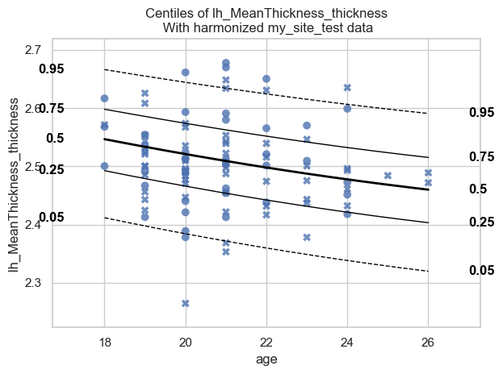

Transfer a pretrained model to your own data
============================================

.. container:: notebook-download

   :download:`Download Jupyter notebook <notebooks/12_transfer_pretrained.ipynb>`

The `PCN lab <https://predictiveclinicalneuroscience.com/>`__ shares a
collection of pretrained models on
`SURFdrive <https://surfdrive.surf.nl/s/Mb6mZyFmJeCaPcZ?dir=/zip>`__,
covering structural MRI, functional MRI and diffusion MRI. In this
tutorial we will show you how to transfer such a model to your own data.

If you prefer a graphical interface to writing code,
`PCNportal <https://pcnportal.dccn.nl/>`__ lets you transfer these
pretrained models through a web browser.

Imports
-------

Install requests manually as it is not install with
``pip install pcntoolkit``

.. code:: ipython3

    !pip install requests

.. code:: text

    Requirement already satisfied: requests in C:\Users\kontsi\AppData\Local\anaconda3\envs\.ptk-dev\Lib\site-packages (2.32.5)
    Requirement already satisfied: charset_normalizer<4,>=2 in C:\Users\kontsi\AppData\Local\anaconda3\envs\.ptk-dev\Lib\site-packages (from requests) (3.4.4)
    Requirement already satisfied: idna<4,>=2.5 in C:\Users\kontsi\AppData\Local\anaconda3\envs\.ptk-dev\Lib\site-packages (from requests) (3.11)
    Requirement already satisfied: urllib3<3,>=1.21.1 in C:\Users\kontsi\AppData\Local\anaconda3\envs\.ptk-dev\Lib\site-packages (from requests) (2.6.3)
    Requirement already satisfied: certifi>=2017.4.17 in C:\Users\kontsi\AppData\Local\anaconda3\envs\.ptk-dev\Lib\site-packages (from requests) (2026.1.4)
    

.. code:: ipython3

    import os
    import warnings
    import xml.etree.ElementTree as ET
    import zipfile
    from urllib.parse import unquote
    
    import matplotlib.pyplot as plt
    import pandas as pd
    import requests
    import seaborn as sns
    
    import pcntoolkit.util.output
    from pcntoolkit import NormativeModel, NormData, load_fcon1000, plot_centiles_advanced
    
    sns.set_style("darkgrid")
    
    warnings.simplefilter(action="ignore", category=FutureWarning)
    pd.options.mode.chained_assignment = None
    pcntoolkit.util.output.Output.set_show_messages(False)

1. See which pretrained models are available
--------------------------------------------

The pretrained models live on
`SURFdrive <https://surfdrive.surf.nl/s/Mb6mZyFmJeCaPcZ?dir=/zip>`__. We
first ask the server which ones are available.

.. code:: ipython3

    # SURFdrive location of the pretrained models
    BASE_URL = "https://surfdrive.surf.nl/public.php/webdav/zip/"
    SHARE_TOKEN = "Mb6mZyFmJeCaPcZ"
    PASSWORD = ""
    
    # Ask the server to list the contents of the remote directory
    response = requests.request(
        "PROPFIND", BASE_URL, auth=(SHARE_TOKEN, PASSWORD), headers={"Depth": "1"}
    )
    tree = ET.fromstring(response.content)
    
    zip_files = []
    for elem in tree.iter():
        if elem.tag.endswith("href"):
            name = unquote(elem.text.split("/")[-1])
            if name.lower().endswith(".zip"):
                zip_files.append(name)
    
    print("Available models:")
    print("\n".join(zip_files))

.. code:: text

    Available models:
    BLRw_sc_lifespan_67K_89sites.zip
    BLRw_fa_JHU_lifespan_24K_19sites.zip
    HBR_Sb_sc_lifespan_79K_100sites.zip
    HBR_Sb_ct_DES_lifespan_79K_100sites.zip
    HBR_Sb_ct_DK_lifespan_79K_100sites.zip
    BLRw_sa_DK_lifespan_46K_59sites.zip
    BLRw_sa_DES_lifespan_37K_66sites.zip
    BLRw_fc_yeo17_lifespan_21K_40sites.zip
    HBR_Sb_sa_DES_lifespan_37K_66sites.zip
    HBR_Sb_sa_DK_lifespan_46K_59sites.zip
    BLRw_ct_DES_lifespan_67K_89sites.zip
    

The file names tell you what each model contains:

+-----------------------------------+-------------------------------------------------------------+
| Part of the name                  | Meaning                                                     |
+===================================+=============================================================+
| ``BLRw``                          | Bayesian Linear Regression with a warp (`Fraza et al.,      |
|                                   | 2021 <https://doi.org/10.1016/j.neuroimage.2021.118715>`__) |
+-----------------------------------+-------------------------------------------------------------+
| ``HBR_Sb``                        | Hierarchical Bayesian Regression with a SHASH likelihood    |
|                                   | (`de Boer et al.,                                           |
|                                   | 2024 <https://doi.org/10.1162/imag_a_00110>`__)             |
+-----------------------------------+-------------------------------------------------------------+
| ``ct`` / ``sa`` / ``sc``          | cortical thickness / surface area / subcortical volumes     |
|                                   | (sMRI)                                                      |
+-----------------------------------+-------------------------------------------------------------+
| ``fa``                            | fractional anisotropy (dMRI)                                |
+-----------------------------------+-------------------------------------------------------------+
| ``fc``                            | functional connectivity (fMRI)                              |
+-----------------------------------+-------------------------------------------------------------+
| ``vox``                           | voxelwise normative models                                  |
+-----------------------------------+-------------------------------------------------------------+
| ``DK`` / ``DES``                  | Desikan-Killiany / Destrieux parcellation                   |
+-----------------------------------+-------------------------------------------------------------+
| ``67K``, ``79K``, …               | number of subjects the model was trained on                 |
+-----------------------------------+-------------------------------------------------------------+
| ``89sites``, ``100sites``, …      | number of sites the model was trained on                    |
+-----------------------------------+-------------------------------------------------------------+

All our pretrained models are estimated on healthy subject only.

Note that HBR models are much larger than BLR models, because they store
the full MCMC samples rather than a set of coefficients. Size also grows
with the number of response variables, so voxelwise models are large
even as BLR.

2. Pick the model that matches our data
---------------------------------------

The model has to match the data we want to transfer it to. A decisive
factor is the modality: a model trained on cortical thickness cannot say
anything about diffusion measures.

The data we will select for this tutorial is the FCON1000 dataset, which
contains structural MRI parcellated with the Destrieux atlas. For this
reason, we decide to use the pretrained model
``BLRw_ct_DES_lifespan_67K_89sites``: cortical thickness, Destrieux
parcellation, trained on 67.000 subjects from 89 sites.

   Exercise: Can you select any other pretrained model to do the
   transfer? If yes, run the analysis again and

.. code:: ipython3

    MODEL_NAME = "BLRw_ct_DES_lifespan_67K_89sites"
    
    data_dir = os.path.abspath("resources/pretrained")
    os.makedirs(data_dir, exist_ok=True)
    
    zip_path = os.path.join(data_dir, MODEL_NAME + ".zip")
    model_dir = os.path.join(data_dir, MODEL_NAME)
    
    # Download the model, unless we already have it
    if not os.path.exists(zip_path):
        print(f"Downloading {MODEL_NAME} ...")
        resp = requests.get(
            BASE_URL + MODEL_NAME + ".zip", auth=(SHARE_TOKEN, PASSWORD), stream=True
        )
        resp.raise_for_status()
        with open(zip_path, "wb") as f:
            for chunk in resp.iter_content(chunk_size=8192):
                f.write(chunk)
    
    # Unzip it, unless we already did
    if not os.path.exists(model_dir):
        with zipfile.ZipFile(zip_path, "r") as z:
            z.extractall(model_dir)
    
    print(f"Model available at {model_dir}")

.. code:: text

    Model available at c:\Users\kontsi\Documents\GitHub\PCNtoolkit-local\examples\resources\pretrained\BLRw_ct_DES_lifespan_67K_89sites
    

3. Load the model and see what it expects
-----------------------------------------

A pretrained model carries its own configuration: the covariates it was
trained with and the brain measures it can predict. Our data should
match these.

Loading may print a warning that the model was saved with an older
PCNtoolkit version. That is expected: PCNtoolkit updates the old model
file to the current format while loading it, so you can keep using
models published earlier.

.. code:: ipython3

    model = NormativeModel.load(model_dir)
    
    covariates = model.covariates
    batch_effects = list(model.unique_batch_effects.keys())
    
    print(f"Covariates    : {covariates}")
    print(f"Batch effects : {batch_effects}")
    for be in batch_effects:
        levels = model.unique_batch_effects[be]
        print(f"  {be}: {len(levels)} levels, e.g. {list(levels)[:3]}")
    print(f"Response vars : {len(model.response_vars)}")

.. code:: text

    C:\Users\kontsi\Documents\GitHub\PCNtoolkit-local\pcntoolkit\util\output.py:295: UserWarning: Process: 5004 - 2026-08-03 21:38:32 - This model was saved with PCNtoolkit v1.1.1, but you are running v1.2.0.post1. Loading this model in v1.2.0.post1...
      warnings.warn(message, category)
    C:\Users\kontsi\Documents\GitHub\PCNtoolkit-local\pcntoolkit\util\output.py:295: UserWarning: Process: 5004 - 2026-08-03 21:38:32 - This model was saved with PCNtoolkit v1.1.2, but you are running v1.2.0.post1. Loading this model in v1.2.0.post1...
      warnings.warn(message, category)
    C:\Users\kontsi\Documents\GitHub\PCNtoolkit-local\pcntoolkit\util\output.py:295: UserWarning: Process: 5004 - 2026-08-03 21:38:33 - This model was saved with PCNtoolkit v1.1.2, but you are running v1.2.0.post1. Loading this model in v1.2.0.post1...
      warnings.warn(message, category)
    

.. code:: text

    Covariates    : ['age']
    Batch effects : ['site', 'sex']
      site: 89 levels, e.g. ['ABCD_01', 'ABCD_02', 'ABCD_03']
      sex: 2 levels, e.g. ['F', 'M']
    Response vars : 150
    

.. code:: text

    C:\Users\kontsi\Documents\GitHub\PCNtoolkit-local\pcntoolkit\util\output.py:295: UserWarning: Process: 5004 - 2026-08-03 21:38:33 - This model was saved with PCNtoolkit v1.1.1, but you are running v1.2.0.post1. Loading this model in v1.2.0.post1...
      warnings.warn(message, category)
    

4. Prepare our own data
-----------------------

Matching the modality was the first step; two more things need to line
up.

a. **The brain measures must have the same names.** Only measures
   present in both the model and our data can be transferred. Some
   response variables may also have failed to fit during the original
   training, so we skip those as well.

b. **The batch effects must use the same encoding.** The BLR lifespan
   models code sex as ``F``/``M``, whereas FCON1000 codes it as
   ``0``/``1``. Without this recoding the transfer does not recognise
   the sex groups.

.. code:: ipython3

    # Load FCON1000 as a dataframe
    fcon = load_fcon1000().to_dataframe()
    fcon.columns = [c[1] if isinstance(c, tuple) else c for c in fcon.columns]
    
    # The lifespan BLR models expect sex coded as F/M
    if set(fcon["sex"].unique()) <= {0, 1}: # note that load_fcon1000() already converts sex to M/F, so this check is not strictly necessary
        fcon["sex"] = fcon["sex"].map({0: "F", 1: "M"})
    
    fcon["sub_id"] = fcon.index.astype(str)
    
    # Keep response variables that the model knows AND that were fitted successfully
    shared = [v for v in model.response_vars if v in fcon.columns]
    response_vars = [v for v in shared if model[v].is_fitted]
    
    print(f"Shared with the pretrained model : {len(shared)}")
    print(f"Of which successfully fitted     : {len(response_vars)}")
    print(f"Skipped (not fitted)             : {sorted(set(shared) - set(response_vars))}")

.. code:: text

    Shared with the pretrained model : 150
    Of which successfully fitted     : 150
    Skipped (not fitted)             : []
    

For this tutorial we transfer only one response variable to keep the
output readable and fast. You can skip the next cell to transfer all of
the response variables.

.. code:: ipython3

    response_vars = [
        "lh_MeanThickness_thickness",
    ]

Also for this tutorial we pick a single site from the FCON1000 dataset.
The pretrained model has never seen this site, which is exactly why we
need to perform the transfer.

Transfer can handle any number of sites at once, learning a separate
offset for each. Add more names to the ``sites`` list below to transfer
to several sites together.

.. code:: ipython3

    print(f"FCON1000 contains {fcon['site'].nunique()} sites:")
    print()
    print(fcon["site"].value_counts().to_string())

.. code:: text

    FCON1000 contains 23 sites:
    
    site
    Beijing_Zang         198
    Cambridge_Buckner    198
    Oulu                 102
    ICBM                  85
    NewYork_a             83
    Milwaukee_b           46
    AnnArbor_b            32
    Cleveland             31
    SaintLouis            31
    Atlanta               28
    Berlin_Margulies      26
    NewYork_a_ADHD        25
    AnnArbor_a            24
    Baltimore             23
    Oxford                22
    Bangor                20
    Leiden_2200           19
    Newark                19
    Queensland            19
    PaloAlto              17
    Munchen               15
    Leiden_2180           12
    Pittsburgh             3
    

.. code:: ipython3

    sites = ["Beijing_Zang"]
    my_data = fcon[fcon["site"].isin(sites)]
    
    print(f"Selected {len(sites)} site(s): {len(my_data)} subjects")
    print(f"Age range: {my_data['age'].min():.1f} - {my_data['age'].max():.1f}")
    print(my_data["sex"].value_counts().to_string())

.. code:: text

    Selected 1 site(s): 198 subjects
    Age range: 18.0 - 26.0
    sex
    F    122
    M     76
    

We wrap the dataframe in a ``NormData`` object and split it in two:

The **adaptation set** is used to learn how our new site differs from
the sites the reference model was trained on (aka “site correction”).

The **test set** is what we actually compute deviation scores for.

The adaptation set needs enough subjects to estimate the site offset
reliably; we recommend 20–100 healthy controls per new site. The test
set can be any size, down to a single patient.

.. code:: ipython3

    norm_data = NormData.from_dataframe(
        name="my_site",
        dataframe=my_data,
        covariates=covariates,
        batch_effects=batch_effects,
        response_vars=response_vars,
        subject_ids="sub_id",
        remove_Nan=True,
    )
    
    # Half to adapt the model to our site, half to compute deviation scores for
    adapt, test = norm_data.train_test_split(splits=[0.5, 0.5])
    
    print(f"Adaptation set: {adapt.X.shape[0]} subjects")
    print(f"Test set      : {test.X.shape[0]} subjects")

.. code:: text

    Adaptation set: 99 subjects
    Test set      : 99 subjects
    

5. Transfer
-----------

Everything is in place, so the transfer itself is a single call. It
adapts the pretrained model to our site and returns predictions for the
test set.

.. code:: ipython3

    transferred_model = model.transfer_predict(
        adapt, test, save_dir=os.path.abspath("resources/transferred_model")
    )

6. Plot
-------

The transferred model is an ordinary PCNtoolkit model, so we can plot
centiles for it just like any other.

Note that the centiles only span in the age range of the site that we
selected to transfer to and not the the age range of the reference
model.

.. code:: ipython3

    plot_centiles_advanced(
        transferred_model,
        scatter_data=test,
        batch_effects="all",
        show_legend=False,
    );

