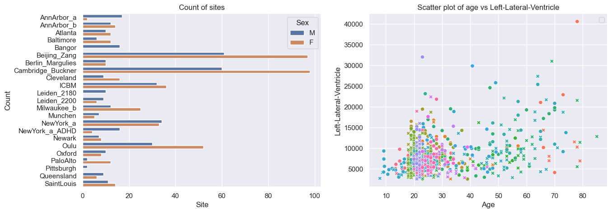
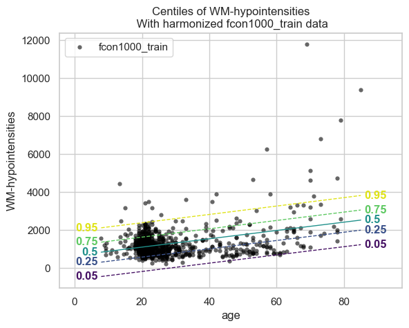
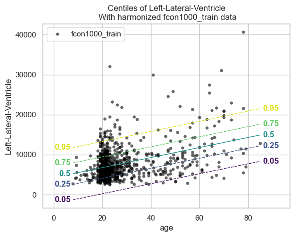
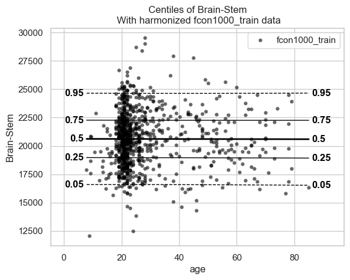
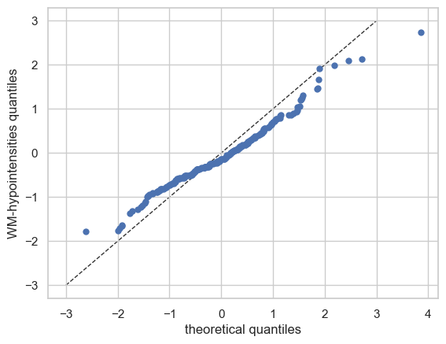
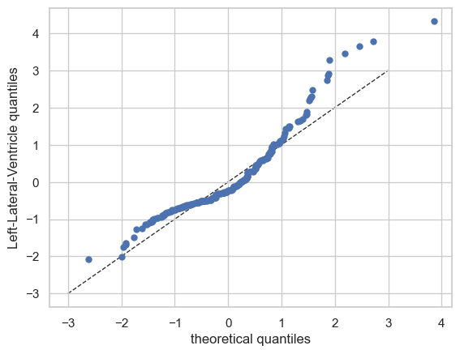
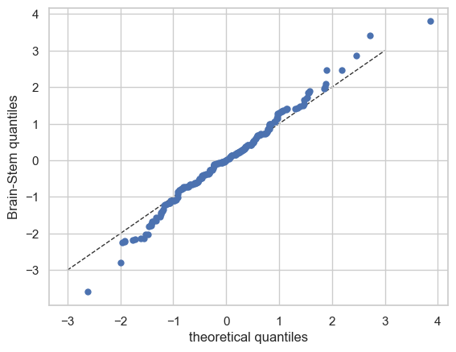

Getting started with normative modelling
========================================

Welcome to this tutorial notebook that will show you the very basics of
normative modeling. It’s like the “Hello World” of normative modeling.

Let’s jump right in.

Imports
~~~~~~~

.. code:: ipython3

    import warnings
    import pandas as pd
    import matplotlib.pyplot as plt
    from pcntoolkit import (
        BLR,
        NormativeModel,
        NormData,
        load_fcon1000,
        plot_centiles,
        plot_qq,
    )
    import pcntoolkit.util.output
    import seaborn as sns
    
    sns.set_style("darkgrid")
    warnings.simplefilter(action="ignore", category=FutureWarning)
    pd.options.mode.chained_assignment = None  # default='warn'
    pcntoolkit.util.output.Output.set_show_messages(False)

Load data
---------

First we download a small example dataset from github.

.. code:: ipython3

    # Download an example dataset
    norm_data: NormData = load_fcon1000()
    # Select only these three features to model for this example
    norm_data = norm_data.sel({"response_vars": ["WM-hypointensities", "Left-Lateral-Ventricle", "Brain-Stem"]})
    # Train-test split
    train, test = norm_data.train_test_split()

.. code:: ipython3

    # Inspect the data
    df = train.to_dataframe()
    fig, ax = plt.subplots(1, 2, figsize=(15, 5))
    
    sns.countplot(data=df, y=("batch_effects", "site"), hue=("batch_effects", "sex"), ax=ax[0], orient="h")
    ax[0].legend(title="Sex")
    ax[0].set_title("Count of sites")
    ax[0].set_xlabel("Site")
    ax[0].set_ylabel("Count")
    
    scatter_feature = "Left-Lateral-Ventricle"
    
    sns.scatterplot(
        data=df,
        x=("X", "age"),
        y=("Y", scatter_feature),
        hue=("batch_effects", "site"),
        style=("batch_effects", "sex"),
        ax=ax[1],
    )
    ax[1].legend([], [])
    ax[1].set_title(f"Scatter plot of age vs {scatter_feature}")
    ax[1].set_xlabel("Age")
    ax[1].set_ylabel(scatter_feature)
    
    plt.show()

Creating a Normative model
--------------------------

.. code:: ipython3

    save_dir = "/Users/stijndeboer/Projects/PCN/PCNtoolkit/examples/saves"
    model = NormativeModel(BLR(), inscaler="standardize", outscaler="standardize")

.. code:: ipython3

    model.has_batch_effect

.. parsed-literal::

    False

Fit the model
-------------

With all that configured, we can fit the model.

The ``fit_predict`` function will fit the model, evaluate it, save the
results and plots, and return the test data with all the predictions
added.

After that, it will compute Z-scores and centiles for the test set.

All results can be found in the save directory.

.. code:: ipython3

    model.fit_predict(train, test)

.. parsed-literal::

    /opt/anaconda3/envs/uv_refactor/lib/python3.12/site-packages/pcntoolkit/util/output.py:218: UserWarning: Process: 28129 - 2025-06-24 12:17:24 - remove_Nan is set to False. Ensure your data does not contain NaNs in critical columns, or handle them appropriately.
      warnings.warn(message)
    /opt/anaconda3/envs/uv_refactor/lib/python3.12/site-packages/pcntoolkit/util/output.py:218: UserWarning: Process: 28129 - 2025-06-24 12:17:27 - remove_Nan is set to False. Ensure your data does not contain NaNs in critical columns, or handle them appropriately.
      warnings.warn(message)

.. raw:: html

    
<svg style="position: absolute; width: 0; height: 0; overflow: hidden">
    <defs>
    <symbol id="icon-database" viewBox="0 0 32 32">
    <path d="M16 0c-8.837 0-16 2.239-16 5v4c0 2.761 7.163 5 16 5s16-2.239 16-5v-4c0-2.761-7.163-5-16-5z"></path>
    <path d="M16 17c-8.837 0-16-2.239-16-5v6c0 2.761 7.163 5 16 5s16-2.239 16-5v-6c0 2.761-7.163 5-16 5z"></path>
    <path d="M16 26c-8.837 0-16-2.239-16-5v6c0 2.761 7.163 5 16 5s16-2.239 16-5v-6c0 2.761-7.163 5-16 5z"></path>
    </symbol>
    <symbol id="icon-file-text2" viewBox="0 0 32 32">
    <path d="M28.681 7.159c-0.694-0.947-1.662-2.053-2.724-3.116s-2.169-2.030-3.116-2.724c-1.612-1.182-2.393-1.319-2.841-1.319h-15.5c-1.378 0-2.5 1.121-2.5 2.5v27c0 1.378 1.122 2.5 2.5 2.5h23c1.378 0 2.5-1.122 2.5-2.5v-19.5c0-0.448-0.137-1.23-1.319-2.841zM24.543 5.457c0.959 0.959 1.712 1.825 2.268 2.543h-4.811v-4.811c0.718 0.556 1.584 1.309 2.543 2.268zM28 29.5c0 0.271-0.229 0.5-0.5 0.5h-23c-0.271 0-0.5-0.229-0.5-0.5v-27c0-0.271 0.229-0.5 0.5-0.5 0 0 15.499-0 15.5 0v7c0 0.552 0.448 1 1 1h7v19.5z"></path>
    <path d="M23 26h-14c-0.552 0-1-0.448-1-1s0.448-1 1-1h14c0.552 0 1 0.448 1 1s-0.448 1-1 1z"></path>
    <path d="M23 22h-14c-0.552 0-1-0.448-1-1s0.448-1 1-1h14c0.552 0 1 0.448 1 1s-0.448 1-1 1z"></path>
    <path d="M23 18h-14c-0.552 0-1-0.448-1-1s0.448-1 1-1h14c0.552 0 1 0.448 1 1s-0.448 1-1 1z"></path>
    </symbol>
    </defs>
    </svg>
    <pre class='xr-text-repr-fallback'>&lt;xarray.NormData&gt; Size: 87kB
    Dimensions:            (observations: 216, response_vars: 3, covariates: 1,
                            batch_effect_dims: 2, centile: 5, statistic: 10)
    Coordinates:
      * observations       (observations) int64 2kB 756 769 692 616 ... 751 470 1043
      * response_vars      (response_vars) &lt;U22 264B &#x27;WM-hypointensities&#x27; ... &#x27;Br...
      * covariates         (covariates) &lt;U3 12B &#x27;age&#x27;
      * batch_effect_dims  (batch_effect_dims) &lt;U4 32B &#x27;sex&#x27; &#x27;site&#x27;
      * centile            (centile) float64 40B 0.05 0.25 0.5 0.75 0.95
      * statistic          (statistic) &lt;U8 320B &#x27;MACE&#x27; &#x27;MAPE&#x27; ... &#x27;SMSE&#x27; &#x27;ShapiroW&#x27;
    Data variables:
        subjects           (observations) object 2kB &#x27;Munchen_sub96752&#x27; ... &#x27;Quee...
        Y                  (observations, response_vars) float64 5kB 2.721e+03 .....
        X                  (observations, covariates) float64 2kB 63.0 ... 23.0
        batch_effects      (observations, batch_effect_dims) &lt;U17 29kB &#x27;F&#x27; ... &#x27;Q...
        Z                  (observations, response_vars) float64 5kB 0.8677 ... -...
        centiles           (centile, observations, response_vars) float64 26kB 75...
        logp               (observations, response_vars) float64 5kB -1.254 ... -...
        Yhat               (observations, response_vars) float64 5kB 2.035e+03 .....
        statistics         (response_vars, statistic) float64 240B 0.06074 ... 0....
        Y_harmonized       (observations, response_vars) float64 5kB 2.721e+03 .....
    Attributes:
        real_ids:                       True
        is_scaled:                      False
        name:                           fcon1000_test
        unique_batch_effects:           {&#x27;sex&#x27;: [&#x27;F&#x27;, &#x27;M&#x27;], &#x27;site&#x27;: [&#x27;AnnArbor_a&#x27;...
        batch_effect_counts:            {&#x27;sex&#x27;: {&#x27;F&#x27;: 589, &#x27;M&#x27;: 489}, &#x27;site&#x27;: {&#x27;A...
        batch_effect_covariate_ranges:  {&#x27;sex&#x27;: {&#x27;F&#x27;: {&#x27;age&#x27;: {&#x27;min&#x27;: 7.88, &#x27;max&#x27;...
        covariate_ranges:               {&#x27;age&#x27;: {&#x27;min&#x27;: 7.88, &#x27;max&#x27;: 85.0}}</pre>

xarray.NormData

<ul class='xr-sections'><li class='xr-section-item'><input id='section-049f3a9e-2560-4f3d-8da5-cd3f7e09fa12' class='xr-section-summary-in' type='checkbox' disabled ><label for='section-049f3a9e-2560-4f3d-8da5-cd3f7e09fa12' class='xr-section-summary'  title='Expand/collapse section'>Dimensions:</label>
<ul class='xr-dim-list'><li>observations: 216</li><li>response_vars: 3</li><li>covariates: 1</li><li>batch_effect_dims: 2</li><li>centile: 5</li><li>statistic: 10</li></ul>

</li><li class='xr-section-item'><input id='section-b664c672-ef2b-4c8a-91f4-5a2d39f765bb' class='xr-section-summary-in' type='checkbox'  checked><label for='section-b664c672-ef2b-4c8a-91f4-5a2d39f765bb' class='xr-section-summary' >Coordinates: (6)</label>

<ul class='xr-var-list'><li class='xr-var-item'>
observations

(observations)

int64

756 769 692 616 ... 751 470 1043
<input id='attrs-8bea3b97-c0a8-4344-8bea-da01c4b63f02' class='xr-var-attrs-in' type='checkbox' disabled><label for='attrs-8bea3b97-c0a8-4344-8bea-da01c4b63f02' title='Show/Hide attributes'><svg class='icon xr-icon-file-text2'><use xlink:href='#icon-file-text2'></use></svg></label><input id='data-bd498935-efd8-450a-97e5-276e0c755455' class='xr-var-data-in' type='checkbox'><label for='data-bd498935-efd8-450a-97e5-276e0c755455' title='Show/Hide data repr'><svg class='icon xr-icon-database'><use xlink:href='#icon-database'></use></svg></label>
<dl class='xr-attrs'></dl>

<pre>array([ 756,  769,  692, ...,  751,  470, 1043])</pre>
</li><li class='xr-var-item'>
response_vars

(response_vars)

&lt;U22

&#x27;WM-hypointensities&#x27; ... &#x27;Brain-...
<input id='attrs-dd8b467a-5cde-4b4f-bbc1-51657f5fdff2' class='xr-var-attrs-in' type='checkbox' disabled><label for='attrs-dd8b467a-5cde-4b4f-bbc1-51657f5fdff2' title='Show/Hide attributes'><svg class='icon xr-icon-file-text2'><use xlink:href='#icon-file-text2'></use></svg></label><input id='data-8d1c2767-43ba-430f-b77b-40a64cbf34a2' class='xr-var-data-in' type='checkbox'><label for='data-8d1c2767-43ba-430f-b77b-40a64cbf34a2' title='Show/Hide data repr'><svg class='icon xr-icon-database'><use xlink:href='#icon-database'></use></svg></label>
<dl class='xr-attrs'></dl>

<pre>array([&#x27;WM-hypointensities&#x27;, &#x27;Left-Lateral-Ventricle&#x27;, &#x27;Brain-Stem&#x27;],
          dtype=&#x27;&lt;U22&#x27;)</pre>
</li><li class='xr-var-item'>
covariates

(covariates)

&lt;U3

&#x27;age&#x27;
<input id='attrs-696f5f12-2819-4f31-92d2-c540c5b228d7' class='xr-var-attrs-in' type='checkbox' disabled><label for='attrs-696f5f12-2819-4f31-92d2-c540c5b228d7' title='Show/Hide attributes'><svg class='icon xr-icon-file-text2'><use xlink:href='#icon-file-text2'></use></svg></label><input id='data-df81ecdb-cd2b-4e91-b98c-f88bbddde67c' class='xr-var-data-in' type='checkbox'><label for='data-df81ecdb-cd2b-4e91-b98c-f88bbddde67c' title='Show/Hide data repr'><svg class='icon xr-icon-database'><use xlink:href='#icon-database'></use></svg></label>
<dl class='xr-attrs'></dl>

<pre>array([&#x27;age&#x27;], dtype=&#x27;&lt;U3&#x27;)</pre>
</li><li class='xr-var-item'>
batch_effect_dims

(batch_effect_dims)

&lt;U4

&#x27;sex&#x27; &#x27;site&#x27;
<input id='attrs-0df2ed9d-a6b8-44ee-b102-eaca2484bdf4' class='xr-var-attrs-in' type='checkbox' disabled><label for='attrs-0df2ed9d-a6b8-44ee-b102-eaca2484bdf4' title='Show/Hide attributes'><svg class='icon xr-icon-file-text2'><use xlink:href='#icon-file-text2'></use></svg></label><input id='data-1e496d41-d367-4a49-92ac-db14e8ec9de9' class='xr-var-data-in' type='checkbox'><label for='data-1e496d41-d367-4a49-92ac-db14e8ec9de9' title='Show/Hide data repr'><svg class='icon xr-icon-database'><use xlink:href='#icon-database'></use></svg></label>
<dl class='xr-attrs'></dl>

<pre>array([&#x27;sex&#x27;, &#x27;site&#x27;], dtype=&#x27;&lt;U4&#x27;)</pre>
</li><li class='xr-var-item'>
centile

(centile)

float64

0.05 0.25 0.5 0.75 0.95
<input id='attrs-c6c45a4d-9715-442a-b0e8-20b0917a6c90' class='xr-var-attrs-in' type='checkbox' disabled><label for='attrs-c6c45a4d-9715-442a-b0e8-20b0917a6c90' title='Show/Hide attributes'><svg class='icon xr-icon-file-text2'><use xlink:href='#icon-file-text2'></use></svg></label><input id='data-696686f6-7ee9-44db-ae16-1a8607880f30' class='xr-var-data-in' type='checkbox'><label for='data-696686f6-7ee9-44db-ae16-1a8607880f30' title='Show/Hide data repr'><svg class='icon xr-icon-database'><use xlink:href='#icon-database'></use></svg></label>
<dl class='xr-attrs'></dl>

<pre>array([0.05, 0.25, 0.5 , 0.75, 0.95])</pre>
</li><li class='xr-var-item'>
statistic

(statistic)

&lt;U8

&#x27;MACE&#x27; &#x27;MAPE&#x27; ... &#x27;SMSE&#x27; &#x27;ShapiroW&#x27;
<input id='attrs-6a70412a-87ac-4c1f-aa4a-d64068f894e0' class='xr-var-attrs-in' type='checkbox' disabled><label for='attrs-6a70412a-87ac-4c1f-aa4a-d64068f894e0' title='Show/Hide attributes'><svg class='icon xr-icon-file-text2'><use xlink:href='#icon-file-text2'></use></svg></label><input id='data-7fa3ad8d-62ce-4308-8d48-875292c5e496' class='xr-var-data-in' type='checkbox'><label for='data-7fa3ad8d-62ce-4308-8d48-875292c5e496' title='Show/Hide data repr'><svg class='icon xr-icon-database'><use xlink:href='#icon-database'></use></svg></label>
<dl class='xr-attrs'></dl>

<pre>array([&#x27;MACE&#x27;, &#x27;MAPE&#x27;, &#x27;MSLL&#x27;, &#x27;NLL&#x27;, &#x27;R2&#x27;, &#x27;RMSE&#x27;, &#x27;Rho&#x27;, &#x27;Rho_p&#x27;, &#x27;SMSE&#x27;,
           &#x27;ShapiroW&#x27;], dtype=&#x27;&lt;U8&#x27;)</pre>
</li></ul>
</li><li class='xr-section-item'><input id='section-23ed4e7e-d74b-43ca-8257-532626a803be' class='xr-section-summary-in' type='checkbox'  checked><label for='section-23ed4e7e-d74b-43ca-8257-532626a803be' class='xr-section-summary' >Data variables: (10)</label>

<ul class='xr-var-list'><li class='xr-var-item'>
subjects

(observations)

object

&#x27;Munchen_sub96752&#x27; ... &#x27;Queensla...
<input id='attrs-0a3958b3-6080-4523-bb5b-bc78c67784fe' class='xr-var-attrs-in' type='checkbox' disabled><label for='attrs-0a3958b3-6080-4523-bb5b-bc78c67784fe' title='Show/Hide attributes'><svg class='icon xr-icon-file-text2'><use xlink:href='#icon-file-text2'></use></svg></label><input id='data-6728f9b9-b714-4528-a181-ba4c8edd4bc0' class='xr-var-data-in' type='checkbox'><label for='data-6728f9b9-b714-4528-a181-ba4c8edd4bc0' title='Show/Hide data repr'><svg class='icon xr-icon-database'><use xlink:href='#icon-database'></use></svg></label>
<dl class='xr-attrs'></dl>

<pre>array([&#x27;Munchen_sub96752&#x27;, &#x27;NewYork_a_sub18638&#x27;, &#x27;Leiden_2200_sub87320&#x27;,
           &#x27;ICBM_sub47658&#x27;, &#x27;AnnArbor_b_sub45569&#x27;, &#x27;Beijing_Zang_sub18960&#x27;,
           &#x27;Leiden_2200_sub18456&#x27;, &#x27;Berlin_Margulies_sub27711&#x27;,
           &#x27;Beijing_Zang_sub87776&#x27;, &#x27;Milwaukee_b_sub63196&#x27;,
           &#x27;Beijing_Zang_sub07144&#x27;, &#x27;Atlanta_sub76280&#x27;,
           &#x27;Beijing_Zang_sub40037&#x27;, &#x27;Cambridge_Buckner_sub17737&#x27;,
           &#x27;ICBM_sub89049&#x27;, &#x27;ICBM_sub55656&#x27;, &#x27;Oulu_sub45566&#x27;,
           &#x27;Beijing_Zang_sub89088&#x27;, &#x27;Atlanta_sub16563&#x27;,
           &#x27;Cambridge_Buckner_sub51172&#x27;, &#x27;Oulu_sub98739&#x27;,
           &#x27;Queensland_sub49845&#x27;, &#x27;Cambridge_Buckner_sub84256&#x27;,
           &#x27;Cleveland_sub80263&#x27;, &#x27;ICBM_sub16607&#x27;, &#x27;Newark_sub46570&#x27;,
           &#x27;NewYork_a_sub88286&#x27;, &#x27;Cambridge_Buckner_sub02591&#x27;,
           &#x27;Oulu_sub66467&#x27;, &#x27;Beijing_Zang_sub74386&#x27;, &#x27;Newark_sub55760&#x27;,
           &#x27;ICBM_sub30623&#x27;, &#x27;Oulu_sub68752&#x27;, &#x27;Leiden_2180_sub19281&#x27;,
           &#x27;Beijing_Zang_sub50972&#x27;, &#x27;Beijing_Zang_sub85030&#x27;,
           &#x27;Milwaukee_b_sub36386&#x27;, &#x27;Baltimore_sub31837&#x27;, &#x27;PaloAlto_sub84978&#x27;,
           &#x27;Oulu_sub01077&#x27;, &#x27;NewYork_a_ADHD_sub54828&#x27;, &#x27;PaloAlto_sub96705&#x27;,
           &#x27;Cambridge_Buckner_sub40635&#x27;, &#x27;ICBM_sub66794&#x27;,
           &#x27;Beijing_Zang_sub46541&#x27;, &#x27;Beijing_Zang_sub87089&#x27;,
           &#x27;Pittsburgh_sub97823&#x27;, &#x27;Beijing_Zang_sub98617&#x27;, &#x27;ICBM_sub92028&#x27;,
    ...
           &#x27;Leiden_2200_sub04484&#x27;, &#x27;Beijing_Zang_sub80163&#x27;, &#x27;ICBM_sub02382&#x27;,
           &#x27;Cambridge_Buckner_sub77435&#x27;, &#x27;NewYork_a_sub54887&#x27;,
           &#x27;Oulu_sub85532&#x27;, &#x27;Baltimore_sub73823&#x27;, &#x27;Beijing_Zang_sub29590&#x27;,
           &#x27;Oulu_sub99718&#x27;, &#x27;Beijing_Zang_sub08455&#x27;, &#x27;Beijing_Zang_sub85543&#x27;,
           &#x27;Cambridge_Buckner_sub45354&#x27;, &#x27;Beijing_Zang_sub07717&#x27;,
           &#x27;Baltimore_sub76160&#x27;, &#x27;Beijing_Zang_sub17093&#x27;,
           &#x27;AnnArbor_b_sub90127&#x27;, &#x27;SaintLouis_sub73002&#x27;,
           &#x27;Queensland_sub93238&#x27;, &#x27;Cleveland_sub34189&#x27;,
           &#x27;Cambridge_Buckner_sub89107&#x27;, &#x27;Atlanta_sub75153&#x27;,
           &#x27;NewYork_a_ADHD_sub73035&#x27;, &#x27;Cambridge_Buckner_sub59434&#x27;,
           &#x27;Milwaukee_b_sub44912&#x27;, &#x27;Cleveland_sub46739&#x27;, &#x27;Oulu_sub20495&#x27;,
           &#x27;SaintLouis_sub28304&#x27;, &#x27;Cambridge_Buckner_sub35430&#x27;,
           &#x27;Oulu_sub86362&#x27;, &#x27;Newark_sub58526&#x27;, &#x27;Leiden_2180_sub12255&#x27;,
           &#x27;ICBM_sub48210&#x27;, &#x27;Cambridge_Buckner_sub77989&#x27;,
           &#x27;Berlin_Margulies_sub75506&#x27;, &#x27;NewYork_a_sub29216&#x27;,
           &#x27;Beijing_Zang_sub05267&#x27;, &#x27;AnnArbor_b_sub18546&#x27;, &#x27;Oulu_sub75620&#x27;,
           &#x27;AnnArbor_b_sub30250&#x27;, &#x27;Berlin_Margulies_sub86111&#x27;,
           &#x27;Beijing_Zang_sub89592&#x27;, &#x27;Beijing_Zang_sub68012&#x27;,
           &#x27;NewYork_a_sub50559&#x27;, &#x27;Munchen_sub66933&#x27;,
           &#x27;Cambridge_Buckner_sub59729&#x27;, &#x27;Queensland_sub86245&#x27;], dtype=object)</pre>
</li><li class='xr-var-item'>
Y

(observations, response_vars)

float64

2.721e+03 1.362e+04 ... 1.681e+04
<input id='attrs-7ebb5a53-2fe0-4866-be27-bfeba56c35c3' class='xr-var-attrs-in' type='checkbox' disabled><label for='attrs-7ebb5a53-2fe0-4866-be27-bfeba56c35c3' title='Show/Hide attributes'><svg class='icon xr-icon-file-text2'><use xlink:href='#icon-file-text2'></use></svg></label><input id='data-3c4682d6-1960-4f2b-aa72-21a3e436e60c' class='xr-var-data-in' type='checkbox'><label for='data-3c4682d6-1960-4f2b-aa72-21a3e436e60c' title='Show/Hide data repr'><svg class='icon xr-icon-database'><use xlink:href='#icon-database'></use></svg></label>
<dl class='xr-attrs'></dl>

<pre>array([[ 2721.4, 13617.8, 22653.2],
           [ 1143.1, 10922.3, 20821.3],
           [  955.8,  8374.3, 19278.9],
           [ 1473.9, 16068.7, 25724. ],
           [  757.8,  4107.1, 16570.4],
           [  871.1,  5962.5, 23831.3],
           [ 1207.3, 19877.6, 23995.9],
           [  595. ,  5568.6, 21180.8],
           [  682.4,  6953.8, 15396.4],
           [  445.1,  6771.1, 20429.1],
           [ 1620. ,  3980.3, 21843.1],
           [  602.8,  6051.4, 19098.4],
           [ 1432.5,  5916.8, 22060.2],
           [ 1908.2,  4656.4, 22974.4],
           [ 1834. ,  3691.9, 26658.4],
           [  459.6,  5823.6, 21087. ],
           [ 1210. ,  6667.1, 23873.9],
           [  845.9,  7648.6, 20948.3],
           [  995.2,  6850.1, 20345.2],
           [ 1734.7,  4457. , 18642.8],
    ...
           [  785.8,  6197.9, 20216. ],
           [ 2240.1,  4806.6, 27596.4],
           [  758.1,  5615.1, 24054.6],
           [ 1440.5,  7500.1, 13773.6],
           [  818.6,  9928.8, 21445.7],
           [ 3769.9, 19406.4, 23748.4],
           [  880.2,  7366.4, 21144.5],
           [  823.9, 11342.3, 25405.8],
           [ 2113.9,  8920.5, 22618.7],
           [  741.9, 11228.2, 20471.4],
           [ 1333.9,  9730.4, 22427.1],
           [  707.3,  6458.2, 21449.5],
           [ 1134.1,  6038.2, 15343. ],
           [  438.6,  7505.7, 15679.7],
           [  966.3, 10570. , 19890.2],
           [  424.3,  4887. , 21624.5],
           [  604.7,  8933.9, 18852.1],
           [ 2343.2, 19039.7, 18791.2],
           [ 2721.7,  4899.1, 23784.8],
           [  703.5, 10060.7, 16805.6]])</pre>
</li><li class='xr-var-item'>
X

(observations, covariates)

float64

63.0 23.27 22.0 ... 72.0 23.0 23.0
<input id='attrs-33ef2336-1d50-4161-9827-753bb340d7b1' class='xr-var-attrs-in' type='checkbox' disabled><label for='attrs-33ef2336-1d50-4161-9827-753bb340d7b1' title='Show/Hide attributes'><svg class='icon xr-icon-file-text2'><use xlink:href='#icon-file-text2'></use></svg></label><input id='data-ae274e12-902c-4b9a-a780-f665cb571f4d' class='xr-var-data-in' type='checkbox'><label for='data-ae274e12-902c-4b9a-a780-f665cb571f4d' title='Show/Hide data repr'><svg class='icon xr-icon-database'><use xlink:href='#icon-database'></use></svg></label>
<dl class='xr-attrs'></dl>

<pre>array([[63.  ],
           [23.27],
           [22.  ],
           [42.  ],
           [63.  ],
           [23.  ],
           [21.  ],
           [26.  ],
           [21.  ],
           [49.  ],
           [20.  ],
           [23.  ],
           [20.  ],
           [26.  ],
           [35.  ],
           [21.  ],
           [22.  ],
           [19.  ],
           [34.  ],
           [18.  ],
    ...
           [21.  ],
           [20.  ],
           [22.  ],
           [25.  ],
           [25.  ],
           [73.  ],
           [22.  ],
           [28.  ],
           [29.06],
           [19.  ],
           [20.  ],
           [22.  ],
           [19.  ],
           [24.  ],
           [21.  ],
           [24.  ],
           [22.79],
           [72.  ],
           [23.  ],
           [23.  ]])</pre>
</li><li class='xr-var-item'>
batch_effects

(observations, batch_effect_dims)

&lt;U17

&#x27;F&#x27; &#x27;Munchen&#x27; ... &#x27;M&#x27; &#x27;Queensland&#x27;
<input id='attrs-e9296fc2-6ce0-4cdb-b0ce-0da7af6034a3' class='xr-var-attrs-in' type='checkbox' disabled><label for='attrs-e9296fc2-6ce0-4cdb-b0ce-0da7af6034a3' title='Show/Hide attributes'><svg class='icon xr-icon-file-text2'><use xlink:href='#icon-file-text2'></use></svg></label><input id='data-782364f2-0fb4-414a-b99f-6b70be4eaaa9' class='xr-var-data-in' type='checkbox'><label for='data-782364f2-0fb4-414a-b99f-6b70be4eaaa9' title='Show/Hide data repr'><svg class='icon xr-icon-database'><use xlink:href='#icon-database'></use></svg></label>
<dl class='xr-attrs'></dl>

<pre>array([[&#x27;F&#x27;, &#x27;Munchen&#x27;],
           [&#x27;M&#x27;, &#x27;NewYork_a&#x27;],
           [&#x27;F&#x27;, &#x27;Leiden_2200&#x27;],
           [&#x27;M&#x27;, &#x27;ICBM&#x27;],
           [&#x27;F&#x27;, &#x27;AnnArbor_b&#x27;],
           [&#x27;M&#x27;, &#x27;Beijing_Zang&#x27;],
           [&#x27;M&#x27;, &#x27;Leiden_2200&#x27;],
           [&#x27;F&#x27;, &#x27;Berlin_Margulies&#x27;],
           [&#x27;F&#x27;, &#x27;Beijing_Zang&#x27;],
           [&#x27;F&#x27;, &#x27;Milwaukee_b&#x27;],
           [&#x27;M&#x27;, &#x27;Beijing_Zang&#x27;],
           [&#x27;F&#x27;, &#x27;Atlanta&#x27;],
           [&#x27;F&#x27;, &#x27;Beijing_Zang&#x27;],
           [&#x27;F&#x27;, &#x27;Cambridge_Buckner&#x27;],
           [&#x27;M&#x27;, &#x27;ICBM&#x27;],
           [&#x27;F&#x27;, &#x27;ICBM&#x27;],
           [&#x27;M&#x27;, &#x27;Oulu&#x27;],
           [&#x27;F&#x27;, &#x27;Beijing_Zang&#x27;],
           [&#x27;M&#x27;, &#x27;Atlanta&#x27;],
           [&#x27;F&#x27;, &#x27;Cambridge_Buckner&#x27;],
    ...
           [&#x27;F&#x27;, &#x27;SaintLouis&#x27;],
           [&#x27;M&#x27;, &#x27;Cambridge_Buckner&#x27;],
           [&#x27;F&#x27;, &#x27;Oulu&#x27;],
           [&#x27;F&#x27;, &#x27;Newark&#x27;],
           [&#x27;M&#x27;, &#x27;Leiden_2180&#x27;],
           [&#x27;M&#x27;, &#x27;ICBM&#x27;],
           [&#x27;F&#x27;, &#x27;Cambridge_Buckner&#x27;],
           [&#x27;M&#x27;, &#x27;Berlin_Margulies&#x27;],
           [&#x27;M&#x27;, &#x27;NewYork_a&#x27;],
           [&#x27;F&#x27;, &#x27;Beijing_Zang&#x27;],
           [&#x27;M&#x27;, &#x27;AnnArbor_b&#x27;],
           [&#x27;F&#x27;, &#x27;Oulu&#x27;],
           [&#x27;F&#x27;, &#x27;AnnArbor_b&#x27;],
           [&#x27;F&#x27;, &#x27;Berlin_Margulies&#x27;],
           [&#x27;M&#x27;, &#x27;Beijing_Zang&#x27;],
           [&#x27;F&#x27;, &#x27;Beijing_Zang&#x27;],
           [&#x27;M&#x27;, &#x27;NewYork_a&#x27;],
           [&#x27;M&#x27;, &#x27;Munchen&#x27;],
           [&#x27;M&#x27;, &#x27;Cambridge_Buckner&#x27;],
           [&#x27;M&#x27;, &#x27;Queensland&#x27;]], dtype=&#x27;&lt;U17&#x27;)</pre>
</li><li class='xr-var-item'>
Z

(observations, response_vars)

float64

0.8677 0.37 ... 0.7407 -1.556
<input id='attrs-7022b237-149e-4077-aa84-b7aba9204535' class='xr-var-attrs-in' type='checkbox' disabled><label for='attrs-7022b237-149e-4077-aa84-b7aba9204535' title='Show/Hide attributes'><svg class='icon xr-icon-file-text2'><use xlink:href='#icon-file-text2'></use></svg></label><input id='data-36ea0917-ff41-489e-9568-2fbb1197a2d9' class='xr-var-data-in' type='checkbox'><label for='data-36ea0917-ff41-489e-9568-2fbb1197a2d9' title='Show/Hide data repr'><svg class='icon xr-icon-database'><use xlink:href='#icon-database'></use></svg></label>
<dl class='xr-attrs'></dl>

<pre>array([[ 8.67743764e-01,  3.69994589e-01,  8.36230230e-01],
           [-3.50813559e-02,  9.48779338e-01,  8.49796328e-02],
           [-2.39320767e-01,  3.48248001e-01, -5.45568390e-01],
           [-1.37216181e-01,  1.65016846e+00,  2.09034300e+00],
           [-1.63812226e+00, -2.01242138e+00, -1.64068267e+00],
           [-3.75898970e-01, -2.89717863e-01,  1.31514342e+00],
           [ 1.10881907e-01,  3.27181190e+00,  1.38202308e+00],
           [-8.13845040e-01, -4.83562919e-01,  2.32312370e-01],
           [-5.61398512e-01,  2.27008016e-02, -2.13235941e+00],
           [-1.64952586e+00, -9.06646501e-01, -7.15747205e-02],
           [ 6.67503027e-01, -6.93229835e-01,  5.02065610e-01],
           [-7.19558960e-01, -2.67366165e-01, -6.19217712e-01],
           [ 4.27368916e-01, -2.06407465e-01,  5.90784142e-01],
           [ 8.68326512e-01, -7.12929387e-01,  9.65418623e-01],
           [ 5.20484374e-01, -1.23963356e+00,  2.47216401e+00],
           [-8.46755870e-01, -2.61437405e-01,  1.93234523e-01],
           [ 8.62669472e-02, -8.09693890e-02,  1.33236381e+00],
           [-2.95806907e-01,  2.60527648e-01,  1.36253653e-01],
           [-5.25802913e-01, -4.14051701e-01, -1.08081854e-01],
           [ 8.70449973e-01, -5.10156554e-01, -8.05935526e-01],
    ...
           [-4.28966057e-01, -1.67336422e-01, -1.62719562e-01],
           [ 1.46167456e+00, -4.85503873e-01,  2.85316802e+00],
           [-4.92541424e-01, -3.45459018e-01,  1.40621416e+00],
           [ 2.97291980e-01,  3.36926012e-02, -2.79535879e+00],
           [-4.99330087e-01,  6.44361916e-01,  3.40438284e-01],
           [ 1.92127769e+00,  1.50155742e+00,  1.28043450e+00],
           [-3.36151731e-01,  9.48458177e-02,  2.16884345e-01],
           [-5.76802054e-01,  9.05022065e-01,  1.95953138e+00],
           [ 1.04590983e+00,  2.62576877e-01,  8.20477932e-01],
           [-4.28993922e-01,  1.16036389e+00, -5.86221045e-02],
           [ 3.01090392e-01,  7.52304535e-01,  7.40718871e-01],
           [-5.57607733e-01, -1.33490191e-01,  3.41534905e-01],
           [ 7.32748003e-02, -1.44293084e-01, -2.15424139e+00],
           [-9.57987268e-01,  6.66921208e-02, -2.01637734e+00],
           [-1.97785612e-01,  9.31832445e-01, -2.95865188e-01],
           [-9.76304399e-01, -5.91734835e-01,  4.13366988e-01],
           [-7.11223629e-01,  4.63997751e-01, -7.19906474e-01],
           [ 1.33027769e-01,  1.44172052e+00, -7.33485950e-01],
           [ 1.99449678e+00, -5.57083386e-01,  1.29613862e+00],
           [-5.90574387e-01,  7.40672758e-01, -1.55629713e+00]])</pre>
</li><li class='xr-var-item'>
centiles

(centile, observations, response_vars)

float64

752.5 5.574e+03 ... 2.464e+04
<input id='attrs-a14c8b95-122a-4bda-ab8c-034da0631a2e' class='xr-var-attrs-in' type='checkbox' disabled><label for='attrs-a14c8b95-122a-4bda-ab8c-034da0631a2e' title='Show/Hide attributes'><svg class='icon xr-icon-file-text2'><use xlink:href='#icon-file-text2'></use></svg></label><input id='data-9f6c2d57-2d9a-4ad3-81bd-b6c5e9a473c5' class='xr-var-data-in' type='checkbox'><label for='data-9f6c2d57-2d9a-4ad3-81bd-b6c5e9a473c5' title='Show/Hide data repr'><svg class='icon xr-icon-database'><use xlink:href='#icon-database'></use></svg></label>
<dl class='xr-attrs'></dl>

<pre>array([[[  752.52529342,  5574.44520308, 16560.15697909],
            [ -113.65995317,   606.66513533, 16588.86586825],
            [ -141.55852416,   446.79478122, 16589.12469537],
            ...,
            [  946.97947991,  6690.81467295, 16548.13316538],
            [ -119.59005375,   572.68251192, 16588.92431485],
            [ -119.59005375,   572.68251192, 16588.92431485]],
    
           [[ 1512.90373683,  9448.17667366, 18943.17552595],
            [  643.90960011,  4466.0853281 , 18963.08382776],
            [  616.04530122,  4306.38959015, 18963.45003338],
            ...,
            [ 1709.03366396, 10573.08402915, 18936.40201157],
            [  637.98614171,  4432.1365465 , 18963.16308505],
            [  637.98614171,  4432.1365465 , 18963.16308505]],
    
           [[ 2041.43481537, 12140.76677775, 20599.58671653],
            [ 1170.48824859,  7148.72781313, 20613.37782239],
            [ 1142.64777188,  6989.15344904, 20613.81866569],
            ...,
            [ 2238.72953223, 13271.60872796, 20596.46263013],
            [ 1164.56940708,  7114.80255462, 20613.47154498],
            [ 1164.56940708,  7114.80255462, 20613.47154498]],
    
           [[ 2569.96589391, 14833.35688184, 22255.9979071 ],
            [ 1697.06689707,  9831.37029815, 22263.67181702],
            [ 1669.25024253,  9671.91730793, 22264.187298  ],
            ...,
            [ 2768.4254005 , 15970.13342677, 22256.52324868],
            [ 1691.15267246,  9797.46856274, 22263.78000491],
            [ 1691.15267246,  9797.46856274, 22263.78000491]],
    
           [[ 3330.34433732, 18707.08835242, 24639.01645397],
            [ 2454.63645036, 13690.79049092, 24637.88977653],
            [ 2426.85406792, 13531.51211686, 24638.51263602],
            ...,
            [ 3530.47958456, 19852.40278296, 24644.79209487],
            [ 2448.72886792, 13656.92259732, 24638.01877511],
            [ 2448.72886792, 13656.92259732, 24638.01877511]]])</pre>
</li><li class='xr-var-item'>
logp

(observations, response_vars)

float64

-1.254 -0.9281 ... -1.13 -2.132
<input id='attrs-7642bfcc-f172-4ec7-a216-5e1861498c33' class='xr-var-attrs-in' type='checkbox' disabled><label for='attrs-7642bfcc-f172-4ec7-a216-5e1861498c33' title='Show/Hide attributes'><svg class='icon xr-icon-file-text2'><use xlink:href='#icon-file-text2'></use></svg></label><input id='data-f85c2ccf-d5c0-4090-ac76-eb9dc119b673' class='xr-var-data-in' type='checkbox'><label for='data-f85c2ccf-d5c0-4090-ac76-eb9dc119b673' title='Show/Hide data repr'><svg class='icon xr-icon-database'><use xlink:href='#icon-database'></use></svg></label>
<dl class='xr-attrs'></dl>

<pre>array([[ -1.25404745,  -0.92807626,  -1.27414303],
           [ -0.87447228,  -1.30601809,  -0.92441342],
           [ -0.90253938,  -0.91661055,  -1.06967031],
           [ -0.88378331,  -2.21796723,  -3.10608167],
           [ -2.21928011,  -2.88454817,  -2.27042235],
           [ -0.94451571,  -0.89790396,  -1.78561252],
           [ -0.88009233,  -6.20839153,  -1.87588453],
           [ -1.20496594,  -0.97278065,  -0.94772432],
           [ -1.03152907,  -0.85627265,  -3.19436895],
           [ -2.23559435,  -1.26820068,  -0.92463341],
           [ -1.09677413,  -1.09634785,  -1.04697461],
           [ -1.13274824,  -0.89167808,  -1.1125267 ],
           [ -0.96531608,  -0.87736607,  -1.09545263],
           [ -1.25078953,  -1.10999826,  -1.38675636],
           [ -1.00937129,  -1.62433503,  -3.97666246],
           [ -1.23244268,  -0.89018975,  -0.93956042],
           [ -0.87762316,  -0.85925024,  -1.80844454],
           [ -0.9178002 ,  -0.89005673,  -0.93027754],
           [ -1.01211455,  -0.94166965,  -0.92666676],
           [ -1.25295256,  -0.98631091,  -1.24582267],
    ...
           [ -0.96595087,  -0.87001573,  -0.93412946],
           [ -1.94224024,  -0.97392106,  -4.99122355],
           [ -0.99520069,  -0.91564318,  -1.90956701],
           [ -0.9180029 ,  -0.85644928,  -4.82777277],
           [ -0.99847691,  -1.06348283,  -0.97870649],
           [ -2.72568832,  -1.98944236,  -1.74673461],
           [ -0.93040116,  -0.86047008,  -0.94436729],
           [ -1.04012811,  -1.26538031,  -2.84060515],
           [ -1.42074309,  -0.89032275,  -1.25731716],
           [ -0.96606723,  -1.52934159,  -0.92271329],
           [ -0.9193217 ,  -1.13904511,  -1.1952719 ],
           [ -1.02936536,  -0.86488203,  -0.97917092],
           [ -0.87673394,  -0.86652965,  -3.24137299],
           [ -1.33270532,  -0.85812949,  -2.95367005],
           [ -0.8935045 ,  -1.29017084,  -0.96465873],
           [ -1.35042066,  -1.03098062,  -1.00621738],
           [ -1.12679236,  -0.96358984,  -1.17995122],
           [ -0.88860743,  -1.90110891,  -1.19570414],
           [ -2.86287439,  -1.01110669,  -1.76079908],
           [ -1.04825475,  -1.13023381,  -2.1318418 ]])</pre>
</li><li class='xr-var-item'>
Yhat

(observations, response_vars)

float64

2.035e+03 1.213e+04 ... 2.059e+04
<input id='attrs-d4f0b80a-9bbf-4bc3-ab05-b7e43bdf78b7' class='xr-var-attrs-in' type='checkbox' disabled><label for='attrs-d4f0b80a-9bbf-4bc3-ab05-b7e43bdf78b7' title='Show/Hide attributes'><svg class='icon xr-icon-file-text2'><use xlink:href='#icon-file-text2'></use></svg></label><input id='data-eb095a26-b659-4cf9-abe3-6dc936f4440c' class='xr-var-data-in' type='checkbox'><label for='data-eb095a26-b659-4cf9-abe3-6dc936f4440c' title='Show/Hide data repr'><svg class='icon xr-icon-database'><use xlink:href='#icon-database'></use></svg></label>
<dl class='xr-attrs'></dl>

<pre>array([[ 2034.66669519, 12130.18415415, 20623.3586267 ],
           [ 1175.2199961 ,  7088.83901782, 20612.27552265],
           [ 1149.76707206,  6965.07384571, 20620.77657341],
           [ 1594.26099031,  9491.56034513, 20556.93539204],
           [ 2031.97080495, 12085.18094531, 20613.64205289],
           [ 1164.41492732,  7013.69431148, 20593.58400249],
           [ 1122.90592809,  6826.63136272, 20601.09878008],
           [ 1233.84114301,  7474.69124034, 20593.35915303],
           [ 1112.2317694 ,  6847.31527052, 20654.94540008],
           [ 1724.96227304, 10391.86231525, 20588.96025867],
           [ 1087.29948311,  6749.33788137, 20617.79885709],
           [ 1152.09415359,  7142.38536718, 20627.80495793],
           [ 1102.55693647,  6739.13218795, 20618.83092555],
           [ 1235.76586828,  7515.90191298, 20583.5553199 ],
           [ 1422.58927666,  8672.30007851, 20553.88802056],
           [ 1122.95131663,  6820.05310615, 20614.85647525],
           [ 1145.25150611,  7008.0571368 , 20621.81195399],
           [ 1084.7314365 ,  6573.65065874, 20632.56403283],
           [ 1404.54604118,  8487.33936271, 20591.21716804],
           [ 1049.79554466,  6513.39974014, 20637.73100376],
    ...
           [ 1127.21365039,  6904.56946862, 20594.52441823],
           [ 1100.30825716,  6725.09978594, 20613.35507224],
           [ 1140.35933588,  7030.98806301, 20590.97144334],
           [ 1203.94186198,  7411.634717  , 20625.17612201],
           [ 1190.87769487,  7321.85734448, 20630.89690503],
           [ 2268.02688265, 13433.73518585, 20606.19709447],
           [ 1146.41212974,  6913.02691758, 20593.18847892],
           [ 1276.3605517 ,  7604.40279355, 20606.24810255],
           [ 1294.81673459,  7850.9810558 , 20545.29062448],
           [ 1080.39880711,  6631.94913287, 20617.28044404],
           [ 1104.28872979,  6748.56762859, 20652.03871357],
           [ 1147.40306878,  7027.02747221, 20625.13627326],
           [ 1067.50340598,  6545.46138814, 20593.17891422],
           [ 1189.01969829,  7291.89006175, 20611.13795796],
           [ 1112.5446186 ,  6840.49758581, 20623.11955528],
           [ 1201.64707636,  7223.68543111, 20588.62566569],
           [ 1164.32647329,  7112.68688054, 20620.67483051],
           [ 2238.56814449, 13321.34592758, 20589.71143575],
           [ 1163.41911592,  7138.76227035, 20630.89629619],
           [ 1169.50128365,  7086.62736208, 20594.68204685]])</pre>
</li><li class='xr-var-item'>
statistics

(response_vars, statistic)

float64

0.06074 1.934 ... 1.001 0.9891
<input id='attrs-dab9e186-5be8-4e79-928b-ff0554eaa831' class='xr-var-attrs-in' type='checkbox' disabled><label for='attrs-dab9e186-5be8-4e79-928b-ff0554eaa831' title='Show/Hide attributes'><svg class='icon xr-icon-file-text2'><use xlink:href='#icon-file-text2'></use></svg></label><input id='data-e9d45fb0-2fdf-40f0-8206-ddced7198f51' class='xr-var-data-in' type='checkbox'><label for='data-e9d45fb0-2fdf-40f0-8206-ddced7198f51' title='Show/Hide data repr'><svg class='icon xr-icon-database'><use xlink:href='#icon-database'></use></svg></label>
<dl class='xr-attrs'></dl>

<pre>array([[ 6.07407407e-02,  1.93375533e+00, -1.15268756e-02,
             1.13079592e+00,  1.42735046e-01,  6.86139983e-01,
            -3.09952765e-02,  6.50547812e-01,  8.57264954e-01,
             9.72422766e-01],
           [ 4.62962963e-02,  1.37067581e+00,  9.24184166e-02,
             1.40450344e+00,  1.72356721e-01,  9.83533872e-01,
             2.16116593e-01,  1.39505226e-03,  8.27643279e-01,
             8.98362194e-01],
           [ 1.42592593e-02,  9.95250069e-01, -9.75079181e-03,
             1.52597582e+00, -6.92034044e-04,  1.10255740e+00,
            -2.47895307e-02,  7.17148882e-01,  1.00069203e+00,
             9.89058383e-01]])</pre>
</li><li class='xr-var-item'>
Y_harmonized

(observations, response_vars)

float64

2.721e+03 1.362e+04 ... 1.681e+04
<input id='attrs-3c7d7612-461a-4dc6-9421-350a4cb0a138' class='xr-var-attrs-in' type='checkbox' disabled><label for='attrs-3c7d7612-461a-4dc6-9421-350a4cb0a138' title='Show/Hide attributes'><svg class='icon xr-icon-file-text2'><use xlink:href='#icon-file-text2'></use></svg></label><input id='data-eeacdca5-d00c-4289-8e8d-7d821e0995ae' class='xr-var-data-in' type='checkbox'><label for='data-eeacdca5-d00c-4289-8e8d-7d821e0995ae' title='Show/Hide data repr'><svg class='icon xr-icon-database'><use xlink:href='#icon-database'></use></svg></label>
<dl class='xr-attrs'></dl>

<pre>array([[ 2721.4, 13617.8, 22653.2],
           [ 1143.1, 10922.3, 20821.3],
           [  955.8,  8374.3, 19278.9],
           [ 1473.9, 16068.7, 25724. ],
           [  757.8,  4107.1, 16570.4],
           [  871.1,  5962.5, 23831.3],
           [ 1207.3, 19877.6, 23995.9],
           [  595. ,  5568.6, 21180.8],
           [  682.4,  6953.8, 15396.4],
           [  445.1,  6771.1, 20429.1],
           [ 1620. ,  3980.3, 21843.1],
           [  602.8,  6051.4, 19098.4],
           [ 1432.5,  5916.8, 22060.2],
           [ 1908.2,  4656.4, 22974.4],
           [ 1834. ,  3691.9, 26658.4],
           [  459.6,  5823.6, 21087. ],
           [ 1210. ,  6667.1, 23873.9],
           [  845.9,  7648.6, 20948.3],
           [  995.2,  6850.1, 20345.2],
           [ 1734.7,  4457. , 18642.8],
    ...
           [  785.8,  6197.9, 20216. ],
           [ 2240.1,  4806.6, 27596.4],
           [  758.1,  5615.1, 24054.6],
           [ 1440.5,  7500.1, 13773.6],
           [  818.6,  9928.8, 21445.7],
           [ 3769.9, 19406.4, 23748.4],
           [  880.2,  7366.4, 21144.5],
           [  823.9, 11342.3, 25405.8],
           [ 2113.9,  8920.5, 22618.7],
           [  741.9, 11228.2, 20471.4],
           [ 1333.9,  9730.4, 22427.1],
           [  707.3,  6458.2, 21449.5],
           [ 1134.1,  6038.2, 15343. ],
           [  438.6,  7505.7, 15679.7],
           [  966.3, 10570. , 19890.2],
           [  424.3,  4887. , 21624.5],
           [  604.7,  8933.9, 18852.1],
           [ 2343.2, 19039.7, 18791.2],
           [ 2721.7,  4899.1, 23784.8],
           [  703.5, 10060.7, 16805.6]])</pre>
</li></ul>
</li><li class='xr-section-item'><input id='section-78c7465c-d759-471d-94f0-4e59f8901a68' class='xr-section-summary-in' type='checkbox'  ><label for='section-78c7465c-d759-471d-94f0-4e59f8901a68' class='xr-section-summary' >Indexes: (6)</label>

<ul class='xr-var-list'><li class='xr-var-item'>

observations

PandasIndex
<input type='checkbox' disabled/><label></label><input id='index-4827d358-87f4-4373-8b28-38346a503998' class='xr-index-data-in' type='checkbox'/><label for='index-4827d358-87f4-4373-8b28-38346a503998' title='Show/Hide index repr'><svg class='icon xr-icon-database'><use xlink:href='#icon-database'></use></svg></label>
<pre>PandasIndex(Index([ 756,  769,  692,  616,   35,  164,  680,  331,  299,  727,
           ...
             27,  959,   29,  346,  304,  264,  798,  751,  470, 1043],
          dtype=&#x27;int64&#x27;, name=&#x27;observations&#x27;, length=216))</pre>
</li><li class='xr-var-item'>

response_vars

PandasIndex
<input type='checkbox' disabled/><label></label><input id='index-02a236f0-a373-4c1c-99cd-30fb6f45968c' class='xr-index-data-in' type='checkbox'/><label for='index-02a236f0-a373-4c1c-99cd-30fb6f45968c' title='Show/Hide index repr'><svg class='icon xr-icon-database'><use xlink:href='#icon-database'></use></svg></label>
<pre>PandasIndex(Index([&#x27;WM-hypointensities&#x27;, &#x27;Left-Lateral-Ventricle&#x27;, &#x27;Brain-Stem&#x27;], dtype=&#x27;object&#x27;, name=&#x27;response_vars&#x27;))</pre>
</li><li class='xr-var-item'>

covariates

PandasIndex
<input type='checkbox' disabled/><label></label><input id='index-5129c18e-533b-46eb-95d4-9a5463863a83' class='xr-index-data-in' type='checkbox'/><label for='index-5129c18e-533b-46eb-95d4-9a5463863a83' title='Show/Hide index repr'><svg class='icon xr-icon-database'><use xlink:href='#icon-database'></use></svg></label>
<pre>PandasIndex(Index([&#x27;age&#x27;], dtype=&#x27;object&#x27;, name=&#x27;covariates&#x27;))</pre>
</li><li class='xr-var-item'>

batch_effect_dims

PandasIndex
<input type='checkbox' disabled/><label></label><input id='index-b76e6e38-0781-4d67-8cc0-cc67ecf59913' class='xr-index-data-in' type='checkbox'/><label for='index-b76e6e38-0781-4d67-8cc0-cc67ecf59913' title='Show/Hide index repr'><svg class='icon xr-icon-database'><use xlink:href='#icon-database'></use></svg></label>
<pre>PandasIndex(Index([&#x27;sex&#x27;, &#x27;site&#x27;], dtype=&#x27;object&#x27;, name=&#x27;batch_effect_dims&#x27;))</pre>
</li><li class='xr-var-item'>

centile

PandasIndex
<input type='checkbox' disabled/><label></label><input id='index-4e2ba203-aa43-4979-a7b3-d23e29d54075' class='xr-index-data-in' type='checkbox'/><label for='index-4e2ba203-aa43-4979-a7b3-d23e29d54075' title='Show/Hide index repr'><svg class='icon xr-icon-database'><use xlink:href='#icon-database'></use></svg></label>
<pre>PandasIndex(Index([0.05, 0.25, 0.5, 0.75, 0.95], dtype=&#x27;float64&#x27;, name=&#x27;centile&#x27;))</pre>
</li><li class='xr-var-item'>

statistic

PandasIndex
<input type='checkbox' disabled/><label></label><input id='index-fbaba824-4287-4ba8-995f-272ca9947b77' class='xr-index-data-in' type='checkbox'/><label for='index-fbaba824-4287-4ba8-995f-272ca9947b77' title='Show/Hide index repr'><svg class='icon xr-icon-database'><use xlink:href='#icon-database'></use></svg></label>
<pre>PandasIndex(Index([&#x27;MACE&#x27;, &#x27;MAPE&#x27;, &#x27;MSLL&#x27;, &#x27;NLL&#x27;, &#x27;R2&#x27;, &#x27;RMSE&#x27;, &#x27;Rho&#x27;, &#x27;Rho_p&#x27;, &#x27;SMSE&#x27;,
           &#x27;ShapiroW&#x27;],
          dtype=&#x27;object&#x27;, name=&#x27;statistic&#x27;))</pre>
</li></ul>
</li><li class='xr-section-item'><input id='section-2a758263-a668-4984-a3df-1b9e48d5dfb2' class='xr-section-summary-in' type='checkbox'  checked><label for='section-2a758263-a668-4984-a3df-1b9e48d5dfb2' class='xr-section-summary' >Attributes: (7)</label>

<dl class='xr-attrs'><dt>real_ids :</dt><dd>True</dd><dt>is_scaled :</dt><dd>False</dd><dt>name :</dt><dd>fcon1000_test</dd><dt>unique_batch_effects :</dt><dd>{&#x27;sex&#x27;: [&#x27;F&#x27;, &#x27;M&#x27;], &#x27;site&#x27;: [&#x27;AnnArbor_a&#x27;, &#x27;AnnArbor_b&#x27;, &#x27;Atlanta&#x27;, &#x27;Baltimore&#x27;, &#x27;Bangor&#x27;, &#x27;Beijing_Zang&#x27;, &#x27;Berlin_Margulies&#x27;, &#x27;Cambridge_Buckner&#x27;, &#x27;Cleveland&#x27;, &#x27;ICBM&#x27;, &#x27;Leiden_2180&#x27;, &#x27;Leiden_2200&#x27;, &#x27;Milwaukee_b&#x27;, &#x27;Munchen&#x27;, &#x27;NewYork_a&#x27;, &#x27;NewYork_a_ADHD&#x27;, &#x27;Newark&#x27;, &#x27;Oulu&#x27;, &#x27;Oxford&#x27;, &#x27;PaloAlto&#x27;, &#x27;Pittsburgh&#x27;, &#x27;Queensland&#x27;, &#x27;SaintLouis&#x27;]}</dd><dt>batch_effect_counts :</dt><dd>{&#x27;sex&#x27;: {&#x27;F&#x27;: 589, &#x27;M&#x27;: 489}, &#x27;site&#x27;: {&#x27;AnnArbor_a&#x27;: 24, &#x27;AnnArbor_b&#x27;: 32, &#x27;Atlanta&#x27;: 28, &#x27;Baltimore&#x27;: 23, &#x27;Bangor&#x27;: 20, &#x27;Beijing_Zang&#x27;: 198, &#x27;Berlin_Margulies&#x27;: 26, &#x27;Cambridge_Buckner&#x27;: 198, &#x27;Cleveland&#x27;: 31, &#x27;ICBM&#x27;: 85, &#x27;Leiden_2180&#x27;: 12, &#x27;Leiden_2200&#x27;: 19, &#x27;Milwaukee_b&#x27;: 46, &#x27;Munchen&#x27;: 15, &#x27;NewYork_a&#x27;: 83, &#x27;NewYork_a_ADHD&#x27;: 25, &#x27;Newark&#x27;: 19, &#x27;Oulu&#x27;: 102, &#x27;Oxford&#x27;: 22, &#x27;PaloAlto&#x27;: 17, &#x27;Pittsburgh&#x27;: 3, &#x27;Queensland&#x27;: 19, &#x27;SaintLouis&#x27;: 31}}</dd><dt>batch_effect_covariate_ranges :</dt><dd>{&#x27;sex&#x27;: {&#x27;F&#x27;: {&#x27;age&#x27;: {&#x27;min&#x27;: 7.88, &#x27;max&#x27;: 85.0}}, &#x27;M&#x27;: {&#x27;age&#x27;: {&#x27;min&#x27;: 9.21, &#x27;max&#x27;: 78.0}}}, &#x27;site&#x27;: {&#x27;AnnArbor_a&#x27;: {&#x27;age&#x27;: {&#x27;min&#x27;: 13.41, &#x27;max&#x27;: 40.98}}, &#x27;AnnArbor_b&#x27;: {&#x27;age&#x27;: {&#x27;min&#x27;: 19.0, &#x27;max&#x27;: 79.0}}, &#x27;Atlanta&#x27;: {&#x27;age&#x27;: {&#x27;min&#x27;: 22.0, &#x27;max&#x27;: 57.0}}, &#x27;Baltimore&#x27;: {&#x27;age&#x27;: {&#x27;min&#x27;: 20.0, &#x27;max&#x27;: 40.0}}, &#x27;Bangor&#x27;: {&#x27;age&#x27;: {&#x27;min&#x27;: 19.0, &#x27;max&#x27;: 38.0}}, &#x27;Beijing_Zang&#x27;: {&#x27;age&#x27;: {&#x27;min&#x27;: 18.0, &#x27;max&#x27;: 26.0}}, &#x27;Berlin_Margulies&#x27;: {&#x27;age&#x27;: {&#x27;min&#x27;: 23.0, &#x27;max&#x27;: 44.0}}, &#x27;Cambridge_Buckner&#x27;: {&#x27;age&#x27;: {&#x27;min&#x27;: 18.0, &#x27;max&#x27;: 30.0}}, &#x27;Cleveland&#x27;: {&#x27;age&#x27;: {&#x27;min&#x27;: 24.0, &#x27;max&#x27;: 60.0}}, &#x27;ICBM&#x27;: {&#x27;age&#x27;: {&#x27;min&#x27;: 19.0, &#x27;max&#x27;: 85.0}}, &#x27;Leiden_2180&#x27;: {&#x27;age&#x27;: {&#x27;min&#x27;: 20.0, &#x27;max&#x27;: 27.0}}, &#x27;Leiden_2200&#x27;: {&#x27;age&#x27;: {&#x27;min&#x27;: 18.0, &#x27;max&#x27;: 28.0}}, &#x27;Milwaukee_b&#x27;: {&#x27;age&#x27;: {&#x27;min&#x27;: 44.0, &#x27;max&#x27;: 65.0}}, &#x27;Munchen&#x27;: {&#x27;age&#x27;: {&#x27;min&#x27;: 63.0, &#x27;max&#x27;: 74.0}}, &#x27;NewYork_a&#x27;: {&#x27;age&#x27;: {&#x27;min&#x27;: 7.88, &#x27;max&#x27;: 49.16}}, &#x27;NewYork_a_ADHD&#x27;: {&#x27;age&#x27;: {&#x27;min&#x27;: 20.69, &#x27;max&#x27;: 50.9}}, &#x27;Newark&#x27;: {&#x27;age&#x27;: {&#x27;min&#x27;: 21.0, &#x27;max&#x27;: 39.0}}, &#x27;Oulu&#x27;: {&#x27;age&#x27;: {&#x27;min&#x27;: 20.0, &#x27;max&#x27;: 23.0}}, &#x27;Oxford&#x27;: {&#x27;age&#x27;: {&#x27;min&#x27;: 20.0, &#x27;max&#x27;: 35.0}}, &#x27;PaloAlto&#x27;: {&#x27;age&#x27;: {&#x27;min&#x27;: 22.0, &#x27;max&#x27;: 46.0}}, &#x27;Pittsburgh&#x27;: {&#x27;age&#x27;: {&#x27;min&#x27;: 25.0, &#x27;max&#x27;: 47.0}}, &#x27;Queensland&#x27;: {&#x27;age&#x27;: {&#x27;min&#x27;: 20.0, &#x27;max&#x27;: 34.0}}, &#x27;SaintLouis&#x27;: {&#x27;age&#x27;: {&#x27;min&#x27;: 21.0, &#x27;max&#x27;: 29.0}}}}</dd><dt>covariate_ranges :</dt><dd>{&#x27;age&#x27;: {&#x27;min&#x27;: 7.88, &#x27;max&#x27;: 85.0}}</dd></dl>
</li></ul>

Plotting the centiles
---------------------

With the fitted model, and some data, we can plot some centiles. There
are a lot of different configurations possible, but here is a simple
example.

.. code:: ipython3

    plot_centiles(model, scatter_data=train)

.. parsed-literal::

    /opt/anaconda3/envs/uv_refactor/lib/python3.12/site-packages/pcntoolkit/util/output.py:218: UserWarning: Process: 28129 - 2025-06-24 12:17:28 - remove_Nan is set to False. Ensure your data does not contain NaNs in critical columns, or handle them appropriately.
      warnings.warn(message)

We see that the model fits the data reasonably well. We can do better,
but that is a topic for another tutorial.

Showing the evaluation metrics
~~~~~~~~~~~~~~~~~~~~~~~~~~~~~~

We also computed evaluation metrics for the model. Those are saved in
the ``save_dir/results/statistics.csv`` file, but are also added to the
NormData object as a new data variable.

.. code:: ipython3

    # We can use the `get_statistics_df` method to get a nicely formatted dataframe with the evaluation metrics.
    display(train.get_statistics_df())
    display(test.get_statistics_df())

.. raw:: html

    

    
    <table border="1" class="dataframe">
      <thead>
        <tr style="text-align: right;">
          <th>statistic</th>
          <th>MACE</th>
          <th>MAPE</th>
          <th>MSLL</th>
          <th>NLL</th>
          <th>R2</th>
          <th>RMSE</th>
          <th>Rho</th>
          <th>Rho_p</th>
          <th>SMSE</th>
          <th>ShapiroW</th>
        </tr>
        <tr>
          <th>response_vars</th>
          <th></th>
          <th></th>
          <th></th>
          <th></th>
          <th></th>
          <th></th>
          <th></th>
          <th></th>
          <th></th>
          <th></th>
        </tr>
      </thead>
      <tbody>
        <tr>
          <th>Brain-Stem</th>
          <td>0.01</td>
          <td>1.01</td>
          <td>0.00</td>
          <td>1.42</td>
          <td>-0.00</td>
          <td>1.00</td>
          <td>-0.04</td>
          <td>0.26</td>
          <td>1.00</td>
          <td>1.00</td>
        </tr>
        <tr>
          <th>Left-Lateral-Ventricle</th>
          <td>0.05</td>
          <td>1.49</td>
          <td>0.09</td>
          <td>1.33</td>
          <td>0.16</td>
          <td>0.92</td>
          <td>0.27</td>
          <td>0.00</td>
          <td>0.84</td>
          <td>0.88</td>
        </tr>
        <tr>
          <th>WM-hypointensities</th>
          <td>0.07</td>
          <td>4.35</td>
          <td>0.07</td>
          <td>1.35</td>
          <td>0.13</td>
          <td>0.93</td>
          <td>0.02</td>
          <td>0.53</td>
          <td>0.87</td>
          <td>0.72</td>
        </tr>
      </tbody>
    </table>
    

.. raw:: html

    

    
    <table border="1" class="dataframe">
      <thead>
        <tr style="text-align: right;">
          <th>statistic</th>
          <th>MACE</th>
          <th>MAPE</th>
          <th>MSLL</th>
          <th>NLL</th>
          <th>R2</th>
          <th>RMSE</th>
          <th>Rho</th>
          <th>Rho_p</th>
          <th>SMSE</th>
          <th>ShapiroW</th>
        </tr>
        <tr>
          <th>response_vars</th>
          <th></th>
          <th></th>
          <th></th>
          <th></th>
          <th></th>
          <th></th>
          <th></th>
          <th></th>
          <th></th>
          <th></th>
        </tr>
      </thead>
      <tbody>
        <tr>
          <th>Brain-Stem</th>
          <td>0.01</td>
          <td>1.00</td>
          <td>-0.01</td>
          <td>1.53</td>
          <td>-0.00</td>
          <td>1.10</td>
          <td>-0.02</td>
          <td>0.72</td>
          <td>1.00</td>
          <td>0.99</td>
        </tr>
        <tr>
          <th>Left-Lateral-Ventricle</th>
          <td>0.05</td>
          <td>1.37</td>
          <td>0.09</td>
          <td>1.40</td>
          <td>0.17</td>
          <td>0.98</td>
          <td>0.22</td>
          <td>0.00</td>
          <td>0.83</td>
          <td>0.90</td>
        </tr>
        <tr>
          <th>WM-hypointensities</th>
          <td>0.06</td>
          <td>1.93</td>
          <td>-0.01</td>
          <td>1.13</td>
          <td>0.14</td>
          <td>0.69</td>
          <td>-0.03</td>
          <td>0.65</td>
          <td>0.86</td>
          <td>0.97</td>
        </tr>
      </tbody>
    </table>
    

QQ plots
~~~~~~~~

We also have a nice function to make QQ plots.

.. code:: ipython3

    plot_qq(test, plot_id_line=True)

And those are the basics of Normative Modelling with the PCNtoolkit. We
will go over some more advanced models in the next tutorials, but this
should give you a good first impression.
