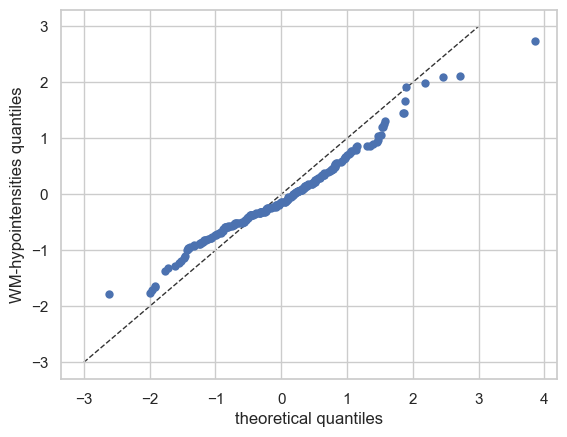

Getting started with normative modelling
========================================

Welcome to this tutorial notebook that will show you the very basics of
normative modeling. It’s like the “Hello World” of normative modeling.

Let’s jump right in.

Imports
~~~~~~~

.. code:: ipython3

    import warnings
    import pandas as pd
    import matplotlib.pyplot as plt
    from pcntoolkit import (
        BLR,
        NormativeModel,
        NormData,
        load_fcon1000,
        plot_centiles,
        plot_qq,
    )
    import pcntoolkit.util.output
    import seaborn as sns
    
    sns.set_style("darkgrid")
    warnings.simplefilter(action="ignore", category=FutureWarning)
    pd.options.mode.chained_assignment = None  # default='warn'
    pcntoolkit.util.output.Output.set_show_messages(False)

Load data
---------

First we download a small example dataset from github.

.. code:: ipython3

    # Download an example dataset
    norm_data: NormData = load_fcon1000()
    # Select only these three features to model for this example
    norm_data = norm_data.sel({"response_vars": ["WM-hypointensities", "Left-Lateral-Ventricle", "Brain-Stem"]})
    # Train-test split
    train, test = norm_data.train_test_split()

.. code:: ipython3

    # Inspect the data
    df = train.to_dataframe()
    fig, ax = plt.subplots(1, 2, figsize=(15, 5))
    
    sns.countplot(data=df, y=("batch_effects", "site"), hue=("batch_effects", "sex"), ax=ax[0], orient="h")
    ax[0].legend(title="Sex")
    ax[0].set_title("Count of sites")
    ax[0].set_xlabel("Site")
    ax[0].set_ylabel("Count")
    
    scatter_feature = "Left-Lateral-Ventricle"
    
    sns.scatterplot(
        data=df,
        x=("X", "age"),
        y=("Y", scatter_feature),
        hue=("batch_effects", "site"),
        style=("batch_effects", "sex"),
        ax=ax[1],
    )
    ax[1].legend([], [])
    ax[1].set_title(f"Scatter plot of age vs {scatter_feature}")
    ax[1].set_xlabel("Age")
    ax[1].set_ylabel(scatter_feature)
    
    plt.show()

Creating a Normative model
--------------------------

.. code:: ipython3

    save_dir = "/Users/stijndeboer/Projects/PCN/PCNtoolkit/examples/saves"
    model = NormativeModel(BLR(intercept_var=True), inscaler="standardize", outscaler="standardize")

.. code:: ipython3

    model.has_batch_effect

.. parsed-literal::

    False

Fit the model
-------------

With all that configured, we can fit the model.

The ``fit_predict`` function will fit the model, evaluate it, save the
results and plots, and return the test data with all the predictions
added.

After that, it will compute Z-scores and centiles for the test set.

All results can be found in the save directory.

.. code:: ipython3

    model.fit_predict(train, test)

.. parsed-literal::

    /opt/anaconda3/envs/uv_refactor/lib/python3.12/site-packages/pcntoolkit/util/output.py:216: UserWarning: Process: 5090 - 2025-06-12 16:21:57 - remove_Nan is set to False. Ensure your data does not contain NaNs in critical columns, or handle them appropriately.
      warnings.warn(message)
    /opt/anaconda3/envs/uv_refactor/lib/python3.12/site-packages/pcntoolkit/util/output.py:216: UserWarning: Process: 5090 - 2025-06-12 16:21:58 - remove_Nan is set to False. Ensure your data does not contain NaNs in critical columns, or handle them appropriately.
      warnings.warn(message)

.. raw:: html

    
<svg style="position: absolute; width: 0; height: 0; overflow: hidden">
    <defs>
    <symbol id="icon-database" viewBox="0 0 32 32">
    <path d="M16 0c-8.837 0-16 2.239-16 5v4c0 2.761 7.163 5 16 5s16-2.239 16-5v-4c0-2.761-7.163-5-16-5z"></path>
    <path d="M16 17c-8.837 0-16-2.239-16-5v6c0 2.761 7.163 5 16 5s16-2.239 16-5v-6c0 2.761-7.163 5-16 5z"></path>
    <path d="M16 26c-8.837 0-16-2.239-16-5v6c0 2.761 7.163 5 16 5s16-2.239 16-5v-6c0 2.761-7.163 5-16 5z"></path>
    </symbol>
    <symbol id="icon-file-text2" viewBox="0 0 32 32">
    <path d="M28.681 7.159c-0.694-0.947-1.662-2.053-2.724-3.116s-2.169-2.030-3.116-2.724c-1.612-1.182-2.393-1.319-2.841-1.319h-15.5c-1.378 0-2.5 1.121-2.5 2.5v27c0 1.378 1.122 2.5 2.5 2.5h23c1.378 0 2.5-1.122 2.5-2.5v-19.5c0-0.448-0.137-1.23-1.319-2.841zM24.543 5.457c0.959 0.959 1.712 1.825 2.268 2.543h-4.811v-4.811c0.718 0.556 1.584 1.309 2.543 2.268zM28 29.5c0 0.271-0.229 0.5-0.5 0.5h-23c-0.271 0-0.5-0.229-0.5-0.5v-27c0-0.271 0.229-0.5 0.5-0.5 0 0 15.499-0 15.5 0v7c0 0.552 0.448 1 1 1h7v19.5z"></path>
    <path d="M23 26h-14c-0.552 0-1-0.448-1-1s0.448-1 1-1h14c0.552 0 1 0.448 1 1s-0.448 1-1 1z"></path>
    <path d="M23 22h-14c-0.552 0-1-0.448-1-1s0.448-1 1-1h14c0.552 0 1 0.448 1 1s-0.448 1-1 1z"></path>
    <path d="M23 18h-14c-0.552 0-1-0.448-1-1s0.448-1 1-1h14c0.552 0 1 0.448 1 1s-0.448 1-1 1z"></path>
    </symbol>
    </defs>
    </svg>
    <pre class='xr-text-repr-fallback'>&lt;xarray.NormData&gt; Size: 87kB
    Dimensions:            (observations: 216, response_vars: 3, covariates: 1,
                            batch_effect_dims: 2, centile: 5, statistic: 10)
    Coordinates:
      * observations       (observations) int64 2kB 756 769 692 616 ... 751 470 1043
      * response_vars      (response_vars) &lt;U22 264B &#x27;WM-hypointensities&#x27; ... &#x27;Br...
      * covariates         (covariates) &lt;U3 12B &#x27;age&#x27;
      * batch_effect_dims  (batch_effect_dims) &lt;U4 32B &#x27;sex&#x27; &#x27;site&#x27;
      * centile            (centile) float64 40B 0.05 0.25 0.5 0.75 0.95
      * statistic          (statistic) &lt;U8 320B &#x27;MACE&#x27; &#x27;MAPE&#x27; ... &#x27;SMSE&#x27; &#x27;ShapiroW&#x27;
    Data variables:
        subjects           (observations) object 2kB &#x27;Munchen_sub96752&#x27; ... &#x27;Quee...
        Y                  (observations, response_vars) float64 5kB 2.721e+03 .....
        X                  (observations, covariates) float64 2kB 63.0 ... 23.0
        batch_effects      (observations, batch_effect_dims) &lt;U17 29kB &#x27;F&#x27; ... &#x27;Q...
        Z                  (observations, response_vars) float64 5kB 0.869 ... -1...
        centiles           (centile, observations, response_vars) float64 26kB 1....
        logp               (observations, response_vars) float64 5kB -7.661 ... -...
        Yhat               (observations, response_vars) float64 5kB 1.587 ... -2.86
        statistics         (response_vars, statistic) float64 240B 0.05981 ... 0....
        Y_harmonized       (observations, response_vars) float64 5kB 2.721e+03 .....
    Attributes:
        real_ids:                       True
        is_scaled:                      False
        name:                           fcon1000_test
        unique_batch_effects:           {&#x27;sex&#x27;: [&#x27;F&#x27;, &#x27;M&#x27;], &#x27;site&#x27;: [&#x27;AnnArbor_a&#x27;...
        batch_effect_counts:            {&#x27;sex&#x27;: {&#x27;F&#x27;: 589, &#x27;M&#x27;: 489}, &#x27;site&#x27;: {&#x27;A...
        batch_effect_covariate_ranges:  {&#x27;sex&#x27;: {&#x27;F&#x27;: {&#x27;age&#x27;: {&#x27;min&#x27;: 7.88, &#x27;max&#x27;...
        covariate_ranges:               {&#x27;age&#x27;: {&#x27;min&#x27;: 7.88, &#x27;max&#x27;: 85.0}}</pre>

xarray.NormData

<ul class='xr-sections'><li class='xr-section-item'><input id='section-3d9d1ede-00a2-40b6-972f-b8ba0b417109' class='xr-section-summary-in' type='checkbox' disabled ><label for='section-3d9d1ede-00a2-40b6-972f-b8ba0b417109' class='xr-section-summary'  title='Expand/collapse section'>Dimensions:</label>
<ul class='xr-dim-list'><li>observations: 216</li><li>response_vars: 3</li><li>covariates: 1</li><li>batch_effect_dims: 2</li><li>centile: 5</li><li>statistic: 10</li></ul>

</li><li class='xr-section-item'><input id='section-60268af8-ea2f-49df-b92c-920a2a147c75' class='xr-section-summary-in' type='checkbox'  checked><label for='section-60268af8-ea2f-49df-b92c-920a2a147c75' class='xr-section-summary' >Coordinates: (6)</label>

<ul class='xr-var-list'><li class='xr-var-item'>
observations

(observations)

int64

756 769 692 616 ... 751 470 1043
<input id='attrs-688c5362-b408-4f34-b3c7-8add86f07197' class='xr-var-attrs-in' type='checkbox' disabled><label for='attrs-688c5362-b408-4f34-b3c7-8add86f07197' title='Show/Hide attributes'><svg class='icon xr-icon-file-text2'><use xlink:href='#icon-file-text2'></use></svg></label><input id='data-c21d4c3b-5ea5-48b4-b4be-bfc97b1548d0' class='xr-var-data-in' type='checkbox'><label for='data-c21d4c3b-5ea5-48b4-b4be-bfc97b1548d0' title='Show/Hide data repr'><svg class='icon xr-icon-database'><use xlink:href='#icon-database'></use></svg></label>
<dl class='xr-attrs'></dl>

<pre>array([ 756,  769,  692, ...,  751,  470, 1043])</pre>
</li><li class='xr-var-item'>
response_vars

(response_vars)

&lt;U22

&#x27;WM-hypointensities&#x27; ... &#x27;Brain-...
<input id='attrs-908d8417-fa07-4a06-b5a5-477d66deed88' class='xr-var-attrs-in' type='checkbox' disabled><label for='attrs-908d8417-fa07-4a06-b5a5-477d66deed88' title='Show/Hide attributes'><svg class='icon xr-icon-file-text2'><use xlink:href='#icon-file-text2'></use></svg></label><input id='data-a488359a-f8d2-4ff1-b6d8-cc045f1b7d5c' class='xr-var-data-in' type='checkbox'><label for='data-a488359a-f8d2-4ff1-b6d8-cc045f1b7d5c' title='Show/Hide data repr'><svg class='icon xr-icon-database'><use xlink:href='#icon-database'></use></svg></label>
<dl class='xr-attrs'></dl>

<pre>array([&#x27;WM-hypointensities&#x27;, &#x27;Left-Lateral-Ventricle&#x27;, &#x27;Brain-Stem&#x27;],
          dtype=&#x27;&lt;U22&#x27;)</pre>
</li><li class='xr-var-item'>
covariates

(covariates)

&lt;U3

&#x27;age&#x27;
<input id='attrs-bb92cdf6-4ca7-4293-97b9-84ea606552d9' class='xr-var-attrs-in' type='checkbox' disabled><label for='attrs-bb92cdf6-4ca7-4293-97b9-84ea606552d9' title='Show/Hide attributes'><svg class='icon xr-icon-file-text2'><use xlink:href='#icon-file-text2'></use></svg></label><input id='data-f778fb2c-7b84-4336-aec9-dc015129041f' class='xr-var-data-in' type='checkbox'><label for='data-f778fb2c-7b84-4336-aec9-dc015129041f' title='Show/Hide data repr'><svg class='icon xr-icon-database'><use xlink:href='#icon-database'></use></svg></label>
<dl class='xr-attrs'></dl>

<pre>array([&#x27;age&#x27;], dtype=&#x27;&lt;U3&#x27;)</pre>
</li><li class='xr-var-item'>
batch_effect_dims

(batch_effect_dims)

&lt;U4

&#x27;sex&#x27; &#x27;site&#x27;
<input id='attrs-de79e658-97b8-442f-9964-7e3cfdc00aab' class='xr-var-attrs-in' type='checkbox' disabled><label for='attrs-de79e658-97b8-442f-9964-7e3cfdc00aab' title='Show/Hide attributes'><svg class='icon xr-icon-file-text2'><use xlink:href='#icon-file-text2'></use></svg></label><input id='data-94a5e44d-a25b-43f8-983c-86f619248628' class='xr-var-data-in' type='checkbox'><label for='data-94a5e44d-a25b-43f8-983c-86f619248628' title='Show/Hide data repr'><svg class='icon xr-icon-database'><use xlink:href='#icon-database'></use></svg></label>
<dl class='xr-attrs'></dl>

<pre>array([&#x27;sex&#x27;, &#x27;site&#x27;], dtype=&#x27;&lt;U4&#x27;)</pre>
</li><li class='xr-var-item'>
centile

(centile)

float64

0.05 0.25 0.5 0.75 0.95
<input id='attrs-065da6d3-f1c7-4b69-9d26-fcfc6aba07b2' class='xr-var-attrs-in' type='checkbox' disabled><label for='attrs-065da6d3-f1c7-4b69-9d26-fcfc6aba07b2' title='Show/Hide attributes'><svg class='icon xr-icon-file-text2'><use xlink:href='#icon-file-text2'></use></svg></label><input id='data-ba103df5-b79b-46ef-ae31-9382591c3d18' class='xr-var-data-in' type='checkbox'><label for='data-ba103df5-b79b-46ef-ae31-9382591c3d18' title='Show/Hide data repr'><svg class='icon xr-icon-database'><use xlink:href='#icon-database'></use></svg></label>
<dl class='xr-attrs'></dl>

<pre>array([0.05, 0.25, 0.5 , 0.75, 0.95])</pre>
</li><li class='xr-var-item'>
statistic

(statistic)

&lt;U8

&#x27;MACE&#x27; &#x27;MAPE&#x27; ... &#x27;SMSE&#x27; &#x27;ShapiroW&#x27;
<input id='attrs-7bee3735-f939-4d55-82f7-81a3e1501b2d' class='xr-var-attrs-in' type='checkbox' disabled><label for='attrs-7bee3735-f939-4d55-82f7-81a3e1501b2d' title='Show/Hide attributes'><svg class='icon xr-icon-file-text2'><use xlink:href='#icon-file-text2'></use></svg></label><input id='data-8ef25e46-d308-46ac-a4b2-a8f439a61dfe' class='xr-var-data-in' type='checkbox'><label for='data-8ef25e46-d308-46ac-a4b2-a8f439a61dfe' title='Show/Hide data repr'><svg class='icon xr-icon-database'><use xlink:href='#icon-database'></use></svg></label>
<dl class='xr-attrs'></dl>

<pre>array([&#x27;MACE&#x27;, &#x27;MAPE&#x27;, &#x27;MSLL&#x27;, &#x27;NLL&#x27;, &#x27;R2&#x27;, &#x27;RMSE&#x27;, &#x27;Rho&#x27;, &#x27;Rho_p&#x27;, &#x27;SMSE&#x27;,
           &#x27;ShapiroW&#x27;], dtype=&#x27;&lt;U8&#x27;)</pre>
</li></ul>
</li><li class='xr-section-item'><input id='section-fec3f9aa-d62b-46b2-b2d5-fb6ac0bb489e' class='xr-section-summary-in' type='checkbox'  checked><label for='section-fec3f9aa-d62b-46b2-b2d5-fb6ac0bb489e' class='xr-section-summary' >Data variables: (10)</label>

<ul class='xr-var-list'><li class='xr-var-item'>
subjects

(observations)

object

&#x27;Munchen_sub96752&#x27; ... &#x27;Queensla...
<input id='attrs-af32506d-f1eb-4d97-8096-4a1a16938692' class='xr-var-attrs-in' type='checkbox' disabled><label for='attrs-af32506d-f1eb-4d97-8096-4a1a16938692' title='Show/Hide attributes'><svg class='icon xr-icon-file-text2'><use xlink:href='#icon-file-text2'></use></svg></label><input id='data-89cd32dc-31db-40c4-a07d-1039ad168413' class='xr-var-data-in' type='checkbox'><label for='data-89cd32dc-31db-40c4-a07d-1039ad168413' title='Show/Hide data repr'><svg class='icon xr-icon-database'><use xlink:href='#icon-database'></use></svg></label>
<dl class='xr-attrs'></dl>

<pre>array([&#x27;Munchen_sub96752&#x27;, &#x27;NewYork_a_sub18638&#x27;, &#x27;Leiden_2200_sub87320&#x27;,
           &#x27;ICBM_sub47658&#x27;, &#x27;AnnArbor_b_sub45569&#x27;, &#x27;Beijing_Zang_sub18960&#x27;,
           &#x27;Leiden_2200_sub18456&#x27;, &#x27;Berlin_Margulies_sub27711&#x27;,
           &#x27;Beijing_Zang_sub87776&#x27;, &#x27;Milwaukee_b_sub63196&#x27;,
           &#x27;Beijing_Zang_sub07144&#x27;, &#x27;Atlanta_sub76280&#x27;,
           &#x27;Beijing_Zang_sub40037&#x27;, &#x27;Cambridge_Buckner_sub17737&#x27;,
           &#x27;ICBM_sub89049&#x27;, &#x27;ICBM_sub55656&#x27;, &#x27;Oulu_sub45566&#x27;,
           &#x27;Beijing_Zang_sub89088&#x27;, &#x27;Atlanta_sub16563&#x27;,
           &#x27;Cambridge_Buckner_sub51172&#x27;, &#x27;Oulu_sub98739&#x27;,
           &#x27;Queensland_sub49845&#x27;, &#x27;Cambridge_Buckner_sub84256&#x27;,
           &#x27;Cleveland_sub80263&#x27;, &#x27;ICBM_sub16607&#x27;, &#x27;Newark_sub46570&#x27;,
           &#x27;NewYork_a_sub88286&#x27;, &#x27;Cambridge_Buckner_sub02591&#x27;,
           &#x27;Oulu_sub66467&#x27;, &#x27;Beijing_Zang_sub74386&#x27;, &#x27;Newark_sub55760&#x27;,
           &#x27;ICBM_sub30623&#x27;, &#x27;Oulu_sub68752&#x27;, &#x27;Leiden_2180_sub19281&#x27;,
           &#x27;Beijing_Zang_sub50972&#x27;, &#x27;Beijing_Zang_sub85030&#x27;,
           &#x27;Milwaukee_b_sub36386&#x27;, &#x27;Baltimore_sub31837&#x27;, &#x27;PaloAlto_sub84978&#x27;,
           &#x27;Oulu_sub01077&#x27;, &#x27;NewYork_a_ADHD_sub54828&#x27;, &#x27;PaloAlto_sub96705&#x27;,
           &#x27;Cambridge_Buckner_sub40635&#x27;, &#x27;ICBM_sub66794&#x27;,
           &#x27;Beijing_Zang_sub46541&#x27;, &#x27;Beijing_Zang_sub87089&#x27;,
           &#x27;Pittsburgh_sub97823&#x27;, &#x27;Beijing_Zang_sub98617&#x27;, &#x27;ICBM_sub92028&#x27;,
    ...
           &#x27;Leiden_2200_sub04484&#x27;, &#x27;Beijing_Zang_sub80163&#x27;, &#x27;ICBM_sub02382&#x27;,
           &#x27;Cambridge_Buckner_sub77435&#x27;, &#x27;NewYork_a_sub54887&#x27;,
           &#x27;Oulu_sub85532&#x27;, &#x27;Baltimore_sub73823&#x27;, &#x27;Beijing_Zang_sub29590&#x27;,
           &#x27;Oulu_sub99718&#x27;, &#x27;Beijing_Zang_sub08455&#x27;, &#x27;Beijing_Zang_sub85543&#x27;,
           &#x27;Cambridge_Buckner_sub45354&#x27;, &#x27;Beijing_Zang_sub07717&#x27;,
           &#x27;Baltimore_sub76160&#x27;, &#x27;Beijing_Zang_sub17093&#x27;,
           &#x27;AnnArbor_b_sub90127&#x27;, &#x27;SaintLouis_sub73002&#x27;,
           &#x27;Queensland_sub93238&#x27;, &#x27;Cleveland_sub34189&#x27;,
           &#x27;Cambridge_Buckner_sub89107&#x27;, &#x27;Atlanta_sub75153&#x27;,
           &#x27;NewYork_a_ADHD_sub73035&#x27;, &#x27;Cambridge_Buckner_sub59434&#x27;,
           &#x27;Milwaukee_b_sub44912&#x27;, &#x27;Cleveland_sub46739&#x27;, &#x27;Oulu_sub20495&#x27;,
           &#x27;SaintLouis_sub28304&#x27;, &#x27;Cambridge_Buckner_sub35430&#x27;,
           &#x27;Oulu_sub86362&#x27;, &#x27;Newark_sub58526&#x27;, &#x27;Leiden_2180_sub12255&#x27;,
           &#x27;ICBM_sub48210&#x27;, &#x27;Cambridge_Buckner_sub77989&#x27;,
           &#x27;Berlin_Margulies_sub75506&#x27;, &#x27;NewYork_a_sub29216&#x27;,
           &#x27;Beijing_Zang_sub05267&#x27;, &#x27;AnnArbor_b_sub18546&#x27;, &#x27;Oulu_sub75620&#x27;,
           &#x27;AnnArbor_b_sub30250&#x27;, &#x27;Berlin_Margulies_sub86111&#x27;,
           &#x27;Beijing_Zang_sub89592&#x27;, &#x27;Beijing_Zang_sub68012&#x27;,
           &#x27;NewYork_a_sub50559&#x27;, &#x27;Munchen_sub66933&#x27;,
           &#x27;Cambridge_Buckner_sub59729&#x27;, &#x27;Queensland_sub86245&#x27;], dtype=object)</pre>
</li><li class='xr-var-item'>
Y

(observations, response_vars)

float64

2.721e+03 1.362e+04 ... 1.681e+04
<input id='attrs-1fb1cd0b-dc54-47aa-9728-765f739f741b' class='xr-var-attrs-in' type='checkbox' disabled><label for='attrs-1fb1cd0b-dc54-47aa-9728-765f739f741b' title='Show/Hide attributes'><svg class='icon xr-icon-file-text2'><use xlink:href='#icon-file-text2'></use></svg></label><input id='data-dd093b76-c4e6-4a16-ae67-f0ae9f893276' class='xr-var-data-in' type='checkbox'><label for='data-dd093b76-c4e6-4a16-ae67-f0ae9f893276' title='Show/Hide data repr'><svg class='icon xr-icon-database'><use xlink:href='#icon-database'></use></svg></label>
<dl class='xr-attrs'></dl>

<pre>array([[ 2721.4, 13617.8, 22653.2],
           [ 1143.1, 10922.3, 20821.3],
           [  955.8,  8374.3, 19278.9],
           [ 1473.9, 16068.7, 25724. ],
           [  757.8,  4107.1, 16570.4],
           [  871.1,  5962.5, 23831.3],
           [ 1207.3, 19877.6, 23995.9],
           [  595. ,  5568.6, 21180.8],
           [  682.4,  6953.8, 15396.4],
           [  445.1,  6771.1, 20429.1],
           [ 1620. ,  3980.3, 21843.1],
           [  602.8,  6051.4, 19098.4],
           [ 1432.5,  5916.8, 22060.2],
           [ 1908.2,  4656.4, 22974.4],
           [ 1834. ,  3691.9, 26658.4],
           [  459.6,  5823.6, 21087. ],
           [ 1210. ,  6667.1, 23873.9],
           [  845.9,  7648.6, 20948.3],
           [  995.2,  6850.1, 20345.2],
           [ 1734.7,  4457. , 18642.8],
    ...
           [  785.8,  6197.9, 20216. ],
           [ 2240.1,  4806.6, 27596.4],
           [  758.1,  5615.1, 24054.6],
           [ 1440.5,  7500.1, 13773.6],
           [  818.6,  9928.8, 21445.7],
           [ 3769.9, 19406.4, 23748.4],
           [  880.2,  7366.4, 21144.5],
           [  823.9, 11342.3, 25405.8],
           [ 2113.9,  8920.5, 22618.7],
           [  741.9, 11228.2, 20471.4],
           [ 1333.9,  9730.4, 22427.1],
           [  707.3,  6458.2, 21449.5],
           [ 1134.1,  6038.2, 15343. ],
           [  438.6,  7505.7, 15679.7],
           [  966.3, 10570. , 19890.2],
           [  424.3,  4887. , 21624.5],
           [  604.7,  8933.9, 18852.1],
           [ 2343.2, 19039.7, 18791.2],
           [ 2721.7,  4899.1, 23784.8],
           [  703.5, 10060.7, 16805.6]])</pre>
</li><li class='xr-var-item'>
X

(observations, covariates)

float64

63.0 23.27 22.0 ... 72.0 23.0 23.0
<input id='attrs-276bcc7d-4358-4c10-af78-b3af87e0f2e3' class='xr-var-attrs-in' type='checkbox' disabled><label for='attrs-276bcc7d-4358-4c10-af78-b3af87e0f2e3' title='Show/Hide attributes'><svg class='icon xr-icon-file-text2'><use xlink:href='#icon-file-text2'></use></svg></label><input id='data-66bf1781-8878-473d-8ac1-336c9c37d8b2' class='xr-var-data-in' type='checkbox'><label for='data-66bf1781-8878-473d-8ac1-336c9c37d8b2' title='Show/Hide data repr'><svg class='icon xr-icon-database'><use xlink:href='#icon-database'></use></svg></label>
<dl class='xr-attrs'></dl>

<pre>array([[63.  ],
           [23.27],
           [22.  ],
           [42.  ],
           [63.  ],
           [23.  ],
           [21.  ],
           [26.  ],
           [21.  ],
           [49.  ],
           [20.  ],
           [23.  ],
           [20.  ],
           [26.  ],
           [35.  ],
           [21.  ],
           [22.  ],
           [19.  ],
           [34.  ],
           [18.  ],
    ...
           [21.  ],
           [20.  ],
           [22.  ],
           [25.  ],
           [25.  ],
           [73.  ],
           [22.  ],
           [28.  ],
           [29.06],
           [19.  ],
           [20.  ],
           [22.  ],
           [19.  ],
           [24.  ],
           [21.  ],
           [24.  ],
           [22.79],
           [72.  ],
           [23.  ],
           [23.  ]])</pre>
</li><li class='xr-var-item'>
batch_effects

(observations, batch_effect_dims)

&lt;U17

&#x27;F&#x27; &#x27;Munchen&#x27; ... &#x27;M&#x27; &#x27;Queensland&#x27;
<input id='attrs-23fa67b5-2972-48a8-b650-a172e1522f9c' class='xr-var-attrs-in' type='checkbox' disabled><label for='attrs-23fa67b5-2972-48a8-b650-a172e1522f9c' title='Show/Hide attributes'><svg class='icon xr-icon-file-text2'><use xlink:href='#icon-file-text2'></use></svg></label><input id='data-b2e840ae-22a5-4581-a5f6-80bee34ad004' class='xr-var-data-in' type='checkbox'><label for='data-b2e840ae-22a5-4581-a5f6-80bee34ad004' title='Show/Hide data repr'><svg class='icon xr-icon-database'><use xlink:href='#icon-database'></use></svg></label>
<dl class='xr-attrs'></dl>

<pre>array([[&#x27;F&#x27;, &#x27;Munchen&#x27;],
           [&#x27;M&#x27;, &#x27;NewYork_a&#x27;],
           [&#x27;F&#x27;, &#x27;Leiden_2200&#x27;],
           [&#x27;M&#x27;, &#x27;ICBM&#x27;],
           [&#x27;F&#x27;, &#x27;AnnArbor_b&#x27;],
           [&#x27;M&#x27;, &#x27;Beijing_Zang&#x27;],
           [&#x27;M&#x27;, &#x27;Leiden_2200&#x27;],
           [&#x27;F&#x27;, &#x27;Berlin_Margulies&#x27;],
           [&#x27;F&#x27;, &#x27;Beijing_Zang&#x27;],
           [&#x27;F&#x27;, &#x27;Milwaukee_b&#x27;],
           [&#x27;M&#x27;, &#x27;Beijing_Zang&#x27;],
           [&#x27;F&#x27;, &#x27;Atlanta&#x27;],
           [&#x27;F&#x27;, &#x27;Beijing_Zang&#x27;],
           [&#x27;F&#x27;, &#x27;Cambridge_Buckner&#x27;],
           [&#x27;M&#x27;, &#x27;ICBM&#x27;],
           [&#x27;F&#x27;, &#x27;ICBM&#x27;],
           [&#x27;M&#x27;, &#x27;Oulu&#x27;],
           [&#x27;F&#x27;, &#x27;Beijing_Zang&#x27;],
           [&#x27;M&#x27;, &#x27;Atlanta&#x27;],
           [&#x27;F&#x27;, &#x27;Cambridge_Buckner&#x27;],
    ...
           [&#x27;F&#x27;, &#x27;SaintLouis&#x27;],
           [&#x27;M&#x27;, &#x27;Cambridge_Buckner&#x27;],
           [&#x27;F&#x27;, &#x27;Oulu&#x27;],
           [&#x27;F&#x27;, &#x27;Newark&#x27;],
           [&#x27;M&#x27;, &#x27;Leiden_2180&#x27;],
           [&#x27;M&#x27;, &#x27;ICBM&#x27;],
           [&#x27;F&#x27;, &#x27;Cambridge_Buckner&#x27;],
           [&#x27;M&#x27;, &#x27;Berlin_Margulies&#x27;],
           [&#x27;M&#x27;, &#x27;NewYork_a&#x27;],
           [&#x27;F&#x27;, &#x27;Beijing_Zang&#x27;],
           [&#x27;M&#x27;, &#x27;AnnArbor_b&#x27;],
           [&#x27;F&#x27;, &#x27;Oulu&#x27;],
           [&#x27;F&#x27;, &#x27;AnnArbor_b&#x27;],
           [&#x27;F&#x27;, &#x27;Berlin_Margulies&#x27;],
           [&#x27;M&#x27;, &#x27;Beijing_Zang&#x27;],
           [&#x27;F&#x27;, &#x27;Beijing_Zang&#x27;],
           [&#x27;M&#x27;, &#x27;NewYork_a&#x27;],
           [&#x27;M&#x27;, &#x27;Munchen&#x27;],
           [&#x27;M&#x27;, &#x27;Cambridge_Buckner&#x27;],
           [&#x27;M&#x27;, &#x27;Queensland&#x27;]], dtype=&#x27;&lt;U17&#x27;)</pre>
</li><li class='xr-var-item'>
Z

(observations, response_vars)

float64

0.869 0.3707 ... 0.7415 -1.558
<input id='attrs-03d22f4d-94a4-444d-9687-f580b05f23ef' class='xr-var-attrs-in' type='checkbox' disabled><label for='attrs-03d22f4d-94a4-444d-9687-f580b05f23ef' title='Show/Hide attributes'><svg class='icon xr-icon-file-text2'><use xlink:href='#icon-file-text2'></use></svg></label><input id='data-a5924514-ea93-4a14-8f94-d83241329e4e' class='xr-var-data-in' type='checkbox'><label for='data-a5924514-ea93-4a14-8f94-d83241329e4e' title='Show/Hide data repr'><svg class='icon xr-icon-database'><use xlink:href='#icon-database'></use></svg></label>
<dl class='xr-attrs'></dl>

<pre>array([[ 8.69043396e-01,  3.70742238e-01,  8.37227086e-01],
           [-3.51643510e-02,  9.49847990e-01,  8.50815920e-02],
           [-2.39652754e-01,  3.48599811e-01, -5.46221157e-01],
           [-1.37261499e-01,  1.65223028e+00,  2.09284374e+00],
           [-1.63973928e+00, -2.01446410e+00, -1.64264326e+00],
           [-3.76381990e-01, -2.90106202e-01,  1.31671796e+00],
           [ 1.10950249e-01,  3.27558793e+00,  1.38367769e+00],
           [-8.14814106e-01, -4.84151682e-01,  2.32590581e-01],
           [-5.62114734e-01,  2.26612027e-02, -2.13491148e+00],
           [-1.65127598e+00, -9.07522319e-01, -7.16612855e-02],
           [ 6.68212557e-01, -6.94119251e-01,  5.02666942e-01],
           [-7.20443062e-01, -2.67728254e-01, -6.19958704e-01],
           [ 4.27798215e-01, -2.06725196e-01,  5.91491666e-01],
           [ 8.69320791e-01, -7.13787540e-01,  9.66574447e-01],
           [ 5.21147993e-01, -1.24102839e+00,  2.47512291e+00],
           [-8.47805110e-01, -2.61810686e-01,  1.93466162e-01],
           [ 8.63149389e-02, -8.11216517e-02,  1.33395898e+00],
           [-2.96229895e-01,  2.60749153e-01,  1.36417167e-01],
           [-5.26368746e-01, -4.14486082e-01, -1.08211498e-01],
           [ 8.71379511e-01, -5.10849095e-01, -8.06899634e-01],
    ...
           [-4.29527728e-01, -1.67599194e-01, -1.62913997e-01],
           [ 1.46331087e+00, -4.86149353e-01,  2.85658350e+00],
           [-4.93168934e-01, -3.45921897e-01,  1.40789773e+00],
           [ 2.97611397e-01,  3.37022626e-02, -2.79870497e+00],
           [-4.99940435e-01,  6.45088795e-01,  3.40845976e-01],
           [ 1.92388203e+00,  1.50371674e+00,  1.28195868e+00],
           [-3.36596726e-01,  9.49000324e-02,  2.17144254e-01],
           [-5.77477712e-01,  9.06082379e-01,  1.96187720e+00],
           [ 1.04713702e+00,  2.62892268e-01,  8.21460112e-01],
           [-4.29572329e-01,  1.16164205e+00, -5.86918380e-02],
           [ 3.01372327e-01,  7.53112639e-01,  7.41605859e-01],
           [-5.58311179e-01, -1.33704134e-01,  3.41944023e-01],
           [ 7.32825056e-02, -1.44546948e-01, -2.15681937e+00],
           [-9.59141287e-01,  6.67314498e-02, -2.01879091e+00],
           [-1.98077491e-01,  9.32860497e-01, -2.96218997e-01],
           [-9.77479796e-01, -5.92468801e-01,  4.13862021e-01],
           [-7.12099756e-01,  4.64492688e-01, -7.20767982e-01],
           [ 1.33546295e-01,  1.44380130e+00, -7.34362429e-01],
           [ 1.99678021e+00, -5.57785728e-01,  1.29769042e+00],
           [-5.91307952e-01,  7.41494543e-01, -1.55815986e+00]])</pre>
</li><li class='xr-var-item'>
centiles

(centile, observations, response_vars)

float64

1.204e+03 8.331e+03 ... 2.921e+04
<input id='attrs-be5c2813-b3cd-4ca7-adaa-c3119677a976' class='xr-var-attrs-in' type='checkbox' disabled><label for='attrs-be5c2813-b3cd-4ca7-adaa-c3119677a976' title='Show/Hide attributes'><svg class='icon xr-icon-file-text2'><use xlink:href='#icon-file-text2'></use></svg></label><input id='data-d0f72355-d661-41ad-9289-e016112be4d9' class='xr-var-data-in' type='checkbox'><label for='data-d0f72355-d661-41ad-9289-e016112be4d9' title='Show/Hide data repr'><svg class='icon xr-icon-database'><use xlink:href='#icon-database'></use></svg></label>
<dl class='xr-attrs'></dl>

<pre>array([[[ 1203.55824481,  8330.78000831, 21708.2622985 ],
            [ -418.54631433, -1471.00614711, -1798.57033057],
            [ -470.4400581 , -1784.54872044, -2550.46128862],
            ...,
            [ 1570.65990234, 10549.31351563, 27029.23644566],
            [ -429.57862481, -1537.663657  , -1958.41868706],
            [ -429.57862481, -1537.663657  , -1958.41868706]],
    
           [[ 2013.54473078, 12599.01148725, 30921.01903438],
            [  389.81029351,  2788.63582757,  7395.64305501],
            [  337.88918219,  2474.94902644,  6643.44073243],
            ...,
            [ 2381.22336892, 14820.58569847, 36248.55756781],
            [  378.77203629,  2721.94697816,  7235.72704157],
            [  378.77203629,  2721.94697816,  7235.72704157]],
    
           [[ 2576.55783923, 15565.81440826, 37324.70958619],
            [  951.69049078,  5749.46827429, 13786.44431858],
            [  899.75035656,  5435.68122193, 13034.02556978],
            ...,
            [ 2944.63753055, 17789.50218087, 42656.81095565],
            [  940.64810004,  5682.75764111, 13626.4812775 ],
            [  940.64810004,  5682.75764111, 13626.4812775 ]],
    
           [[ 3139.57094769, 18532.61732928, 43728.40013801],
            [ 1513.57068804,  8710.30072101, 20177.24558215],
            [ 1461.61153093,  8396.41341743, 19424.61040713],
            ...,
            [ 3508.05169218, 20758.41866327, 49065.06434349],
            [ 1502.52416379,  8643.56830407, 20017.23551343],
            [ 1502.52416379,  8643.56830407, 20017.23551343]],
    
           [[ 3949.55743366, 22800.84880821, 52941.15687389],
            [ 2321.92729589, 12969.94269569, 29371.45896774],
            [ 2269.94077122, 12655.91116431, 28618.51242818],
            ...,
            [ 4318.61515876, 25029.69084611, 58284.38546564],
            [ 2310.87482488, 12903.17893923, 29211.38124206],
            [ 2310.87482488, 12903.17893923, 29211.38124206]]])</pre>
</li><li class='xr-var-item'>
logp

(observations, response_vars)

float64

-7.661 -9.406 ... -9.803 -10.13
<input id='attrs-b7365abe-1387-4610-9fac-c7bc667b7cec' class='xr-var-attrs-in' type='checkbox' disabled><label for='attrs-b7365abe-1387-4610-9fac-c7bc667b7cec' title='Show/Hide attributes'><svg class='icon xr-icon-file-text2'><use xlink:href='#icon-file-text2'></use></svg></label><input id='data-b3fee18c-4c56-45b9-bc7c-355dc714a4a3' class='xr-var-data-in' type='checkbox'><label for='data-b3fee18c-4c56-45b9-bc7c-355dc714a4a3' title='Show/Hide data repr'><svg class='icon xr-icon-database'><use xlink:href='#icon-database'></use></svg></label>
<dl class='xr-attrs'></dl>

<pre>array([[ -7.661095  ,  -9.4060456 , -11.2713817 ],
           [ -7.67042333, -10.00026721, -10.35097845],
           [ -7.64625578,  -9.53001224, -10.29253196],
           [ -7.68751094, -10.1459882 , -10.08000401],
           [-10.01978193, -12.70122167, -12.46669975],
           [ -7.64750369,  -9.30798628, -10.65534367],
           [ -7.73145694, -14.90513812, -10.81891305],
           [ -7.80211696,  -9.32502461, -10.26127129],
           [ -7.66640257,  -9.38676318, -10.12392556],
           [ -9.39220396, -10.04414046, -10.48757796],
           [ -8.10749977,  -9.32985805, -10.6316341 ],
           [ -7.72625854,  -9.30948194, -10.24210639],
           [ -7.91609571,  -9.3305638 , -10.65606856],
           [ -8.15830581,  -9.3870984 , -10.39458257],
           [ -7.76110551,  -9.94311208, -10.27094732],
           [ -7.75882982,  -9.31636759, -10.4916202 ],
           [ -7.71334833,  -9.34527824, -10.72978578],
           [ -7.64733511,  -9.53234722, -10.59848135],
           [ -7.75690619,  -9.36865832, -10.07594052],
           [ -8.36247933,  -9.30583737, -10.42985332],
    ...
           [ -7.64781234,  -9.33233898, -10.41195859],
           [ -9.10139202,  -9.30635221, -11.45658767],
           [ -7.65844979,  -9.30676454, -10.75178751],
           [ -7.76998519,  -9.3514372 , -10.0813992 ],
           [ -7.67401053,  -9.67122877, -10.32051004],
           [ -8.08762299,  -9.35718948, -12.18424696],
           [ -7.64426754,  -9.40265906, -10.44169862],
           [ -7.71849804,  -9.81383341, -10.50833936],
           [ -8.26100978,  -9.38471312, -10.23799358],
           [ -7.64481043, -10.41378123, -10.54825424],
           [ -7.83577096,  -9.90103712, -10.69855646],
           [ -7.67067915,  -9.33306017, -10.46977272],
           [ -7.73578813,  -9.35271879, -10.16826496],
           [ -7.85643365,  -9.37041722, -10.0872563 ],
           [ -7.65228591, -10.05741297, -10.38433281],
           [ -7.86776861,  -9.33420007, -10.38080041],
           [ -7.72122672,  -9.58904295, -10.23475621],
           [ -7.90595904,  -9.34902469, -13.23298573],
           [ -9.92957955,  -9.32189072, -10.65006999],
           [ -7.68453952,  -9.80327983, -10.13163474]])</pre>
</li><li class='xr-var-item'>
Yhat

(observations, response_vars)

float64

1.587 1.838 6.844 ... -0.495 -2.86
<input id='attrs-36b67509-2c40-4d1b-8f74-f23dff440c28' class='xr-var-attrs-in' type='checkbox' disabled><label for='attrs-36b67509-2c40-4d1b-8f74-f23dff440c28' title='Show/Hide attributes'><svg class='icon xr-icon-file-text2'><use xlink:href='#icon-file-text2'></use></svg></label><input id='data-5ed47fc7-fa9e-403e-9ea0-53a8c4d8263e' class='xr-var-data-in' type='checkbox'><label for='data-5ed47fc7-fa9e-403e-9ea0-53a8c4d8263e' title='Show/Hide data repr'><svg class='icon xr-icon-database'><use xlink:href='#icon-database'></use></svg></label>
<dl class='xr-attrs'></dl>

<pre>array([[ 1.58686874e+00,  1.83812400e+00,  6.84352663e+00],
           [-4.02665084e-01, -4.79253831e-01, -2.79472064e+00],
           [-4.66262063e-01, -5.53330596e-01, -3.10281462e+00],
           [ 5.35265158e-01,  6.13232621e-01,  1.74905916e+00],
           [ 1.58686874e+00,  1.83812400e+00,  6.84352663e+00],
           [-4.16185702e-01, -4.95002435e-01, -2.86022094e+00],
           [-5.16338424e-01, -6.11658756e-01, -3.34540831e+00],
           [-2.65956619e-01, -3.20017952e-01, -2.13243987e+00],
           [-5.16338424e-01, -6.11658756e-01, -3.34540831e+00],
           [ 8.85799686e-01,  1.02152975e+00,  3.44721498e+00],
           [-5.66414785e-01, -6.69986917e-01, -3.58800200e+00],
           [-4.16185702e-01, -4.95002435e-01, -2.86022094e+00],
           [-5.66414785e-01, -6.69986917e-01, -3.58800200e+00],
           [-2.65956619e-01, -3.20017952e-01, -2.13243987e+00],
           [ 1.84730631e-01,  2.04935495e-01,  5.09033331e-02],
           [-5.16338424e-01, -6.11658756e-01, -3.34540831e+00],
           [-4.66262063e-01, -5.53330596e-01, -3.10281462e+00],
           [-6.16491146e-01, -7.28315078e-01, -3.83059569e+00],
           [ 1.34654270e-01,  1.46607334e-01, -1.91690356e-01],
           [-6.66567507e-01, -7.86643239e-01, -4.07318938e+00],
    ...
           [-5.16338424e-01, -6.11658756e-01, -3.34540831e+00],
           [-5.66414785e-01, -6.69986917e-01, -3.58800200e+00],
           [-4.66262063e-01, -5.53330596e-01, -3.10281462e+00],
           [-3.16032980e-01, -3.78346113e-01, -2.37503356e+00],
           [-3.16032980e-01, -3.78346113e-01, -2.37503356e+00],
           [ 2.08763235e+00,  2.42140561e+00,  9.26946352e+00],
           [-4.66262063e-01, -5.53330596e-01, -3.10281462e+00],
           [-1.65803897e-01, -2.03361631e-01, -1.64725249e+00],
           [-1.12722954e-01, -1.41533780e-01, -1.39010318e+00],
           [-6.16491146e-01, -7.28315078e-01, -3.83059569e+00],
           [-5.66414785e-01, -6.69986917e-01, -3.58800200e+00],
           [-4.66262063e-01, -5.53330596e-01, -3.10281462e+00],
           [-6.16491146e-01, -7.28315078e-01, -3.83059569e+00],
           [-3.66109341e-01, -4.36674274e-01, -2.61762725e+00],
           [-5.16338424e-01, -6.11658756e-01, -3.34540831e+00],
           [-3.66109341e-01, -4.36674274e-01, -2.61762725e+00],
           [-4.26701738e-01, -5.07251348e-01, -2.91116561e+00],
           [ 2.03755599e+00,  2.36307745e+00,  9.02686983e+00],
           [-4.16185702e-01, -4.95002435e-01, -2.86022094e+00],
           [-4.16185702e-01, -4.95002435e-01, -2.86022094e+00]])</pre>
</li><li class='xr-var-item'>
statistics

(response_vars, statistic)

float64

0.05981 3.661 ... 11.06 0.9891
<input id='attrs-59ab741e-4a46-44bc-8069-e4908bed7de3' class='xr-var-attrs-in' type='checkbox' disabled><label for='attrs-59ab741e-4a46-44bc-8069-e4908bed7de3' title='Show/Hide attributes'><svg class='icon xr-icon-file-text2'><use xlink:href='#icon-file-text2'></use></svg></label><input id='data-d7774df5-6b2e-4536-8ca9-b16698c4f963' class='xr-var-data-in' type='checkbox'><label for='data-d7774df5-6b2e-4536-8ca9-b16698c4f963' title='Show/Hide data repr'><svg class='icon xr-icon-database'><use xlink:href='#icon-database'></use></svg></label>
<dl class='xr-attrs'></dl>

<pre>array([[ 5.98148148e-02,  3.66122281e+00, -6.81540117e+00,
             7.93467021e+00, -1.01720866e-01,  7.77841267e-01,
            -2.74954850e-02,  6.87808664e-01,  1.10172087e+00,
             9.72406203e-01],
           [ 5.09259259e-02,  2.17572512e+00, -8.33054535e+00,
             9.82746720e+00,  4.13370238e-02,  1.05852398e+00,
             2.20610013e-01,  1.09934943e-03,  9.58662976e-01,
             8.98344497e-01],
           [ 1.55555556e-01,  1.30705681e+01, -9.00491008e+00,
             1.05211351e+01, -1.00587188e+01,  3.66524825e+00,
             1.05739320e-01,  1.21291931e-01,  1.10587188e+01,
             9.89058336e-01]])</pre>
</li><li class='xr-var-item'>
Y_harmonized

(observations, response_vars)

float64

2.721e+03 1.362e+04 ... 1.681e+04
<input id='attrs-8ac32f18-2335-4c27-9760-fc92bf80d8f0' class='xr-var-attrs-in' type='checkbox' disabled><label for='attrs-8ac32f18-2335-4c27-9760-fc92bf80d8f0' title='Show/Hide attributes'><svg class='icon xr-icon-file-text2'><use xlink:href='#icon-file-text2'></use></svg></label><input id='data-a051bd4b-76c0-4561-aeed-12461f861e0c' class='xr-var-data-in' type='checkbox'><label for='data-a051bd4b-76c0-4561-aeed-12461f861e0c' title='Show/Hide data repr'><svg class='icon xr-icon-database'><use xlink:href='#icon-database'></use></svg></label>
<dl class='xr-attrs'></dl>

<pre>array([[ 2721.4, 13617.8, 22653.2],
           [ 1143.1, 10922.3, 20821.3],
           [  955.8,  8374.3, 19278.9],
           [ 1473.9, 16068.7, 25724. ],
           [  757.8,  4107.1, 16570.4],
           [  871.1,  5962.5, 23831.3],
           [ 1207.3, 19877.6, 23995.9],
           [  595. ,  5568.6, 21180.8],
           [  682.4,  6953.8, 15396.4],
           [  445.1,  6771.1, 20429.1],
           [ 1620. ,  3980.3, 21843.1],
           [  602.8,  6051.4, 19098.4],
           [ 1432.5,  5916.8, 22060.2],
           [ 1908.2,  4656.4, 22974.4],
           [ 1834. ,  3691.9, 26658.4],
           [  459.6,  5823.6, 21087. ],
           [ 1210. ,  6667.1, 23873.9],
           [  845.9,  7648.6, 20948.3],
           [  995.2,  6850.1, 20345.2],
           [ 1734.7,  4457. , 18642.8],
    ...
           [  785.8,  6197.9, 20216. ],
           [ 2240.1,  4806.6, 27596.4],
           [  758.1,  5615.1, 24054.6],
           [ 1440.5,  7500.1, 13773.6],
           [  818.6,  9928.8, 21445.7],
           [ 3769.9, 19406.4, 23748.4],
           [  880.2,  7366.4, 21144.5],
           [  823.9, 11342.3, 25405.8],
           [ 2113.9,  8920.5, 22618.7],
           [  741.9, 11228.2, 20471.4],
           [ 1333.9,  9730.4, 22427.1],
           [  707.3,  6458.2, 21449.5],
           [ 1134.1,  6038.2, 15343. ],
           [  438.6,  7505.7, 15679.7],
           [  966.3, 10570. , 19890.2],
           [  424.3,  4887. , 21624.5],
           [  604.7,  8933.9, 18852.1],
           [ 2343.2, 19039.7, 18791.2],
           [ 2721.7,  4899.1, 23784.8],
           [  703.5, 10060.7, 16805.6]])</pre>
</li></ul>
</li><li class='xr-section-item'><input id='section-0661294d-12de-4365-a21b-aeac7312dcba' class='xr-section-summary-in' type='checkbox'  ><label for='section-0661294d-12de-4365-a21b-aeac7312dcba' class='xr-section-summary' >Indexes: (6)</label>

<ul class='xr-var-list'><li class='xr-var-item'>

observations

PandasIndex
<input type='checkbox' disabled/><label></label><input id='index-46bce6ac-45b7-448b-a7a0-ed9968606715' class='xr-index-data-in' type='checkbox'/><label for='index-46bce6ac-45b7-448b-a7a0-ed9968606715' title='Show/Hide index repr'><svg class='icon xr-icon-database'><use xlink:href='#icon-database'></use></svg></label>
<pre>PandasIndex(Index([ 756,  769,  692,  616,   35,  164,  680,  331,  299,  727,
           ...
             27,  959,   29,  346,  304,  264,  798,  751,  470, 1043],
          dtype=&#x27;int64&#x27;, name=&#x27;observations&#x27;, length=216))</pre>
</li><li class='xr-var-item'>

response_vars

PandasIndex
<input type='checkbox' disabled/><label></label><input id='index-45ffe429-eb38-43cd-ae9d-992d1e96de36' class='xr-index-data-in' type='checkbox'/><label for='index-45ffe429-eb38-43cd-ae9d-992d1e96de36' title='Show/Hide index repr'><svg class='icon xr-icon-database'><use xlink:href='#icon-database'></use></svg></label>
<pre>PandasIndex(Index([&#x27;WM-hypointensities&#x27;, &#x27;Left-Lateral-Ventricle&#x27;, &#x27;Brain-Stem&#x27;], dtype=&#x27;object&#x27;, name=&#x27;response_vars&#x27;))</pre>
</li><li class='xr-var-item'>

covariates

PandasIndex
<input type='checkbox' disabled/><label></label><input id='index-5cdee093-f1e0-49fa-84a9-8936d12026c2' class='xr-index-data-in' type='checkbox'/><label for='index-5cdee093-f1e0-49fa-84a9-8936d12026c2' title='Show/Hide index repr'><svg class='icon xr-icon-database'><use xlink:href='#icon-database'></use></svg></label>
<pre>PandasIndex(Index([&#x27;age&#x27;], dtype=&#x27;object&#x27;, name=&#x27;covariates&#x27;))</pre>
</li><li class='xr-var-item'>

batch_effect_dims

PandasIndex
<input type='checkbox' disabled/><label></label><input id='index-a2ad359f-9ed2-4df9-bf32-ecdf82f8d84c' class='xr-index-data-in' type='checkbox'/><label for='index-a2ad359f-9ed2-4df9-bf32-ecdf82f8d84c' title='Show/Hide index repr'><svg class='icon xr-icon-database'><use xlink:href='#icon-database'></use></svg></label>
<pre>PandasIndex(Index([&#x27;sex&#x27;, &#x27;site&#x27;], dtype=&#x27;object&#x27;, name=&#x27;batch_effect_dims&#x27;))</pre>
</li><li class='xr-var-item'>

centile

PandasIndex
<input type='checkbox' disabled/><label></label><input id='index-bdd05815-4bb6-4297-a30b-1b86cb979c7a' class='xr-index-data-in' type='checkbox'/><label for='index-bdd05815-4bb6-4297-a30b-1b86cb979c7a' title='Show/Hide index repr'><svg class='icon xr-icon-database'><use xlink:href='#icon-database'></use></svg></label>
<pre>PandasIndex(Index([0.05, 0.25, 0.5, 0.75, 0.95], dtype=&#x27;float64&#x27;, name=&#x27;centile&#x27;))</pre>
</li><li class='xr-var-item'>

statistic

PandasIndex
<input type='checkbox' disabled/><label></label><input id='index-2d5cc6db-b815-4782-b819-3491a5ecf3c9' class='xr-index-data-in' type='checkbox'/><label for='index-2d5cc6db-b815-4782-b819-3491a5ecf3c9' title='Show/Hide index repr'><svg class='icon xr-icon-database'><use xlink:href='#icon-database'></use></svg></label>
<pre>PandasIndex(Index([&#x27;MACE&#x27;, &#x27;MAPE&#x27;, &#x27;MSLL&#x27;, &#x27;NLL&#x27;, &#x27;R2&#x27;, &#x27;RMSE&#x27;, &#x27;Rho&#x27;, &#x27;Rho_p&#x27;, &#x27;SMSE&#x27;,
           &#x27;ShapiroW&#x27;],
          dtype=&#x27;object&#x27;, name=&#x27;statistic&#x27;))</pre>
</li></ul>
</li><li class='xr-section-item'><input id='section-a02b9369-b418-4214-9dfd-c506b27fccd0' class='xr-section-summary-in' type='checkbox'  checked><label for='section-a02b9369-b418-4214-9dfd-c506b27fccd0' class='xr-section-summary' >Attributes: (7)</label>

<dl class='xr-attrs'><dt>real_ids :</dt><dd>True</dd><dt>is_scaled :</dt><dd>False</dd><dt>name :</dt><dd>fcon1000_test</dd><dt>unique_batch_effects :</dt><dd>{&#x27;sex&#x27;: [&#x27;F&#x27;, &#x27;M&#x27;], &#x27;site&#x27;: [&#x27;AnnArbor_a&#x27;, &#x27;AnnArbor_b&#x27;, &#x27;Atlanta&#x27;, &#x27;Baltimore&#x27;, &#x27;Bangor&#x27;, &#x27;Beijing_Zang&#x27;, &#x27;Berlin_Margulies&#x27;, &#x27;Cambridge_Buckner&#x27;, &#x27;Cleveland&#x27;, &#x27;ICBM&#x27;, &#x27;Leiden_2180&#x27;, &#x27;Leiden_2200&#x27;, &#x27;Milwaukee_b&#x27;, &#x27;Munchen&#x27;, &#x27;NewYork_a&#x27;, &#x27;NewYork_a_ADHD&#x27;, &#x27;Newark&#x27;, &#x27;Oulu&#x27;, &#x27;Oxford&#x27;, &#x27;PaloAlto&#x27;, &#x27;Pittsburgh&#x27;, &#x27;Queensland&#x27;, &#x27;SaintLouis&#x27;]}</dd><dt>batch_effect_counts :</dt><dd>{&#x27;sex&#x27;: {&#x27;F&#x27;: 589, &#x27;M&#x27;: 489}, &#x27;site&#x27;: {&#x27;AnnArbor_a&#x27;: 24, &#x27;AnnArbor_b&#x27;: 32, &#x27;Atlanta&#x27;: 28, &#x27;Baltimore&#x27;: 23, &#x27;Bangor&#x27;: 20, &#x27;Beijing_Zang&#x27;: 198, &#x27;Berlin_Margulies&#x27;: 26, &#x27;Cambridge_Buckner&#x27;: 198, &#x27;Cleveland&#x27;: 31, &#x27;ICBM&#x27;: 85, &#x27;Leiden_2180&#x27;: 12, &#x27;Leiden_2200&#x27;: 19, &#x27;Milwaukee_b&#x27;: 46, &#x27;Munchen&#x27;: 15, &#x27;NewYork_a&#x27;: 83, &#x27;NewYork_a_ADHD&#x27;: 25, &#x27;Newark&#x27;: 19, &#x27;Oulu&#x27;: 102, &#x27;Oxford&#x27;: 22, &#x27;PaloAlto&#x27;: 17, &#x27;Pittsburgh&#x27;: 3, &#x27;Queensland&#x27;: 19, &#x27;SaintLouis&#x27;: 31}}</dd><dt>batch_effect_covariate_ranges :</dt><dd>{&#x27;sex&#x27;: {&#x27;F&#x27;: {&#x27;age&#x27;: {&#x27;min&#x27;: 7.88, &#x27;max&#x27;: 85.0}}, &#x27;M&#x27;: {&#x27;age&#x27;: {&#x27;min&#x27;: 9.21, &#x27;max&#x27;: 78.0}}}, &#x27;site&#x27;: {&#x27;AnnArbor_a&#x27;: {&#x27;age&#x27;: {&#x27;min&#x27;: 13.41, &#x27;max&#x27;: 40.98}}, &#x27;AnnArbor_b&#x27;: {&#x27;age&#x27;: {&#x27;min&#x27;: 19.0, &#x27;max&#x27;: 79.0}}, &#x27;Atlanta&#x27;: {&#x27;age&#x27;: {&#x27;min&#x27;: 22.0, &#x27;max&#x27;: 57.0}}, &#x27;Baltimore&#x27;: {&#x27;age&#x27;: {&#x27;min&#x27;: 20.0, &#x27;max&#x27;: 40.0}}, &#x27;Bangor&#x27;: {&#x27;age&#x27;: {&#x27;min&#x27;: 19.0, &#x27;max&#x27;: 38.0}}, &#x27;Beijing_Zang&#x27;: {&#x27;age&#x27;: {&#x27;min&#x27;: 18.0, &#x27;max&#x27;: 26.0}}, &#x27;Berlin_Margulies&#x27;: {&#x27;age&#x27;: {&#x27;min&#x27;: 23.0, &#x27;max&#x27;: 44.0}}, &#x27;Cambridge_Buckner&#x27;: {&#x27;age&#x27;: {&#x27;min&#x27;: 18.0, &#x27;max&#x27;: 30.0}}, &#x27;Cleveland&#x27;: {&#x27;age&#x27;: {&#x27;min&#x27;: 24.0, &#x27;max&#x27;: 60.0}}, &#x27;ICBM&#x27;: {&#x27;age&#x27;: {&#x27;min&#x27;: 19.0, &#x27;max&#x27;: 85.0}}, &#x27;Leiden_2180&#x27;: {&#x27;age&#x27;: {&#x27;min&#x27;: 20.0, &#x27;max&#x27;: 27.0}}, &#x27;Leiden_2200&#x27;: {&#x27;age&#x27;: {&#x27;min&#x27;: 18.0, &#x27;max&#x27;: 28.0}}, &#x27;Milwaukee_b&#x27;: {&#x27;age&#x27;: {&#x27;min&#x27;: 44.0, &#x27;max&#x27;: 65.0}}, &#x27;Munchen&#x27;: {&#x27;age&#x27;: {&#x27;min&#x27;: 63.0, &#x27;max&#x27;: 74.0}}, &#x27;NewYork_a&#x27;: {&#x27;age&#x27;: {&#x27;min&#x27;: 7.88, &#x27;max&#x27;: 49.16}}, &#x27;NewYork_a_ADHD&#x27;: {&#x27;age&#x27;: {&#x27;min&#x27;: 20.69, &#x27;max&#x27;: 50.9}}, &#x27;Newark&#x27;: {&#x27;age&#x27;: {&#x27;min&#x27;: 21.0, &#x27;max&#x27;: 39.0}}, &#x27;Oulu&#x27;: {&#x27;age&#x27;: {&#x27;min&#x27;: 20.0, &#x27;max&#x27;: 23.0}}, &#x27;Oxford&#x27;: {&#x27;age&#x27;: {&#x27;min&#x27;: 20.0, &#x27;max&#x27;: 35.0}}, &#x27;PaloAlto&#x27;: {&#x27;age&#x27;: {&#x27;min&#x27;: 22.0, &#x27;max&#x27;: 46.0}}, &#x27;Pittsburgh&#x27;: {&#x27;age&#x27;: {&#x27;min&#x27;: 25.0, &#x27;max&#x27;: 47.0}}, &#x27;Queensland&#x27;: {&#x27;age&#x27;: {&#x27;min&#x27;: 20.0, &#x27;max&#x27;: 34.0}}, &#x27;SaintLouis&#x27;: {&#x27;age&#x27;: {&#x27;min&#x27;: 21.0, &#x27;max&#x27;: 29.0}}}}</dd><dt>covariate_ranges :</dt><dd>{&#x27;age&#x27;: {&#x27;min&#x27;: 7.88, &#x27;max&#x27;: 85.0}}</dd></dl>
</li></ul>

Plotting the centiles
---------------------

With the fitted model, and some data, we can plot some centiles. There
are a lot of different configurations possible, but here is a simple
example.

.. code:: ipython3

    plot_centiles(model, scatter_data=train)

.. parsed-literal::

    /opt/anaconda3/envs/uv_refactor/lib/python3.12/site-packages/pcntoolkit/util/output.py:216: UserWarning: Process: 5090 - 2025-06-12 16:22:12 - remove_Nan is set to False. Ensure your data does not contain NaNs in critical columns, or handle them appropriately.
      warnings.warn(message)

.. image:: 00_getting_started_files/00_getting_started_13_1.png

.. image:: 00_getting_started_files/00_getting_started_13_2.png

.. image:: 00_getting_started_files/00_getting_started_13_3.png

We see that the model fits the data reasonably well. We can do better,
but that is a topic for another tutorial.

Showing the evaluation metrics
~~~~~~~~~~~~~~~~~~~~~~~~~~~~~~

We also computed evaluation metrics for the model. Those are saved in
the ``save_dir/results/statistics.csv`` file, but are also added to the
NormData object as a new data variable.

.. code:: ipython3

    # We can use the `get_statistics_df` method to get a nicely formatted dataframe with the evaluation metrics.
    display(train.get_statistics_df())
    display(test.get_statistics_df())

.. raw:: html

    

    
    <table border="1" class="dataframe">
      <thead>
        <tr style="text-align: right;">
          <th>statistic</th>
          <th>MACE</th>
          <th>MAPE</th>
          <th>MSLL</th>
          <th>NLL</th>
          <th>R2</th>
          <th>RMSE</th>
          <th>Rho</th>
          <th>Rho_p</th>
          <th>SMSE</th>
          <th>ShapiroW</th>
        </tr>
        <tr>
          <th>response_vars</th>
          <th></th>
          <th></th>
          <th></th>
          <th></th>
          <th></th>
          <th></th>
          <th></th>
          <th></th>
          <th></th>
          <th></th>
        </tr>
      </thead>
      <tbody>
        <tr>
          <th>Brain-Stem</th>
          <td>0.15</td>
          <td>23.45</td>
          <td>-9.13</td>
          <td>10.55</td>
          <td>-13.29</td>
          <td>3.78</td>
          <td>0.05</td>
          <td>0.14</td>
          <td>14.29</td>
          <td>1.00</td>
        </tr>
        <tr>
          <th>Left-Lateral-Ventricle</th>
          <td>0.05</td>
          <td>2.79</td>
          <td>-8.36</td>
          <td>9.78</td>
          <td>-0.02</td>
          <td>1.01</td>
          <td>0.27</td>
          <td>0.00</td>
          <td>1.02</td>
          <td>0.88</td>
        </tr>
        <tr>
          <th>WM-hypointensities</th>
          <td>0.06</td>
          <td>7.65</td>
          <td>-6.70</td>
          <td>8.12</td>
          <td>0.01</td>
          <td>0.99</td>
          <td>0.02</td>
          <td>0.56</td>
          <td>0.99</td>
          <td>0.72</td>
        </tr>
      </tbody>
    </table>
    

.. raw:: html

    

    
    <table border="1" class="dataframe">
      <thead>
        <tr style="text-align: right;">
          <th>statistic</th>
          <th>MACE</th>
          <th>MAPE</th>
          <th>MSLL</th>
          <th>NLL</th>
          <th>R2</th>
          <th>RMSE</th>
          <th>Rho</th>
          <th>Rho_p</th>
          <th>SMSE</th>
          <th>ShapiroW</th>
        </tr>
        <tr>
          <th>response_vars</th>
          <th></th>
          <th></th>
          <th></th>
          <th></th>
          <th></th>
          <th></th>
          <th></th>
          <th></th>
          <th></th>
          <th></th>
        </tr>
      </thead>
      <tbody>
        <tr>
          <th>Brain-Stem</th>
          <td>0.16</td>
          <td>13.07</td>
          <td>-9.00</td>
          <td>10.52</td>
          <td>-10.06</td>
          <td>3.67</td>
          <td>0.11</td>
          <td>0.12</td>
          <td>11.06</td>
          <td>0.99</td>
        </tr>
        <tr>
          <th>Left-Lateral-Ventricle</th>
          <td>0.05</td>
          <td>2.18</td>
          <td>-8.33</td>
          <td>9.83</td>
          <td>0.04</td>
          <td>1.06</td>
          <td>0.22</td>
          <td>0.00</td>
          <td>0.96</td>
          <td>0.90</td>
        </tr>
        <tr>
          <th>WM-hypointensities</th>
          <td>0.06</td>
          <td>3.66</td>
          <td>-6.82</td>
          <td>7.93</td>
          <td>-0.10</td>
          <td>0.78</td>
          <td>-0.03</td>
          <td>0.69</td>
          <td>1.10</td>
          <td>0.97</td>
        </tr>
      </tbody>
    </table>
    

QQ plots
~~~~~~~~

We also have a nice function to make QQ plots.

.. code:: ipython3

    plot_qq(test, plot_id_line=True)

.. image:: 00_getting_started_files/00_getting_started_17_2.png

And those are the basics of Normative Modelling with the PCNtoolkit. We
will go over some more advanced models in the next tutorials, but this
should give you a good first impression.
