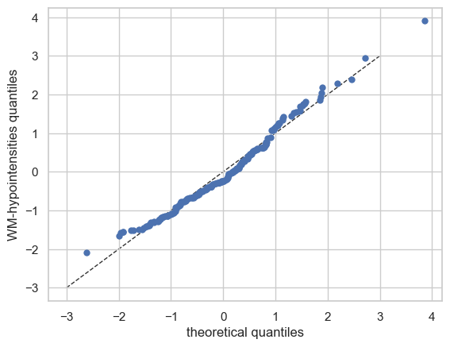
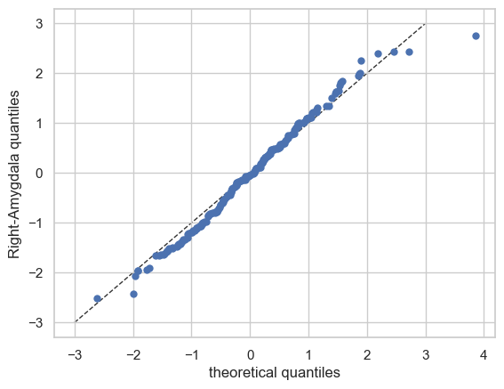
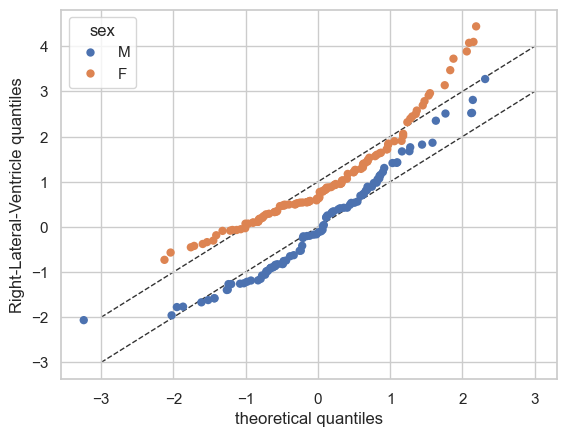
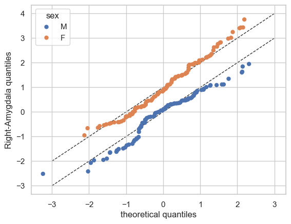
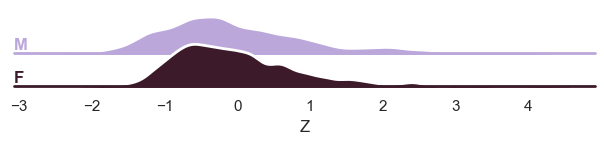
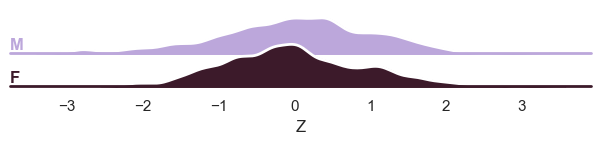

Normative Modelling: Bayesian Linear Regression
===============================================

Welcome to this tutorial notebook that will go through the fitting,
evaluation, transfering, and extending of Normative models with Bayesian
Linear Regression.

Let’s jump right in.

Imports
~~~~~~~

.. code:: ipython3

    import warnings
    import logging
    
    
    import pandas as pd
    import matplotlib.pyplot as plt
    from pcntoolkit import (
        BLR,
        BsplineBasisFunction,
        NormativeModel,
        NormData,
        load_fcon1000,
        plot_centiles,
        plot_qq,
        plot_ridge,
    )
    
    import pcntoolkit.util.output
    import seaborn as sns
    
    sns.set_style("darkgrid")
    
    # Suppress some annoying warnings and logs
    pymc_logger = logging.getLogger("pymc")
    
    pymc_logger.setLevel(logging.WARNING)
    pymc_logger.propagate = False
    
    warnings.simplefilter(action="ignore", category=FutureWarning)
    pd.options.mode.chained_assignment = None  # default='warn'
    pcntoolkit.util.output.Output.set_show_messages(False)

Load data
---------

First we download a small example dataset from github.

.. code:: ipython3

    # Download an example dataset
    norm_data: NormData = load_fcon1000()
    
    # Select only a few features
    features_to_model = [
        "WM-hypointensities",
        "Right-Lateral-Ventricle",
        "Right-Amygdala",
        "CortexVol",
    ]
    norm_data = norm_data.sel({"response_vars": features_to_model})
    
    # Split into train and test sets
    train, test = norm_data.train_test_split()

.. code:: ipython3

    # Visualize the data
    feature_to_plot = features_to_model[1]
    df = train.to_dataframe()
    fig, ax = plt.subplots(1, 2, figsize=(15, 5))
    
    sns.countplot(data=df, y=("batch_effects", "site"), hue=("batch_effects", "sex"), ax=ax[0], orient="h")
    ax[0].legend(title="Sex")
    ax[0].set_title("Count of sites")
    ax[0].set_xlabel("Site")
    ax[0].set_ylabel("Count")
    
    
    sns.scatterplot(
        data=df,
        x=("X", "age"),
        y=("Y", feature_to_plot),
        hue=("batch_effects", "site"),
        style=("batch_effects", "sex"),
        ax=ax[1],
    )
    ax[1].legend([], [])
    ax[1].set_title(f"Scatter plot of age vs {feature_to_plot}")
    ax[1].set_xlabel("Age")
    ax[1].set_ylabel(feature_to_plot)
    
    plt.show()

.. image:: 02_BLR_files/02_BLR_6_0.png

Creating a Normative model
--------------------------

A normative model has a regression model for each response variable. We
provide a template regression model which is copied for each response
variable.

A template regression model can be anything that extends the
``RegressionModel``. We provide a number of built-in regression models,
but you can also create your own.

Here we use the ``BLR`` class, which implements a Bayesian Linear
Regression model.

The ``BLR`` class has a number of parameters that can be set,
determining whether and how batch effects are modeled, which basis
expansion to use, and more.

.. code:: ipython3

    template_blr = BLR(
        name="template",
        basis_function_mean=BsplineBasisFunction(
            degree=3, nknots=5
        ),  # We use a B-spline basis expansion for the mean, so the predicted mean is a smooth function of the covariates
        fixed_effect=True,  # By setting fixed_effect=True, we model offsets in the mean for each individual batch effect,
        heteroskedastic=True,  # We want the variance to be a function of the covariates too
        basis_function_var=BsplineBasisFunction(
            degree=3, nknots=5
        ),  # We use a B-spline basis expansion for the variance, so the predicted variance is a smooth function of the covariates
        fixed_effect_var=True,  # We model offsets in the variance for each individual batch effect,
        warp_name="warpsinharcsinh",  # We configure a sinh-arcsinh warp, so we can model flexible non-gaussian distributions
    )

After specifying the regression model, we can configure a normative
model.

A normative model has a number of configuration options: -
``savemodel``: Whether to save the model after fitting. -
``evaluate_model``: Whether to evaluate the model after fitting. -
``saveresults``: Whether to save the results after evaluation. -
``saveplots``: Whether to save the plots after fitting. - ``save_dir``:
The directory to save the model, results, and plots. - ``inscaler``: The
scaler to use for the input data. - ``outscaler``: The scaler to use for
the output data.

.. code:: ipython3

    model = NormativeModel(
        # The regression model to use for the normative model.
        template_regression_model=template_blr,
        # Whether to save the model after fitting.
        savemodel=True,
        # Whether to evaluate the model after fitting.
        evaluate_model=True,
        # Whether to save the results after evaluation.
        saveresults=True,
        # Whether to save the plots after fitting.
        saveplots=False,
        # The directory to save the model, results, and plots.
        save_dir="resources/hbr/save_dir",
        # The scaler to use for the input data. Can be either one of "standardize", "minmax", "robustminmax", "none"
        inscaler="standardize",
        # The scaler to use for the output data. Can be either one of "standardize", "minmax", "robustminmax", "none"
        outscaler="standardize",
    )

Fit the model
-------------

With all that configured, we can fit the model.

The ``fit_predict`` function will fit the model, evaluate it, and save
the results and plots (if so configured).

After that, it will compute Z-scores and centiles for the test set.

All results can be found in the save directory.

.. code:: ipython3

    model.fit_predict(train, test)

.. parsed-literal::

    /opt/anaconda3/envs/uv_refactor/lib/python3.12/site-packages/pcntoolkit/regression_model/blr.py:473: LinAlgWarning: Ill-conditioned matrix (rcond=4.15837e-19): result may not be accurate.
      invAXt: np.ndarray = linalg.solve(self.A, X.T, check_finite=False)
    /opt/anaconda3/envs/uv_refactor/lib/python3.12/site-packages/pcntoolkit/util/output.py:216: UserWarning: Process: 11408 - 2025-06-13 13:28:46 - Estimation of posterior distribution failed due to: 
    Matrix is not positive definite
      warnings.warn(message)
    /opt/anaconda3/envs/uv_refactor/lib/python3.12/site-packages/pcntoolkit/regression_model/blr.py:473: LinAlgWarning: Ill-conditioned matrix (rcond=4.15721e-19): result may not be accurate.
      invAXt: np.ndarray = linalg.solve(self.A, X.T, check_finite=False)
    /opt/anaconda3/envs/uv_refactor/lib/python3.12/site-packages/pcntoolkit/regression_model/blr.py:473: LinAlgWarning: Ill-conditioned matrix (rcond=1.28949e-19): result may not be accurate.
      invAXt: np.ndarray = linalg.solve(self.A, X.T, check_finite=False)
    /opt/anaconda3/envs/uv_refactor/lib/python3.12/site-packages/pcntoolkit/regression_model/blr.py:473: LinAlgWarning: Ill-conditioned matrix (rcond=4.07135e-19): result may not be accurate.
      invAXt: np.ndarray = linalg.solve(self.A, X.T, check_finite=False)
    /opt/anaconda3/envs/uv_refactor/lib/python3.12/site-packages/scipy/optimize/_numdiff.py:619: RuntimeWarning: overflow encountered in divide
      J_transposed[i] = df / dx
    /opt/anaconda3/envs/uv_refactor/lib/python3.12/site-packages/pcntoolkit/regression_model/blr.py:473: LinAlgWarning: Ill-conditioned matrix (rcond=4.00235e-19): result may not be accurate.
      invAXt: np.ndarray = linalg.solve(self.A, X.T, check_finite=False)
    /opt/anaconda3/envs/uv_refactor/lib/python3.12/site-packages/pcntoolkit/regression_model/blr.py:473: LinAlgWarning: Ill-conditioned matrix (rcond=4.05067e-19): result may not be accurate.
      invAXt: np.ndarray = linalg.solve(self.A, X.T, check_finite=False)
    /opt/anaconda3/envs/uv_refactor/lib/python3.12/site-packages/pcntoolkit/regression_model/blr.py:473: LinAlgWarning: Ill-conditioned matrix (rcond=4.14444e-19): result may not be accurate.
      invAXt: np.ndarray = linalg.solve(self.A, X.T, check_finite=False)
    /opt/anaconda3/envs/uv_refactor/lib/python3.12/site-packages/pcntoolkit/regression_model/blr.py:473: LinAlgWarning: Ill-conditioned matrix (rcond=2.24365e-19): result may not be accurate.
      invAXt: np.ndarray = linalg.solve(self.A, X.T, check_finite=False)
    /opt/anaconda3/envs/uv_refactor/lib/python3.12/site-packages/pcntoolkit/regression_model/blr.py:473: LinAlgWarning: Ill-conditioned matrix (rcond=3.76264e-19): result may not be accurate.
      invAXt: np.ndarray = linalg.solve(self.A, X.T, check_finite=False)
    /opt/anaconda3/envs/uv_refactor/lib/python3.12/site-packages/pcntoolkit/regression_model/blr.py:473: LinAlgWarning: Ill-conditioned matrix (rcond=4.15791e-19): result may not be accurate.
      invAXt: np.ndarray = linalg.solve(self.A, X.T, check_finite=False)
    /opt/anaconda3/envs/uv_refactor/lib/python3.12/site-packages/pcntoolkit/regression_model/blr.py:473: LinAlgWarning: Ill-conditioned matrix (rcond=4.15826e-19): result may not be accurate.
      invAXt: np.ndarray = linalg.solve(self.A, X.T, check_finite=False)
    /opt/anaconda3/envs/uv_refactor/lib/python3.12/site-packages/pcntoolkit/regression_model/blr.py:473: LinAlgWarning: Ill-conditioned matrix (rcond=4.73719e-20): result may not be accurate.
      invAXt: np.ndarray = linalg.solve(self.A, X.T, check_finite=False)
    /opt/anaconda3/envs/uv_refactor/lib/python3.12/site-packages/pcntoolkit/regression_model/blr.py:473: LinAlgWarning: Ill-conditioned matrix (rcond=4.03274e-19): result may not be accurate.
      invAXt: np.ndarray = linalg.solve(self.A, X.T, check_finite=False)
    /opt/anaconda3/envs/uv_refactor/lib/python3.12/site-packages/pcntoolkit/regression_model/blr.py:473: LinAlgWarning: Ill-conditioned matrix (rcond=4.15569e-19): result may not be accurate.
      invAXt: np.ndarray = linalg.solve(self.A, X.T, check_finite=False)
    /opt/anaconda3/envs/uv_refactor/lib/python3.12/site-packages/pcntoolkit/regression_model/blr.py:473: LinAlgWarning: Ill-conditioned matrix (rcond=3.87688e-19): result may not be accurate.
      invAXt: np.ndarray = linalg.solve(self.A, X.T, check_finite=False)
    /opt/anaconda3/envs/uv_refactor/lib/python3.12/site-packages/pcntoolkit/regression_model/blr.py:473: LinAlgWarning: Ill-conditioned matrix (rcond=4.15836e-19): result may not be accurate.
      invAXt: np.ndarray = linalg.solve(self.A, X.T, check_finite=False)
    /opt/anaconda3/envs/uv_refactor/lib/python3.12/site-packages/pcntoolkit/regression_model/blr.py:473: LinAlgWarning: Ill-conditioned matrix (rcond=4.15662e-19): result may not be accurate.
      invAXt: np.ndarray = linalg.solve(self.A, X.T, check_finite=False)
    /opt/anaconda3/envs/uv_refactor/lib/python3.12/site-packages/pcntoolkit/regression_model/blr.py:473: LinAlgWarning: Ill-conditioned matrix (rcond=1.18401e-21): result may not be accurate.
      invAXt: np.ndarray = linalg.solve(self.A, X.T, check_finite=False)
    /opt/anaconda3/envs/uv_refactor/lib/python3.12/site-packages/pcntoolkit/regression_model/blr.py:473: LinAlgWarning: Ill-conditioned matrix (rcond=3.39389e-19): result may not be accurate.
      invAXt: np.ndarray = linalg.solve(self.A, X.T, check_finite=False)
    /opt/anaconda3/envs/uv_refactor/lib/python3.12/site-packages/pcntoolkit/regression_model/blr.py:473: LinAlgWarning: Ill-conditioned matrix (rcond=6.47114e-20): result may not be accurate.
      invAXt: np.ndarray = linalg.solve(self.A, X.T, check_finite=False)
    /opt/anaconda3/envs/uv_refactor/lib/python3.12/site-packages/pcntoolkit/regression_model/blr.py:473: LinAlgWarning: Ill-conditioned matrix (rcond=1.39525e-19): result may not be accurate.
      invAXt: np.ndarray = linalg.solve(self.A, X.T, check_finite=False)
    /opt/anaconda3/envs/uv_refactor/lib/python3.12/site-packages/pcntoolkit/regression_model/blr.py:473: LinAlgWarning: Ill-conditioned matrix (rcond=5.21514e-20): result may not be accurate.
      invAXt: np.ndarray = linalg.solve(self.A, X.T, check_finite=False)
    /opt/anaconda3/envs/uv_refactor/lib/python3.12/site-packages/pcntoolkit/regression_model/blr.py:473: LinAlgWarning: Ill-conditioned matrix (rcond=4.15784e-19): result may not be accurate.
      invAXt: np.ndarray = linalg.solve(self.A, X.T, check_finite=False)
    /opt/anaconda3/envs/uv_refactor/lib/python3.12/site-packages/pcntoolkit/regression_model/blr.py:473: LinAlgWarning: Ill-conditioned matrix (rcond=4.15806e-19): result may not be accurate.
      invAXt: np.ndarray = linalg.solve(self.A, X.T, check_finite=False)
    /opt/anaconda3/envs/uv_refactor/lib/python3.12/site-packages/pcntoolkit/regression_model/blr.py:473: LinAlgWarning: Ill-conditioned matrix (rcond=4.38197e-19): result may not be accurate.
      invAXt: np.ndarray = linalg.solve(self.A, X.T, check_finite=False)
    /opt/anaconda3/envs/uv_refactor/lib/python3.12/site-packages/pcntoolkit/regression_model/blr.py:473: LinAlgWarning: Ill-conditioned matrix (rcond=6.04313e-24): result may not be accurate.
      invAXt: np.ndarray = linalg.solve(self.A, X.T, check_finite=False)
    /opt/anaconda3/envs/uv_refactor/lib/python3.12/site-packages/pcntoolkit/util/output.py:216: UserWarning: Process: 11408 - 2025-06-13 13:28:48 - Estimation of posterior distribution failed due to: 
    Matrix is not positive definite
      warnings.warn(message)
    /opt/anaconda3/envs/uv_refactor/lib/python3.12/site-packages/pcntoolkit/regression_model/blr.py:473: LinAlgWarning: Ill-conditioned matrix (rcond=6.03622e-24): result may not be accurate.
      invAXt: np.ndarray = linalg.solve(self.A, X.T, check_finite=False)
    /opt/anaconda3/envs/uv_refactor/lib/python3.12/site-packages/pcntoolkit/regression_model/blr.py:473: LinAlgWarning: Ill-conditioned matrix (rcond=5.80859e-24): result may not be accurate.
      invAXt: np.ndarray = linalg.solve(self.A, X.T, check_finite=False)
    /opt/anaconda3/envs/uv_refactor/lib/python3.12/site-packages/pcntoolkit/regression_model/blr.py:473: LinAlgWarning: Ill-conditioned matrix (rcond=5.75186e-24): result may not be accurate.
      invAXt: np.ndarray = linalg.solve(self.A, X.T, check_finite=False)
    /opt/anaconda3/envs/uv_refactor/lib/python3.12/site-packages/pcntoolkit/regression_model/blr.py:473: LinAlgWarning: Ill-conditioned matrix (rcond=5.98335e-24): result may not be accurate.
      invAXt: np.ndarray = linalg.solve(self.A, X.T, check_finite=False)
    /opt/anaconda3/envs/uv_refactor/lib/python3.12/site-packages/pcntoolkit/regression_model/blr.py:473: LinAlgWarning: Ill-conditioned matrix (rcond=6.04311e-24): result may not be accurate.
      invAXt: np.ndarray = linalg.solve(self.A, X.T, check_finite=False)
    /opt/anaconda3/envs/uv_refactor/lib/python3.12/site-packages/pcntoolkit/regression_model/blr.py:473: LinAlgWarning: Ill-conditioned matrix (rcond=5.46805e-24): result may not be accurate.
      invAXt: np.ndarray = linalg.solve(self.A, X.T, check_finite=False)
    /opt/anaconda3/envs/uv_refactor/lib/python3.12/site-packages/pcntoolkit/regression_model/blr.py:473: LinAlgWarning: Ill-conditioned matrix (rcond=6.043e-24): result may not be accurate.
      invAXt: np.ndarray = linalg.solve(self.A, X.T, check_finite=False)
    /opt/anaconda3/envs/uv_refactor/lib/python3.12/site-packages/pcntoolkit/regression_model/blr.py:473: LinAlgWarning: Ill-conditioned matrix (rcond=5.46821e-24): result may not be accurate.
      invAXt: np.ndarray = linalg.solve(self.A, X.T, check_finite=False)
    /opt/anaconda3/envs/uv_refactor/lib/python3.12/site-packages/pcntoolkit/regression_model/blr.py:473: LinAlgWarning: Ill-conditioned matrix (rcond=6.04309e-24): result may not be accurate.
      invAXt: np.ndarray = linalg.solve(self.A, X.T, check_finite=False)
    /opt/anaconda3/envs/uv_refactor/lib/python3.12/site-packages/pcntoolkit/regression_model/blr.py:473: LinAlgWarning: Ill-conditioned matrix (rcond=6.04312e-24): result may not be accurate.
      invAXt: np.ndarray = linalg.solve(self.A, X.T, check_finite=False)
    /opt/anaconda3/envs/uv_refactor/lib/python3.12/site-packages/pcntoolkit/regression_model/blr.py:473: LinAlgWarning: Ill-conditioned matrix (rcond=6.67869e-24): result may not be accurate.
      invAXt: np.ndarray = linalg.solve(self.A, X.T, check_finite=False)

.. raw:: html

    
<svg style="position: absolute; width: 0; height: 0; overflow: hidden">
    <defs>
    <symbol id="icon-database" viewBox="0 0 32 32">
    <path d="M16 0c-8.837 0-16 2.239-16 5v4c0 2.761 7.163 5 16 5s16-2.239 16-5v-4c0-2.761-7.163-5-16-5z"></path>
    <path d="M16 17c-8.837 0-16-2.239-16-5v6c0 2.761 7.163 5 16 5s16-2.239 16-5v-6c0 2.761-7.163 5-16 5z"></path>
    <path d="M16 26c-8.837 0-16-2.239-16-5v6c0 2.761 7.163 5 16 5s16-2.239 16-5v-6c0 2.761-7.163 5-16 5z"></path>
    </symbol>
    <symbol id="icon-file-text2" viewBox="0 0 32 32">
    <path d="M28.681 7.159c-0.694-0.947-1.662-2.053-2.724-3.116s-2.169-2.030-3.116-2.724c-1.612-1.182-2.393-1.319-2.841-1.319h-15.5c-1.378 0-2.5 1.121-2.5 2.5v27c0 1.378 1.122 2.5 2.5 2.5h23c1.378 0 2.5-1.122 2.5-2.5v-19.5c0-0.448-0.137-1.23-1.319-2.841zM24.543 5.457c0.959 0.959 1.712 1.825 2.268 2.543h-4.811v-4.811c0.718 0.556 1.584 1.309 2.543 2.268zM28 29.5c0 0.271-0.229 0.5-0.5 0.5h-23c-0.271 0-0.5-0.229-0.5-0.5v-27c0-0.271 0.229-0.5 0.5-0.5 0 0 15.499-0 15.5 0v7c0 0.552 0.448 1 1 1h7v19.5z"></path>
    <path d="M23 26h-14c-0.552 0-1-0.448-1-1s0.448-1 1-1h14c0.552 0 1 0.448 1 1s-0.448 1-1 1z"></path>
    <path d="M23 22h-14c-0.552 0-1-0.448-1-1s0.448-1 1-1h14c0.552 0 1 0.448 1 1s-0.448 1-1 1z"></path>
    <path d="M23 18h-14c-0.552 0-1-0.448-1-1s0.448-1 1-1h14c0.552 0 1 0.448 1 1s-0.448 1-1 1z"></path>
    </symbol>
    </defs>
    </svg>
    <pre class='xr-text-repr-fallback'>&lt;xarray.NormData&gt; Size: 105kB
    Dimensions:            (observations: 216, response_vars: 4, covariates: 1,
                            batch_effect_dims: 2, centile: 5, statistic: 10)
    Coordinates:
      * observations       (observations) int64 2kB 756 769 692 616 ... 751 470 1043
      * response_vars      (response_vars) &lt;U23 368B &#x27;WM-hypointensities&#x27; ... &#x27;Co...
      * covariates         (covariates) &lt;U3 12B &#x27;age&#x27;
      * batch_effect_dims  (batch_effect_dims) &lt;U4 32B &#x27;sex&#x27; &#x27;site&#x27;
      * centile            (centile) float64 40B 0.05 0.25 0.5 0.75 0.95
      * statistic          (statistic) &lt;U8 320B &#x27;MACE&#x27; &#x27;MAPE&#x27; ... &#x27;SMSE&#x27; &#x27;ShapiroW&#x27;
    Data variables:
        subjects           (observations) object 2kB &#x27;Munchen_sub96752&#x27; ... &#x27;Quee...
        Y                  (observations, response_vars) float64 7kB 2.721e+03 .....
        X                  (observations, covariates) float64 2kB 63.0 ... 23.0
        batch_effects      (observations, batch_effect_dims) &lt;U17 29kB &#x27;F&#x27; ... &#x27;Q...
        Z                  (observations, response_vars) float64 7kB 0.8763 ... -...
        centiles           (centile, observations, response_vars) float64 35kB 1....
        logp               (observations, response_vars) float64 7kB -1.024 ... -...
        Yhat               (observations, response_vars) float64 7kB 0.7117 ... 0...
        statistics         (response_vars, statistic) float64 320B 0.117 ... 0.9924
        Y_harmonized       (observations, response_vars) float64 7kB 2.715e+03 .....
    Attributes:
        real_ids:                       True
        is_scaled:                      False
        name:                           fcon1000_test
        unique_batch_effects:           {&#x27;sex&#x27;: [&#x27;F&#x27;, &#x27;M&#x27;], &#x27;site&#x27;: [&#x27;AnnArbor_a&#x27;...
        batch_effect_counts:            {&#x27;sex&#x27;: {&#x27;F&#x27;: 589, &#x27;M&#x27;: 489}, &#x27;site&#x27;: {&#x27;A...
        batch_effect_covariate_ranges:  {&#x27;sex&#x27;: {&#x27;F&#x27;: {&#x27;age&#x27;: {&#x27;min&#x27;: 7.88, &#x27;max&#x27;...
        covariate_ranges:               {&#x27;age&#x27;: {&#x27;min&#x27;: 7.88, &#x27;max&#x27;: 85.0}}</pre>

xarray.NormData

<ul class='xr-sections'><li class='xr-section-item'><input id='section-0e9098b4-5e74-45ed-a672-46f86ca35274' class='xr-section-summary-in' type='checkbox' disabled ><label for='section-0e9098b4-5e74-45ed-a672-46f86ca35274' class='xr-section-summary'  title='Expand/collapse section'>Dimensions:</label>
<ul class='xr-dim-list'><li>observations: 216</li><li>response_vars: 4</li><li>covariates: 1</li><li>batch_effect_dims: 2</li><li>centile: 5</li><li>statistic: 10</li></ul>

</li><li class='xr-section-item'><input id='section-185c758e-8419-4885-8eda-3df1f3773586' class='xr-section-summary-in' type='checkbox'  checked><label for='section-185c758e-8419-4885-8eda-3df1f3773586' class='xr-section-summary' >Coordinates: (6)</label>

<ul class='xr-var-list'><li class='xr-var-item'>
observations

(observations)

int64

756 769 692 616 ... 751 470 1043
<input id='attrs-f5f0f81c-d9c7-4bcd-8450-aeead4b352af' class='xr-var-attrs-in' type='checkbox' disabled><label for='attrs-f5f0f81c-d9c7-4bcd-8450-aeead4b352af' title='Show/Hide attributes'><svg class='icon xr-icon-file-text2'><use xlink:href='#icon-file-text2'></use></svg></label><input id='data-67968a59-a28c-4bd3-8753-0dd8f69c0efb' class='xr-var-data-in' type='checkbox'><label for='data-67968a59-a28c-4bd3-8753-0dd8f69c0efb' title='Show/Hide data repr'><svg class='icon xr-icon-database'><use xlink:href='#icon-database'></use></svg></label>
<dl class='xr-attrs'></dl>

<pre>array([ 756,  769,  692, ...,  751,  470, 1043])</pre>
</li><li class='xr-var-item'>
response_vars

(response_vars)

&lt;U23

&#x27;WM-hypointensities&#x27; ... &#x27;Cortex...
<input id='attrs-086046ec-6d60-4a45-8200-b45feb2c309f' class='xr-var-attrs-in' type='checkbox' disabled><label for='attrs-086046ec-6d60-4a45-8200-b45feb2c309f' title='Show/Hide attributes'><svg class='icon xr-icon-file-text2'><use xlink:href='#icon-file-text2'></use></svg></label><input id='data-07727571-8813-4b9c-8e26-3a6186b1f7ba' class='xr-var-data-in' type='checkbox'><label for='data-07727571-8813-4b9c-8e26-3a6186b1f7ba' title='Show/Hide data repr'><svg class='icon xr-icon-database'><use xlink:href='#icon-database'></use></svg></label>
<dl class='xr-attrs'></dl>

<pre>array([&#x27;WM-hypointensities&#x27;, &#x27;Right-Lateral-Ventricle&#x27;, &#x27;Right-Amygdala&#x27;,
           &#x27;CortexVol&#x27;], dtype=&#x27;&lt;U23&#x27;)</pre>
</li><li class='xr-var-item'>
covariates

(covariates)

&lt;U3

&#x27;age&#x27;
<input id='attrs-e1e556e7-5240-41ac-8fc4-d3f7a90da57e' class='xr-var-attrs-in' type='checkbox' disabled><label for='attrs-e1e556e7-5240-41ac-8fc4-d3f7a90da57e' title='Show/Hide attributes'><svg class='icon xr-icon-file-text2'><use xlink:href='#icon-file-text2'></use></svg></label><input id='data-a4702f3b-612c-415c-b503-b59d9fbbd8fb' class='xr-var-data-in' type='checkbox'><label for='data-a4702f3b-612c-415c-b503-b59d9fbbd8fb' title='Show/Hide data repr'><svg class='icon xr-icon-database'><use xlink:href='#icon-database'></use></svg></label>
<dl class='xr-attrs'></dl>

<pre>array([&#x27;age&#x27;], dtype=&#x27;&lt;U3&#x27;)</pre>
</li><li class='xr-var-item'>
batch_effect_dims

(batch_effect_dims)

&lt;U4

&#x27;sex&#x27; &#x27;site&#x27;
<input id='attrs-ecfb262d-129a-4ac4-8951-bd5a3273eb23' class='xr-var-attrs-in' type='checkbox' disabled><label for='attrs-ecfb262d-129a-4ac4-8951-bd5a3273eb23' title='Show/Hide attributes'><svg class='icon xr-icon-file-text2'><use xlink:href='#icon-file-text2'></use></svg></label><input id='data-1b2b59ec-2910-4537-a785-a638f492e4b1' class='xr-var-data-in' type='checkbox'><label for='data-1b2b59ec-2910-4537-a785-a638f492e4b1' title='Show/Hide data repr'><svg class='icon xr-icon-database'><use xlink:href='#icon-database'></use></svg></label>
<dl class='xr-attrs'></dl>

<pre>array([&#x27;sex&#x27;, &#x27;site&#x27;], dtype=&#x27;&lt;U4&#x27;)</pre>
</li><li class='xr-var-item'>
centile

(centile)

float64

0.05 0.25 0.5 0.75 0.95
<input id='attrs-29b37af1-d459-4e7a-979b-dba6a0b7a77e' class='xr-var-attrs-in' type='checkbox' disabled><label for='attrs-29b37af1-d459-4e7a-979b-dba6a0b7a77e' title='Show/Hide attributes'><svg class='icon xr-icon-file-text2'><use xlink:href='#icon-file-text2'></use></svg></label><input id='data-03c26ad6-f906-4ced-9127-db23b444381e' class='xr-var-data-in' type='checkbox'><label for='data-03c26ad6-f906-4ced-9127-db23b444381e' title='Show/Hide data repr'><svg class='icon xr-icon-database'><use xlink:href='#icon-database'></use></svg></label>
<dl class='xr-attrs'></dl>

<pre>array([0.05, 0.25, 0.5 , 0.75, 0.95])</pre>
</li><li class='xr-var-item'>
statistic

(statistic)

&lt;U8

&#x27;MACE&#x27; &#x27;MAPE&#x27; ... &#x27;SMSE&#x27; &#x27;ShapiroW&#x27;
<input id='attrs-6be5b4ce-b4bb-4748-88c7-c34e3f13d2d6' class='xr-var-attrs-in' type='checkbox' disabled><label for='attrs-6be5b4ce-b4bb-4748-88c7-c34e3f13d2d6' title='Show/Hide attributes'><svg class='icon xr-icon-file-text2'><use xlink:href='#icon-file-text2'></use></svg></label><input id='data-62d8349f-3f98-4968-9a85-2d64b5348af2' class='xr-var-data-in' type='checkbox'><label for='data-62d8349f-3f98-4968-9a85-2d64b5348af2' title='Show/Hide data repr'><svg class='icon xr-icon-database'><use xlink:href='#icon-database'></use></svg></label>
<dl class='xr-attrs'></dl>

<pre>array([&#x27;MACE&#x27;, &#x27;MAPE&#x27;, &#x27;MSLL&#x27;, &#x27;NLL&#x27;, &#x27;R2&#x27;, &#x27;RMSE&#x27;, &#x27;Rho&#x27;, &#x27;Rho_p&#x27;, &#x27;SMSE&#x27;,
           &#x27;ShapiroW&#x27;], dtype=&#x27;&lt;U8&#x27;)</pre>
</li></ul>
</li><li class='xr-section-item'><input id='section-780fbe50-d9a6-4089-890b-a49ddbcf9a32' class='xr-section-summary-in' type='checkbox'  checked><label for='section-780fbe50-d9a6-4089-890b-a49ddbcf9a32' class='xr-section-summary' >Data variables: (10)</label>

<ul class='xr-var-list'><li class='xr-var-item'>
subjects

(observations)

object

&#x27;Munchen_sub96752&#x27; ... &#x27;Queensla...
<input id='attrs-423ddd96-cf2b-4e25-a007-c911b64727f5' class='xr-var-attrs-in' type='checkbox' disabled><label for='attrs-423ddd96-cf2b-4e25-a007-c911b64727f5' title='Show/Hide attributes'><svg class='icon xr-icon-file-text2'><use xlink:href='#icon-file-text2'></use></svg></label><input id='data-a18d48da-8826-4ffd-b3f6-c52ec734b558' class='xr-var-data-in' type='checkbox'><label for='data-a18d48da-8826-4ffd-b3f6-c52ec734b558' title='Show/Hide data repr'><svg class='icon xr-icon-database'><use xlink:href='#icon-database'></use></svg></label>
<dl class='xr-attrs'></dl>

<pre>array([&#x27;Munchen_sub96752&#x27;, &#x27;NewYork_a_sub18638&#x27;, &#x27;Leiden_2200_sub87320&#x27;,
           &#x27;ICBM_sub47658&#x27;, &#x27;AnnArbor_b_sub45569&#x27;, &#x27;Beijing_Zang_sub18960&#x27;,
           &#x27;Leiden_2200_sub18456&#x27;, &#x27;Berlin_Margulies_sub27711&#x27;,
           &#x27;Beijing_Zang_sub87776&#x27;, &#x27;Milwaukee_b_sub63196&#x27;,
           &#x27;Beijing_Zang_sub07144&#x27;, &#x27;Atlanta_sub76280&#x27;,
           &#x27;Beijing_Zang_sub40037&#x27;, &#x27;Cambridge_Buckner_sub17737&#x27;,
           &#x27;ICBM_sub89049&#x27;, &#x27;ICBM_sub55656&#x27;, &#x27;Oulu_sub45566&#x27;,
           &#x27;Beijing_Zang_sub89088&#x27;, &#x27;Atlanta_sub16563&#x27;,
           &#x27;Cambridge_Buckner_sub51172&#x27;, &#x27;Oulu_sub98739&#x27;,
           &#x27;Queensland_sub49845&#x27;, &#x27;Cambridge_Buckner_sub84256&#x27;,
           &#x27;Cleveland_sub80263&#x27;, &#x27;ICBM_sub16607&#x27;, &#x27;Newark_sub46570&#x27;,
           &#x27;NewYork_a_sub88286&#x27;, &#x27;Cambridge_Buckner_sub02591&#x27;,
           &#x27;Oulu_sub66467&#x27;, &#x27;Beijing_Zang_sub74386&#x27;, &#x27;Newark_sub55760&#x27;,
           &#x27;ICBM_sub30623&#x27;, &#x27;Oulu_sub68752&#x27;, &#x27;Leiden_2180_sub19281&#x27;,
           &#x27;Beijing_Zang_sub50972&#x27;, &#x27;Beijing_Zang_sub85030&#x27;,
           &#x27;Milwaukee_b_sub36386&#x27;, &#x27;Baltimore_sub31837&#x27;, &#x27;PaloAlto_sub84978&#x27;,
           &#x27;Oulu_sub01077&#x27;, &#x27;NewYork_a_ADHD_sub54828&#x27;, &#x27;PaloAlto_sub96705&#x27;,
           &#x27;Cambridge_Buckner_sub40635&#x27;, &#x27;ICBM_sub66794&#x27;,
           &#x27;Beijing_Zang_sub46541&#x27;, &#x27;Beijing_Zang_sub87089&#x27;,
           &#x27;Pittsburgh_sub97823&#x27;, &#x27;Beijing_Zang_sub98617&#x27;, &#x27;ICBM_sub92028&#x27;,
    ...
           &#x27;Leiden_2200_sub04484&#x27;, &#x27;Beijing_Zang_sub80163&#x27;, &#x27;ICBM_sub02382&#x27;,
           &#x27;Cambridge_Buckner_sub77435&#x27;, &#x27;NewYork_a_sub54887&#x27;,
           &#x27;Oulu_sub85532&#x27;, &#x27;Baltimore_sub73823&#x27;, &#x27;Beijing_Zang_sub29590&#x27;,
           &#x27;Oulu_sub99718&#x27;, &#x27;Beijing_Zang_sub08455&#x27;, &#x27;Beijing_Zang_sub85543&#x27;,
           &#x27;Cambridge_Buckner_sub45354&#x27;, &#x27;Beijing_Zang_sub07717&#x27;,
           &#x27;Baltimore_sub76160&#x27;, &#x27;Beijing_Zang_sub17093&#x27;,
           &#x27;AnnArbor_b_sub90127&#x27;, &#x27;SaintLouis_sub73002&#x27;,
           &#x27;Queensland_sub93238&#x27;, &#x27;Cleveland_sub34189&#x27;,
           &#x27;Cambridge_Buckner_sub89107&#x27;, &#x27;Atlanta_sub75153&#x27;,
           &#x27;NewYork_a_ADHD_sub73035&#x27;, &#x27;Cambridge_Buckner_sub59434&#x27;,
           &#x27;Milwaukee_b_sub44912&#x27;, &#x27;Cleveland_sub46739&#x27;, &#x27;Oulu_sub20495&#x27;,
           &#x27;SaintLouis_sub28304&#x27;, &#x27;Cambridge_Buckner_sub35430&#x27;,
           &#x27;Oulu_sub86362&#x27;, &#x27;Newark_sub58526&#x27;, &#x27;Leiden_2180_sub12255&#x27;,
           &#x27;ICBM_sub48210&#x27;, &#x27;Cambridge_Buckner_sub77989&#x27;,
           &#x27;Berlin_Margulies_sub75506&#x27;, &#x27;NewYork_a_sub29216&#x27;,
           &#x27;Beijing_Zang_sub05267&#x27;, &#x27;AnnArbor_b_sub18546&#x27;, &#x27;Oulu_sub75620&#x27;,
           &#x27;AnnArbor_b_sub30250&#x27;, &#x27;Berlin_Margulies_sub86111&#x27;,
           &#x27;Beijing_Zang_sub89592&#x27;, &#x27;Beijing_Zang_sub68012&#x27;,
           &#x27;NewYork_a_sub50559&#x27;, &#x27;Munchen_sub66933&#x27;,
           &#x27;Cambridge_Buckner_sub59729&#x27;, &#x27;Queensland_sub86245&#x27;], dtype=object)</pre>
</li><li class='xr-var-item'>
Y

(observations, response_vars)

float64

2.721e+03 1.289e+04 ... 5.035e+05
<input id='attrs-48d9cdc6-1590-4913-b56b-1cd5bb423c0f' class='xr-var-attrs-in' type='checkbox' disabled><label for='attrs-48d9cdc6-1590-4913-b56b-1cd5bb423c0f' title='Show/Hide attributes'><svg class='icon xr-icon-file-text2'><use xlink:href='#icon-file-text2'></use></svg></label><input id='data-10671f1e-7684-4d62-9d2f-5010c8d857b7' class='xr-var-data-in' type='checkbox'><label for='data-10671f1e-7684-4d62-9d2f-5010c8d857b7' title='Show/Hide data repr'><svg class='icon xr-icon-database'><use xlink:href='#icon-database'></use></svg></label>
<dl class='xr-attrs'></dl>

<pre>array([[2.72140000e+03, 1.28916000e+04, 1.43940000e+03, 4.57858328e+05],
           [1.14310000e+03, 9.91910000e+03, 1.64970000e+03, 5.26780362e+05],
           [9.55800000e+02, 7.47730000e+03, 1.83850000e+03, 4.95744471e+05],
           [1.47390000e+03, 1.43021000e+04, 1.86770000e+03, 5.85303839e+05],
           [7.57800000e+02, 4.11930000e+03, 1.32500000e+03, 3.33111552e+05],
           [8.71100000e+02, 5.03090000e+03, 1.90730000e+03, 5.10794940e+05],
           [1.20730000e+03, 1.78664000e+04, 2.02220000e+03, 5.50533325e+05],
           [5.95000000e+02, 5.00790000e+03, 2.01070000e+03, 4.67673977e+05],
           [6.82400000e+02, 7.28660000e+03, 1.45630000e+03, 4.60129533e+05],
           [4.45100000e+02, 5.74290000e+03, 1.47450000e+03, 4.44494817e+05],
           [1.62000000e+03, 3.71370000e+03, 2.00110000e+03, 5.59424624e+05],
           [6.02800000e+02, 5.30120000e+03, 1.36100000e+03, 4.21551234e+05],
           [1.43250000e+03, 4.42970000e+03, 1.65080000e+03, 5.19842763e+05],
           [1.90820000e+03, 3.57810000e+03, 1.88370000e+03, 5.06679262e+05],
           [1.83400000e+03, 3.27190000e+03, 2.05120000e+03, 5.35569987e+05],
           [4.59600000e+02, 3.98580000e+03, 1.45470000e+03, 4.67607555e+05],
           [1.21000000e+03, 8.72130000e+03, 1.71430000e+03, 5.30904612e+05],
           [8.45900000e+02, 6.59310000e+03, 1.61900000e+03, 5.09371867e+05],
           [9.95200000e+02, 7.04020000e+03, 1.99490000e+03, 4.60068379e+05],
           [1.73470000e+03, 4.01480000e+03, 1.51620000e+03, 4.87269373e+05],
    ...
           [7.85800000e+02, 5.70900000e+03, 1.47480000e+03, 4.53982166e+05],
           [2.24010000e+03, 4.36660000e+03, 2.04210000e+03, 5.58453123e+05],
           [7.58100000e+02, 6.52980000e+03, 1.56730000e+03, 4.73575183e+05],
           [1.44050000e+03, 6.70530000e+03, 1.20540000e+03, 3.82788491e+05],
           [8.18600000e+02, 9.38330000e+03, 1.96740000e+03, 5.02713911e+05],
           [3.76990000e+03, 1.58644000e+04, 1.79170000e+03, 5.12490348e+05],
           [8.80200000e+02, 4.37020000e+03, 1.75520000e+03, 4.37300069e+05],
           [8.23900000e+02, 6.37900000e+03, 1.57650000e+03, 5.67331908e+05],
           [2.11390000e+03, 1.07225000e+04, 1.84380000e+03, 5.12273764e+05],
           [7.41900000e+02, 8.80170000e+03, 1.60640000e+03, 4.91973562e+05],
           [1.33390000e+03, 6.98000000e+03, 1.74850000e+03, 4.78907154e+05],
           [7.07300000e+02, 5.68070000e+03, 1.53450000e+03, 4.74077083e+05],
           [1.13410000e+03, 5.59220000e+03, 1.62620000e+03, 4.54163909e+05],
           [4.38600000e+02, 6.33000000e+03, 1.59670000e+03, 4.68067037e+05],
           [9.66300000e+02, 9.21550000e+03, 1.78250000e+03, 5.09199708e+05],
           [4.24300000e+02, 4.51110000e+03, 1.70200000e+03, 5.26635258e+05],
           [6.04700000e+02, 7.59080000e+03, 1.69930000e+03, 5.20499663e+05],
           [2.34320000e+03, 1.71923000e+04, 1.79380000e+03, 4.86680791e+05],
           [2.72170000e+03, 6.08600000e+03, 2.32470000e+03, 6.10402006e+05],
           [7.03500000e+02, 1.07003000e+04, 1.67620000e+03, 5.03535771e+05]])</pre>
</li><li class='xr-var-item'>
X

(observations, covariates)

float64

63.0 23.27 22.0 ... 72.0 23.0 23.0
<input id='attrs-1db50d94-4c63-40c7-bc99-4328553c9a02' class='xr-var-attrs-in' type='checkbox' disabled><label for='attrs-1db50d94-4c63-40c7-bc99-4328553c9a02' title='Show/Hide attributes'><svg class='icon xr-icon-file-text2'><use xlink:href='#icon-file-text2'></use></svg></label><input id='data-99685797-740f-4bb0-bd0c-a4cc1d2f872c' class='xr-var-data-in' type='checkbox'><label for='data-99685797-740f-4bb0-bd0c-a4cc1d2f872c' title='Show/Hide data repr'><svg class='icon xr-icon-database'><use xlink:href='#icon-database'></use></svg></label>
<dl class='xr-attrs'></dl>

<pre>array([[63.  ],
           [23.27],
           [22.  ],
           [42.  ],
           [63.  ],
           [23.  ],
           [21.  ],
           [26.  ],
           [21.  ],
           [49.  ],
           [20.  ],
           [23.  ],
           [20.  ],
           [26.  ],
           [35.  ],
           [21.  ],
           [22.  ],
           [19.  ],
           [34.  ],
           [18.  ],
    ...
           [21.  ],
           [20.  ],
           [22.  ],
           [25.  ],
           [25.  ],
           [73.  ],
           [22.  ],
           [28.  ],
           [29.06],
           [19.  ],
           [20.  ],
           [22.  ],
           [19.  ],
           [24.  ],
           [21.  ],
           [24.  ],
           [22.79],
           [72.  ],
           [23.  ],
           [23.  ]])</pre>
</li><li class='xr-var-item'>
batch_effects

(observations, batch_effect_dims)

&lt;U17

&#x27;F&#x27; &#x27;Munchen&#x27; ... &#x27;M&#x27; &#x27;Queensland&#x27;
<input id='attrs-9a9240df-ce9d-478e-89ad-6e51bd9c312d' class='xr-var-attrs-in' type='checkbox' disabled><label for='attrs-9a9240df-ce9d-478e-89ad-6e51bd9c312d' title='Show/Hide attributes'><svg class='icon xr-icon-file-text2'><use xlink:href='#icon-file-text2'></use></svg></label><input id='data-a2b01564-e13f-44c6-96c1-9cfaccc19cae' class='xr-var-data-in' type='checkbox'><label for='data-a2b01564-e13f-44c6-96c1-9cfaccc19cae' title='Show/Hide data repr'><svg class='icon xr-icon-database'><use xlink:href='#icon-database'></use></svg></label>
<dl class='xr-attrs'></dl>

<pre>array([[&#x27;F&#x27;, &#x27;Munchen&#x27;],
           [&#x27;M&#x27;, &#x27;NewYork_a&#x27;],
           [&#x27;F&#x27;, &#x27;Leiden_2200&#x27;],
           [&#x27;M&#x27;, &#x27;ICBM&#x27;],
           [&#x27;F&#x27;, &#x27;AnnArbor_b&#x27;],
           [&#x27;M&#x27;, &#x27;Beijing_Zang&#x27;],
           [&#x27;M&#x27;, &#x27;Leiden_2200&#x27;],
           [&#x27;F&#x27;, &#x27;Berlin_Margulies&#x27;],
           [&#x27;F&#x27;, &#x27;Beijing_Zang&#x27;],
           [&#x27;F&#x27;, &#x27;Milwaukee_b&#x27;],
           [&#x27;M&#x27;, &#x27;Beijing_Zang&#x27;],
           [&#x27;F&#x27;, &#x27;Atlanta&#x27;],
           [&#x27;F&#x27;, &#x27;Beijing_Zang&#x27;],
           [&#x27;F&#x27;, &#x27;Cambridge_Buckner&#x27;],
           [&#x27;M&#x27;, &#x27;ICBM&#x27;],
           [&#x27;F&#x27;, &#x27;ICBM&#x27;],
           [&#x27;M&#x27;, &#x27;Oulu&#x27;],
           [&#x27;F&#x27;, &#x27;Beijing_Zang&#x27;],
           [&#x27;M&#x27;, &#x27;Atlanta&#x27;],
           [&#x27;F&#x27;, &#x27;Cambridge_Buckner&#x27;],
    ...
           [&#x27;F&#x27;, &#x27;SaintLouis&#x27;],
           [&#x27;M&#x27;, &#x27;Cambridge_Buckner&#x27;],
           [&#x27;F&#x27;, &#x27;Oulu&#x27;],
           [&#x27;F&#x27;, &#x27;Newark&#x27;],
           [&#x27;M&#x27;, &#x27;Leiden_2180&#x27;],
           [&#x27;M&#x27;, &#x27;ICBM&#x27;],
           [&#x27;F&#x27;, &#x27;Cambridge_Buckner&#x27;],
           [&#x27;M&#x27;, &#x27;Berlin_Margulies&#x27;],
           [&#x27;M&#x27;, &#x27;NewYork_a&#x27;],
           [&#x27;F&#x27;, &#x27;Beijing_Zang&#x27;],
           [&#x27;M&#x27;, &#x27;AnnArbor_b&#x27;],
           [&#x27;F&#x27;, &#x27;Oulu&#x27;],
           [&#x27;F&#x27;, &#x27;AnnArbor_b&#x27;],
           [&#x27;F&#x27;, &#x27;Berlin_Margulies&#x27;],
           [&#x27;M&#x27;, &#x27;Beijing_Zang&#x27;],
           [&#x27;F&#x27;, &#x27;Beijing_Zang&#x27;],
           [&#x27;M&#x27;, &#x27;NewYork_a&#x27;],
           [&#x27;M&#x27;, &#x27;Munchen&#x27;],
           [&#x27;M&#x27;, &#x27;Cambridge_Buckner&#x27;],
           [&#x27;M&#x27;, &#x27;Queensland&#x27;]], dtype=&#x27;&lt;U17&#x27;)</pre>
</li><li class='xr-var-item'>
Z

(observations, response_vars)

float64

0.8763 0.3533 ... -1.333 -1.187
<input id='attrs-2aa24b00-c4a0-40b2-8c44-71393e2df9dc' class='xr-var-attrs-in' type='checkbox' disabled><label for='attrs-2aa24b00-c4a0-40b2-8c44-71393e2df9dc' title='Show/Hide attributes'><svg class='icon xr-icon-file-text2'><use xlink:href='#icon-file-text2'></use></svg></label><input id='data-f09ec339-83dc-423e-b220-e0bcdf97a186' class='xr-var-data-in' type='checkbox'><label for='data-f09ec339-83dc-423e-b220-e0bcdf97a186' title='Show/Hide data repr'><svg class='icon xr-icon-database'><use xlink:href='#icon-database'></use></svg></label>
<dl class='xr-attrs'></dl>

<pre>array([[ 8.76332090e-01,  3.53260848e-01, -4.54797660e-01,
             2.89694339e-01],
           [-5.99811385e-04,  1.34147140e+00, -1.33366819e+00,
            -3.03355772e-01],
           [ 3.26696783e-01,  3.69804447e-01,  5.42256214e-01,
             2.23443411e-01],
           [ 3.03184636e-01,  1.70578399e+00, -1.78289503e-01,
             1.58258418e+00],
           [-1.44232903e+00, -1.29897937e+00, -1.29738388e-01,
            -6.78006280e-01],
           [-7.11993975e-01, -7.33161932e-01,  3.00269816e-01,
            -4.76973282e-01],
           [ 5.47071440e-01,  2.66375886e+00,  2.86113341e-01,
             3.45007112e-01],
           [ 5.74903246e-02, -6.52946216e-01,  2.12823056e+00,
            -8.37904657e-01],
           [-1.02383520e+00,  7.95554998e-01, -9.23643232e-01,
            -7.65058793e-01],
           [-1.16446468e+00, -4.33038302e-01, -7.23528063e-01,
             6.90562551e-02],
    ...
           [-2.39622172e-01,  3.39976693e-01,  2.97512729e-01,
            -7.37772661e-01],
           [-1.42155299e+00, -1.97528187e-01, -4.71161499e-01,
            -7.11880937e-01],
           [-5.03501663e-01,  2.24557775e-01,  8.34595908e-01,
            -1.18913726e-01],
           [-3.76589000e-01, -1.07667947e-01, -2.46054169e-01,
            -9.39234469e-01],
           [-4.97795779e-01,  1.12379100e+00, -3.72853558e-01,
            -6.47232090e-01],
           [-1.66948640e+00, -5.71097327e-01,  3.07260941e-01,
             1.46263793e+00],
           [-1.26101411e+00,  3.22028641e-01, -1.05635705e+00,
            -5.07497691e-01],
           [-2.78276710e-01,  2.54098414e-01,  6.64317757e-01,
             8.34838105e-02],
           [ 3.56349291e+00, -2.22839158e-01,  1.76623088e+00,
             2.62961082e+00],
           [-9.83270299e-01,  1.17418192e+00, -1.33291988e+00,
            -1.18693332e+00]])</pre>
</li><li class='xr-var-item'>
centiles

(centile, observations, response_vars)

float64

1.193e+03 6.673e+03 ... 5.896e+05
<input id='attrs-b665e0b5-39cc-41d7-a31b-2ee2aead6b64' class='xr-var-attrs-in' type='checkbox' disabled><label for='attrs-b665e0b5-39cc-41d7-a31b-2ee2aead6b64' title='Show/Hide attributes'><svg class='icon xr-icon-file-text2'><use xlink:href='#icon-file-text2'></use></svg></label><input id='data-31dceafa-9ab7-4027-aec3-0385db56ddfc' class='xr-var-data-in' type='checkbox'><label for='data-31dceafa-9ab7-4027-aec3-0385db56ddfc' title='Show/Hide data repr'><svg class='icon xr-icon-database'><use xlink:href='#icon-database'></use></svg></label>
<dl class='xr-attrs'></dl>

<pre>array([[[1.19282850e+03, 6.67277023e+03, 1.29576638e+03, 3.24370865e+05],
            [8.58099398e+02, 4.93074544e+03, 1.72317025e+03, 4.98778980e+05],
            [5.58778328e+02, 4.53131737e+03, 1.57631929e+03, 4.22758074e+05],
            ...,
            [1.70397025e+03, 8.61369922e+03, 1.41531268e+03, 4.20157341e+05],
            [1.09840356e+03, 4.63019254e+03, 1.72961355e+03, 4.54032560e+05],
            [8.02610463e+02, 4.77910389e+03, 1.74042748e+03, 4.99805124e+05]],
    
           [[1.55921510e+03, 8.38955441e+03, 1.44829212e+03, 3.96800667e+05],
            [1.00795973e+03, 5.97673164e+03, 1.80786264e+03, 5.23970278e+05],
            [7.36264097e+02, 5.65851791e+03, 1.66272125e+03, 4.66455656e+05],
            ...,
            [2.32004020e+03, 1.12404430e+04, 1.55858749e+03, 4.64965163e+05],
            [1.24363907e+03, 5.65145636e+03, 1.81295473e+03, 4.86753542e+05],
            [9.67719415e+02, 5.90715621e+03, 1.83505064e+03, 5.25910900e+05]],
    
           [[1.86179049e+03, 9.91529870e+03, 1.54184661e+03, 4.35342621e+05],
            [1.11115036e+03, 6.72444383e+03, 1.87463876e+03, 5.41145819e+05],
            [8.54916303e+02, 6.45338840e+03, 1.72259750e+03, 4.88783389e+05],
            ...,
            [2.94145795e+03, 1.40678577e+04, 1.64903489e+03, 4.87726234e+05],
            [1.34711074e+03, 6.37057863e+03, 1.87875259e+03, 5.05199252e+05],
            [1.08069974e+03, 6.71227070e+03, 1.91212939e+03, 5.43796389e+05]],
    
           [[2.24022148e+03, 1.19914700e+04, 1.62844700e+03, 4.64761964e+05],
            [1.21490751e+03, 7.51974185e+03, 1.95208254e+03, 5.58673424e+05],
            [9.70960500e+02, 7.29088001e+03, 1.78553560e+03, 5.07899415e+05],
            ...,
            [3.80054249e+03, 1.83369111e+04, 1.73880474e+03, 5.07086659e+05],
            [1.45440935e+03, 7.12155429e+03, 1.95493701e+03, 5.22391537e+05],
            [1.19391022e+03, 7.57236848e+03, 2.00406433e+03, 5.62111553e+05]],
    
           [[2.99838300e+03, 1.67487331e+04, 1.75101466e+03, 4.96436891e+05],
            [1.36806171e+03, 8.83113532e+03, 2.09043719e+03, 5.84925949e+05],
            [1.13607127e+03, 8.66465411e+03, 1.88912654e+03, 5.33672744e+05],
            ...,
            [5.58653459e+03, 2.83449284e+04, 1.88724464e+03, 5.33073969e+05],
            [1.61912856e+03, 8.32342157e+03, 2.09044073e+03, 5.46913571e+05],
            [1.36083472e+03, 9.01302615e+03, 2.17294619e+03, 5.89623481e+05]]])</pre>
</li><li class='xr-var-item'>
logp

(observations, response_vars)

float64

-1.024 -0.4184 ... -2.716 -1.381
<input id='attrs-7ff2bcc5-5a7d-4ff8-b236-f60e808a76b0' class='xr-var-attrs-in' type='checkbox' disabled><label for='attrs-7ff2bcc5-5a7d-4ff8-b236-f60e808a76b0' title='Show/Hide attributes'><svg class='icon xr-icon-file-text2'><use xlink:href='#icon-file-text2'></use></svg></label><input id='data-0f1acc89-accc-4a52-bf1e-2db8df132742' class='xr-var-data-in' type='checkbox'><label for='data-0f1acc89-accc-4a52-bf1e-2db8df132742' title='Show/Hide data repr'><svg class='icon xr-icon-database'><use xlink:href='#icon-database'></use></svg></label>
<dl class='xr-attrs'></dl>

<pre>array([[-1.02424244e+00, -4.18402103e-01, -6.56448283e-01,
            -4.50455550e-01],
           [ 6.94756232e-01, -2.30221140e+00, -3.08931169e+00,
            -3.86476519e-01],
           [ 4.13256793e-01, -1.01565232e-01, -6.09761403e-01,
            -2.66440338e-01],
           [ 2.62668268e-01, -4.77638070e+00,  3.60356671e-02,
            -2.97713291e+00],
           [-4.66825194e+00, -3.98669317e+00, -4.69623962e-01,
            -8.69636170e-01],
           [-1.22706861e+00, -7.61831477e-01, -5.03283483e-02,
            -4.91973498e-01],
           [-8.06461829e-02, -7.80747653e+00, -4.00875361e-02,
            -4.44018711e-01],
           [ 5.91025331e-01, -5.83350706e-01, -7.01250478e+00,
            -7.40466659e-01],
           [-1.54179235e+00, -1.14176621e+00, -2.00805504e+00,
            -6.52074481e-01],
           [-4.74297055e+00, -3.51631985e-01, -8.29881705e-01,
            -3.39797119e-01],
    ...
           [ 4.89307643e-01, -5.74521367e-02, -3.95501301e-01,
            -7.63036902e-01],
           [-5.45078624e+00,  2.30060373e-01, -3.06616751e-01,
            -6.19675069e-01],
           [ 2.89708613e-01,  5.27907432e-02, -1.63130743e+00,
            -3.19038099e-01],
           [ 2.01455727e-01,  2.12278506e-01,  2.09551857e-02,
            -8.73890857e-01],
           [-1.09124104e-01, -2.15723120e+00,  5.07153883e-02,
            -6.96343194e-01],
           [-6.59992998e+00, -3.45539951e-01, -2.01522427e-01,
            -1.64872861e+00],
           [-4.46024024e+00,  2.18819312e-02, -1.69367484e+00,
            -5.78990308e-01],
           [-4.69167820e-01, -2.52081998e-01, -8.62785427e-01,
            -2.52169150e-01],
           [-1.78173526e+01,  2.44766262e-01, -4.10988177e+00,
            -8.29365875e+00],
           [-1.88404499e+00, -2.89012621e+00, -2.71607078e+00,
            -1.38055887e+00]])</pre>
</li><li class='xr-var-item'>
Yhat

(observations, response_vars)

float64

0.7117 0.7657 ... 0.7606 0.9946
<input id='attrs-c140ade9-12b3-4bbf-ba04-7a2de6b67827' class='xr-var-attrs-in' type='checkbox' disabled><label for='attrs-c140ade9-12b3-4bbf-ba04-7a2de6b67827' title='Show/Hide attributes'><svg class='icon xr-icon-file-text2'><use xlink:href='#icon-file-text2'></use></svg></label><input id='data-4e245604-5cdb-4805-bb57-ea87f459517d' class='xr-var-data-in' type='checkbox'><label for='data-4e245604-5cdb-4805-bb57-ea87f459517d' title='Show/Hide data repr'><svg class='icon xr-icon-database'><use xlink:href='#icon-database'></use></svg></label>
<dl class='xr-attrs'></dl>

<pre>array([[ 7.11687258e-01,  7.65745059e-01, -7.50744503e-01,
            -1.08552856e+00],
           [-2.07417888e-01, -6.30015336e-02,  6.07592602e-01,
             9.43794390e-01],
           [-5.21158154e-01, -1.33401558e-01, -1.29847927e-02,
            -6.05257371e-02],
           [ 4.74947762e-02,  1.21649040e-01,  6.98716148e-01,
             6.29677899e-01],
           [ 6.04732752e-01,  3.70391589e-01, -1.36680043e+00,
            -2.36874485e+00],
           [-1.41864761e-01, -1.13077096e-01,  4.44063641e-01,
             7.34333586e-01],
           [-3.37245629e-01,  1.10912032e-01,  9.44370225e-01,
             8.55885008e-01],
           [-8.29222470e-01, -1.46926245e-01, -4.10348003e-01,
             1.16195203e-01],
           [-3.32037214e-01, -4.01507998e-01, -3.92705857e-01,
            -5.74521973e-02],
           [-1.46673138e-01, -1.55323116e-03, -5.15869107e-01,
            -1.01993553e+00],
    ...
           [ 1.76700823e-01, -2.31482096e-01, -2.70179532e-01,
             3.14894937e-01],
           [-4.29306957e-02, -2.70966664e-01, -4.72624916e-01,
             1.57993325e-01],
           [-1.53863117e-02, -5.02410025e-01, -1.11543311e+00,
            -6.49382736e-01],
           [-8.44524973e-01, -1.71198899e-01, -4.14983698e-01,
             1.91087688e-01],
           [-1.47656460e-01, -1.51932386e-01,  4.36348940e-01,
             8.16573591e-01],
           [-3.21201306e-01, -3.48435975e-01, -3.84852028e-01,
            -1.98682513e-01],
           [-2.09534923e-01, -7.14017325e-02,  6.06573114e-01,
             9.62866343e-01],
           [ 2.03366283e+00,  1.84427080e+00, -3.13240743e-01,
            -8.08021486e-02],
           [ 8.14987192e-02, -1.54909375e-01,  6.24383768e-01,
             2.54333246e-01],
           [-2.44702486e-01, -6.61632060e-02,  7.60615782e-01,
             9.94632763e-01]])</pre>
</li><li class='xr-var-item'>
statistics

(response_vars, statistic)

float64

0.117 1.674 ... 0.613 0.9924
<input id='attrs-7c0682f5-1959-46a9-bfb0-95f35061e3de' class='xr-var-attrs-in' type='checkbox' disabled><label for='attrs-7c0682f5-1959-46a9-bfb0-95f35061e3de' title='Show/Hide attributes'><svg class='icon xr-icon-file-text2'><use xlink:href='#icon-file-text2'></use></svg></label><input id='data-b8b795d4-a5c9-4066-95e8-4701b2575b7a' class='xr-var-data-in' type='checkbox'><label for='data-b8b795d4-a5c9-4066-95e8-4701b2575b7a' title='Show/Hide data repr'><svg class='icon xr-icon-database'><use xlink:href='#icon-database'></use></svg></label>
<dl class='xr-attrs'></dl>

<pre>array([[ 1.17037037e-01,  1.67378843e+00, -4.80683322e-01,
             1.59995236e+00,  3.55489681e-01,  5.94935837e-01,
             5.14179081e-01,  5.64422703e-16,  6.44510319e-01,
             9.64425368e-01],
           [ 1.39259259e-01,  2.93906638e+00, -5.90399420e-01,
             2.02502016e+00,  1.69759540e-01,  9.25577188e-01,
             2.80886919e-01,  2.80352327e-05,  8.30240460e-01,
             9.20426559e-01],
           [ 1.15185185e-01,  1.41018855e+00, -4.30095495e-01,
             1.81136467e+00,  2.98200824e-01,  8.06764595e-01,
             5.18800035e-01,  2.78822827e-16,  7.01799176e-01,
             9.87960490e-01],
           [ 5.22222222e-02,  1.98448651e+00,  3.36101568e-01,
             1.01982475e+00,  3.86952346e-01,  7.35158970e-01,
             6.38245818e-01,  4.14162818e-26,  6.13047654e-01,
             9.92351840e-01]])</pre>
</li><li class='xr-var-item'>
Y_harmonized

(observations, response_vars)

float64

2.715e+03 1.278e+04 ... 4.873e+05
<input id='attrs-eaf67aa8-1084-4f98-94cc-71d344ed234d' class='xr-var-attrs-in' type='checkbox' disabled><label for='attrs-eaf67aa8-1084-4f98-94cc-71d344ed234d' title='Show/Hide attributes'><svg class='icon xr-icon-file-text2'><use xlink:href='#icon-file-text2'></use></svg></label><input id='data-1a3af426-6c46-456e-aa1a-76b76fc4557c' class='xr-var-data-in' type='checkbox'><label for='data-1a3af426-6c46-456e-aa1a-76b76fc4557c' title='Show/Hide data repr'><svg class='icon xr-icon-database'><use xlink:href='#icon-database'></use></svg></label>
<dl class='xr-attrs'></dl>

<pre>array([[2.71484172e+03, 1.27831859e+04, 1.71130183e+03, 5.00990589e+05],
           [1.17557762e+03, 9.99937153e+03, 1.61187486e+03, 5.16126382e+05],
           [1.31198987e+03, 7.49599264e+03, 1.95540782e+03, 5.37812909e+05],
           [1.51856907e+03, 1.32564511e+04, 1.85534125e+03, 5.61847585e+05],
           [2.72257880e+02, 5.58063999e+03, 1.76598613e+03, 4.68554974e+05],
           [8.71100000e+02, 5.03090000e+03, 1.90730000e+03, 5.10794940e+05],
           [1.40793284e+03, 1.46626116e+04, 1.90231425e+03, 5.45013694e+05],
           [1.20423294e+03, 5.33604971e+03, 2.39922097e+03, 4.93441783e+05],
           [7.20909834e+02, 8.40307295e+03, 1.68662947e+03, 5.05298668e+05],
           [6.45335036e+02, 6.47900146e+03, 1.75302931e+03, 5.01687112e+05],
           [1.62000000e+03, 3.71370000e+03, 2.00110000e+03, 5.59424624e+05],
           [6.69430146e+02, 5.90286148e+03, 1.65453209e+03, 4.90281073e+05],
           [1.70491370e+03, 5.41340012e+03, 1.85241137e+03, 5.76948307e+05],
           [2.76195987e+03, 4.68517276e+03, 2.11448346e+03, 6.01286263e+05],
           [1.76964396e+03, 2.59246166e+03, 2.04302446e+03, 5.17246898e+05],
           [7.46509156e+02, 4.39437960e+03, 1.66963947e+03, 4.94015927e+05],
           [1.01713711e+03, 7.99094820e+03, 1.73328919e+03, 5.17577543e+05],
           [9.27248548e+02, 7.63996297e+03, 1.82058697e+03, 5.61431901e+05],
           [1.06439031e+03, 6.68741916e+03, 2.03684861e+03, 4.73804663e+05],
           [2.26896402e+03, 5.17803631e+03, 1.69390348e+03, 5.67400676e+05],
    ...
           [1.24002024e+03, 6.14416772e+03, 1.66465734e+03, 4.79285883e+05],
           [2.49212532e+03, 4.48481833e+03, 2.00116648e+03, 5.97923785e+05],
           [5.80632535e+02, 6.99599836e+03, 1.79464917e+03, 5.04496394e+05],
           [7.75613717e+02, 7.13387443e+03, 1.63453195e+03, 5.05678478e+05],
           [8.02622441e+02, 8.13987626e+03, 1.95464958e+03, 5.01180257e+05],
           [3.56377527e+03, 1.46714192e+04, 1.78399569e+03, 4.95835311e+05],
           [5.27821882e+02, 5.48640333e+03, 1.93533298e+03, 5.15251211e+05],
           [1.26540815e+03, 5.76842516e+03, 1.57885607e+03, 5.44102749e+05],
           [2.24863744e+03, 1.08937481e+04, 1.80980271e+03, 5.02150979e+05],
           [7.94753960e+02, 1.02583317e+04, 1.80856254e+03, 5.38221969e+05],
           [1.08036147e+03, 7.27548592e+03, 1.90219666e+03, 5.08354171e+05],
           [5.16517613e+02, 6.22823800e+03, 1.76663886e+03, 5.04988520e+05],
           [9.65296526e+02, 6.92598875e+03, 2.01059068e+03, 5.32226459e+05],
           [1.01906732e+03, 6.53974321e+03, 1.80693597e+03, 4.93640255e+05],
           [9.66300000e+02, 9.21550000e+03, 1.78250000e+03, 5.09199708e+05],
           [3.83107289e+02, 5.47166923e+03, 1.90923642e+03, 5.88033107e+05],
           [6.05005496e+02, 7.43896817e+03, 1.66431063e+03, 5.10188199e+05],
           [1.86502210e+03, 1.46411878e+04, 1.82852082e+03, 4.82077899e+05],
           [3.34359233e+03, 6.23063816e+03, 2.27245733e+03, 6.63642641e+05],
           [7.44495761e+02, 9.51482675e+03, 1.61191730e+03, 4.87323002e+05]])</pre>
</li></ul>
</li><li class='xr-section-item'><input id='section-efaa417c-573c-4ed4-bfb1-23872e810414' class='xr-section-summary-in' type='checkbox'  ><label for='section-efaa417c-573c-4ed4-bfb1-23872e810414' class='xr-section-summary' >Indexes: (6)</label>

<ul class='xr-var-list'><li class='xr-var-item'>

observations

PandasIndex
<input type='checkbox' disabled/><label></label><input id='index-96765451-c98b-452b-839d-213f540afe06' class='xr-index-data-in' type='checkbox'/><label for='index-96765451-c98b-452b-839d-213f540afe06' title='Show/Hide index repr'><svg class='icon xr-icon-database'><use xlink:href='#icon-database'></use></svg></label>
<pre>PandasIndex(Index([ 756,  769,  692,  616,   35,  164,  680,  331,  299,  727,
           ...
             27,  959,   29,  346,  304,  264,  798,  751,  470, 1043],
          dtype=&#x27;int64&#x27;, name=&#x27;observations&#x27;, length=216))</pre>
</li><li class='xr-var-item'>

response_vars

PandasIndex
<input type='checkbox' disabled/><label></label><input id='index-dfbc5388-6e80-4424-b0a0-88be95373e7c' class='xr-index-data-in' type='checkbox'/><label for='index-dfbc5388-6e80-4424-b0a0-88be95373e7c' title='Show/Hide index repr'><svg class='icon xr-icon-database'><use xlink:href='#icon-database'></use></svg></label>
<pre>PandasIndex(Index([&#x27;WM-hypointensities&#x27;, &#x27;Right-Lateral-Ventricle&#x27;, &#x27;Right-Amygdala&#x27;,
           &#x27;CortexVol&#x27;],
          dtype=&#x27;object&#x27;, name=&#x27;response_vars&#x27;))</pre>
</li><li class='xr-var-item'>

covariates

PandasIndex
<input type='checkbox' disabled/><label></label><input id='index-4e4b9e12-5629-4b3e-bb69-5d331c4568ef' class='xr-index-data-in' type='checkbox'/><label for='index-4e4b9e12-5629-4b3e-bb69-5d331c4568ef' title='Show/Hide index repr'><svg class='icon xr-icon-database'><use xlink:href='#icon-database'></use></svg></label>
<pre>PandasIndex(Index([&#x27;age&#x27;], dtype=&#x27;object&#x27;, name=&#x27;covariates&#x27;))</pre>
</li><li class='xr-var-item'>

batch_effect_dims

PandasIndex
<input type='checkbox' disabled/><label></label><input id='index-d15c5473-2b9f-4d9c-9aee-091b68550138' class='xr-index-data-in' type='checkbox'/><label for='index-d15c5473-2b9f-4d9c-9aee-091b68550138' title='Show/Hide index repr'><svg class='icon xr-icon-database'><use xlink:href='#icon-database'></use></svg></label>
<pre>PandasIndex(Index([&#x27;sex&#x27;, &#x27;site&#x27;], dtype=&#x27;object&#x27;, name=&#x27;batch_effect_dims&#x27;))</pre>
</li><li class='xr-var-item'>

centile

PandasIndex
<input type='checkbox' disabled/><label></label><input id='index-9bf2a901-74ec-4e50-afcd-d50053dfc319' class='xr-index-data-in' type='checkbox'/><label for='index-9bf2a901-74ec-4e50-afcd-d50053dfc319' title='Show/Hide index repr'><svg class='icon xr-icon-database'><use xlink:href='#icon-database'></use></svg></label>
<pre>PandasIndex(Index([0.05, 0.25, 0.5, 0.75, 0.95], dtype=&#x27;float64&#x27;, name=&#x27;centile&#x27;))</pre>
</li><li class='xr-var-item'>

statistic

PandasIndex
<input type='checkbox' disabled/><label></label><input id='index-cbe217ef-10e0-4f6f-9fa8-9dc5b64611f6' class='xr-index-data-in' type='checkbox'/><label for='index-cbe217ef-10e0-4f6f-9fa8-9dc5b64611f6' title='Show/Hide index repr'><svg class='icon xr-icon-database'><use xlink:href='#icon-database'></use></svg></label>
<pre>PandasIndex(Index([&#x27;MACE&#x27;, &#x27;MAPE&#x27;, &#x27;MSLL&#x27;, &#x27;NLL&#x27;, &#x27;R2&#x27;, &#x27;RMSE&#x27;, &#x27;Rho&#x27;, &#x27;Rho_p&#x27;, &#x27;SMSE&#x27;,
           &#x27;ShapiroW&#x27;],
          dtype=&#x27;object&#x27;, name=&#x27;statistic&#x27;))</pre>
</li></ul>
</li><li class='xr-section-item'><input id='section-dd2c390b-bd32-462a-be02-0e96e64cea04' class='xr-section-summary-in' type='checkbox'  checked><label for='section-dd2c390b-bd32-462a-be02-0e96e64cea04' class='xr-section-summary' >Attributes: (7)</label>

<dl class='xr-attrs'><dt>real_ids :</dt><dd>True</dd><dt>is_scaled :</dt><dd>False</dd><dt>name :</dt><dd>fcon1000_test</dd><dt>unique_batch_effects :</dt><dd>{&#x27;sex&#x27;: [&#x27;F&#x27;, &#x27;M&#x27;], &#x27;site&#x27;: [&#x27;AnnArbor_a&#x27;, &#x27;AnnArbor_b&#x27;, &#x27;Atlanta&#x27;, &#x27;Baltimore&#x27;, &#x27;Bangor&#x27;, &#x27;Beijing_Zang&#x27;, &#x27;Berlin_Margulies&#x27;, &#x27;Cambridge_Buckner&#x27;, &#x27;Cleveland&#x27;, &#x27;ICBM&#x27;, &#x27;Leiden_2180&#x27;, &#x27;Leiden_2200&#x27;, &#x27;Milwaukee_b&#x27;, &#x27;Munchen&#x27;, &#x27;NewYork_a&#x27;, &#x27;NewYork_a_ADHD&#x27;, &#x27;Newark&#x27;, &#x27;Oulu&#x27;, &#x27;Oxford&#x27;, &#x27;PaloAlto&#x27;, &#x27;Pittsburgh&#x27;, &#x27;Queensland&#x27;, &#x27;SaintLouis&#x27;]}</dd><dt>batch_effect_counts :</dt><dd>{&#x27;sex&#x27;: {&#x27;F&#x27;: 589, &#x27;M&#x27;: 489}, &#x27;site&#x27;: {&#x27;AnnArbor_a&#x27;: 24, &#x27;AnnArbor_b&#x27;: 32, &#x27;Atlanta&#x27;: 28, &#x27;Baltimore&#x27;: 23, &#x27;Bangor&#x27;: 20, &#x27;Beijing_Zang&#x27;: 198, &#x27;Berlin_Margulies&#x27;: 26, &#x27;Cambridge_Buckner&#x27;: 198, &#x27;Cleveland&#x27;: 31, &#x27;ICBM&#x27;: 85, &#x27;Leiden_2180&#x27;: 12, &#x27;Leiden_2200&#x27;: 19, &#x27;Milwaukee_b&#x27;: 46, &#x27;Munchen&#x27;: 15, &#x27;NewYork_a&#x27;: 83, &#x27;NewYork_a_ADHD&#x27;: 25, &#x27;Newark&#x27;: 19, &#x27;Oulu&#x27;: 102, &#x27;Oxford&#x27;: 22, &#x27;PaloAlto&#x27;: 17, &#x27;Pittsburgh&#x27;: 3, &#x27;Queensland&#x27;: 19, &#x27;SaintLouis&#x27;: 31}}</dd><dt>batch_effect_covariate_ranges :</dt><dd>{&#x27;sex&#x27;: {&#x27;F&#x27;: {&#x27;age&#x27;: {&#x27;min&#x27;: 7.88, &#x27;max&#x27;: 85.0}}, &#x27;M&#x27;: {&#x27;age&#x27;: {&#x27;min&#x27;: 9.21, &#x27;max&#x27;: 78.0}}}, &#x27;site&#x27;: {&#x27;AnnArbor_a&#x27;: {&#x27;age&#x27;: {&#x27;min&#x27;: 13.41, &#x27;max&#x27;: 40.98}}, &#x27;AnnArbor_b&#x27;: {&#x27;age&#x27;: {&#x27;min&#x27;: 19.0, &#x27;max&#x27;: 79.0}}, &#x27;Atlanta&#x27;: {&#x27;age&#x27;: {&#x27;min&#x27;: 22.0, &#x27;max&#x27;: 57.0}}, &#x27;Baltimore&#x27;: {&#x27;age&#x27;: {&#x27;min&#x27;: 20.0, &#x27;max&#x27;: 40.0}}, &#x27;Bangor&#x27;: {&#x27;age&#x27;: {&#x27;min&#x27;: 19.0, &#x27;max&#x27;: 38.0}}, &#x27;Beijing_Zang&#x27;: {&#x27;age&#x27;: {&#x27;min&#x27;: 18.0, &#x27;max&#x27;: 26.0}}, &#x27;Berlin_Margulies&#x27;: {&#x27;age&#x27;: {&#x27;min&#x27;: 23.0, &#x27;max&#x27;: 44.0}}, &#x27;Cambridge_Buckner&#x27;: {&#x27;age&#x27;: {&#x27;min&#x27;: 18.0, &#x27;max&#x27;: 30.0}}, &#x27;Cleveland&#x27;: {&#x27;age&#x27;: {&#x27;min&#x27;: 24.0, &#x27;max&#x27;: 60.0}}, &#x27;ICBM&#x27;: {&#x27;age&#x27;: {&#x27;min&#x27;: 19.0, &#x27;max&#x27;: 85.0}}, &#x27;Leiden_2180&#x27;: {&#x27;age&#x27;: {&#x27;min&#x27;: 20.0, &#x27;max&#x27;: 27.0}}, &#x27;Leiden_2200&#x27;: {&#x27;age&#x27;: {&#x27;min&#x27;: 18.0, &#x27;max&#x27;: 28.0}}, &#x27;Milwaukee_b&#x27;: {&#x27;age&#x27;: {&#x27;min&#x27;: 44.0, &#x27;max&#x27;: 65.0}}, &#x27;Munchen&#x27;: {&#x27;age&#x27;: {&#x27;min&#x27;: 63.0, &#x27;max&#x27;: 74.0}}, &#x27;NewYork_a&#x27;: {&#x27;age&#x27;: {&#x27;min&#x27;: 7.88, &#x27;max&#x27;: 49.16}}, &#x27;NewYork_a_ADHD&#x27;: {&#x27;age&#x27;: {&#x27;min&#x27;: 20.69, &#x27;max&#x27;: 50.9}}, &#x27;Newark&#x27;: {&#x27;age&#x27;: {&#x27;min&#x27;: 21.0, &#x27;max&#x27;: 39.0}}, &#x27;Oulu&#x27;: {&#x27;age&#x27;: {&#x27;min&#x27;: 20.0, &#x27;max&#x27;: 23.0}}, &#x27;Oxford&#x27;: {&#x27;age&#x27;: {&#x27;min&#x27;: 20.0, &#x27;max&#x27;: 35.0}}, &#x27;PaloAlto&#x27;: {&#x27;age&#x27;: {&#x27;min&#x27;: 22.0, &#x27;max&#x27;: 46.0}}, &#x27;Pittsburgh&#x27;: {&#x27;age&#x27;: {&#x27;min&#x27;: 25.0, &#x27;max&#x27;: 47.0}}, &#x27;Queensland&#x27;: {&#x27;age&#x27;: {&#x27;min&#x27;: 20.0, &#x27;max&#x27;: 34.0}}, &#x27;SaintLouis&#x27;: {&#x27;age&#x27;: {&#x27;min&#x27;: 21.0, &#x27;max&#x27;: 29.0}}}}</dd><dt>covariate_ranges :</dt><dd>{&#x27;age&#x27;: {&#x27;min&#x27;: 7.88, &#x27;max&#x27;: 85.0}}</dd></dl>
</li></ul>

Plot the results
----------------

The PCNtoolkit offers are a number of different plotting functions: 1.
plot_centiles: Plot the predicted centiles for a model 2. plot_qq: Plot
the QQ-plot of the predicted Z-scores 3. plot_ridge: Plot density plots
of the predicted Z-scores

Let’s start with the centiles.

.. code:: ipython3

    plot_centiles(
        model,
        centiles=[0.05, 0.5, 0.95],  # Plot these centiles, the default is [0.05, 0.25, 0.5, 0.75, 0.95]
        scatter_data=train,  # Scatter this data along with the centiles
        batch_effects={"site": ["Beijing_Zang", "AnnArbor_a"], "sex": ["M"]},  # Highlight these groups
        show_other_data=True,  # scatter data not in those groups as smaller black circles
        harmonize=True,  # harmonize the scatterdata, this means that we 'remove' the batch effects from the data, by simulating what the data would have looked like if all data was from the same batch.
    )

.. parsed-literal::

    /opt/anaconda3/envs/uv_refactor/lib/python3.12/site-packages/pcntoolkit/util/output.py:216: UserWarning: Process: 11408 - 2025-06-13 13:32:25 - remove_Nan is set to False. Ensure your data does not contain NaNs in critical columns, or handle them appropriately.
      warnings.warn(message)

.. image:: 02_BLR_files/02_BLR_14_1.png

.. image:: 02_BLR_files/02_BLR_14_2.png

.. image:: 02_BLR_files/02_BLR_14_3.png

.. image:: 02_BLR_files/02_BLR_14_4.png

Now let’s see the qq plots

.. code:: ipython3

    plot_qq(test, plot_id_line=True)

.. image:: 02_BLR_files/02_BLR_16_1.png

We can also split the QQ plots by batch effects:

.. code:: ipython3

    plot_qq(test, plot_id_line=True, hue_data="sex", split_data="sex")
    sns.set_theme(style="darkgrid", rc={"axes.facecolor": (0, 0, 0, 0)})

.. image:: 02_BLR_files/02_BLR_18_0.png

.. image:: 02_BLR_files/02_BLR_18_3.png

And finally the ridge plot:

.. code:: ipython3

    plot_ridge(
        train, "Z", split_by="sex"
    )  # We can also show the 'Y' variable, and that will show the marginal distribution of the response variable, per batch effect.

.. parsed-literal::

    /opt/anaconda3/envs/uv_refactor/lib/python3.12/site-packages/seaborn/axisgrid.py:123: UserWarning: Tight layout not applied. tight_layout cannot make Axes height small enough to accommodate all Axes decorations.
      self._figure.tight_layout(*args, **kwargs)
    /opt/anaconda3/envs/uv_refactor/lib/python3.12/site-packages/seaborn/axisgrid.py:123: UserWarning: Tight layout not applied. The bottom and top margins cannot be made large enough to accommodate all Axes decorations.
      self._figure.tight_layout(*args, **kwargs)
    /opt/anaconda3/envs/uv_refactor/lib/python3.12/site-packages/seaborn/axisgrid.py:123: UserWarning: Tight layout not applied. The bottom and top margins cannot be made large enough to accommodate all Axes decorations.
      self._figure.tight_layout(*args, **kwargs)
    /opt/anaconda3/envs/uv_refactor/lib/python3.12/site-packages/seaborn/axisgrid.py:123: UserWarning: Tight layout not applied. The bottom and top margins cannot be made large enough to accommodate all Axes decorations.
      self._figure.tight_layout(*args, **kwargs)
    /opt/anaconda3/envs/uv_refactor/lib/python3.12/site-packages/seaborn/axisgrid.py:123: UserWarning: Tight layout not applied. The bottom and top margins cannot be made large enough to accommodate all Axes decorations.
      self._figure.tight_layout(*args, **kwargs)
    /opt/anaconda3/envs/uv_refactor/lib/python3.12/site-packages/pcntoolkit/util/plotter.py:560: UserWarning: Tight layout not applied. tight_layout cannot make Axes height small enough to accommodate all Axes decorations.
      plt.tight_layout()

.. parsed-literal::

    /opt/anaconda3/envs/uv_refactor/lib/python3.12/site-packages/seaborn/axisgrid.py:123: UserWarning: Tight layout not applied. tight_layout cannot make Axes height small enough to accommodate all Axes decorations.
      self._figure.tight_layout(*args, **kwargs)
    /opt/anaconda3/envs/uv_refactor/lib/python3.12/site-packages/seaborn/axisgrid.py:123: UserWarning: Tight layout not applied. The bottom and top margins cannot be made large enough to accommodate all Axes decorations.
      self._figure.tight_layout(*args, **kwargs)
    /opt/anaconda3/envs/uv_refactor/lib/python3.12/site-packages/seaborn/axisgrid.py:123: UserWarning: Tight layout not applied. The bottom and top margins cannot be made large enough to accommodate all Axes decorations.
      self._figure.tight_layout(*args, **kwargs)
    /opt/anaconda3/envs/uv_refactor/lib/python3.12/site-packages/seaborn/axisgrid.py:123: UserWarning: Tight layout not applied. The bottom and top margins cannot be made large enough to accommodate all Axes decorations.
      self._figure.tight_layout(*args, **kwargs)
    /opt/anaconda3/envs/uv_refactor/lib/python3.12/site-packages/seaborn/axisgrid.py:123: UserWarning: Tight layout not applied. The bottom and top margins cannot be made large enough to accommodate all Axes decorations.
      self._figure.tight_layout(*args, **kwargs)
    /opt/anaconda3/envs/uv_refactor/lib/python3.12/site-packages/pcntoolkit/util/plotter.py:560: UserWarning: Tight layout not applied. tight_layout cannot make Axes height small enough to accommodate all Axes decorations.
      plt.tight_layout()

.. image:: 02_BLR_files/02_BLR_20_3.png

.. parsed-literal::

    /opt/anaconda3/envs/uv_refactor/lib/python3.12/site-packages/seaborn/axisgrid.py:123: UserWarning: Tight layout not applied. tight_layout cannot make Axes height small enough to accommodate all Axes decorations.
      self._figure.tight_layout(*args, **kwargs)
    /opt/anaconda3/envs/uv_refactor/lib/python3.12/site-packages/seaborn/axisgrid.py:123: UserWarning: Tight layout not applied. The bottom and top margins cannot be made large enough to accommodate all Axes decorations.
      self._figure.tight_layout(*args, **kwargs)
    /opt/anaconda3/envs/uv_refactor/lib/python3.12/site-packages/seaborn/axisgrid.py:123: UserWarning: Tight layout not applied. The bottom and top margins cannot be made large enough to accommodate all Axes decorations.
      self._figure.tight_layout(*args, **kwargs)
    /opt/anaconda3/envs/uv_refactor/lib/python3.12/site-packages/seaborn/axisgrid.py:123: UserWarning: Tight layout not applied. The bottom and top margins cannot be made large enough to accommodate all Axes decorations.
      self._figure.tight_layout(*args, **kwargs)
    /opt/anaconda3/envs/uv_refactor/lib/python3.12/site-packages/seaborn/axisgrid.py:123: UserWarning: Tight layout not applied. The bottom and top margins cannot be made large enough to accommodate all Axes decorations.
      self._figure.tight_layout(*args, **kwargs)
    /opt/anaconda3/envs/uv_refactor/lib/python3.12/site-packages/pcntoolkit/util/plotter.py:560: UserWarning: Tight layout not applied. tight_layout cannot make Axes height small enough to accommodate all Axes decorations.
      plt.tight_layout()

.. image:: 02_BLR_files/02_BLR_20_5.png

.. parsed-literal::

    /opt/anaconda3/envs/uv_refactor/lib/python3.12/site-packages/seaborn/axisgrid.py:123: UserWarning: Tight layout not applied. tight_layout cannot make Axes height small enough to accommodate all Axes decorations.
      self._figure.tight_layout(*args, **kwargs)
    /opt/anaconda3/envs/uv_refactor/lib/python3.12/site-packages/seaborn/axisgrid.py:123: UserWarning: Tight layout not applied. The bottom and top margins cannot be made large enough to accommodate all Axes decorations.
      self._figure.tight_layout(*args, **kwargs)
    /opt/anaconda3/envs/uv_refactor/lib/python3.12/site-packages/seaborn/axisgrid.py:123: UserWarning: Tight layout not applied. The bottom and top margins cannot be made large enough to accommodate all Axes decorations.
      self._figure.tight_layout(*args, **kwargs)
    /opt/anaconda3/envs/uv_refactor/lib/python3.12/site-packages/seaborn/axisgrid.py:123: UserWarning: Tight layout not applied. The bottom and top margins cannot be made large enough to accommodate all Axes decorations.
      self._figure.tight_layout(*args, **kwargs)
    /opt/anaconda3/envs/uv_refactor/lib/python3.12/site-packages/seaborn/axisgrid.py:123: UserWarning: Tight layout not applied. The bottom and top margins cannot be made large enough to accommodate all Axes decorations.
      self._figure.tight_layout(*args, **kwargs)
    /opt/anaconda3/envs/uv_refactor/lib/python3.12/site-packages/pcntoolkit/util/plotter.py:560: UserWarning: Tight layout not applied. tight_layout cannot make Axes height small enough to accommodate all Axes decorations.
      plt.tight_layout()

Evaluation statistcs are stored in the NormData object:

.. code:: ipython3

    display(train.get_statistics_df())
    display(test.get_statistics_df())

.. raw:: html

    

    
    <table border="1" class="dataframe">
      <thead>
        <tr style="text-align: right;">
          <th>statistic</th>
          <th>MACE</th>
          <th>MAPE</th>
          <th>MSLL</th>
          <th>NLL</th>
          <th>R2</th>
          <th>RMSE</th>
          <th>Rho</th>
          <th>Rho_p</th>
          <th>SMSE</th>
          <th>ShapiroW</th>
        </tr>
        <tr>
          <th>response_vars</th>
          <th></th>
          <th></th>
          <th></th>
          <th></th>
          <th></th>
          <th></th>
          <th></th>
          <th></th>
          <th></th>
          <th></th>
        </tr>
      </thead>
      <tbody>
        <tr>
          <th>CortexVol</th>
          <td>0.03</td>
          <td>2.77</td>
          <td>0.43</td>
          <td>0.99</td>
          <td>0.50</td>
          <td>0.71</td>
          <td>0.71</td>
          <td>0.0</td>
          <td>0.50</td>
          <td>1.00</td>
        </tr>
        <tr>
          <th>Right-Amygdala</th>
          <td>0.09</td>
          <td>2.25</td>
          <td>-0.13</td>
          <td>1.54</td>
          <td>0.38</td>
          <td>0.79</td>
          <td>0.60</td>
          <td>0.0</td>
          <td>0.62</td>
          <td>0.99</td>
        </tr>
        <tr>
          <th>Right-Lateral-Ventricle</th>
          <td>0.13</td>
          <td>2.34</td>
          <td>-0.18</td>
          <td>1.60</td>
          <td>0.21</td>
          <td>0.89</td>
          <td>0.40</td>
          <td>0.0</td>
          <td>0.79</td>
          <td>0.94</td>
        </tr>
        <tr>
          <th>WM-hypointensities</th>
          <td>0.12</td>
          <td>2.31</td>
          <td>-0.19</td>
          <td>1.61</td>
          <td>0.29</td>
          <td>0.84</td>
          <td>0.53</td>
          <td>0.0</td>
          <td>0.71</td>
          <td>0.95</td>
        </tr>
      </tbody>
    </table>
    

.. raw:: html

    

    
    <table border="1" class="dataframe">
      <thead>
        <tr style="text-align: right;">
          <th>statistic</th>
          <th>MACE</th>
          <th>MAPE</th>
          <th>MSLL</th>
          <th>NLL</th>
          <th>R2</th>
          <th>RMSE</th>
          <th>Rho</th>
          <th>Rho_p</th>
          <th>SMSE</th>
          <th>ShapiroW</th>
        </tr>
        <tr>
          <th>response_vars</th>
          <th></th>
          <th></th>
          <th></th>
          <th></th>
          <th></th>
          <th></th>
          <th></th>
          <th></th>
          <th></th>
          <th></th>
        </tr>
      </thead>
      <tbody>
        <tr>
          <th>CortexVol</th>
          <td>0.05</td>
          <td>1.98</td>
          <td>0.34</td>
          <td>1.02</td>
          <td>0.39</td>
          <td>0.74</td>
          <td>0.64</td>
          <td>0.0</td>
          <td>0.61</td>
          <td>0.99</td>
        </tr>
        <tr>
          <th>Right-Amygdala</th>
          <td>0.12</td>
          <td>1.41</td>
          <td>-0.43</td>
          <td>1.81</td>
          <td>0.30</td>
          <td>0.81</td>
          <td>0.52</td>
          <td>0.0</td>
          <td>0.70</td>
          <td>0.99</td>
        </tr>
        <tr>
          <th>Right-Lateral-Ventricle</th>
          <td>0.14</td>
          <td>2.94</td>
          <td>-0.59</td>
          <td>2.03</td>
          <td>0.17</td>
          <td>0.93</td>
          <td>0.28</td>
          <td>0.0</td>
          <td>0.83</td>
          <td>0.92</td>
        </tr>
        <tr>
          <th>WM-hypointensities</th>
          <td>0.12</td>
          <td>1.67</td>
          <td>-0.48</td>
          <td>1.60</td>
          <td>0.36</td>
          <td>0.59</td>
          <td>0.51</td>
          <td>0.0</td>
          <td>0.64</td>
          <td>0.96</td>
        </tr>
      </tbody>
    </table>
    

What’s next?
------------

Now we have a normative Bayesian linear regression model, we can use it
to:

- Make predictions on new data
- Harmonize data, this means that we ‘remove’ the batch effects from the
  data, by simulating what the data would have looked like if all data
  was from the same batch.
- Synthesize new data
- Extend the model using data from new batches

Predicting
~~~~~~~~~~

.. code:: ipython3

    model.predict(test)

.. raw:: html

    
<svg style="position: absolute; width: 0; height: 0; overflow: hidden">
    <defs>
    <symbol id="icon-database" viewBox="0 0 32 32">
    <path d="M16 0c-8.837 0-16 2.239-16 5v4c0 2.761 7.163 5 16 5s16-2.239 16-5v-4c0-2.761-7.163-5-16-5z"></path>
    <path d="M16 17c-8.837 0-16-2.239-16-5v6c0 2.761 7.163 5 16 5s16-2.239 16-5v-6c0 2.761-7.163 5-16 5z"></path>
    <path d="M16 26c-8.837 0-16-2.239-16-5v6c0 2.761 7.163 5 16 5s16-2.239 16-5v-6c0 2.761-7.163 5-16 5z"></path>
    </symbol>
    <symbol id="icon-file-text2" viewBox="0 0 32 32">
    <path d="M28.681 7.159c-0.694-0.947-1.662-2.053-2.724-3.116s-2.169-2.030-3.116-2.724c-1.612-1.182-2.393-1.319-2.841-1.319h-15.5c-1.378 0-2.5 1.121-2.5 2.5v27c0 1.378 1.122 2.5 2.5 2.5h23c1.378 0 2.5-1.122 2.5-2.5v-19.5c0-0.448-0.137-1.23-1.319-2.841zM24.543 5.457c0.959 0.959 1.712 1.825 2.268 2.543h-4.811v-4.811c0.718 0.556 1.584 1.309 2.543 2.268zM28 29.5c0 0.271-0.229 0.5-0.5 0.5h-23c-0.271 0-0.5-0.229-0.5-0.5v-27c0-0.271 0.229-0.5 0.5-0.5 0 0 15.499-0 15.5 0v7c0 0.552 0.448 1 1 1h7v19.5z"></path>
    <path d="M23 26h-14c-0.552 0-1-0.448-1-1s0.448-1 1-1h14c0.552 0 1 0.448 1 1s-0.448 1-1 1z"></path>
    <path d="M23 22h-14c-0.552 0-1-0.448-1-1s0.448-1 1-1h14c0.552 0 1 0.448 1 1s-0.448 1-1 1z"></path>
    <path d="M23 18h-14c-0.552 0-1-0.448-1-1s0.448-1 1-1h14c0.552 0 1 0.448 1 1s-0.448 1-1 1z"></path>
    </symbol>
    </defs>
    </svg>
    <pre class='xr-text-repr-fallback'>&lt;xarray.NormData&gt; Size: 105kB
    Dimensions:            (observations: 216, response_vars: 4, covariates: 1,
                            batch_effect_dims: 2, centile: 5, statistic: 10)
    Coordinates:
      * observations       (observations) int64 2kB 756 769 692 616 ... 751 470 1043
      * response_vars      (response_vars) &lt;U23 368B &#x27;WM-hypointensities&#x27; ... &#x27;Co...
      * covariates         (covariates) &lt;U3 12B &#x27;age&#x27;
      * batch_effect_dims  (batch_effect_dims) &lt;U4 32B &#x27;sex&#x27; &#x27;site&#x27;
      * centile            (centile) float64 40B 0.05 0.25 0.5 0.75 0.95
      * statistic          (statistic) &lt;U8 320B &#x27;MACE&#x27; &#x27;MAPE&#x27; ... &#x27;SMSE&#x27; &#x27;ShapiroW&#x27;
    Data variables:
        subjects           (observations) object 2kB &#x27;Munchen_sub96752&#x27; ... &#x27;Quee...
        Y                  (observations, response_vars) float64 7kB 2.721e+03 .....
        X                  (observations, covariates) float64 2kB 63.0 ... 23.0
        batch_effects      (observations, batch_effect_dims) &lt;U17 29kB &#x27;F&#x27; ... &#x27;Q...
        Z                  (observations, response_vars) float64 7kB 0.8763 ... -...
        centiles           (centile, observations, response_vars) float64 35kB 1....
        logp               (observations, response_vars) float64 7kB -1.024 ... -...
        Yhat               (observations, response_vars) float64 7kB 0.7117 ... 0...
        statistics         (response_vars, statistic) float64 320B 0.117 ... 0.9924
        Y_harmonized       (observations, response_vars) float64 7kB 2.715e+03 .....
    Attributes:
        real_ids:                       True
        is_scaled:                      False
        name:                           fcon1000_test
        unique_batch_effects:           {&#x27;sex&#x27;: [&#x27;F&#x27;, &#x27;M&#x27;], &#x27;site&#x27;: [&#x27;AnnArbor_a&#x27;...
        batch_effect_counts:            {&#x27;sex&#x27;: {&#x27;F&#x27;: 589, &#x27;M&#x27;: 489}, &#x27;site&#x27;: {&#x27;A...
        batch_effect_covariate_ranges:  {&#x27;sex&#x27;: {&#x27;F&#x27;: {&#x27;age&#x27;: {&#x27;min&#x27;: 7.88, &#x27;max&#x27;...
        covariate_ranges:               {&#x27;age&#x27;: {&#x27;min&#x27;: 7.88, &#x27;max&#x27;: 85.0}}</pre>

xarray.NormData

<ul class='xr-sections'><li class='xr-section-item'><input id='section-ea018ae5-d5bd-435a-b3ce-a0b9d3de1c37' class='xr-section-summary-in' type='checkbox' disabled ><label for='section-ea018ae5-d5bd-435a-b3ce-a0b9d3de1c37' class='xr-section-summary'  title='Expand/collapse section'>Dimensions:</label>
<ul class='xr-dim-list'><li>observations: 216</li><li>response_vars: 4</li><li>covariates: 1</li><li>batch_effect_dims: 2</li><li>centile: 5</li><li>statistic: 10</li></ul>

</li><li class='xr-section-item'><input id='section-bde130a7-56aa-494d-81e9-92275efb44ee' class='xr-section-summary-in' type='checkbox'  checked><label for='section-bde130a7-56aa-494d-81e9-92275efb44ee' class='xr-section-summary' >Coordinates: (6)</label>

<ul class='xr-var-list'><li class='xr-var-item'>
observations

(observations)

int64

756 769 692 616 ... 751 470 1043
<input id='attrs-d3c3dad5-75e4-4a58-8d14-ea8a50c5fce2' class='xr-var-attrs-in' type='checkbox' disabled><label for='attrs-d3c3dad5-75e4-4a58-8d14-ea8a50c5fce2' title='Show/Hide attributes'><svg class='icon xr-icon-file-text2'><use xlink:href='#icon-file-text2'></use></svg></label><input id='data-a473f016-50cb-43f9-bea6-31043d6b3c5f' class='xr-var-data-in' type='checkbox'><label for='data-a473f016-50cb-43f9-bea6-31043d6b3c5f' title='Show/Hide data repr'><svg class='icon xr-icon-database'><use xlink:href='#icon-database'></use></svg></label>
<dl class='xr-attrs'></dl>

<pre>array([ 756,  769,  692, ...,  751,  470, 1043])</pre>
</li><li class='xr-var-item'>
response_vars

(response_vars)

&lt;U23

&#x27;WM-hypointensities&#x27; ... &#x27;Cortex...
<input id='attrs-d4d2d35e-4b08-4e29-8563-bb345016ce33' class='xr-var-attrs-in' type='checkbox' disabled><label for='attrs-d4d2d35e-4b08-4e29-8563-bb345016ce33' title='Show/Hide attributes'><svg class='icon xr-icon-file-text2'><use xlink:href='#icon-file-text2'></use></svg></label><input id='data-ac0e1774-7103-4432-bd43-38a5b2a99393' class='xr-var-data-in' type='checkbox'><label for='data-ac0e1774-7103-4432-bd43-38a5b2a99393' title='Show/Hide data repr'><svg class='icon xr-icon-database'><use xlink:href='#icon-database'></use></svg></label>
<dl class='xr-attrs'></dl>

<pre>array([&#x27;WM-hypointensities&#x27;, &#x27;Right-Lateral-Ventricle&#x27;, &#x27;Right-Amygdala&#x27;,
           &#x27;CortexVol&#x27;], dtype=&#x27;&lt;U23&#x27;)</pre>
</li><li class='xr-var-item'>
covariates

(covariates)

&lt;U3

&#x27;age&#x27;
<input id='attrs-99d4ec75-a70c-458f-b614-186034626c25' class='xr-var-attrs-in' type='checkbox' disabled><label for='attrs-99d4ec75-a70c-458f-b614-186034626c25' title='Show/Hide attributes'><svg class='icon xr-icon-file-text2'><use xlink:href='#icon-file-text2'></use></svg></label><input id='data-a35ff483-bd2a-479a-8eb4-8868d0ed5ced' class='xr-var-data-in' type='checkbox'><label for='data-a35ff483-bd2a-479a-8eb4-8868d0ed5ced' title='Show/Hide data repr'><svg class='icon xr-icon-database'><use xlink:href='#icon-database'></use></svg></label>
<dl class='xr-attrs'></dl>

<pre>array([&#x27;age&#x27;], dtype=&#x27;&lt;U3&#x27;)</pre>
</li><li class='xr-var-item'>
batch_effect_dims

(batch_effect_dims)

&lt;U4

&#x27;sex&#x27; &#x27;site&#x27;
<input id='attrs-50587c38-fcbf-4629-9783-cc484ae8e5c2' class='xr-var-attrs-in' type='checkbox' disabled><label for='attrs-50587c38-fcbf-4629-9783-cc484ae8e5c2' title='Show/Hide attributes'><svg class='icon xr-icon-file-text2'><use xlink:href='#icon-file-text2'></use></svg></label><input id='data-9e133e63-d3bd-4cb3-97a4-1982d92d2415' class='xr-var-data-in' type='checkbox'><label for='data-9e133e63-d3bd-4cb3-97a4-1982d92d2415' title='Show/Hide data repr'><svg class='icon xr-icon-database'><use xlink:href='#icon-database'></use></svg></label>
<dl class='xr-attrs'></dl>

<pre>array([&#x27;sex&#x27;, &#x27;site&#x27;], dtype=&#x27;&lt;U4&#x27;)</pre>
</li><li class='xr-var-item'>
centile

(centile)

float64

0.05 0.25 0.5 0.75 0.95
<input id='attrs-fb580afd-bb48-41bd-ae28-1a494f6e4d14' class='xr-var-attrs-in' type='checkbox' disabled><label for='attrs-fb580afd-bb48-41bd-ae28-1a494f6e4d14' title='Show/Hide attributes'><svg class='icon xr-icon-file-text2'><use xlink:href='#icon-file-text2'></use></svg></label><input id='data-cc63ba43-9090-458a-b64b-d2eadeec3acf' class='xr-var-data-in' type='checkbox'><label for='data-cc63ba43-9090-458a-b64b-d2eadeec3acf' title='Show/Hide data repr'><svg class='icon xr-icon-database'><use xlink:href='#icon-database'></use></svg></label>
<dl class='xr-attrs'></dl>

<pre>array([0.05, 0.25, 0.5 , 0.75, 0.95])</pre>
</li><li class='xr-var-item'>
statistic

(statistic)

&lt;U8

&#x27;MACE&#x27; &#x27;MAPE&#x27; ... &#x27;SMSE&#x27; &#x27;ShapiroW&#x27;
<input id='attrs-e0d5d503-ee86-49c3-8d1e-b68c8449b235' class='xr-var-attrs-in' type='checkbox' disabled><label for='attrs-e0d5d503-ee86-49c3-8d1e-b68c8449b235' title='Show/Hide attributes'><svg class='icon xr-icon-file-text2'><use xlink:href='#icon-file-text2'></use></svg></label><input id='data-6c1f55b5-e5b6-47c3-8676-3911bbe21665' class='xr-var-data-in' type='checkbox'><label for='data-6c1f55b5-e5b6-47c3-8676-3911bbe21665' title='Show/Hide data repr'><svg class='icon xr-icon-database'><use xlink:href='#icon-database'></use></svg></label>
<dl class='xr-attrs'></dl>

<pre>array([&#x27;MACE&#x27;, &#x27;MAPE&#x27;, &#x27;MSLL&#x27;, &#x27;NLL&#x27;, &#x27;R2&#x27;, &#x27;RMSE&#x27;, &#x27;Rho&#x27;, &#x27;Rho_p&#x27;, &#x27;SMSE&#x27;,
           &#x27;ShapiroW&#x27;], dtype=&#x27;&lt;U8&#x27;)</pre>
</li></ul>
</li><li class='xr-section-item'><input id='section-250de3f5-70cb-4dea-95d7-420ed935a83e' class='xr-section-summary-in' type='checkbox'  checked><label for='section-250de3f5-70cb-4dea-95d7-420ed935a83e' class='xr-section-summary' >Data variables: (10)</label>

<ul class='xr-var-list'><li class='xr-var-item'>
subjects

(observations)

object

&#x27;Munchen_sub96752&#x27; ... &#x27;Queensla...
<input id='attrs-6c8542af-e8a0-4b5c-a018-108c2dde2bc4' class='xr-var-attrs-in' type='checkbox' disabled><label for='attrs-6c8542af-e8a0-4b5c-a018-108c2dde2bc4' title='Show/Hide attributes'><svg class='icon xr-icon-file-text2'><use xlink:href='#icon-file-text2'></use></svg></label><input id='data-418caa86-27f9-4a13-bcf4-30056aa1eddf' class='xr-var-data-in' type='checkbox'><label for='data-418caa86-27f9-4a13-bcf4-30056aa1eddf' title='Show/Hide data repr'><svg class='icon xr-icon-database'><use xlink:href='#icon-database'></use></svg></label>
<dl class='xr-attrs'></dl>

<pre>array([&#x27;Munchen_sub96752&#x27;, &#x27;NewYork_a_sub18638&#x27;, &#x27;Leiden_2200_sub87320&#x27;,
           &#x27;ICBM_sub47658&#x27;, &#x27;AnnArbor_b_sub45569&#x27;, &#x27;Beijing_Zang_sub18960&#x27;,
           &#x27;Leiden_2200_sub18456&#x27;, &#x27;Berlin_Margulies_sub27711&#x27;,
           &#x27;Beijing_Zang_sub87776&#x27;, &#x27;Milwaukee_b_sub63196&#x27;,
           &#x27;Beijing_Zang_sub07144&#x27;, &#x27;Atlanta_sub76280&#x27;,
           &#x27;Beijing_Zang_sub40037&#x27;, &#x27;Cambridge_Buckner_sub17737&#x27;,
           &#x27;ICBM_sub89049&#x27;, &#x27;ICBM_sub55656&#x27;, &#x27;Oulu_sub45566&#x27;,
           &#x27;Beijing_Zang_sub89088&#x27;, &#x27;Atlanta_sub16563&#x27;,
           &#x27;Cambridge_Buckner_sub51172&#x27;, &#x27;Oulu_sub98739&#x27;,
           &#x27;Queensland_sub49845&#x27;, &#x27;Cambridge_Buckner_sub84256&#x27;,
           &#x27;Cleveland_sub80263&#x27;, &#x27;ICBM_sub16607&#x27;, &#x27;Newark_sub46570&#x27;,
           &#x27;NewYork_a_sub88286&#x27;, &#x27;Cambridge_Buckner_sub02591&#x27;,
           &#x27;Oulu_sub66467&#x27;, &#x27;Beijing_Zang_sub74386&#x27;, &#x27;Newark_sub55760&#x27;,
           &#x27;ICBM_sub30623&#x27;, &#x27;Oulu_sub68752&#x27;, &#x27;Leiden_2180_sub19281&#x27;,
           &#x27;Beijing_Zang_sub50972&#x27;, &#x27;Beijing_Zang_sub85030&#x27;,
           &#x27;Milwaukee_b_sub36386&#x27;, &#x27;Baltimore_sub31837&#x27;, &#x27;PaloAlto_sub84978&#x27;,
           &#x27;Oulu_sub01077&#x27;, &#x27;NewYork_a_ADHD_sub54828&#x27;, &#x27;PaloAlto_sub96705&#x27;,
           &#x27;Cambridge_Buckner_sub40635&#x27;, &#x27;ICBM_sub66794&#x27;,
           &#x27;Beijing_Zang_sub46541&#x27;, &#x27;Beijing_Zang_sub87089&#x27;,
           &#x27;Pittsburgh_sub97823&#x27;, &#x27;Beijing_Zang_sub98617&#x27;, &#x27;ICBM_sub92028&#x27;,
    ...
           &#x27;Leiden_2200_sub04484&#x27;, &#x27;Beijing_Zang_sub80163&#x27;, &#x27;ICBM_sub02382&#x27;,
           &#x27;Cambridge_Buckner_sub77435&#x27;, &#x27;NewYork_a_sub54887&#x27;,
           &#x27;Oulu_sub85532&#x27;, &#x27;Baltimore_sub73823&#x27;, &#x27;Beijing_Zang_sub29590&#x27;,
           &#x27;Oulu_sub99718&#x27;, &#x27;Beijing_Zang_sub08455&#x27;, &#x27;Beijing_Zang_sub85543&#x27;,
           &#x27;Cambridge_Buckner_sub45354&#x27;, &#x27;Beijing_Zang_sub07717&#x27;,
           &#x27;Baltimore_sub76160&#x27;, &#x27;Beijing_Zang_sub17093&#x27;,
           &#x27;AnnArbor_b_sub90127&#x27;, &#x27;SaintLouis_sub73002&#x27;,
           &#x27;Queensland_sub93238&#x27;, &#x27;Cleveland_sub34189&#x27;,
           &#x27;Cambridge_Buckner_sub89107&#x27;, &#x27;Atlanta_sub75153&#x27;,
           &#x27;NewYork_a_ADHD_sub73035&#x27;, &#x27;Cambridge_Buckner_sub59434&#x27;,
           &#x27;Milwaukee_b_sub44912&#x27;, &#x27;Cleveland_sub46739&#x27;, &#x27;Oulu_sub20495&#x27;,
           &#x27;SaintLouis_sub28304&#x27;, &#x27;Cambridge_Buckner_sub35430&#x27;,
           &#x27;Oulu_sub86362&#x27;, &#x27;Newark_sub58526&#x27;, &#x27;Leiden_2180_sub12255&#x27;,
           &#x27;ICBM_sub48210&#x27;, &#x27;Cambridge_Buckner_sub77989&#x27;,
           &#x27;Berlin_Margulies_sub75506&#x27;, &#x27;NewYork_a_sub29216&#x27;,
           &#x27;Beijing_Zang_sub05267&#x27;, &#x27;AnnArbor_b_sub18546&#x27;, &#x27;Oulu_sub75620&#x27;,
           &#x27;AnnArbor_b_sub30250&#x27;, &#x27;Berlin_Margulies_sub86111&#x27;,
           &#x27;Beijing_Zang_sub89592&#x27;, &#x27;Beijing_Zang_sub68012&#x27;,
           &#x27;NewYork_a_sub50559&#x27;, &#x27;Munchen_sub66933&#x27;,
           &#x27;Cambridge_Buckner_sub59729&#x27;, &#x27;Queensland_sub86245&#x27;], dtype=object)</pre>
</li><li class='xr-var-item'>
Y

(observations, response_vars)

float64

2.721e+03 1.289e+04 ... 5.035e+05
<input id='attrs-d021f307-9a18-47a1-966c-a7adaf72755d' class='xr-var-attrs-in' type='checkbox' disabled><label for='attrs-d021f307-9a18-47a1-966c-a7adaf72755d' title='Show/Hide attributes'><svg class='icon xr-icon-file-text2'><use xlink:href='#icon-file-text2'></use></svg></label><input id='data-96b7f29d-d181-4c7a-8cb8-65331958f8ba' class='xr-var-data-in' type='checkbox'><label for='data-96b7f29d-d181-4c7a-8cb8-65331958f8ba' title='Show/Hide data repr'><svg class='icon xr-icon-database'><use xlink:href='#icon-database'></use></svg></label>
<dl class='xr-attrs'></dl>

<pre>array([[2.72140000e+03, 1.28916000e+04, 1.43940000e+03, 4.57858328e+05],
           [1.14310000e+03, 9.91910000e+03, 1.64970000e+03, 5.26780362e+05],
           [9.55800000e+02, 7.47730000e+03, 1.83850000e+03, 4.95744471e+05],
           [1.47390000e+03, 1.43021000e+04, 1.86770000e+03, 5.85303839e+05],
           [7.57800000e+02, 4.11930000e+03, 1.32500000e+03, 3.33111552e+05],
           [8.71100000e+02, 5.03090000e+03, 1.90730000e+03, 5.10794940e+05],
           [1.20730000e+03, 1.78664000e+04, 2.02220000e+03, 5.50533325e+05],
           [5.95000000e+02, 5.00790000e+03, 2.01070000e+03, 4.67673977e+05],
           [6.82400000e+02, 7.28660000e+03, 1.45630000e+03, 4.60129533e+05],
           [4.45100000e+02, 5.74290000e+03, 1.47450000e+03, 4.44494817e+05],
           [1.62000000e+03, 3.71370000e+03, 2.00110000e+03, 5.59424624e+05],
           [6.02800000e+02, 5.30120000e+03, 1.36100000e+03, 4.21551234e+05],
           [1.43250000e+03, 4.42970000e+03, 1.65080000e+03, 5.19842763e+05],
           [1.90820000e+03, 3.57810000e+03, 1.88370000e+03, 5.06679262e+05],
           [1.83400000e+03, 3.27190000e+03, 2.05120000e+03, 5.35569987e+05],
           [4.59600000e+02, 3.98580000e+03, 1.45470000e+03, 4.67607555e+05],
           [1.21000000e+03, 8.72130000e+03, 1.71430000e+03, 5.30904612e+05],
           [8.45900000e+02, 6.59310000e+03, 1.61900000e+03, 5.09371867e+05],
           [9.95200000e+02, 7.04020000e+03, 1.99490000e+03, 4.60068379e+05],
           [1.73470000e+03, 4.01480000e+03, 1.51620000e+03, 4.87269373e+05],
    ...
           [7.85800000e+02, 5.70900000e+03, 1.47480000e+03, 4.53982166e+05],
           [2.24010000e+03, 4.36660000e+03, 2.04210000e+03, 5.58453123e+05],
           [7.58100000e+02, 6.52980000e+03, 1.56730000e+03, 4.73575183e+05],
           [1.44050000e+03, 6.70530000e+03, 1.20540000e+03, 3.82788491e+05],
           [8.18600000e+02, 9.38330000e+03, 1.96740000e+03, 5.02713911e+05],
           [3.76990000e+03, 1.58644000e+04, 1.79170000e+03, 5.12490348e+05],
           [8.80200000e+02, 4.37020000e+03, 1.75520000e+03, 4.37300069e+05],
           [8.23900000e+02, 6.37900000e+03, 1.57650000e+03, 5.67331908e+05],
           [2.11390000e+03, 1.07225000e+04, 1.84380000e+03, 5.12273764e+05],
           [7.41900000e+02, 8.80170000e+03, 1.60640000e+03, 4.91973562e+05],
           [1.33390000e+03, 6.98000000e+03, 1.74850000e+03, 4.78907154e+05],
           [7.07300000e+02, 5.68070000e+03, 1.53450000e+03, 4.74077083e+05],
           [1.13410000e+03, 5.59220000e+03, 1.62620000e+03, 4.54163909e+05],
           [4.38600000e+02, 6.33000000e+03, 1.59670000e+03, 4.68067037e+05],
           [9.66300000e+02, 9.21550000e+03, 1.78250000e+03, 5.09199708e+05],
           [4.24300000e+02, 4.51110000e+03, 1.70200000e+03, 5.26635258e+05],
           [6.04700000e+02, 7.59080000e+03, 1.69930000e+03, 5.20499663e+05],
           [2.34320000e+03, 1.71923000e+04, 1.79380000e+03, 4.86680791e+05],
           [2.72170000e+03, 6.08600000e+03, 2.32470000e+03, 6.10402006e+05],
           [7.03500000e+02, 1.07003000e+04, 1.67620000e+03, 5.03535771e+05]])</pre>
</li><li class='xr-var-item'>
X

(observations, covariates)

float64

63.0 23.27 22.0 ... 72.0 23.0 23.0
<input id='attrs-b4237e23-3377-45fb-9102-cd034b52706e' class='xr-var-attrs-in' type='checkbox' disabled><label for='attrs-b4237e23-3377-45fb-9102-cd034b52706e' title='Show/Hide attributes'><svg class='icon xr-icon-file-text2'><use xlink:href='#icon-file-text2'></use></svg></label><input id='data-3c72baf3-e4fb-4272-968a-277a4f592def' class='xr-var-data-in' type='checkbox'><label for='data-3c72baf3-e4fb-4272-968a-277a4f592def' title='Show/Hide data repr'><svg class='icon xr-icon-database'><use xlink:href='#icon-database'></use></svg></label>
<dl class='xr-attrs'></dl>

<pre>array([[63.  ],
           [23.27],
           [22.  ],
           [42.  ],
           [63.  ],
           [23.  ],
           [21.  ],
           [26.  ],
           [21.  ],
           [49.  ],
           [20.  ],
           [23.  ],
           [20.  ],
           [26.  ],
           [35.  ],
           [21.  ],
           [22.  ],
           [19.  ],
           [34.  ],
           [18.  ],
    ...
           [21.  ],
           [20.  ],
           [22.  ],
           [25.  ],
           [25.  ],
           [73.  ],
           [22.  ],
           [28.  ],
           [29.06],
           [19.  ],
           [20.  ],
           [22.  ],
           [19.  ],
           [24.  ],
           [21.  ],
           [24.  ],
           [22.79],
           [72.  ],
           [23.  ],
           [23.  ]])</pre>
</li><li class='xr-var-item'>
batch_effects

(observations, batch_effect_dims)

&lt;U17

&#x27;F&#x27; &#x27;Munchen&#x27; ... &#x27;M&#x27; &#x27;Queensland&#x27;
<input id='attrs-0a814e1a-8576-4e2a-8a96-d67016170ddb' class='xr-var-attrs-in' type='checkbox' disabled><label for='attrs-0a814e1a-8576-4e2a-8a96-d67016170ddb' title='Show/Hide attributes'><svg class='icon xr-icon-file-text2'><use xlink:href='#icon-file-text2'></use></svg></label><input id='data-fc3ec05d-f066-477a-a1b6-933eb9e13023' class='xr-var-data-in' type='checkbox'><label for='data-fc3ec05d-f066-477a-a1b6-933eb9e13023' title='Show/Hide data repr'><svg class='icon xr-icon-database'><use xlink:href='#icon-database'></use></svg></label>
<dl class='xr-attrs'></dl>

<pre>array([[&#x27;F&#x27;, &#x27;Munchen&#x27;],
           [&#x27;M&#x27;, &#x27;NewYork_a&#x27;],
           [&#x27;F&#x27;, &#x27;Leiden_2200&#x27;],
           [&#x27;M&#x27;, &#x27;ICBM&#x27;],
           [&#x27;F&#x27;, &#x27;AnnArbor_b&#x27;],
           [&#x27;M&#x27;, &#x27;Beijing_Zang&#x27;],
           [&#x27;M&#x27;, &#x27;Leiden_2200&#x27;],
           [&#x27;F&#x27;, &#x27;Berlin_Margulies&#x27;],
           [&#x27;F&#x27;, &#x27;Beijing_Zang&#x27;],
           [&#x27;F&#x27;, &#x27;Milwaukee_b&#x27;],
           [&#x27;M&#x27;, &#x27;Beijing_Zang&#x27;],
           [&#x27;F&#x27;, &#x27;Atlanta&#x27;],
           [&#x27;F&#x27;, &#x27;Beijing_Zang&#x27;],
           [&#x27;F&#x27;, &#x27;Cambridge_Buckner&#x27;],
           [&#x27;M&#x27;, &#x27;ICBM&#x27;],
           [&#x27;F&#x27;, &#x27;ICBM&#x27;],
           [&#x27;M&#x27;, &#x27;Oulu&#x27;],
           [&#x27;F&#x27;, &#x27;Beijing_Zang&#x27;],
           [&#x27;M&#x27;, &#x27;Atlanta&#x27;],
           [&#x27;F&#x27;, &#x27;Cambridge_Buckner&#x27;],
    ...
           [&#x27;F&#x27;, &#x27;SaintLouis&#x27;],
           [&#x27;M&#x27;, &#x27;Cambridge_Buckner&#x27;],
           [&#x27;F&#x27;, &#x27;Oulu&#x27;],
           [&#x27;F&#x27;, &#x27;Newark&#x27;],
           [&#x27;M&#x27;, &#x27;Leiden_2180&#x27;],
           [&#x27;M&#x27;, &#x27;ICBM&#x27;],
           [&#x27;F&#x27;, &#x27;Cambridge_Buckner&#x27;],
           [&#x27;M&#x27;, &#x27;Berlin_Margulies&#x27;],
           [&#x27;M&#x27;, &#x27;NewYork_a&#x27;],
           [&#x27;F&#x27;, &#x27;Beijing_Zang&#x27;],
           [&#x27;M&#x27;, &#x27;AnnArbor_b&#x27;],
           [&#x27;F&#x27;, &#x27;Oulu&#x27;],
           [&#x27;F&#x27;, &#x27;AnnArbor_b&#x27;],
           [&#x27;F&#x27;, &#x27;Berlin_Margulies&#x27;],
           [&#x27;M&#x27;, &#x27;Beijing_Zang&#x27;],
           [&#x27;F&#x27;, &#x27;Beijing_Zang&#x27;],
           [&#x27;M&#x27;, &#x27;NewYork_a&#x27;],
           [&#x27;M&#x27;, &#x27;Munchen&#x27;],
           [&#x27;M&#x27;, &#x27;Cambridge_Buckner&#x27;],
           [&#x27;M&#x27;, &#x27;Queensland&#x27;]], dtype=&#x27;&lt;U17&#x27;)</pre>
</li><li class='xr-var-item'>
Z

(observations, response_vars)

float64

0.8763 0.3533 ... -1.333 -1.187
<input id='attrs-f93956a4-bc3b-4d9f-a292-2b02127dafc7' class='xr-var-attrs-in' type='checkbox' disabled><label for='attrs-f93956a4-bc3b-4d9f-a292-2b02127dafc7' title='Show/Hide attributes'><svg class='icon xr-icon-file-text2'><use xlink:href='#icon-file-text2'></use></svg></label><input id='data-282ff738-8b90-4da8-83e9-78bf620b83cb' class='xr-var-data-in' type='checkbox'><label for='data-282ff738-8b90-4da8-83e9-78bf620b83cb' title='Show/Hide data repr'><svg class='icon xr-icon-database'><use xlink:href='#icon-database'></use></svg></label>
<dl class='xr-attrs'></dl>

<pre>array([[ 8.76332090e-01,  3.53260848e-01, -4.54797660e-01,
             2.89694339e-01],
           [-5.99811385e-04,  1.34147140e+00, -1.33366819e+00,
            -3.03355772e-01],
           [ 3.26696783e-01,  3.69804447e-01,  5.42256214e-01,
             2.23443411e-01],
           [ 3.03184636e-01,  1.70578399e+00, -1.78289503e-01,
             1.58258418e+00],
           [-1.44232903e+00, -1.29897937e+00, -1.29738388e-01,
            -6.78006280e-01],
           [-7.11993975e-01, -7.33161932e-01,  3.00269816e-01,
            -4.76973282e-01],
           [ 5.47071440e-01,  2.66375886e+00,  2.86113341e-01,
             3.45007112e-01],
           [ 5.74903246e-02, -6.52946216e-01,  2.12823056e+00,
            -8.37904657e-01],
           [-1.02383520e+00,  7.95554998e-01, -9.23643232e-01,
            -7.65058793e-01],
           [-1.16446468e+00, -4.33038302e-01, -7.23528063e-01,
             6.90562551e-02],
    ...
           [-2.39622172e-01,  3.39976693e-01,  2.97512729e-01,
            -7.37772661e-01],
           [-1.42155299e+00, -1.97528187e-01, -4.71161499e-01,
            -7.11880937e-01],
           [-5.03501663e-01,  2.24557775e-01,  8.34595908e-01,
            -1.18913726e-01],
           [-3.76589000e-01, -1.07667947e-01, -2.46054169e-01,
            -9.39234469e-01],
           [-4.97795779e-01,  1.12379100e+00, -3.72853558e-01,
            -6.47232090e-01],
           [-1.66948640e+00, -5.71097327e-01,  3.07260941e-01,
             1.46263793e+00],
           [-1.26101411e+00,  3.22028641e-01, -1.05635705e+00,
            -5.07497691e-01],
           [-2.78276710e-01,  2.54098414e-01,  6.64317757e-01,
             8.34838105e-02],
           [ 3.56349291e+00, -2.22839158e-01,  1.76623088e+00,
             2.62961082e+00],
           [-9.83270299e-01,  1.17418192e+00, -1.33291988e+00,
            -1.18693332e+00]])</pre>
</li><li class='xr-var-item'>
centiles

(centile, observations, response_vars)

float64

1.193e+03 6.673e+03 ... 5.896e+05
<input id='attrs-71573d88-a0b2-416b-ab8b-43148a61b3cb' class='xr-var-attrs-in' type='checkbox' disabled><label for='attrs-71573d88-a0b2-416b-ab8b-43148a61b3cb' title='Show/Hide attributes'><svg class='icon xr-icon-file-text2'><use xlink:href='#icon-file-text2'></use></svg></label><input id='data-627d1aeb-d526-4785-94fb-5d8670e6de8f' class='xr-var-data-in' type='checkbox'><label for='data-627d1aeb-d526-4785-94fb-5d8670e6de8f' title='Show/Hide data repr'><svg class='icon xr-icon-database'><use xlink:href='#icon-database'></use></svg></label>
<dl class='xr-attrs'></dl>

<pre>array([[[1.19282850e+03, 6.67277023e+03, 1.29576638e+03, 3.24370865e+05],
            [8.58099398e+02, 4.93074544e+03, 1.72317025e+03, 4.98778980e+05],
            [5.58778328e+02, 4.53131737e+03, 1.57631929e+03, 4.22758074e+05],
            ...,
            [1.70397025e+03, 8.61369922e+03, 1.41531268e+03, 4.20157341e+05],
            [1.09840356e+03, 4.63019254e+03, 1.72961355e+03, 4.54032560e+05],
            [8.02610463e+02, 4.77910389e+03, 1.74042748e+03, 4.99805124e+05]],
    
           [[1.55921510e+03, 8.38955441e+03, 1.44829212e+03, 3.96800667e+05],
            [1.00795973e+03, 5.97673164e+03, 1.80786264e+03, 5.23970278e+05],
            [7.36264097e+02, 5.65851791e+03, 1.66272125e+03, 4.66455656e+05],
            ...,
            [2.32004020e+03, 1.12404430e+04, 1.55858749e+03, 4.64965163e+05],
            [1.24363907e+03, 5.65145636e+03, 1.81295473e+03, 4.86753542e+05],
            [9.67719415e+02, 5.90715621e+03, 1.83505064e+03, 5.25910900e+05]],
    
           [[1.86179049e+03, 9.91529870e+03, 1.54184661e+03, 4.35342621e+05],
            [1.11115036e+03, 6.72444383e+03, 1.87463876e+03, 5.41145819e+05],
            [8.54916303e+02, 6.45338840e+03, 1.72259750e+03, 4.88783389e+05],
            ...,
            [2.94145795e+03, 1.40678577e+04, 1.64903489e+03, 4.87726234e+05],
            [1.34711074e+03, 6.37057863e+03, 1.87875259e+03, 5.05199252e+05],
            [1.08069974e+03, 6.71227070e+03, 1.91212939e+03, 5.43796389e+05]],
    
           [[2.24022148e+03, 1.19914700e+04, 1.62844700e+03, 4.64761964e+05],
            [1.21490751e+03, 7.51974185e+03, 1.95208254e+03, 5.58673424e+05],
            [9.70960500e+02, 7.29088001e+03, 1.78553560e+03, 5.07899415e+05],
            ...,
            [3.80054249e+03, 1.83369111e+04, 1.73880474e+03, 5.07086659e+05],
            [1.45440935e+03, 7.12155429e+03, 1.95493701e+03, 5.22391537e+05],
            [1.19391022e+03, 7.57236848e+03, 2.00406433e+03, 5.62111553e+05]],
    
           [[2.99838300e+03, 1.67487331e+04, 1.75101466e+03, 4.96436891e+05],
            [1.36806171e+03, 8.83113532e+03, 2.09043719e+03, 5.84925949e+05],
            [1.13607127e+03, 8.66465411e+03, 1.88912654e+03, 5.33672744e+05],
            ...,
            [5.58653459e+03, 2.83449284e+04, 1.88724464e+03, 5.33073969e+05],
            [1.61912856e+03, 8.32342157e+03, 2.09044073e+03, 5.46913571e+05],
            [1.36083472e+03, 9.01302615e+03, 2.17294619e+03, 5.89623481e+05]]])</pre>
</li><li class='xr-var-item'>
logp

(observations, response_vars)

float64

-1.024 -0.4184 ... -2.716 -1.381
<input id='attrs-5c66da61-37e9-437c-8c23-909b012651a7' class='xr-var-attrs-in' type='checkbox' disabled><label for='attrs-5c66da61-37e9-437c-8c23-909b012651a7' title='Show/Hide attributes'><svg class='icon xr-icon-file-text2'><use xlink:href='#icon-file-text2'></use></svg></label><input id='data-fbf3e726-14fa-4665-a7d5-c0b2871867ce' class='xr-var-data-in' type='checkbox'><label for='data-fbf3e726-14fa-4665-a7d5-c0b2871867ce' title='Show/Hide data repr'><svg class='icon xr-icon-database'><use xlink:href='#icon-database'></use></svg></label>
<dl class='xr-attrs'></dl>

<pre>array([[-1.02424244e+00, -4.18402103e-01, -6.56448283e-01,
            -4.50455550e-01],
           [ 6.94756232e-01, -2.30221140e+00, -3.08931169e+00,
            -3.86476519e-01],
           [ 4.13256793e-01, -1.01565232e-01, -6.09761403e-01,
            -2.66440338e-01],
           [ 2.62668268e-01, -4.77638070e+00,  3.60356671e-02,
            -2.97713291e+00],
           [-4.66825194e+00, -3.98669317e+00, -4.69623962e-01,
            -8.69636170e-01],
           [-1.22706861e+00, -7.61831477e-01, -5.03283483e-02,
            -4.91973498e-01],
           [-8.06461829e-02, -7.80747653e+00, -4.00875361e-02,
            -4.44018711e-01],
           [ 5.91025331e-01, -5.83350706e-01, -7.01250478e+00,
            -7.40466659e-01],
           [-1.54179235e+00, -1.14176621e+00, -2.00805504e+00,
            -6.52074481e-01],
           [-4.74297055e+00, -3.51631985e-01, -8.29881705e-01,
            -3.39797119e-01],
    ...
           [ 4.89307643e-01, -5.74521367e-02, -3.95501301e-01,
            -7.63036902e-01],
           [-5.45078624e+00,  2.30060373e-01, -3.06616751e-01,
            -6.19675069e-01],
           [ 2.89708613e-01,  5.27907432e-02, -1.63130743e+00,
            -3.19038099e-01],
           [ 2.01455727e-01,  2.12278506e-01,  2.09551857e-02,
            -8.73890857e-01],
           [-1.09124104e-01, -2.15723120e+00,  5.07153883e-02,
            -6.96343194e-01],
           [-6.59992998e+00, -3.45539951e-01, -2.01522427e-01,
            -1.64872861e+00],
           [-4.46024024e+00,  2.18819312e-02, -1.69367484e+00,
            -5.78990308e-01],
           [-4.69167820e-01, -2.52081998e-01, -8.62785427e-01,
            -2.52169150e-01],
           [-1.78173526e+01,  2.44766262e-01, -4.10988177e+00,
            -8.29365875e+00],
           [-1.88404499e+00, -2.89012621e+00, -2.71607078e+00,
            -1.38055887e+00]])</pre>
</li><li class='xr-var-item'>
Yhat

(observations, response_vars)

float64

0.7117 0.7657 ... 0.7606 0.9946
<input id='attrs-3bfd77e2-bc44-4414-b8a7-17512fa1efd7' class='xr-var-attrs-in' type='checkbox' disabled><label for='attrs-3bfd77e2-bc44-4414-b8a7-17512fa1efd7' title='Show/Hide attributes'><svg class='icon xr-icon-file-text2'><use xlink:href='#icon-file-text2'></use></svg></label><input id='data-0a9ba694-441c-4718-be54-5707c6a3ea04' class='xr-var-data-in' type='checkbox'><label for='data-0a9ba694-441c-4718-be54-5707c6a3ea04' title='Show/Hide data repr'><svg class='icon xr-icon-database'><use xlink:href='#icon-database'></use></svg></label>
<dl class='xr-attrs'></dl>

<pre>array([[ 7.11687258e-01,  7.65745059e-01, -7.50744503e-01,
            -1.08552856e+00],
           [-2.07417888e-01, -6.30015336e-02,  6.07592602e-01,
             9.43794390e-01],
           [-5.21158154e-01, -1.33401558e-01, -1.29847927e-02,
            -6.05257371e-02],
           [ 4.74947762e-02,  1.21649040e-01,  6.98716148e-01,
             6.29677899e-01],
           [ 6.04732752e-01,  3.70391589e-01, -1.36680043e+00,
            -2.36874485e+00],
           [-1.41864761e-01, -1.13077096e-01,  4.44063641e-01,
             7.34333586e-01],
           [-3.37245629e-01,  1.10912032e-01,  9.44370225e-01,
             8.55885008e-01],
           [-8.29222470e-01, -1.46926245e-01, -4.10348003e-01,
             1.16195203e-01],
           [-3.32037214e-01, -4.01507998e-01, -3.92705857e-01,
            -5.74521973e-02],
           [-1.46673138e-01, -1.55323116e-03, -5.15869107e-01,
            -1.01993553e+00],
    ...
           [ 1.76700823e-01, -2.31482096e-01, -2.70179532e-01,
             3.14894937e-01],
           [-4.29306957e-02, -2.70966664e-01, -4.72624916e-01,
             1.57993325e-01],
           [-1.53863117e-02, -5.02410025e-01, -1.11543311e+00,
            -6.49382736e-01],
           [-8.44524973e-01, -1.71198899e-01, -4.14983698e-01,
             1.91087688e-01],
           [-1.47656460e-01, -1.51932386e-01,  4.36348940e-01,
             8.16573591e-01],
           [-3.21201306e-01, -3.48435975e-01, -3.84852028e-01,
            -1.98682513e-01],
           [-2.09534923e-01, -7.14017325e-02,  6.06573114e-01,
             9.62866343e-01],
           [ 2.03366283e+00,  1.84427080e+00, -3.13240743e-01,
            -8.08021486e-02],
           [ 8.14987192e-02, -1.54909375e-01,  6.24383768e-01,
             2.54333246e-01],
           [-2.44702486e-01, -6.61632060e-02,  7.60615782e-01,
             9.94632763e-01]])</pre>
</li><li class='xr-var-item'>
statistics

(response_vars, statistic)

float64

0.117 1.674 ... 0.613 0.9924
<input id='attrs-76905979-2167-4beb-9fc1-0d03c6d59f99' class='xr-var-attrs-in' type='checkbox' disabled><label for='attrs-76905979-2167-4beb-9fc1-0d03c6d59f99' title='Show/Hide attributes'><svg class='icon xr-icon-file-text2'><use xlink:href='#icon-file-text2'></use></svg></label><input id='data-392bf574-01d7-4941-9152-ec9d4f11cb74' class='xr-var-data-in' type='checkbox'><label for='data-392bf574-01d7-4941-9152-ec9d4f11cb74' title='Show/Hide data repr'><svg class='icon xr-icon-database'><use xlink:href='#icon-database'></use></svg></label>
<dl class='xr-attrs'></dl>

<pre>array([[ 1.17037037e-01,  1.67378843e+00, -4.80683322e-01,
             1.59995236e+00,  3.55489681e-01,  5.94935837e-01,
             5.14179081e-01,  5.64422703e-16,  6.44510319e-01,
             9.64425368e-01],
           [ 1.39259259e-01,  2.93906638e+00, -5.90399420e-01,
             2.02502016e+00,  1.69759540e-01,  9.25577188e-01,
             2.80886919e-01,  2.80352327e-05,  8.30240460e-01,
             9.20426559e-01],
           [ 1.15185185e-01,  1.41018855e+00, -4.30095495e-01,
             1.81136467e+00,  2.98200824e-01,  8.06764595e-01,
             5.18800035e-01,  2.78822827e-16,  7.01799176e-01,
             9.87960490e-01],
           [ 5.22222222e-02,  1.98448651e+00,  3.36101568e-01,
             1.01982475e+00,  3.86952346e-01,  7.35158970e-01,
             6.38245818e-01,  4.14162818e-26,  6.13047654e-01,
             9.92351840e-01]])</pre>
</li><li class='xr-var-item'>
Y_harmonized

(observations, response_vars)

float64

2.715e+03 1.278e+04 ... 4.873e+05
<input id='attrs-f1a138f0-2087-41f2-be26-c5c061170a40' class='xr-var-attrs-in' type='checkbox' disabled><label for='attrs-f1a138f0-2087-41f2-be26-c5c061170a40' title='Show/Hide attributes'><svg class='icon xr-icon-file-text2'><use xlink:href='#icon-file-text2'></use></svg></label><input id='data-4322321b-4d35-454c-b29e-d1e10a9409fd' class='xr-var-data-in' type='checkbox'><label for='data-4322321b-4d35-454c-b29e-d1e10a9409fd' title='Show/Hide data repr'><svg class='icon xr-icon-database'><use xlink:href='#icon-database'></use></svg></label>
<dl class='xr-attrs'></dl>

<pre>array([[2.71484172e+03, 1.27831859e+04, 1.71130183e+03, 5.00990589e+05],
           [1.17557762e+03, 9.99937153e+03, 1.61187486e+03, 5.16126382e+05],
           [1.31198987e+03, 7.49599264e+03, 1.95540782e+03, 5.37812909e+05],
           [1.51856907e+03, 1.32564511e+04, 1.85534125e+03, 5.61847585e+05],
           [2.72257880e+02, 5.58063999e+03, 1.76598613e+03, 4.68554974e+05],
           [8.71100000e+02, 5.03090000e+03, 1.90730000e+03, 5.10794940e+05],
           [1.40793284e+03, 1.46626116e+04, 1.90231425e+03, 5.45013694e+05],
           [1.20423294e+03, 5.33604971e+03, 2.39922097e+03, 4.93441783e+05],
           [7.20909834e+02, 8.40307295e+03, 1.68662947e+03, 5.05298668e+05],
           [6.45335036e+02, 6.47900146e+03, 1.75302931e+03, 5.01687112e+05],
           [1.62000000e+03, 3.71370000e+03, 2.00110000e+03, 5.59424624e+05],
           [6.69430146e+02, 5.90286148e+03, 1.65453209e+03, 4.90281073e+05],
           [1.70491370e+03, 5.41340012e+03, 1.85241137e+03, 5.76948307e+05],
           [2.76195987e+03, 4.68517276e+03, 2.11448346e+03, 6.01286263e+05],
           [1.76964396e+03, 2.59246166e+03, 2.04302446e+03, 5.17246898e+05],
           [7.46509156e+02, 4.39437960e+03, 1.66963947e+03, 4.94015927e+05],
           [1.01713711e+03, 7.99094820e+03, 1.73328919e+03, 5.17577543e+05],
           [9.27248548e+02, 7.63996297e+03, 1.82058697e+03, 5.61431901e+05],
           [1.06439031e+03, 6.68741916e+03, 2.03684861e+03, 4.73804663e+05],
           [2.26896402e+03, 5.17803631e+03, 1.69390348e+03, 5.67400676e+05],
    ...
           [1.24002024e+03, 6.14416772e+03, 1.66465734e+03, 4.79285883e+05],
           [2.49212532e+03, 4.48481833e+03, 2.00116648e+03, 5.97923785e+05],
           [5.80632535e+02, 6.99599836e+03, 1.79464917e+03, 5.04496394e+05],
           [7.75613717e+02, 7.13387443e+03, 1.63453195e+03, 5.05678478e+05],
           [8.02622441e+02, 8.13987626e+03, 1.95464958e+03, 5.01180257e+05],
           [3.56377527e+03, 1.46714192e+04, 1.78399569e+03, 4.95835311e+05],
           [5.27821882e+02, 5.48640333e+03, 1.93533298e+03, 5.15251211e+05],
           [1.26540815e+03, 5.76842516e+03, 1.57885607e+03, 5.44102749e+05],
           [2.24863744e+03, 1.08937481e+04, 1.80980271e+03, 5.02150979e+05],
           [7.94753960e+02, 1.02583317e+04, 1.80856254e+03, 5.38221969e+05],
           [1.08036147e+03, 7.27548592e+03, 1.90219666e+03, 5.08354171e+05],
           [5.16517613e+02, 6.22823800e+03, 1.76663886e+03, 5.04988520e+05],
           [9.65296526e+02, 6.92598875e+03, 2.01059068e+03, 5.32226459e+05],
           [1.01906732e+03, 6.53974321e+03, 1.80693597e+03, 4.93640255e+05],
           [9.66300000e+02, 9.21550000e+03, 1.78250000e+03, 5.09199708e+05],
           [3.83107289e+02, 5.47166923e+03, 1.90923642e+03, 5.88033107e+05],
           [6.05005496e+02, 7.43896817e+03, 1.66431063e+03, 5.10188199e+05],
           [1.86502210e+03, 1.46411878e+04, 1.82852082e+03, 4.82077899e+05],
           [3.34359233e+03, 6.23063816e+03, 2.27245733e+03, 6.63642641e+05],
           [7.44495761e+02, 9.51482675e+03, 1.61191730e+03, 4.87323002e+05]])</pre>
</li></ul>
</li><li class='xr-section-item'><input id='section-96579d15-a6e9-4871-ae79-e9ca1d957efe' class='xr-section-summary-in' type='checkbox'  ><label for='section-96579d15-a6e9-4871-ae79-e9ca1d957efe' class='xr-section-summary' >Indexes: (6)</label>

<ul class='xr-var-list'><li class='xr-var-item'>

observations

PandasIndex
<input type='checkbox' disabled/><label></label><input id='index-dc7d337c-795d-402f-ad4a-8d8cad2c54b7' class='xr-index-data-in' type='checkbox'/><label for='index-dc7d337c-795d-402f-ad4a-8d8cad2c54b7' title='Show/Hide index repr'><svg class='icon xr-icon-database'><use xlink:href='#icon-database'></use></svg></label>
<pre>PandasIndex(Index([ 756,  769,  692,  616,   35,  164,  680,  331,  299,  727,
           ...
             27,  959,   29,  346,  304,  264,  798,  751,  470, 1043],
          dtype=&#x27;int64&#x27;, name=&#x27;observations&#x27;, length=216))</pre>
</li><li class='xr-var-item'>

response_vars

PandasIndex
<input type='checkbox' disabled/><label></label><input id='index-0681110d-6e02-43c1-b10d-cda25a0942a9' class='xr-index-data-in' type='checkbox'/><label for='index-0681110d-6e02-43c1-b10d-cda25a0942a9' title='Show/Hide index repr'><svg class='icon xr-icon-database'><use xlink:href='#icon-database'></use></svg></label>
<pre>PandasIndex(Index([&#x27;WM-hypointensities&#x27;, &#x27;Right-Lateral-Ventricle&#x27;, &#x27;Right-Amygdala&#x27;,
           &#x27;CortexVol&#x27;],
          dtype=&#x27;object&#x27;, name=&#x27;response_vars&#x27;))</pre>
</li><li class='xr-var-item'>

covariates

PandasIndex
<input type='checkbox' disabled/><label></label><input id='index-5dbd7b59-2e29-408f-8214-9da535ea2992' class='xr-index-data-in' type='checkbox'/><label for='index-5dbd7b59-2e29-408f-8214-9da535ea2992' title='Show/Hide index repr'><svg class='icon xr-icon-database'><use xlink:href='#icon-database'></use></svg></label>
<pre>PandasIndex(Index([&#x27;age&#x27;], dtype=&#x27;object&#x27;, name=&#x27;covariates&#x27;))</pre>
</li><li class='xr-var-item'>

batch_effect_dims

PandasIndex
<input type='checkbox' disabled/><label></label><input id='index-31093595-9606-4341-a489-8ff793e868c8' class='xr-index-data-in' type='checkbox'/><label for='index-31093595-9606-4341-a489-8ff793e868c8' title='Show/Hide index repr'><svg class='icon xr-icon-database'><use xlink:href='#icon-database'></use></svg></label>
<pre>PandasIndex(Index([&#x27;sex&#x27;, &#x27;site&#x27;], dtype=&#x27;object&#x27;, name=&#x27;batch_effect_dims&#x27;))</pre>
</li><li class='xr-var-item'>

centile

PandasIndex
<input type='checkbox' disabled/><label></label><input id='index-83bb5291-9c66-4e29-90b3-71b417fea5ae' class='xr-index-data-in' type='checkbox'/><label for='index-83bb5291-9c66-4e29-90b3-71b417fea5ae' title='Show/Hide index repr'><svg class='icon xr-icon-database'><use xlink:href='#icon-database'></use></svg></label>
<pre>PandasIndex(Index([0.05, 0.25, 0.5, 0.75, 0.95], dtype=&#x27;float64&#x27;, name=&#x27;centile&#x27;))</pre>
</li><li class='xr-var-item'>

statistic

PandasIndex
<input type='checkbox' disabled/><label></label><input id='index-1e87fbff-29ed-4b2b-8007-24ab2d6ad6df' class='xr-index-data-in' type='checkbox'/><label for='index-1e87fbff-29ed-4b2b-8007-24ab2d6ad6df' title='Show/Hide index repr'><svg class='icon xr-icon-database'><use xlink:href='#icon-database'></use></svg></label>
<pre>PandasIndex(Index([&#x27;MACE&#x27;, &#x27;MAPE&#x27;, &#x27;MSLL&#x27;, &#x27;NLL&#x27;, &#x27;R2&#x27;, &#x27;RMSE&#x27;, &#x27;Rho&#x27;, &#x27;Rho_p&#x27;, &#x27;SMSE&#x27;,
           &#x27;ShapiroW&#x27;],
          dtype=&#x27;object&#x27;, name=&#x27;statistic&#x27;))</pre>
</li></ul>
</li><li class='xr-section-item'><input id='section-7fd8ed69-d5b9-498e-a97a-3d495db21362' class='xr-section-summary-in' type='checkbox'  checked><label for='section-7fd8ed69-d5b9-498e-a97a-3d495db21362' class='xr-section-summary' >Attributes: (7)</label>

<dl class='xr-attrs'><dt>real_ids :</dt><dd>True</dd><dt>is_scaled :</dt><dd>False</dd><dt>name :</dt><dd>fcon1000_test</dd><dt>unique_batch_effects :</dt><dd>{&#x27;sex&#x27;: [&#x27;F&#x27;, &#x27;M&#x27;], &#x27;site&#x27;: [&#x27;AnnArbor_a&#x27;, &#x27;AnnArbor_b&#x27;, &#x27;Atlanta&#x27;, &#x27;Baltimore&#x27;, &#x27;Bangor&#x27;, &#x27;Beijing_Zang&#x27;, &#x27;Berlin_Margulies&#x27;, &#x27;Cambridge_Buckner&#x27;, &#x27;Cleveland&#x27;, &#x27;ICBM&#x27;, &#x27;Leiden_2180&#x27;, &#x27;Leiden_2200&#x27;, &#x27;Milwaukee_b&#x27;, &#x27;Munchen&#x27;, &#x27;NewYork_a&#x27;, &#x27;NewYork_a_ADHD&#x27;, &#x27;Newark&#x27;, &#x27;Oulu&#x27;, &#x27;Oxford&#x27;, &#x27;PaloAlto&#x27;, &#x27;Pittsburgh&#x27;, &#x27;Queensland&#x27;, &#x27;SaintLouis&#x27;]}</dd><dt>batch_effect_counts :</dt><dd>{&#x27;sex&#x27;: {&#x27;F&#x27;: 589, &#x27;M&#x27;: 489}, &#x27;site&#x27;: {&#x27;AnnArbor_a&#x27;: 24, &#x27;AnnArbor_b&#x27;: 32, &#x27;Atlanta&#x27;: 28, &#x27;Baltimore&#x27;: 23, &#x27;Bangor&#x27;: 20, &#x27;Beijing_Zang&#x27;: 198, &#x27;Berlin_Margulies&#x27;: 26, &#x27;Cambridge_Buckner&#x27;: 198, &#x27;Cleveland&#x27;: 31, &#x27;ICBM&#x27;: 85, &#x27;Leiden_2180&#x27;: 12, &#x27;Leiden_2200&#x27;: 19, &#x27;Milwaukee_b&#x27;: 46, &#x27;Munchen&#x27;: 15, &#x27;NewYork_a&#x27;: 83, &#x27;NewYork_a_ADHD&#x27;: 25, &#x27;Newark&#x27;: 19, &#x27;Oulu&#x27;: 102, &#x27;Oxford&#x27;: 22, &#x27;PaloAlto&#x27;: 17, &#x27;Pittsburgh&#x27;: 3, &#x27;Queensland&#x27;: 19, &#x27;SaintLouis&#x27;: 31}}</dd><dt>batch_effect_covariate_ranges :</dt><dd>{&#x27;sex&#x27;: {&#x27;F&#x27;: {&#x27;age&#x27;: {&#x27;min&#x27;: 7.88, &#x27;max&#x27;: 85.0}}, &#x27;M&#x27;: {&#x27;age&#x27;: {&#x27;min&#x27;: 9.21, &#x27;max&#x27;: 78.0}}}, &#x27;site&#x27;: {&#x27;AnnArbor_a&#x27;: {&#x27;age&#x27;: {&#x27;min&#x27;: 13.41, &#x27;max&#x27;: 40.98}}, &#x27;AnnArbor_b&#x27;: {&#x27;age&#x27;: {&#x27;min&#x27;: 19.0, &#x27;max&#x27;: 79.0}}, &#x27;Atlanta&#x27;: {&#x27;age&#x27;: {&#x27;min&#x27;: 22.0, &#x27;max&#x27;: 57.0}}, &#x27;Baltimore&#x27;: {&#x27;age&#x27;: {&#x27;min&#x27;: 20.0, &#x27;max&#x27;: 40.0}}, &#x27;Bangor&#x27;: {&#x27;age&#x27;: {&#x27;min&#x27;: 19.0, &#x27;max&#x27;: 38.0}}, &#x27;Beijing_Zang&#x27;: {&#x27;age&#x27;: {&#x27;min&#x27;: 18.0, &#x27;max&#x27;: 26.0}}, &#x27;Berlin_Margulies&#x27;: {&#x27;age&#x27;: {&#x27;min&#x27;: 23.0, &#x27;max&#x27;: 44.0}}, &#x27;Cambridge_Buckner&#x27;: {&#x27;age&#x27;: {&#x27;min&#x27;: 18.0, &#x27;max&#x27;: 30.0}}, &#x27;Cleveland&#x27;: {&#x27;age&#x27;: {&#x27;min&#x27;: 24.0, &#x27;max&#x27;: 60.0}}, &#x27;ICBM&#x27;: {&#x27;age&#x27;: {&#x27;min&#x27;: 19.0, &#x27;max&#x27;: 85.0}}, &#x27;Leiden_2180&#x27;: {&#x27;age&#x27;: {&#x27;min&#x27;: 20.0, &#x27;max&#x27;: 27.0}}, &#x27;Leiden_2200&#x27;: {&#x27;age&#x27;: {&#x27;min&#x27;: 18.0, &#x27;max&#x27;: 28.0}}, &#x27;Milwaukee_b&#x27;: {&#x27;age&#x27;: {&#x27;min&#x27;: 44.0, &#x27;max&#x27;: 65.0}}, &#x27;Munchen&#x27;: {&#x27;age&#x27;: {&#x27;min&#x27;: 63.0, &#x27;max&#x27;: 74.0}}, &#x27;NewYork_a&#x27;: {&#x27;age&#x27;: {&#x27;min&#x27;: 7.88, &#x27;max&#x27;: 49.16}}, &#x27;NewYork_a_ADHD&#x27;: {&#x27;age&#x27;: {&#x27;min&#x27;: 20.69, &#x27;max&#x27;: 50.9}}, &#x27;Newark&#x27;: {&#x27;age&#x27;: {&#x27;min&#x27;: 21.0, &#x27;max&#x27;: 39.0}}, &#x27;Oulu&#x27;: {&#x27;age&#x27;: {&#x27;min&#x27;: 20.0, &#x27;max&#x27;: 23.0}}, &#x27;Oxford&#x27;: {&#x27;age&#x27;: {&#x27;min&#x27;: 20.0, &#x27;max&#x27;: 35.0}}, &#x27;PaloAlto&#x27;: {&#x27;age&#x27;: {&#x27;min&#x27;: 22.0, &#x27;max&#x27;: 46.0}}, &#x27;Pittsburgh&#x27;: {&#x27;age&#x27;: {&#x27;min&#x27;: 25.0, &#x27;max&#x27;: 47.0}}, &#x27;Queensland&#x27;: {&#x27;age&#x27;: {&#x27;min&#x27;: 20.0, &#x27;max&#x27;: 34.0}}, &#x27;SaintLouis&#x27;: {&#x27;age&#x27;: {&#x27;min&#x27;: 21.0, &#x27;max&#x27;: 29.0}}}}</dd><dt>covariate_ranges :</dt><dd>{&#x27;age&#x27;: {&#x27;min&#x27;: 7.88, &#x27;max&#x27;: 85.0}}</dd></dl>
</li></ul>

Harmonize
~~~~~~~~~

.. code:: ipython3

    # Harmonizing is also easy:
    reference_batch_effect = {
        "site": "Beijing_Zang",
        "sex": "M",
    }  # Set a pseudo-batch effect. I.e., this means 'pretend that all data was from this site and sex'
    
    model.harmonize(test, reference_batch_effect=reference_batch_effect)  # <- easy
    
    plt.style.use("seaborn-v0_8")
    df = test.to_dataframe()
    fig, ax = plt.subplots(1, 2, figsize=(13, 5), sharey=True)
    sns.scatterplot(data=df, x=("X", "age"), y=("Y", feature_to_plot), hue=("batch_effects", "site"), ax=ax[0])
    sns.scatterplot(data=df, x=("X", "age"), y=("Y_harmonized", feature_to_plot), hue=("batch_effects", "site"), ax=ax[1])
    ax[0].title.set_text("Unharmonized")
    ax[1].title.set_text("Harmonized")
    ax[0].legend([], [])
    ax[1].legend([], [])
    ax[0].set_xlabel("Age")
    ax[0].set_ylabel(feature_to_plot)
    ax[1].set_xlabel("Age")
    ax[1].set_ylabel(feature_to_plot)
    plt.tight_layout()
    plt.show()

.. image:: 02_BLR_files/02_BLR_27_0.png

Synthesize
~~~~~~~~~~

Our models can synthesize new data that follows the learned
distribution.

Not only the distribution of the response variables given a covariate is
learned, but also the ranges of the covariates *within* each batch
effect. So if we have fitted a model on a number of sites, and subjects
from A have an age between 10 and 20, then the synthesized
pseudo-subjects from site A will also have an age between 10 and 20.

Not only that, but we also sample the batch effects in the frequency of
the batch effects in the original data. So if the train data contained
twice as many subjects from site A as site B, then the synthesized
pseudo-subjects will also have twice as many subjects from site A as
site B.

.. code:: ipython3

    # Generate 10000 synthetic datapoints from scratch
    synthetic_data = model.synthesize(covariate_range_per_batch_effect=True, n_samples=10000)  # <- also easy
    plot_centiles(
        model,
        covariate="age",  # Which covariate to plot on the x-axis
        scatter_data=synthetic_data,
        show_other_data=True,
        harmonize_data=True,
        show_legend=True,
    )

.. parsed-literal::

    /opt/anaconda3/envs/uv_refactor/lib/python3.12/site-packages/pcntoolkit/util/output.py:216: UserWarning: Process: 11408 - 2025-06-13 13:46:22 - remove_Nan is set to False. Ensure your data does not contain NaNs in critical columns, or handle them appropriately.
      warnings.warn(message)

.. image:: 02_BLR_files/02_BLR_29_1.png

.. image:: 02_BLR_files/02_BLR_29_2.png

.. image:: 02_BLR_files/02_BLR_29_3.png

.. image:: 02_BLR_files/02_BLR_29_4.png

.. code:: ipython3

    # Synthesize new Y data for existing X data
    new_test_data = test.copy()
    
    # Remove the Y data, this way we will synthesize new Y data for the existing X data
    if hasattr(new_test_data, "Y"):
        del new_test_data["Y"]
    
    synthetic = model.synthesize(new_test_data)  # <- will fill in the missing Y data
    plot_centiles(
        model,
        centiles=[0.05, 0.5, 0.95],  # Plot arbitrary centiles
        covariate="age",  # Which covariate to plot on the x-axis
        scatter_data=train,  # Scatter the train data points
        batch_effects="all",  # You can set this to "all" to show all batch effects
        show_other_data=True,  # Show data points that do not match any batch effects
        harmonize_data=True,  # Set this to False to see the difference
        show_legend=False,  # Don't show the legend because it crowds the plot
    )

.. parsed-literal::

    /opt/anaconda3/envs/uv_refactor/lib/python3.12/site-packages/pcntoolkit/util/output.py:216: UserWarning: Process: 11408 - 2025-06-13 13:35:34 - remove_Nan is set to False. Ensure your data does not contain NaNs in critical columns, or handle them appropriately.
      warnings.warn(message)

.. image:: 02_BLR_files/02_BLR_30_1.png

.. image:: 02_BLR_files/02_BLR_30_2.png

.. image:: 02_BLR_files/02_BLR_30_3.png

.. image:: 02_BLR_files/02_BLR_30_4.png

Next steps
----------

Please see the other tutorials for more examples, and we also recommend
you to read the documentation! As this toolkit is still in development,
the documentation may not be up to date. If you find any issues, please
let us know!

Also, feel free to contact us on Github if you have any questions or
suggestions.

Have fun modeling!
