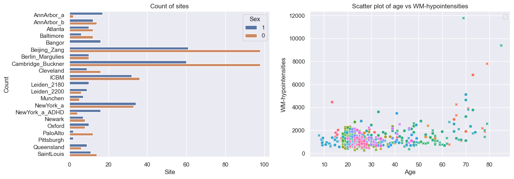
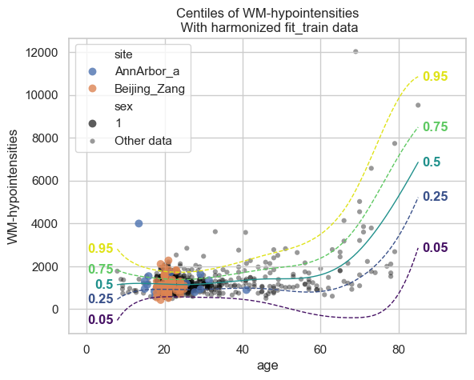
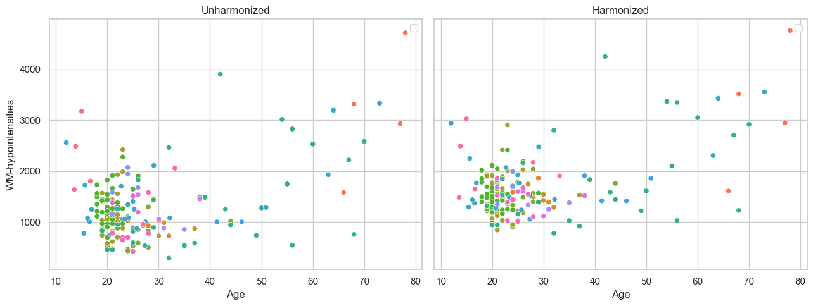
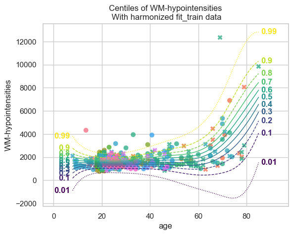
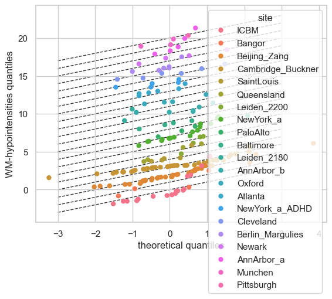
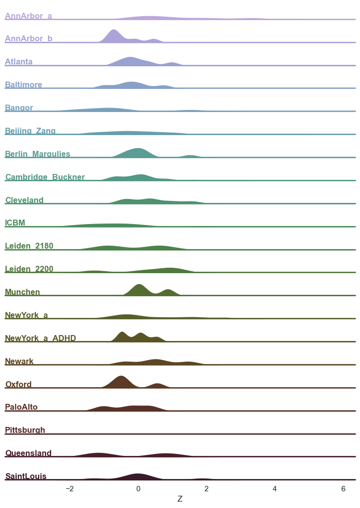
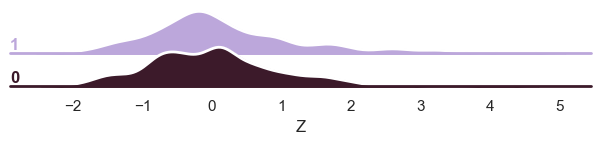
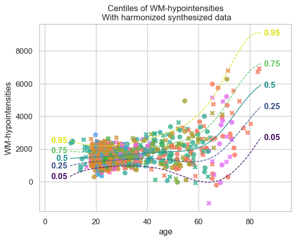

Normative modelling tutorial
============================

Welcome to this tutorial notebook that will go through the fitting,
evaluation, transfering, and extending of Normative models.

Let’s jump right in.

Imports
~~~~~~~

.. code:: ipython3

    import warnings
    import logging
    
    
    import pandas as pd
    import matplotlib.pyplot as plt
    from pcntoolkit import (
        BLR,
        HBR,
        BsplineBasisFunction,
        NormativeModel,
        NormData,
        load_fcon1000,
        SHASHbLikelihood,
        NormalLikelihood,
        make_prior,
        plot_centiles,
        plot_qq,
        plot_ridge,
    )
    
    import numpy as np
    import pcntoolkit.util.output
    import seaborn as sns
    import os
    
    sns.set_style("darkgrid")
    
    # Suppress some annoying warnings and logs
    pymc_logger = logging.getLogger("pymc")
    
    pymc_logger.setLevel(logging.WARNING)
    pymc_logger.propagate = False
    
    warnings.simplefilter(action="ignore", category=FutureWarning)
    pd.options.mode.chained_assignment = None  # default='warn'
    pcntoolkit.util.output.Output.set_show_messages(False)

Load data
---------

First we download a small example dataset from github.

.. code:: ipython3

    # Download the dataset
    norm_data: NormData = load_fcon1000()
    features_to_model = [
        "WM-hypointensities",
        # "Right-Lateral-Ventricle",
        # "Right-Amygdala",
        # "CortexVol",
    ]
    # Select only a few features
    norm_data = norm_data.sel({"response_vars": features_to_model})
    # Leave two sites out for doing transfer and extend later
    transfer_sites = ["Milwaukee_b", "Oulu"]
    transfer_data, fit_data = norm_data.batch_effects_split({"site": transfer_sites}, names=("transfer", "fit"))
    
    # Split into train and test sets
    train, test = fit_data.train_test_split()
    transfer_train, transfer_test = transfer_data.train_test_split()

.. code:: ipython3

    # Inspect the data
    feature_to_plot = features_to_model[0]
    df = train.to_dataframe()
    fig, ax = plt.subplots(1, 2, figsize=(15, 5))
    
    sns.countplot(data=df, y=("batch_effects", "site"), hue=("batch_effects", "sex"), ax=ax[0], orient="h")
    ax[0].legend(title="Sex")
    ax[0].set_title("Count of sites")
    ax[0].set_xlabel("Site")
    ax[0].set_ylabel("Count")
    
    
    sns.scatterplot(
        data=df,
        x=("X", "age"),
        y=("Y", feature_to_plot),
        hue=("batch_effects", "site"),
        style=("batch_effects", "sex"),
        ax=ax[1],
    )
    ax[1].legend([], [])
    ax[1].set_title(f"Scatter plot of age vs {feature_to_plot}")
    ax[1].set_xlabel("Age")
    ax[1].set_ylabel(feature_to_plot)
    
    plt.show()

Creating a Normative model
--------------------------

A normative model has a regression model for each response variable. We
provide a template regression model which is copied for each response
variable.

A template regression model can be anything that implements the
``RegressionModel`` interface. We provide a number of built-in
regression models, but you can also create your own.

Here we use the ``HBR`` class, which implements a Hierarchical Bayesian
Regression model.

The ``HBR`` class needs to know which likelihood function to use. We can
either use a Normal, SHASHo, SHASHb, or Beta likelihood. Each of these
likelihood functions has a number of parameters that need to be
specified.

Here we use the Normal likelihood. This takes a mu and a sigma
parameter, which can be created using the ``make_prior`` function, or by
providing the ‘Prior’ directly.

Here we use the ``make_prior`` function to create the parameters.

.. code:: ipython3

    mu = make_prior(
        # Mu is linear because we want to allow the mean to vary as a function of the covariates.
        linear=True,
        # The slope coefficients are assumed to be normally distributed, with a mean of 0 and a standard deviation of 10.
        slope=make_prior(dist_name="Normal", dist_params=(0.0, 10.0)),
        # The intercept is random, because we expect the intercept to vary between sites and sexes.
        intercept=make_prior(
            random=True,
            # Mu is the mean of the intercept, which is normally distributed with a mean of 0 and a standard deviation of 1.
            mu=make_prior(dist_name="Normal", dist_params=(0.0, 1.0)),
            # Sigma is the scale at which the intercepts vary. It is a positive parameter, so we have to map it to the positive domain.
            sigma=make_prior(dist_name="Normal", dist_params=(0.0, 1.0), mapping="softplus", mapping_params=(0.0, 3.0)),
        ),
        # We use a B-spline basis function to allow for non-linearity in the mean.
        basis_function=BsplineBasisFunction(basis_column=0, nknots=5, degree=3),
    )
    sigma = make_prior(
        # Sigma is also linear, because we want to allow the standard deviation to vary as a function of the covariates: heteroskedasticity.
        linear=True,
        # The slope coefficients are assumed to be normally distributed, with a mean of 0 and a standard deviation of 2.
        slope=make_prior(dist_name="Normal", dist_params=(0.0, 2.0)),
        # The intercept is random, because we expect the intercept to vary between sites and sexes.
        intercept=make_prior(dist_name="Normal", dist_params=(1.0, 1.0)),
        # We use a B-spline basis function to allow for non-linearity in the standard deviation.
        basis_function=BsplineBasisFunction(basis_column=0, nknots=5, degree=3),
        # We use a softplus mapping to ensure that sigma is strictly positive.
        mapping="softplus",
        # We scale the softplus mapping by a factor of 3, to avoid spikes in the resulting density.
        # The parameters (a, b, c) provided to a mapping f are used as: f_abc(x) = f((x - a) / b) * b + c
        # This basically provides an affine transformation of the softplus function.
        # a -> horizontal shift
        # b -> scaling
        # c -> vertical shift
        # You can leave c out, and it will default to 0.
        mapping_params=(0.0, 3.0),
    )
    
    template_hbr = HBR(
        name="template",
        # The number of cores to use for sampling.
        cores=16,
        # Whether to show a progress bar during the model fitting.
        progressbar=True,
        # The number of draws to sample from the posterior per chain.
        draws=1500,
        # The number of tuning steps to run.
        tune=500,
        # The number of MCMC chains to run.
        chains=4,
        # The sampler to use for the model.
        nuts_sampler="nutpie",
        # The likelihood function to use for the model.
        likelihood=NormalLikelihood(
            mu,
            sigma,
        ),
    )

After specifying the regression model, we can configure a normative
model.

A normative model has a number of configuration options: -
``savemodel``: Whether to save the model after fitting. -
``evaluate_model``: Whether to evaluate the model after fitting. -
``saveresults``: Whether to save the results after evaluation. -
``saveplots``: Whether to save the plots after fitting. - ``save_dir``:
The directory to save the model, results, and plots. - ``inscaler``: The
scaler to use for the input data. - ``outscaler``: The scaler to use for
the output data.

.. code:: ipython3

    model = NormativeModel(
        # The regression model to use for the normative model.
        template_regression_model=template_hbr,
        # Whether to save the model after fitting.
        savemodel=True,
        # Whether to evaluate the model after fitting.
        evaluate_model=True,
        # Whether to save the results after evaluation.
        saveresults=True,
        # Whether to save the plots after fitting.
        saveplots=False,
        # The directory to save the model, results, and plots.
        save_dir="resources/hbr/save_dir",
        # The scaler to use for the input data. Can be either one of "standardize", "minmax", "robustminmax", "none"
        inscaler="standardize",
        # The scaler to use for the output data. Can be either one of "standardize", "minmax", "robustminmax", "none"
        outscaler="standardize",
    )

Fit the model
-------------

With all that configured, we can fit the model.

The ``fit_predict`` function will fit the model, evaluate it, and save
the results and plots (if so configured).

After that, it will compute Z-scores and centiles for the test set.

All results can be found in the save directory.

.. code:: ipython3

    test = model.fit_predict(train, test)

.. raw:: html

    
    

.. raw:: html

    
    

        
<strong>Sampler Progress</strong>

        
Total Chains: 4

        
Active Chains: 0

        

            Finished Chains:
            4
        

        
Sampling for now

        

            Estimated Time to Completion:
            now
        

    
        <progress
            id="total-progress-bar"
            max="8000"
            value="8000">
        </progress>
        <table>
            <thead>
                <tr>
                    <th>Progress</th>
                    <th>Draws</th>
                    <th>Divergences</th>
                    <th>Step Size</th>
                    <th>Gradients/Draw</th>
                </tr>
            </thead>
            <tbody id="chain-details">
    
                    <tr>
                        <td class="progress-cell">
                            <progress
                                max="2000"
                                value="2000">
                            </progress>
                        </td>
                        <td>2000</td>
                        <td>12</td>
                        <td>0.13</td>
                        <td>127</td>
                    </tr>
    
                    <tr>
                        <td class="progress-cell">
                            <progress
                                max="2000"
                                value="2000">
                            </progress>
                        </td>
                        <td>2000</td>
                        <td>85</td>
                        <td>0.12</td>
                        <td>31</td>
                    </tr>
    
                    <tr>
                        <td class="progress-cell">
                            <progress
                                max="2000"
                                value="2000">
                            </progress>
                        </td>
                        <td>2000</td>
                        <td>5</td>
                        <td>0.11</td>
                        <td>127</td>
                    </tr>
    
                    <tr>
                        <td class="progress-cell">
                            <progress
                                max="2000"
                                value="2000">
                            </progress>
                        </td>
                        <td>2000</td>
                        <td>18</td>
                        <td>0.11</td>
                        <td>95</td>
                    </tr>
    
                </tr>
            </tbody>
        </table>
    

.. code:: ipython3

    plot_centiles(
        model,
        scatter_data=train,  # Scatter this data along with the centiles
        batch_effects={"site": ["Beijing_Zang", "AnnArbor_a"], "sex": ["1"]},  # Highlight these groups
        show_other_data=True,  # scatter other data as smaller black circles
    )

.. code:: ipython3

    # If predictions are made on a dataset, the model evaluation statistics are stored in the dataset.
    display(train.get_statistics_df())
    display(test.get_statistics_df())

.. raw:: html

    

    
    <table border="1" class="dataframe">
      <thead>
        <tr style="text-align: right;">
          <th>statistic</th>
          <th>MACE</th>
          <th>MAPE</th>
          <th>MSLL</th>
          <th>NLL</th>
          <th>R2</th>
          <th>RMSE</th>
          <th>Rho</th>
          <th>Rho_p</th>
          <th>SMSE</th>
          <th>ShapiroW</th>
        </tr>
        <tr>
          <th>response_vars</th>
          <th></th>
          <th></th>
          <th></th>
          <th></th>
          <th></th>
          <th></th>
          <th></th>
          <th></th>
          <th></th>
          <th></th>
        </tr>
      </thead>
      <tbody>
        <tr>
          <th>WM-hypointensities</th>
          <td>0.04</td>
          <td>14.4</td>
          <td>0.64</td>
          <td>0.78</td>
          <td>0.39</td>
          <td>0.78</td>
          <td>0.55</td>
          <td>0.0</td>
          <td>0.61</td>
          <td>0.91</td>
        </tr>
      </tbody>
    </table>
    

.. raw:: html

    

    
    <table border="1" class="dataframe">
      <thead>
        <tr style="text-align: right;">
          <th>statistic</th>
          <th>MACE</th>
          <th>MAPE</th>
          <th>MSLL</th>
          <th>NLL</th>
          <th>R2</th>
          <th>RMSE</th>
          <th>Rho</th>
          <th>Rho_p</th>
          <th>SMSE</th>
          <th>ShapiroW</th>
        </tr>
        <tr>
          <th>response_vars</th>
          <th></th>
          <th></th>
          <th></th>
          <th></th>
          <th></th>
          <th></th>
          <th></th>
          <th></th>
          <th></th>
          <th></th>
        </tr>
      </thead>
      <tbody>
        <tr>
          <th>WM-hypointensities</th>
          <td>0.03</td>
          <td>5.2</td>
          <td>0.37</td>
          <td>0.86</td>
          <td>0.42</td>
          <td>0.63</td>
          <td>0.57</td>
          <td>0.0</td>
          <td>0.58</td>
          <td>0.94</td>
        </tr>
      </tbody>
    </table>
    

What’s next?
------------

Now we have a normative model, we can use it to: - Harmonize data -
Synthesize data - Map data to Z-scores - Plot centiles - Plot QQ-plots -
Plot ridge plots - Save the model - Send it to a colleague - Load it
from file - Transfer the model to another dataset - Extend the model to
another dataset

.. code:: ipython3

    # turn this off because it costs time
    model.savemodel = False
    model.saveresults = False
    model.saveplots = False
    model.evaluate_model = False

::

    ---------------------------------------------------------------------------

    NameError                                 Traceback (most recent call last)

    Cell In[1], line 2
          1 # turn this off because it costs time
    ----> 2 model.savemodel = False
          3 model.saveresults = False
          4 model.saveplots = False

    NameError: name 'model' is not defined

Harmonize
~~~~~~~~~

.. code:: ipython3

    model.harmonize(test)  # <- easy
    
    df = test.to_dataframe()
    fig, ax = plt.subplots(1, 2, figsize=(13, 5), sharey=True)
    sns.scatterplot(data=df, x=("X", "age"), y=("Y", feature_to_plot), hue=("batch_effects", "site"), ax=ax[0])
    sns.scatterplot(data=df, x=("X", "age"), y=("Y_harmonized", feature_to_plot), hue=("batch_effects", "site"), ax=ax[1])
    ax[0].title.set_text("Unharmonized")
    ax[1].title.set_text("Harmonized")
    ax[0].legend([], [])
    ax[1].legend([], [])
    ax[0].set_xlabel("Age")
    ax[0].set_ylabel(feature_to_plot)
    ax[1].set_xlabel("Age")
    ax[1].set_ylabel(feature_to_plot)
    plt.tight_layout()
    plt.show()

Synthesize
~~~~~~~~~~

.. code:: ipython3

    synthetic_data = model.synthesize(covariate_range_per_batch_effect=True)  # <- also easy
    plot_centiles(
        model,
        covariate="age",  # Which covariate to plot on the x-axis
        scatter_data=synthetic_data,
        show_other_data=True,
        harmonize_data=True,
        show_legend=False,
    )

.. image:: 03_HBR_bak_files/03_HBR_bak_20_0.png

.. code:: ipython3

    # Synthesize new Y data for existing X data
    new_test_data = test.copy()
    
    if hasattr(new_test_data, "Y"):
        del new_test_data["Y"]
    
    synthetic = model.synthesize(new_test_data)  # <- will fill in the missing Y data
    plot_centiles(
        model,
        centiles=[0.01, 0.1, 0.2, 0.3, 0.4, 0.5, 0.6, 0.7, 0.8, 0.9, 0.99],  # Plot arbitrary centiles
        covariate="age",  # Which covariate to plot on the x-axis
        scatter_data=train,  # Scatter the train data points
        batch_effects="all",  # You can set this to "all" to show all batch effects
        show_other_data=True,  # Show data points that do not match any batch effects
        harmonize_data=True,  # Set this to False to see the difference
        show_legend=False,  # Don't show the legend because it crowds the plot
    )

.. code:: ipython3

    plot_qq(test, plot_id_line=True, hue_data="site", split_data="site")
    sns.set_theme(style="darkgrid", rc={"axes.facecolor": (0, 0, 0, 0)})

.. code:: ipython3

    # Show the distribution of predicted Z-scores per site
    plot_ridge(test, "Z", "site")

.. parsed-literal::

    /opt/anaconda3/envs/uv_refactor/lib/python3.12/site-packages/seaborn/axisgrid.py:854: UserWarning: Dataset has 0 variance; skipping density estimate. Pass `warn_singular=False` to disable this warning.
      func(*plot_args, **plot_kwargs)
    /opt/anaconda3/envs/uv_refactor/lib/python3.12/site-packages/seaborn/axisgrid.py:854: UserWarning: Dataset has 0 variance; skipping density estimate. Pass `warn_singular=False` to disable this warning.
      func(*plot_args, **plot_kwargs)

.. code:: ipython3

    # Show the distribution of predicted Z-scores per site
    plot_ridge(test, "Y", "sex")
    plot_ridge(test, "Z", "sex")

.. parsed-literal::

    /opt/anaconda3/envs/uv_refactor/lib/python3.12/site-packages/seaborn/axisgrid.py:123: UserWarning: Tight layout not applied. tight_layout cannot make Axes height small enough to accommodate all Axes decorations.
      self._figure.tight_layout(*args, **kwargs)
    /opt/anaconda3/envs/uv_refactor/lib/python3.12/site-packages/seaborn/axisgrid.py:123: UserWarning: Tight layout not applied. The bottom and top margins cannot be made large enough to accommodate all Axes decorations.
      self._figure.tight_layout(*args, **kwargs)
    /opt/anaconda3/envs/uv_refactor/lib/python3.12/site-packages/seaborn/axisgrid.py:123: UserWarning: Tight layout not applied. The bottom and top margins cannot be made large enough to accommodate all Axes decorations.
      self._figure.tight_layout(*args, **kwargs)
    /opt/anaconda3/envs/uv_refactor/lib/python3.12/site-packages/seaborn/axisgrid.py:123: UserWarning: Tight layout not applied. The bottom and top margins cannot be made large enough to accommodate all Axes decorations.
      self._figure.tight_layout(*args, **kwargs)
    /opt/anaconda3/envs/uv_refactor/lib/python3.12/site-packages/seaborn/axisgrid.py:123: UserWarning: Tight layout not applied. The bottom and top margins cannot be made large enough to accommodate all Axes decorations.
      self._figure.tight_layout(*args, **kwargs)
    /opt/anaconda3/envs/uv_refactor/lib/python3.12/site-packages/pcntoolkit/util/plotter.py:541: UserWarning: Tight layout not applied. tight_layout cannot make Axes height small enough to accommodate all Axes decorations.
      plt.tight_layout()

.. image:: 03_HBR_bak_files/03_HBR_bak_24_1.png

.. parsed-literal::

    /opt/anaconda3/envs/uv_refactor/lib/python3.12/site-packages/seaborn/axisgrid.py:123: UserWarning: Tight layout not applied. tight_layout cannot make Axes height small enough to accommodate all Axes decorations.
      self._figure.tight_layout(*args, **kwargs)
    /opt/anaconda3/envs/uv_refactor/lib/python3.12/site-packages/seaborn/axisgrid.py:123: UserWarning: Tight layout not applied. The bottom and top margins cannot be made large enough to accommodate all Axes decorations.
      self._figure.tight_layout(*args, **kwargs)
    /opt/anaconda3/envs/uv_refactor/lib/python3.12/site-packages/seaborn/axisgrid.py:123: UserWarning: Tight layout not applied. The bottom and top margins cannot be made large enough to accommodate all Axes decorations.
      self._figure.tight_layout(*args, **kwargs)
    /opt/anaconda3/envs/uv_refactor/lib/python3.12/site-packages/seaborn/axisgrid.py:123: UserWarning: Tight layout not applied. The bottom and top margins cannot be made large enough to accommodate all Axes decorations.
      self._figure.tight_layout(*args, **kwargs)
    /opt/anaconda3/envs/uv_refactor/lib/python3.12/site-packages/seaborn/axisgrid.py:123: UserWarning: Tight layout not applied. The bottom and top margins cannot be made large enough to accommodate all Axes decorations.
      self._figure.tight_layout(*args, **kwargs)
    /opt/anaconda3/envs/uv_refactor/lib/python3.12/site-packages/pcntoolkit/util/plotter.py:541: UserWarning: Tight layout not applied. tight_layout cannot make Axes height small enough to accommodate all Axes decorations.
      plt.tight_layout()

.. code:: ipython3

    # Remove the Z-scores if they exist (for demonstration purposes)
    if hasattr(test, "Z"):
        del test["Z"]
    
    # Get new Z-scores
    model.predict(test)
    
    # Display the Z-scores
    display(test["Z"].to_pandas())

.. raw:: html

    

    
    <table border="1" class="dataframe">
      <thead>
        <tr style="text-align: right;">
          <th>response_vars</th>
          <th>WM-hypointensities</th>
        </tr>
        <tr>
          <th>observations</th>
          <th></th>
        </tr>
      </thead>
      <tbody>
        <tr>
          <th>515</th>
          <td>-0.296410</td>
        </tr>
        <tr>
          <th>441</th>
          <td>-0.528196</td>
        </tr>
        <tr>
          <th>1029</th>
          <td>0.574404</td>
        </tr>
        <tr>
          <th>64</th>
          <td>0.327241</td>
        </tr>
        <tr>
          <th>654</th>
          <td>-0.770792</td>
        </tr>
        <tr>
          <th>...</th>
          <td>...</td>
        </tr>
        <tr>
          <th>611</th>
          <td>1.766515</td>
        </tr>
        <tr>
          <th>549</th>
          <td>1.590130</td>
        </tr>
        <tr>
          <th>640</th>
          <td>-0.880070</td>
        </tr>
        <tr>
          <th>648</th>
          <td>-0.203221</td>
        </tr>
        <tr>
          <th>635</th>
          <td>-1.524593</td>
        </tr>
      </tbody>
    </table>
    
186 rows × 1 columns

    

Transfer and extend
~~~~~~~~~~~~~~~~~~~

We can transfer the model to a new dataset with new sites. Then we will
be able to use it on the new dataset.

We can also extend the model to a new dataset. Then we will be able to
use it on the new dataset as well as the old one.

Both are possible without access to the original data.

Isn’t that cool?

.. code:: ipython3

    # Turn this back on
    model.savemodel = True
    model.saveresults = True
    model.saveplots = True
    model.evaluate_model = True

.. code:: ipython3

    # Transfer the model to a new dataset
    transfered_model = model.transfer_predict(transfer_train, transfer_test, freedom=1.0)

.. raw:: html

    
    

.. raw:: html

    
    

        
<strong>Sampler Progress</strong>

        
Total Chains: 4

        
Active Chains: 0

        

            Finished Chains:
            4
        

        
Sampling for now

        

            Estimated Time to Completion:
            now
        

    
        <progress
            id="total-progress-bar"
            max="8000"
            value="8000">
        </progress>
        <table>
            <thead>
                <tr>
                    <th>Progress</th>
                    <th>Draws</th>
                    <th>Divergences</th>
                    <th>Step Size</th>
                    <th>Gradients/Draw</th>
                </tr>
            </thead>
            <tbody id="chain-details">
    
                    <tr>
                        <td class="progress-cell">
                            <progress
                                max="2000"
                                value="2000">
                            </progress>
                        </td>
                        <td>2000</td>
                        <td>1</td>
                        <td>0.20</td>
                        <td>31</td>
                    </tr>
    
                    <tr>
                        <td class="progress-cell">
                            <progress
                                max="2000"
                                value="2000">
                            </progress>
                        </td>
                        <td>2000</td>
                        <td>2</td>
                        <td>0.20</td>
                        <td>63</td>
                    </tr>
    
                    <tr>
                        <td class="progress-cell">
                            <progress
                                max="2000"
                                value="2000">
                            </progress>
                        </td>
                        <td>2000</td>
                        <td>5</td>
                        <td>0.23</td>
                        <td>15</td>
                    </tr>
    
                    <tr>
                        <td class="progress-cell">
                            <progress
                                max="2000"
                                value="2000">
                            </progress>
                        </td>
                        <td>2000</td>
                        <td>3</td>
                        <td>0.24</td>
                        <td>31</td>
                    </tr>
    
                </tr>
            </tbody>
        </table>
    

.. raw:: html

    
<svg style="position: absolute; width: 0; height: 0; overflow: hidden">
    <defs>
    <symbol id="icon-database" viewBox="0 0 32 32">
    <path d="M16 0c-8.837 0-16 2.239-16 5v4c0 2.761 7.163 5 16 5s16-2.239 16-5v-4c0-2.761-7.163-5-16-5z"></path>
    <path d="M16 17c-8.837 0-16-2.239-16-5v6c0 2.761 7.163 5 16 5s16-2.239 16-5v-6c0 2.761-7.163 5-16 5z"></path>
    <path d="M16 26c-8.837 0-16-2.239-16-5v6c0 2.761 7.163 5 16 5s16-2.239 16-5v-6c0 2.761-7.163 5-16 5z"></path>
    </symbol>
    <symbol id="icon-file-text2" viewBox="0 0 32 32">
    <path d="M28.681 7.159c-0.694-0.947-1.662-2.053-2.724-3.116s-2.169-2.030-3.116-2.724c-1.612-1.182-2.393-1.319-2.841-1.319h-15.5c-1.378 0-2.5 1.121-2.5 2.5v27c0 1.378 1.122 2.5 2.5 2.5h23c1.378 0 2.5-1.122 2.5-2.5v-19.5c0-0.448-0.137-1.23-1.319-2.841zM24.543 5.457c0.959 0.959 1.712 1.825 2.268 2.543h-4.811v-4.811c0.718 0.556 1.584 1.309 2.543 2.268zM28 29.5c0 0.271-0.229 0.5-0.5 0.5h-23c-0.271 0-0.5-0.229-0.5-0.5v-27c0-0.271 0.229-0.5 0.5-0.5 0 0 15.499-0 15.5 0v7c0 0.552 0.448 1 1 1h7v19.5z"></path>
    <path d="M23 26h-14c-0.552 0-1-0.448-1-1s0.448-1 1-1h14c0.552 0 1 0.448 1 1s-0.448 1-1 1z"></path>
    <path d="M23 22h-14c-0.552 0-1-0.448-1-1s0.448-1 1-1h14c0.552 0 1 0.448 1 1s-0.448 1-1 1z"></path>
    <path d="M23 18h-14c-0.552 0-1-0.448-1-1s0.448-1 1-1h14c0.552 0 1 0.448 1 1s-0.448 1-1 1z"></path>
    </symbol>
    </defs>
    </svg>
    <pre class='xr-text-repr-fallback'>&lt;xarray.NormData&gt; Size: 6kB
    Dimensions:            (observations: 30, response_vars: 1, covariates: 1,
                            batch_effect_dims: 2, centile: 5, statistic: 10)
    Coordinates:
      * observations       (observations) int64 240B 951 953 915 943 ... 973 908 976
      * response_vars      (response_vars) &lt;U18 72B &#x27;WM-hypointensities&#x27;
      * covariates         (covariates) &lt;U3 12B &#x27;age&#x27;
      * batch_effect_dims  (batch_effect_dims) &lt;U4 32B &#x27;sex&#x27; &#x27;site&#x27;
      * centile            (centile) float64 40B 0.05 0.25 0.5 0.75 0.95
      * statistic          (statistic) &lt;U8 320B &#x27;MACE&#x27; &#x27;MAPE&#x27; ... &#x27;SMSE&#x27; &#x27;ShapiroW&#x27;
    Data variables:
        subjects           (observations) object 240B &#x27;Oulu_sub72795&#x27; ... &#x27;Oulu_s...
        Y                  (observations, response_vars) float64 240B 1.287e+03 ....
        X                  (observations, covariates) float64 240B 21.0 ... 21.0
        batch_effects      (observations, batch_effect_dims) &lt;U11 3kB &#x27;0&#x27; ... &#x27;Oulu&#x27;
        Z                  (observations, response_vars) float64 240B 0.0839 ... ...
        centiles           (centile, observations, response_vars) float64 1kB 737...
        logp               (observations, response_vars) float64 240B -0.1018 ......
        Y_harmonized       (observations, response_vars) float64 240B 1.162e+03 ....
        Yhat               (observations, response_vars) float64 240B 0.08675 ......
        statistics         (response_vars, statistic) float64 80B 0.07333 ... 0.988
    Attributes:
        real_ids:                       True
        is_scaled:                      False
        name:                           transfer_test
        unique_batch_effects:           {&#x27;sex&#x27;: [&#x27;0&#x27;, &#x27;1&#x27;], &#x27;site&#x27;: [&#x27;Milwaukee_b...
        batch_effect_counts:            {&#x27;sex&#x27;: {&#x27;0&#x27;: 96, &#x27;1&#x27;: 52}, &#x27;site&#x27;: {&#x27;Mil...
        batch_effect_covariate_ranges:  {&#x27;sex&#x27;: {&#x27;0&#x27;: {&#x27;age&#x27;: {&#x27;min&#x27;: 20.0, &#x27;max&#x27;...
        covariate_ranges:               {&#x27;age&#x27;: {&#x27;min&#x27;: 20.0, &#x27;max&#x27;: 65.0}}</pre>

xarray.NormData

<ul class='xr-sections'><li class='xr-section-item'><input id='section-9e4b405b-e114-43b6-be36-26a043f65a76' class='xr-section-summary-in' type='checkbox' disabled ><label for='section-9e4b405b-e114-43b6-be36-26a043f65a76' class='xr-section-summary'  title='Expand/collapse section'>Dimensions:</label>
<ul class='xr-dim-list'><li>observations: 30</li><li>response_vars: 1</li><li>covariates: 1</li><li>batch_effect_dims: 2</li><li>centile: 5</li><li>statistic: 10</li></ul>

</li><li class='xr-section-item'><input id='section-7bf0d091-7de3-4899-bbac-2997431ed7ed' class='xr-section-summary-in' type='checkbox'  checked><label for='section-7bf0d091-7de3-4899-bbac-2997431ed7ed' class='xr-section-summary' >Coordinates: (6)</label>

<ul class='xr-var-list'><li class='xr-var-item'>
observations

(observations)

int64

951 953 915 943 ... 904 973 908 976
<input id='attrs-9aabecec-29b0-4e26-9de3-655b738ad84a' class='xr-var-attrs-in' type='checkbox' disabled><label for='attrs-9aabecec-29b0-4e26-9de3-655b738ad84a' title='Show/Hide attributes'><svg class='icon xr-icon-file-text2'><use xlink:href='#icon-file-text2'></use></svg></label><input id='data-7b0e1a65-3f3e-43f5-ac07-119868476ccb' class='xr-var-data-in' type='checkbox'><label for='data-7b0e1a65-3f3e-43f5-ac07-119868476ccb' title='Show/Hide data repr'><svg class='icon xr-icon-database'><use xlink:href='#icon-database'></use></svg></label>
<dl class='xr-attrs'></dl>

<pre>array([951, 953, 915, 943, 903, 906, 959, 969, 887, 738, 705, 888, 739, 907,
           736, 717, 983, 965, 897, 724, 964, 957, 706, 711, 931, 697, 904, 973,
           908, 976])</pre>
</li><li class='xr-var-item'>
response_vars

(response_vars)

&lt;U18

&#x27;WM-hypointensities&#x27;
<input id='attrs-20c59d51-f8c5-4932-8e84-bec39084afcd' class='xr-var-attrs-in' type='checkbox' disabled><label for='attrs-20c59d51-f8c5-4932-8e84-bec39084afcd' title='Show/Hide attributes'><svg class='icon xr-icon-file-text2'><use xlink:href='#icon-file-text2'></use></svg></label><input id='data-c9bdbea1-bf6c-436e-a66e-558880836644' class='xr-var-data-in' type='checkbox'><label for='data-c9bdbea1-bf6c-436e-a66e-558880836644' title='Show/Hide data repr'><svg class='icon xr-icon-database'><use xlink:href='#icon-database'></use></svg></label>
<dl class='xr-attrs'></dl>

<pre>array([&#x27;WM-hypointensities&#x27;], dtype=&#x27;&lt;U18&#x27;)</pre>
</li><li class='xr-var-item'>
covariates

(covariates)

&lt;U3

&#x27;age&#x27;
<input id='attrs-69ef9ed4-de1f-4a8c-a179-e50124dafd42' class='xr-var-attrs-in' type='checkbox' disabled><label for='attrs-69ef9ed4-de1f-4a8c-a179-e50124dafd42' title='Show/Hide attributes'><svg class='icon xr-icon-file-text2'><use xlink:href='#icon-file-text2'></use></svg></label><input id='data-08278d87-86d9-4594-af7b-9c2b5ff7a107' class='xr-var-data-in' type='checkbox'><label for='data-08278d87-86d9-4594-af7b-9c2b5ff7a107' title='Show/Hide data repr'><svg class='icon xr-icon-database'><use xlink:href='#icon-database'></use></svg></label>
<dl class='xr-attrs'></dl>

<pre>array([&#x27;age&#x27;], dtype=&#x27;&lt;U3&#x27;)</pre>
</li><li class='xr-var-item'>
batch_effect_dims

(batch_effect_dims)

&lt;U4

&#x27;sex&#x27; &#x27;site&#x27;
<input id='attrs-720bcd9f-8a1f-4866-8bca-25b48e3f37ee' class='xr-var-attrs-in' type='checkbox' disabled><label for='attrs-720bcd9f-8a1f-4866-8bca-25b48e3f37ee' title='Show/Hide attributes'><svg class='icon xr-icon-file-text2'><use xlink:href='#icon-file-text2'></use></svg></label><input id='data-5a81768a-ae0e-4d7b-876d-d910e7f6ff6d' class='xr-var-data-in' type='checkbox'><label for='data-5a81768a-ae0e-4d7b-876d-d910e7f6ff6d' title='Show/Hide data repr'><svg class='icon xr-icon-database'><use xlink:href='#icon-database'></use></svg></label>
<dl class='xr-attrs'></dl>

<pre>array([&#x27;sex&#x27;, &#x27;site&#x27;], dtype=&#x27;&lt;U4&#x27;)</pre>
</li><li class='xr-var-item'>
centile

(centile)

float64

0.05 0.25 0.5 0.75 0.95
<input id='attrs-79a36adc-a314-4f7a-9e66-5107800d280b' class='xr-var-attrs-in' type='checkbox' disabled><label for='attrs-79a36adc-a314-4f7a-9e66-5107800d280b' title='Show/Hide attributes'><svg class='icon xr-icon-file-text2'><use xlink:href='#icon-file-text2'></use></svg></label><input id='data-32079e86-216f-4d6a-9db0-91b111702973' class='xr-var-data-in' type='checkbox'><label for='data-32079e86-216f-4d6a-9db0-91b111702973' title='Show/Hide data repr'><svg class='icon xr-icon-database'><use xlink:href='#icon-database'></use></svg></label>
<dl class='xr-attrs'></dl>

<pre>array([0.05, 0.25, 0.5 , 0.75, 0.95])</pre>
</li><li class='xr-var-item'>
statistic

(statistic)

&lt;U8

&#x27;MACE&#x27; &#x27;MAPE&#x27; ... &#x27;SMSE&#x27; &#x27;ShapiroW&#x27;
<input id='attrs-e65a9890-332b-4992-bb27-373b442df1ca' class='xr-var-attrs-in' type='checkbox' disabled><label for='attrs-e65a9890-332b-4992-bb27-373b442df1ca' title='Show/Hide attributes'><svg class='icon xr-icon-file-text2'><use xlink:href='#icon-file-text2'></use></svg></label><input id='data-80de9dda-3be9-4809-8587-7d93e304ec61' class='xr-var-data-in' type='checkbox'><label for='data-80de9dda-3be9-4809-8587-7d93e304ec61' title='Show/Hide data repr'><svg class='icon xr-icon-database'><use xlink:href='#icon-database'></use></svg></label>
<dl class='xr-attrs'></dl>

<pre>array([&#x27;MACE&#x27;, &#x27;MAPE&#x27;, &#x27;MSLL&#x27;, &#x27;NLL&#x27;, &#x27;R2&#x27;, &#x27;RMSE&#x27;, &#x27;Rho&#x27;, &#x27;Rho_p&#x27;, &#x27;SMSE&#x27;,
           &#x27;ShapiroW&#x27;], dtype=&#x27;&lt;U8&#x27;)</pre>
</li></ul>
</li><li class='xr-section-item'><input id='section-e1c458ad-07f6-4fbf-9872-4ee82b1511ce' class='xr-section-summary-in' type='checkbox'  checked><label for='section-e1c458ad-07f6-4fbf-9872-4ee82b1511ce' class='xr-section-summary' >Data variables: (10)</label>

<ul class='xr-var-list'><li class='xr-var-item'>
subjects

(observations)

object

&#x27;Oulu_sub72795&#x27; ... &#x27;Oulu_sub94314&#x27;
<input id='attrs-6567304e-b853-424a-9aab-423a4391367c' class='xr-var-attrs-in' type='checkbox' disabled><label for='attrs-6567304e-b853-424a-9aab-423a4391367c' title='Show/Hide attributes'><svg class='icon xr-icon-file-text2'><use xlink:href='#icon-file-text2'></use></svg></label><input id='data-1a64b2f2-34be-4182-a230-eefd4075d9f6' class='xr-var-data-in' type='checkbox'><label for='data-1a64b2f2-34be-4182-a230-eefd4075d9f6' title='Show/Hide data repr'><svg class='icon xr-icon-database'><use xlink:href='#icon-database'></use></svg></label>
<dl class='xr-attrs'></dl>

<pre>array([&#x27;Oulu_sub72795&#x27;, &#x27;Oulu_sub73709&#x27;, &#x27;Oulu_sub26554&#x27;, &#x27;Oulu_sub62124&#x27;,
           &#x27;Oulu_sub16378&#x27;, &#x27;Oulu_sub19971&#x27;, &#x27;Oulu_sub75620&#x27;, &#x27;Oulu_sub86410&#x27;,
           &#x27;Oulu_sub01679&#x27;, &#x27;Milwaukee_b_sub91468&#x27;, &#x27;Milwaukee_b_sub24237&#x27;,
           &#x27;Oulu_sub02036&#x27;, &#x27;Milwaukee_b_sub93170&#x27;, &#x27;Oulu_sub20495&#x27;,
           &#x27;Milwaukee_b_sub87784&#x27;, &#x27;Milwaukee_b_sub53971&#x27;, &#x27;Oulu_sub98661&#x27;,
           &#x27;Oulu_sub79784&#x27;, &#x27;Oulu_sub12152&#x27;, &#x27;Milwaukee_b_sub58967&#x27;,
           &#x27;Oulu_sub78648&#x27;, &#x27;Oulu_sub75293&#x27;, &#x27;Milwaukee_b_sub28782&#x27;,
           &#x27;Milwaukee_b_sub45019&#x27;, &#x27;Oulu_sub41731&#x27;, &#x27;Milwaukee_b_sub09931&#x27;,
           &#x27;Oulu_sub18356&#x27;, &#x27;Oulu_sub91105&#x27;, &#x27;Oulu_sub20926&#x27;, &#x27;Oulu_sub94314&#x27;],
          dtype=object)</pre>
</li><li class='xr-var-item'>
Y

(observations, response_vars)

float64

1.287e+03 1.161e+03 ... 646.6
<input id='attrs-3ff076f9-6b9f-427a-babf-7c7704535f8f' class='xr-var-attrs-in' type='checkbox' disabled><label for='attrs-3ff076f9-6b9f-427a-babf-7c7704535f8f' title='Show/Hide attributes'><svg class='icon xr-icon-file-text2'><use xlink:href='#icon-file-text2'></use></svg></label><input id='data-41b7ce6d-732e-4fe8-a1fb-421064fce8c5' class='xr-var-data-in' type='checkbox'><label for='data-41b7ce6d-732e-4fe8-a1fb-421064fce8c5' title='Show/Hide data repr'><svg class='icon xr-icon-database'><use xlink:href='#icon-database'></use></svg></label>
<dl class='xr-attrs'></dl>

<pre>array([[1287.3],
           [1160.6],
           [1773. ],
           [1328.2],
           [1134.3],
           [1026.1],
           [ 707.3],
           [ 940.1],
           [1281.9],
           [1013. ],
           [2311.5],
           [1179. ],
           [2083.9],
           [1139.1],
           [2153. ],
           [ 986.8],
           [1041.5],
           [1325.1],
           [1379. ],
           [ 763.4],
           [ 881.5],
           [ 716.9],
           [2123.2],
           [ 607.4],
           [1688.3],
           [1601.1],
           [1147.6],
           [1567.5],
           [1518. ],
           [ 646.6]])</pre>
</li><li class='xr-var-item'>
X

(observations, covariates)

float64

21.0 22.0 22.0 ... 22.0 21.0 21.0
<input id='attrs-c831f389-add6-4b83-a5f4-fe82a2375bbf' class='xr-var-attrs-in' type='checkbox' disabled><label for='attrs-c831f389-add6-4b83-a5f4-fe82a2375bbf' title='Show/Hide attributes'><svg class='icon xr-icon-file-text2'><use xlink:href='#icon-file-text2'></use></svg></label><input id='data-49e91c4d-8482-4e2f-b693-6cc213136762' class='xr-var-data-in' type='checkbox'><label for='data-49e91c4d-8482-4e2f-b693-6cc213136762' title='Show/Hide data repr'><svg class='icon xr-icon-database'><use xlink:href='#icon-database'></use></svg></label>
<dl class='xr-attrs'></dl>

<pre>array([[21.],
           [22.],
           [22.],
           [20.],
           [21.],
           [22.],
           [22.],
           [22.],
           [22.],
           [44.],
           [52.],
           [22.],
           [65.],
           [22.],
           [58.],
           [47.],
           [21.],
           [21.],
           [21.],
           [61.],
           [21.],
           [21.],
           [64.],
           [44.],
           [22.],
           [48.],
           [21.],
           [22.],
           [21.],
           [21.]])</pre>
</li><li class='xr-var-item'>
batch_effects

(observations, batch_effect_dims)

&lt;U11

&#x27;0&#x27; &#x27;Oulu&#x27; &#x27;0&#x27; ... &#x27;0&#x27; &#x27;Oulu&#x27;
<input id='attrs-41b4cc36-9170-4a10-a8d9-029c37233a0f' class='xr-var-attrs-in' type='checkbox' disabled><label for='attrs-41b4cc36-9170-4a10-a8d9-029c37233a0f' title='Show/Hide attributes'><svg class='icon xr-icon-file-text2'><use xlink:href='#icon-file-text2'></use></svg></label><input id='data-d6daa2eb-20da-4c03-83f6-11fb6e191531' class='xr-var-data-in' type='checkbox'><label for='data-d6daa2eb-20da-4c03-83f6-11fb6e191531' title='Show/Hide data repr'><svg class='icon xr-icon-database'><use xlink:href='#icon-database'></use></svg></label>
<dl class='xr-attrs'></dl>

<pre>array([[&#x27;0&#x27;, &#x27;Oulu&#x27;],
           [&#x27;0&#x27;, &#x27;Oulu&#x27;],
           [&#x27;1&#x27;, &#x27;Oulu&#x27;],
           [&#x27;0&#x27;, &#x27;Oulu&#x27;],
           [&#x27;1&#x27;, &#x27;Oulu&#x27;],
           [&#x27;0&#x27;, &#x27;Oulu&#x27;],
           [&#x27;0&#x27;, &#x27;Oulu&#x27;],
           [&#x27;0&#x27;, &#x27;Oulu&#x27;],
           [&#x27;1&#x27;, &#x27;Oulu&#x27;],
           [&#x27;1&#x27;, &#x27;Milwaukee_b&#x27;],
           [&#x27;0&#x27;, &#x27;Milwaukee_b&#x27;],
           [&#x27;0&#x27;, &#x27;Oulu&#x27;],
           [&#x27;0&#x27;, &#x27;Milwaukee_b&#x27;],
           [&#x27;0&#x27;, &#x27;Oulu&#x27;],
           [&#x27;1&#x27;, &#x27;Milwaukee_b&#x27;],
           [&#x27;0&#x27;, &#x27;Milwaukee_b&#x27;],
           [&#x27;0&#x27;, &#x27;Oulu&#x27;],
           [&#x27;0&#x27;, &#x27;Oulu&#x27;],
           [&#x27;1&#x27;, &#x27;Oulu&#x27;],
           [&#x27;0&#x27;, &#x27;Milwaukee_b&#x27;],
           [&#x27;0&#x27;, &#x27;Oulu&#x27;],
           [&#x27;1&#x27;, &#x27;Oulu&#x27;],
           [&#x27;0&#x27;, &#x27;Milwaukee_b&#x27;],
           [&#x27;0&#x27;, &#x27;Milwaukee_b&#x27;],
           [&#x27;0&#x27;, &#x27;Oulu&#x27;],
           [&#x27;1&#x27;, &#x27;Milwaukee_b&#x27;],
           [&#x27;1&#x27;, &#x27;Oulu&#x27;],
           [&#x27;1&#x27;, &#x27;Oulu&#x27;],
           [&#x27;1&#x27;, &#x27;Oulu&#x27;],
           [&#x27;0&#x27;, &#x27;Oulu&#x27;]], dtype=&#x27;&lt;U11&#x27;)</pre>
</li><li class='xr-var-item'>
Z

(observations, response_vars)

float64

0.0839 -0.16 ... -0.02551 -1.124
<input id='attrs-7aaa8dd0-0302-4ad3-9016-dbf1689df387' class='xr-var-attrs-in' type='checkbox' disabled><label for='attrs-7aaa8dd0-0302-4ad3-9016-dbf1689df387' title='Show/Hide attributes'><svg class='icon xr-icon-file-text2'><use xlink:href='#icon-file-text2'></use></svg></label><input id='data-0c23679e-afcf-4f8d-9f46-373ffb6173e7' class='xr-var-data-in' type='checkbox'><label for='data-0c23679e-afcf-4f8d-9f46-373ffb6173e7' title='Show/Hide data repr'><svg class='icon xr-icon-database'><use xlink:href='#icon-database'></use></svg></label>
<dl class='xr-attrs'></dl>

<pre>array([[ 0.08389786],
           [-0.15999086],
           [ 0.45791906],
           [ 0.16352985],
           [-0.74862637],
           [-0.41679716],
           [-1.0254949 ],
           [-0.58100044],
           [-0.47975805],
           [-0.40142062],
           [ 1.09737349],
           [-0.124859  ],
           [ 0.01111274],
           [-0.20104168],
           [ 0.34614275],
           [-0.08671075],
           [-0.37933542],
           [ 0.15513553],
           [-0.28746615],
           [-0.57464551],
           [-0.68087051],
           [-1.53525604],
           [ 0.10659991],
           [-0.54742908],
           [ 0.84756811],
           [ 0.25872781],
           [-0.72356127],
           [ 0.06554959],
           [-0.02550754],
           [-1.12356171]])</pre>
</li><li class='xr-var-item'>
centiles

(centile, observations, response_vars)

float64

737.7 737.4 ... 1.956e+03 1.9e+03
<input id='attrs-0a1c0703-f485-4999-9bbb-4849f2b0700d' class='xr-var-attrs-in' type='checkbox' disabled><label for='attrs-0a1c0703-f485-4999-9bbb-4849f2b0700d' title='Show/Hide attributes'><svg class='icon xr-icon-file-text2'><use xlink:href='#icon-file-text2'></use></svg></label><input id='data-42545125-f4d9-4098-9c1c-eee7b082be71' class='xr-var-data-in' type='checkbox'><label for='data-42545125-f4d9-4098-9c1c-eee7b082be71' title='Show/Hide data repr'><svg class='icon xr-icon-database'><use xlink:href='#icon-database'></use></svg></label>
<dl class='xr-attrs'></dl>

<pre>array([[[ 737.72256132],
            [ 737.39372351],
            [ 793.47068192],
            [ 734.68050055],
            [ 793.79951973],
            [ 737.39372351],
            [ 737.39372351],
            [ 737.39372351],
            [ 793.47068192],
            [ 277.53213776],
            [-109.46705524],
            [ 737.39372351],
            [-514.43048217],
            [ 737.39372351],
            [-303.03346448],
            [ 113.70533605],
            [ 737.72256132],
            [ 737.72256132],
            [ 793.79951973],
            [-447.61956555],
    ...
            [2672.70423515],
            [1887.60584208],
            [4240.76815489],
            [1887.60584208],
            [3170.46664036],
            [2438.91455452],
            [1900.12307086],
            [1900.12307086],
            [1956.20002927],
            [3487.60675174],
            [1900.12307086],
            [1956.20002927],
            [4019.64601924],
            [2293.19087731],
            [1887.60584208],
            [2540.28552709],
            [1956.20002927],
            [1943.68280048],
            [1956.20002927],
            [1900.12307086]]])</pre>
</li><li class='xr-var-item'>
logp

(observations, response_vars)

float64

-0.1018 -0.1817 ... -0.1807 -1.908
<input id='attrs-4320178d-6e03-4f8a-82f0-619ced82f280' class='xr-var-attrs-in' type='checkbox' disabled><label for='attrs-4320178d-6e03-4f8a-82f0-619ced82f280' title='Show/Hide attributes'><svg class='icon xr-icon-file-text2'><use xlink:href='#icon-file-text2'></use></svg></label><input id='data-09c680e7-6ec4-4384-84d8-f9d3bfaad144' class='xr-var-data-in' type='checkbox'><label for='data-09c680e7-6ec4-4384-84d8-f9d3bfaad144' title='Show/Hide data repr'><svg class='icon xr-icon-database'><use xlink:href='#icon-database'></use></svg></label>
<dl class='xr-attrs'></dl>

<pre>array([[-0.1017848 ],
           [-0.18174762],
           [-0.75740663],
           [-0.11519726],
           [-0.33084695],
           [-0.42286136],
           [-1.58542515],
           [-0.65459036],
           [-0.11917345],
           [-0.79718915],
           [-1.71332458],
           [-0.16026933],
           [-1.51443361],
           [-0.21035319],
           [-1.42311537],
           [-0.87966421],
           [-0.40599755],
           [-0.09793288],
           [-0.09889165],
           [-1.51474217],
           [-0.86403942],
           [-1.83325607],
           [-1.48820892],
           [-1.21575774],
           [-0.6649963 ],
           [-0.89819613],
           [-0.30591462],
           [-0.25029067],
           [-0.18072049],
           [-1.90798866]])</pre>
</li><li class='xr-var-item'>
Y_harmonized

(observations, response_vars)

float64

1.162e+03 1.035e+03 ... 518.0
<input id='attrs-010275b5-6e78-4895-9715-1c5632e5439b' class='xr-var-attrs-in' type='checkbox' disabled><label for='attrs-010275b5-6e78-4895-9715-1c5632e5439b' title='Show/Hide attributes'><svg class='icon xr-icon-file-text2'><use xlink:href='#icon-file-text2'></use></svg></label><input id='data-d0d22ab3-1024-4f23-92d3-847a98ea2162' class='xr-var-data-in' type='checkbox'><label for='data-d0d22ab3-1024-4f23-92d3-847a98ea2162' title='Show/Hide data repr'><svg class='icon xr-icon-database'><use xlink:href='#icon-database'></use></svg></label>
<dl class='xr-attrs'></dl>

<pre>array([[1162.08545053],
           [1034.50382555],
           [1359.78257122],
           [1203.49545224],
           [ 717.99087577],
           [ 899.31643668],
           [ 578.8871462 ],
           [ 812.87691667],
           [ 866.17270749],
           [ 724.09500105],
           [2326.38472677],
           [1052.99786239],
           [2080.86669491],
           [1012.89394554],
           [1867.26719597],
           [ 989.53000251],
           [ 914.98226987],
           [1200.08585829],
           [ 963.98822446],
           [ 746.60930502],
           [ 754.13398302],
           [ 298.37790748],
           [2122.80196795],
           [ 605.14247091],
           [1564.90074082],
           [1319.34503278],
           [ 731.36138962],
           [1153.2323228 ],
           [1103.72517366],
           [ 517.98859191]])</pre>
</li><li class='xr-var-item'>
Yhat

(observations, response_vars)

float64

0.08675 0.07881 ... 0.1561 0.08675
<input id='attrs-1eef8476-7ea9-465c-a65e-ca97e8972b75' class='xr-var-attrs-in' type='checkbox' disabled><label for='attrs-1eef8476-7ea9-465c-a65e-ca97e8972b75' title='Show/Hide attributes'><svg class='icon xr-icon-file-text2'><use xlink:href='#icon-file-text2'></use></svg></label><input id='data-517a8626-3cb4-42a2-869a-405a6c615007' class='xr-var-data-in' type='checkbox'><label for='data-517a8626-3cb4-42a2-869a-405a6c615007' title='Show/Hide data repr'><svg class='icon xr-icon-database'><use xlink:href='#icon-database'></use></svg></label>
<dl class='xr-attrs'></dl>

<pre>array([[0.08675367],
           [0.07880793],
           [0.14817906],
           [0.09577404],
           [0.15612481],
           [0.07880793],
           [0.07880793],
           [0.07880793],
           [0.14817906],
           [0.07992154],
           [0.04060572],
           [0.07880793],
           [0.76002425],
           [0.07880793],
           [0.22876163],
           [0.03403855],
           [0.08675367],
           [0.08675367],
           [0.15612481],
           [0.33549235],
           [0.08675367],
           [0.15612481],
           [0.630166  ],
           [0.0105504 ],
           [0.07880793],
           [0.10555082],
           [0.15612481],
           [0.14817906],
           [0.15612481],
           [0.08675367]])</pre>
</li><li class='xr-var-item'>
statistics

(response_vars, statistic)

float64

0.07333 1.086 ... 0.847 0.988
<input id='attrs-92ca2f01-36f2-4afc-8f80-80cb2b4be466' class='xr-var-attrs-in' type='checkbox' disabled><label for='attrs-92ca2f01-36f2-4afc-8f80-80cb2b4be466' title='Show/Hide attributes'><svg class='icon xr-icon-file-text2'><use xlink:href='#icon-file-text2'></use></svg></label><input id='data-a22adf17-a965-4bc9-bd3c-65435696d56e' class='xr-var-data-in' type='checkbox'><label for='data-a22adf17-a965-4bc9-bd3c-65435696d56e' title='Show/Hide data repr'><svg class='icon xr-icon-database'><use xlink:href='#icon-database'></use></svg></label>
<dl class='xr-attrs'></dl>

<pre>array([[0.07333333, 1.08571816, 0.09096773, 0.75647721, 0.15299324,
            0.51969307, 0.35750293, 0.05243243, 0.84700676, 0.98795793]])</pre>
</li></ul>
</li><li class='xr-section-item'><input id='section-7c4e5a78-f549-4777-b453-b5a2090bb59f' class='xr-section-summary-in' type='checkbox'  ><label for='section-7c4e5a78-f549-4777-b453-b5a2090bb59f' class='xr-section-summary' >Indexes: (6)</label>

<ul class='xr-var-list'><li class='xr-var-item'>

observations

PandasIndex
<input type='checkbox' disabled/><label></label><input id='index-3acf50ae-d54e-40b3-9a25-358ff8618629' class='xr-index-data-in' type='checkbox'/><label for='index-3acf50ae-d54e-40b3-9a25-358ff8618629' title='Show/Hide index repr'><svg class='icon xr-icon-database'><use xlink:href='#icon-database'></use></svg></label>
<pre>PandasIndex(Index([951, 953, 915, 943, 903, 906, 959, 969, 887, 738, 705, 888, 739, 907,
           736, 717, 983, 965, 897, 724, 964, 957, 706, 711, 931, 697, 904, 973,
           908, 976],
          dtype=&#x27;int64&#x27;, name=&#x27;observations&#x27;))</pre>
</li><li class='xr-var-item'>

response_vars

PandasIndex
<input type='checkbox' disabled/><label></label><input id='index-3a9d6613-f7ab-45d8-b2b9-e803ee908217' class='xr-index-data-in' type='checkbox'/><label for='index-3a9d6613-f7ab-45d8-b2b9-e803ee908217' title='Show/Hide index repr'><svg class='icon xr-icon-database'><use xlink:href='#icon-database'></use></svg></label>
<pre>PandasIndex(Index([&#x27;WM-hypointensities&#x27;], dtype=&#x27;object&#x27;, name=&#x27;response_vars&#x27;))</pre>
</li><li class='xr-var-item'>

covariates

PandasIndex
<input type='checkbox' disabled/><label></label><input id='index-d4690396-32de-4a82-b868-1b45a9363335' class='xr-index-data-in' type='checkbox'/><label for='index-d4690396-32de-4a82-b868-1b45a9363335' title='Show/Hide index repr'><svg class='icon xr-icon-database'><use xlink:href='#icon-database'></use></svg></label>
<pre>PandasIndex(Index([&#x27;age&#x27;], dtype=&#x27;object&#x27;, name=&#x27;covariates&#x27;))</pre>
</li><li class='xr-var-item'>

batch_effect_dims

PandasIndex
<input type='checkbox' disabled/><label></label><input id='index-ff3e14ab-c28e-4ea2-a018-eee8c9b4fdd6' class='xr-index-data-in' type='checkbox'/><label for='index-ff3e14ab-c28e-4ea2-a018-eee8c9b4fdd6' title='Show/Hide index repr'><svg class='icon xr-icon-database'><use xlink:href='#icon-database'></use></svg></label>
<pre>PandasIndex(Index([&#x27;sex&#x27;, &#x27;site&#x27;], dtype=&#x27;object&#x27;, name=&#x27;batch_effect_dims&#x27;))</pre>
</li><li class='xr-var-item'>

centile

PandasIndex
<input type='checkbox' disabled/><label></label><input id='index-93faef2a-a3c2-4ecb-8e2c-05a07bbff461' class='xr-index-data-in' type='checkbox'/><label for='index-93faef2a-a3c2-4ecb-8e2c-05a07bbff461' title='Show/Hide index repr'><svg class='icon xr-icon-database'><use xlink:href='#icon-database'></use></svg></label>
<pre>PandasIndex(Index([0.05, 0.25, 0.5, 0.75, 0.95], dtype=&#x27;float64&#x27;, name=&#x27;centile&#x27;))</pre>
</li><li class='xr-var-item'>

statistic

PandasIndex
<input type='checkbox' disabled/><label></label><input id='index-0faeace3-30e6-48a5-a5d2-144ee9de59b2' class='xr-index-data-in' type='checkbox'/><label for='index-0faeace3-30e6-48a5-a5d2-144ee9de59b2' title='Show/Hide index repr'><svg class='icon xr-icon-database'><use xlink:href='#icon-database'></use></svg></label>
<pre>PandasIndex(Index([&#x27;MACE&#x27;, &#x27;MAPE&#x27;, &#x27;MSLL&#x27;, &#x27;NLL&#x27;, &#x27;R2&#x27;, &#x27;RMSE&#x27;, &#x27;Rho&#x27;, &#x27;Rho_p&#x27;, &#x27;SMSE&#x27;,
           &#x27;ShapiroW&#x27;],
          dtype=&#x27;object&#x27;, name=&#x27;statistic&#x27;))</pre>
</li></ul>
</li><li class='xr-section-item'><input id='section-88181641-a4e4-43d7-a696-7c294ff54d41' class='xr-section-summary-in' type='checkbox'  checked><label for='section-88181641-a4e4-43d7-a696-7c294ff54d41' class='xr-section-summary' >Attributes: (7)</label>

<dl class='xr-attrs'><dt>real_ids :</dt><dd>True</dd><dt>is_scaled :</dt><dd>False</dd><dt>name :</dt><dd>transfer_test</dd><dt>unique_batch_effects :</dt><dd>{&#x27;sex&#x27;: [&#x27;0&#x27;, &#x27;1&#x27;], &#x27;site&#x27;: [&#x27;Milwaukee_b&#x27;, &#x27;Oulu&#x27;]}</dd><dt>batch_effect_counts :</dt><dd>{&#x27;sex&#x27;: {&#x27;0&#x27;: 96, &#x27;1&#x27;: 52}, &#x27;site&#x27;: {&#x27;Milwaukee_b&#x27;: 46, &#x27;Oulu&#x27;: 102}}</dd><dt>batch_effect_covariate_ranges :</dt><dd>{&#x27;sex&#x27;: {&#x27;0&#x27;: {&#x27;age&#x27;: {&#x27;min&#x27;: 20.0, &#x27;max&#x27;: 65.0}}, &#x27;1&#x27;: {&#x27;age&#x27;: {&#x27;min&#x27;: 20.0, &#x27;max&#x27;: 58.0}}}, &#x27;site&#x27;: {&#x27;Milwaukee_b&#x27;: {&#x27;age&#x27;: {&#x27;min&#x27;: 44.0, &#x27;max&#x27;: 65.0}}, &#x27;Oulu&#x27;: {&#x27;age&#x27;: {&#x27;min&#x27;: 20.0, &#x27;max&#x27;: 23.0}}}}</dd><dt>covariate_ranges :</dt><dd>{&#x27;age&#x27;: {&#x27;min&#x27;: 20.0, &#x27;max&#x27;: 65.0}}</dd></dl>
</li></ul>

.. code:: ipython3

    plot_centiles(
        model=transfered_model,
        covariate="age",
        batch_effects="all",
        scatter_data=transfer_train,
        show_other_data=True,
        harmonize_data=True,
        show_legend=True,
    )

.. image:: 03_HBR_bak_files/03_HBR_bak_29_0.png

.. code:: ipython3

    # And extend the model to a new dataset
    extended_model = model.extend_predict(transfer_train, transfer_test)

.. raw:: html

    
    

.. raw:: html

    
    

        
<strong>Sampler Progress</strong>

        
Total Chains: 4

        
Active Chains: 0

        

            Finished Chains:
            4
        

        
Sampling for 12 seconds

        

            Estimated Time to Completion:
            now
        

    
        <progress
            id="total-progress-bar"
            max="8000"
            value="8000">
        </progress>
        <table>
            <thead>
                <tr>
                    <th>Progress</th>
                    <th>Draws</th>
                    <th>Divergences</th>
                    <th>Step Size</th>
                    <th>Gradients/Draw</th>
                </tr>
            </thead>
            <tbody id="chain-details">
    
                    <tr>
                        <td class="progress-cell">
                            <progress
                                max="2000"
                                value="2000">
                            </progress>
                        </td>
                        <td>2000</td>
                        <td>20</td>
                        <td>0.10</td>
                        <td>63</td>
                    </tr>
    
                    <tr>
                        <td class="progress-cell">
                            <progress
                                max="2000"
                                value="2000">
                            </progress>
                        </td>
                        <td>2000</td>
                        <td>16</td>
                        <td>0.12</td>
                        <td>31</td>
                    </tr>
    
                    <tr>
                        <td class="progress-cell">
                            <progress
                                max="2000"
                                value="2000">
                            </progress>
                        </td>
                        <td>2000</td>
                        <td>7</td>
                        <td>0.11</td>
                        <td>127</td>
                    </tr>
    
                    <tr>
                        <td class="progress-cell">
                            <progress
                                max="2000"
                                value="2000">
                            </progress>
                        </td>
                        <td>2000</td>
                        <td>10</td>
                        <td>0.13</td>
                        <td>95</td>
                    </tr>
    
                </tr>
            </tbody>
        </table>
    

.. code:: ipython3

    plot_centiles(
        extended_model,
        covariate="age",
        batch_effects="all",
        show_other_data=True,
        harmonize_data=True,
        show_legend=False,
        scatter_data=extended_model.synthesize(covariate_range_per_batch_effect=True),
    )

Next steps
----------

- Check out the `runner example <runner_example.ipynb>`__ to see how to
  fit and evaluate a model in parallel and in K-fold cross validation on
  a cluster using the runner class.
- Check out the `command line
  interface <command_line_interface.ipynb>`__ example to see how to use
  the pcntoolkit from the command line.
- Try some of the regression models down here. Just substitute the
  ``HBR`` model with one of the other models.

.. code:: ipython3

    # SHASHb model with fixed values for epsilon and delta
    mu = make_prior(
        linear=True,
        slope=make_prior(dist_name="Normal", dist_params=(0.0, 10.0)),
        intercept=make_prior(
            random=True,
            mu=make_prior(dist_name="Normal", dist_params=(1.0, 1.0)),
            sigma=make_prior(dist_name="Gamma", dist_params=(3.0, 1.0)),
        ),
        basis_function=BsplineBasisFunction(basis_column=0, nknots=5, degree=3),
    )
    sigma = make_prior(
        linear=True,
        slope=make_prior(dist_name="Normal", dist_params=(0.0, 2.0)),
        intercept=make_prior(dist_name="Normal", dist_params=(1.0, 1.0)),
        basis_function=BsplineBasisFunction(basis_column=0, nknots=5, degree=3),
        mapping="softplus",
        mapping_params=(0.0, 3.0),
    )
    
    epsilon = make_prior(
        dist_name="Normal",
        dist_params=(0.0, 1.0),
    )
    
    delta = make_prior(
        dist_name="Normal",
        dist_params=(1.0, 1.0),
        mapping="softplus",
        mapping_params=(
            0.0,
            3.0,  # Scale for smoothness
            0.6,  # We need to provide a vertical shift as well, because the SHASH mapping goes a bit wild with low values for delta
        ),
    )
    
    shashb1_regression_model = HBR(
        name="template",
        cores=16,
        progressbar=True,
        draws=1500,
        tune=500,
        chains=4,
        nuts_sampler="nutpie",
        likelihood=SHASHbLikelihood(mu, sigma, epsilon, delta),
    )

.. code:: ipython3

    # SHASHb model with linear regression in epsilon and delta
    mu = make_prior(
        linear=True,
        slope=make_prior(dist_name="Normal", dist_params=(0.0, 10.0)),
        intercept=make_prior(
            random=True,
            mu=make_prior(dist_name="Normal", dist_params=(1.0, 1.0)),
            sigma=make_prior(dist_name="Gamma", dist_params=(3.0, 1.0)),
        ),
        basis_function=BsplineBasisFunction(basis_column=0, nknots=5, degree=3),
    )
    sigma = make_prior(
        linear=True,
        slope=make_prior(dist_name="Normal", dist_params=(0.0, 2.0)),
        intercept=make_prior(dist_name="Normal", dist_params=(1.0, 1.0)),
        basis_function=BsplineBasisFunction(basis_column=0, nknots=5, degree=3),
        mapping="softplus",
        mapping_params=(0.0, 3.0),
    )
    
    epsilon = make_prior(
        linear=True,
        slope=make_prior(dist_name="Normal", dist_params=(0.0, 1.0)),
        intercept=make_prior(dist_name="Normal", dist_params=(0.0, 1.0)),
        basis_function=BsplineBasisFunction(basis_column=0, nknots=5, degree=3),
    )
    
    delta = make_prior(
        linear=True,
        slope=make_prior(dist_name="Normal", dist_params=(0.0, 1.0)),
        intercept=make_prior(dist_name="Normal", dist_params=(1.0, 1.0)),
        basis_function=BsplineBasisFunction(basis_column=0, nknots=5, degree=3),
        mapping="softplus",
        mapping_params=(
            0.0,
            3.0,  # Scale for smoothness
            0.6,  # We need to provide a vertical shift as well, because the SHASH mapping goes a bit wild with low values for delta
        ),
    )
    
    shashb2_regression_model = HBR(
        name="template",
        cores=16,
        progressbar=True,
        draws=1500,
        tune=500,
        chains=4,
        nuts_sampler="nutpie",
        likelihood=SHASHbLikelihood(mu, sigma, epsilon, delta),
    )

.. code:: ipython3

    # BLR model
    template_blr = BLR(
        name="template",
        n_iter=1000,
        tol=1e-8,
        optimizer="l-bfgs-b",
        l_bfgs_b_epsilon=0.1,
        l_bfgs_b_l=0.1,
        l_bfgs_b_norm="l2",
        fixed_effect=True,
        basis_function_mean=BsplineBasisFunction(basis_column=0, degree=3, nknots=5),
        heteroskedastic=True,
        basis_function_var=BsplineBasisFunction(basis_column=0, degree=3, nknots=5),
        fixed_effect_var=True,
    )

.. code:: ipython3

    # Creating a normative model with keyword arguments only
    # Useful for procedural model creation
    model = NormativeModel.from_args(
        alg="hbr",
        likelihood="Normal",
        linear_mu=True,
        random_intercept_mu=True,
        dist_name_sigma_intercept_mu="Gamma",
        dist_params_sigma_intercept_mu=(3.0, 1.0),
        basis_function_mu="bspline",
        basis_function_mu_nknots=4,
        basis_function_mu_left_expand=0.1,
        basis_function_mu_right_expand=0.05,
        basis_function_mu_knot_method="uniform",
        linear_sigma=True,
        mapping_sigma="softplus",
        mapping_params_sigma=(0.0, 3.0),
        random_intercept_sigma=True,
        dist_name_sigma_intercept_sigma="Normal",
        dist_params_sigma_intercept_sigma=(3.0, 1.0),
        mapping_sigma_intercept_sigma="softplus",
        draws=2048,
        tune=512,
        cores=8,
        chains=4,
        nuts_sampler="nutpie",
    )
    template: HBR = model.template_regression_model  # type: ignore
    print(template.draws)
    print(template.tune)
    print(template.cores)
    print(template.chains)
    print(template.nuts_sampler)

.. parsed-literal::

    2048
    512
    8
    4
    nutpie

