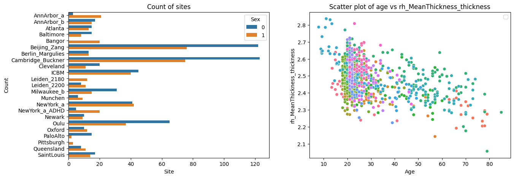

Command line interface
======================

The PCNtoolkit is a python package, but it can also be used from the
command line.

Here we show how to use the PCNtoolkit from the command line.

Furthermore, you can use this script to generate commands for the
command line interface. (Although if you are able to run this notebook,
why not just use it as a python package?)

.. code:: ipython3

    import pandas as pd
    import numpy as np
    from sklearn.model_selection import train_test_split
    import seaborn as sns
    import matplotlib.pyplot as plt
    import os
    import sys
    import pickle

BLR Example
-----------

Data preparation
~~~~~~~~~~~~~~~~

.. code:: ipython3

    # Download and split data first
    # If you are running this notebook for the first time, you need to download the dataset from github.
    # If you have already downloaded the dataset, you can comment out the following line
    pd.read_csv(
        "https://raw.githubusercontent.com/predictive-clinical-neuroscience/PCNtoolkit-demo/refs/heads/main/data/fcon1000.csv"
    ).to_csv("resources/data/fcon1000.csv", index=False)

.. code:: ipython3

    data = pd.read_csv("resources/data/fcon1000.csv")

.. code:: ipython3

    # Inspect the data
    fig, ax = plt.subplots(1, 2, figsize=(15, 5))
    sns.scatterplot(data=data, x=("age"), y=("rh_MeanThickness_thickness"), hue=("site"), ax=ax[1])
    ax[1].legend([], [])
    ax[1].set_title("Scatter plot of age vs rh_MeanThickness_thickness")
    ax[1].set_xlabel("Age")
    ax[1].set_ylabel("rh_MeanThickness_thickness")
    sns.countplot(data=data, y="site", hue="sex", ax=ax[0], orient="h")
    ax[0].legend(title="Sex")
    ax[0].set_title("Count of sites")
    ax[0].set_xlabel("Site")
    ax[0].set_ylabel("Count")
    plt.show()

.. code:: ipython3

    # Split into X, y, and batch effects
    covariate_columns = ["age"]
    batch_effect_columns = ["sex", "site"]
    response_columns = ["rh_MeanThickness_thickness", "WM-hypointensities"]
    
    X = data[covariate_columns]
    Y = data[response_columns]
    batch_effects = data[batch_effect_columns]
    
    batch_effects_strings = [str(b[0]) + " " + str(b[1]) for b in batch_effects.values]
    
    # Split into train and test set
    trainidx, testidx = train_test_split(data.index, test_size=0.2, random_state=42, stratify=batch_effects_strings)
    train_X = X.loc[trainidx]
    train_Y = Y.loc[trainidx]
    train_batch_effects = batch_effects.loc[trainidx]
    
    test_X = X.loc[testidx]
    test_Y = Y.loc[testidx]
    test_batch_effects = batch_effects.loc[testidx]

.. code:: ipython3

    # Save stuff
    root_dir = os.path.join("resources", "cli_example")
    data_dir = os.path.join(root_dir, "data")
    os.makedirs(data_dir, exist_ok=True)
    
    resp = os.path.abspath(os.path.join(data_dir, "responses.csv"))
    cov = os.path.abspath(os.path.join(data_dir, "covariates.csv"))
    be = os.path.abspath(os.path.join(data_dir, "batch_effects.csv"))
    
    t_resp = os.path.abspath(os.path.join(data_dir, "test_responses.csv"))
    t_cov = os.path.abspath(os.path.join(data_dir, "test_covariates.csv"))
    t_be = os.path.abspath(os.path.join(data_dir, "test_batch_effects.csv"))
    
    
    with open(cov, "wb") as f:
        pickle.dump(train_X, f)
    with open(resp, "wb") as f:
        pickle.dump(train_Y, f)
    with open(be, "wb") as f:
        pickle.dump(train_batch_effects, f)
    with open(t_cov, "wb") as f:
        pickle.dump(test_X, f)
    with open(t_resp, "wb") as f:
        pickle.dump(test_Y, f)
    with open(t_be, "wb") as f:
        pickle.dump(test_batch_effects, f)

BLR configuration
~~~~~~~~~~~~~~~~~

.. code:: ipython3

    alg = "blr"
    func = "fit_predict"
    
    # normative model configuration
    save_dir = os.path.join(root_dir, "blr", "save_dir")
    savemodel = True
    saveresults = True
    basis_function = "linear"
    inscaler = "standardize"
    outscaler = "standardize"
    
    # Regression model configuration
    optimizer = "l-bfgs-b"
    n_iter = 200
    heteroskedastic = True
    fixed_effect = True
    warp = "WarpSinhArcsinh"
    warp_reparam = True
    
    # runner configuration
    cross_validate = True
    cv_folds = 5
    parallelize = False
    job_type = "local"
    n_jobs = 2
    temp_dir = os.path.join(root_dir, "temp")
    log_dir = os.path.join(root_dir, "log")
    python_env = os.path.join(os.path.dirname(os.path.dirname(sys.executable)))

Constructing command
~~~~~~~~~~~~~~~~~~~~

.. code:: ipython3

    command = "normative"
    args = f"-a {alg} -f {func} -c {cov} -r {resp} -t {t_resp} -e {t_cov}"
    kwargs = f"be={be} t_be={t_be}"
    normative_model_kwargs = f"save_dir={save_dir} savemodel={savemodel} saveresults={saveresults} basis_function={basis_function} inscaler={inscaler} outscaler={outscaler}"
    runner_kwargs = f"cross_validate={cross_validate} cv_folds={cv_folds} parallelize={parallelize} job_type={job_type} n_jobs={n_jobs} temp_dir={temp_dir} log_dir={log_dir} environment={python_env}"
    blr_kwargs = f"optimizer={optimizer} n_iter={n_iter} heteroskedastic={heteroskedastic} fixed_effect={fixed_effect} warp={warp} warp_reparam={warp_reparam}"
    full_command = f"{command} {args} {kwargs} {runner_kwargs} {normative_model_kwargs} {blr_kwargs}"

.. code:: ipython3

    print(full_command)

.. parsed-literal::

    normative -a blr -f fit_predict -c /Users/stijndeboer/Projects/PCN/PCNtoolkit/examples/resources/cli_example/data/covariates.csv -r /Users/stijndeboer/Projects/PCN/PCNtoolkit/examples/resources/cli_example/data/responses.csv -t /Users/stijndeboer/Projects/PCN/PCNtoolkit/examples/resources/cli_example/data/test_responses.csv -e /Users/stijndeboer/Projects/PCN/PCNtoolkit/examples/resources/cli_example/data/test_covariates.csv be=/Users/stijndeboer/Projects/PCN/PCNtoolkit/examples/resources/cli_example/data/batch_effects.csv t_be=/Users/stijndeboer/Projects/PCN/PCNtoolkit/examples/resources/cli_example/data/test_batch_effects.csv cross_validate=True cv_folds=5 parallelize=True job_type=local n_jobs=2 temp_dir=resources/cli_example/temp log_dir=resources/cli_example/log environment=/opt/anaconda3/envs/dev_refactor save_dir=resources/cli_example/blr/save_dir savemodel=True saveresults=True basis_function=linear inscaler=standardize outscaler=standardize optimizer=l-bfgs-b n_iter=200 heteroskedastic=True fixed_effect=True warp=WarpSinhArcsinh warp_reparam=True

Running command
~~~~~~~~~~~~~~~

.. code:: ipython3

    !{full_command}

.. parsed-literal::

    Process: 88053 - UUID for runner task created: 8f92a33e-270a-413c-89c4-7ac772f629af
    Process: 88053 - Temporary directory created:
    	/Users/stijndeboer/Projects/PCN/PCNtoolkit/examples/resources/cli_example/temp/8f92a33e-270a-413c-89c4-7ac772f629af
    Process: 88053 - Log directory created:
    	/Users/stijndeboer/Projects/PCN/PCNtoolkit/examples/resources/cli_example/log/8f92a33e-270a-413c-89c4-7ac772f629af
    Traceback (most recent call last):
      File "/opt/anaconda3/envs/forward_backward/bin/normative", line 8, in <module>
        sys.exit(entrypoint())
                 ^^^^^^^^^^^^
      File "/opt/anaconda3/envs/forward_backward/lib/python3.12/site-packages/pcntoolkit/normative.py", line 251, in entrypoint
        main(*args[1:])
      File "/opt/anaconda3/envs/forward_backward/lib/python3.12/site-packages/pcntoolkit/normative.py", line 245, in main
        fit_predict(parsed_args)
      File "/opt/anaconda3/envs/forward_backward/lib/python3.12/site-packages/pcntoolkit/normative.py", line 56, in fit_predict
        runner.fit_predict(normative_model, fit_data, predict_data)
      File "/opt/anaconda3/envs/forward_backward/lib/python3.12/site-packages/pcntoolkit/util/runner.py", line 229, in fit_predict
        self.submit_jobs(
      File "/opt/anaconda3/envs/forward_backward/lib/python3.12/site-packages/pcntoolkit/util/runner.py", line 674, in submit_jobs
        command,
        ^^^^^^^
    UnboundLocalError: cannot access local variable 'command' where it is not associated with a value
    

You can find the results in the resources/cli_example/blr/save_dir
folder.

.. code:: ipython3

    import pandas as pd
    
    a = pd.read_csv(
        "/Users/stijndeboer/Projects/PCN/PCNtoolkit/example_notebooks/resources/cli_example/blr/save_dir/folds/fold_1/results/measures.csv",
        index_col=0,
    )

::

    ---------------------------------------------------------------------------

    FileNotFoundError                         Traceback (most recent call last)

    Cell In[10], line 3
          1 import pandas as pd
    ----> 3 a = pd.read_csv(
          4     "/Users/stijndeboer/Projects/PCN/PCNtoolkit/example_notebooks/resources/cli_example/blr/save_dir/folds/fold_1/results/measures.csv",
          5     index_col=0,
          6 )

    File /opt/anaconda3/envs/forward_backward/lib/python3.12/site-packages/pandas/io/parsers/readers.py:1026, in read_csv(filepath_or_buffer, sep, delimiter, header, names, index_col, usecols, dtype, engine, converters, true_values, false_values, skipinitialspace, skiprows, skipfooter, nrows, na_values, keep_default_na, na_filter, verbose, skip_blank_lines, parse_dates, infer_datetime_format, keep_date_col, date_parser, date_format, dayfirst, cache_dates, iterator, chunksize, compression, thousands, decimal, lineterminator, quotechar, quoting, doublequote, escapechar, comment, encoding, encoding_errors, dialect, on_bad_lines, delim_whitespace, low_memory, memory_map, float_precision, storage_options, dtype_backend)
       1013 kwds_defaults = _refine_defaults_read(
       1014     dialect,
       1015     delimiter,
       (...)
       1022     dtype_backend=dtype_backend,
       1023 )
       1024 kwds.update(kwds_defaults)
    -> 1026 return _read(filepath_or_buffer, kwds)

    File /opt/anaconda3/envs/forward_backward/lib/python3.12/site-packages/pandas/io/parsers/readers.py:620, in _read(filepath_or_buffer, kwds)
        617 _validate_names(kwds.get("names", None))
        619 # Create the parser.
    --> 620 parser = TextFileReader(filepath_or_buffer, **kwds)
        622 if chunksize or iterator:
        623     return parser

    File /opt/anaconda3/envs/forward_backward/lib/python3.12/site-packages/pandas/io/parsers/readers.py:1620, in TextFileReader.__init__(self, f, engine, **kwds)
       1617     self.options["has_index_names"] = kwds["has_index_names"]
       1619 self.handles: IOHandles | None = None
    -> 1620 self._engine = self._make_engine(f, self.engine)

    File /opt/anaconda3/envs/forward_backward/lib/python3.12/site-packages/pandas/io/parsers/readers.py:1880, in TextFileReader._make_engine(self, f, engine)
       1878     if "b" not in mode:
       1879         mode += "b"
    -> 1880 self.handles = get_handle(
       1881     f,
       1882     mode,
       1883     encoding=self.options.get("encoding", None),
       1884     compression=self.options.get("compression", None),
       1885     memory_map=self.options.get("memory_map", False),
       1886     is_text=is_text,
       1887     errors=self.options.get("encoding_errors", "strict"),
       1888     storage_options=self.options.get("storage_options", None),
       1889 )
       1890 assert self.handles is not None
       1891 f = self.handles.handle

    File /opt/anaconda3/envs/forward_backward/lib/python3.12/site-packages/pandas/io/common.py:873, in get_handle(path_or_buf, mode, encoding, compression, memory_map, is_text, errors, storage_options)
        868 elif isinstance(handle, str):
        869     # Check whether the filename is to be opened in binary mode.
        870     # Binary mode does not support 'encoding' and 'newline'.
        871     if ioargs.encoding and "b" not in ioargs.mode:
        872         # Encoding
    --> 873         handle = open(
        874             handle,
        875             ioargs.mode,
        876             encoding=ioargs.encoding,
        877             errors=errors,
        878             newline="",
        879         )
        880     else:
        881         # Binary mode
        882         handle = open(handle, ioargs.mode)

    FileNotFoundError: [Errno 2] No such file or directory: '/Users/stijndeboer/Projects/PCN/PCNtoolkit/example_notebooks/resources/cli_example/blr/save_dir/folds/fold_1/results/measures.csv'

HBR example
-----------

.. code:: ipython3

    alg = "hbr"
    func = "fit_predict"
    
    # normative model configuration
    save_dir = os.path.join(root_dir, "hbr", "save_dir")
    savemodel = True
    saveresults = True
    basis_function = "bspline"
    inscaler = "standardize"
    outscaler = "standardize"
    
    
    # Regression model configuration
    draws = 1000
    tune = 500
    chains = 4
    nuts_sampler = "nutpie"
    
    likelihood = "Normal"
    linear_mu = "True"
    random_intercept_mu = "True"
    random_slope_mu = "False"
    linear_sigma = "True"
    random_intercept_sigma = "False"
    random_slope_sigma = "False"

Constructing command
~~~~~~~~~~~~~~~~~~~~

.. code:: ipython3

    command = "normative"
    args = f"-a {alg} -f {func} -c {cov} -r {resp} -t {t_resp} -e {t_cov}"
    kwargs = f"be={be} t_be={t_be}"
    normative_model_kwargs = f"save_dir={save_dir} savemodel={savemodel} saveresults={saveresults} basis_function={basis_function} inscaler={inscaler} outscaler={outscaler}"
    hbr_kwargs = f"draws={draws} tune={tune} chains={chains} nuts_sampler={nuts_sampler} likelihood={likelihood} linear_mu={linear_mu} random_intercept_mu={random_intercept_mu} random_slope_mu={random_slope_mu} linear_sigma={linear_sigma} random_intercept_sigma={random_intercept_sigma} random_slope_sigma={random_slope_sigma}"
    full_command = f"{command} {args} {kwargs} {normative_model_kwargs} {hbr_kwargs}"
    print(full_command)

Running command
~~~~~~~~~~~~~~~

.. code:: ipython3

    !{full_command}

.. parsed-literal::

    No python path specified. Using interpreter path of current process: /opt/anaconda3/envs/param2/bin/python
    No log directory specified. Using default log directory: /Users/stijndeboer/Projects/PCN/PCNtoolkit/example_notebooks/logs
    No temp directory specified. Using default temp directory: /Users/stijndeboer/Projects/PCN/PCNtoolkit/example_notebooks/temp
    /opt/anaconda3/envs/param2/lib/python3.12/site-packages/pcntoolkit/util/runner.py:87: UserWarning: cv_folds is greater than 1, but cross-validation is disabled. This is likely unintended.
      warnings.warn("cv_folds is greater than 1, but cross-validation is disabled. This is likely unintended.")
    Configuration of normative model is valid.
    Going to fit and predict 2 models
    Fitting and predicting model for response_var_0
    ██████████████████████████████████████████████████████████████████████ 6000/6000Sampling: [y_pred]
    Sampling ... ━━━━━━━━━━━━━━━━━━━━━━━━━━━━━━━━━━━━━━━━ 100% 0:00:00 / 0:00:00/ 0:00:00
    [?25hFitting and predicting model for response_var_1
    ██████████████████████████████████████████████████████████████████████ 6000/6000Sampling: [y_pred]
    Sampling ... ━━━━━━━━━━━━━━━━━━━━━━━━━━━━━━━━━━━━━━━━ 100% 0:00:00 / 0:00:00/ 0:00:00
    [?25h21817 Saving model to resources/cli_example/hbr/save_dir
    Model saved to /Users/stijndeboer/Projects/PCN/PCNtoolkit/example_notebooks/resources/cli_example/hbr/save_dir/model
    Computing zscores for response_var_0
    Sampling: [y_pred]
    Sampling ... ━━━━━━━━━━━━━━━━━━━━━━━━━━━━━━━━━━━━━━━━ 100% 0:00:00 / 0:00:00/ 0:00:00
    [?25hComputing zscores for response_var_1
    Sampling: [y_pred]
    Sampling ... ━━━━━━━━━━━━━━━━━━━━━━━━━━━━━━━━━━━━━━━━ 100% 0:00:00 / 0:00:00/ 0:00:00
    [?25hComputing centiles for response_var_0
    Sampling: [y_pred]
    Sampling ... ━━━━━━━━━━━━━━━━━━━━━━━━━━━━━━━━━━━━━━━━ 100% 0:00:00 / 0:00:00/ 0:00:00
    [?25hComputing centiles for response_var_1
    Sampling: [y_pred]
    Sampling ... ━━━━━━━━━━━━━━━━━━━━━━━━━━━━━━━━━━━━━━━━ 100% 0:00:00 / 0:00:00/ 0:00:00
    [?25h/opt/anaconda3/envs/param2/lib/python3.12/site-packages/pcntoolkit/util/evaluator.py:341: RuntimeWarning: invalid value encountered in log
      nll = -np.mean(y * np.log(yhat) + (1 - y) * np.log(1 - yhat))
    Computing centiles for response_var_0
    Sampling: [y_pred]
    Sampling ... ━━━━━━━━━━━━━━━━━━━━━━━━━━━━━━━━━━━━━━━━ 100% 0:00:00 / 0:00:00/ 0:00:00
    [?25hComputing centiles for response_var_1
    Sampling: [y_pred]
    Sampling ... ━━━━━━━━━━━━━━━━━━━━━━━━━━━━━━━━━━━━━━━━ 100% 0:00:00 / 0:00:00/ 0:00:00
    [?25hResults and plots saved to /Users/stijndeboer/Projects/PCN/PCNtoolkit/example_notebooks/resources/cli_example/hbr/save_dir/results and /Users/stijndeboer/Projects/PCN/PCNtoolkit/example_notebooks/resources/cli_example/hbr/save_dir/plots
    Job Status Monitor:
    ------------------------------------------------------------
    Job ID     Name     State     Time     Nodes
    ------------------------------------------------------------
    
    All jobs completed!
    

