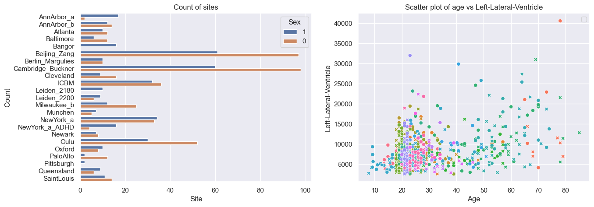
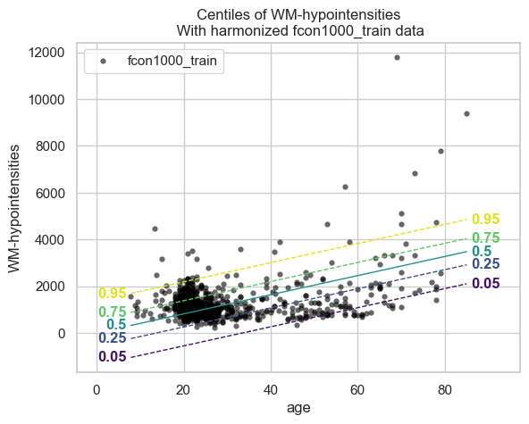
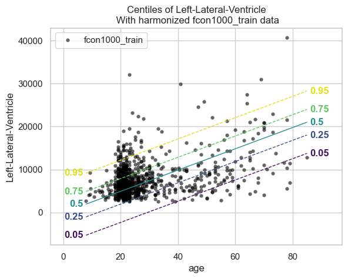
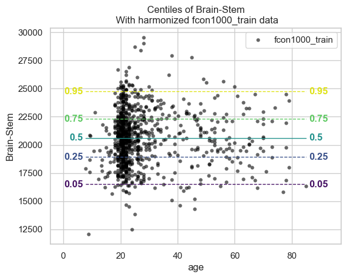
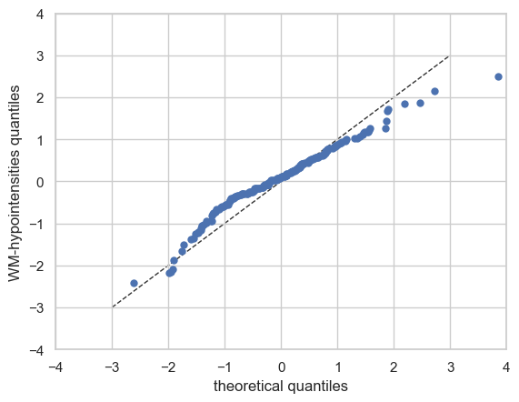
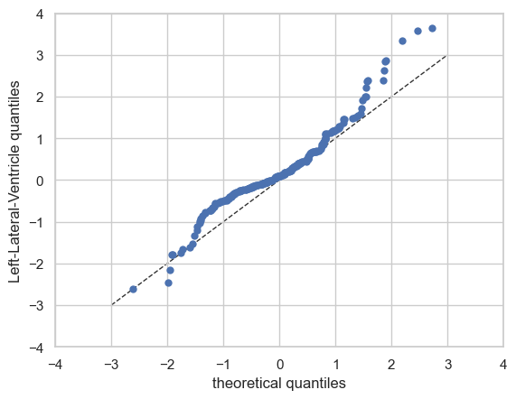
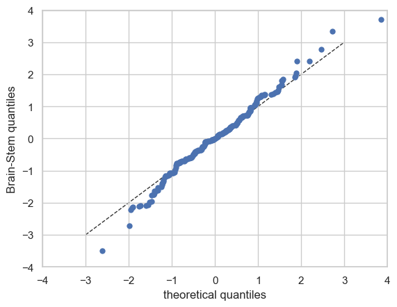

Getting started with normative modelling
========================================

Welcome to this tutorial notebook that will show you the very basics of
normative modeling.

Let’s jump right in.

Imports
~~~~~~~

.. code:: ipython3

    import warnings
    import pandas as pd
    import matplotlib.pyplot as plt
    from pcntoolkit import (
        BLR,
        NormativeModel,
        NormData,
        load_fcon1000,
        plot_centiles,
        plot_qq,
    )
    import pcntoolkit.util.output
    import seaborn as sns
    
    sns.set_style("darkgrid")
    warnings.simplefilter(action="ignore", category=FutureWarning)
    pd.options.mode.chained_assignment = None  # default='warn'
    pcntoolkit.util.output.Output.set_show_messages(False)

Load data
=========

First we download a small example dataset from github.

.. code:: ipython3

    # Download the dataset
    norm_data: NormData = load_fcon1000()
    # Select only these three features to model for this example
    norm_data = norm_data.sel({"response_vars": ["WM-hypointensities", "Left-Lateral-Ventricle", "Brain-Stem"]})
    # Train-test split
    train, test = norm_data.train_test_split()

.. code:: ipython3

    # Inspect the data
    df = train.to_dataframe()
    fig, ax = plt.subplots(1, 2, figsize=(15, 5))
    
    sns.countplot(data=df, y=("batch_effects", "site"), hue=("batch_effects", "sex"), ax=ax[0], orient="h")
    ax[0].legend(title="Sex")
    ax[0].set_title("Count of sites")
    ax[0].set_xlabel("Site")
    ax[0].set_ylabel("Count")
    
    scatter_feature = "Left-Lateral-Ventricle"
    
    sns.scatterplot(
        data=df,
        x=("X", "age"),
        y=("Y", scatter_feature),
        hue=("batch_effects", "site"),
        style=("batch_effects", "sex"),
        ax=ax[1],
    )
    ax[1].legend([], [])
    ax[1].set_title(f"Scatter plot of age vs {scatter_feature}")
    ax[1].set_xlabel("Age")
    ax[1].set_ylabel(scatter_feature)
    
    plt.show()

Creating a Normative model
==========================

.. code:: ipython3

    save_dir = "/Users/stijndeboer/Projects/PCN/PCNtoolkit/examples/saves"
    model = NormativeModel(BLR())

Fit the model
=============

With all that configured, we can fit the model.

The ``fit_predict`` function will fit the model, evaluate it, save the
results and plots, and return the test data with all the predictions
added.

After that, it will compute Z-scores and centiles for the test set.

All results can be found in the save directory.

.. code:: ipython3

    model.fit_predict(train, test)

.. raw:: html

    
<svg style="position: absolute; width: 0; height: 0; overflow: hidden">
    <defs>
    <symbol id="icon-database" viewBox="0 0 32 32">
    <path d="M16 0c-8.837 0-16 2.239-16 5v4c0 2.761 7.163 5 16 5s16-2.239 16-5v-4c0-2.761-7.163-5-16-5z"></path>
    <path d="M16 17c-8.837 0-16-2.239-16-5v6c0 2.761 7.163 5 16 5s16-2.239 16-5v-6c0 2.761-7.163 5-16 5z"></path>
    <path d="M16 26c-8.837 0-16-2.239-16-5v6c0 2.761 7.163 5 16 5s16-2.239 16-5v-6c0 2.761-7.163 5-16 5z"></path>
    </symbol>
    <symbol id="icon-file-text2" viewBox="0 0 32 32">
    <path d="M28.681 7.159c-0.694-0.947-1.662-2.053-2.724-3.116s-2.169-2.030-3.116-2.724c-1.612-1.182-2.393-1.319-2.841-1.319h-15.5c-1.378 0-2.5 1.121-2.5 2.5v27c0 1.378 1.122 2.5 2.5 2.5h23c1.378 0 2.5-1.122 2.5-2.5v-19.5c0-0.448-0.137-1.23-1.319-2.841zM24.543 5.457c0.959 0.959 1.712 1.825 2.268 2.543h-4.811v-4.811c0.718 0.556 1.584 1.309 2.543 2.268zM28 29.5c0 0.271-0.229 0.5-0.5 0.5h-23c-0.271 0-0.5-0.229-0.5-0.5v-27c0-0.271 0.229-0.5 0.5-0.5 0 0 15.499-0 15.5 0v7c0 0.552 0.448 1 1 1h7v19.5z"></path>
    <path d="M23 26h-14c-0.552 0-1-0.448-1-1s0.448-1 1-1h14c0.552 0 1 0.448 1 1s-0.448 1-1 1z"></path>
    <path d="M23 22h-14c-0.552 0-1-0.448-1-1s0.448-1 1-1h14c0.552 0 1 0.448 1 1s-0.448 1-1 1z"></path>
    <path d="M23 18h-14c-0.552 0-1-0.448-1-1s0.448-1 1-1h14c0.552 0 1 0.448 1 1s-0.448 1-1 1z"></path>
    </symbol>
    </defs>
    </svg>
    <pre class='xr-text-repr-fallback'>&lt;xarray.NormData&gt; Size: 87kB
    Dimensions:            (observations: 216, response_vars: 3, covariates: 1,
                            batch_effect_dims: 2, centile: 5, statistic: 10)
    Coordinates:
      * observations       (observations) int64 2kB 756 769 692 616 ... 751 470 1043
      * response_vars      (response_vars) &lt;U22 264B &#x27;WM-hypointensities&#x27; ... &#x27;Br...
      * covariates         (covariates) &lt;U3 12B &#x27;age&#x27;
      * batch_effect_dims  (batch_effect_dims) &lt;U4 32B &#x27;sex&#x27; &#x27;site&#x27;
      * centile            (centile) float64 40B 0.05 0.25 0.5 0.75 0.95
      * statistic          (statistic) &lt;U8 320B &#x27;MACE&#x27; &#x27;MAPE&#x27; ... &#x27;SMSE&#x27; &#x27;ShapiroW&#x27;
    Data variables:
        subjects           (observations) object 2kB &#x27;Munchen_sub96752&#x27; ... &#x27;Quee...
        Y                  (observations, response_vars) float64 5kB 2.721e+03 .....
        X                  (observations, covariates) float64 2kB 63.0 ... 23.0
        batch_effects      (observations, batch_effect_dims) &lt;U17 29kB &#x27;0&#x27; ... &#x27;Q...
        Z                  (observations, response_vars) float64 5kB 0.1736 ... -...
        centiles           (centile, observations, response_vars) float64 26kB 1....
        logp               (observations, response_vars) float64 5kB -7.66 ... -9...
        Y_harmonized       (observations, response_vars) float64 5kB 2.721e+03 .....
        Yhat               (observations, response_vars) float64 5kB 2.577e+03 .....
        statistics         (response_vars, statistic) float64 240B 0.05981 ... 0....
    Attributes:
        real_ids:                       True
        is_scaled:                      False
        name:                           fcon1000_test
        unique_batch_effects:           {&#x27;sex&#x27;: [&#x27;0&#x27;, &#x27;1&#x27;], &#x27;site&#x27;: [&#x27;AnnArbor_a&#x27;...
        batch_effect_counts:            {&#x27;sex&#x27;: {&#x27;0&#x27;: 589, &#x27;1&#x27;: 489}, &#x27;site&#x27;: {&#x27;A...
        batch_effect_covariate_ranges:  {&#x27;sex&#x27;: {&#x27;0&#x27;: {&#x27;age&#x27;: {&#x27;min&#x27;: 7.88, &#x27;max&#x27;...
        covariate_ranges:               {&#x27;age&#x27;: {&#x27;min&#x27;: 7.88, &#x27;max&#x27;: 85.0}}</pre>

xarray.NormData

<ul class='xr-sections'><li class='xr-section-item'><input id='section-f2f3c318-0719-4db1-a136-5d1fb5bdd5e6' class='xr-section-summary-in' type='checkbox' disabled ><label for='section-f2f3c318-0719-4db1-a136-5d1fb5bdd5e6' class='xr-section-summary'  title='Expand/collapse section'>Dimensions:</label>
<ul class='xr-dim-list'><li>observations: 216</li><li>response_vars: 3</li><li>covariates: 1</li><li>batch_effect_dims: 2</li><li>centile: 5</li><li>statistic: 10</li></ul>

</li><li class='xr-section-item'><input id='section-5e3a7773-f1dd-405b-a02f-c49a72acb5a4' class='xr-section-summary-in' type='checkbox'  checked><label for='section-5e3a7773-f1dd-405b-a02f-c49a72acb5a4' class='xr-section-summary' >Coordinates: (6)</label>

<ul class='xr-var-list'><li class='xr-var-item'>
observations

(observations)

int64

756 769 692 616 ... 751 470 1043
<input id='attrs-de752022-6215-4dba-8fd3-de454b3867e5' class='xr-var-attrs-in' type='checkbox' disabled><label for='attrs-de752022-6215-4dba-8fd3-de454b3867e5' title='Show/Hide attributes'><svg class='icon xr-icon-file-text2'><use xlink:href='#icon-file-text2'></use></svg></label><input id='data-579c76f6-99b2-471d-a811-7ac4888fb3b9' class='xr-var-data-in' type='checkbox'><label for='data-579c76f6-99b2-471d-a811-7ac4888fb3b9' title='Show/Hide data repr'><svg class='icon xr-icon-database'><use xlink:href='#icon-database'></use></svg></label>
<dl class='xr-attrs'></dl>

<pre>array([ 756,  769,  692, ...,  751,  470, 1043])</pre>
</li><li class='xr-var-item'>
response_vars

(response_vars)

&lt;U22

&#x27;WM-hypointensities&#x27; ... &#x27;Brain-...
<input id='attrs-021b86d2-57c3-477e-9c63-4866b371a85a' class='xr-var-attrs-in' type='checkbox' disabled><label for='attrs-021b86d2-57c3-477e-9c63-4866b371a85a' title='Show/Hide attributes'><svg class='icon xr-icon-file-text2'><use xlink:href='#icon-file-text2'></use></svg></label><input id='data-d4e97fd8-5513-4742-bae3-0c4d8bbe1271' class='xr-var-data-in' type='checkbox'><label for='data-d4e97fd8-5513-4742-bae3-0c4d8bbe1271' title='Show/Hide data repr'><svg class='icon xr-icon-database'><use xlink:href='#icon-database'></use></svg></label>
<dl class='xr-attrs'></dl>

<pre>array([&#x27;WM-hypointensities&#x27;, &#x27;Left-Lateral-Ventricle&#x27;, &#x27;Brain-Stem&#x27;],
          dtype=&#x27;&lt;U22&#x27;)</pre>
</li><li class='xr-var-item'>
covariates

(covariates)

&lt;U3

&#x27;age&#x27;
<input id='attrs-bcea2fff-b449-46c3-ba74-560b68433afb' class='xr-var-attrs-in' type='checkbox' disabled><label for='attrs-bcea2fff-b449-46c3-ba74-560b68433afb' title='Show/Hide attributes'><svg class='icon xr-icon-file-text2'><use xlink:href='#icon-file-text2'></use></svg></label><input id='data-dc6a4fbc-7758-4ad1-a7b6-4089b3e7150f' class='xr-var-data-in' type='checkbox'><label for='data-dc6a4fbc-7758-4ad1-a7b6-4089b3e7150f' title='Show/Hide data repr'><svg class='icon xr-icon-database'><use xlink:href='#icon-database'></use></svg></label>
<dl class='xr-attrs'></dl>

<pre>array([&#x27;age&#x27;], dtype=&#x27;&lt;U3&#x27;)</pre>
</li><li class='xr-var-item'>
batch_effect_dims

(batch_effect_dims)

&lt;U4

&#x27;sex&#x27; &#x27;site&#x27;
<input id='attrs-0d0aae51-f5e8-42ce-bc83-049724e9c417' class='xr-var-attrs-in' type='checkbox' disabled><label for='attrs-0d0aae51-f5e8-42ce-bc83-049724e9c417' title='Show/Hide attributes'><svg class='icon xr-icon-file-text2'><use xlink:href='#icon-file-text2'></use></svg></label><input id='data-b8ebc4da-f47a-4c09-af4b-41f5bf189ddb' class='xr-var-data-in' type='checkbox'><label for='data-b8ebc4da-f47a-4c09-af4b-41f5bf189ddb' title='Show/Hide data repr'><svg class='icon xr-icon-database'><use xlink:href='#icon-database'></use></svg></label>
<dl class='xr-attrs'></dl>

<pre>array([&#x27;sex&#x27;, &#x27;site&#x27;], dtype=&#x27;&lt;U4&#x27;)</pre>
</li><li class='xr-var-item'>
centile

(centile)

float64

0.05 0.25 0.5 0.75 0.95
<input id='attrs-bbe68f1c-2177-4775-862b-3e4dea975038' class='xr-var-attrs-in' type='checkbox' disabled><label for='attrs-bbe68f1c-2177-4775-862b-3e4dea975038' title='Show/Hide attributes'><svg class='icon xr-icon-file-text2'><use xlink:href='#icon-file-text2'></use></svg></label><input id='data-607f65bc-911b-4464-baa3-ea547e813dc5' class='xr-var-data-in' type='checkbox'><label for='data-607f65bc-911b-4464-baa3-ea547e813dc5' title='Show/Hide data repr'><svg class='icon xr-icon-database'><use xlink:href='#icon-database'></use></svg></label>
<dl class='xr-attrs'></dl>

<pre>array([0.05, 0.25, 0.5 , 0.75, 0.95])</pre>
</li><li class='xr-var-item'>
statistic

(statistic)

&lt;U8

&#x27;MACE&#x27; &#x27;MAPE&#x27; ... &#x27;SMSE&#x27; &#x27;ShapiroW&#x27;
<input id='attrs-09f7a063-ba90-40ad-b1e9-fba2473069f2' class='xr-var-attrs-in' type='checkbox' disabled><label for='attrs-09f7a063-ba90-40ad-b1e9-fba2473069f2' title='Show/Hide attributes'><svg class='icon xr-icon-file-text2'><use xlink:href='#icon-file-text2'></use></svg></label><input id='data-8c99b55e-1419-4354-80e4-4482ed8cd136' class='xr-var-data-in' type='checkbox'><label for='data-8c99b55e-1419-4354-80e4-4482ed8cd136' title='Show/Hide data repr'><svg class='icon xr-icon-database'><use xlink:href='#icon-database'></use></svg></label>
<dl class='xr-attrs'></dl>

<pre>array([&#x27;MACE&#x27;, &#x27;MAPE&#x27;, &#x27;MSLL&#x27;, &#x27;NLL&#x27;, &#x27;R2&#x27;, &#x27;RMSE&#x27;, &#x27;Rho&#x27;, &#x27;Rho_p&#x27;, &#x27;SMSE&#x27;,
           &#x27;ShapiroW&#x27;], dtype=&#x27;&lt;U8&#x27;)</pre>
</li></ul>
</li><li class='xr-section-item'><input id='section-6b39a397-122d-4272-aac0-abf868cecb24' class='xr-section-summary-in' type='checkbox'  checked><label for='section-6b39a397-122d-4272-aac0-abf868cecb24' class='xr-section-summary' >Data variables: (10)</label>

<ul class='xr-var-list'><li class='xr-var-item'>
subjects

(observations)

object

&#x27;Munchen_sub96752&#x27; ... &#x27;Queensla...
<input id='attrs-400c8f38-cf85-496e-b05e-6ff729b18aad' class='xr-var-attrs-in' type='checkbox' disabled><label for='attrs-400c8f38-cf85-496e-b05e-6ff729b18aad' title='Show/Hide attributes'><svg class='icon xr-icon-file-text2'><use xlink:href='#icon-file-text2'></use></svg></label><input id='data-3e4215af-d148-4821-9fb4-b4495ce0cfd7' class='xr-var-data-in' type='checkbox'><label for='data-3e4215af-d148-4821-9fb4-b4495ce0cfd7' title='Show/Hide data repr'><svg class='icon xr-icon-database'><use xlink:href='#icon-database'></use></svg></label>
<dl class='xr-attrs'></dl>

<pre>array([&#x27;Munchen_sub96752&#x27;, &#x27;NewYork_a_sub18638&#x27;, &#x27;Leiden_2200_sub87320&#x27;,
           &#x27;ICBM_sub47658&#x27;, &#x27;AnnArbor_b_sub45569&#x27;, &#x27;Beijing_Zang_sub18960&#x27;,
           &#x27;Leiden_2200_sub18456&#x27;, &#x27;Berlin_Margulies_sub27711&#x27;,
           &#x27;Beijing_Zang_sub87776&#x27;, &#x27;Milwaukee_b_sub63196&#x27;,
           &#x27;Beijing_Zang_sub07144&#x27;, &#x27;Atlanta_sub76280&#x27;,
           &#x27;Beijing_Zang_sub40037&#x27;, &#x27;Cambridge_Buckner_sub17737&#x27;,
           &#x27;ICBM_sub89049&#x27;, &#x27;ICBM_sub55656&#x27;, &#x27;Oulu_sub45566&#x27;,
           &#x27;Beijing_Zang_sub89088&#x27;, &#x27;Atlanta_sub16563&#x27;,
           &#x27;Cambridge_Buckner_sub51172&#x27;, &#x27;Oulu_sub98739&#x27;,
           &#x27;Queensland_sub49845&#x27;, &#x27;Cambridge_Buckner_sub84256&#x27;,
           &#x27;Cleveland_sub80263&#x27;, &#x27;ICBM_sub16607&#x27;, &#x27;Newark_sub46570&#x27;,
           &#x27;NewYork_a_sub88286&#x27;, &#x27;Cambridge_Buckner_sub02591&#x27;,
           &#x27;Oulu_sub66467&#x27;, &#x27;Beijing_Zang_sub74386&#x27;, &#x27;Newark_sub55760&#x27;,
           &#x27;ICBM_sub30623&#x27;, &#x27;Oulu_sub68752&#x27;, &#x27;Leiden_2180_sub19281&#x27;,
           &#x27;Beijing_Zang_sub50972&#x27;, &#x27;Beijing_Zang_sub85030&#x27;,
           &#x27;Milwaukee_b_sub36386&#x27;, &#x27;Baltimore_sub31837&#x27;, &#x27;PaloAlto_sub84978&#x27;,
           &#x27;Oulu_sub01077&#x27;, &#x27;NewYork_a_ADHD_sub54828&#x27;, &#x27;PaloAlto_sub96705&#x27;,
           &#x27;Cambridge_Buckner_sub40635&#x27;, &#x27;ICBM_sub66794&#x27;,
           &#x27;Beijing_Zang_sub46541&#x27;, &#x27;Beijing_Zang_sub87089&#x27;,
           &#x27;Pittsburgh_sub97823&#x27;, &#x27;Beijing_Zang_sub98617&#x27;, &#x27;ICBM_sub92028&#x27;,
    ...
           &#x27;Leiden_2200_sub04484&#x27;, &#x27;Beijing_Zang_sub80163&#x27;, &#x27;ICBM_sub02382&#x27;,
           &#x27;Cambridge_Buckner_sub77435&#x27;, &#x27;NewYork_a_sub54887&#x27;,
           &#x27;Oulu_sub85532&#x27;, &#x27;Baltimore_sub73823&#x27;, &#x27;Beijing_Zang_sub29590&#x27;,
           &#x27;Oulu_sub99718&#x27;, &#x27;Beijing_Zang_sub08455&#x27;, &#x27;Beijing_Zang_sub85543&#x27;,
           &#x27;Cambridge_Buckner_sub45354&#x27;, &#x27;Beijing_Zang_sub07717&#x27;,
           &#x27;Baltimore_sub76160&#x27;, &#x27;Beijing_Zang_sub17093&#x27;,
           &#x27;AnnArbor_b_sub90127&#x27;, &#x27;SaintLouis_sub73002&#x27;,
           &#x27;Queensland_sub93238&#x27;, &#x27;Cleveland_sub34189&#x27;,
           &#x27;Cambridge_Buckner_sub89107&#x27;, &#x27;Atlanta_sub75153&#x27;,
           &#x27;NewYork_a_ADHD_sub73035&#x27;, &#x27;Cambridge_Buckner_sub59434&#x27;,
           &#x27;Milwaukee_b_sub44912&#x27;, &#x27;Cleveland_sub46739&#x27;, &#x27;Oulu_sub20495&#x27;,
           &#x27;SaintLouis_sub28304&#x27;, &#x27;Cambridge_Buckner_sub35430&#x27;,
           &#x27;Oulu_sub86362&#x27;, &#x27;Newark_sub58526&#x27;, &#x27;Leiden_2180_sub12255&#x27;,
           &#x27;ICBM_sub48210&#x27;, &#x27;Cambridge_Buckner_sub77989&#x27;,
           &#x27;Berlin_Margulies_sub75506&#x27;, &#x27;NewYork_a_sub29216&#x27;,
           &#x27;Beijing_Zang_sub05267&#x27;, &#x27;AnnArbor_b_sub18546&#x27;, &#x27;Oulu_sub75620&#x27;,
           &#x27;AnnArbor_b_sub30250&#x27;, &#x27;Berlin_Margulies_sub86111&#x27;,
           &#x27;Beijing_Zang_sub89592&#x27;, &#x27;Beijing_Zang_sub68012&#x27;,
           &#x27;NewYork_a_sub50559&#x27;, &#x27;Munchen_sub66933&#x27;,
           &#x27;Cambridge_Buckner_sub59729&#x27;, &#x27;Queensland_sub86245&#x27;], dtype=object)</pre>
</li><li class='xr-var-item'>
Y

(observations, response_vars)

float64

2.721e+03 1.362e+04 ... 1.681e+04
<input id='attrs-4dcfff9a-d33f-4abe-bb89-74d33a6200c6' class='xr-var-attrs-in' type='checkbox' disabled><label for='attrs-4dcfff9a-d33f-4abe-bb89-74d33a6200c6' title='Show/Hide attributes'><svg class='icon xr-icon-file-text2'><use xlink:href='#icon-file-text2'></use></svg></label><input id='data-24cd1d05-4abd-416a-841b-3ecdd6f65dbc' class='xr-var-data-in' type='checkbox'><label for='data-24cd1d05-4abd-416a-841b-3ecdd6f65dbc' title='Show/Hide data repr'><svg class='icon xr-icon-database'><use xlink:href='#icon-database'></use></svg></label>
<dl class='xr-attrs'></dl>

<pre>array([[ 2721.4, 13617.8, 22653.2],
           [ 1143.1, 10922.3, 20821.3],
           [  955.8,  8374.3, 19278.9],
           [ 1473.9, 16068.7, 25724. ],
           [  757.8,  4107.1, 16570.4],
           [  871.1,  5962.5, 23831.3],
           [ 1207.3, 19877.6, 23995.9],
           [  595. ,  5568.6, 21180.8],
           [  682.4,  6953.8, 15396.4],
           [  445.1,  6771.1, 20429.1],
           [ 1620. ,  3980.3, 21843.1],
           [  602.8,  6051.4, 19098.4],
           [ 1432.5,  5916.8, 22060.2],
           [ 1908.2,  4656.4, 22974.4],
           [ 1834. ,  3691.9, 26658.4],
           [  459.6,  5823.6, 21087. ],
           [ 1210. ,  6667.1, 23873.9],
           [  845.9,  7648.6, 20948.3],
           [  995.2,  6850.1, 20345.2],
           [ 1734.7,  4457. , 18642.8],
    ...
           [  785.8,  6197.9, 20216. ],
           [ 2240.1,  4806.6, 27596.4],
           [  758.1,  5615.1, 24054.6],
           [ 1440.5,  7500.1, 13773.6],
           [  818.6,  9928.8, 21445.7],
           [ 3769.9, 19406.4, 23748.4],
           [  880.2,  7366.4, 21144.5],
           [  823.9, 11342.3, 25405.8],
           [ 2113.9,  8920.5, 22618.7],
           [  741.9, 11228.2, 20471.4],
           [ 1333.9,  9730.4, 22427.1],
           [  707.3,  6458.2, 21449.5],
           [ 1134.1,  6038.2, 15343. ],
           [  438.6,  7505.7, 15679.7],
           [  966.3, 10570. , 19890.2],
           [  424.3,  4887. , 21624.5],
           [  604.7,  8933.9, 18852.1],
           [ 2343.2, 19039.7, 18791.2],
           [ 2721.7,  4899.1, 23784.8],
           [  703.5, 10060.7, 16805.6]])</pre>
</li><li class='xr-var-item'>
X

(observations, covariates)

float64

63.0 23.27 22.0 ... 72.0 23.0 23.0
<input id='attrs-9c9adc0c-6c0a-4dd8-9b63-8cead9702b15' class='xr-var-attrs-in' type='checkbox' disabled><label for='attrs-9c9adc0c-6c0a-4dd8-9b63-8cead9702b15' title='Show/Hide attributes'><svg class='icon xr-icon-file-text2'><use xlink:href='#icon-file-text2'></use></svg></label><input id='data-b70e4e93-4480-4c73-b67e-d8a60bff320f' class='xr-var-data-in' type='checkbox'><label for='data-b70e4e93-4480-4c73-b67e-d8a60bff320f' title='Show/Hide data repr'><svg class='icon xr-icon-database'><use xlink:href='#icon-database'></use></svg></label>
<dl class='xr-attrs'></dl>

<pre>array([[63.  ],
           [23.27],
           [22.  ],
           [42.  ],
           [63.  ],
           [23.  ],
           [21.  ],
           [26.  ],
           [21.  ],
           [49.  ],
           [20.  ],
           [23.  ],
           [20.  ],
           [26.  ],
           [35.  ],
           [21.  ],
           [22.  ],
           [19.  ],
           [34.  ],
           [18.  ],
    ...
           [21.  ],
           [20.  ],
           [22.  ],
           [25.  ],
           [25.  ],
           [73.  ],
           [22.  ],
           [28.  ],
           [29.06],
           [19.  ],
           [20.  ],
           [22.  ],
           [19.  ],
           [24.  ],
           [21.  ],
           [24.  ],
           [22.79],
           [72.  ],
           [23.  ],
           [23.  ]])</pre>
</li><li class='xr-var-item'>
batch_effects

(observations, batch_effect_dims)

&lt;U17

&#x27;0&#x27; &#x27;Munchen&#x27; ... &#x27;1&#x27; &#x27;Queensland&#x27;
<input id='attrs-672af3c7-e794-4398-8571-77c3d490939f' class='xr-var-attrs-in' type='checkbox' disabled><label for='attrs-672af3c7-e794-4398-8571-77c3d490939f' title='Show/Hide attributes'><svg class='icon xr-icon-file-text2'><use xlink:href='#icon-file-text2'></use></svg></label><input id='data-5853feab-dfff-4d98-a906-fe2e380ab0c4' class='xr-var-data-in' type='checkbox'><label for='data-5853feab-dfff-4d98-a906-fe2e380ab0c4' title='Show/Hide data repr'><svg class='icon xr-icon-database'><use xlink:href='#icon-database'></use></svg></label>
<dl class='xr-attrs'></dl>

<pre>array([[&#x27;0&#x27;, &#x27;Munchen&#x27;],
           [&#x27;1&#x27;, &#x27;NewYork_a&#x27;],
           [&#x27;0&#x27;, &#x27;Leiden_2200&#x27;],
           [&#x27;1&#x27;, &#x27;ICBM&#x27;],
           [&#x27;0&#x27;, &#x27;AnnArbor_b&#x27;],
           [&#x27;1&#x27;, &#x27;Beijing_Zang&#x27;],
           [&#x27;1&#x27;, &#x27;Leiden_2200&#x27;],
           [&#x27;0&#x27;, &#x27;Berlin_Margulies&#x27;],
           [&#x27;0&#x27;, &#x27;Beijing_Zang&#x27;],
           [&#x27;0&#x27;, &#x27;Milwaukee_b&#x27;],
           [&#x27;1&#x27;, &#x27;Beijing_Zang&#x27;],
           [&#x27;0&#x27;, &#x27;Atlanta&#x27;],
           [&#x27;0&#x27;, &#x27;Beijing_Zang&#x27;],
           [&#x27;0&#x27;, &#x27;Cambridge_Buckner&#x27;],
           [&#x27;1&#x27;, &#x27;ICBM&#x27;],
           [&#x27;0&#x27;, &#x27;ICBM&#x27;],
           [&#x27;1&#x27;, &#x27;Oulu&#x27;],
           [&#x27;0&#x27;, &#x27;Beijing_Zang&#x27;],
           [&#x27;1&#x27;, &#x27;Atlanta&#x27;],
           [&#x27;0&#x27;, &#x27;Cambridge_Buckner&#x27;],
    ...
           [&#x27;0&#x27;, &#x27;SaintLouis&#x27;],
           [&#x27;1&#x27;, &#x27;Cambridge_Buckner&#x27;],
           [&#x27;0&#x27;, &#x27;Oulu&#x27;],
           [&#x27;0&#x27;, &#x27;Newark&#x27;],
           [&#x27;1&#x27;, &#x27;Leiden_2180&#x27;],
           [&#x27;1&#x27;, &#x27;ICBM&#x27;],
           [&#x27;0&#x27;, &#x27;Cambridge_Buckner&#x27;],
           [&#x27;1&#x27;, &#x27;Berlin_Margulies&#x27;],
           [&#x27;1&#x27;, &#x27;NewYork_a&#x27;],
           [&#x27;0&#x27;, &#x27;Beijing_Zang&#x27;],
           [&#x27;1&#x27;, &#x27;AnnArbor_b&#x27;],
           [&#x27;0&#x27;, &#x27;Oulu&#x27;],
           [&#x27;0&#x27;, &#x27;AnnArbor_b&#x27;],
           [&#x27;0&#x27;, &#x27;Berlin_Margulies&#x27;],
           [&#x27;1&#x27;, &#x27;Beijing_Zang&#x27;],
           [&#x27;0&#x27;, &#x27;Beijing_Zang&#x27;],
           [&#x27;1&#x27;, &#x27;NewYork_a&#x27;],
           [&#x27;1&#x27;, &#x27;Munchen&#x27;],
           [&#x27;1&#x27;, &#x27;Cambridge_Buckner&#x27;],
           [&#x27;1&#x27;, &#x27;Queensland&#x27;]], dtype=&#x27;&lt;U17&#x27;)</pre>
</li><li class='xr-var-item'>
Z

(observations, response_vars)

float64

0.1736 -0.4422 ... 0.9962 -1.518
<input id='attrs-f60fe6fa-1f24-48c7-a570-19411422f854' class='xr-var-attrs-in' type='checkbox' disabled><label for='attrs-f60fe6fa-1f24-48c7-a570-19411422f854' title='Show/Hide attributes'><svg class='icon xr-icon-file-text2'><use xlink:href='#icon-file-text2'></use></svg></label><input id='data-1285dfe5-a650-4847-b287-1ef06e36f115' class='xr-var-data-in' type='checkbox'><label for='data-1285dfe5-a650-4847-b287-1ef06e36f115' title='Show/Hide data repr'><svg class='icon xr-icon-database'><use xlink:href='#icon-database'></use></svg></label>
<dl class='xr-attrs'></dl>

<pre>array([[ 1.73637664e-01, -4.42157868e-01,  8.14800661e-01],
           [ 2.29970825e-01,  1.17701264e+00,  8.38553876e-02],
           [ 6.72811398e-02,  6.68691282e-01, -5.31567685e-01],
           [-2.92919635e-01,  1.29414216e+00,  2.04005597e+00],
           [-2.18171193e+00, -2.60173007e+00, -1.61216628e+00],
           [-8.36810980e-02,  6.37097483e-02,  1.28485355e+00],
           [ 4.18744021e-01,  3.34237387e+00,  1.35052629e+00],
           [-5.62956278e-01, -1.94537705e-01,  2.27299890e-01],
           [-2.12183578e-01,  4.01705812e-01, -2.08069572e+00],
           [-1.87171629e+00, -1.21253408e+00, -7.26058451e-02],
           [ 9.63990192e-01, -2.18669884e-01,  4.91552434e-01],
           [-4.06159864e-01,  8.39369139e-02, -6.03586840e-01],
           [ 7.38610538e-01,  2.21969960e-01,  5.78175836e-01],
           [ 1.01528624e+00, -4.02070027e-01,  9.42951826e-01],
           [ 4.83582323e-01, -1.12701697e+00,  2.41288563e+00],
           [-4.79988243e-01,  1.44541275e-01,  1.89867917e-01],
           [ 3.72820738e-01,  2.80246600e-01,  1.30184957e+00],
           [ 8.26650949e-02,  6.72264946e-01,  1.34524052e-01],
           [-4.75069321e-01, -3.52558560e-01, -1.06098671e-01],
           [ 1.20023699e+00,  2.23676098e-03, -7.85375853e-01],
    ...
           [-8.78972113e-02,  2.29709109e-01, -1.57663261e-01],
           [ 1.70936578e+00, -3.06498983e-02,  2.78713243e+00],
           [-1.70347415e-01,  4.08816721e-02,  1.37394935e+00],
           [ 5.02358088e-01,  3.01110946e-01, -2.72819634e+00],
           [-2.45082127e-01,  8.53674951e-01,  3.32994710e-01],
           [ 9.39995863e-01,  3.10995436e-01,  1.25175282e+00],
           [-2.35874425e-02,  4.39360568e-01,  2.12811691e-01],
           [-3.86137815e-01,  1.00654039e+00,  1.91309031e+00],
           [ 1.11198583e+00,  3.96006050e-01,  8.01029727e-01],
           [-4.23483572e-02,  1.48680180e+00, -5.57600480e-02],
           [ 6.20090891e-01,  1.08973351e+00,  7.24569784e-01],
           [-2.31407256e-01,  2.32714915e-01,  3.34507504e-01],
           [ 4.29096604e-01,  3.05818933e-01, -2.10200240e+00],
           [-6.52655974e-01,  3.58605975e-01, -1.96765728e+00],
           [ 1.29063031e-01,  1.22453221e+00, -2.87658276e-01],
           [-6.69843148e-01, -2.37202940e-01,  4.04335315e-01],
           [-3.93555514e-01,  7.51593137e-01, -7.01861401e-01],
           [-7.21018251e-01,  2.83875727e-01, -7.26067689e-01],
           [ 2.14061709e+00, -1.78242646e-01,  1.26629992e+00],
           [-2.85125157e-01,  9.96161605e-01, -1.51842048e+00]])</pre>
</li><li class='xr-var-item'>
centiles

(centile, observations, response_vars)

float64

1.205e+03 8.321e+03 ... 2.473e+04
<input id='attrs-ed412d79-cf1a-40d3-a0c8-c64d13d46b0a' class='xr-var-attrs-in' type='checkbox' disabled><label for='attrs-ed412d79-cf1a-40d3-a0c8-c64d13d46b0a' title='Show/Hide attributes'><svg class='icon xr-icon-file-text2'><use xlink:href='#icon-file-text2'></use></svg></label><input id='data-c34c619f-f586-47d9-af37-6534aa875184' class='xr-var-data-in' type='checkbox'><label for='data-c34c619f-f586-47d9-af37-6534aa875184' title='Show/Hide data repr'><svg class='icon xr-icon-database'><use xlink:href='#icon-database'></use></svg></label>
<dl class='xr-attrs'></dl>

<pre>array([[[ 1205.36623922,  8321.15905815, 16488.47444253],
            [ -416.75185355, -1480.11769033, 16488.72682011],
            [ -468.64599831, -1793.6442441 , 16488.72832267],
            ...,
            [ 1572.47122833, 10539.57495194, 16488.36198046],
            [ -427.78424944, -1546.77179312, 16488.72717359],
            [ -427.78424944, -1546.77179312, 16488.72717359]],
    
           [[ 2014.33596289, 12594.6164154 , 18920.53451759],
            [  390.58980985,  2784.74002725, 18920.69916002],
            [  338.66833699,  2471.06907745, 18920.70173094],
            ...,
            [ 2382.017364  , 14816.07661758, 18920.47454854],
            [  379.5514757 ,  2718.05454837, 18920.69972055],
            [  379.5514757 ,  2718.05454837, 18920.69972055]],
    
           [[ 2576.64233054, 15565.05178961, 20611.03395989],
            [  951.76452988,  5749.19788214, 20611.13761854],
            [  899.82406155,  5435.42656418, 20611.14093206],
            ...,
            [ 2944.72438958, 17788.62805861, 20611.01047819],
            [  940.72206811,  5682.49059407, 20611.13832299],
            [  940.72206811,  5682.49059407, 20611.13832299]],
    
           [[ 3138.94869818, 18535.48716382, 22301.53340219],
            [ 1512.93924991,  8713.65573704, 22301.57607705],
            [ 1460.9797861 ,  8399.78405091, 22301.58013319],
            ...,
            [ 3507.43141517, 20761.17949964, 22301.54640784],
            [ 1501.89266052,  8646.92663978, 22301.57692542],
            [ 1501.89266052,  8646.92663978, 22301.57692542]],
    
           [[ 3947.91842185, 22808.94452108, 24733.59347724],
            [ 2320.28091331, 12978.51345462, 24733.54841696],
            [ 2268.2941214 , 12664.49737247, 24733.55354146],
            ...,
            [ 4316.97755084, 25037.68116528, 24733.65897592],
            [ 2309.22838566, 12911.75298127, 24733.54947238],
            [ 2309.22838566, 12911.75298127, 24733.54947238]]])</pre>
</li><li class='xr-var-item'>
logp

(observations, response_vars)

float64

-7.66 -9.407 ... -9.803 -9.898
<input id='attrs-b714f300-83c1-41d7-97dc-5a9cfef5ae11' class='xr-var-attrs-in' type='checkbox' disabled><label for='attrs-b714f300-83c1-41d7-97dc-5a9cfef5ae11' title='Show/Hide attributes'><svg class='icon xr-icon-file-text2'><use xlink:href='#icon-file-text2'></use></svg></label><input id='data-0afe17b9-60d7-4497-a657-6e020a2a9415' class='xr-var-data-in' type='checkbox'><label for='data-0afe17b9-60d7-4497-a657-6e020a2a9415' title='Show/Hide data repr'><svg class='icon xr-icon-database'><use xlink:href='#icon-database'></use></svg></label>
<dl class='xr-attrs'></dl>

<pre>array([[ -7.65985919,  -9.40695293,  -9.07746668],
           [ -7.66921292,  -9.99986615,  -8.74899641],
           [ -7.64499916,  -9.53072694,  -8.88676309],
           [ -7.68638997, -10.14530815, -10.8263997 ],
           [-10.02471764, -12.69370083, -10.04505668],
           [ -7.64626354,  -9.30920889,  -9.57090496],
           [ -7.73038374, -14.89285916,  -9.65744204],
           [ -7.80130871,  -9.32618844,  -8.77131256],
           [ -7.6652214 ,  -9.38781138, -10.91012874],
           [ -9.39552443, -10.04340007,  -8.7481287 ],
           [ -8.10732487,  -9.33101171,  -8.86629378],
           [ -7.7252452 ,  -9.31070213,  -8.92763917],
           [ -7.91545909,  -9.33173878,  -8.91262553],
           [ -8.15825189,  -9.38809614,  -9.19005901],
           [ -7.76009788,  -9.94267275, -11.65648968],
           [ -7.75790482,  -9.31757369,  -8.76350632],
           [ -7.71223343,  -9.346422  ,  -9.59288714],
           [ -7.64608012,  -9.53305056,  -8.75453078],
           [ -7.75597678,  -9.36969729,  -8.75110924],
           [ -8.36292599,  -9.30706119,  -9.05389063],
    ...
           [ -7.64657343,  -9.33351073,  -8.75791026],
           [ -9.10365202,  -9.30757316, -12.62953548],
           [ -7.6572449 ,  -9.30798858,  -9.6893494 ],
           [ -7.76900062,  -9.35256985, -12.46700776],
           [ -7.67285142,  -9.67161641,  -8.80092285],
           [ -8.08737749,  -9.35835727,  -9.52898347],
           [ -7.64301397,  -9.40367178,  -8.7681254 ],
           [ -7.71746361,  -9.81389135, -10.57543705],
           [ -8.26120425,  -9.38577557,  -9.06630411],
           [ -7.64356005, -10.41237028,  -8.74703701],
           [ -7.83494268,  -9.90086301,  -9.00798257],
           [ -7.66951044,  -9.33423104,  -8.80142862],
           [ -7.73472531,  -9.35384309, -10.95468947],
           [ -7.85576986,  -9.37150622, -10.68131792],
           [ -7.6510391 , -10.05686717,  -8.78685505],
           [ -7.86713487,  -9.33533972,  -8.82722387],
           [ -7.72019959,  -9.58961988,  -8.99178542],
           [ -7.9054301 ,  -9.35020598,  -9.00912535],
           [ -9.93388304,  -9.32306464,  -9.54723838],
           [ -7.68341046,  -9.80334839,  -9.89828101]])</pre>
</li><li class='xr-var-item'>
Y_harmonized

(observations, response_vars)

float64

2.721e+03 1.362e+04 ... 1.681e+04
<input id='attrs-be677711-94c3-412f-8763-01a9e7253a1c' class='xr-var-attrs-in' type='checkbox' disabled><label for='attrs-be677711-94c3-412f-8763-01a9e7253a1c' title='Show/Hide attributes'><svg class='icon xr-icon-file-text2'><use xlink:href='#icon-file-text2'></use></svg></label><input id='data-3292fffd-d844-4f39-906b-551c27239a43' class='xr-var-data-in' type='checkbox'><label for='data-3292fffd-d844-4f39-906b-551c27239a43' title='Show/Hide data repr'><svg class='icon xr-icon-database'><use xlink:href='#icon-database'></use></svg></label>
<dl class='xr-attrs'></dl>

<pre>array([[ 2721.4, 13617.8, 22653.2],
           [ 1143.1, 10922.3, 20821.3],
           [  955.8,  8374.3, 19278.9],
           [ 1473.9, 16068.7, 25724. ],
           [  757.8,  4107.1, 16570.4],
           [  871.1,  5962.5, 23831.3],
           [ 1207.3, 19877.6, 23995.9],
           [  595. ,  5568.6, 21180.8],
           [  682.4,  6953.8, 15396.4],
           [  445.1,  6771.1, 20429.1],
           [ 1620. ,  3980.3, 21843.1],
           [  602.8,  6051.4, 19098.4],
           [ 1432.5,  5916.8, 22060.2],
           [ 1908.2,  4656.4, 22974.4],
           [ 1834. ,  3691.9, 26658.4],
           [  459.6,  5823.6, 21087. ],
           [ 1210. ,  6667.1, 23873.9],
           [  845.9,  7648.6, 20948.3],
           [  995.2,  6850.1, 20345.2],
           [ 1734.7,  4457. , 18642.8],
    ...
           [  785.8,  6197.9, 20216. ],
           [ 2240.1,  4806.6, 27596.4],
           [  758.1,  5615.1, 24054.6],
           [ 1440.5,  7500.1, 13773.6],
           [  818.6,  9928.8, 21445.7],
           [ 3769.9, 19406.4, 23748.4],
           [  880.2,  7366.4, 21144.5],
           [  823.9, 11342.3, 25405.8],
           [ 2113.9,  8920.5, 22618.7],
           [  741.9, 11228.2, 20471.4],
           [ 1333.9,  9730.4, 22427.1],
           [  707.3,  6458.2, 21449.5],
           [ 1134.1,  6038.2, 15343. ],
           [  438.6,  7505.7, 15679.7],
           [  966.3, 10570. , 19890.2],
           [  424.3,  4887. , 21624.5],
           [  604.7,  8933.9, 18852.1],
           [ 2343.2, 19039.7, 18791.2],
           [ 2721.7,  4899.1, 23784.8],
           [  703.5, 10060.7, 16805.6]])</pre>
</li><li class='xr-var-item'>
Yhat

(observations, response_vars)

float64

2.577e+03 1.557e+04 ... 2.061e+04
<input id='attrs-ef26feed-cc0f-4e7e-8784-0ab00f90a8b0' class='xr-var-attrs-in' type='checkbox' disabled><label for='attrs-ef26feed-cc0f-4e7e-8784-0ab00f90a8b0' title='Show/Hide attributes'><svg class='icon xr-icon-file-text2'><use xlink:href='#icon-file-text2'></use></svg></label><input id='data-01150f9f-8674-4d4d-ba0a-ab678d886826' class='xr-var-data-in' type='checkbox'><label for='data-01150f9f-8674-4d4d-ba0a-ab678d886826' title='Show/Hide data repr'><svg class='icon xr-icon-database'><use xlink:href='#icon-database'></use></svg></label>
<dl class='xr-attrs'></dl>

<pre>array([[ 2576.64233054, 15565.05178961, 20611.03395989],
           [  951.76452988,  5749.19788214, 20611.13761854],
           [  899.82406155,  5435.42656418, 20611.14093206],
           [ 1717.78419276, 10376.70716195, 20611.08875051],
           [ 2576.64233054, 15565.05178961, 20611.03395989],
           [  940.72206811,  5682.49059407, 20611.13832299],
           [  858.92605499,  5188.36253429, 20611.14354114],
           [ 1063.41608779,  6423.68268374, 20611.13049575],
           [  858.92605499,  5188.36253429, 20611.14354114],
           [ 2004.07023869, 12106.15537117, 20611.07048697],
           [  818.02804842,  4941.29850441, 20611.14615022],
           [  940.72206811,  5682.49059407, 20611.13832299],
           [  818.02804842,  4941.29850441, 20611.14615022],
           [ 1063.41608779,  6423.68268374, 20611.13049575],
           [ 1431.49814684,  8647.25895273, 20611.10701406],
           [  858.92605499,  5188.36253429, 20611.14354114],
           [  899.82406155,  5435.42656418, 20611.14093206],
           [  777.13004186,  4694.23447452, 20611.1487593 ],
           [ 1390.60014028,  8400.19492285, 20611.10962313],
           [  736.2320353 ,  4447.17044463, 20611.15136837],
    ...
           [  858.92605499,  5188.36253429, 20611.14354114],
           [  818.02804842,  4941.29850441, 20611.14615022],
           [  899.82406155,  5435.42656418, 20611.14093206],
           [ 1022.51808123,  6176.61865385, 20611.13310483],
           [ 1022.51808123,  6176.61865385, 20611.13310483],
           [ 2985.62239615, 18035.6920885 , 20611.00786911],
           [  899.82406155,  5435.42656418, 20611.14093206],
           [ 1145.21210091,  6917.81074351, 20611.1252776 ],
           [ 1188.56398787,  7179.6986152 , 20611.12251198],
           [  777.13004186,  4694.23447452, 20611.1487593 ],
           [  818.02804842,  4941.29850441, 20611.14615022],
           [  899.82406155,  5435.42656418, 20611.14093206],
           [  777.13004186,  4694.23447452, 20611.1487593 ],
           [  981.62007467,  5929.55462396, 20611.13571391],
           [  858.92605499,  5188.36253429, 20611.14354114],
           [  981.62007467,  5929.55462396, 20611.13571391],
           [  932.13348673,  5630.6071478 , 20611.13887089],
           [ 2944.72438958, 17788.62805861, 20611.01047819],
           [  940.72206811,  5682.49059407, 20611.13832299],
           [  940.72206811,  5682.49059407, 20611.13832299]])</pre>
</li><li class='xr-var-item'>
statistics

(response_vars, statistic)

float64

0.05981 0.4651 ... 1.0 0.9891
<input id='attrs-758aa4b5-86f1-4f26-bd2f-519405e5d435' class='xr-var-attrs-in' type='checkbox' disabled><label for='attrs-758aa4b5-86f1-4f26-bd2f-519405e5d435' title='Show/Hide attributes'><svg class='icon xr-icon-file-text2'><use xlink:href='#icon-file-text2'></use></svg></label><input id='data-97cc990c-49f6-4837-a2ba-70ea93816784' class='xr-var-data-in' type='checkbox'><label for='data-97cc990c-49f6-4837-a2ba-70ea93816784' title='Show/Hide data repr'><svg class='icon xr-icon-database'><use xlink:href='#icon-database'></use></svg></label>
<dl class='xr-attrs'></dl>

<pre>array([[ 5.98148148e-02,  4.65145033e-01, -1.09587062e-01,
             7.93413721e+00, -1.01693652e-01,  6.35261010e+02,
            -2.74954850e-02,  6.87808664e-01,  1.10169365e+00,
             9.79336792e-01],
           [ 5.18518519e-02,  3.98749125e-01,  2.08651691e-02,
             9.82742463e+00,  4.13225402e-02,  4.48391116e+03,
             2.20610013e-01,  1.09934943e-03,  9.58677460e-01,
             9.37065970e-01],
           [ 1.42592593e-02,  1.03229578e-01, -5.36910722e-03,
             9.32223755e+00, -3.92519976e-05,  2.69175730e+03,
            -1.05739320e-01,  1.21291931e-01,  1.00003925e+00,
             9.89107368e-01]])</pre>
</li></ul>
</li><li class='xr-section-item'><input id='section-369a0b62-77ea-4499-a64c-354ad1f5f3e9' class='xr-section-summary-in' type='checkbox'  ><label for='section-369a0b62-77ea-4499-a64c-354ad1f5f3e9' class='xr-section-summary' >Indexes: (6)</label>

<ul class='xr-var-list'><li class='xr-var-item'>

observations

PandasIndex
<input type='checkbox' disabled/><label></label><input id='index-7dc77690-9341-4ec9-85e5-5846c90fedc8' class='xr-index-data-in' type='checkbox'/><label for='index-7dc77690-9341-4ec9-85e5-5846c90fedc8' title='Show/Hide index repr'><svg class='icon xr-icon-database'><use xlink:href='#icon-database'></use></svg></label>
<pre>PandasIndex(Index([ 756,  769,  692,  616,   35,  164,  680,  331,  299,  727,
           ...
             27,  959,   29,  346,  304,  264,  798,  751,  470, 1043],
          dtype=&#x27;int64&#x27;, name=&#x27;observations&#x27;, length=216))</pre>
</li><li class='xr-var-item'>

response_vars

PandasIndex
<input type='checkbox' disabled/><label></label><input id='index-199d2725-390a-47d0-a922-f2eb94fabfc2' class='xr-index-data-in' type='checkbox'/><label for='index-199d2725-390a-47d0-a922-f2eb94fabfc2' title='Show/Hide index repr'><svg class='icon xr-icon-database'><use xlink:href='#icon-database'></use></svg></label>
<pre>PandasIndex(Index([&#x27;WM-hypointensities&#x27;, &#x27;Left-Lateral-Ventricle&#x27;, &#x27;Brain-Stem&#x27;], dtype=&#x27;object&#x27;, name=&#x27;response_vars&#x27;))</pre>
</li><li class='xr-var-item'>

covariates

PandasIndex
<input type='checkbox' disabled/><label></label><input id='index-9442607e-c800-4892-b8ca-64492fe6d62c' class='xr-index-data-in' type='checkbox'/><label for='index-9442607e-c800-4892-b8ca-64492fe6d62c' title='Show/Hide index repr'><svg class='icon xr-icon-database'><use xlink:href='#icon-database'></use></svg></label>
<pre>PandasIndex(Index([&#x27;age&#x27;], dtype=&#x27;object&#x27;, name=&#x27;covariates&#x27;))</pre>
</li><li class='xr-var-item'>

batch_effect_dims

PandasIndex
<input type='checkbox' disabled/><label></label><input id='index-de04c692-1e80-4f20-9c1d-255a071627e2' class='xr-index-data-in' type='checkbox'/><label for='index-de04c692-1e80-4f20-9c1d-255a071627e2' title='Show/Hide index repr'><svg class='icon xr-icon-database'><use xlink:href='#icon-database'></use></svg></label>
<pre>PandasIndex(Index([&#x27;sex&#x27;, &#x27;site&#x27;], dtype=&#x27;object&#x27;, name=&#x27;batch_effect_dims&#x27;))</pre>
</li><li class='xr-var-item'>

centile

PandasIndex
<input type='checkbox' disabled/><label></label><input id='index-0c0c0f1a-f8e5-4360-a213-c3887f9264f3' class='xr-index-data-in' type='checkbox'/><label for='index-0c0c0f1a-f8e5-4360-a213-c3887f9264f3' title='Show/Hide index repr'><svg class='icon xr-icon-database'><use xlink:href='#icon-database'></use></svg></label>
<pre>PandasIndex(Index([0.05, 0.25, 0.5, 0.75, 0.95], dtype=&#x27;float64&#x27;, name=&#x27;centile&#x27;))</pre>
</li><li class='xr-var-item'>

statistic

PandasIndex
<input type='checkbox' disabled/><label></label><input id='index-19f5c2a0-1372-442e-b2e7-ddd35a0baced' class='xr-index-data-in' type='checkbox'/><label for='index-19f5c2a0-1372-442e-b2e7-ddd35a0baced' title='Show/Hide index repr'><svg class='icon xr-icon-database'><use xlink:href='#icon-database'></use></svg></label>
<pre>PandasIndex(Index([&#x27;MACE&#x27;, &#x27;MAPE&#x27;, &#x27;MSLL&#x27;, &#x27;NLL&#x27;, &#x27;R2&#x27;, &#x27;RMSE&#x27;, &#x27;Rho&#x27;, &#x27;Rho_p&#x27;, &#x27;SMSE&#x27;,
           &#x27;ShapiroW&#x27;],
          dtype=&#x27;object&#x27;, name=&#x27;statistic&#x27;))</pre>
</li></ul>
</li><li class='xr-section-item'><input id='section-4daf166b-f04e-4804-9694-b49916c86ace' class='xr-section-summary-in' type='checkbox'  checked><label for='section-4daf166b-f04e-4804-9694-b49916c86ace' class='xr-section-summary' >Attributes: (7)</label>

<dl class='xr-attrs'><dt>real_ids :</dt><dd>True</dd><dt>is_scaled :</dt><dd>False</dd><dt>name :</dt><dd>fcon1000_test</dd><dt>unique_batch_effects :</dt><dd>{&#x27;sex&#x27;: [&#x27;0&#x27;, &#x27;1&#x27;], &#x27;site&#x27;: [&#x27;AnnArbor_a&#x27;, &#x27;AnnArbor_b&#x27;, &#x27;Atlanta&#x27;, &#x27;Baltimore&#x27;, &#x27;Bangor&#x27;, &#x27;Beijing_Zang&#x27;, &#x27;Berlin_Margulies&#x27;, &#x27;Cambridge_Buckner&#x27;, &#x27;Cleveland&#x27;, &#x27;ICBM&#x27;, &#x27;Leiden_2180&#x27;, &#x27;Leiden_2200&#x27;, &#x27;Milwaukee_b&#x27;, &#x27;Munchen&#x27;, &#x27;NewYork_a&#x27;, &#x27;NewYork_a_ADHD&#x27;, &#x27;Newark&#x27;, &#x27;Oulu&#x27;, &#x27;Oxford&#x27;, &#x27;PaloAlto&#x27;, &#x27;Pittsburgh&#x27;, &#x27;Queensland&#x27;, &#x27;SaintLouis&#x27;]}</dd><dt>batch_effect_counts :</dt><dd>{&#x27;sex&#x27;: {&#x27;0&#x27;: 589, &#x27;1&#x27;: 489}, &#x27;site&#x27;: {&#x27;AnnArbor_a&#x27;: 24, &#x27;AnnArbor_b&#x27;: 32, &#x27;Atlanta&#x27;: 28, &#x27;Baltimore&#x27;: 23, &#x27;Bangor&#x27;: 20, &#x27;Beijing_Zang&#x27;: 198, &#x27;Berlin_Margulies&#x27;: 26, &#x27;Cambridge_Buckner&#x27;: 198, &#x27;Cleveland&#x27;: 31, &#x27;ICBM&#x27;: 85, &#x27;Leiden_2180&#x27;: 12, &#x27;Leiden_2200&#x27;: 19, &#x27;Milwaukee_b&#x27;: 46, &#x27;Munchen&#x27;: 15, &#x27;NewYork_a&#x27;: 83, &#x27;NewYork_a_ADHD&#x27;: 25, &#x27;Newark&#x27;: 19, &#x27;Oulu&#x27;: 102, &#x27;Oxford&#x27;: 22, &#x27;PaloAlto&#x27;: 17, &#x27;Pittsburgh&#x27;: 3, &#x27;Queensland&#x27;: 19, &#x27;SaintLouis&#x27;: 31}}</dd><dt>batch_effect_covariate_ranges :</dt><dd>{&#x27;sex&#x27;: {&#x27;0&#x27;: {&#x27;age&#x27;: {&#x27;min&#x27;: 7.88, &#x27;max&#x27;: 85.0}}, &#x27;1&#x27;: {&#x27;age&#x27;: {&#x27;min&#x27;: 9.21, &#x27;max&#x27;: 78.0}}}, &#x27;site&#x27;: {&#x27;AnnArbor_a&#x27;: {&#x27;age&#x27;: {&#x27;min&#x27;: 13.41, &#x27;max&#x27;: 40.98}}, &#x27;AnnArbor_b&#x27;: {&#x27;age&#x27;: {&#x27;min&#x27;: 19.0, &#x27;max&#x27;: 79.0}}, &#x27;Atlanta&#x27;: {&#x27;age&#x27;: {&#x27;min&#x27;: 22.0, &#x27;max&#x27;: 57.0}}, &#x27;Baltimore&#x27;: {&#x27;age&#x27;: {&#x27;min&#x27;: 20.0, &#x27;max&#x27;: 40.0}}, &#x27;Bangor&#x27;: {&#x27;age&#x27;: {&#x27;min&#x27;: 19.0, &#x27;max&#x27;: 38.0}}, &#x27;Beijing_Zang&#x27;: {&#x27;age&#x27;: {&#x27;min&#x27;: 18.0, &#x27;max&#x27;: 26.0}}, &#x27;Berlin_Margulies&#x27;: {&#x27;age&#x27;: {&#x27;min&#x27;: 23.0, &#x27;max&#x27;: 44.0}}, &#x27;Cambridge_Buckner&#x27;: {&#x27;age&#x27;: {&#x27;min&#x27;: 18.0, &#x27;max&#x27;: 30.0}}, &#x27;Cleveland&#x27;: {&#x27;age&#x27;: {&#x27;min&#x27;: 24.0, &#x27;max&#x27;: 60.0}}, &#x27;ICBM&#x27;: {&#x27;age&#x27;: {&#x27;min&#x27;: 19.0, &#x27;max&#x27;: 85.0}}, &#x27;Leiden_2180&#x27;: {&#x27;age&#x27;: {&#x27;min&#x27;: 20.0, &#x27;max&#x27;: 27.0}}, &#x27;Leiden_2200&#x27;: {&#x27;age&#x27;: {&#x27;min&#x27;: 18.0, &#x27;max&#x27;: 28.0}}, &#x27;Milwaukee_b&#x27;: {&#x27;age&#x27;: {&#x27;min&#x27;: 44.0, &#x27;max&#x27;: 65.0}}, &#x27;Munchen&#x27;: {&#x27;age&#x27;: {&#x27;min&#x27;: 63.0, &#x27;max&#x27;: 74.0}}, &#x27;NewYork_a&#x27;: {&#x27;age&#x27;: {&#x27;min&#x27;: 7.88, &#x27;max&#x27;: 49.16}}, &#x27;NewYork_a_ADHD&#x27;: {&#x27;age&#x27;: {&#x27;min&#x27;: 20.69, &#x27;max&#x27;: 50.9}}, &#x27;Newark&#x27;: {&#x27;age&#x27;: {&#x27;min&#x27;: 21.0, &#x27;max&#x27;: 39.0}}, &#x27;Oulu&#x27;: {&#x27;age&#x27;: {&#x27;min&#x27;: 20.0, &#x27;max&#x27;: 23.0}}, &#x27;Oxford&#x27;: {&#x27;age&#x27;: {&#x27;min&#x27;: 20.0, &#x27;max&#x27;: 35.0}}, &#x27;PaloAlto&#x27;: {&#x27;age&#x27;: {&#x27;min&#x27;: 22.0, &#x27;max&#x27;: 46.0}}, &#x27;Pittsburgh&#x27;: {&#x27;age&#x27;: {&#x27;min&#x27;: 25.0, &#x27;max&#x27;: 47.0}}, &#x27;Queensland&#x27;: {&#x27;age&#x27;: {&#x27;min&#x27;: 20.0, &#x27;max&#x27;: 34.0}}, &#x27;SaintLouis&#x27;: {&#x27;age&#x27;: {&#x27;min&#x27;: 21.0, &#x27;max&#x27;: 29.0}}}}</dd><dt>covariate_ranges :</dt><dd>{&#x27;age&#x27;: {&#x27;min&#x27;: 7.88, &#x27;max&#x27;: 85.0}}</dd></dl>
</li></ul>

.. code:: ipython3

    plot_centiles(model, scatter_data=train, show_other_data=True)

.. code:: ipython3

    display(train.get_statistics_df())
    display(test.get_statistics_df())

.. raw:: html

    

    
    <table border="1" class="dataframe">
      <thead>
        <tr style="text-align: right;">
          <th>statistic</th>
          <th>MACE</th>
          <th>MAPE</th>
          <th>MSLL</th>
          <th>NLL</th>
          <th>R2</th>
          <th>RMSE</th>
          <th>Rho</th>
          <th>Rho_p</th>
          <th>SMSE</th>
          <th>ShapiroW</th>
        </tr>
        <tr>
          <th>response_vars</th>
          <th></th>
          <th></th>
          <th></th>
          <th></th>
          <th></th>
          <th></th>
          <th></th>
          <th></th>
          <th></th>
          <th></th>
        </tr>
      </thead>
      <tbody>
        <tr>
          <th>Brain-Stem</th>
          <td>0.01</td>
          <td>0.10</td>
          <td>-0.00</td>
          <td>9.22</td>
          <td>0.00</td>
          <td>2442.17</td>
          <td>-0.05</td>
          <td>0.14</td>
          <td>1.00</td>
          <td>1.00</td>
        </tr>
        <tr>
          <th>Left-Lateral-Ventricle</th>
          <td>0.05</td>
          <td>0.40</td>
          <td>-0.01</td>
          <td>9.78</td>
          <td>-0.02</td>
          <td>4282.98</td>
          <td>0.27</td>
          <td>0.00</td>
          <td>1.02</td>
          <td>0.95</td>
        </tr>
        <tr>
          <th>WM-hypointensities</th>
          <td>0.06</td>
          <td>0.45</td>
          <td>0.01</td>
          <td>8.12</td>
          <td>0.01</td>
          <td>811.92</td>
          <td>0.02</td>
          <td>0.56</td>
          <td>0.99</td>
          <td>0.85</td>
        </tr>
      </tbody>
    </table>
    

.. raw:: html

    

    
    <table border="1" class="dataframe">
      <thead>
        <tr style="text-align: right;">
          <th>statistic</th>
          <th>MACE</th>
          <th>MAPE</th>
          <th>MSLL</th>
          <th>NLL</th>
          <th>R2</th>
          <th>RMSE</th>
          <th>Rho</th>
          <th>Rho_p</th>
          <th>SMSE</th>
          <th>ShapiroW</th>
        </tr>
        <tr>
          <th>response_vars</th>
          <th></th>
          <th></th>
          <th></th>
          <th></th>
          <th></th>
          <th></th>
          <th></th>
          <th></th>
          <th></th>
          <th></th>
        </tr>
      </thead>
      <tbody>
        <tr>
          <th>Brain-Stem</th>
          <td>0.01</td>
          <td>0.10</td>
          <td>-0.01</td>
          <td>9.32</td>
          <td>-0.00</td>
          <td>2691.76</td>
          <td>-0.11</td>
          <td>0.12</td>
          <td>1.00</td>
          <td>0.99</td>
        </tr>
        <tr>
          <th>Left-Lateral-Ventricle</th>
          <td>0.05</td>
          <td>0.40</td>
          <td>0.02</td>
          <td>9.83</td>
          <td>0.04</td>
          <td>4483.91</td>
          <td>0.22</td>
          <td>0.00</td>
          <td>0.96</td>
          <td>0.94</td>
        </tr>
        <tr>
          <th>WM-hypointensities</th>
          <td>0.06</td>
          <td>0.47</td>
          <td>-0.11</td>
          <td>7.93</td>
          <td>-0.10</td>
          <td>635.26</td>
          <td>-0.03</td>
          <td>0.69</td>
          <td>1.10</td>
          <td>0.98</td>
        </tr>
      </tbody>
    </table>
    

.. code:: ipython3

    plot_qq(test, bound=4, plot_id_line=True)

